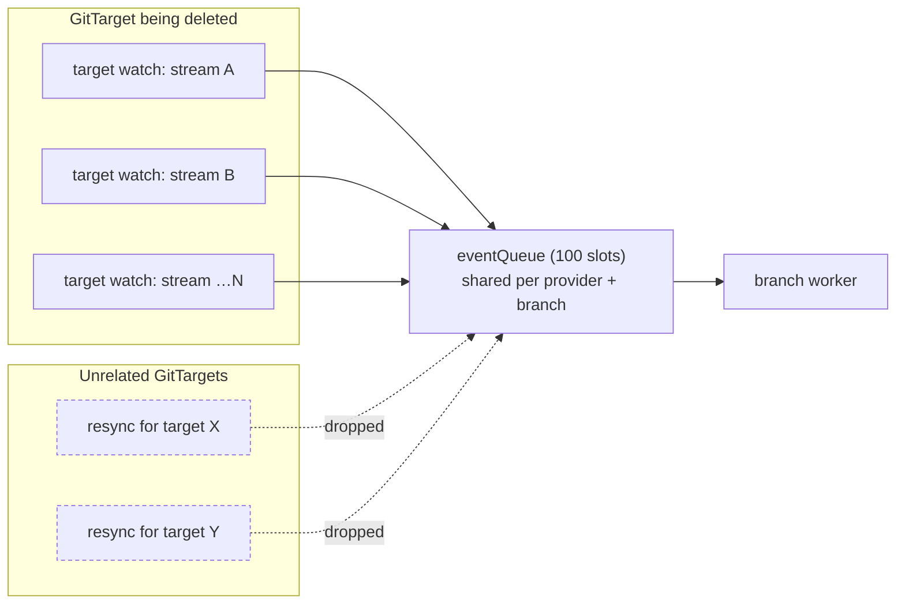
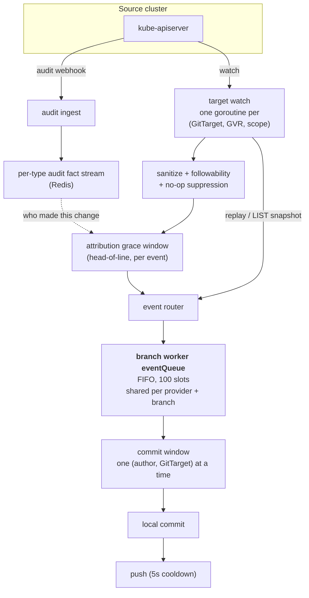
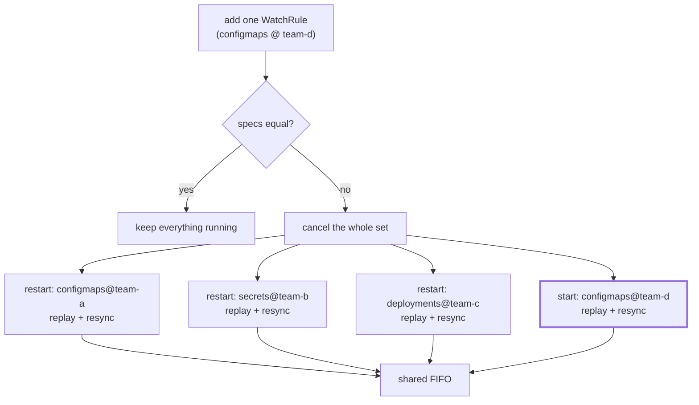
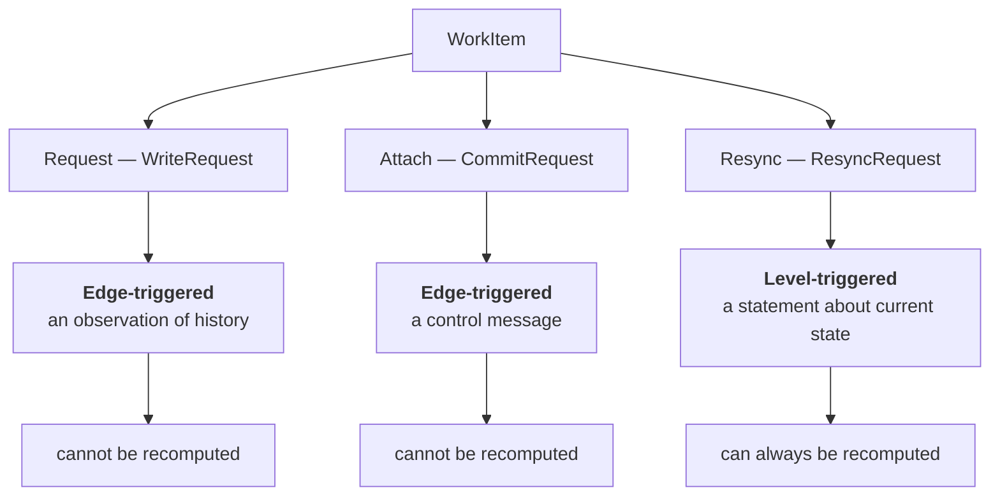
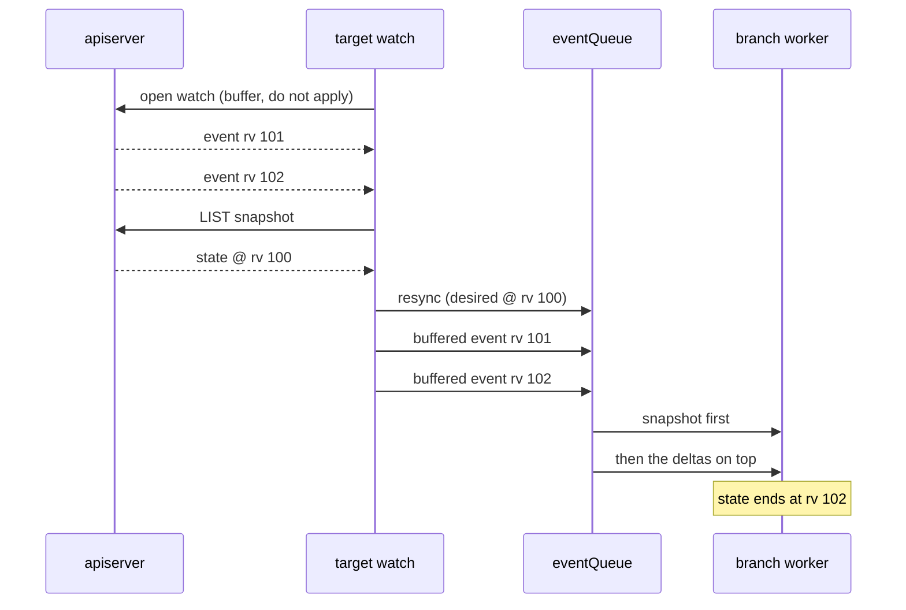
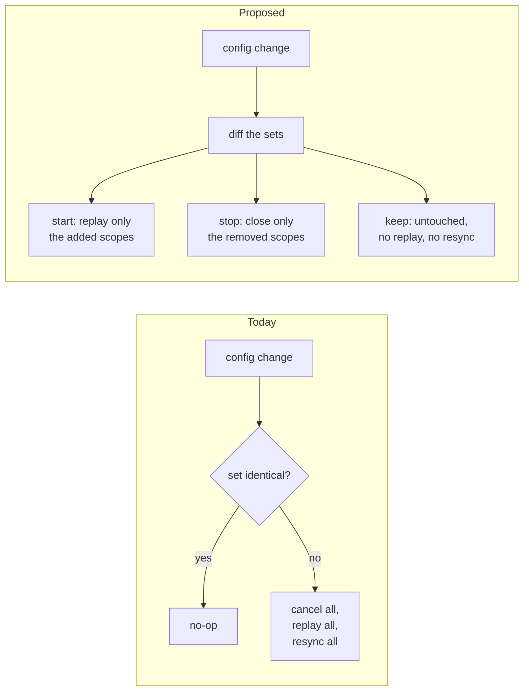
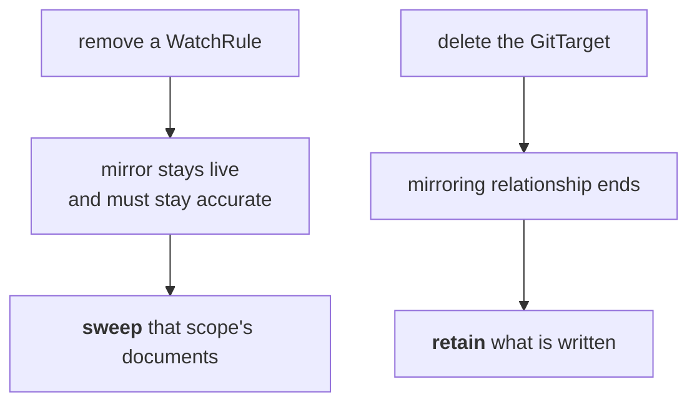
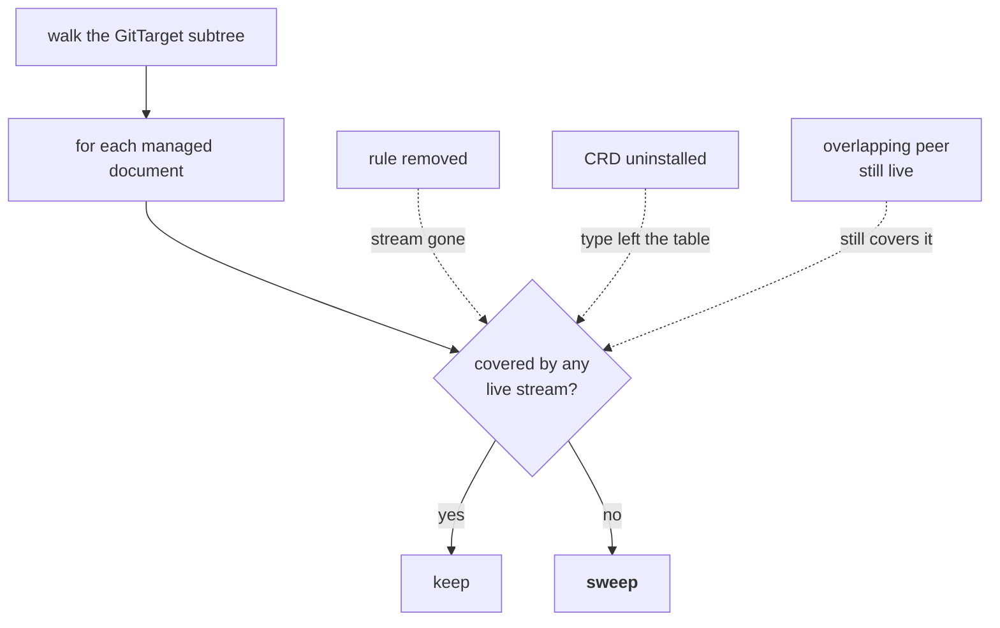
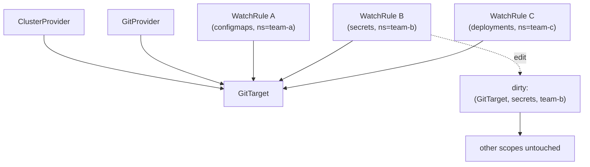
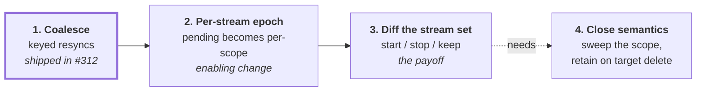

# Data-plane triggering: from an event pipe to a dirty set

> **design** — open, not yet built. Index: [`../INDEX.md`](../INDEX.md)

[`reconcile-triggering.md`](./reconcile-triggering.md) asks how the **control
plane** wakes up. This document asks the same question one layer down, about the
**data plane**: the branch worker's event queue, what travels on it, and which of
those things should not be travelling on a queue at all.

It starts from a concrete production failure, walks the pipeline as it works
today, separates the two jobs the queue is doing, and proposes moving one of them
to a level-triggered dirty set while leaving the other exactly where it is. It
also records why the current shape is not accidental: the snapshot and its FIFO
position together solve a real double-apply problem, and any replacement has to
solve it again.

---

## 1. What happened

CI run 32848418546 dropped **595 resync requests in 16 seconds**, and all 595
were for a *single* GitTarget whose namespace was being deleted:

```text
total dropped resyncs: 595
distinct GitTargets   : 1
    595  …test-manager-unsupported-folder/unsupported-folder-dest
```

A branch worker's `eventQueue` is a 100-slot FIFO shared by **every GitTarget on
one provider and branch**. One target saturated it; unrelated GitTargets on the
same branch then waited on resyncs that never entered the queue, and their
WatchRules never reached `Ready`. Five different e2e specs failed this way across
three attempts, which is why it read as flakiness rather than as one bug.



The mechanism was edge-triggered pathology. Each stream of the deleted target
looped `replay → enqueue resync → fail → reconnect → replay`, minting a **new
payload every 2 s backoff**, for a target that could never come back.

Two fixes shipped in [#312](https://github.com/ConfigButler/gitops-reverser/pull/312):

1. A deleted GitTarget is now **terminal** for its target watches (`errGitTargetGone`),
   so the loop stops instead of reconnecting. This removed the storm at source.
2. Queued resyncs **coalesce** by `(GitTarget, scope)`, so queue depth is bounded
   by the number of distinct scopes rather than by the request rate.

Fix 2 is the interesting one, because of what it implies.

---

## 2. How the pipeline works today

Two independent inputs converge on one FIFO. Understanding why they converge is
what makes the rest of this document decidable.



The parts that matter here:

- **Object state comes from watch, not from polling.** There is no periodic object
  LIST and no hourly drift sweep. A watch that is lost and re-established replays
  with `sendInitialEvents=true` and runs a **mark-and-sweep**: everything replayed
  is marked, and at the `initial-events-end` bookmark any managed Git file that
  was not marked is deleted, because the object is gone. That sweep is the only
  thing that reconciles a delete which happened while no watch was running.
- **Attribution comes from a different source.** The audit webhook feeds a
  per-type fact stream; the grace window waits on it to name the author. This is
  why an event is not recomputable: the author of a past change exists only in
  that stream.
- **Everything funnels through one FIFO per branch.** `GitTargetEventStream →
  BranchWorker` is a synchronous FIFO, so same-object and same-type order is
  strictly preserved, and the commit window groups by `(author, GitTarget)`.

See [`../architecture.md`](../architecture.md) sections "State ingestion and not
losing deletes", "Watch event ordering", and "Mark and sweep resync" for the full
treatment.

---

### 2.1 The stream set is already declarative, but the diff is all or nothing

This is the finding that reframes the rest of this document.

`targetWatchSpecs(table)` already computes the desired stream set as a map from
`(GVR, namespace)` to that stream's operation filter. The model is there. What is
missing is a **per-key** diff:

```go
func (m *Manager) prepareTargetWatchSetReplacementLocked(...) bool {
    prior := m.targetWatches[key]
    if prior == nil { return false }
    if !force && equalTargetWatchSpecs(prior.specs, specs) {
        return true          // identical set: leave everything running
    }
    prior.cancel()           // ANY difference: cancel EVERY stream for this GitTarget
    return false
}
```

`equalTargetWatchSpecs` is whole-set equality. So a declaration is either
untouched or replaced wholesale: adding one WatchRule cancels every stream the
GitTarget has and restarts all of them, and each restarted stream replays and
enqueues its own resync.

That is the storm shape from §1, reached by ordinary configuration change rather
than by deletion.

The reason is structural, and the code says so: the render-fidelity **epoch is
per-target**, not per-stream. `beginTargetRenderFidelityEpochLocked(target, keys)`
opens one epoch covering every scope, so a scope that resumed from its cursor
instead of replaying "would otherwise leave that scope pending in the new epoch
forever."



Only the bold one is new work. The other three are a full re-replay of state that
never changed.

---

## 3. The queue is doing two unrelated jobs

`WorkItem` carries three shapes. They do not have the same nature.



### 3.1 A write is edge-triggered and irreducible

```go
type Event struct {
    Operation     string // CREATE / UPDATE / DELETE
    AuditStreamID string // "<rv>-<seq>" on the per-type audit stream
    …
}
```

An `Event` is an *observation of something that happened*. "alice deleted this
ConfigMap at stream position X" cannot be recomputed from cluster state: the
object is gone, and the author exists only in the audit fact stream. Commit
windows are keyed per `(author, GitTarget)`, and the coverage watermark `Hc`
decides historical-versus-live suppression by stream position.

Order matters, attribution matters, and both are destroyed by collapsing this to
"something changed." **This half must stay a log.**

### 3.2 A resync is level-triggered and recomputable

```go
type ResyncRequest struct {
    Desired  []manifestanalyzer.DesiredResource // gathered from the live cluster
    Scope    *ResyncScope
    …
}
```

`Desired` is a *statement about current state*, gathered by listing the live
cluster. Throwing one away loses nothing: the next gather reconstructs it, and
reconstructs it fresher. The cluster is the source of truth.

**This half does not need a queue.**

---

## 4. Why a resync carries both a snapshot and a position

This is the part that is easy to get wrong, and it is the reason the current
design looks heavier than it needs to.

A resync is not applied into a vacuum. Live events for the same scope are
arriving while it is in flight, and the snapshot it carries was gathered at some
revision. Both facts have to be reconciled, and FIFO position is how.

The clearest case is the LIST fallback, where the ordering is explicit in the
code. When `sendInitialEvents` is unsupported, `targetWatchListAndStream`:

1. opens the watch and **buffers** its events without applying them;
2. LISTs a snapshot;
3. enqueues the resync for that snapshot;
4. records the cursor;
5. only then releases the buffered live events downstream.



Invert those and the snapshot lands **after** the edits it does not contain, and
mark-and-sweep reverts them. The events are not merely redundant, they are
unapplyable out of order: an event may already be included in the snapshot, so
its value is only defined relative to the snapshot boundary.

A second gate exists for the same hazard on the attribution side. The per-target
coverage head `Hc` records how far a target's reconcile covered, so an
audit-log entry at or below `Hc` is **historical** for that target (already
folded into the reconcile) and one above it is **live** (apply as its own commit).
Without that gate, entries get applied twice: once by the reconcile, once by the
tail. The full account is in
[the snapshot tail replay investigation](../finished/signing-snapshot-tail-replay-failure-investigation.md).

So the FIFO position is not an implementation detail a dirty set can discard for
free. It is the boundary that makes "snapshot, then deltas" well defined.

---

## 5. The coalescing map is already a dirty set

This is the tell. What #312 added is:

```go
pendingResyncs map[resyncKey]*ResyncRequest   // key: (GitTarget, GVR, namespace)
```

That is a dirty set, with a pre-gathered payload still bolted to each entry.
Depth is bounded by *state cardinality* (how many distinct scopes exist) rather
than by *event rate*, which is exactly the property a dirty set has and a queue
does not.

It is worth naming, because it shows the resync half was already drifting toward
level-triggered. But it treats the symptom. The question §6 asks instead is why a
configuration change produces a fan-out of resyncs at all.

---

## 6. Proposal: diff the stream set

Treat a configuration change as a **transition between two stream sets**. Compute
the set before and the set after, take the difference, and act only on it:

```text
keep    = same key, same StreamSpec     leave the handle running
restart = same key, different StreamSpec  cancel, then start fresh
start   = key only in the new plan      start fresh
stop    = key only in the old plan      cancel, then classify by cause
```

The `restart` row is easy to miss and was missing from the first draft of this
section. `targetWatchSpecs` keys on `(GVR, namespace)` with the **operation
filter as the value**, so an edit that changes only which verbs a rule follows
keeps its key and changes its spec. A diff that compares keys alone would keep a
stream that must be replaced.



Two properties make this work, and both are already true.

**The stream is the gather.** In the primary path there is no separate LIST: a
stream opened with `sendInitialEvents=true` replays current state as `ADDED`
events terminated by the `initial-events-end` bookmark, and *that replay is the
desired set*. So "avoid querying the apiserver directly" is already how it works,
and the LIST in `targetWatchListAndStream` is the compatibility fallback for
apiservers that refuse `sendInitialEvents`, not the normal route.

**Ordering is intra-stream, for a single stream.** Replay and live events arrive
on one stream in one goroutine, so for an added scope the boundary §4 requires is
defined *by the apiserver*, at the bookmark. That is the property to lean on, and
it is why this is better than the dirty-set sketch that previously occupied this
section: that one moved the ordering problem, this one avoids it for the common
case.

It does **not** hold in two cases, and the first draft of this section overstated
the guarantee by omitting them. Overlapping streams (a cluster-wide and a
named-namespace stream on one GVR) are concurrent peers delivering the same
object on two goroutines. And a `restart` produces a second snapshot for a scope
whose earlier events may still be queued. Both need an explicit fence, specified
in [TargetWatchPlan](target-watch-plan.md) §4.

The blast radius becomes proportional to the change. Adding a WatchRule replays
one scope. Removing one closes one scope. Editing an unrelated field on a
GitTarget touches nothing at all.

### 6.1 What this does to the queue question

Most of §5 stops mattering. If a declaration change no longer fans out N replays,
the resync storm has no fuel, and each remaining resync is the natural tail of a
single stream's replay rather than an independently gathered snapshot competing
for FIFO slots.

The coalescing added in #312 stays useful as a backstop, but it stops being the
thing standing between one busy GitTarget and everyone else on the branch.

---

## 7. What has to be answered first

### 7.1 Per-stream epoch and pending state (decided)

**Decision: state is kept per stream.** A stream is `running`, `new`, or
`deleted`, and a running stream carries its own epoch and pending state forward
across a declaration change.

This is the enabling change. Render fidelity is tracked per **target**
(`m.targetRenderFidelity[target.Key()]`) and an epoch is opened over the whole
scope set, which is precisely why an unchanged scope cannot resume today: it
would stay pending in the new epoch forever. Moving that fact to the scope is
what lets a kept stream survive a declaration change untouched.

### 7.2 What closing a stream means for Git (decided, with one conflict)

**Decision: removing a WatchRule deletes the documents that scope owned.** The
source cluster is the source of truth, Git is the ledger, and the ledger is kept
in sync as closely as possible. Nothing is left lying around.

**Removing the GitTarget does not.** The asymmetry is deliberate and coherent:
narrowing a scope edits a mirror that remains live and must stay accurate, while
deleting the GitTarget ends the mirroring relationship altogether. Sweeping is an
obligation only while we are responsible for the folder's accuracy; once we stop
mirroring, what is already written stands as a record.



**The conflict to resolve.** `spec.prune.mode` defaults to `OnEvent`: observed
deletes are mirrored, deletions *inferred* from a desired snapshot are not. A
scope-close sweep would be suppressed under that default, which is the opposite
of the decision above.

The way out is that a scope-close is neither of the two existing categories. [GitTarget deletion safety](watchrule-source-namespace/pr5-gittarget-deletion-safety.md)
separates **source evidence** (an observed DELETE) from
**inference** (mark-and-sweep against a snapshot, unsafe when the snapshot was
gathered against a wrong boundary). Removing a WatchRule is a third thing: an
explicit configuration act, stating intent directly rather than inferring it. It
carries no risk of a mis-scoped snapshot, because nothing is being compared.

That argues for scope-close deleting regardless of `prune.mode`. It should be
settled explicitly, because a user who set `mode: Never` may reasonably expect it
to mean never. Whatever is decided, a suppressed sweep is already observable
through [retention visibility](watchrule-source-namespace/pr5-retention-visibility.md).

### 7.2.1 Coverage, not per-scope close sweeps

The first draft of this section proposed sweeping a closed stream's scope. That
is the wrong shape. Two problems kill it, and both dissolve under a different
question.

**Problem one: overlapping scopes are real and deliberate.** A cluster-wide
stream (`namespace: ""`) is a peer of a named-namespace stream on the same GVR,
never a replacement for it, as
[stream scope collapse](watchrule-source-namespace/pr2-stream-scope-collapse.md)
records. `ResyncScope.Matches` treats an empty namespace as
*every* namespace, so an empty-desired sweep at `(configmaps, "")` would delete
documents a surviving `(configmaps, team-a)` stream still owns. Sweeping a closed
scope would need to subtract the survivors' scopes, which is fiddly and easy to
get wrong in exactly the direction that deletes user data.

**Problem two: a vanished type has no scope to close.** If a CRD is uninstalled,
its stream disappears without any close event naming it, and its documents resolve
to nothing. Per-scope sweeping can never reach them, so they accumulate as
unmanaged content. That is not a small edge: it is a silent, permanent leak in a
ledger whose whole promise is that it matches the cluster.

> **Superseded.** The coverage rule below is retained as the reasoning that led
> here, but it is not the design. Treating every uncovered document as sweepable
> conflates three materially different causes, one of which (an incomplete or
> degraded view) must never delete. The normative rule is the cause table in
> [TargetWatchPlan](target-watch-plan.md) §3. Coverage remains a useful
> **invariant to assert**, not a safe **action to take**.

**The better question is coverage.** Instead of "which documents did the closed
stream own", ask, of every managed document in the folder:

> Is there any live stream that still covers this?



One rule handles all three cases: a removed rule, an uninstalled type, and an
overlapping peer that keeps a document alive. No scope subtraction, no close
event required, nothing accumulating silently.

### 7.2.2 The check is cheap, and the data is already there

`WatchedType` already carries both identities:

```go
type WatchedType struct {
    GVK          schema.GroupVersionKind
    GVR          schema.GroupVersionResource
    NamespaceOps map[string]OperationSet   // "" key = cluster-wide
}
```

So coverage is a map lookup per document, keyed on **GVK**, with the namespace
rule that already exists:

```text
covered(doc) := some WatchedType wt where
    wt.GVK.Group == doc.group && wt.GVK.Kind == doc.kind
    && (wt.NamespaceOps has "" || wt.NamespaceOps has doc.namespace)
```

Keying on GVK rather than the resolved GVR is what makes the uninstalled-CRD case
work **without discovery and without provenance markers**. The document carries
its own `apiVersion` and `kind`; the table carries the Kind recorded when the
stream was declared. Nothing has to be resolved at sweep time, so a type that no
longer exists matches nothing and is swept.

This matters because we deliberately write **no provenance marker** into mirrored
documents: the mirror is meant to read as hand-authored YAML, and a committed
tracking annotation is actively harmful. Coverage-by-GVK gets the same answer
without writing anything into the user's files.

`ResyncScope.Matches` is already the single-scope form of this predicate. What is
missing is the any-of form over the whole live set.

### 7.2.3 The risk this creates, and the gate it needs

"Delete every managed document no live stream covers" is the most destructive
operation in the system. Its blast radius is the entire GitTarget folder, and it
is wrong in the dangerous direction whenever the stream table is **incomplete**
rather than narrower by intent: a controller still starting, discovery not yet
ready, rules not yet loaded, a source cluster briefly unreachable.

This is the same hazard
[GitTarget deletion safety](watchrule-source-namespace/pr5-gittarget-deletion-safety.md)
already names, one level up: a set that is complete-looking but gathered against
the wrong boundary. There, the protection is that an incomplete gather enqueues
no resync at all, so an outage stops a sweep rather than shrinking one.

Part of the protection already exists for the type-level case.
[Type lifecycle events and wobble settling](../spec/type-lifecycle-events-and-wobble-settling.md)
gives the registry a `RemovalGrace` (60 s) before a type that vanished from
discovery is treated as removed, so a discovery wobble does not empty the table
underneath a sweep. That covers types blinking out. It does **not** cover the
other ways the table can be incomplete: rules not yet loaded, a controller still
starting, a source cluster briefly unreachable.

So coverage sweeping needs the property stated explicitly, on top of that grace:

- the sweep runs only when the declared stream table is **known complete** for the
  target (discovery ready, rules resolved, source cluster reachable);
- anything less runs no sweep, rather than a sweep against a partial table.

That gate, not the matching, is the real work in this proposal. The matching is a
map lookup.

### 7.3 Changes that are not stream-shaped (already answered)

The destination fields are **immutable**, enforced by CEL on the type:

```text
spec.providerRef        is immutable
spec.branch             is immutable
spec.path               is immutable
spec.clusterProviderRef is immutable
```

with the message "delete and recreate the GitTarget to change its destination".
So there is no path-change transition to design for: changing a destination means
a new GitTarget, and the old one's folder is retained under §7.2. The class of
problem was removed by the API rather than solved by the data plane.

### 7.4 The scope invariant still holds

`ResyncScope` carries the invariant that the sweep scope must be exactly the
scope the desired set was gathered over: a narrower desired set than its sweep
scope **deletes managed documents**. Per-stream replay preserves this by
construction, because a stream's replay and its sweep are the same scope by
definition. That is a strengthening, not a risk.

## 8. One level up: invalidation granularity

The same argument applies to the config surface. A small change to one WatchRule
among many should not imply a full resync of its GitTarget.



An event pipe quietly encourages "resync everything, it is easier." A dirty set
keyed by `(target, GVR, namespace)` makes precise invalidation the natural thing
to express instead.

The relationship graph needed for this already half-exists in the control plane:
`gitTargetToWatchRules`, `gitProviderToWatchRules`, `clusterProviderToWatchRules`
mappers, and level-triggered status marks (`MarkTargetGitPathRefused` /
`MarkTargetGitPathAccepted`, render-fidelity scope clean/diverged). The control
plane already thinks in relationships and levels; the data plane still thinks in
events for both of its jobs.

---

## 9. Related work

Everything below already exists. This note sits on top of it rather than beside
it.

**The layer above.** [Reconcile triggering](reconcile-triggering.md) asks the same
question for the control plane: how controllers wake up, why a periodic requeue is
a safety net rather than a mechanism, and which dependency edges are missing. This
document is its data-plane counterpart.

**How ingestion works.**
[Architecture](../architecture.md) is the reference, in particular "State
ingestion and not losing deletes", "Watch event ordering", and "Mark and sweep
resync". [Watch-first ingestion](../finished/watch-first-ingestion-architecture.md)
is how the watch-first model was arrived at, and
[Reconcile via WatchList and mark-and-sweep](../spec/reconcile-via-watchlist-mark-and-sweep.md)
is the mechanism this note's §4 depends on.
[Watch event ordering under the attribution grace window](../facts/watch-event-ordering-and-attribution-grace.md)
has the worked examples behind the ordering claims.

**Scopes and streams.**
[Namespace-scoped resync](watchrule-source-namespace/pr1-namespace-scoped-resync.md)
and [stream scope collapse](watchrule-source-namespace/pr2-stream-scope-collapse.md)
established the per-scope stream model and why a cluster-wide scope is a peer of a
named one rather than a replacement. That is the overlap §7.2.1 has to handle.

**Deletion and retention.**
[GitTarget deletion safety](watchrule-source-namespace/pr5-gittarget-deletion-safety.md)
draws the line between observed evidence and inferred deletion, which is the line
a scope close has to be placed against.
[Retention visibility](watchrule-source-namespace/pr5-retention-visibility.md)
makes a suppressed sweep observable.

**Types and identity.**
[Type lifecycle events and wobble settling](../spec/type-lifecycle-events-and-wobble-settling.md)
gives `RemovalGrace`, which is the existing half of §7.2.3's gate.
[Typeset owns discovery grace](../spec/typeset-owns-discovery-grace.md) is where
that grace lives. [Type followability](../spec/type-followability.md) defines what
may be mirrored at all, and
[the GVK/GVR mapping layer](../spec/gvk-gvr-mapping-layer.md) is the identity
resolution §7.2.2 deliberately avoids depending on at sweep time.
[Unsupported folder refusal](../spec/unsupported-folder-refusal-plan.md) is the
acceptance gate that decides what a folder may contain before any of this runs.

**The longer-range picture.**
[Watch and catalog architecture](watch-and-catalog-architecture.md) is the target
model for how rules become concrete watched types.

---

## 10. Where we are



1. **Shipped.** Resyncs are keyed and coalesced; the storm source is fixed. This
   was a backstop, not the cure.
2. **Enabling change.** Make epoch and pending state per-scope, so a kept stream
   can carry its own forward (§7.1).
3. **The payoff.** Diff the stream set on a declaration change, so blast radius is
   proportional to the edit (§6).
4. **Decided, two details open.** A removed WatchRule sweeps what it owned; a
   deleted GitTarget retains its folder (§7.2). The sweep is expressed as
   coverage over the whole folder rather than per closed scope (§7.2.1), which
   needs a completeness gate (§7.2.3) and an answer on `spec.prune.mode`, whose
   `OnEvent` default would suppress it.

The writes stay a log throughout. The dirty-set sketch that earlier occupied §6
is superseded: leaning on `sendInitialEvents` keeps the gather inside the stream,
where its ordering is already guaranteed for the single-stream case.

**The implementable form of steps 2 and 3 is
[TargetWatchPlan](target-watch-plan.md)**, which carries the precise cell
lifecycle, the four-way classification, the cause table that decides what a
removal does to Git, the ordering fence, and the build order. This document is
the motivation; that one is the specification.
