# E2E Speedup Plan

## Goal

Make `task test-e2e*` faster for the three audiences that pay the cost:
local devs, AI agents, and CI.

Phased plan with explicit exit criteria. **Phase 0** ships the visibility
tooling that lets every later phase be measured against the same baseline.

Items considered and excluded (BeforeSuite short-circuit, CI matrix
sharding, cluster reuse, Tekton/Shipwright, dropping `Ordered` inside the
new Manager files) are in [e2e-speedup-skipped.md](e2e-speedup-skipped.md)
with rationale.

## Non-goals

- Rewriting the e2e harness from scratch.
- Reducing the number of e2e tests (this plan does not merge or delete
  specs; Phase 2 is a mechanical split that preserves spec count).

## Baseline (2026-05-28, warm devcontainer, k3d reused)

| | |
|---|---|
| Warm `task prepare-e2e` | **1.4 s** (everything stamp-cached) |
| Smoke suite (`task test-e2e`, 20 of 47 specs) | **418.7 s** (~7 min) |
| BeforeSuite (Go re-invoking warm prepare) | 1.4 s |

### Per-spec ranking (smoke filter, warm)

```
  Duration     %  Spec
   128.4 s  30.8  Restart Snapshot Safety keeps the git mirror intact when the controller restarts
    40.9 s   9.8  Commit Window Batching collapses a burst of events into one grouped commit and one push
    34.1 s   8.2  Aggregated API server should install and serve flunders through the aggregation layer
    28.9 s   6.9  Manager should create Git commit when IceCreamOrder CRD is installed via ClusterWatchRule
    25.7 s   6.2  Commit Signing should produce per-event commits verifiable locally and by Gitea
    25.2 s   6.0  Audit Redis Queue should enqueue incoming audit webhook events into a Redis stream
    24.4 s   5.9  Audit Redis Consumer should attribute the commit to the OIDC display name and email
    22.3 s   5.3  Commit Request finalizes a CommitRequest created with metadata.generateName
    21.9 s   5.2  Commit Request finalizes the open commit window on demand and reports the resulting SHA
    16.4 s   3.9  Audit Redis Consumer should produce a Git commit from an audit stream event
    15.5 s   3.7  Manager should delete Git file when ConfigMap is deleted via WatchRule
     9.9 s   2.4  Manager should create Git commit when ConfigMap is added via WatchRule
     9.1 s   2.2  Manager should commit encrypted Secret manifests when WatchRule includes secrets
     4.4 s   1.1  Manager should backfill pre-existing ConfigMap when WatchRule is added afterwards
     4.1 s   1.0  Manager should receive audit webhook events from kube-apiserver
     2.1 s   0.5  Manager should handle a normal and healthy GitProvider
     1.9 s   0.5  Manager should run successfully
     1.7 s   0.4  Manager should validate GitProvider with real Gitea repository
     0.1 s   0.0  Manager should ensure the metrics endpoint is serving metrics
     0.1 s   0.0  Manager should expose the controller service
   417.3 s  total
```

### Findings from the data

1. **Top 5 specs = 62 %** of smoke wallclock.
2. **`Restart Snapshot Safety` is 31 % alone.** 75 s of its 128 s is a
   passive negative-assertion wait.
3. **Namespace teardown is consistently 20–25 s** per spec (finalizer
   waits). Dominant cleanup cost — relevant to Phase 2's risk profile.
4. **Per-spec setup ~5–10 s.** Specs already use per-spec namespaces +
   repos; the structural blockers to parallelism are the shared
   `Manager` Describe and cluster-scoped resources (CRDs).
5. **`prepare-e2e` is a script, not a DAG.** Eight sub-tasks run
   sequentially via `cmds: - task: X`
   ([test/e2e/Taskfile.yml:106-119](../../test/e2e/Taskfile.yml#L106-L119))
   even though several stamps have no real interdependency.

## Phases

### Phase 0 — Visibility via Ginkgo's built-in reporting

**Why first:** every later phase claims a speedup. We need a structured,
machine-readable record before and after.

**Primary mechanism:** add `-ginkgo.json-report=...` to the e2e `go test`
invocations. Ginkgo writes a per-spec JSON report with names, durations,
labels, and pass/fail without any log scraping. Parse it with a small Go
tool (`test/e2e/tools/spec-timings/`) that takes the JSON path and prints
a duration-sorted table plus totals — same shape as the baseline above,
but driven by structured data, not regex-on-logs.

**Secondary mechanism (optional):** a tiny line-buffered timestamper at
`test/e2e/tools/ts/` (~20 lines of Go, `bufio.Scanner` over stdin) so
free-form logs can be decorated with wallclock when debugging cold runs
where structured JSON isn't enough. Not on the critical path.

**Why not a `ReportAfterEach` reporter:** Ginkgo's built-in
`--json-report` already covers this. No new reporter code needed.

**Exit criterion:** `go run ./test/e2e/tools/spec-timings <report.json>`
reproduces the per-spec table in this doc from a fresh `task test-e2e`
run.

### Phase 1 — Express `prepare-e2e` as a real DAG

**Change:** replace flat `cmds: - task: X` chains in `prepare-e2e` and
the upstream `install` flow with proper `deps:` so `task` schedules the
graph.

**Concrete parallel branches** (verified against current stamp wiring):

- `_age-key` (instant) is independent of `_cluster-ready` and
  `_project-image-ready`.
- `_cluster-ready` (~30–60 s cold) and `_project-image-ready` (~10–40 s
  on Go change) can run concurrently.
- `_image-loaded` joins both.
- `_flux-installed` → `_flux-setup-ready` → `_services-ready` chain
  depends only on `_cluster-ready`.
- `_sops-secret-yaml` only needs `_age-key`.
- `_aggregated-api-ready` joins `_services-ready` ∧ `_webhook-tls-ready`.

**Risk:** very low. Stamps make tasks idempotent; concurrent execution
can't corrupt. Side effect: interleaved logs. If that becomes a debugging
pain, keep a `prepare-e2e-verbose` alias that forces sequential
execution.

**Exit criterion:**

- Cold `task prepare-e2e` ≥ 25 % faster than the sequential baseline.
- Warm `task prepare-e2e` still ≈ 1.4 s.

**DAG (as implemented).** Two regressions surfaced during validation and
shaped the final shape:

- `portforward-ensure` had to stay *strictly sequential after*
  `_prepare-e2e-ready` (not a `deps:` peer): the k3d server-node restart
  inside `_webhook-tls-ready` kills any kubectl port-forwards started
  concurrently with it.
- `cleanup-installs.sh` (which wipes `.stamps/cluster/<ctx>/<ns>/`)
  needed to be its own DAG node, `_install-cleanup`, so
  `_sops-secret-yaml` can depend on it. Previously the cleanup ran inside
  `_install-{mode}` cmds, and in parallel mode `_sops-secret-yaml`'s
  status was evaluated *before* the cleanup, reported "up to date" from a
  prior run's stamp, and then the cleanup deleted the file out from
  under `_sops-secret-applied`. `_install-cleanup`'s status check
  (`test -f <current-mode>/install.yaml`) lets it stay idempotent across
  warm runs while still firing on a mode switch or a fresh CTX.

```mermaid
flowchart TD
    cluster([_cluster-ready]):::root
    age([_age-key]):::root
    imageid([_controller-image-id]):::root

    imageid --> imageready["_project-image-ready-local<br/>+ _project-image-ready"]

    cluster --> cleanup[_install-cleanup]
    cluster --> flux[_flux-installed]
    cluster --> imageloaded[_image-loaded]
    imageready --> imageloaded

    flux --> fluxsetup[_flux-setup-ready]
    fluxsetup --> services[_services-ready]

    age --> sopsyaml[_sops-secret-yaml]
    cleanup --> sopsyaml

    services --> install["install dispatcher<br/>+ _install-&#123;mode&#125;"]
    cleanup --> install

    install --> ctrl[_controller-deployed]
    imageloaded --> ctrl
    ctrl --> webhook[_webhook-tls-ready]

    services --> aggkube["_aggregated-api-<br/>webhook-kubeconfig-ready"]
    webhook --> aggkube
    aggkube --> aggapi[_aggregated-api-ready]

    sopsyaml --> sopsapplied[_sops-secret-applied]
    install --> sopsapplied

    ctrl --> ready[_prepare-e2e-ready]
    webhook --> ready
    sopsapplied --> ready
    aggapi --> ready

    services --> pf[portforward-ensure]
    ready ==> prepare([prepare-e2e]):::top
    pf ==> prepare

    classDef root fill:#e8f4f8,stroke:#0066cc,stroke-width:2px
    classDef top fill:#f0e8f8,stroke:#6600cc,stroke-width:2px
```



Legend:

- Thin arrows are go-task `deps:` — parallel-safe; a task starts as soon
  as all incoming arrows have completed.
- Thick arrows are sequential `cmds:` ordering inside `prepare-e2e`
  itself (the only place where ordering is not expressed via `deps:`).
- Blue nodes (`_cluster-ready`, `_age-key`, `_controller-image-id`) have
  no deps. Purple is the user-facing entry point.
- The `install` node collapses three steps that act as a single unit:
  the templated dispatcher `install` (`task: 'install-{{.INSTALL_MODE}}'`),
  the per-mode wrapper `install-{helm,config-dir,plain-manifests-file}`,
  and the leaf `_install-{mode}` it depends on. Each `_install-{mode}`
  carries its own build-side dep from `Taskfile-build.yml`
  (`helm-sync`, `manifests`, or `dist-install`); those are elided here
  to keep the diagram readable.

The critical path on a cold run is
`_cluster-ready → _flux-installed → _flux-setup-ready → _services-ready
→ install → _controller-deployed → _webhook-tls-ready
→ _aggregated-api-webhook-kubeconfig-ready → _aggregated-api-ready
→ _prepare-e2e-ready → portforward-ensure`. Everything else folds onto
that path before its outputs are needed.

**Measured impact:** cold `task prepare-e2e` 230 s → 213 s (7.4 %), well
short of the 25 % target. Honest accounting: the Flux ramp-up is a
strictly serial ~150 s of that budget and the docker image was cached in
this run, so the parallel branches (`_age-key`/`_sops-secret-yaml`,
`_image-loaded`, `_install-cleanup`, `manifests`) only saved the ~17 s
of work they would have spent on the critical path sequentially. With a
fresh Go build (the scenario the original plan estimate assumed),
`_project-image-ready` would absorb tens of seconds of additional cluster
ramp-up and the gain should approach the original estimate. Warm
`task prepare-e2e` stays at 1 s — no regression.

### Phase 2 — Mechanical split of the `Manager` Describe

The `Manager` Describe in
[test/e2e/e2e_test.go](../../test/e2e/e2e_test.go) is a single `Ordered`
block of 21 specs sharing a package-global `managerRepo` and a
`gitprovider-normal` GitProvider implicitly created by spec #10. Two
specs hold `time.Sleep(5*time.Second)` admitting cross-spec state leak.

**Scope.** This phase is a *mechanical* refactor:

- Keep all 21 specs as they are; preserve spec count and observable
  behavior.
- Move them into four files (see below), each its own top-level Describe
  with its own per-file fixtures.
- Replace the package-global `var managerRepo *RepoArtifacts` with a
  per-Describe local; each file's BeforeAll calls `SetupRepo` for itself.
- Move the cluster-scoped CRD ownership into the file that owns it
  (see Phase 2.5 / CRD isolation).

**Out of scope for this phase:**

- No spec merging (e.g. old #18+#19+#20 stay three separate specs;
  collapsing them is a follow-up).
- No `Ordered` removed *within* the new files.
- No Ginkgo parallelism enabled yet (Phase 2.5).
- No fix for the two `time.Sleep(5s)` hacks (separate root cause).

**Spec inventory** (read 2026-05-28):

| # | Spec | What it needs | Cleanup |
|---|------|---------------|---------|
| 1 | should run successfully | controller pod up | sets `controllerPodName` |
| 2 | should expose the controller service | `controllerPodName` from #1 | — |
| 3 | should expose the audit service separately | `controllerPodName` from #1 | — |
| 4 | should ensure the metrics endpoint is serving metrics | `controllerPodName` from #1 + log scrape | — |
| 5 | should receive audit webhook events from kube-apiserver | global Prometheus audit counter (delta-based) | deletes its CM |
| 6 | should validate GitProvider with real Gitea repository | `managerRepo` HTTP creds | deletes its GitProvider |
| 7 | should handle GitProvider with invalid credentials | `managerRepo` invalid creds | deletes its GitProvider |
| 8 | should handle GitTarget with nonexistent branch pattern | `managerRepo` HTTP creds | deletes its GitProvider + GitTarget |
| 9 | should validate GitProvider with SSH authentication | `managerRepo` SSH creds | deletes its GitProvider |
| 10 | should handle a normal and healthy GitProvider | `managerRepo` HTTP creds | **leaves `gitprovider-normal`** |
| 11 | should reconcile a WatchRule CR | `gitprovider-normal` | deletes own WR + GT |
| 12 | should commit encrypted Secret manifests when WatchRule includes secrets | `gitprovider-normal` | deletes own resources |
| 13 | should generate missing SOPS age secret when … generateWhenMissing | `gitprovider-normal` | deletes own resources |
| 14 | should create Git commit when ConfigMap is added via WatchRule | `gitprovider-normal` + **5 s sleep** | deletes own resources |
| 15 | should backfill pre-existing ConfigMap when WatchRule is added afterwards | `gitprovider-normal` | deletes own resources |
| 16 | should delete Git file when ConfigMap is deleted via WatchRule | `gitprovider-normal` + **5 s sleep** | deletes own resources |
| 17 | should create Git commit when IceCreamOrder CRD is installed via ClusterWatchRule | `gitprovider-normal` | **leaves CRD installed** |
| 18 | should create Git commit when IceCreamOrder is added via WatchRule | CRD from #17 (also re-applies) | **leaves WR + GT + CRD** |
| 19 | should update Git file when IceCreamOrder is modified via WatchRule | WR + GT from #18 | leaves them |
| 20 | should delete Git file when IceCreamOrder is deleted via WatchRule | WR + GT from #18 | leaves them |
| 21 | should delete Git file when IceCreamOrder CRD is deleted via ClusterWatchRule | CRD still installed | deletes CRD globally |

The shared `AfterAll` (L1712) then cleans up `watchrule-icecream-orders`,
its GitTarget, `gitprovider-normal`, and the CRD.

**Proposed file layout** (label `manager` kept on all four so
`task test-e2e-manager` keeps working unchanged):

### Characteristics of the new files

| File | Specs | Needs Gitea repo | Controller intervention | Ordered by design | Touches cluster-scoped objects | Touches global metrics | Leaves resources behind across specs | Parallel-safe with other groups | Smoke time today |
|---|---|---|---|---|---|---|---|---|---|
| `controller_basics_e2e_test.go` (Group A: specs 1–5) | 5 | **no** | no | partial — specs 2–4 reuse `controllerPodName` from #1 | no | yes — Prometheus audit counters (delta read) | no | yes | ~6 s |
| `gitprovider_validation_e2e_test.go` (Group B: specs 6–9) | 4 | yes — `managerRepo` HTTP/SSH/invalid creds | no | no — each spec creates+deletes its own GitProvider | no | no | no | yes | ~2 s (only #6 in smoke) |
| `watchrule_configmap_secret_e2e_test.go` (Group C: specs 10–16) | 7 | yes — `managerRepo` + shared `gitprovider-normal` in BeforeAll | no | no — once `gitprovider-normal` is in BeforeAll, specs 11–16 are independent (the two `time.Sleep(5s)` hacks aside) | no | no | yes — own `managerRepo` accumulates commits across specs in distinct subpaths | yes (own namespace) | ~41 s |
| `crd_lifecycle_e2e_test.go` (Group D: specs 17–21) | 5 | yes — `managerRepo` + `gitprovider-normal` in BeforeAll | no | **yes** — #18 hands WR+GT to #19+#20; #21 destroys the CRD others rely on | **yes — owns its own per-file CRD** (see CRD isolation, Phase 2.5) | no | yes within the file (intentional) | yes (own CRD name → no collision with other groups) | ~29 s (only #17 in smoke) |

**Column glossary:**

- **Needs Gitea repo** — does the file need `SetupRepo()` in BeforeAll?
  A "no" is a meaningful setup saving.
- **Controller intervention** — does any spec restart, scale, or
  perturb the controller deployment? None of these do; kept as a column
  because it's the property that flags Phase 2.5's Serial registry.
- **Ordered by design** — would removing `Ordered` change the test's
  observable contract? "Partial" / "no" means we keep it for now but
  it could be dropped without semantic change.
- **Touches cluster-scoped objects** — flags CRD, ClusterWatchRule,
  cluster RBAC. Main parallel-safety risk.
- **Touches global metrics** — Prometheus counters shared across
  specs. Delta-based reads make this safe within one run.
- **Leaves resources behind across specs** — depends on a resource
  created by a previous spec in the same file (Ordered intent), or
  leaks past `AfterAll`?
- **Parallel-safe with other groups** — could this file run on a
  Ginkgo worker in parallel with the others? After Phase 2.5's CRD
  isolation, yes for all four.
- **Smoke time today** — sum of per-spec durations from the
  2026-05-28 baseline for specs labelled `smoke`. Lower bound, not a
  total.

**Per-file design notes:**

1. **`controller_basics_e2e_test.go`** — no `managerRepo` setup at all.
   BeforeAll only verifies the controller pod exists. Specs 1–5. Saves
   the repo/secrets/SOPS setup this group never used.
2. **`gitprovider_validation_e2e_test.go`** — BeforeAll creates a
   per-file namespace + `managerRepo`. Specs 6–9.
3. **`watchrule_configmap_secret_e2e_test.go`** — BeforeAll creates a
   per-file namespace + `managerRepo` + `gitprovider-normal`. Old #10
   becomes the BeforeAll. Each remaining spec keeps its own WR+GT
   create/delete. The two `time.Sleep(5s)` hacks stay.
4. **`crd_lifecycle_e2e_test.go`** — BeforeAll creates a per-file
   namespace + `managerRepo` + `gitprovider-normal`. Internal `Ordered`
   carries specs 17 → 18 → 19 → 20 → 21. **Owns its own per-file CRD**;
   AfterAll deletes it.

**Risks:**

- **Sequential runs may get slower** before Phase 2.5 lands. Each new
  file adds a namespace teardown (`cleanupNamespace` in
  [test/e2e/helpers.go:254](../../test/e2e/helpers.go#L254) hits
  finalizer waits of 20–25 s). Three extra namespaces ≈ 60–75 s of
  added wallclock if Phase 2.5 is not yet on. Phase 2 and Phase 2.5
  should land back-to-back; if shipping just Phase 2, advertise as a
  prerequisite, not a speedup.
- Group A's audit-events spec (#5) reads global Prometheus counters
  with a delta pattern. Preserve baseline-before-act ordering.
- CRD cleanup ownership moves to `crd_lifecycle_e2e_test.go` — verify no
  other file still expects it to be present or absent at startup.
- N Gitea repos created per run instead of 1. Each ~1 s. Acceptable.

**Exit criterion:**

- 21 specs from the old `Manager` Describe run as 21 specs across 4
  files. No spec merged or removed. Suite green.
- Per-spec timings (from Phase 0 JSON report) unchanged within noise.
- No new shared state between the four Describes.

### Phase 2.5 — Enable bounded Ginkgo parallelism + Serial registry

Without this phase, Phase 2's wallclock is *worse* than today on
sequential runs. This phase is what realises the speedup.

**Change:**

- Add `E2E_GINKGO_PROCS` (default e.g. `2`) wired into
  [test/e2e/Taskfile.yml:194](../../test/e2e/Taskfile.yml#L194) so
  `go test ... -ginkgo.parallel -ginkgo.procs=$E2E_GINKGO_PROCS`. Local
  default sane for a devcontainer; CI may pass a higher value when
  Phase 6 (separately, not in active plan) is reconsidered.
- Establish a **suite-wide Serial registry** — a short list of test
  containers marked `Serial` because they touch shared cluster-scoped
  state that cannot be isolated by name alone. Created as a living
  document `docs/design/e2e-serial-registry.md` in this phase. Initial
  entries from the 2026-05-28 audit:
  - `restart_snapshot_e2e_test.go` — restarts the controller deployment;
    interferes with any other test reading or writing through the
    controller while restarted.
  - Anything else that performs `kubectl delete crd` cluster-wide or
    rolls the controller. Phase 2.5 PR populates the initial list from
    a grep audit; afterward, adding cluster-scoped writes requires
    updating the registry in the same PR.

**CRD isolation (the easier solution).** The shared
`icecreamorders.shop.example.com` CRD currently appears in:

- [test/e2e/e2e_test.go](../../test/e2e/e2e_test.go) (Manager block; moves to
  `crd_lifecycle_e2e_test.go` in Phase 2)
- [test/e2e/restart_snapshot_e2e_test.go:94-96](../../test/e2e/restart_snapshot_e2e_test.go#L94-L96)
- [test/e2e/bi_directional_e2e_test.go:130](../../test/e2e/bi_directional_e2e_test.go#L130)
- [test/e2e/e2e_suite_test.go](../../test/e2e/e2e_suite_test.go) (pre-run cleanup)

Rather than serialise these three files against each other, **give each
its own CRD** in its own API group:

| File | CRD group | Kind |
|---|---|---|
| `crd_lifecycle_e2e_test.go` | `crd-lifecycle.e2e.example.com` | IceCreamOrder |
| `restart_snapshot_e2e_test.go` | `restart-snapshot.e2e.example.com` | IceCreamOrder |
| `bi_directional_e2e_test.go` | `bi-directional.e2e.example.com` | IceCreamOrder |

Implementation: take the existing
[test/e2e/templates/icecreamorder-crd.yaml](../../test/e2e/templates/icecreamorder-crd.yaml)
fixture and templatize the group + plural. Each test renders its own.
The pre-cleanup in `e2e_suite_test.go` deletes all three by name.

This removes the cross-file shared cluster-scoped state and lets the
three files run in parallel without any Serial marking. The Serial
registry then only needs to capture genuinely process-level conflicts
(restart_snapshot at the controller-deployment level, future ones).

**Risks:**

- Hidden ordering assumptions only surface under `-procs > 1`. Run for
  a stability window (say 10 consecutive clean runs) before flipping
  the default.
- Some helpers may write to package-global state. Phase 2 already
  removes the only obvious one (`managerRepo`); audit during this PR.

**Exit criterion:**

- `task test-e2e` with `E2E_GINKGO_PROCS=2` runs green across N
  consecutive runs (N decided when starting; suggested 10).
- Smoke wallclock drops by at least the parallel-safe Group A+B+C share.
- Serial registry exists and is non-empty.

**Implementation status & where we are (2026-05-29 — read this first on resume).**
Landed on branch `refactors` (PR #159). `gh` works directly now — no
`unset GH_TOKEN` needed.

**What is implemented (and green locally at `procs=2`):**

- **Parallelism is driven by the `ginkgo` CLI, not `go test`.** `go test`
  has no `-ginkgo.procs` flag (it only accepts the `-ginkgo.parallel.*`
  flags the CLI sets on its workers). `test-e2e`, `test-e2e-full` and
  `test-e2e-manager` now run
  `go run github.com/onsi/ginkgo/v2/ginkgo --procs={{.E2E_GINKGO_PROCS}}`
  (pinned to the module version to avoid a CLI/library mismatch).
  `E2E_GINKGO_PROCS` defaults to `2`.
- **`SynchronizedBeforeSuite`** runs `prepare-e2e` + CRD pre-cleanup once
  on process #1; the `E2E_AGE_KEY_FILE` fallback runs per-process.
- **Per-file CRD group isolation** via `test/e2e/icecream.go`:
  `crd_lifecycle`/`restart_snapshot`/`bi_directional` each own a group
  (`*.e2e.example.com`); the shared `icecreamorders` plural means every
  kubectl reference is qualified `icecreamorders.<group>`.
- **Serial registry** ([e2e-serial-registry.md](e2e-serial-registry.md))
  is larger than the initial audit: `restart_snapshot`, `image_refresh`,
  `aggregated_api` (controller/APIService level) **plus** the four
  `audit-redis`-labelled containers (`Audit Redis Queue/Consumer`,
  `Commit Window Batching`, `Commit Request`) — they share one global
  audit pipeline (webhook → Redis → consumer) and cross-contaminated each
  other's commits — **plus** `bi_directional` (asserts exact commit counts
  to prove no commit loop; broken by any concurrent controller activity).
- **Timeouts widened for parallel/slow load:** `verifyResourceStatus`
  readiness 30s → 90s (post-CRD-install the controller's discovery cache
  lags before serving the new GVR, so a dependent WatchRule can't reach
  Ready in 30s); manager ConfigMap-delete `Eventually` 30s → 60s; signing
  commit-waits 60s → 90s.

**Commits on `refactors` since the `1205369` squash:** `cad9903` (Serial:
bi-directional + audit pipeline), `9942e0c` (readiness 90s), `dba83ac`
(this doc), `1294814` (k3d agents 1→2), `452961c` (signing 90s), `b7a00b4`
(k3d agents 2→3).

**Measured (local devcontainer, `procs=2`):** smoke **352 s** vs 418.7 s
sequential baseline (~16 %); cold full **45/45** in ~20 min; warm full
**45/45** in ~17 min. Rock solid locally across smoke + 2 full runs. The
full-suite gain is modest *by design*: the heavy specs are `Serial` for
correctness and the single biggest spec, `Restart Snapshot Safety`
(~128 s), is Serial and untouched until Phase 3. Smoke's ~16 % is the
honest gain today; the bigger win is Phase 3.

**Resolution for merge — CI full is sequential, local remains parallel
(2026-05-30).** On the stock `ubuntu-latest` GitHub runners the single
controller is **CPU-starved** under two concurrent test streams plus its
own CPU-heavy SSH-signing/git work. Symptom: a *different* spec times out
each run (crd_lifecycle WatchRule readiness; watchrule "create"; signing —
the last failed even at a 90 s wait, i.e. genuine starvation, not a tight
timeout). The follow-up run after 3 agents also failed during setup while
waiting for `helmrelease/kro`, so the blocking CI signal is broader than
spec logic: runner/resource pressure plus external chart/registry
readiness.

GitHub API throttling was checked with `gh api rate_limit` and was not the
limiting factor (4967/5000 core requests remaining at review time). The
workflow now uploads any Ginkgo JSON reports and writes a per-spec timing
summary to the GitHub job summary so build-server timings are visible.

Applied fallback:

- CI **E2E (full)** sets `E2E_GINKGO_PROCS=1`.
- Local/default `task test-e2e*` remains `E2E_GINKGO_PROCS=2`.
- k3d local/default agents remain 3 for `procs=2`; CI passes
  `K3D_AGENT_COUNT=1` because the full job is sequential.
- Warm k3d cluster reuse now verifies the expected node count and Ready
  condition instead of trusting `kubectl get ns` plus stamps.

History that led here:
Progression tried:
- 1 agent → red.
- **2 agents** (`1294814`) → E2E (full) went **green once**, then **red**
  on the next run (`452961c`, signing at 90 s). Reduced but didn't
  eliminate.
- **3 agents** (`b7a00b4`) → E2E (full) went **green** (run
  `26660720283`). But this is **one** green run, and 2 agents also went
  green-once-then-red, so stability is **not yet proven** — needs a few
  consecutive green reruns before we trust it. The 3→1 drop was originally
  due to `fs.inotify.max_user_instances` (default 128) exhaustion; that is
  now mitigated to 512 by `ensure_inotify_limits`, so 1 server + 3 agents
  is possible but no longer the CI default. Confirmed the suite uses a **single** cluster (the
  `audit-pass-through-e2e` cluster seen locally is an unrelated leftover).

**Next after merge:** start **Phase 3** (below) on a *separate* branch —
it touches production controller code (`internal/telemetry` +
`internal/watch`) and cuts the Serial `Restart Snapshot Safety` spec
(~128 s, the dominant remaining cost).

### Phase 3 — Target-scoped reconcile-complete + drain signal for `Restart Snapshot Safety`

**Why a pod-level gauge alone is insufficient** (per reviewer): a
pod-scoped "initial reconcile complete" can be set after
`ReconcileForRuleChange` returns
([internal/watch/manager.go:679](../../internal/watch/manager.go#L679))
while snapshot writes for a specific GitTarget are still pending — they
flow through `MaybeReplaySnapshot`
([internal/watch/manager.go:1216](../../internal/watch/manager.go#L1216))
and enqueue via the branch worker
([internal/watch/git_target_event_stream.go:139](../../internal/watch/git_target_event_stream.go#L139))
which then pushes asynchronously. The restart test's negative assertion
("the mirror is not wiped after this restart") requires evidence that
*this GitTarget's* post-restart processing has fully drained, not just
that the pod started.

**Change.** Pair two signals:

1. **`gitopsreverser_target_initial_reconcile_complete{namespace,name}`**
   — gauge per GitTarget, flips to `1` once its post-(re)start initial
   reconcile pass has completed end-to-end (snapshot decision made,
   queue submission completed).
2. **`gitopsreverser_branch_worker_queue_depth{namespace,name,branch}`**
   — gauge of pending work items for this branch worker. Wait for `0`
   to confirm the queue has drained.

The metric package is `internal/telemetry/` (not `internal/metrics/` —
see `internal/telemetry/exporter.go`); add the new metrics alongside
the existing ones.

**Restart test reframe:**

1. Rollout-restart the controller deployment.
2. Wait for `target_initial_reconcile_complete{ns,name} == 1` for the
   restart test's GitTarget.
3. Wait for `branch_worker_queue_depth{ns,name,branch} == 0`.
4. Apply a short stability window (a few seconds).
5. Assert no destructive commit happened.

**Risks:**

- The new metrics' contracts must be exact enough to be load-bearing in
  a test. Document the lifecycle of each in code comments. Treat as a
  public observability surface from day one — renaming costs cluster
  rollouts.
- Worker-queue-depth must include in-flight items, not just queued ones,
  or step 3 races with the worker. Verify against the actual
  implementation when writing the metric.

**Exit criterion:**

- Spec runs in < 30 s (down from 128 s).
- Both metrics are scrapable via the existing Prometheus pipeline.
- Suite still green; no regressions in other restart-related specs.

## Decisions

- **File naming.** Files use the form `<topic>_e2e_test.go`. The CRD
  lifecycle file is `crd_lifecycle_e2e_test.go` (consistent throughout
  this doc; earlier drafts used `manager_icecream_lifecycle_test.go`
  inconsistently — fixed).
- **Label.** All four new Describes keep `Label("manager")` so
  `task test-e2e-manager` works unchanged. Renaming the label is a
  separate decision not in this plan.
- **No spec merges in Phase 2.** The earlier draft proposed collapsing
  old #18+#19+#20 into one create→update→delete spec; deferred to a
  follow-up so the Phase 2 PR is purely mechanical and easy to review.
- **Metric package is `internal/telemetry`.** Confirmed against
  `internal/telemetry/exporter.go`. No `internal/metrics` directory
  exists.
- **CRD isolation over Serial marking.** Where multiple e2e files
  install the same cluster-scoped CRD, the cheap fix is to give each
  file its own CRD group (Phase 2.5). Serial marking is reserved for
  conflicts that name-isolation can't fix (e.g. controller restart).

## Reproducing the baseline

```bash
task prepare-e2e
mkdir -p /tmp/e2e-baseline
go test -timeout 15m ./test/e2e/ \
  -ginkgo.v -ginkgo.label-filter=smoke \
  -ginkgo.json-report=/tmp/e2e-baseline/smoke.json
go run ./test/e2e/tools/spec-timings /tmp/e2e-baseline/smoke.json
```

(`test/e2e/tools/spec-timings/` is a Phase 0 deliverable.)
