# Event pipeline overview: from a watch event to a Git commit

> **Snapshot, 2026-10-04, at #413 step 5c.** A picture-first tour of how a change
> in the cluster becomes a commit today, with the replay paths drawn out and an honest list of
> what is still missing. It describes behavior that exists. The plan that changes it is
> [`gittarget-branch-worker-log.md`](gittarget-branch-worker-log.md); the longer-term event model
> is [`branch-worker-event-model.md`](branch-worker-event-model.md).

## 1. The whole pipeline on one page

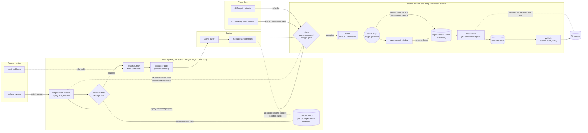

Read it left to right:

1. **One watch stream per collection.** A `GitTarget` that watches ConfigMaps in `apps` has one
   stream for `(configmaps, apps)`. It starts with a replay of current state and then streams live
   changes.
2. **A live change is checked, attributed, and routed.** The desired-state change filter passes
   creates, deletes, and changes to Git-visible content, including retained metadata. It drops
   unchanged UPDATEs, counted as `watch_events_total{outcome="unchanged"}`. The author comes from
   audit facts. The producer gate prevents retired streams from enqueueing behind their replacements.
3. **The branch worker admits it or refuses it.** Admission is non-blocking: a full FIFO, a
   stopping worker, or a paused intake gate refuses the item. A refused live event travels back up
   as an error, the session ends, and the cursor stays put. When the branch has paused intake, the
   stream waits for it to reopen before it reconnects.
4. **One goroutine owns everything after the FIFO.** It collects live events into a commit window,
   decides writes into the log, materializes them into commits, and publishes them.

Several `GitTarget`s that write to the same provider and branch share one worker, and with it one
FIFO, one log, one checkout, and one retry schedule.

## 2. The watch stream: replay, live, and resume

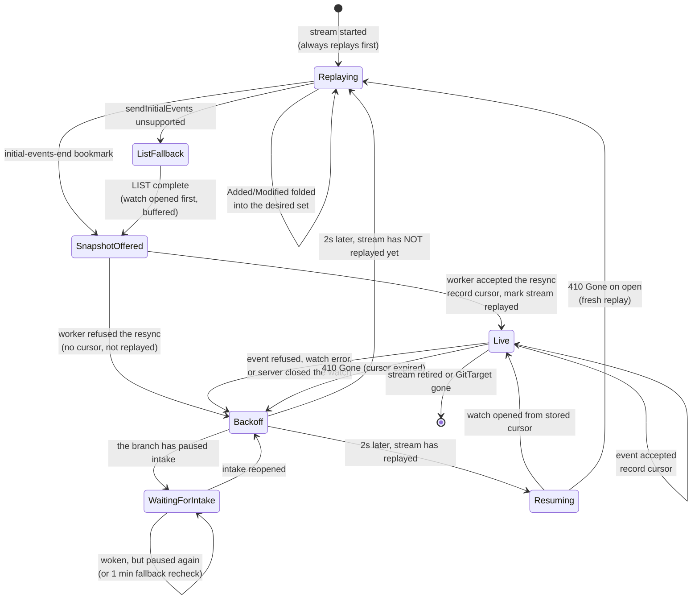

Four rules hold this together:

- **A new stream always replays.** Starting a stream issues a fresh render-fidelity revision for
  its collection; resuming an old cursor would never report that revision, so the scope would stay
  pending forever.
- **A stream resumes only after its own replay was accepted** (step 5a). If the worker refuses the
  snapshot, the stored cursor still belongs to a previous stream, so the reconnect replays again.
- **The cursor only moves past what the worker accepted.** A refused event ends the session before
  the cursor is written; an event that a retiring stream never enqueued records no cursor at all.
- **A stream waits for a paused branch** (step 5b). Before every reconnect the stream asks
  its branch worker whether intake is paused, and if so waits on a channel the worker closes when
  it reopens. Reconnecting on the 2s backoff would gather a snapshot the branch refuses again,
  for as long as the outage lasts.

### The step 5a case, as a sequence

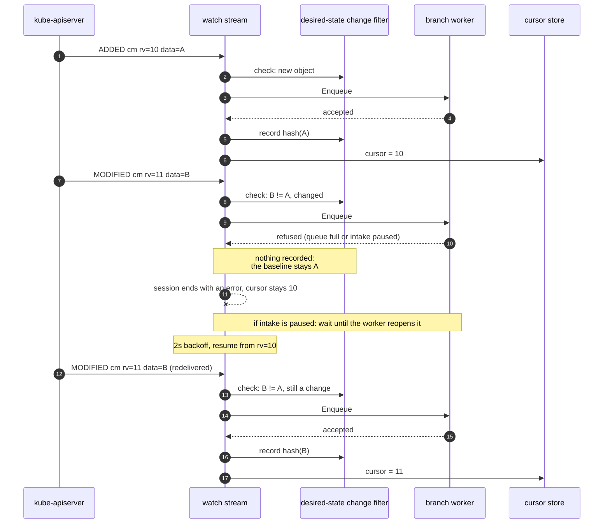

Before step 5a, the hash of B was recorded at step 8, so the redelivered frame matched it, was
skipped as unchanged, and the cursor moved to 11 without the worker ever seeing B.

### The desired-state change filter

The filter keeps status churn out of the FIFO. It also protects commit windows: `/status` updates
have no audit author, so passing one can close a named author's window even when Git has no diff.

Each stream owns its baselines: a hash per UID of what the worker last accepted, from a live event
or from the stream's accepted replay snapshot, which replaces them all. A refused or unfinished
replay installs nothing. A `GitTarget` cannot hold two overlapping collections, so one stream is the
only producer for an object. See
[step 5a2](gittarget-branch-worker-log.md#step-5a2-desired-state-change-filter-built).

## 3. Three different things called "replay"

The word covers three mechanisms that guarantee different things. Most confusion about recovery
comes from mixing them up.

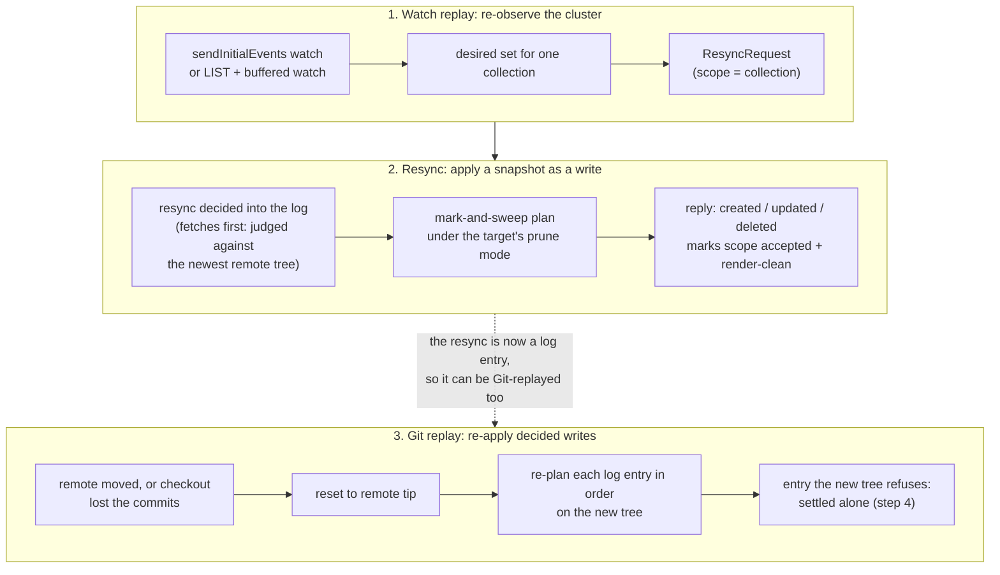

| Replay | Input | What it recovers | What it cannot recover |
|---|---|---|---|
| Watch replay | Current cluster state | Current content of every object in scope | Intermediate versions, who made them, which save they belonged to |
| Resync | One collection's desired set | Git matches that set; with `prune.mode: always`, objects gone from the cluster are swept | With `onEvent` (the default), a delete that happened while nobody watched cannot be inferred from absence |
| Git replay | The in-memory log | Every decided write, in order, with its message, author, and save | Anything lost with the process: the log is not persisted |

### Resync coalescing and fences

A resync rides the same FIFO as live events, so it lands in arrival order. Several snapshots for
the same scope collapse into one, but never across a live write for that scope:

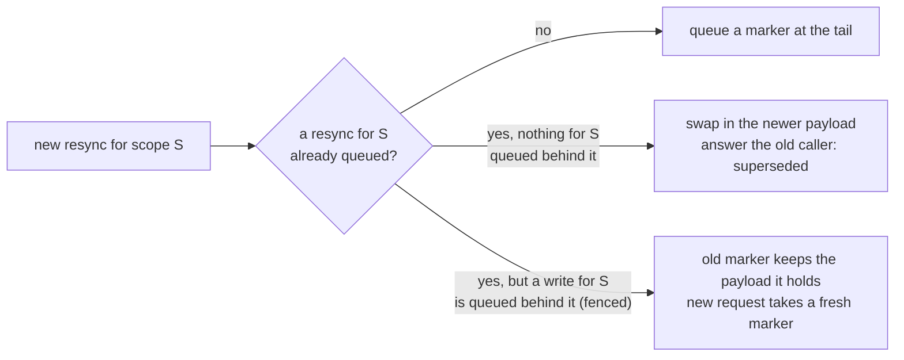

Swapping a payload behind a live write would let the older write overwrite the newer snapshot, so
the fence (`tailPassed`) forces a new position instead. The payload the old marker holds may be a
request swapped into it earlier; since step 5b that request runs, where before it was dropped and
its caller never answered.

A resync marked `Heal` (a re-anchor that must not close another target's window) is parked until
the window is idle. No production producer sends one today; the watch replay sends `Heal=false`,
which closes the open window first to keep arrival order.

## 4. Inside the branch worker: inputs and the loop

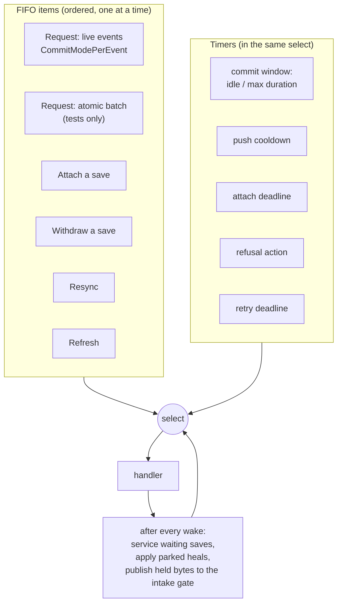

Everything the loop does starts from one of these eleven inputs. Two more act from outside the
select: worker shutdown (context cancel) and `SetParentBranch`, an atomic setter that the push's
admission check reads.

### How a commit window closes

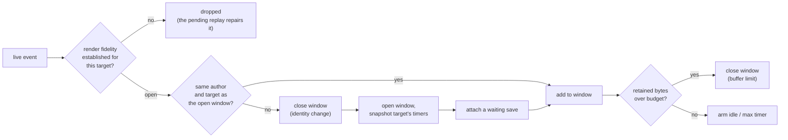

Other things that close a window: the idle or maximum-duration timer, an atomic batch or a
non-heal resync (to keep arrival order), a save with `attach: Next`, and shutdown. A closed window
becomes one decided write.

The other write gate, `spec.suspend`, applies later, when the write is committed: a suspended
target's events are dropped, its folder is still scanned so its status stays fresh, and resuming
replays current state.

## 5. The log: decide, materialize, publish

Every write takes one path, whatever produced it: a closed window, a resync, a save's empty
record, a refusal's empty commit, or an atomic batch.

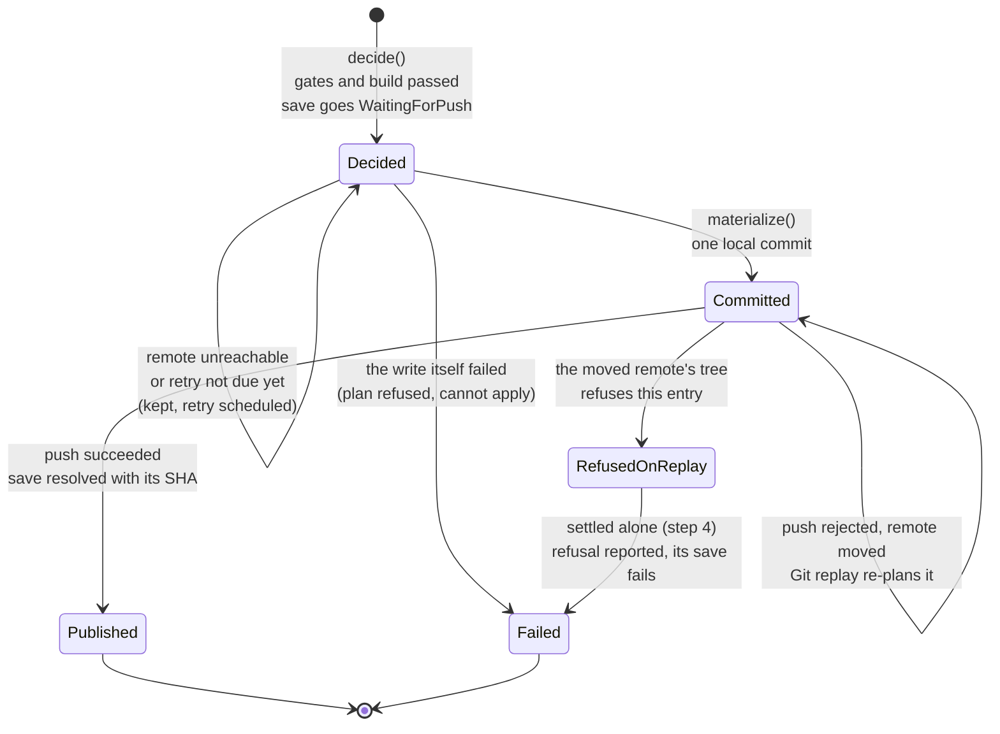

Three outcomes, classified in exactly one place (`settleCommitted`, `settleFailed`,
`settleUnreachable` in [`branch_log.go`](../../internal/git/branch_log.go)):

- **Committed**: the write is now a commit in the checkout, waiting to be pushed.
- **Failed for good**: the write itself was refused. Only that entry leaves the log.
- **Unreachable**: the remote could not be reached. Everything stays for the retry.

The checkout is a *projection* of the log: the remote tip the writes were planned on, plus one
commit per materialized entry. The worker tracks how many entries the checkout holds
(`checkoutApplied`); when that is unknown, `materialize` resets to the remote tip and replays.

### Publishing, with a rejection

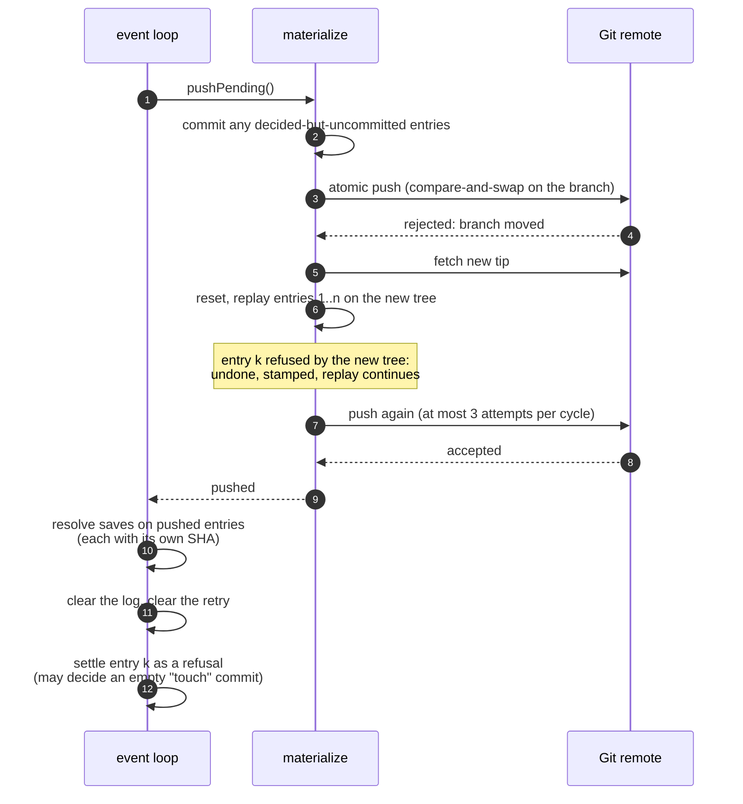

The refused entry is taken out before the pushed saves resolve and settled after the log is
cleared, because settling it can decide new work.

Every Git call in this sequence is bounded: two minutes per advertisement, fetch, or push session,
and five minutes for the whole cycle. When a push fails without a rejection (a deadline, a dropped
connection), the cycle probes the remote. If the branch is at the commits it sent, the push landed
and only the reply was lost, so the cycle settles as published instead of replaying them.

## 6. Retry and intake

One retry deadline covers everything the worker still owes: 10 seconds, doubling to 5 minutes.
While a parent branch is missing, the deadline's attempt is a single advertisement probe;
otherwise it materializes and pushes. The deadline records the failure it is waiting out and when
the outage began. The worker publishes both, with the intake pause, as its publication report:
every `GitTarget` on the branch shows it on `Ready`, and a held save in its message. The report
changes only when one of those does, so a retry that fails the same way writes no status.

```mermaid
stateDiagram-v2
    [*] --> Healthy
    Healthy --> RetryPending: an attempt failed<br/>scheduleRetry(cause)
    RetryPending --> RetryPending: new decisions wait<br/>(no connection spent);<br/>a resync is answered with the cause
    RetryPending --> Attempt: retry deadline fires
    Attempt --> Healthy: published, nothing owed<br/>clearRetry(): intake reopens
    Attempt --> RetryPending: failed again<br/>backoff doubles

    state RetryPending {
        [*] --> IntakeOpen
        IntakeOpen --> IntakePaused: a payload would take<br/>held + queued past the budget<br/>(default 8 MiB)
    }
```

The intake gate ([`intake.go`](../../internal/git/intake.go)) applies only while a retry is
pending; a healthy branch never pauses, because its log drains at the next push.

- **What it counts.** Payload on the FIFO, charged at enqueue so producers cannot fill the FIFO
  between two loop iterations, plus what the loop holds: the open window, the log, parked heals,
  and saves waiting for a window. Every item is charged 1 KiB beyond its payload and message, so
  empty saves and refusal commits count and the budget bounds the item count too. Sizes are
  serialized YAML, estimated once by the producer.
- **Pausing is a latch.** The first payload that does not fit is refused and pauses the branch.
  Only a cleared retry reopens it. Room under the budget again, a partial replay, or a remote that
  can be read but refuses the push keep it paused.
- **Waking producers.** `BranchWorker.IntakePaused` returns a channel the gate closes when it
  reopens; the watch streams wait on it.

What each producer does when the gate refuses it:

| Producer | On refusal | Comes back through |
|---|---|---|
| Live watch event | Session ends, cursor not advanced | Waits for intake, then the cursor resume redelivers the frame |
| Replay snapshot | Session ends, stream not marked replayed | Waits for intake, then the reconnect replays again |
| Snapshot larger than the whole budget | Refused during an outage, with both sizes in the message | Gathered again once the branch reopens; accepted on a healthy branch |
| Save attach | Dropped | The `CommitRequest` controller re-sends on its next poll |
| Save withdraw, refresh | Not refused by a pause: lifecycle work | Only a full FIFO or a stopping worker drops them; the sender asks again |

## 7. A save (`CommitRequest`) from start to finish

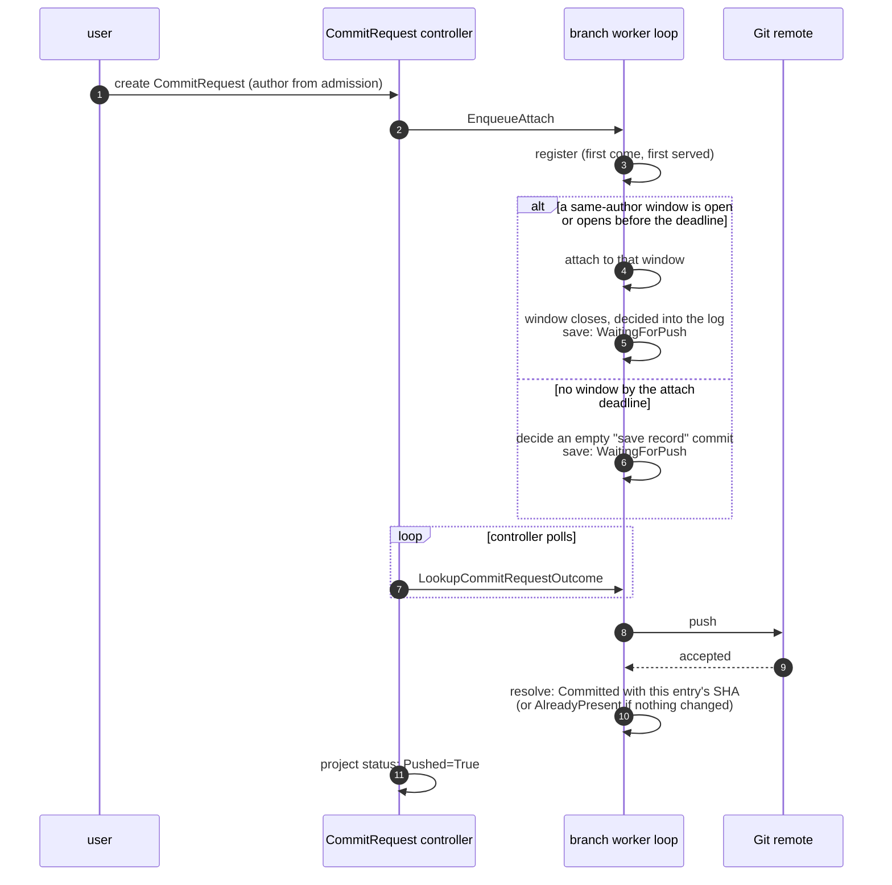

The controller never fails a save the worker still holds. Past its safety bound it sends a
withdraw, and the worker decides: an unattached request can be withdrawn, an attached one stays
`WaitingForPush` until it publishes.

## 8. What is an event today, and what is not

The direction in [`branch-worker-event-model.md`](branch-worker-event-model.md) is an
event-sourced state machine per branch. Today the worker is a single-owner event loop that is
partway there:

```mermaid
flowchart LR
    subgraph YES["Explicit, ordered inputs"]
        Y1["6 FIFO item kinds"]
        Y2["5 timers in one select"]
        Y3["5 log entry kinds<br/>(window, atomic, resync,<br/>save record, refusal touch)"]
        Y4["3 settle outcomes"]
    end
    subgraph PARTLY["Recorded, but only in memory"]
        P1["the log itself"]
        P2["save registrations<br/>and outcomes"]
        P3["retry deadline<br/>and intake pause"]
    end
    subgraph NO["Implicit inputs a decision still reads"]
        N1["time.Now()"]
        N2["live GitTarget / GitProvider config"]
        N3["render-fidelity gate"]
        N4["synchronous Git results"]
        N5["SetParentBranch, shutdown"]
    end
    YES --> PARTLY --> NO
```

| Concern | Today |
|---|---|
| Single owner of branch state | Yes: one goroutine per worker |
| Ordered inputs | Yes, for what enters the FIFO; timers interleave by wall clock |
| Decisions as recorded facts | Partly: the log records decided writes; window membership, save attachment, and timer firings are not recorded |
| Effects separated from decisions | Partly: `decide` and `materialize` are separate, but both run synchronously on the loop |
| Replayable without side effects | No: replaying would call Git and read current config |
| Durable | No: everything after the FIFO is in memory |

## 9. What we do not have yet

This is the honest list. Each item names who plans to close it, or says nobody does yet.

### Durability

- **Nothing after admission survives a restart.** The FIFO, the log, open windows, save
  registrations, and outcomes are in memory. The watch cursor *is* durable (Redis), so it can be
  ahead of work the process lost. A restart replays every stream, which repairs current content
  under each target's write gates and prune policy. It does not restore decided writes,
  intermediate versions, authors, or save membership. Owner: the
  [HA and durable delivery plan](../future/ha-gittarget-distribution-plan.md); deferred.
- **A save published shortly before a crash loses its receipt.** A re-sent request can create a
  second empty commit. Owner: HA plan.

### Bounded work

- **Git call budgets are fixed.** Since step 6 every call to a Git server ends within two minutes
  and a push cycle within five, over HTTP and SSH alike. The values are not configurable, so a
  depth-1 fetch that needs longer fails every attempt. Local work inside a cycle has no bound of
  its own. Owner: nobody yet; a flag waits for a measured need.
- **A lost push reply is settled by evidence only in the simple case.** When the remote is still at
  the commits a failed push sent, step 6 publishes them as they are. When another writer pushed on
  top in the meantime, the writes replay and a save's empty commit lands twice. Exactly-once is not
  promised. Owner: HA plan.

### Bounded memory and pause/resume

Step 5b closed the gaps this section used to list: queued payload, empty records, parked heals,
and waiting saves are counted; the pause holds until a push lands; producers wait instead of
polling; resyncs respect the retry deadline; and an oversized snapshot has an explicit path. What
remains:

- **The budget counts serialized bytes.** A queued object is held as an unstructured map of
  about six times its YAML size, so the 8 MiB default is well below the memory it stands for. Owner: nobody yet;
  documented in [Interpreting metrics](../interpreting-metrics.md).
- **A healthy branch's FIFO is bounded by count only.** The budget applies while a retry is pending;
  until then, up to 1,000 queued items cost memory on top of the window and the log. By design: a
  healthy branch drains.
- **Work the loop derives can overshoot.** A refusal's empty commit is decided from work already
  accepted, and work accepted before the outage began is kept, so the held total can pass the
  budget by that much, and no further.

### Status and observability

- **The outage reason is generic.** Since step 5c every `GitTarget` on a branch that cannot publish
  reports `Ready=False` under `Progressing`, with the start, the cause, and the pause in the message,
  and a held save carries the same cause. A dedicated reason such as `PublicationFailing` waits for
  a measured need. Owner: nobody yet.

### Watch history and ordering

- **Kubernetes watch history is not an archive.** An expired cursor forces a fresh snapshot. With
  the default `prune.mode: onEvent`, a delete that happened while nothing was watching is not
  inferred from absence. Inherent; documented, not planned.
- **Arrival order is not a save barrier.** A save can reach the worker before an earlier edit
  from an independent watch. Only the documented attachment contract is claimed. Not planned.
- **A snapshot reply means "applied locally".** It is no publication receipt. Render fidelity
  is proven against the fresh tree the resync fetched. By design.

### Not yet event-sourced

- **Decisions read implicit inputs**: the clock, live configuration, the fidelity gate, and Git
  results. Replaying the same items tomorrow can produce different windows. Owner: the transition
  boundary in [`branch-worker-event-model.md`](branch-worker-event-model.md), after the log plan.
- **Timers, attaches, withdrawals, and refreshes are not recorded as transitions.** Owner: the PR
  after #413.
- **Known structural smells in the log**: the `followUps` flag (a pass producing work inside
  itself), `checkoutApplied` living on the worker instead of with the log, and two replay
  functions (`replayOntoRemote` and its locked wrapper). Owner: the same follow-up.

### High availability

- **One process owns a branch.** There is no failover, no handoff of a worker's obligations, and
  no shared journal. Owner: HA plan; deferred.

## Where to read the code

| Piece | File |
|---|---|
| Watch streams, replay, resume, desired-state change filter | [`internal/watch/target_watch.go`](../../internal/watch/target_watch.go) |
| Routing, resync replies, fidelity marks | [`internal/watch/event_router.go`](../../internal/watch/event_router.go) |
| Enqueue into a worker | [`internal/reconcile/git_target_event_stream.go`](../../internal/reconcile/git_target_event_stream.go) |
| Admission, FIFO, loop, windows, push | [`internal/git/branch_worker.go`](../../internal/git/branch_worker.go) |
| Intake budget and pause | [`internal/git/intake.go`](../../internal/git/intake.go) |
| Log, decide, materialize, settle | [`internal/git/branch_log.go`](../../internal/git/branch_log.go) |
| Retry deadline | [`internal/git/retry.go`](../../internal/git/retry.go) |
| Publication report and backlog gauges | [`internal/git/publication.go`](../../internal/git/publication.go) |
| Resyncs and heals | [`internal/git/resync_flush.go`](../../internal/git/resync_flush.go) |
| Saves | [`internal/git/commit_request_attach_loop.go`](../../internal/git/commit_request_attach_loop.go) |
| Missing parent probe | [`internal/git/parent_recovery.go`](../../internal/git/parent_recovery.go) |
