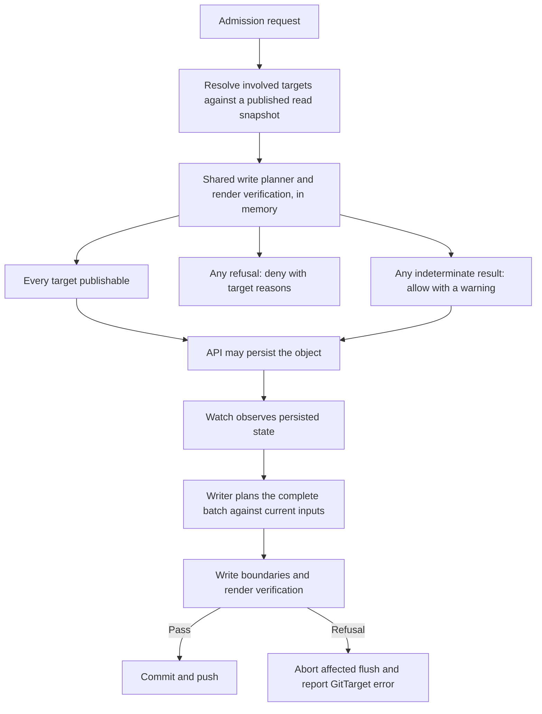

# Git write preflight: warn or reject unpublishable edits at admission

> Status: proposal, not implemented. This document recommends the next feature for the editing
> surface workflow. The two-refusal model, the any-target refusal rule, and the advisory
> (fail-open) posture are decided direction. API names and diagnostic shapes remain illustrative.

## Purpose

This feature is an opt-in fast feedback path for editing surfaces that expect their changes to be
reverse-written into a supported Git source. Its job is to answer one narrow question while the
author is still making the edit:

> Can this requested object change be represented by the writer's currently supported source
> operations for every involved `GitTarget`?

That makes it a structural allow/warn/disallow check. It is about known support boundaries:
base-owned fields that would need unsupported patch authoring, writes that would escape a target's
source scope, fields supplied by transformers, sibling objects that would move, ignored paths,
unsupported source features, and objects with no publishing destination. It is not about
race-proofing Git, policing concurrent editors, or proving the push will later succeed. Kubernetes
remains the accepted state of record; the writer follows that state and still performs
authoritative checks before committing.

Use this gate where a user is editing a live object as a shortcut for producing Git they expect to
keep. Do not enable it merely because the operator observes a namespace. Live-cluster mirroring,
audit capture, and discovery should continue to accept API writes even when the mirror cannot
represent every field.

## Recommendation

Build a shared, read-only Git write preflight and expose it through an opt-in validating admission
webhook. When the writer can establish that a proposed object change has no supported destination,
reject the request before persistence with a reason the author can act on. When it cannot establish
that within its budget, allow the request and say so in a warning.

**This is an advisory gate, not a guarantee.** It catches what is knowable from state the operator
already holds, quickly and without touching the network. It is deliberately not a proof that a
change will reach Git. See [What this gate is and is not](#what-this-gate-is-and-is-not).

Prioritize this over broader Helm support or additional source transformations for the editing
surface use case. It makes the existing supported surface easier to trust: an author learns that a
live change cannot be reverse-written while making it, instead of discovering a stalled target
afterward.

Call the operation **Git write preflight**. “Cannot be reverted” sounds like the operator cannot
undo a change. “Cannot be reversed” is closer, but still ambiguous. The question here is whether
the writer can publish the proposed live-state change back to Git.

Use validating admission because the decision is acceptance or rejection. The handler should
preserve the author's requested object. Kubernetes runs validating admission after mutation; its
[admission documentation][kubernetes-admission] describes the ordering and response contract.

### Implementation bar

Implement this only if the first version stays inside the narrow contract above. It is worthwhile
when it gives a fast, local answer for common edits that would otherwise make the `GitTarget` turn
red after the user's command already succeeded. It is not worthwhile if it recreates admission or
audit as a second state-capture path, waits on the writer, performs Git work in the webhook path, or
claims coverage for subresources and coordinated batches it cannot faithfully model.

The fallback remains valuable and simpler: make late structural failures turn the affected
`GitTarget` red quickly and clearly. Preflight exists to move some of those messages earlier for
editing surfaces, not to replace target status as the authoritative publication signal.

## The user-visible problem

Today Kubernetes can accept an object update that the publisher subsequently refuses. The author
gets success in the terminal, while the publishing failure appears later on a `GitTarget`.

[Layout corpus shape 8][shape8] makes this concrete. A Deployment comes from a base outside the
production overlay's write scope:

| Proposed change | Current write result | Proposed admission result |
|---|---|---|
| Change its image | Author an overlay `images:` entry and verify the render. | Allow when the single-object preflight passes. |
| Change a base-owned environment variable | Refuse the flush because the planned write escapes the target. | Reject with the field, source path, and unsupported operation. |

An illustrative rejection:

```text
Cannot publish this change through GitTarget checkout-prod.

Field: spec.template.spec.containers[name=app].env
Source: apps/checkout/base/deployment.yaml
Write scope: apps/checkout/overlays/prod

This change requires authoring an overlay field patch, which is not
supported. Add the patch through a Git PR, then refresh the editing view.
```

The message must reflect the computed reason. Field-level attribution may be unavailable for some
refusals; report an object or path-level reason in those cases. Never suggest an editor refresh
command unless that deployment has a supported refresh workflow.

Kustomize can express an environment variable through a patch. The limitation is that this writer
does not yet author the required patch. Distinguish unsupported source transformations from
claims that an edit is mathematically impossible.

## Two refusal surfaces, with authoritative write checks

The supported model has two user-facing refusal surfaces:

| Surface | Question | Failure behavior |
|---|---|---|
| Onboarding and renewed target validation | Can this target manage its repository scope? | Refuse the target and report its error. |
| Admission preflight | Is any involved target known to be unable to publish this object change? | Reject the API request before persistence, naming the blockers; warn when the question could not be answered. |

Write-time checks remain authoritative underneath both surfaces. They defend against stale
admission decisions, direct Git changes, configuration changes, and operation paths outside
admission coverage. They are mandatory correctness checks, not a third per-edit accounting model.

There is no partial publication contract, standing unreflected set, or new `FullyReflected`
condition in this design. If the writer discovers that accepted state cannot be published, refuse
the affected flush and put the affected `GitTarget` into error. Do not report the target as healthy
while silently saving only the fields that happen to fit.

Carry forward these principles:

- Keep every write inside its authorized source boundary; never fall back to shared context.
- Give the actor an actionable reason at admission whenever the problem is known there.
- Reject a mixed supported/unsupported object update as one request.
- Recheck the current repository and complete flush before committing.
- Surface failures that escape admission through the target's error state.

An admission rejection alone does not make a healthy target erroneous. Nothing changed in the
cluster. A target error means its current repository or accepted state cannot be processed safely.

### What this gate is and is not

The promise for a covered request is deliberately narrow:

> No involved target is **known**, from state the operator already holds, to be unable to publish
> this change.

That is not the same as "every target will publish it". Three properties of the deployment make the
stronger promise unbuyable at any acceptable price:

- **Speed.** An admission handler sits in the synchronous path of every covered write. A gate that
  fetches before answering makes every `kubectl apply` in the cluster as slow as a Git round-trip.
- **Availability.** A gate that must reach the forge to answer hands the forge a veto over cluster
  edits. Hosted Git is not reliable enough to be placed in that position, and an operator whose
  writes stop because GitHub is degraded is worse than one whose mirror is briefly behind.
- **Time of check to time of use.** Even a fresh answer is stale by the time the object persists.
  Git can move underneath it, and a direct commit never traverses Kubernetes admission at all.

So preflight answers from a local snapshot, without a network call, and accepts that its guarantee
is snapshot-relative. It must not reject a request the writer would publish when evaluating that same
snapshot, but a stale published snapshot may still contain blockers that current inputs have already
removed. In that stale case the gate can falsely reject a request that a fresh writer evaluation
would publish.

This shapes the whole design. **A denial is a finding; an allow is only the absence of one.**
Say so in user-facing documentation and keep the asymmetry visible in the messages themselves.

What the gate still catches is the majority of real cases, because the expensive-to-know failures
are not the common ones. A base-owned field edit with no overlay patch authoring
([shape 8][shape8]) is computable from the local snapshot with no freshness requirement at all:
it depends on the repository's *shape*, which does not change between one `kubectl apply` and the
next. The cases lost to staleness are races, which no admission gate wins.

Acceptance therefore guarantees no future commit and no atomic publication across targets.
Onboarding acceptance is likewise revision-dependent: it is not a permanent certificate that every
future commit on the branch is supported.

### What preflight can and cannot answer

State this plainly in user-facing documentation, because the value of an advisory gate depends
entirely on people knowing which half they are in. The dividing line is simple: preflight answers
questions about the **shape of the repository and the shape of the change**, both of which it can
read from a branch filesystem it already has. It cannot answer questions about **the future or the
network**.

Answerable from the offline copy, and therefore reliable:

| Question | Raised by |
|---|---|
| Is this field owned by a base outside the target's write scope? | render attribution, [shape 8][shape8] |
| Would the planned write escape `spec.path`? | `pathScopePrecondition` |
| Would it write into context shared by more than one render root? | `fanInPrecondition` |
| Would it land on a path `.gittargetignore` shadows? | `ignoreShadowPrecondition` |
| Would the resulting render move an object this change did not intend? | `renderPrecondition` |
| Is this field supplied by a build transformer or owned by a tolerated patch? | source-form and patch checks |
| Is the folder structurally unsupported (undecodable build file, remote base)? | acceptance gate |
| Does the object resolve to no publishing destination at all? | target resolution |
| Would the delete patch collide with an existing file? | placement, once skipped-plan refusals land |

Not answerable, and never claimed:

| Question | Why not |
|---|---|
| Will the push succeed? | Credentials, protected branches, and forge availability are all outside the snapshot, and reaching for them is what this design refuses to do. |
| Has Git moved since the worker last fetched? | The snapshot is exactly as fresh as the last fetch. A direct commit never passes through admission at all. |
| Will a concurrent batch change the answer? | The sibling-agreement case is a property of a whole flush; admission sees one request. |
| Is this target publishable right now? | A target with no local copy, or an unreported render epoch, is `Cannot assess` by construction. |
| Does a `/scale` or other subresource edit publish? | Not until the parent-object adapter exists. Until then it is excluded from coverage and said so. |
| Is encrypted or reduced-render content publishable? | Those checks are intentionally narrower; a verdict there states what was checked, not that everything was. |

The useful property of this split is that the first table does not decay. Repository shape changes
when someone commits, not between one `kubectl apply` and the next, so a shape-derived refusal is
as true a second later as it was when computed. The answers lost to staleness live entirely in the
second table, where the honest response was never anything but "cannot know".

### Where useful answers exist today

The existing tests and layout corpus support a limited but useful first surface. These are writer
facts, not admission facts; the webhook still needs its own persistence and warning tests.

| Source shape | Useful preflight answers | First-version limits |
|---|---|---|
| Flat and tree folders, namespaces serialized ([shapes 1 and 3][shape-readme]) | Placement, in-place edits, `pathScopePrecondition`, `.gittargetignore` shadow checks, and fan-in checks where a plan touches shared context. | No claim about a downstream deployer that later rewrites the object. |
| Namespace-free flat/tree folders ([shapes 2 and 4][shape-readme]) | The same file-placement and write-boundary answers, plus the existing one-source-namespace fence. | The external namespace supplier is intentionally unverifiable. |
| Single Kustomize folders ([shape 5][shape-readme]) | Resource registration, namespace inference, supported direct edits, and render verification. | Render cost may force `Cannot assess` under the admission budget. |
| Base/overlay and layered Kustomize folders ([shapes 6-8][shape-readme]) | Overlay-local new objects, image and replica override authoring, base-owned unsupported-field refusals, shared-entry sibling refusals, and unsupported source-form refusals. | Single-object admission cannot represent coordinated sibling changes; direct Git remains the batch route. |
| Field-patch-only events such as `/scale` | The writer can patch a parent Deployment when the watch/audit path supplies a field patch. | Admission does not see subresources in the current webhook shape. Exclude them until a parent-object adapter exists. |

Enable this feature explicitly for editing surfaces whose authored changes are intended to reach
Git. Keep it off by default for live-cluster mirroring, audit capture, and discovery. With the gate
off, the operator still refuses unsafe Git writes and reports target errors; it does not restrict
the cluster's API operations merely because its mirror is lossy.

The gate does not establish approval, operational safety, or target health after deployment.
Existing authorization, repository review, and deployment feedback retain those jobs.

## Architecture: one planner, two decision points

Extract a read-only planning boundary from the existing writer. Avoid a second implementation of
support rules in the webhook, such as an independent list of allowed image and replica fields.
Otherwise admission and publication will disagree as support evolves.



The admission path must not commit, push, fetch, enqueue a publication, advance watch state, or wait
for the writer. It reads a snapshot the branch worker already published and plans in memory; see
[The no-Git-operations rule](#the-no-git-operations-rule). A request may still fail after this
webhook approves it, and watch remains the source of persisted object state.

Candidate implementation seams:

- [Flush planning][flush-planning] assembles writes and their preconditions.
- [Override projection][override-projection] constructs supported source changes.
- [Render verification][render-verification] checks the intended result and unrelated objects.
- [Existing namespace admission validation][namespace-admission] demonstrates early feedback while
  retaining the write-time gate.

These are starting points for a refactor, not a claim that the current planner can be called from
admission without changes. Establish what state it reads and mutates before choosing an interface.

### Where the request lands

The natural attachment point is the branch worker's normal write-planning boundary: the same place
where a watched change is converted into an in-memory write batch before a commit is created.
Admission should translate the API request into that planner's input and ask for a verdict; it
should not own a separate set of support rules.

In other words, the webhook is the transport, not the implementation. The implementation belongs
beside commit planning, because that is where the operator already knows the target branch,
worktree, render scope, write boundaries, override projections, and exact refusal reasons. The
branch worker should publish a ready read snapshot outside admission; the webhook path must take no
writer lock, perform no refresh, and either evaluate immediately against that snapshot or return
`Cannot assess`.

If contention proves material, the branch worker may own a refreshed read-only preflight view; the
cost is a second snapshot with its own staleness, so measure before adding it.

### Why this is not a state source

Do not put preflight back into the ingestion model. The project deliberately moved state capture to
watch streams because admission and audit sit at the wrong moment for final object truth: they see
the request, while defaulting, conversion, controllers, finalizers, and storage still decide what
eventually appears in etcd. Admission is still useful for this feature because the question is
narrower: whether the requested shape appears serializable by the supported writer.

That means preflight never records desired state and never substitutes for the watch. It can deny a
known structural mismatch before persistence, or warn that it cannot answer quickly. Once the API
server accepts a request, only the watch stream supplies the object the writer follows.

This constraint is also the guard against reintroducing the removed admission/audit machinery. A
preflight adapter may normalize an admission request enough to ask the writer's planner a question;
it must not become a parallel event format that the commit loop consumes.

### Evaluation input

The planner needs the resolved source identity and target, requested operation, old and proposed
object where applicable, namespace mapping, effective capture configuration, and repository tree.
Apply the same sanitization and source projection semantics as the writer. A successful planner
return is insufficient if an edit was skipped. Require evidence that the complete requested change
is represented, or is already present, under the applicable checks. Silent skips must become
explicit refusals for this contract.

Include enough snapshot identity to reproduce a decision: a Git revision alone may not identify
configuration changes or pending local state.

#### The no-Git-operations rule

Preflight reads an **already-prepared, stable branch filesystem** and nothing else. Because the
webhook path must not take the writer lock, the active worktree is not safe to read while
`writeBatch.flush` may be writing files one by one. The branch worker must publish a stable read
view outside admission first: an immutable file snapshot, a read-only mirror, or a separate checkout
with an explicit refresh policy. This is a hard invariant, not a performance goal:

> The preflight path performs no Git operation. No fetch, no pull, no push, no commit, no
> checkout, no index write. It reads files from a stable filesystem view the branch worker already
> published, and plans in memory.

The current writer makes this cheap to honour, because everything before the byte-writing loop is
already of that shape. `scanRenderScope` walks the checked-out directory with ordinary filesystem
reads; `writeBatch` holds the resulting bytes in `contentByPath` and hydrates a `fileBuffer` per
touched path; every precondition then runs over those in-memory buffers. The one go-git call on the
path is a local `HEAD` read for the revision stamp, and it belongs to the layout report, which does
not run under preflight anyway.

Enforce it rather than intending it. The preflight entry point should take an already-published
read-only filesystem, so a Git operation is not merely discouraged but unavailable to it, and a test
should assert that a preflight evaluation leaves the active working copy, any preflight view, and
the index byte-identical.

The consequence is deliberate: preflight's view of Git is exactly as fresh as the branch worker's
last published branch filesystem, and no fresher. It answers from what the operator already knows.

A missing stable snapshot is `Cannot assess`, never a reason to inspect the mutating worktree
directly. Torn reads are worse than warnings because they can produce a confident refusal from a
repository state the writer would never have observed.

#### When there is no local copy

A target whose worktree has not been cloned yet, or whose clone is being replaced, has nothing to
plan against. That is `Cannot assess`, and by default the request is allowed with a warning naming
the target.

Make the behavior configurable at install level (illustratively
`--preflight-on-unavailable=allow|deny`, defaulting to `allow`) for operators who would rather
fence the resource than admit an unverifiable edit. Document `deny` honestly: it converts every
cold start, every re-clone, and every target reconfiguration into a refusal window for covered
resources, and it is only safe alongside a `namespaceSelector` that keeps the operator's own
namespace and `kube-system` outside coverage. The default stays `allow` because an operator that
cannot see is not evidence that the author is wrong.

### Evaluation output

Keep three distinct outcomes:

| Outcome | Meaning |
|---|---|
| Publishable | A supported candidate passes the applicable checks against this snapshot. |
| Refused | The evaluation establishes a concrete publishing constraint violation. |
| Cannot assess | Required context is unavailable, incomplete, unsupported by preflight, or too costly to evaluate within its budget. |

`Cannot assess` is the common case, not the exceptional one, and the design has to treat it that
way. A target whose render-vs-live epoch has not reported yet is already closed to live writes by
the [`RenderFidelityGate`][fidelity-gate] (`Unknown` until every scope reports clean, which is the
state at startup and after every watch-plan change). Preflight cannot assess such a target, and
under a fail-closed reading that ordinary, self-healing condition would have denied every covered
edit in the cluster until the scopes reported. Folding it to a warning is what makes the feature
survivable in a real cluster.

### Rendering three outcomes onto a two-valued API

`AdmissionResponse.allowed` is a `bool`. There is no third verdict, and no way to answer "don't
know" as a verdict. The third state is carried alongside the verdict instead, in
[`AdmissionResponse.warnings`][admission-response]: a list of strings the API server relays to the
client, which `kubectl` prints to stderr as `Warning:` while the request succeeds.

| Outcome | `allowed` | Carried in | What the author sees |
|---|---|---|---|
| Publishable | `true` | nothing | Silence is the success case. |
| Refused | `false` | `status.message` | The request fails with the blocker and its source path. |
| Cannot assess | `true` | `warnings` | The write succeeds, with `Warning: could not verify …`. |

This is the honest encoding: the operator says what it knows, and admits what it does not, without
converting ignorance into a refusal.

Warning strings are budgeted. Keep each under 120 characters; the API server may truncate beyond
256, and may drop warnings when there are many. So a warning names the target and one reason code,
never a rendered diff. The full diagnostic goes to the handler's own logs and to
`AdmissionResponse.auditAnnotations`, which the API server records in the audit log under the
webhook's name. That is the durable trail for "how often could we not answer, and why", without
putting object names in metric labels.

One limit worth stating plainly: with `failurePolicy: Ignore` (below), a handler that **times out**
produces no warning at all, because the API server never gets a response to relay. Answering
"cannot assess" quickly is therefore strictly better than answering late, and the budget in
[Request handling and availability](#request-handling-and-availability) exists to make the handler
give up early enough to still speak.

Return structured diagnostics that can also serve the writer and future tooling:

- Stable reason code and actionable explanation.
- Target and affected object identity.
- Field or source path when known and appropriate to disclose.
- Evaluated repository revision and configuration identity.
- Whether the result concerns this request alone or a larger required intent.

Do not include Secret values or raw object bodies in error messages, logs, or metrics. A caller
authorized to edit an object does not necessarily have permission to read all repository context.

## Any involved target may refuse

For a covered request, resolve every target whose effective capture rules would publish the
requested object change. Once enforcement applies to that edit, evaluate all its publishing
destinations, including destinations whose own opt-in setting did not trigger enforcement. Do not
choose the first match or ignore a refusing destination to obtain approval.

The decision is three-valued, and `Cannot assess` folds toward allow:

```text
deny(request)  = ANY involved target is Refused
warn(request)  = no target is Refused AND any target is Cannot assess
allow(request) = every involved target is Publishable
```

| Target A | Target B | Admission result |
|---|---|---|
| Publishable | Publishable | Allow, silently. |
| Publishable | Refused | Deny, naming B and its reason. |
| Refused | Refused | Deny with both target reasons. |
| Publishable | Cannot assess | Allow, with a warning naming B's missing context. |
| Refused | Cannot assess | Deny. A known blocker outranks an unknown. |

A refusal from any single target denies the whole request, because the operator would not be able
to publish the change to that destination and the author should hear it now. But an unresolved or
unassessable destination is not evidence of a blocker, and treating it as one would put every
routine gap (a target still starting up, a render budget exceeded, a snapshot not yet warm) in
the path of an unrelated edit. That trade only makes sense for a gate claiming to be a guarantee,
and this one does not.

An overlapping destination or conflicting writer claim is a configuration problem, not permission
to run two writers against the same file. Existing ownership constraints must also pass. Targets
may map the object to different namespaces or source forms; evaluate each target in its own context.

Return blockers in stable target/reason order, with a bounded message and a count if truncated.
Do not claim that the other targets committed merely because their preflight succeeded.

Illustrative response when an image edit fits one target but would move a sibling in another:

```text
Change denied: 1 of 2 publishing targets refused.

team-b/checkout-shared: the proposed images entry also changes Deployment/api.
That sibling is outside this request's intended change.

team-a/checkout-prod passed preflight. The API change was not persisted.
```

An object outside explicitly enforced coverage proceeds through normal admission. Inside enforced
coverage, an unresolved publishing destination is a warning, not a silent success: the author is
told the operator could not see where the change was going. The selector and configuration
mechanism must make that distinction observable.

## Request handling and availability

Define coverage for ordinary CREATE, UPDATE, and DELETE requests on the selected resources.
DELETE requires its own operation model; do not model deletion as an empty replacement object.
A staged implementation may begin with CREATE/UPDATE, but must disclose that it does not yet
provide full edit prevention. Status and finalizer maintenance need explicit treatment so the gate
does not block cleanup or recovery. Subresource coverage is discussed in the walkthrough below.

Support `kubectl apply --dry-run=server` through a side-effect-free handler with `sideEffects: None`.
Dry-run evaluates the same any-target rule and never starts publication.

Use fail-open behavior for covered editing requests: `failurePolicy: Ignore` for invocation failure,
and an allow-with-warning for a target that cannot be assessed. Kubernetes distinguishes invocation
failure from explicit webhook denial; see [admission configuration][kubernetes-admission]. Only the
second is ours to shape. The first is the API server deciding what to do when we do not answer,
and `Ignore` is the only safe answer for a webhook whose backend is the operator's own pod.

That last point is not a preference. The handler is served by the gitops-reverser pod itself, so a
`Fail` policy matching core resources deadlocks the cluster at bootstrap: the API server cannot
admit the pod that serves the webhook it must consult in order to admit the pod. The existing
`/validate-all` observer records the same constraint and the same resolution
([`config/webhook/validating-webhook.yaml`][validate-all-config]). A future `Fail` posture would
need, at minimum, a `namespaceSelector` excluding `kube-system` and the operator's own namespace,
and would still be buying a guarantee this design has already declined to sell.

Follow the posture already shipped for `/validate-all`: `timeoutSeconds: 1`, `failurePolicy:
Ignore`. A slow or unreachable handler must cost a write nothing but a warning it may not even see.

Bound execution time, render cost, and concurrency. No Git round-trip belongs in the admission
path. Budget exhaustion is “cannot assess”, which warns rather than denies. Measure supported
layouts before choosing limits; use distinct diagnostics for missing state, stale state, and render
cost. The dominant cost is the render precondition, which runs two kustomize builds over the
batch's in-memory content ([`renderPrecondition`][render-precondition]); measure it against the
layout corpus before fixing a budget, and skip it for a non-kustomize folder, where it does not run
at all.

During an outage, explain that preflight could not be completed; do not describe the requested
content as unsupported. Keep operator configuration and webhook recovery operations outside content
enforcement. Disabling the gate deliberately relaxes advice but never the writer's checks.

### Deployment shape: one replica, one writer

The operator does not support HA today: the chart refuses `replicaCount > 1`
([`validate-replica-count.yaml`][replica-guard]), and leader election is declared by the
`WorkerManager` and watch `Manager` but never enabled on the manager. So there is exactly one pod,
holding every `BranchWorker` and every worktree, and the admission handler runs in that same
process. It answers from memory, with no hop.

Preflight must not block HA later, and it does not: worker ownership is keyed per branch
(`BranchKey{RepoNamespace, RepoName, Branch}`, so many `GitTarget`s share one worker), which is the
unit any future ownership record has to use. When HA arrives, a pod that does not own the branch
answers `Cannot assess` and the request proceeds with a warning: the same degradation as a cold
snapshot, requiring no new correctness argument. Routing a question to the owning pod is then an
optimization that reduces warnings, not a prerequisite for the gate. Designing that routing is out
of scope here and belongs with the HA work itself.

## Single requests and coordinated changes

Admission sees one request. The writer verifies the complete flush. These are different units of
intent, even when the caller submits a multi-document YAML file.

The render verifier deliberately operates on batches. If two Deployments share one image entry,
changing the entry for one may also move its sibling. That fails a single-object check. If both
Deployments request the same new image, the complete batch can be valid.

The [render verification tests][oracle-tests] contain both cases:

- `TestPlanFlush_RefusesAWriteThatDragsASiblingAlong`.
- `TestPlanFlush_AllowsTheSharedEntryWriteWhenEverySiblingAgrees`.

A retry alone does not resolve this limitation. An initial single-object gate should identify the
need for a coordinated source change and point to the Git workflow. A future proposal API could
carry an explicit object set. Admission should not wait for later requests to complete a batch.

Preserve the current whole-flush refusal behavior while building preflight. Partial publication
changes the meaning of an author's save and belongs in a separate design decision.

## Publication remains authoritative

Re-plan and verify the eventual batch against current inputs even when every request passed
admission. An earlier approval never authorizes a write into newly invalid repository content.

### Direct Git changes and late failures

Suppose target A was accepted at revision R1 and admission approved an image change against R1.
Another writer pushes R2 with a malformed `kustomization.yaml`, an unsupported remote base, or a
new shared source relationship. This Git commit never traverses Kubernetes admission.

When the operator observes R2, renewed validation or the write path must refuse the affected scope,
abort the unsafe flush, and report the affected target in error with the observed revision and
reason. Do not overwrite R2 to restore the preflight snapshot. A bad change elsewhere in the branch
only fails this target if it affects the target's read/write scope or its constraints.

Use the existing condition model as the basis: publishing-boundary refusals surface through
`GitPathAccepted=False`, `Stalled=True`, and a reason such as `WriteBoundaryRefused`; unsupported
content has its own reason. Transient push or fetch failures use their appropriate existing status
and retry behavior. They must not be mislabeled as unsupported content or silently reported as
successful publication. The exact status mapping is verified during implementation.

A target can enter error without a new API edit, when refreshed Git content invalidates its scope.
Specify and test the refresh trigger and eventual detection latency. Admission alone cannot supply
that observation path.

### Recovery

Fix the repository/configuration or correct the persisted object so that the target can publish it
again. Revalidate and resync the affected scope before clearing a publishing-boundary error.
The existing path clears its refusal after successful per-type resync; an unrelated successful live
write cannot prove that the earlier failure is repaired. See [shape 8][shape8] for current behavior.

Do not reject every correction solely because the target is already in error. A complete proposed
object that restores publishability may pass fresh preflight across all involved targets. Admission
approval itself does not clear status: recovery must be observed and verified. If Git is structurally
invalid, repair Git first; a healthy-object edit cannot make that render valid.

No automatic rollback of cluster state is promised. Applying Git back into the editor requires
separate reconciliation coordination. This design also does not rewrite someone else's Git commit.

If target A publishes and B later fails, B reports error and A's commit remains. Preflight does not
provide a distributed Git transaction. Messages and save outcomes must make that limitation clear.

[CommitRequest][commitrequest] already distinguishes pushed outcomes from successful no-commit
outcomes. Keep that contract and propagate relevant save failures; no new `FullyReflected` condition
or per-edit residue lifecycle is introduced.

## Walkthrough: expected behavior and current evidence

These cases assume an accepted base plus leaf-overlay layout, explicit gate coverage, and fresh
snapshots. “Allow, silently” means every involved target passes the complete preflight; “allow with
warning” is the `Cannot assess` path. The webhook is still unbuilt; linked tests establish current
writer behavior, not completed admission behavior.

### Image and replica changes on a base-owned Deployment

Changing an image from `1.4.0` to `1.5.0` can author an overlay-local `images:` entry. Changing the
replica count can author `replicas:`. Preflight permits either when the requested render is exact
and no unrelated object moves. The base is unchanged.

Evidence: `TestOverlayAuthors_ImageEntry_ForBaseSuppliedImage` and
`TestOverlayAuthors_ReplicaEntry_ForBaseSuppliedCount` in [placement tests][placement-tests].
Shape 8 provides the inspectable image input and expected Git patch.

`kubectl scale` uses `/scale`. The [override tests][override-tests] cover the writer's scale field
patch, but admission must reconstruct the parent object and resolve its targets to make the same
assessment. A gate covering ordinary UPDATE alone must not claim it covers this command. Require
that adapter before advertising protected scaling. Until then, exclude `/scale` from preflight
coverage and disclose the gap.

### Base-owned environment variable, resource limit, or probe

These require field patch authoring that the current writer does not supply. Reject before
persistence, naming the source and target scope. The healthy target stays healthy because the
request never changed state. For an image and env-var change in the same object request, reject
both together. Do not persist the image portion alone.

Evidence: shape 8's env-var input and expected refusal status. Resource limits and probes follow
the same source-boundary rule; explicit admission test cases are still required for each.

### New object in an overlay

A new test-only CronJob can be publishable as an overlay-local document plus a `resources:` entry,
provided mapping, placement, and the render checks pass. Do not inherit the old claim that all new
objects in external-base overlays are unsupported.

Evidence: `TestPlacement_ExternalBaseOverlay_NewObject` uses a ConfigMap to prove local placement,
registration, and unchanged base bytes. A CronJob is the same proposed placement workflow, but
needs its own end-to-end admission case before claiming that exact example is proven.

A new object can still fail: an existing image entry may override its requested image. The
`TestPlanFlush_RefusesANewResourceAnEntryWouldOverride` test in [oracle tests][oracle-tests] proves
why “new object” is not an unconditional allow rule.

### Edit an overlay-owned object

An ordinary editable field of a test-only object can be changed in its existing document. A field
supplied by a build transformer still needs source attribution; file locality alone is insufficient.

Evidence: `TestPlanFlush_UngovernedChangeStillPatchesSourceFile` in the override tests covers direct
source editing. The test-only toolbox example should receive an explicit admission test.

### Delete a base-inherited object in one environment

The writer already authors an overlay-local `$patch: delete` file and `patches:` entry. Permit a
covered DELETE when the resulting render removes only the intended object and target pruning policy
allows publication. Keep the base and other environments unchanged.

Evidence: `TestOverlayAuthors_DeletePatch_ForInheritedObject` in placement tests uses a ConfigMap.
An inherited Service is the same intended behavior, requiring a Service-specific admission test.
Finalizer processing and actual disappearance remain separate from admission acceptance.

A critical negative case is `TestOverlayAuthors_DeletePatch_SkipsOnPathCollision`: the current writer
leaves a conflicting file alone and skips the deletion. That is insufficient for this stronger
contract. Preflight must deny the incomplete plan with a collision reason. If encountered after
admission, the writer must surface a target error instead of silently treating the skip as success.
This is required implementation work, not behavior already supplied by the webhook plumbing.

A rename is a create and a delete through separate API requests. It has no all-or-nothing admission
transaction. Do not promise that rejection of one request undoes the other.

### Transformer-owned metadata and patch-owned fields

Changing a label injected by `commonLabels` is denied if the supported source plan cannot preserve
that requested value through rendering. The same reasoning applies to a field owned by a tolerated,
read-only strategic-merge patch. Name the supplier; do not classify the entire field category as
permanently uneditable.

Evidence: `TestPlanFlush_RefusesAChangeToABuildSuppliedField` in [source-form tests][source-tests] and
`TestPlanFlush_RefusesAnEditToAFieldThePatchOwns` in [patch tests][patch-tests]. A metadata change
removed by sanitization is a separate coverage decision, not automatically a publishing failure.

### Shared image entry and coordinated edits

Changing only `Deployment/web` is denied when the entry would also change `Deployment/api`. The
message names the sibling. Submitting two YAML documents does not create a single admission unit;
the first request may still be denied. A complete writer batch can pass when both siblings agree,
as the oracle tests demonstrate. Direct Git editing is the available coordinated-change route.

Two targets accepting the same object does not widen that object's intended effect. Each target
must still protect unrelated rendered objects within its own evaluation.

### Remote bases and other structurally unsupported content

A remote base, unsupported generator, or malformed build file causes onboarding refusal. A shared
in-repository base can be valid read-only context; refusal occurs when a write would escape the
boundary or change unauthorized consumers. Do not treat all shared bases as invalid folders.

Evidence: `TestPlacement_UndecodableKustomization_RefusesTheFlush` in placement tests and the
[acceptance-gate tests][acceptance-tests]. Repeat validation after repository refresh. A direct Git
commit that introduces these problems after onboarding puts the affected target into error even
when no Kubernetes request passed through admission.

### Multiple targets, unknown state, and recovery

For the same API image edit, let A have an isolated override and B have an override shared with an
unrelated Deployment. A passes, B refuses, and admission denies the whole object request. Neither
publishes that rejected request. Neither healthy target enters error solely due to the denial.

If B instead lacks a usable snapshot, allow with a warning: “cannot assess B.” If B's current
repository is invalid, B independently reports its target error. Correcting B's repository and
completing resync allows a fresh request to pass, provided all involved targets then comply.

If both pass at R1 and a direct Git commit invalidates B at R2, B's write-time validation still fails
and B enters error. A may already have published. Tests must make this asynchronous limit visible,
including the case where R2 is discovered without any intervening API request.

## Open questions to settle before implementation

### Authority and scope

1. How does request-to-target resolution prove that the involved set is complete, including remote
   source identities and changing selectors? The settled rule is any known refusal blocks the
   request, while unknown target state folds to an allow-with-warning.
2. Who may enable the gate, and how are webhook selectors kept consistent with effective claims?
   Can users remove a label to leave coverage?
3. Where is the webhook installed when `ClusterProvider` points at a remote editing API, and how
   does that API reach and authenticate the handler?
4. What diagnostics may an object editor see about repository paths or sibling objects outside
   their read permissions?

### Snapshot and planner semantics

1. What identifies a complete evaluation snapshot: Git SHA, target configuration, watch rules,
   schema information, and pending writes?
2. Does preflight evaluate committed Git only, or include pending edits? How does either choice
   affect false refusals, reproducibility, and concurrency?
3. How old may a snapshot be before the answer becomes “cannot assess”? What happens during startup
   or target reconfiguration?
4. Can planning and rendering run without mutating the manifest store or taking writer locks in the
   webhook path? What resource budget makes admission latency predictable?
5. Do encrypted resources or other intentionally reduced render checks qualify for a publishable
   verdict, or require a narrower statement of what was checked?

### API operations and intent

1. Which CREATE and UPDATE paths can the first version evaluate faithfully, including generated
   names, defaulted fields, and existing unpublishable state?
2. How does preflight prove that a corrective edit restores complete publishability? Merely reducing
   a mismatch does not pass the gate while an unsupported remainder persists.
3. How are `/scale` and other subresources reconstructed into the object the writer publishes?
   If excluded initially, how is that coverage limitation disclosed?
4. What does rejection mean for DELETE, deletion timestamps, finalizer updates, and namespace
   cleanup? Which operations must remain available for recovery?
5. Is the first contract restricted to independently publishable edits? When is an explicit batch
   proposal worth adding, and how would it represent the author's complete intended effect?

### Availability and feedback

1. How does an editing surface that is not `kubectl` surface a warning? Warnings are ephemeral
   (relayed to the client and stored nowhere), so a UI-driven editor has to read and display them
   deliberately or the "cannot assess" signal is lost to its users entirely.
2. How does a caller distinguish a known refusal, a temporary inability to assess, and a later
   publishing failure? Which cases are worth retrying?
3. Which existing target conditions carry each late failure, and what full-scope revalidation
   proves recovery? How quickly are invalid direct Git commits detected without a new API edit?
4. What is the scope of a failure reported through `CommitRequest`: the submitted request, matched
   window, or current target state?
5. Which measurements prove the feature helps: rejection reasons, indeterminate outcomes, latency,
   and admitted edits that later fail publication? Avoid object names as metric labels.

## Delivery sequence and acceptance evidence

1. Extract and test a read-only preflight planner, with a test that proves it performs no Git
   operation and mutates no repository state. Establish planner parity with the writer for the
   initial supported operations.
2. Publish a stable per-branch read snapshot outside admission. The webhook path must never wait on
   the writer or read a worktree that can be mutating underneath it.
3. Map late refusals and incomplete/skipped plans to target errors; verify resync recovery.
4. Add the opt-in validating endpoint and server-side dry-run behavior with bounded evaluation.
5. Demonstrate known acceptance, known refusal, and indeterminate behavior end to end.

### Difficulty

The advisory posture removes most of what would have been hard. What remains is unevenly
distributed: one step is nearly free because of how the writer was already built, and one step is
the actual work.

| Step | Size | Why |
|---|---|---|
| 1. Read-only preflight planner | **Small–Medium** | The flush split already exists. See below. |
| 2. Stable read snapshot | **Medium** | Needed for a lock-free webhook path; no current code publishes one. |
| 3. Skipped plans become target errors | **Medium**, and the riskiest | Changes shipped write-path behavior. |
| 4. Endpoint, chart, coverage config | **Medium** | Mostly packaging, little of it novel. |
| 5. End-to-end evidence | **Medium** | Corpus and fixtures exist; the admission cases do not. |

**Step 1 is small because the writer is already plan-then-flush.** `flushEventsToWorktree` builds
the entire change in memory (`writeBatch` accumulates `fileBuffer`s and never touches the
filesystem), and [`writeBatch.flush`][flush-planning] then runs four pure preconditions
(`ignoreShadowPrecondition`, `pathScopePrecondition`, `fanInPrecondition`, `renderPrecondition`)
*before* the byte-writing loop. Every refusal this feature wants to surface is raised in those four
calls, on in-memory state, with no I/O. So the extraction is: split `flush` into `verify()` and
`writeOut()`, and let preflight run everything up to `verify()`. That is a mechanical refactor of
one function, not a re-architecture. The earlier caution that the planner might not be callable
from admission turns out to be over-cautious: the seam was built in.

Two real tasks remain around that step. First, suppress `scanLayout`, which publishes `GitTarget`
status and must not run on a read-only path. Second, publish a stable read snapshot the webhook can
use without waiting on the writer. That second task is real implementation work, not a free side
effect of the `flush` split. With a 1s timeout and allow-on-timeout, missing or stale snapshot
context becomes a warning, not a stall.

**Step 3 is the risk, and it is not webhook work at all.** Making a skipped plan visible means
changing behavior that is deliberate today:
[`TestOverlayAuthors_DeletePatch_SkipsOnPathCollision`][placement-tests] asserts
`require.NoError(..., "a patch-path collision must be skipped, not error")`. Turning that into a
refusal can stall targets that are healthy now, with no admission involved. It deserves its own
change, its own release note, and its own soak. It is worth doing whether or not preflight ships,
because a front gate that only advises makes the authoritative rear gate more important, not
less.

**Step 4 has no novel plumbing.** The admission server, cert wiring, and a second webhook entry all
exist; `/validate-all` already runs at `timeoutSeconds: 1` with `failurePolicy: Ignore`, which is
exactly the posture this feature wants. The new surface is chart packaging (`/validate-all` is
deliberately e2e-only and not in the chart), the opt-in coverage selector, and the rule set. The
one undecided piece is how coverage is expressed and kept consistent with effective
capture claims.

The largest remaining uncertainty is not difficulty but budget: whether two kustomize builds over a
realistic repository fit inside a 1s admission timeout often enough to be useful. Measure that
against the layout corpus before step 3. If it does not fit, the feature still works: it warns
more often than it answers, which is a disappointing gate rather than a broken one.

Required evidence for the feature includes:

- Shape 8's image edit passes preflight and produces the overlay declaration.
- Its unsupported environment edit is rejected; the persisted object remains unchanged.
- A mixed supported/unsupported object update is rejected as one request.
- A sibling-changing image edit is diagnosed without pretending single-object admission knows a
  future batch.
- A Git or configuration change between admission and flush triggers fresh write verification.
- Dry-run produces a decision without enqueueing work or advancing publishing state.
- A refusal from any single involved target denies the request, naming that target.
- An unresolved target, unavailable snapshot, or exhausted budget allows the request and returns a
  warning that names what could not be assessed, and never reports it as unsupported content.
- A handler that is unreachable, or slower than its timeout, costs the request nothing.
- Unselected resources and excluded subresources behave according to the documented coverage.
- A bad direct Git commit fails the affected target when observed, even without a new API edit.
- A rejected request alone leaves a healthy target healthy.
- A later publication failure is visible on the affected target and clears only after verified
  recovery; another target's prior commit is not rolled back.
- Delete-patch collisions and other skipped plans cannot masquerade as complete publication.
- Sensitive data does not appear in diagnostics.

Use the existing [image-authoring tests][placement-tests] and corpus artifacts as seeds. Add
negative and race cases at the planner boundary, then exercise admission persistence behavior in
integration or e2e tests. Performance evidence should accompany the proposed render budget.

## Relationship to existing designs

This document consolidates the earlier write-gating proposal and its relevant examples. The former
three-tier model is replaced by onboarding refusal and admission preflight, backed by mandatory
write checks and target errors. Per-edit residue accounting, partial reflection, and the proposed
`FullyReflected` conditions are dropped from this workstream.

[Admission consent][consent] explores acknowledgment of broader effects. It remains deferred.
The any-target refusal rule grants no additional authority and introduces no consent bypass.

[Where validation lives][validation-placement] argues for schema and CEL where possible and
reconcile-time checks for cross-object rules. This proposal retains authoritative write-time
verification and adds pre-persistence feedback for authored content. The spec's categorical wording
about webhook use needs reconciliation before implementation; it also predates the existing
namespace-validation handler linked above. This proposal does not silently redefine that contract.

Source recovery, new patch authoring, automated PR creation, editor refresh, and fleet feedback
remain separate workstreams. This feature makes existing publishing constraints visible at the
point where an author can most easily respond.

[kubernetes-admission]: https://kubernetes.io/docs/reference/access-authn-authz/extensible-admission-controllers/
[admission-response]: https://kubernetes.io/docs/reference/access-authn-authz/extensible-admission-controllers/#response
[shape-readme]: ../../test/fixtures/layout-corpus/shapes/README.md
[shape8]: ../../test/fixtures/layout-corpus/shapes/8-base-owned-field-edit/README.md
[flush-planning]: ../../internal/git/plan_flush.go
[fidelity-gate]: ../../internal/git/render_fidelity_gate.go
[render-precondition]: ../../internal/git/plan_flush.go
[validate-all-config]: ../../config/webhook/validating-webhook.yaml
[replica-guard]: ../../charts/gitops-reverser/templates/validate-replica-count.yaml
[override-projection]: ../../internal/manifestanalyzer/overrides_projection.go
[render-verification]: ../../internal/manifestanalyzer/render_verify.go
[namespace-admission]: ../../internal/webhook/watchrule_source_namespace_admission.go
[oracle-tests]: ../../internal/git/kustomize_oracle_test.go
[commitrequest]: ../spec/commitrequest-design.md
[placement-tests]: ../../internal/git/placement_test.go
[consent]: support-boundary/admission-consent.md
[validation-placement]: ../spec/where-validation-lives.md

[override-tests]: ../../internal/git/inplace_overrides_test.go
[source-tests]: ../../internal/git/source_form_test.go
[patch-tests]: ../../internal/git/patches_test.go
[acceptance-tests]: ../../internal/git/acceptance_gate_test.go
