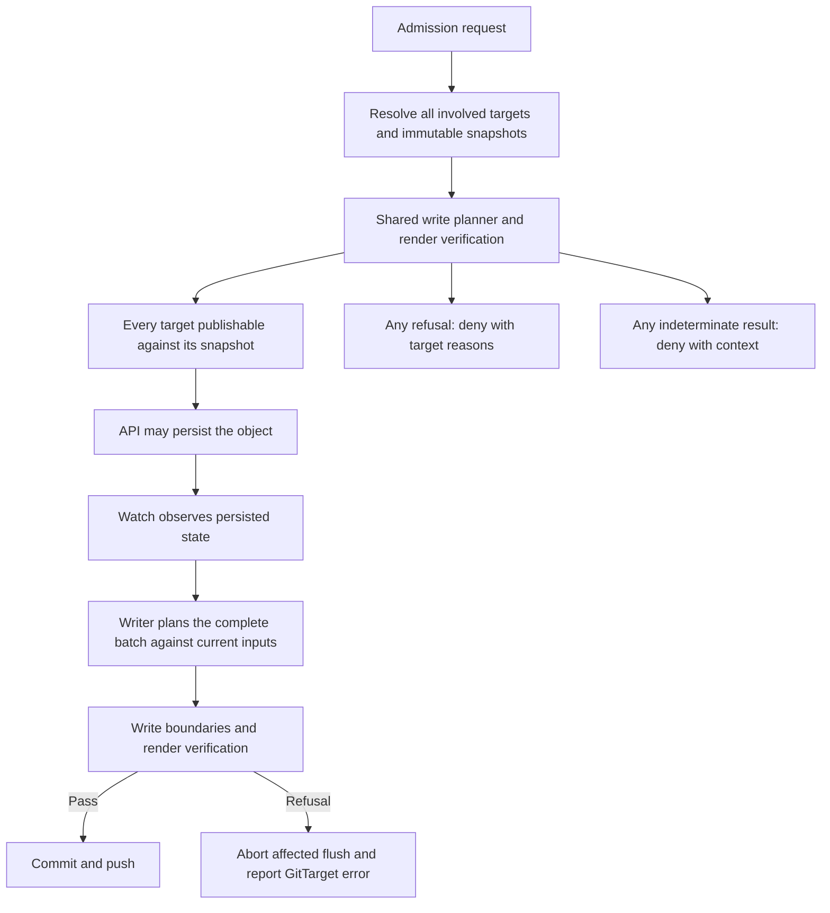

# Git write preflight: reject unpublishable edits at admission

> Status: proposal, not implemented. This document recommends the next feature for the editing
> surface workflow. The two-refusal model and all-target acceptance rule are decided direction.
> API names and diagnostic shapes remain illustrative.

## Recommendation

Build a shared, read-only Git write preflight and expose it through an opt-in validating admission
webhook. When the writer can establish that a proposed object change has no supported destination,
reject the request before persistence with a reason the author can act on.

Prioritize this over broader Helm support or additional source transformations for the editing
surface use case. It makes the existing supported surface easier to trust: an author learns that
a change cannot be saved while making it, instead of discovering a stalled target afterward.

Call the operation **Git write preflight**. “Cannot be reverted” sounds like the operator cannot
undo a change. The question here is whether it can write the proposed change back to Git.

Use validating admission because the decision is acceptance or rejection. The handler should
preserve the author's requested object. Kubernetes runs validating admission after mutation; its
[admission documentation][kubernetes-admission] describes the ordering and response contract.

## The user-visible problem

Today Kubernetes can accept an object update that the publisher subsequently refuses. The author
gets success in the terminal, while the publishing failure appears later on a `GitTarget`.

[Layout corpus shape 8][shape8] makes this concrete. A Deployment comes from a base outside the
production overlay's write scope:

| Proposed change | Current write result | Proposed admission result |
|---|---|---|
| Change its image | Author an overlay `images:` entry and verify the render. | Allow when the single-object preflight passes. |
| Change a base-owned environment variable | Refuse the flush because the planned write escapes the target. | Reject with the field, source path, and unsupported operation. |

An illustrative rejection:

```text
Cannot publish this change through GitTarget checkout-prod.

Field: spec.template.spec.containers[name=app].env
Source: apps/checkout/base/deployment.yaml
Write scope: apps/checkout/overlays/prod

This change requires authoring an overlay field patch, which is not
supported. Add the patch through a Git PR, then refresh the editing view.
```

The message must reflect the computed reason. Field-level attribution may be unavailable for some
refusals; report an object or path-level reason in those cases. Never suggest an editor refresh
command unless that deployment has a supported refresh workflow.

Kustomize can express an environment variable through a patch. The limitation is that this writer
does not yet author the required patch. Distinguish unsupported source transformations from
claims that an edit is mathematically impossible.

## Two refusal surfaces, with authoritative write checks

The supported model has two user-facing refusal surfaces:

| Surface | Question | Failure behavior |
|---|---|---|
| Onboarding and renewed target validation | Can this target manage its repository scope? | Refuse the target and report its error. |
| Admission preflight | Can every involved target publish this complete object change? | Reject the API request before persistence, naming the blockers. |

Write-time checks remain authoritative underneath both surfaces. They defend against stale
admission decisions, direct Git changes, configuration changes, and operation paths outside
admission coverage. They are mandatory correctness checks, not a third per-edit accounting model.

There is no partial publication contract, standing unreflected set, or new `FullyReflected`
condition in this design. If the writer discovers that accepted state cannot be published, refuse
the affected flush and put the affected `GitTarget` into error. Do not report the target as healthy
while silently saving only the fields that happen to fit.

Carry forward these principles:

- Keep every write inside its authorized source boundary; never fall back to shared context.
- Give the actor an actionable reason at admission whenever the problem is known there.
- Reject a mixed supported/unsupported object update as one request.
- Recheck the current repository and complete flush before committing.
- Surface failures that escape admission through the target's error state.

An admission rejection alone does not make a healthy target erroneous. Nothing changed in the
cluster. A target error means its current repository or accepted state cannot be processed safely.

### Scope and promise

The promise for a covered request is:

> Every involved target passed preflight for the complete proposed object change against the
> repository and configuration snapshots identified by the evaluation.

Acceptance cannot guarantee a future commit or atomic publication across targets. Git can change
later and a push can fail. Onboarding acceptance is also revision-dependent: it is not a permanent
certificate that every future commit on the branch is supported.

Enable this feature explicitly for editing surfaces whose authored changes are intended to reach
Git. Keep it off by default for live-cluster mirroring, audit capture, and discovery. With the gate
off, the operator still refuses unsafe Git writes and reports target errors; it does not restrict
the cluster's API operations merely because its mirror is lossy.

The gate does not establish approval, operational safety, or target health after deployment.
Existing authorization, repository review, and deployment feedback retain those jobs.

## Architecture: one planner, two decision points

Extract a read-only planning boundary from the existing writer. Avoid a second implementation of
support rules in the webhook, such as an independent list of allowed image and replica fields.
Otherwise admission and publication will disagree as support evolves.



The admission path must not commit, push, enqueue a publication, or advance watch state. A request
may still fail after this webhook approves it. Watch remains the source of persisted object state.

Candidate implementation seams:

- [Flush planning][flush-planning] assembles writes and their preconditions.
- [Override projection][override-projection] constructs supported source changes.
- [Render verification][render-verification] checks the intended result and unrelated objects.
- [Existing namespace admission validation][namespace-admission] demonstrates early feedback while
  retaining the write-time gate.

These are starting points for a refactor, not a claim that the current planner can be called from
admission without changes. Establish what state it reads and mutates before choosing an interface.

### Evaluation input

The planner needs the resolved source identity and target, requested operation, old and proposed
object where applicable, namespace mapping, effective capture configuration, and repository tree.
Apply the same sanitization and source projection semantics as the writer. A successful planner
return is insufficient if an edit was skipped. Require evidence that the complete requested change
is represented, or is already present, under the applicable checks. Silent skips must become
explicit refusals for this contract.

Evaluate against an immutable local snapshot. No Git fetch or push belongs in the admission request
path. Include enough snapshot identity to reproduce a decision: a Git revision alone may not
identify configuration changes or pending local state.

### Evaluation output

Keep three distinct outcomes:

| Outcome | Meaning |
|---|---|
| Publishable | A supported candidate passes the applicable checks against this snapshot. |
| Refused | The evaluation establishes a concrete publishing constraint violation. |
| Cannot assess | Required context is unavailable, incomplete, unsupported by preflight, or too costly to evaluate within its budget. This does not satisfy the gate. |

Return structured diagnostics that can also serve the writer and future tooling:

- Stable reason code and actionable explanation.
- Target and affected object identity.
- Field or source path when known and appropriate to disclose.
- Evaluated repository revision and configuration identity.
- Whether the result concerns this request alone or a larger required intent.

Do not include Secret values or raw object bodies in error messages, logs, or metrics. A caller
authorized to edit an object does not necessarily have permission to read all repository context.

## All involved targets must comply

For a covered request, resolve every target whose effective capture rules would publish the
requested object change. Once enforcement applies to that edit, evaluate all its publishing
destinations, including destinations whose own opt-in setting did not trigger enforcement. Do not
choose the first match or ignore a refusing destination to obtain approval.

The decision is a conjunction:

```text
allow(request) = target resolution is complete
                 AND every involved target is Publishable
```

| Target A | Target B | Admission result |
|---|---|---|
| Publishable | Publishable | Allow the single API request. |
| Publishable | Refused | Deny, naming B and its reason. |
| Refused | Refused | Deny with both target reasons. |
| Publishable | Cannot assess | Deny, naming B's missing context. |

An overlapping destination or conflicting writer claim is a configuration problem, not permission
to run two writers against the same file. Existing ownership constraints must also pass. Targets
may map the object to different namespaces or source forms; evaluate each target in its own context.

Return blockers in stable target/reason order, with a bounded message and a count if truncated.
Do not claim that the other targets committed merely because their preflight succeeded.

Illustrative response when an image edit fits one target but would move a sibling in another:

```text
Change denied: 1 of 2 publishing targets refused.

team-b/checkout-shared: the proposed images entry also changes Deployment/api.
That sibling is outside this request's intended change.

team-a/checkout-prod passed preflight. The API change was not persisted.
```

An object outside explicitly enforced coverage proceeds through normal admission. Inside enforced
coverage, an unresolved publishing destination must be rejected rather than treated as a vacuous
success. The selector and configuration mechanism must make that distinction observable.

## Request handling and availability

Define coverage for ordinary CREATE, UPDATE, and DELETE requests on the selected resources.
DELETE requires its own operation model; do not model deletion as an empty replacement object.
A staged implementation may begin with CREATE/UPDATE, but must disclose that it does not yet
provide full edit prevention. Status and finalizer maintenance need explicit treatment so the gate
does not block cleanup or recovery. Subresource coverage is discussed in the walkthrough below.

Support `kubectl apply --dry-run=server` through a side-effect-free handler with `sideEffects: None`.
Dry-run evaluates the same all-target rule and never starts publication.

Use fail-closed behavior for covered editing requests: `failurePolicy: Fail` for invocation failure
and explicit denial for a target that cannot be assessed. This follows the stronger rule that all
targets must pass. A warning followed by approval would not meet that rule. Kubernetes distinguishes
invocation failure from explicit webhook denial; see [admission configuration][kubernetes-admission].

This choice trades editing availability for prevention. During an outage, explain that preflight
could not be completed; do not describe the requested content as unsupported. Keep operator
configuration and webhook recovery operations outside content enforcement, with administrator
recovery instructions. Disabling the gate deliberately relaxes prevention but never the writer's
checks. The exact selectors and deployment controls remain implementation questions.

Bound execution time, render cost, and concurrency. No Git round-trip belongs in the admission
path. Budget exhaustion is “cannot assess” and denies a covered request. Measure supported layouts
before choosing limits; use distinct diagnostics for missing state, stale state, and render cost.

## Single requests and coordinated changes

Admission sees one request. The writer verifies the complete flush. These are different units of
intent, even when the caller submits a multi-document YAML file.

The render verifier deliberately operates on batches. If two Deployments share one image entry,
changing the entry for one may also move its sibling. That fails a single-object check. If both
Deployments request the same new image, the complete batch can be valid.

The [render verification tests][oracle-tests] contain both cases:

- `TestPlanFlush_RefusesAWriteThatDragsASiblingAlong`.
- `TestPlanFlush_AllowsTheSharedEntryWriteWhenEverySiblingAgrees`.

A retry alone does not resolve this limitation. An initial single-object gate should identify the
need for a coordinated source change and point to the Git workflow. A future proposal API could
carry an explicit object set. Admission should not wait for later requests to complete a batch.

Preserve the current whole-flush refusal behavior while building preflight. Partial publication
changes the meaning of an author's save and belongs in a separate design decision.

## Publication remains authoritative

Re-plan and verify the eventual batch against current inputs even when every request passed
admission. An earlier approval never authorizes a write into newly invalid repository content.

### Direct Git changes and late failures

Suppose target A was accepted at revision R1 and admission approved an image change against R1.
Another writer pushes R2 with a malformed `kustomization.yaml`, an unsupported remote base, or a
new shared source relationship. This Git commit never traverses Kubernetes admission.

When the operator observes R2, renewed validation or the write path must refuse the affected scope,
abort the unsafe flush, and report the affected target in error with the observed revision and
reason. Do not overwrite R2 to restore the preflight snapshot. A bad change elsewhere in the branch
only fails this target if it affects the target's read/write scope or its constraints.

Use the existing condition model as the basis: publishing-boundary refusals surface through
`GitPathAccepted=False`, `Stalled=True`, and a reason such as `WriteBoundaryRefused`; unsupported
content has its own reason. Transient push or fetch failures use their appropriate existing status
and retry behavior. They must not be mislabeled as unsupported content or silently reported as
successful publication. The exact status mapping is verified during implementation.

A target can enter error without a new API edit, when refreshed Git content invalidates its scope.
Specify and test the refresh trigger and eventual detection latency. Admission alone cannot supply
that observation path.

### Recovery

Fix the repository/configuration or correct the persisted object so that the target can publish it
again. Revalidate and resync the affected scope before clearing a publishing-boundary error.
The existing path clears its refusal after successful per-type resync; an unrelated successful live
write cannot prove that the earlier failure is repaired. See [shape 8][shape8] for current behavior.

Do not reject every correction solely because the target is already in error. A complete proposed
object that restores publishability may pass fresh preflight across all involved targets. Admission
approval itself does not clear status: recovery must be observed and verified. If Git is structurally
invalid, repair Git first; a healthy-object edit cannot make that render valid.

No automatic rollback of cluster state is promised. Applying Git back into the editor requires
separate reconciliation coordination. This design also does not rewrite someone else's Git commit.

If target A publishes and B later fails, B reports error and A's commit remains. Preflight does not
provide a distributed Git transaction. Messages and save outcomes must make that limitation clear.

[CommitRequest][commitrequest] already distinguishes pushed outcomes from successful no-commit
outcomes. Keep that contract and propagate relevant save failures; no new `FullyReflected` condition
or per-edit residue lifecycle is introduced.

## Walkthrough: expected behavior and current evidence

These cases assume an accepted base plus leaf-overlay layout, explicit gate coverage, and fresh
snapshots. “Allow” means every involved target passes the complete preflight. The webhook is still
unbuilt; linked tests establish current writer behavior, not completed admission behavior.

### Image and replica changes on a base-owned Deployment

Changing an image from `1.4.0` to `1.5.0` can author an overlay-local `images:` entry. Changing the
replica count can author `replicas:`. Preflight permits either when the requested render is exact
and no unrelated object moves. The base is unchanged.

Evidence: `TestOverlayAuthors_ImageEntry_ForBaseSuppliedImage` and
`TestOverlayAuthors_ReplicaEntry_ForBaseSuppliedCount` in [placement tests][placement-tests].
Shape 8 provides the inspectable image input and expected Git patch.

`kubectl scale` uses `/scale`. The [override tests][override-tests] cover the writer's scale field
patch, but admission must reconstruct the parent object and resolve its targets to make the same
assessment. A gate covering ordinary UPDATE alone must not claim it covers this command. Require
that adapter before advertising protected scaling; deny covered scale requests that cannot be
assessed instead of silently bypassing preflight.

### Base-owned environment variable, resource limit, or probe

These require field patch authoring that the current writer does not supply. Reject before
persistence, naming the source and target scope. The healthy target stays healthy because the
request never changed state. For an image and env-var change in the same object request, reject
both together. Do not persist the image portion alone.

Evidence: shape 8's env-var input and expected refusal status. Resource limits and probes follow
the same source-boundary rule; explicit admission test cases are still required for each.

### New object in an overlay

A new test-only CronJob can be publishable as an overlay-local document plus a `resources:` entry,
provided mapping, placement, and the render checks pass. Do not inherit the old claim that all new
objects in external-base overlays are unsupported.

Evidence: `TestPlacement_ExternalBaseOverlay_NewObject` uses a ConfigMap to prove local placement,
registration, and unchanged base bytes. A CronJob is the same proposed placement workflow, but
needs its own end-to-end admission case before claiming that exact example is proven.

A new object can still fail: an existing image entry may override its requested image. The
`TestPlanFlush_RefusesANewResourceAnEntryWouldOverride` test in [oracle tests][oracle-tests] proves
why “new object” is not an unconditional allow rule.

### Edit an overlay-owned object

An ordinary editable field of a test-only object can be changed in its existing document. A field
supplied by a build transformer still needs source attribution; file locality alone is insufficient.

Evidence: `TestPlanFlush_UngovernedChangeStillPatchesSourceFile` in the override tests covers direct
source editing. The test-only toolbox example should receive an explicit admission test.

### Delete a base-inherited object in one environment

The writer already authors an overlay-local `$patch: delete` file and `patches:` entry. Permit a
covered DELETE when the resulting render removes only the intended object and target pruning policy
allows publication. Keep the base and other environments unchanged.

Evidence: `TestOverlayAuthors_DeletePatch_ForInheritedObject` in placement tests uses a ConfigMap.
An inherited Service is the same intended behavior, requiring a Service-specific admission test.
Finalizer processing and actual disappearance remain separate from admission acceptance.

A critical negative case is `TestOverlayAuthors_DeletePatch_SkipsOnPathCollision`: the current writer
leaves a conflicting file alone and skips the deletion. That is insufficient for this stronger
contract. Preflight must deny the incomplete plan with a collision reason. If encountered after
admission, the writer must surface a target error instead of silently treating the skip as success.
This is required implementation work, not behavior already supplied by the webhook plumbing.

A rename is a create and a delete through separate API requests. It has no all-or-nothing admission
transaction. Do not promise that rejection of one request undoes the other.

### Transformer-owned metadata and patch-owned fields

Changing a label injected by `commonLabels` is denied if the supported source plan cannot preserve
that requested value through rendering. The same reasoning applies to a field owned by a tolerated,
read-only strategic-merge patch. Name the supplier; do not classify the entire field category as
permanently uneditable.

Evidence: `TestPlanFlush_RefusesAChangeToABuildSuppliedField` in [source-form tests][source-tests] and
`TestPlanFlush_RefusesAnEditToAFieldThePatchOwns` in [patch tests][patch-tests]. A metadata change
removed by sanitization is a separate coverage decision, not automatically a publishing failure.

### Shared image entry and coordinated edits

Changing only `Deployment/web` is denied when the entry would also change `Deployment/api`. The
message names the sibling. Submitting two YAML documents does not create a single admission unit;
the first request may still be denied. A complete writer batch can pass when both siblings agree,
as the oracle tests demonstrate. Direct Git editing is the available coordinated-change route.

Two targets accepting the same object does not widen that object's intended effect. Each target
must still protect unrelated rendered objects within its own evaluation.

### Remote bases and other structurally unsupported content

A remote base, unsupported generator, or malformed build file causes onboarding refusal. A shared
in-repository base can be valid read-only context; refusal occurs when a write would escape the
boundary or change unauthorized consumers. Do not treat all shared bases as invalid folders.

Evidence: `TestPlacement_UndecodableKustomization_RefusesTheFlush` in placement tests and the
[acceptance-gate tests][acceptance-tests]. Repeat validation after repository refresh. A direct Git
commit that introduces these problems after onboarding puts the affected target into error even
when no Kubernetes request passed through admission.

### Multiple targets, unknown state, and recovery

For the same API image edit, let A have an isolated override and B have an override shared with an
unrelated Deployment. A passes, B refuses, and admission denies the whole object request. Neither
publishes that rejected request. Neither healthy target enters error solely due to the denial.

If B instead lacks a usable snapshot, deny with “cannot assess B.” If B's current repository is
invalid, B independently reports its target error. Correcting B's repository and completing resync
allows a fresh request to pass, provided all involved targets then comply.

If both pass at R1 and a direct Git commit invalidates B at R2, B's write-time validation still fails
and B enters error. A may already have published. Tests must make this asynchronous limit visible,
including the case where R2 is discovered without any intervening API request.

## Open questions to settle before implementation

### Authority and scope

1. How does request-to-target resolution prove that the involved set is complete, including remote
   source identities and changing selectors? All involved targets must pass; that decision is settled.
2. Who may enable the gate, and how are webhook selectors kept consistent with effective claims?
   Can users remove a label to leave coverage?
3. Where is the webhook installed when `ClusterProvider` points at a remote editing API, and how
   does that API reach and authenticate the handler?
4. What diagnostics may an object editor see about repository paths or sibling objects outside
   their read permissions?

### Snapshot and planner semantics

1. What identifies a complete evaluation snapshot: Git SHA, target configuration, watch rules,
   schema information, and pending writes?
2. Does preflight evaluate committed Git only, or include pending edits? How does either choice
   affect false refusals, reproducibility, and concurrency?
3. How old may a snapshot be before the answer becomes “cannot assess”? What happens during startup
   or target reconfiguration?
4. Can planning and rendering run without mutating the manifest store or taking locks that delay
   the publisher? What resource budget makes admission latency predictable?
5. Do encrypted resources or other intentionally reduced render checks qualify for a publishable
   verdict, or require a narrower statement of what was checked?

### API operations and intent

1. Which CREATE and UPDATE paths can the first version evaluate faithfully, including generated
   names, defaulted fields, and existing unpublishable state?
2. How does preflight prove that a corrective edit restores complete publishability? Merely reducing
   a mismatch does not pass the gate while an unsupported remainder persists.
3. How are `/scale` and other subresources reconstructed into the object the writer publishes?
   If excluded initially, how is that coverage limitation disclosed?
4. What does rejection mean for DELETE, deletion timestamps, finalizer updates, and namespace
   cleanup? Which operations must remain available for recovery?
5. Is the first contract restricted to independently publishable edits? When is an explicit batch
   proposal worth adding, and how would it represent the author's complete intended effect?

### Availability and feedback

1. What deployment controls and administrator recovery procedure make fail-closed editing practical
   without placing the operator's own repair operations behind the gate?
2. How does a caller distinguish a known refusal, a temporary inability to assess, and a later
   publishing failure? Which cases are worth retrying?
3. Which existing target conditions carry each late failure, and what full-scope revalidation
   proves recovery? How quickly are invalid direct Git commits detected without a new API edit?
4. What is the scope of a failure reported through `CommitRequest`: the submitted request, matched
   window, or current target state?
5. Which measurements prove the feature helps: rejection reasons, indeterminate outcomes, latency,
   and admitted edits that later fail publication? Avoid object names as metric labels.

## Delivery sequence and acceptance evidence

1. Extract and test a read-only preflight against an explicit snapshot. Establish planner parity
   with the writer for the initial supported operations.
2. Map late refusals and incomplete/skipped plans to target errors; verify resync recovery.
3. Add the opt-in validating endpoint and server-side dry-run behavior with bounded evaluation.
4. Demonstrate known acceptance, known refusal, and indeterminate behavior end to end.

Required evidence for the feature includes:

- Shape 8's image edit passes preflight and produces the overlay declaration.
- Its unsupported environment edit is rejected; the persisted object remains unchanged.
- A mixed supported/unsupported object update is rejected as one request.
- A sibling-changing image edit is diagnosed without pretending single-object admission knows a
  future batch.
- A Git or configuration change between admission and flush triggers fresh write verification.
- Dry-run produces a decision without enqueueing work or advancing publishing state.
- All involved targets must pass; an unresolved target, unavailable snapshot, or timeout denies
  covered requests with a clear reason.
- Unselected resources and excluded subresources behave according to the documented coverage.
- A bad direct Git commit fails the affected target when observed, even without a new API edit.
- A rejected request alone leaves a healthy target healthy.
- A later publication failure is visible on the affected target and clears only after verified
  recovery; another target's prior commit is not rolled back.
- Delete-patch collisions and other skipped plans cannot masquerade as complete publication.
- Sensitive data does not appear in diagnostics.

Use the existing [image-authoring tests][placement-tests] and corpus artifacts as seeds. Add
negative and race cases at the planner boundary, then exercise admission persistence behavior in
integration or e2e tests. Performance evidence should accompany the proposed render budget.

## Relationship to existing designs

This document consolidates the earlier write-gating proposal and its relevant examples. The former
three-tier model is replaced by onboarding refusal and admission preflight, backed by mandatory
write checks and target errors. Per-edit residue accounting, partial reflection, and the proposed
`FullyReflected` conditions are dropped from this workstream.

[Admission consent][consent] explores acknowledgment of broader effects. It remains deferred.
The all-target requirement grants no additional authority and introduces no consent bypass.

[Where validation lives][validation-placement] argues for schema and CEL where possible and
reconcile-time checks for cross-object rules. This proposal retains authoritative write-time
verification and adds pre-persistence feedback for authored content. The spec's categorical wording
about webhook use needs reconciliation before implementation; it also predates the existing
namespace-validation handler linked above. This proposal does not silently redefine that contract.

Source recovery, new patch authoring, automated PR creation, editor refresh, and fleet feedback
remain separate workstreams. This feature makes existing publishing constraints visible at the
point where an author can most easily respond.

[kubernetes-admission]: https://kubernetes.io/docs/reference/access-authn-authz/extensible-admission-controllers/
[shape8]: ../../test/fixtures/layout-corpus/shapes/8-base-owned-field-edit/README.md
[flush-planning]: ../../internal/git/plan_flush.go
[override-projection]: ../../internal/manifestanalyzer/overrides_projection.go
[render-verification]: ../../internal/manifestanalyzer/render_verify.go
[namespace-admission]: ../../internal/webhook/watchrule_source_namespace_admission.go
[oracle-tests]: ../../internal/git/kustomize_oracle_test.go
[commitrequest]: ../spec/commitrequest-design.md
[placement-tests]: ../../internal/git/placement_test.go
[consent]: support-boundary/admission-consent.md
[validation-placement]: ../spec/where-validation-lives.md

[override-tests]: ../../internal/git/inplace_overrides_test.go
[source-tests]: ../../internal/git/source_form_test.go
[patch-tests]: ../../internal/git/patches_test.go
[acceptance-tests]: ../../internal/git/acceptance_gate_test.go
