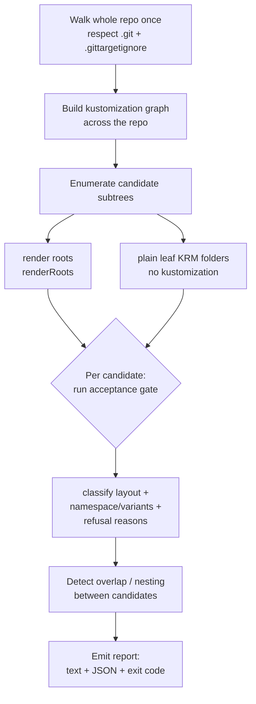

# F8: Repo discovery and onboarding scan (CLI / product-layer)

> Status: designed; **first cut shipped 2026-07-09** (branch `feat/gitops-api-f8`) —
> CLI/onboarding tooling, not an operator write-model feature. The engine it needs is
> already shipped; this adds a new entry point plus a report contract. See
> [First cut (shipped)](#first-cut-shipped-2026-07-09) for what actually landed and where
> it refines the sketch below.
> Captured: 2026-07-09
> Related:
> [README.md](README.md),
> [kustomize-support-boundary-and-product-model.md](kustomize-support-boundary-and-product-model.md),
> [finished/f1-images-replicas-edit-through.md](finished/f1-images-replicas-edit-through.md),
> [finished/f7-higher-level-krm-documents.md](finished/f7-higher-level-krm-documents.md),
> [../manifest/file-agnostic-placement.md](../manifest/file-agnostic-placement.md),
> [../../finished/current-manifest-support-review.md](../../finished/current-manifest-support-review.md)

## Why this exists

The product front door is "point a GitHub App at a repository you own and get an
easy Kubernetes API over it" (the intent-mode direction of
[kustomize-support-boundary-and-product-model.md §8](kustomize-support-boundary-and-product-model.md)).
Between "here is a repo" and "here is your API" sits an **onboarding** step the
operator deliberately does **not** perform:

- Which folders in this repo can become `GitTarget`s?
- What **layout** is each (plain per-env folder, single-context kustomize,
  base + overlays)?
- Which are **supported today**, which are **refused**, and *why*?
- What namespace does each resolve to, and what `GitTarget`/`WatchRule` would
  express it?

None of this is the operator's job, and it must stay that way. This doc designs
the discovery capability as an extension of the existing `manifest-analyzer`
CLI + its shared `internal/manifestanalyzer` engine, and defines the
machine-readable report the product layer consumes.

## The boundary this respects: the operator never discovers

The operator is intentionally the opposite of Argo/Flux — it does not scan a
repo to find apps. A `GitTarget` is told **exactly one** subtree:
`spec.path` is required, `MinLength=1`, has no default, and is immutable
(`api/v1alpha3/gittarget_types.go`); every scan is hard-scoped to
`filepath.Join(root, spec.path)` (`scanWorktreeSubtree`,
`internal/git/plan_flush.go`); and overlap between `GitTarget`s is actively
refused to preserve one-owner-per-folder (`checkForConflicts`,
`internal/controller/gittarget_path_overlap.go`).

Repo-wide target discovery is therefore a **new axis**, not a new operator
feature. Putting it in the operator would fight both the simplicity goal and the
one-owner invariant. It belongs in the CLI/library and, above that, the product
layer — exactly the division already recorded in
[file-agnostic-placement.md](../manifest/file-agnostic-placement.md) and the
[README](README.md) responsibilities table:

| Layer | Owns | Gains repo-wide discovery? |
|---|---|---|
| **GitOps Reverser (operator)** | watch live state, edit one subtree, push a branch, expose `CommitRequest` status | **No.** Unchanged. One `GitTarget` = one subtree. |
| **`manifest-analyzer` CLI + `internal/manifestanalyzer` library** | folder walk, acceptance gate, placement, refusal reasons — already shared with the operator | **Yes.** New repo-wide entry point + report. Read-only, writes nothing, needs no cluster. |
| **Product / GitHub App layer** | repo access, CR generation, PR creation, session/branch policy | Consumes the report → generates `GitProvider`/`GitTarget`/`WatchRule` → opens PRs. Still no operator Git-host knowledge. |

### Why walking a whole repo does not re-open Pandora's box: discovery ≠ support

Scanning every folder sounds like it re-opens every kustomize question. It does not,
because **discovery is broad and read-only while the write contract stays narrow and
principled** — they are deliberately different jobs. scan-repo classifies what a folder
*is*; it never widens what the operator will *write*. The write boundary is not a
hand-maintained feature allowlist but a **consequence of one rule**: every edit must have a
single writable Git destination that round-trips
([boundary §1–§4](kustomize-support-boundary-and-product-model.md)). Anything that creates
resources or mutates identity (generators, patches, `components`, `namePrefix`/`nameSuffix`,
Helm inflation, `replacements`) has no source document to write an edit into, so it is
refused *structurally* — not "unimplemented," but non-invertible.

That is the escape from the "support every kustomize feature" trap: a repo may use
constructs the operator will never write, and discovery's only job is to **say so, honestly,
per folder**. You onboard a kustomize repo without supporting kustomize writes. The refusal
reasons are the product's honesty surface — "here is exactly what we will not touch, and
why" — not a gap to apologise for.

## The engine is already there

The discovery pass is mostly reuse. The CLI and the live reconciler already
share one engine (`Scan` is documented as "the one planner shared by the
manifest-analyzer CLI and the controller's scan path",
`internal/manifestanalyzer/scan.go`), and `manifest-analyzer` already scans a
**single** folder read-only with no cluster:
`ScanDir(ctx, dir, nil, nil, policy)` (`--mode scan-folder`).

The building blocks a repo-wide pass needs all exist:

| Need | Existing symbol |
|---|---|
| Walk a tree, classify each entry | `collectFiles` (`analyzer.go`), `ClassifyEntry` (`gittargetignore.go`) — roles `ManagedYAML` / `OperatorArtifact` (kustomizations recognized) / `Foreign` (refused) |
| Enumerate render roots | `renderRoots` (`overrides.go`) — "kustomization directories no other kustomization references" |
| Run the adoption gate | `Accept` / `AcceptStructureOnly` (`acceptance.go`), refusal reasons `AcceptanceRefusedError` / `RefusalError` (`acceptance_refusal.go`) |
| Resolve namespaces / variants | `resolveNamespaceContext`, `NamespaceSource` (`Explicit`/`Kustomize`/`None`) (`store.go`) — variant→namespace is free when overlays set `namespace:` |
| Detect target overlap | mirror `checkForConflicts` (`gittarget_path_overlap.go`) so no two proposed targets overlap |

What is genuinely new: **a whole-repo pass** (today's `ScanDir` is subtree-only),
**candidate enumeration**, **layout classification**, and the **report
contract**.

## The discovery algorithm



1. **Walk the whole repo once.** Reuse `collectFiles` semantics but over the
   full tree rather than a single subtree; skip `.git`; honour a root
   `.gittargetignore`; never follow symlinks (matches `ScanDir`).
2. **Build the kustomization graph** across the repo and compute render roots
   (`renderRoots`). A render root reached by no other kustomization is a natural
   target unit; its inferred `namespace:` (when set) is the variant identity.
3. **Enumerate candidates:** every render root, plus every plain leaf folder of
   KRM documents that no kustomization owns (many GitOps tools apply a directory
   of manifests directly — the "one plain folder per environment" launch layout).
4. **Run the same acceptance gate the operator runs** per candidate, scoped to
   the candidate subtree plus the read-only context it reaches (bases via
   `../../base`). This yields, per candidate: accepted?, refusal reasons, layout
   class, inferred namespace(s)/variants, KRM vs non-KRM document counts.
5. **Detect overlap/nesting** between candidates (mirroring
   `gittarget_path_overlap`) so the product never proposes two `GitTarget`s that
   would be mutually refused.
6. **Emit** the report (below).

### Layout classification

Discovery reports the layout **and** current operator acceptance as two distinct
truths — they diverge during the F2 gap (see below).

| `layout` | Meaning | `acceptedByOperator` today |
|---|---|---|
| `plain` | Directory of KRM docs, explicit namespaces, no kustomization | ✅ shipped |
| `kustomize-single` | One render root; `namespace` + `resources`/`images`/`replicas` | ✅ shipped |
| `kustomize-overlay` | Base + N overlay roots, one namespace per overlay | ⛔ until **F2** — reason `overlay-fan-out-needs-f2` |
| `refused-structural` | Helm inflation, generators with hash suffixes, `components`, `namePrefix`/`nameSuffix`, remote bases, `configurations`/`openapi`/`crds` | ⛔ permanent — the support contract |
| `refused-fleet-root` | `clusters/` + `apps/` + `infra/` cluster-root repo (a `GitTarget` points at an app subtree, never a cluster root) | ⛔ out of scope by design |
| `refused-out-of-band` | Namespace/transform injected outside the folder (Flux `postBuild`/`targetNamespace`, Argo Application-level overrides) | ⛔ permanent — round-trip cannot hold |

> **Shipped reconciliation (first cut).** Two rows above are *not* per-candidate
> layouts in practice. `refused-fleet-root` is emitted as a **repo-level** signal
> (`summary.fleetRoot`), because the cluster root is never itself a candidate — leaf app
> folders still surface as normal candidates. `refused-out-of-band` is **not detected**:
> a structure-only folder walk cannot see a transform injected by a Flux `Kustomization`
> or Argo `Application`. Those CRs are themselves KRM documents in the repo, so detecting
> out-of-band overrides later means parsing the fleet CRs and cross-referencing the app
> subtree they target — a bounded future capability, already flagged as a "much-later
> feature" in [boundary §2](kustomize-support-boundary-and-product-model.md). The first
> cut therefore ships four candidate layouts: `plain`, `kustomize-single`,
> `kustomize-overlay`, `refused-structural`.

The distinction between `overlay-fan-out-needs-f2` and `refused-structural` is
the load-bearing one: the first is a **forward-looking** "not yet" that flips to
accepted when [F2](README.md) render-root scoping lands; the second is the
permanent boundary. Discovery must never collapse them into one "refused." **This
two-bucket split is what keeps the kustomize surface finite:** every construct sorts into
a **ladder** (a bounded roadmap of layouts we choose to build — plain → single →
overlay/F2 → …) or a **wall** (structurally non-invertible, refused forever). Neither is
unbounded work — the ladder is a sequence you climb deliberately; the wall costs nothing
but a clear reason.

## The report contract

Two renderings, matching the existing `--format text|json` split. JSON is the
product's interface. The shape below is what the [first cut](#first-cut-shipped-2026-07-09)
emits, per candidate — **except `proposedGitTarget`, which is the eventual goal and is
not emitted yet** (CR proposal is deferred). Do not copy `proposedGitTarget` as if it
were live output. (The block is fenced `jsonc` because it carries an explanatory
comment — the shipped report is strict JSON.)

```jsonc
{
  "path": "apps/podinfo/overlays/test",
  "layout": "kustomize-overlay",
  "acceptedByOperator": false,
  "refusalReasons": [
    { "code": "overlay-fan-out-needs-f2", "detail": "base \"apps/podinfo/base\" is read from outside this folder's subtree and is shared by 3 render root(s); render-root scoping (F2) required" }
  ],
  "renderRoot": true,
  "readScope": ["apps/podinfo/base"],
  "inferredNamespace": "podinfo-test",
  "resources": { "rendered": 4, "editable": 0, "nonKrm": 0 },

  "proposedGitTarget": {                          // FUTURE — not emitted by the first cut
    "spec": {
      "providerRef": { "name": "<from onboarding config>" },
      "branch": "<provider default allowedBranch>",
      "path": "apps/podinfo/overlays/test"
    }
  }
}
```

`resources` replaces the earlier `documents: { krm, nonKrm }` sketch with the shipped
`{ rendered, editable, nonKrm }` split (see [First cut](#first-cut-shipped-2026-07-09) for
why rendered and editable diverge for overlays). Plus a repo-level summary:
`candidatesByLayout`, `accepted`/`refused` counts, `overlapConflicts`, `fleetRoot`, and
`unsupportedConstructs` (so the product can say "this repo uses Helm inflation in
`infra/`, which we don't manage").

**Exit codes** reuse the CLI convention (`exitOK=0`, `exitRefused=1`,
`exitUsage=2`). The eventual design: `--policy report` always exits 0 (pure report);
`--policy refuse` exits 1 when **zero** candidates are acceptable — i.e. "is this repo
onboardable at all?", the useful CI/onboarding gate. **The first cut does not yet apply
`--policy` in scan-repo mode** — it always exits 0 (or 2 on an I/O error); the refuse
gate is deferred.

## CLI surface

A new mode on `manifest-analyzer` (shipped form):

```
manifest-analyzer --mode scan-repo --format json <repo-root>
```

Naming note: the modes are named after the product question they answer, matching the
public [`pkg/manifestanalyzer`](../../../pkg/manifestanalyzer) entry points —
`scan-folder` asks "may **this folder** become a GitTarget?" (`ScanFolder`) and
`scan-repo` asks "which folders under **this repo root** could?" (`ScanRepo`). The first
cut shipped these as `scan` and `repo-walker`; both were renamed when the package became
a supported contract, with no back-compat aliases. `repo-walker` named an internal
traversal phase rather than a contract, and a bare `scan` was asymmetric once a
repo-level scan existed.

The existing `--mode discovery` is **Kubernetes API discovery** (a served-GVR dump
against a kubeconfig), unrelated to repo discovery; renaming it to `--mode api-discovery`
so "discovery" is not overloaded remains a possible follow-up. `--policy` is accepted for
symmetry but the repo-level refuse gate is deferred (see
[First cut](#first-cut-shipped-2026-07-09)).

The report should also be exposed as a **library function** (the product is
likely part of the same Go binary family), with the CLI mode as the thin wrapper
+ CI gate. Library-first keeps the product from shelling out and re-parsing JSON.

## First cut (shipped 2026-07-09)

A lean first slice landed on branch `feat/gitops-api-f8`. It **reports**; it does not
yet **propose**. Library-first, as recommended above.

**Surface.** `ScanRepo(ctx, root) (RepoReport, error)` in
`internal/manifestanalyzer/scan_repo.go`, with `--mode scan-repo <root>`
(`--format text|json`) as a thin CLI wrapper. Read-only, no cluster, symlinks never
followed — the same posture as `ScanDir`, over the whole tree. It reuses `collectFiles`,
`parseKustomizations`/`renderRoots`, the `Scan`/acceptance gate, and mirrors
`gittarget_path_overlap` for nesting.

A product layer consuming this from Go imports [`pkg/manifestanalyzer`](../../../pkg/manifestanalyzer)
— `ScanRepo` and `ScanFolder` — rather than exec'ing the binary. That package is the
supported, versioned projection of the reports below; the engine above stays internal and
free to move.

**Report shape as shipped**, refining the sketch above. Per candidate: `path`, `layout`,
`acceptedByOperator`, `refusalReasons[]` (`{code, detail}`), `renderRoot`, `readScope[]`,
`inferredNamespace`, `resources`, `overlapsWith[]`.

- **`resources` splits the KRM two ways** instead of the sketch's single `documents.krm`:
  `{ rendered, editable, nonKrm }`. `rendered` counts the documents the candidate actually
  renders — for a kustomize candidate that is the **resources graph** (files the
  kustomization lists, following bases), *not* parked YAML a kustomization does not
  reference; for a plain folder it is the whole directory. `editable` counts only the
  rendered source physically in the candidate's own subtree. They are equal for plain /
  self-contained kustomize candidates and **diverge for an overlay** (e.g. `rendered: 2,
  editable: 0`) — the overlay renders a base it cannot yet edit, which makes the F2 gap
  legible at a glance.
- Repo summary: `candidatesByLayout`, `accepted`, `refused`, `overlapConflicts[]`,
  `fleetRoot`, `unsupportedConstructs[]`.
- `proposedGitTarget` is **not** emitted yet — CR proposal is deferred.

**Fidelity to the operator.** `acceptedByOperator` runs the live writer's own gate per
candidate — `Scan` with `WriterAllowlist` (kustomize build directives **plus** the
operator's `.sops.yaml` bootstrap config), so a folder the writer would adopt is not
falsely reported refused. A refused plain / self-contained candidate carries the gate's
issues as `refusalReasons` (`{code, detail}` — duplicate identity, non-KRM YAML, a foreign
file, an unsupported nested kustomization, …), never a bare `false`. The structural gate
refuses `openapi`/`crds` alongside `configurations`, matching the
[support boundary §1](kustomize-support-boundary-and-product-model.md).

**Classification findings.**

- The overlay discriminator that trips `overlay-fan-out-needs-f2` is precisely **the base
  escaping the render root's own subtree** (`../../base` resolves outside the candidate) —
  the very fact the operator's hard subtree-scope hits. Fan-out (how many overlay roots
  share the base) is carried as informative `detail`, not the trigger. A base nested
  *within* the subtree keeps the root `kustomize-single` (accepted today).
- `refused-fleet-root` ships as a repo-summary flag (`fleetRoot: true`), not a
  per-candidate layout: the repo root is never itself a candidate, and leaf app folders
  still surface normally. `refused-out-of-band` is not detected yet — a structure-only
  scan sees no out-of-band namespace/transform signal to refuse on.
- Namespace inference is purely structural (no cluster): a render root's `namespace:`
  transformer, else the single explicit `metadata.namespace` on a plain folder's
  documents (none/ambiguous → empty).

**Deferred** (unchanged from the non-goals): `proposedGitTarget`/CR + `WatchRule`
generation, the `--mode discovery` rename, and the repo-level `--policy refuse` exit gate
(exit codes stay simple — `exitOK`, or `exitUsage` on an I/O error).

**Corpus.** Golden reports under
`internal/manifestanalyzer/testdata/scan-repo/{supported,unsupported}/<fixture>/` with a
sibling `<fixture>.golden.json` each (regenerate with `UPDATE_GOLDEN=1`), covering
plain-per-env, kustomize-single, base+overlays, HelmRelease document vs. helm inflation,
unsupported kustomize (incl. `openapi`/`crds`), fleet-root, overlapping, no-krm, and
regression fixtures for the counting/acceptance edges — an overlay whose base pulls in a
nested base (deduped `rendered`), an overlay base holding parked YAML (excluded from
`rendered`), and a plain folder the gate refuses (issues surfaced as `refusalReasons`).

## Boundaries and non-goals

- **Not deploy discovery.** We are the reverse of Argo/Flux; this finds *editing*
  targets, never "apps to deploy."
- **Writes nothing, no Git-host calls, no cluster required.** Structure-only,
  read-only, symlinks never followed — same posture as `ScanDir`.
- **Proposes, never creates.** The CLI/library emits candidate `GitTarget`s; the
  product layer decides, renders the actual manifests (naming, labels,
  ownerRefs), and opens PRs. CR generation stays out of the operator.
- **Moves no boundary.** Refused layouts stay refused; discovery only *reports*
  them. It does not make the operator accept overlays — [F2](README.md) does.
- **`WatchRule` proposal is optional (open question).** Discovery can suggest
  `WatchRule`s from the kinds present in a folder, but watch selection is about
  *which cluster resources flow* ([F7](finished/f7-higher-level-krm-documents.md)),
  orthogonal to the Git path — it may be cleaner to stop at `GitTarget` and leave
  watch scoping to the user/product.

## Relationship to the ladder

- **Dependencies are all shipped:** the acceptance gate, render-root computation
  ([F1](finished/f1-images-replicas-edit-through.md)), and namespace inference.
  Discovery is additive tooling on top.
- **F2 is the one that changes discovery's *output*, not its code:** pre-F2,
  overlay candidates report `acceptedByOperator: false` +
  `overlay-fan-out-needs-f2`; once F2 ships they flip to accepted with an
  `images:`/`replicas:` + overlay-local-file capability summary. The report is
  designed to be correct across that transition.
- **Intent mode (§8) reuses the same report** as its onboarding front door: the
  set of accepted candidates and their namespaces is exactly what tells the
  intent cluster which overlays to hydrate.
- **Not itself an operator write-model feature** — hence the "CLI / product-layer"
  tag. It is tracked in the ladder for one delivery surface, but it ships no
  operator code.

## Test plan

- A **discovery corpus**: repo fixtures of each shape — plain-per-env, single
  kustomize, base+overlays, fleet-root (`clusters/`+`apps/`+`infra/`),
  Helm-hybrid, and nested/overlapping candidates — each with a golden JSON
  report.
- Assertions: render-root enumeration, layout classification, refusal-reason
  codes (especially `overlay-fan-out-needs-f2` vs `refused-structural`), overlap
  detection, namespace/variant inference, and proposed `GitTarget` paths.
- Reuse existing corpora where they fit
  (`internal/manifestanalyzer/testdata/contextual-namespace`, the `ambiguous-*`
  folders) rather than duplicating fixtures.
- A **descriptive** corpus of real-world layouts lives at
  [`test/fixtures/gitops-layouts/`](../../../test/fixtures/gitops-layouts/): Argo CD plain
  directories, App of Apps, both ApplicationSet generators, kustomize overlays, Helm charts
  and per-environment values, the Flux monorepo and `HelmRelease` shapes,
  repo-per-environment, a cluster×app matrix, SOPS, committed rendered manifests, Flux image
  automation, and a hostile mixed folder. It records **no verdicts** — it is the input to
  deciding them. When a layout there graduates into a decision, it gains a golden report
  under `scan-repo/` above.
- Two of those fixtures raise a question this design does not yet answer: **the repository has
  other writers.** Flux's `ImageUpdateAutomation` and Argo CD Image Updater both commit to the
  same branch a `GitTarget` writes, and both depend on constructs a naive rewrite destroys — a
  `# {"$imagepolicy": ...}` setter comment on the image line, and a hidden
  `.argocd-source-<app>.yaml` that outranks the kustomization. Comment-preserving in-place
  editing is necessary but may not be sufficient; concurrent writers need a story of their own.

## Open questions

1. **Mode naming / the `discovery` collision** — _partly settled:_ the repo mode is
   `scan-repo` and the folder mode is `scan-folder`, mirroring `ScanRepo` / `ScanFolder`
   (no collision). Whether to also rename the K8s-API mode to `api-discovery` is still
   open.
2. **Stop at `GitTarget`, or also propose `WatchRule`s?** — moot for now: the first cut
   proposes neither (reports only).
3. **Read-scope depth for overlays pre-F2** — how far up the tree to follow
   `../../base` when the operator would still refuse the folder. _First cut:_ `readScope`
   is the **minimal** set of out-of-subtree base directories (a base nested under another
   reached base is folded into its parent, so the rendered-document count never
   double-counts a shared nested base). How many levels the product should *display*
   remains a presentation choice.
4. **Library vs. CLI as the product's integration point** — _settled:_ library-first
   (`ScanRepo`), CLI (`--mode scan-repo`) as the thin wrapper + CI gate.
5. **`overlay-fan-out-needs-f2` naming** — the reason code reads as if *fan-out* (a base
   shared by several overlays) is the trigger, but the real trigger is a base **escaping
   the render root's own subtree**, true even at fan-out = 1. The first cut carries the
   shared-root count as descriptive `detail`, not as the condition. Open: rename to
   something like `overlay-base-out-of-subtree-needs-f2`, or keep the product-facing code
   and rely on the detail. _Not settled._
6. **Repo-level `--policy refuse` gate** — the eventual "zero acceptable candidates → exit
   1" onboarding gate (see [Exit codes](#the-report-contract)) is **deferred**: the first
   cut always exits 0 (or 2 on an I/O error) and `--policy` is not applied in scan-repo
   mode. Open: implement it as the CI/onboarding gate when the product needs it.
