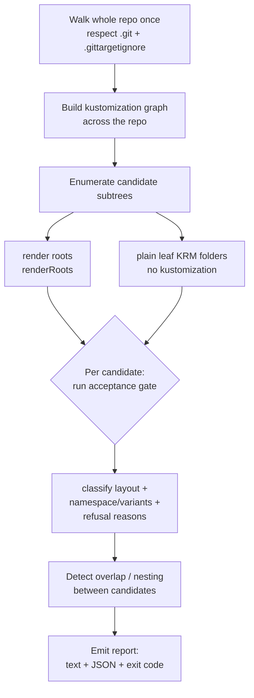

# F8: Repo discovery and onboarding scan (CLI / product-layer)

> Status: designed, unbuilt — CLI/onboarding tooling, not an operator write-model
> feature. The engine it needs is already shipped; this is a new entry point plus
> a report contract.
> Captured: 2026-07-09
> Related:
> [README.md](README.md),
> [kustomize-support-boundary-and-product-model.md](kustomize-support-boundary-and-product-model.md),
> [finished/f1-images-replicas-edit-through.md](finished/f1-images-replicas-edit-through.md),
> [finished/f7-higher-level-krm-documents.md](finished/f7-higher-level-krm-documents.md),
> [../manifest/file-agnostic-placement.md](../manifest/file-agnostic-placement.md),
> [../../finished/current-manifest-support-review.md](../../finished/current-manifest-support-review.md)

## Why this exists

The product front door is "point a GitHub App at a repository you own and get an
easy Kubernetes API over it" (the intent-mode direction of
[kustomize-support-boundary-and-product-model.md §8](kustomize-support-boundary-and-product-model.md)).
Between "here is a repo" and "here is your API" sits an **onboarding** step the
operator deliberately does **not** perform:

- Which folders in this repo can become `GitTarget`s?
- What **layout** is each (plain per-env folder, single-context kustomize,
  base + overlays)?
- Which are **supported today**, which are **refused**, and *why*?
- What namespace does each resolve to, and what `GitTarget`/`WatchRule` would
  express it?

None of this is the operator's job, and it must stay that way. This doc designs
the discovery capability as an extension of the existing `manifest-analyzer`
CLI + its shared `internal/manifestanalyzer` engine, and defines the
machine-readable report the product layer consumes.

## The boundary this respects: the operator never discovers

The operator is intentionally the opposite of Argo/Flux — it does not scan a
repo to find apps. A `GitTarget` is told **exactly one** subtree:
`spec.path` is required, `MinLength=1`, has no default, and is immutable
(`api/v1alpha3/gittarget_types.go`); every scan is hard-scoped to
`filepath.Join(root, spec.path)` (`scanWorktreeSubtree`,
`internal/git/plan_flush.go`); and overlap between `GitTarget`s is actively
refused to preserve one-owner-per-folder (`checkForConflicts`,
`internal/controller/gittarget_path_overlap.go`).

Repo-wide target discovery is therefore a **new axis**, not a new operator
feature. Putting it in the operator would fight both the simplicity goal and the
one-owner invariant. It belongs in the CLI/library and, above that, the product
layer — exactly the division already recorded in
[file-agnostic-placement.md](../manifest/file-agnostic-placement.md) and the
[README](README.md) responsibilities table:

| Layer | Owns | Gains repo-wide discovery? |
|---|---|---|
| **GitOps Reverser (operator)** | watch live state, edit one subtree, push a branch, expose `CommitRequest` status | **No.** Unchanged. One `GitTarget` = one subtree. |
| **`manifest-analyzer` CLI + `internal/manifestanalyzer` library** | folder walk, acceptance gate, placement, refusal reasons — already shared with the operator | **Yes.** New repo-wide entry point + report. Read-only, writes nothing, needs no cluster. |
| **Product / GitHub App layer** | repo access, CR generation, PR creation, session/branch policy | Consumes the report → generates `GitProvider`/`GitTarget`/`WatchRule` → opens PRs. Still no operator Git-host knowledge. |

## The engine is already there

The discovery pass is mostly reuse. The CLI and the live reconciler already
share one engine (`Scan` is documented as "the one planner shared by the
manifest-analyzer CLI and the controller's scan path",
`internal/manifestanalyzer/scan.go`), and `manifest-analyzer` already scans a
**single** folder read-only with no cluster:
`ScanDir(ctx, dir, nil, nil, policy)` (`--mode scan`).

The building blocks a repo-wide pass needs all exist:

| Need | Existing symbol |
|---|---|
| Walk a tree, classify each entry | `collectFiles` (`analyzer.go`), `ClassifyEntry` (`gittargetignore.go`) — roles `ManagedYAML` / `OperatorArtifact` (kustomizations recognized) / `Foreign` (refused) |
| Enumerate render roots | `renderRoots` (`overrides.go`) — "kustomization directories no other kustomization references" |
| Run the adoption gate | `Accept` / `AcceptStructureOnly` (`acceptance.go`), refusal reasons `AcceptanceRefusedError` / `RefusalError` (`acceptance_refusal.go`) |
| Resolve namespaces / variants | `resolveNamespaceContext`, `NamespaceSource` (`Explicit`/`Kustomize`/`None`) (`store.go`) — variant→namespace is free when overlays set `namespace:` |
| Detect target overlap | mirror `checkForConflicts` (`gittarget_path_overlap.go`) so no two proposed targets overlap |

What is genuinely new: **a whole-repo pass** (today's `ScanDir` is subtree-only),
**candidate enumeration**, **layout classification**, and the **report
contract**.

## The discovery algorithm



1. **Walk the whole repo once.** Reuse `collectFiles` semantics but over the
   full tree rather than a single subtree; skip `.git`; honour a root
   `.gittargetignore`; never follow symlinks (matches `ScanDir`).
2. **Build the kustomization graph** across the repo and compute render roots
   (`renderRoots`). A render root reached by no other kustomization is a natural
   target unit; its inferred `namespace:` (when set) is the variant identity.
3. **Enumerate candidates:** every render root, plus every plain leaf folder of
   KRM documents that no kustomization owns (many GitOps tools apply a directory
   of manifests directly — the "one plain folder per environment" launch layout).
4. **Run the same acceptance gate the operator runs** per candidate, scoped to
   the candidate subtree plus the read-only context it reaches (bases via
   `../../base`). This yields, per candidate: accepted?, refusal reasons, layout
   class, inferred namespace(s)/variants, KRM vs non-KRM document counts.
5. **Detect overlap/nesting** between candidates (mirroring
   `gittarget_path_overlap`) so the product never proposes two `GitTarget`s that
   would be mutually refused.
6. **Emit** the report (below).

### Layout classification

Discovery reports the layout **and** current operator acceptance as two distinct
truths — they diverge during the F2 gap (see below).

| `layout` | Meaning | `acceptedByOperator` today |
|---|---|---|
| `plain` | Directory of KRM docs, explicit namespaces, no kustomization | ✅ shipped |
| `kustomize-single` | One render root; `namespace` + `resources`/`images`/`replicas` | ✅ shipped |
| `kustomize-overlay` | Base + N overlay roots, one namespace per overlay | ⛔ until **F2** — reason `overlay-fan-out-needs-f2` |
| `refused-structural` | Helm inflation, generators with hash suffixes, `components`, `namePrefix`/`nameSuffix`, remote bases, `configurations`/`openapi`/`crds` | ⛔ permanent — the support contract |
| `refused-fleet-root` | `clusters/` + `apps/` + `infra/` cluster-root repo (a `GitTarget` points at an app subtree, never a cluster root) | ⛔ out of scope by design |
| `refused-out-of-band` | Namespace/transform injected outside the folder (Flux `postBuild`/`targetNamespace`, Argo Application-level overrides) | ⛔ permanent — round-trip cannot hold |

The distinction between `overlay-fan-out-needs-f2` and `refused-structural` is
the load-bearing one: the first is a **forward-looking** "not yet" that flips to
accepted when [F2](README.md) render-root scoping lands; the second is the
permanent boundary. Discovery must never collapse them into one "refused."

## The report contract

Two renderings, matching the existing `--format text|json` split. JSON is the
product's interface; per candidate:

```json
{
  "path": "apps/podinfo/overlays/test",
  "layout": "kustomize-overlay",
  "acceptedByOperator": false,
  "refusalReasons": [
    { "code": "overlay-fan-out-needs-f2", "detail": "base reached by 3 overlay roots; render-root scoping (F2) required" }
  ],
  "renderRoot": true,
  "readScope": ["apps/podinfo/base"],
  "inferredNamespace": "podinfo-test",
  "documents": { "krm": 4, "nonKrm": 0 },
  "proposedGitTarget": {
    "spec": {
      "providerRef": { "name": "<from onboarding config>" },
      "branch": "<provider default allowedBranch>",
      "path": "apps/podinfo/overlays/test"
    }
  }
}
```

Plus a repo-level summary: candidate counts by layout, accepted vs. refused,
overlap conflicts, and the set of unsupported constructs seen (so the product
can say "this repo uses Helm inflation in `infra/`, which we don't manage").

**Exit codes** reuse the CLI convention (`exitOK=0`, `exitRefused=1`,
`exitUsage=2`). In repo mode, `--policy report` always exits 0 (pure report);
`--policy refuse` exits 1 when **zero** candidates are acceptable — i.e. "is this
repo onboardable at all?", the useful CI/onboarding gate. (Per-candidate refusals
are data, not a failure, under `report`.)

## CLI surface

A new mode on `manifest-analyzer`, e.g.:

```
manifest-analyzer --mode repo --format json [--policy report|refuse] <repo-root>
```

Naming note: the existing `--mode discovery` is **Kubernetes API discovery** (a
served-GVR dump against a kubeconfig), unrelated to repo discovery. To avoid
confusion this doc uses `--mode repo`; a follow-up should consider renaming the
existing mode to `--mode api-discovery` so "discovery" is not overloaded.

The report should also be exposed as a **library function** (the product is
likely part of the same Go binary family), with the CLI mode as the thin wrapper
+ CI gate. Library-first keeps the product from shelling out and re-parsing JSON.

## Boundaries and non-goals

- **Not deploy discovery.** We are the reverse of Argo/Flux; this finds *editing*
  targets, never "apps to deploy."
- **Writes nothing, no Git-host calls, no cluster required.** Structure-only,
  read-only, symlinks never followed — same posture as `ScanDir`.
- **Proposes, never creates.** The CLI/library emits candidate `GitTarget`s; the
  product layer decides, renders the actual manifests (naming, labels,
  ownerRefs), and opens PRs. CR generation stays out of the operator.
- **Moves no boundary.** Refused layouts stay refused; discovery only *reports*
  them. It does not make the operator accept overlays — [F2](README.md) does.
- **`WatchRule` proposal is optional (open question).** Discovery can suggest
  `WatchRule`s from the kinds present in a folder, but watch selection is about
  *which cluster resources flow* ([F7](finished/f7-higher-level-krm-documents.md)),
  orthogonal to the Git path — it may be cleaner to stop at `GitTarget` and leave
  watch scoping to the user/product.

## Relationship to the ladder

- **Dependencies are all shipped:** the acceptance gate, render-root computation
  ([F1](finished/f1-images-replicas-edit-through.md)), and namespace inference.
  Discovery is additive tooling on top.
- **F2 is the one that changes discovery's *output*, not its code:** pre-F2,
  overlay candidates report `acceptedByOperator: false` +
  `overlay-fan-out-needs-f2`; once F2 ships they flip to accepted with an
  `images:`/`replicas:` + overlay-local-file capability summary. The report is
  designed to be correct across that transition.
- **Intent mode (§8) reuses the same report** as its onboarding front door: the
  set of accepted candidates and their namespaces is exactly what tells the
  intent cluster which overlays to hydrate.
- **Not itself an operator write-model feature** — hence the "CLI / product-layer"
  tag. It is tracked in the ladder for one delivery surface, but it ships no
  operator code.

## Test plan

- A **discovery corpus**: repo fixtures of each shape — plain-per-env, single
  kustomize, base+overlays, fleet-root (`clusters/`+`apps/`+`infra/`),
  Helm-hybrid, and nested/overlapping candidates — each with a golden JSON
  report.
- Assertions: render-root enumeration, layout classification, refusal-reason
  codes (especially `overlay-fan-out-needs-f2` vs `refused-structural`), overlap
  detection, namespace/variant inference, and proposed `GitTarget` paths.
- Reuse existing corpora where they fit
  (`internal/manifestanalyzer/testdata/contextual-namespace`, the `ambiguous-*`
  folders) rather than duplicating fixtures.

## Open questions

1. **Mode naming / the `discovery` collision** — rename the existing K8s-API mode
   to `api-discovery`?
2. **Stop at `GitTarget`, or also propose `WatchRule`s?**
3. **Read-scope depth for overlays pre-F2** — how far up the tree to follow
   `../../base` when the operator would still refuse the folder.
4. **Library vs. CLI as the product's integration point** — recommend
   library-first, CLI as wrapper + CI gate.
