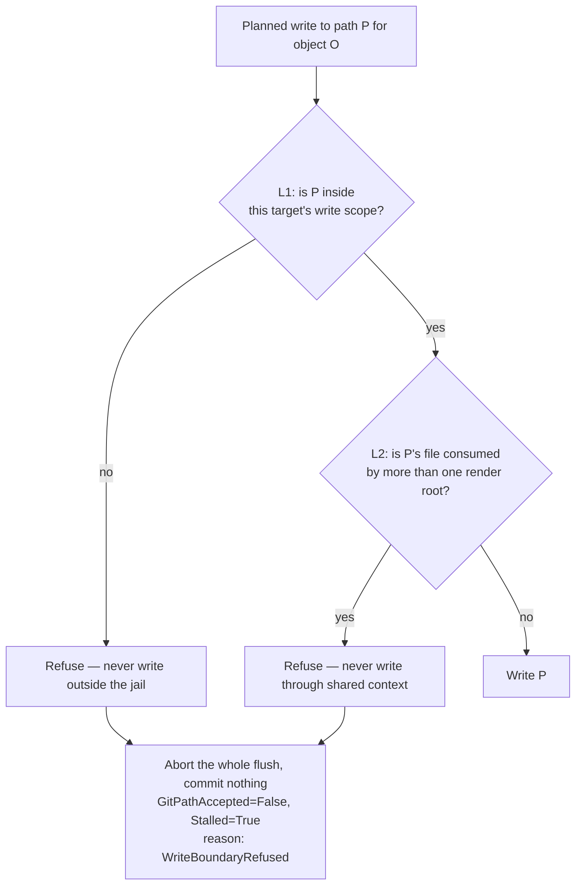
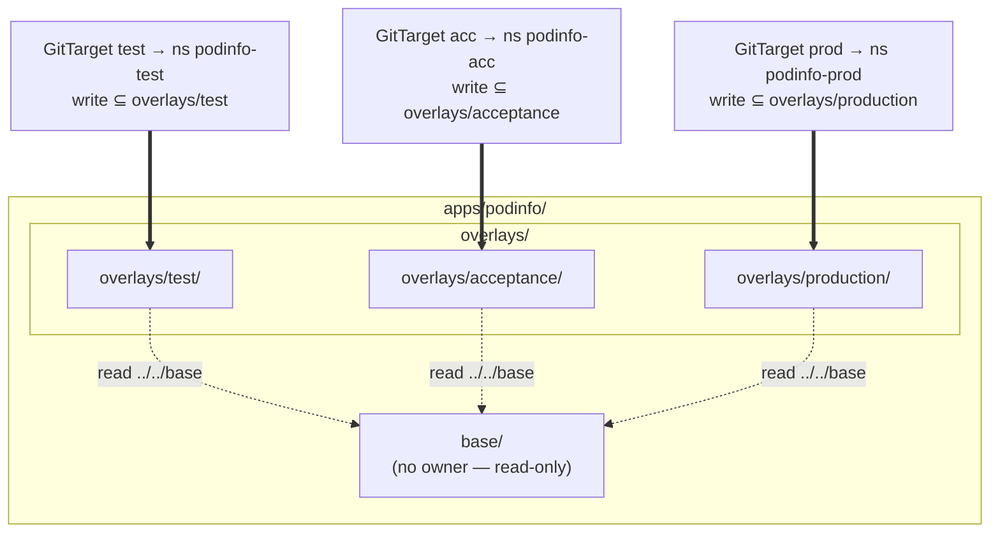
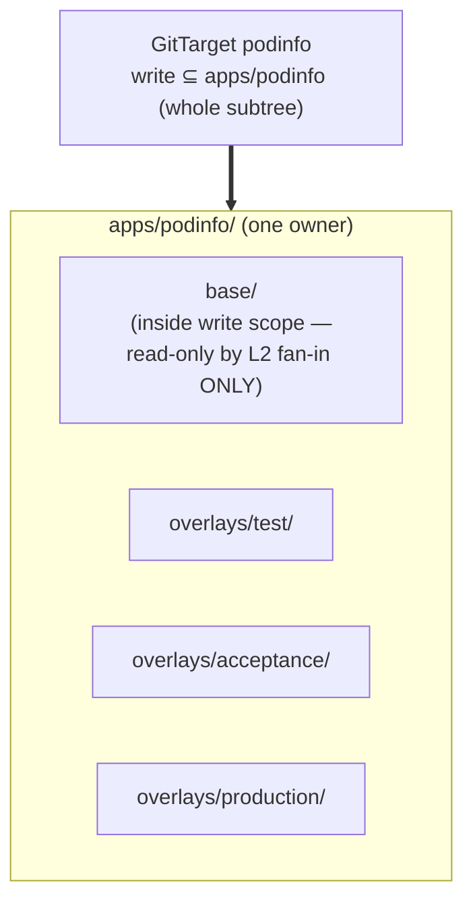
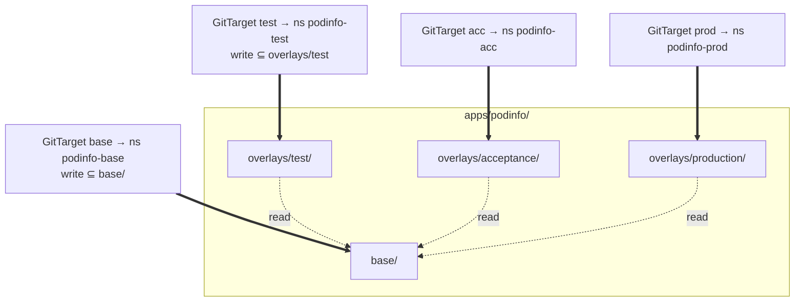
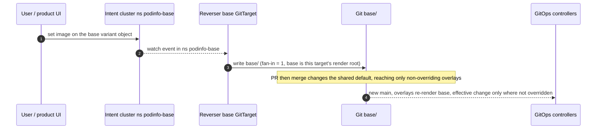

# GitTarget granularity, the write boundary, and cross-environment edits

> Status: direction-setting / options. The two forks are decided (§2 → **A**,
> §3 → **product promotion**), and the Track-1 write-boundary hardening they
> gate has **shipped**: L1 and L2 are enforced as write-plan preconditions in
> `internal/git/plan_flush.go` and surface as the GitTarget reason
> `WriteBoundaryRefused` (§1). What remains open is F2 render-root scoping and
> the divergence notification sketched in §6.
> Captured: 2026-07-09
> Related:
> [README.md](README.md),
> [kustomize-support-boundary-and-product-model.md](kustomize-support-boundary-and-product-model.md)
> (§4 invariant, §5 overlay model, §9 three arrows),
> [unreflectable-edits-and-write-gating.md](unreflectable-edits-and-write-gating.md),
> [../gitpath-foreign-content-stringency.md](../../spec/gitpath-foreign-content-stringency.md)

## Purpose

Two questions surfaced while scoping F2 that the existing docs do not settle,
and both change what the Track-1 write-boundary hardening should build:

1. **Granularity** — is a `GitTarget` allowed at an *overlay* subfolder
   (`overlays/test`), or only at the *app root* (`apps/podinfo`)? "Manage the
   higher level as one thing" resolves some problems and creates others.
2. **Cross-environment edits** — the model today makes "change one thing in
   every environment at once" (bump a version everywhere) deliberately
   impossible for the operator (§9). People *will* want it. What is the honest
   answer?

This doc records the inputs already settled, lays out each fork as concrete
options with diagrams, and — because the user asked for it — walks a fixed set
of actions through each option so the expected output is never in doubt.

## Settled inputs (so the options below are grounded)

These are decided; they frame the forks but are not reopened here.

- **The write boundary is two layers.** (§1 below.) **L1** — every path the
  operator writes is inside the target's write scope (a filesystem jail).
  **L2** — within the reachable graph, never write a file consumed by more than
  one render root (fan-in = 1). Both *were* only emergent; Track 1 made them
  explicit write-plan preconditions, checked before any byte is written.
- **The admission webhook is a fail-open accelerator, not a correctness layer.**
  It rejects unsavable edits at `kubectl apply` time for immediate,
  *atomic* feedback, but it is opt-in, intent-mode-only, and `failurePolicy:
  Ignore`. Correctness rests entirely on the L1/L2 write-plan preconditions
  below: with the webhook off, a write that would leave the jail or touch shared
  context is still refused before any byte is written. The Tier-2 unreflected-set
  accounting ([unreflectable-edits-and-write-gating.md](unreflectable-edits-and-write-gating.md))
  is **designed but unbuilt**; it adds per-edit *reporting* on top, and is not
  what keeps the base safe.
- **Floating / external sources split by *who renders*.**
  - *An external control plane renders it* — Flux `Kustomization`, Argo CD
    `Application`, Flux `HelmRelease`, KRO. These are opaque **intent** KRM to
    us; we edit their fields in place, whether the referenced source is pinned
    (`v1.2.3`) or floating (`>=1.0.0`, `main`, `latest`). The render is the
    user's responsibility. **Accept.**
  - *We render it* — a local `kustomization.yaml`'s own `resources:` / `bases:`.
    Here the operator is the inverter, so a remote or floating source makes the
    render non-deterministic and the round-trip unprovable. **Refuse the
    folder.** This is not new refusal surface (remote bases and `helmCharts` are
    already refused); it is the crisp *reason* and a commitment not to relax it.

## Decision (2026-07-09)

Both forks below are **decided — this is the user's call**, recorded here:

- **Granularity: Option A for launch; keep the way open for Option C; reject
  Option B as the operator write model.** A `GitTarget` is a *write partition* —
  one overlay = environment = watch scope = write scope. B is rejected not only
  on the L1-vs-L2 safety point but because, *even if L2 were perfect*, one target
  spanning test/acceptance/production muddies authorization, audit, status, and
  session lifecycle. "Manage the app as one thing" is a **product grouping**
  concern (an aggregate/app concept the product layer can add later over N
  targets), never a reason to widen an operator target across environments.
- **Cross-environment editing: product-layer promotion now; Option C later, and
  only for *shared defaults* — not as the answer to "edit every environment."**
  C (base-as-variant) edits the shared default/template and reaches only the
  overlays that do **not** override that field; the honest "set every
  environment's effective value" stays the product-layer Git operation (§3a).
  Promotion and factor-into-base remain distinct verbs (§3/§4). 3c rejected.

The rest of this doc keeps the full option analysis so the decision stays
legible; §2 and §3 mark the chosen paths.

## 1. The write boundary, precisely

Two nested guarantees. Keeping them distinct is what lets the granularity fork
in §2 be a real choice rather than a muddle.



Note the granularity of that refusal, because it is the thing most easily
misread. A violation aborts the **entire flush**, not just the offending edit:
nothing is committed, and the failure is recorded **once, on the GitTarget**, not
per-edit. There is no per-edit record of the dropped change today — the
`FullyReflected` condition and the unreflected set are designed
([unreflectable-edits-and-write-gating.md](unreflectable-edits-and-write-gating.md))
and **not built**. Wherever this doc says an edit is "unreflected," read it as
*the designed future behavior*; what ships today is the hard refusal above.

- **L1 is a filesystem fact.** Cheap (`filepath.Rel` prefix test), robust, and
  independent of how well we model the render graph. It is what makes "the base
  is read-only" true *by construction* when the base sits outside the write
  scope.
- **L2 is a graph fact.** It catches the case L1 cannot: a file *inside* the
  write scope that two render roots both consume (the `diamond-images` shape).
- **Read scope ⊋ write scope, always.** The operator must *read* shared context
  (a base reached via `../../base`) to know which file supplied each live value,
  but it *writes* only inside the jail. "Reading is fine, writing is not" is
  literally L1: reads may leave the write scope; writes never do.
- **Overlap between targets is a *write-scope* question only.** Two overlays
  sharing one read-only base is legal; their write scopes (the overlay dirs)
  must stay disjoint. Today's overlap check already compares `spec.path`
  (write scope) and treats siblings as non-overlapping — so it must not later
  fold the wider read scope into ownership.

**Before Track 1:** L1 held only because write paths happened to be built
relative to the write root, and L2 was not enforced at all — an ambiguous
override chain *warned and wrote through*, and the only thing preventing a
shared-file clobber was a coincidental namespace-ambiguity block.

**Now (Track 1, shipped):** both are write-plan preconditions in
`writeBatch.flush`, evaluated at the one moment every planned path is known and
before any byte is touched, alongside the existing `.gittargetignore` shadow
check:

| Layer | Precondition | Refusal issue |
|---|---|---|
| L1 | `pathScopePrecondition` — no planned write is absolute or climbs out of `spec.path` with `..` | `write-escapes-scope` |
| L2 | `fanInPrecondition` — no planned write edits a file more than one render path reaches with override entries at stake | `write-fan-in` |

A violation aborts the whole flush, commits nothing, and fails the GitTarget
with `GitPathAccepted=False` / `Stalled=True`, reason **`WriteBoundaryRefused`**
— distinct from the umbrella `UnsupportedContent`, because the folder is not
malformed: the *edit* had nowhere safe to land. This holds on both write paths.
The resync path carries the refusal back on its result channel; the live-event
path has no result channel (a commit window is finalized on a timer), so the
branch worker reports it through a `GitPathRefusalReporter` hook the watch
manager installs. Without that hook a refused live write would be prevented
correctly but silently, which is the worse failure: the user's `kubectl apply`
appears to have taken effect and Git never moves.

Refusal is *target-level and immediate*, not per-edit. That is the only surface
that exists today, and it is the honest one: the offending shape is a property of
the folder's render graph, so every subsequent edit that touches the shared file
will hit it too. Recovery is left to the resync path — once a human fixes the
layout, the next successful per-type resync clears `GitPathAccepted` back to
true. A live write never clears it, because a live write that happens to avoid
the offending file proves nothing about the rest of the subtree. When the Tier-2
per-edit unreflected-set accounting
([unreflectable-edits-and-write-gating.md](unreflectable-edits-and-write-gating.md))
exists, the *individual dropped edit* belongs there; the target-level condition
still belongs here.

L1 stays *defense-in-depth*: planned write paths are base-relative by
construction today, so the check should never fire — but it is the invariant the
base-is-read-only guarantee rests on under granularity option **A**, so it is
asserted rather than assumed.

## 2. Fork one — GitTarget granularity

Given the reference layout:

```text
apps/podinfo/
├── base/                     # no namespace; overlays inject it
└── overlays/
    ├── test/                 # namespace: podinfo-test
    ├── acceptance/           # namespace: podinfo-acc
    └── production/           # namespace: podinfo-prod
```

there are three coherent ways to place `GitTarget`s over it.

### Option A — Fine: one target per overlay (base is a read-only neighbour)

The §5 design as written. Each overlay is its own target; the base sits
*outside* every write scope and is reached only for reading.



- **Base read-only enforced by L1** (it is outside every write scope — the
  strong, filesystem guarantee).
- Clean identity: environment = GitTarget = namespace = write scope = RBAC
  scope. This is what §8/§9 lean on — "propose to test, read-only on prod" is a
  namespace RoleBinding, and a session branch is naturally single-environment.
- **Cost:** F2 must teach the analyzer to *follow* `../../base` for reading
  (today that reference is dropped). More `GitTarget` objects; onboarding emits
  several per app.

### Option B — Coarse: one target at the app root

"Manage the higher level as one thing." One `GitTarget` owns the whole
`apps/podinfo` subtree, base included.



- **What it resolves:** read scope = write scope = the owned subtree, so there
  is no "read wider than write" machinery and no `../../base` escape to follow.
  The overlap check stays trivially one-owner-per-app.
- **What it costs:** the base now sits *inside* the write scope, so the *only*
  thing keeping it read-only is **L2** — the graph fan-in rule, which is now
  enforced but is still the weaker guarantee: it depends on modelling the render
  graph correctly, where L1 is a path check that cannot be wrong. That weaker
  guarantee would become load-bearing exactly where the blast radius is highest
  ("an edit in test writes base → changes prod"), and any future fan-in blind
  spot (a shared file with no override entries at stake — see §5) is a
  corruption rather than a refusal. It also dissolves the clean identity: one
  target spans three namespaces, its watch scope is all of them, and a session
  branch can mix environments — which muddies RBAC, promotion, and session
  lifecycle.

### Option C — Fine + base-as-variant

Option A, plus the base is itself a target: a render root hydrated into its own
synthetic namespace. This is the enabler for the cross-environment fork (§3).



- **Base read-only from every overlay (L1), writable only through its own
  target.** `base/` is `test`'s neighbour (fan-in > 1 across overlays → never
  written from an overlay), but it is the *base* target's own render root
  (fan-in = 1 there → writable). The write jail per target is unchanged;
  ownership stays disjoint.
- **Nuance:** `base/` has no namespace, so the base target must inject a
  synthetic one (`podinfo-base`) for the intent cluster and strip it on
  write-back — which is exactly the existing "inherited namespaces are kept out
  of file bytes on write" behaviour, reused.

### Comparison

| | A — per overlay | B — app root | C — A + base variant |
|---|---|---|---|
| Base kept read-only by | **L1** (filesystem) | **L2** (graph) ⚠ | **L1** |
| Read wider than write | yes (`../../base`) | no | yes |
| Identity env=target=ns | clean | broken (target spans envs) | clean |
| Session branch scope | one environment | can mix environments | one environment |
| RBAC per environment | namespace RoleBinding | coarse (whole app) | namespace RoleBinding |
| Onboarding output | N targets/app | 1 target/app | N+1 targets/app |
| "Edit all envs at once" | product-layer only (§3a) | tempting but unsafe | edit base variant (§3b) |
| New F2 machinery | follow `../../base` reads | none | follow reads + base variant |

### Decision — Option A now, C kept open, B rejected

**This is the chosen path (2026-07-09):** Option A for launch, Option C as an
additive later step (shared-defaults editing, §3b), and **B rejected as the
operator write model**.

The decisive safety point stands: B makes the *weaker* guarantee (L2 — enforced
now, but only as good as our model of the render graph) the only thing between
"edit test" and "change prod", where A and C keep the base read-only by L1, the
filesystem guarantee that cannot be wrong. But the case against B **does not even
need L2**: a `GitTarget` should
be a **write partition**. Even with a perfect L2, one target spanning
test/acceptance/production muddies four things a per-overlay target keeps clean —
authorization (RBAC per namespace), audit (who changed which environment), status
(per-environment `Ready`, and the planned per-edit `FullyReflected`), and session
lifecycle (a session
branch is one environment). "Manage the app as one thing" is a *product grouping*
concern — an aggregate/app concept the product layer can add over N targets
later — not a reason to make the operator's write unit span environments.

A is also where the code and docs already point: the product model fixes
environment = GitTarget = watch scope = write scope with shared read-only bases
([kustomize-support-boundary-and-product-model.md §5](kustomize-support-boundary-and-product-model.md#L208)),
and the repo scan already classifies an out-of-subtree base as a
forward-looking F2 gap (`overlay-fan-out-needs-f2`), not permanent unsupported
structure
([scan_repo.go](../../../internal/manifestanalyzer/scan_repo.go#L37)). A is the
direction of travel; this decision commits to it.

**Onboarding UX is not a reason to pick B.** A produces N targets per app, but
object count is a product-presentation problem, not an API-shape problem: the
product layer groups the N targets as one app in its UI. Do not let "one object
is tidier" pull the write model into B.

## 3. Fork two — "edit N environments at once"

Today the operator cannot write the base, so "bump the image everywhere" has no
operator path — it is a product-layer Git computation (§9). That is correct as a
*safety* stance and wrong as a *product* stance: it is a top-three user request.
Three ways to answer it.

### 3a. Product-layer Git operation (status quo, §9)

The user bumps the tag in `test`; the operator lands the one-line
`overlays/test/kustomization.yaml` change; the product offers **promote** /
**factor into base** — a pure Git→Git copy/diff that opens a PR. The operator
never writes the base.

- **Pro:** operator stays minimal; base edits are ordinary reviewed Git changes.
- **Con:** "all at once" is a product feature that must exist, and until it does
  the answer is "edit three files." Not an *operator* capability.

### 3b. Base-as-variant (Option C): edit the shared default explicitly

The base is hydrated into a synthetic `podinfo-base` namespace that is a
**virtual editing surface, not a deployable environment**. Editing the object
*there* writes `base/` once — it changes the shared **default/template**. This is
**not** "edit every environment": the change reaches only the overlays that do
**not** override that field. If overlays carry an `images:` override, editing
`base/`'s image does not move them at all.



- **What it is good for:** editing a *shared default* as a first-class, safe
  gesture. Fan-in = 1 holds because `base/` is this target's own render root, and
  the edit is explicit (a change in `podinfo-base`), never inferred from
  per-environment observations.
- **What it is *not*:** the answer to "set every environment's effective value."
  For any field an overlay overrides, the base edit is shadowed — the honest
  every-environment change is the product-layer promotion of §3a. C edits
  defaults; promotion sets effective values.
- **RBAC / blast radius:** writing `podinfo-base` changes the default under *all*
  non-overriding environments at once, so it is not just another environment
  edit — it needs its own **"global/defaults editor"** permission, distinct from
  per-environment write access.
- **Intent-only semantics to design:** the synthetic base namespace is a virtual
  surface with no workloads and is never a deploy target. Bases that inject
  *multiple* namespaces, and **cluster-scoped** resources living in the base,
  need explicit handling before C can ship — which namespace the virtual surface
  uses, and how cluster-scoped objects are edited.

### 3c. Multi-consumer collapse (rejected)

The operator writes the base when it observes the *identical* edit in all N
overlays. **Reject:** it forces the operator to wait for and correlate N
environments before writing, it is racy, and a single-environment observation
plus a logic slip silently writes the base — reintroducing exactly the
"edit test changed prod" failure L1 exists to prevent. It also violates fan-in =
1 by design. Listed only to mark it considered and closed.

### Decision — product promotion now, C later for shared defaults

**Chosen (2026-07-09): 3a is the launch answer; 3b (Option C) comes later and
only for shared-defaults editing; 3c rejected.** The honest "set every
environment's effective value" is the product-layer Git operation — it falls out
of work already done (a tag bump in one overlay is a one-line diff to copy across
overlays). Base-as-variant is added when editing a shared *default* is worth the
virtual-namespace handling, and it is never sold as "edit everywhere."

Keep **two distinct verbs** and never conflate them:

- **Promotion** — copy an *effective* environment change across overlays
  (product-layer Git → Git). This is how "make every environment 6.6.1" is done.
- **Factor into base** — refactor a shared *default* into `base/` (Option C's
  surface, or a product refactor). This changes the template, not necessarily
  every effective value.

## 4. Worked examples: action → expected output

Fixed action set, acting in `podinfo-test` unless noted, at the **future** launch
scope (F2+F4, no F3) — this table describes where the model is headed, not what
today's binary does.

"Unreflected" here means the *designed* Tier-2 outcome: recorded in the
unreflected set, `FullyReflected=False`, reverted by hydration in intent mode
([unreflectable-edits-and-write-gating.md](unreflectable-edits-and-write-gating.md)).
None of that is built. Until it is, an edit with no legal destination either
never matches a source document (nothing happens) or trips a write-boundary
precondition and is refused outright (§1).

### Common to all options

| Action | Expected output |
|---|---|
| `kubectl set image deploy/podinfo podinfo=…:6.6.1` | `images:` entry in `overlays/test/kustomization.yaml` |
| `kubectl scale deploy/podinfo --replicas=5` | `replicas:` entry in `overlays/test/kustomization.yaml` |
| `kubectl apply -f new-cronjob.yaml` (test-only) | new `overlays/test/cronjob.yaml` + `resources:` entry |
| edit an env var on the **base-owned** Deployment | **unreflected** (no destination until F3); webhook rejects at apply time if enabled |
| edit a `HelmRelease` chart version `6.0.0 → 6.1.0` (floating range or pinned) | in-place edit of the `HelmRelease` document — **accepted** (control plane renders it) |
| a `kustomization.yaml` gains `resources: [github.com/org/repo//base?ref=main]` | **folder refused** (`GitPathAccepted=False`) — we render kustomize; a remote/floating source is non-invertible |

### Where the options differ — "bump image to 6.6.1 in *all* environments"

| Option | Expected output of "bump everywhere" |
|---|---|
| **A** (per overlay) | not an operator action — product **promote** copies the one-line change into each overlay's `kustomization.yaml`, one PR |
| **B** (app root) | *tempting* to write `base/`, but that is the unsafe path — must still be refused/kept to promotion, so B buys nothing here while weakening L1→L2 |
| **C** (base variant) | editing `base/` changes the shared *default* only — but overlays override `images:`, so it does **not** bump those environments. "Every environment effective value" is still product promotion (A's answer). C fits editing a *default*, not this action |

### Where the options differ — "how is base kept read-only"

| Option | If the operator ever computed a write into `base/deployment.yaml` from a `podinfo-test` edit |
|---|---|
| **A** | impossible — `base/` is outside `overlays/test` (L1 refuses before planning) |
| **B** | possible in principle — only L2 fan-in stops it, and L2 is the graph-modelling layer, not the path check ⚠ |
| **C** | impossible from the test target (L1); the *base* target may write `base/`, but only from a `podinfo-base` edit |

## 5. Consequences for the ladder and Track 1

- **Granularity is decided (A), which fixed the Track-1 investment.** Because A
  keeps the base read-only by **L1**, Track 1 built **L1 as an explicit
  precondition** (the strong, cheap guarantee) and turned **L2 into a refusal**
  (never write-through a multi-consumer file) — it never leans on L2 to protect
  the base. Both shipped; see §1.
- **L2's remaining blind spot is F2's job.** `fanInPrecondition` fires on the
  signal the store already carries: a file more than one render path reaches
  *with override entries at stake*. A file shared by two render roots with no
  competing `images:`/`replicas:` chain is not flagged — under layout A it is
  also never dirty (a base doc reached by distinct overlays is `NamespaceNone`
  and never matches a live object), so nothing is written. Generalizing the check
  to "any file reachable from more than one render root" is F2 render-root
  scoping, and it is what would be required before layout B could be offered.
- **F2 scope gains one concrete capability under A/C:** follow `../../base` for
  *reading* (today dropped), while the write jail stays at `spec.path`. Much of
  the read-scope / render-root / out-of-subtree-base logic already exists
  read-only in the F8 repo scan and can be promoted into the live analyzer.
- **Cross-environment editing is decided:** product promotion at launch; Option
  C (base-as-variant) later and only for editing *shared defaults*, not as the
  "every environment" answer. Neither reopens the fan-in invariant.
- **Floating-source rule needs no new code, only docs + a test:** the
  who-renders split is already how the gate behaves; state it in the support
  contract and pin it with a corpus case (a `HelmRelease` with a floating range:
  accepted; a `kustomization.yaml` with a remote base: refused).

## 6. Reflecting an edit as a *local override* — and telling the user they diverged

The write boundary refuses an edit that would land in shared context. But most
edits that *want* to land there have a legal destination one level up: the
overlay's own `kustomization.yaml`. This is the reflection path F1 already
implements, and it is worth naming explicitly, because it is the reason the L2
refusal is a narrow rule rather than a broad one.

Bump `podinfo` to `9.9.9` in the `test` namespace. The container image lives in
`base/deployment.yaml`, which `prod` also renders — writing it there is exactly
the edit L2 forbids. Instead the operator edits the overlay's `images:` entry:

```text
apps/podinfo/
├── base/deployment.yaml            #  image: podinfo:6.3.0   ← untouched, prod still renders this
└── overlays/test/kustomization.yaml
    images:
      - name: podinfo
        newTag: "9.9.9"            #  ← the write lands HERE; kustomize gives it precedence
```

The write stays inside `spec.path` (L1 holds), the shared file is never touched
(L2 holds), and the render is correct: kustomize applies `images:` *after* the
base is loaded, so the overlay entry wins. `replicas:` behaves the same way.
Field-level edits that no override entry can express (an env var, a resource
limit) have no such destination — they are the F3 patch case. Today they are
simply refused when they reach a write-boundary precondition; the honest per-edit
report of *what was dropped* is the unbuilt Tier-2 accounting
([unreflectable-edits-and-write-gating.md](unreflectable-edits-and-write-gating.md)).

**The cost: the divergence is invisible.** After that write, `test` is pinned to
`9.9.9` and no longer tracks whatever `base` says. A later bump of the base image
to `6.4.0` silently does nothing for `test` — the overlay entry shadows it. The
override *is* the intent, so this is correct behavior, not a bug. But it is a
fact the user should learn when the override is created, not months later when
they wonder why a base bump did not reach an environment.

Two shapes are worth distinguishing:

| Shape | What happened | Notable? |
|---|---|---|
| **Override updated** | an `images:` entry already existed for this image; the operator changed `newTag` | no — the overlay already diverged; the user is editing their own pin |
| **Override created** | no entry existed; the overlay rendered the base value, and the operator has now pinned it | **yes** — this is the moment the environment stops tracking base |

**Proposal (not built; own F-item).** On the *create* transition, surface the
divergence at the point it becomes true. Three candidate surfaces, cheapest
first, and they are not exclusive:

1. **Commit-message trailer** on the commit that adds the entry — e.g.
   `Overlay-Diverged: images/podinfo base=6.3.0 overlay=9.9.9`. Free, durable,
   reviewable, lands in the product PR where a human is already looking. This is
   the one to build first.
2. **Kubernetes Event** on the GitTarget (`reason: OverlayDiverged`), so the
   divergence is visible to `kubectl describe` and to anything watching events.
3. **Status** — rejected as the primary surface. A `GitTarget` condition is
   target-scoped and level-triggered; divergence is per-resource and per-edit, so
   it would either flap or accumulate unbounded. The **unreflected-set
   accounting** in
   [unreflectable-edits-and-write-gating.md](unreflectable-edits-and-write-gating.md)
   is the right home for anything per-edit and durable, once it exists.

Note the deliberate asymmetry with §1: a *refused* write is an error the user
must fix, so it fails the GitTarget. A *divergent* write is a correct write whose
consequence the user should know about, so it is a notification. Conflating the
two would make the common, healthy overlay edit look like a failure.

## 7. Decisions and remaining open items

**Decided (2026-07-09) — the user's call:**

1. **Granularity — Option A for launch, C kept open, B rejected** as the operator
   write model. A `GitTarget` is a write partition (§2 Decision).
2. **Cross-environment edits — product promotion now, Option C later and only for
   shared defaults**; 3c rejected. Promotion and factor-into-base stay distinct
   verbs (§3 Decision).

**Still open:**

3. **Divergence notification (§6)** — build the commit-message trailer on the
   "override created" transition? Own F-item; nothing depends on it shipping with
   the write boundary.
4. **Write-up placement** — fold the §1 L1/L2 model back into
   [kustomize-support-boundary-and-product-model.md §4](kustomize-support-boundary-and-product-model.md)
   (one canonical invariant statement), or keep §4 as the short invariant and let
   this doc own the two-layer detail?
5. **Option C sub-questions (deferred with C):** the synthetic base namespace's
   handling of multi-namespace bases and cluster-scoped resources, and the
   separate "global/defaults editor" RBAC role (§3b).
