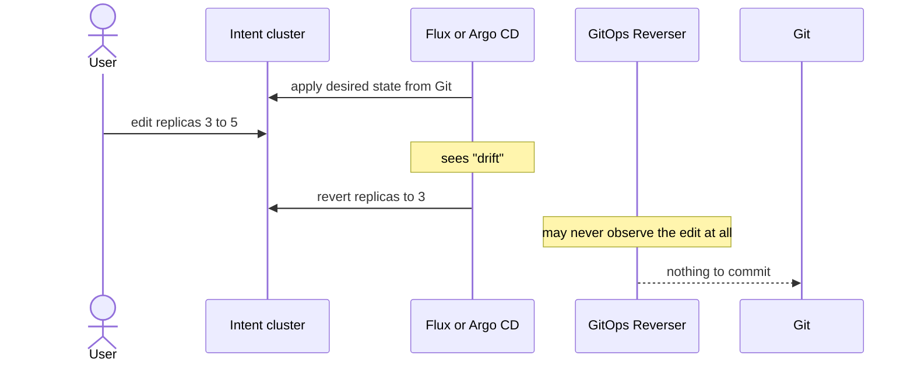
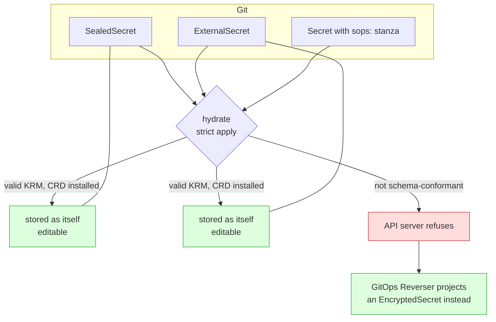

# Intent-cluster hydration: CRDs, never controllers

> Status: direction-setting; answers "can Argo CD or Flux sync these into the
> intent cluster?", ships no code.
> Captured: 2026-07-10
> Related:
> [resource-capability-model.md](resource-capability-model.md),
> [write-only-encrypted-secrets.md](write-only-encrypted-secrets.md),
> [sealed-secrets-and-external-secrets.md](sealed-secrets-and-external-secrets.md),
> [orchestrator-knowledge-boundary.md](orchestrator-knowledge-boundary.md),
> [README.md](README.md)

## The asymmetry nobody wrote down

GitOps Reverser's whole design is one direction: **live → Git**. Watch the cluster,
edit the folder, push a branch.

But the product's premise is that a user *edits Kubernetes objects*. Before they
can edit an object, that object has to **exist** in the intent cluster. Something
must run the other direction — **Git → live** — at least once.

That direction is exactly what Argo CD and Flux do for a living, and the obvious
move is to point one of them at the repository. This doc argues against that, on
two independent grounds, and lands on a rule that is much simpler than either
tool.

## Ground one: a reconciler would fight the user

Argo CD and Flux do not hydrate. They **reconcile**. Their job, their entire
value, is that when live state diverges from Git, they *put it back*.

In the intent cluster, live state diverging from Git is not drift. **It is the
user's edit.** It is the product.

At best this is a race the user loses. At worst — with `prune: true`, or Argo CD
`selfHeal` — the edit is reverted before the watch even fires. Turning
self-healing off leaves a reconciler that still owns fields, still prunes, and
still re-applies on every interval.

> **The intent cluster must never have a controller reconciling it toward Git.**
> Hydration is a one-shot apply, not a reconciliation.

This conclusion holds for every resource kind, and has nothing to do with secrets.

## Ground two: a SOPS Secret cannot be applied at all

The user's instinct — *"SOPS is by default not a good KRM object, so will Flux
ignore it, or fail?"* — is right, and the answer is **fail**, deterministically.

Verified against a real API server (Kubernetes v1.36,
`kubectl apply --dry-run=server`):

| Document | Result |
|---|---|
| `Secret` with `data:` holding `ENC[AES256_GCM,...]` | `BadRequest: illegal base64 data at input byte 3` |
| …the same, with validation disabled | **same error** |
| `Secret` with valid base64 plus a top-level `sops:` field | `BadRequest: strict decoding error: unknown field "sops"` |
| …the same, with validation disabled | created, `sops:` silently dropped |
| `Secret` with `stringData:` ciphertext, validation disabled | created, value stored as the literal text `ENC[AES256_GCM,...]` |

The first two rows are the load-bearing ones. `data` is typed as base64 bytes, so
the failure happens at **deserialization**, before validation. No amount of
lenient decoding rescues it. Any applier — `kubectl`, Argo CD, Flux's
kustomize-controller — hits the same wall.

So Flux does not ignore a SOPS Secret. It fails the whole `Kustomization`, and the
apply error is the only thing the user sees. Flux's own answer is
`spec.decryption`, which needs the **private** age identity — precisely the thing
[we will never hold](write-only-encrypted-secrets.md).

The last row is the nightmare: a lenient applier stores the ciphertext *as the
value*, and an application reads its password as the literal string
`ENC[AES256_GCM,...]`. Nothing errors. **Hydration must use strict decoding.**

## The rule that falls out

Hydration is not "run a GitOps tool against a small cluster." It is:

> **Install the CRDs. Never install the controllers.**

The intent cluster is a **schema surface**, not a reconciliation surface. It exists
so that `kubectl` can validate, store, and serve intent — nothing more. Every
controller you install has a job, and in this cluster every one of those jobs is
wrong:

| Controller | What it would do here | Verdict |
|---|---|---|
| Flux / Argo CD | revert the user's edit as drift | fatal |
| sealed-secrets | try to unseal without the private key | fails, noisily |
| External Secrets Operator | fetch real secrets from the real Vault into a throwaway cluster | a security regression |
| any workload controller | schedule Pods nobody asked for | pointless |

Install their **CRDs**, and every one of those kinds becomes storable, editable
and `kubectl`-validatable. Install nothing else.

Notice how cleanly this resolves the three secret shapes:

A `SealedSecret` and an `ExternalSecret` hydrate *as themselves*, because they are
ordinary KRM ([and that, not encryption, is the discriminator](resource-capability-model.md)).
Their controllers stay out, so they sit there inert and editable, which is exactly
what we want.

A SOPS `Secret` cannot hydrate as itself, because it is not a valid `Secret`. That
— and nothing else — is why `EncryptedSecret` exists.

## Who hydrates, then?

Not Argo CD. Not Flux. GitOps Reverser already parses the repository into a
document store to answer `ScanRepo`. Hydration is that store, applied once:

1. Walk the `GitTarget` subtree, exactly as `ScanDir` does.
2. For each document, ask the [capability registry](resource-capability-model.md).
3. `schemaConformant` → apply it, **strictly**.
4. Not `schemaConformant` → do not apply it. Create its projection instead.
5. Never prune. Never re-apply on an interval. Never watch Git.

No Git-host knowledge is added, no orchestrator is emulated, and the operator
gains a capability it half has already.

The intent cluster is disposable. If it drifts from Git for reasons other than the
user's edit, the answer is to throw it away and hydrate a fresh one — not to
reconcile it.

## What this asks of `scan-repo`

To hydrate a repository, you must first install the CRDs for every kind it
contains. Nothing reports that today.

`RepoReport` should grow a **`requiredCRDs`** field: the set of group/kind pairs a
repository's documents use that are not built into Kubernetes. It is free to
compute — the walk has already parsed every document's `apiVersion` and `kind` —
and it is exactly the list an onboarding step needs before it can stand a cluster
up. It sits naturally beside `unsupportedConstructs`, which already answers the
neighbouring question "what does this repo use that we do not manage?"

For the layout corpus, `requiredCRDs` would report `HelmRelease` and
`Kustomization` for [`09-flux-monorepo`](../../../test/fixtures/gitops-layouts/09-flux-monorepo/),
`Application` for the Argo CD fixtures, and `Composition` plus
`ResourceGraphDefinition` for
[`15-mixed-and-hostile`](../../../test/fixtures/gitops-layouts/15-mixed-and-hostile/).

## Open questions

1. **Real CRDs, or synthesised permissive ones?** To *edit* an `Application` you
   do not need Argo CD's real schema — a structural CRD with
   `x-kubernetes-preserve-unknown-fields` would store it. That removes the need to
   track upstream CRD versions, at the cost of losing every validation the user
   would want. Which failure is worse: rejecting a valid edit, or accepting an
   invalid one that only fails at merge?
2. **What is the hydration unit?** One `GitTarget` subtree, or the whole
   repository? A subtree may reference a `ConfigMap` defined outside it. The
   [read-scope](f8-repo-discovery-and-onboarding-scan.md) machinery already knows
   how to answer this for kustomize bases.
3. **How long does an intent cluster live?** Per editing session, per `GitTarget`,
   or long-lived per tenant? A long-lived one will drift from Git as other people
   merge, and nothing here reconciles it. Is re-hydration on branch change the
   answer, and what happens to an in-flight edit?
4. **Does the user ever see the ciphertext?** `EncryptedSecret` deliberately shows
   key names and not values. A user in the intent cluster running
   `kubectl get secret` sees only what they themselves wrote this session, because
   the plaintext was never hydrated. Is that surprising enough to need surfacing
   as a condition on the object?
5. **What hydrates a kind we do not recognise?** A CR with no capability
   classifier is assumed `plain`, applied, and edited. If it turns out to hold
   ciphertext in a string field, we will happily rewrite it from live state.
   Is the ordinary-KRM default right, or should an unknown CRD be read-only until
   someone classifies it?
