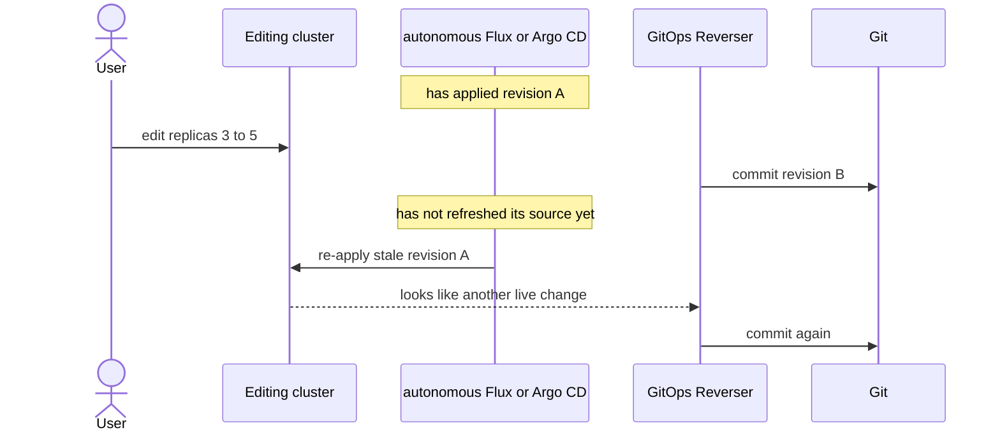
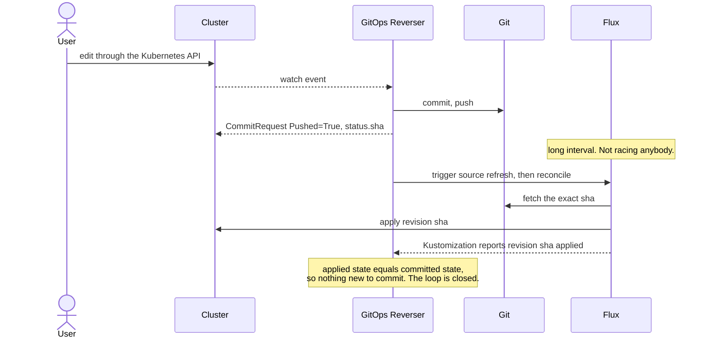
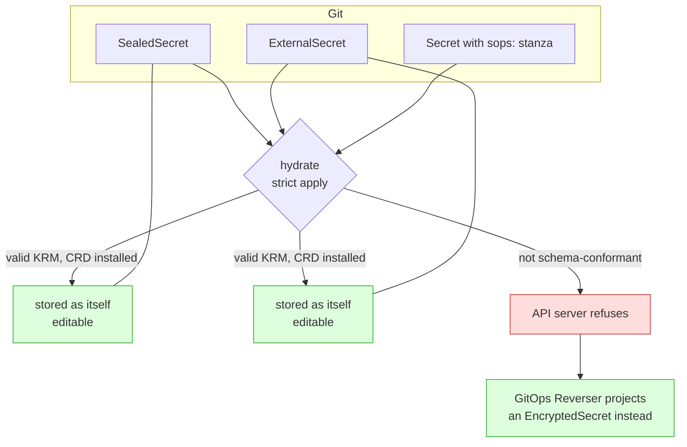

# Intent-cluster hydration: CRDs, never controllers

> Status: direction-setting; answers "can Argo CD or Flux sync these into the
> intent cluster?", ships no code.
> Captured: 2026-07-10
> Related:
> [../../bi-directional.md](../../bi-directional.md) — the operating models and the
> proven Flux handshake this doc builds on,
> [resource-capability-model.md](resource-capability-model.md),
> [write-only-encrypted-secrets.md](write-only-encrypted-secrets.md),
> [sealed-secrets-and-external-secrets.md](sealed-secrets-and-external-secrets.md),
> [orchestrator-knowledge-boundary.md](orchestrator-knowledge-boundary.md),
> [README.md](README.md)

## The asymmetry nobody wrote down

GitOps Reverser's whole design is one direction: **live → Git**. Watch the cluster,
edit the folder, push a branch.

But the product's premise is that a user *edits Kubernetes objects*. Before they
can edit an object, that object has to **exist** in the intent cluster. Something
must run the other direction — **Git → live** — at least once.

That direction is exactly what Argo CD and Flux do for a living, and the obvious
move is to point one of them at the repository. That move is **right**, with one
qualification that has already been designed, documented and proven in this
repository — and one that has not.

## Ground one: an *autonomous* reconciler fights the user. A triggered one does not.

Argo CD and Flux do not hydrate. They **reconcile**. Their value is that when live
state diverges from Git, they *put it back*.

In an editing cluster, live state diverging from Git is not drift. **It is the
user's edit.** So a reconciler left to run on its own interval is a hazard, and
[`docs/bi-directional.md`](../../bi-directional.md) already names it exactly: the
problem is **causality, not YAML**.

Stale replay, extra commits, possible loops. The failure is a **race window**
between the commit and the reconciler's source refresh — not a fundamental
incompatibility.

### The fix is an acknowledgment handshake, and it works

`bi-directional.md` prescribes it: treat the GitOps controller as a **deliberately
triggered applier**. Publish the commit, trigger the applier, and wait until it
reports that it applied *that exact revision*.

GitOps Reverser already exposes the primitive the handshake needs — a
`CommitRequest` reaching `Pushed=True` with `status.sha` and `status.branch`.

This is not a proposal. [`test/e2e/bi_directional_e2e_test.go`](../../../test/e2e/bi_directional_e2e_test.go)
runs it against real Flux with `prune: true`, and asserts the hard part — that
GitOps Reverser produces **exactly one commit** for a live edit and Flux converges
without a second one. It also covers a SOPS-encrypted `Secret` written by the
operator and reconciled by Flux, and a revert. The Flux `Kustomization` and
`GitRepository` both carry a `30m` interval, and the test drives
`flux reconcile source` / `flux reconcile kustomization` explicitly, then waits for
the expected SHA. That long interval *is* the discipline: it is what makes the
reconciler an applier rather than a competitor.

So the rule is narrower and better than "no controllers":

> **No *autonomous* reconciler on a shared path.** A reconciler driven by an
> acknowledgment handshake is not merely permitted — it is how the loop closes.

Hydration is then simply the **degenerate case of that handshake**: apply revision
X into a cluster that holds nothing yet, and wait until it is reported applied.
Same operation, empty starting state.

The genuinely open part is the second half of `bi-directional.md`'s status list:
the handshake is proven with Flux and **not yet with Argo CD**, which has no
`suspend` + `flux reconcile` equivalent — its analogue is a `Refresh` annotation
plus `syncPolicy.automated.selfHeal: false`, and nothing here has tested it.

## Ground two: a SOPS Secret cannot be applied *without a decryption key*

The user's instinct — *"SOPS is by default not a good KRM object, so will Flux
ignore it, or fail?"* — is right, and the answer is **fail**, deterministically,
whenever the applier cannot decrypt.

Flux's answer, when it *is* the real cluster, is `spec.decryption` with the
private age identity, and that path is exercised in the bi-directional e2e above.
The question that matters here is what happens in a cluster that deliberately
holds **no** key. There, the document is applied as written, and verified against
a real API server (Kubernetes v1.36, `kubectl apply --dry-run=server`):

| Document | Result |
|---|---|
| `Secret` with `data:` holding `ENC[AES256_GCM,...]` | `BadRequest: illegal base64 data at input byte 3` |
| …the same, with validation disabled | **same error** |
| `Secret` with valid base64 plus a top-level `sops:` field | `BadRequest: strict decoding error: unknown field "sops"` |
| …the same, with validation disabled | created, `sops:` silently dropped |
| `Secret` with `stringData:` ciphertext, validation disabled | created, value stored as the literal text `ENC[AES256_GCM,...]` |

The first two rows are the load-bearing ones. `data` is typed as base64 bytes, so
the failure happens at **deserialization**, before validation. No amount of
lenient decoding rescues it. Any applier — `kubectl`, Argo CD, Flux's
kustomize-controller — hits the same wall.

So a keyless Flux does not ignore a SOPS Secret. It fails the whole
`Kustomization`, and the apply error is the only thing the user sees. The escape
is `spec.decryption` and the private age identity, which is exactly the material
an editing cluster should not be handed
([why](write-only-encrypted-secrets.md)).

The last row is the nightmare: a lenient applier stores the ciphertext *as the
value*, and an application reads its password as the literal string
`ENC[AES256_GCM,...]`. Nothing errors. **Hydration must use strict decoding.**

This is the one place where hydration genuinely cannot be "just run the applier",
and it is a property of one document class, not of the tool.

## The rule that falls out

> **Always install the CRDs. Install a controller only if it is an applier you
> drive, and never one that materialises secrets.**

The intent cluster is primarily a **schema surface**: it exists so `kubectl` can
validate, store and serve intent. A reconciler is welcome in it only in the
handshake role above — triggered, SHA-acknowledged, on a long interval — and the
two secret-materialising controllers are never welcome at all, for reasons that
have nothing to do with reconciliation.

| Controller | What it does here | Verdict |
|---|---|---|
| Flux / Argo CD, **autonomous** | re-applies a stale revision over the user's edit | hazard — see [bi-directional.md](../../bi-directional.md) |
| Flux, **triggered + SHA-acknowledged** | applies exactly the revision we published | **the intended design**, proven in e2e |
| Argo CD, triggered | the same shape, `Refresh` + `selfHeal: false` | untested |
| sealed-secrets | tries to unseal without the private key | fails noisily; the object is inert, which is what we want |
| External Secrets Operator | fetches **real** secrets from the **real** Vault into a throwaway cluster | a security regression |
| any workload controller | schedules Pods nobody asked for | pointless, and it will fight `status` |

The two secret controllers are the interesting rows. Neither is excluded because
it reconciles; both are excluded because of what they would *pull into* a cluster
that is supposed to hold intent and nothing else. Leave them out and their objects
sit there inert and editable — which is precisely the goal.

Install their **CRDs**, and every one of those kinds becomes storable, editable
and `kubectl`-validatable. Install nothing else.

Notice how cleanly this resolves the three secret shapes:

A `SealedSecret` and an `ExternalSecret` hydrate *as themselves*, because they are
ordinary KRM ([and that, not encryption, is the discriminator](resource-capability-model.md)).
Their controllers stay out, so they sit there inert and editable, which is exactly
what we want.

A SOPS `Secret` cannot hydrate as itself, because it is not a valid `Secret`. That
— and nothing else — is why `EncryptedSecret` exists.

## Who hydrates, then?

Two answers, and the choice turns on one question: **does this subtree contain a
document an applier cannot apply?**

**A triggered Flux `Kustomization`** is the better answer whenever the subtree is
all schema-conformant. It is the real applier with real semantics, it is already
the acknowledgment step in the handshake above, and it is proven. Point it at the
revision, trigger it, wait for the SHA, leave it on a long interval. Nothing new
is built.

**GitOps Reverser applies the document store itself** when the subtree contains
documents no applier can accept — today, exactly the SOPS class. It already parses
the repository into a document store to answer `ScanRepo`, so hydration is that
store, applied once:

1. Walk the `GitTarget` subtree, exactly as `ScanDir` does.
2. For each document, ask the [capability registry](resource-capability-model.md).
3. `schemaConformant` → apply it, **strictly**.
4. Not `schemaConformant` → do not apply it. Create its projection instead.
5. Never prune. Never re-apply on an interval. Never watch Git.

No Git-host knowledge is added, no orchestrator is emulated, and the operator
gains a capability it half has already.

The intent cluster is disposable. If it drifts from Git for reasons other than the
user's edit, the answer is to throw it away and hydrate a fresh one — not to
reconcile it.

## What this asks of `scan-repo`

To hydrate a repository, you must first install the CRDs for every kind it
contains. Nothing reports that today.

`RepoReport` should grow a **`requiredCRDs`** field: the set of group/kind pairs a
repository's documents use that are not built into Kubernetes. It is free to
compute — the walk has already parsed every document's `apiVersion` and `kind` —
and it is exactly the list an onboarding step needs before it can stand a cluster
up. It sits naturally beside `unsupportedConstructs`, which already answers the
neighbouring question "what does this repo use that we do not manage?"

For the layout corpus, `requiredCRDs` would report `HelmRelease` and
`Kustomization` for [`09-flux-monorepo`](../../../test/fixtures/gitops-layouts/09-flux-monorepo/),
`Application` for the Argo CD fixtures, and `Composition` plus
`ResourceGraphDefinition` for
[`15-mixed-and-hostile`](../../../test/fixtures/gitops-layouts/15-mixed-and-hostile/).

## Open questions

1. **Real CRDs, or synthesised permissive ones?** To *edit* an `Application` you
   do not need Argo CD's real schema — a structural CRD with
   `x-kubernetes-preserve-unknown-fields` would store it. That removes the need to
   track upstream CRD versions, at the cost of losing every validation the user
   would want. Which failure is worse: rejecting a valid edit, or accepting an
   invalid one that only fails at merge?
2. **What is the hydration unit?** One `GitTarget` subtree, or the whole
   repository? A subtree may reference a `ConfigMap` defined outside it. The
   [read-scope](f8-repo-discovery-and-onboarding-scan.md) machinery already knows
   how to answer this for kustomize bases.
3. **How long does an intent cluster live?** Per editing session, per `GitTarget`,
   or long-lived per tenant? A long-lived one will drift from Git as other people
   merge, and nothing here reconciles it. Is re-hydration on branch change the
   answer, and what happens to an in-flight edit?
4. **Does the user ever see the ciphertext?** `EncryptedSecret` deliberately shows
   key names and not values. A user in the intent cluster running
   `kubectl get secret` sees only what they themselves wrote this session, because
   the plaintext was never hydrated. Is that surprising enough to need surfacing
   as a condition on the object?
5. **What hydrates a kind we do not recognise?** A CR with no capability
   classifier is assumed `plain`, applied, and edited. If it turns out to hold
   ciphertext in a string field, we will happily rewrite it from live state.
   Is the ordinary-KRM default right, or should an unknown CRD be read-only until
   someone classifies it?
