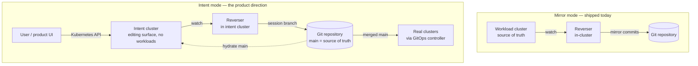
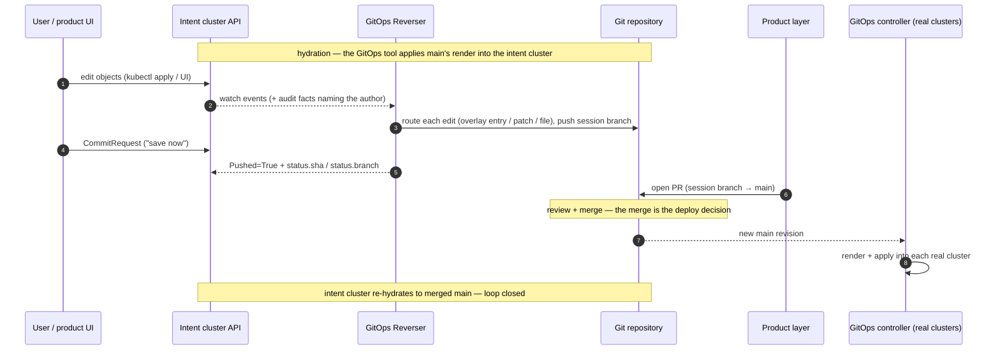

# Kustomize support boundary and product model

> Status: direction-setting; feeds F2/F3 design. The §4 fan-in invariant is no
> longer emergent — it ships as a write-plan refusal (see §1 and
> [gittarget-granularity-and-cross-environment-edits.md §1](gittarget-granularity-and-cross-environment-edits.md)).
> Captured: 2026-07-06
> Related:
> [README.md](README.md),
> [gittarget-granularity-and-cross-environment-edits.md](gittarget-granularity-and-cross-environment-edits.md),
> [finished/f1-images-replicas-edit-through.md](finished/f1-images-replicas-edit-through.md),
> [../manifest/contextual-namespace-and-kustomize-folder-editing.md](../../spec/contextual-namespace-and-kustomize-folder-editing.md),
> [../unsupported-folder-refusal-plan.md](../../spec/unsupported-folder-refusal-plan.md),
> [../manifest/version2/gittarget-new-file-placement-rules.md](../../spec/gittarget-new-file-placement-rules.md)

## Purpose

The per-feature docs in this folder answer "how do we build X." This one takes
a step back and answers the questions that decide what X should be:

1. Which part of the kustomization surface can this product **ever** support,
   and which part is permanently out?
2. Which **folder layouts** do we promise to support, and in what order?
3. Who **runs kustomize** — us, or the GitOps tool?
4. How do the multi-environment product questions resolve: how does an app get
   into *all* environments, and how does a change **promote** from test to
   production?
5. Where does the reverser **run** — inside the workload cluster it mirrors,
   or in a separate **intent cluster** whose only job is editing (§8)?

The governing rule from [README.md](README.md) is the measuring stick for the
first four: the repository must stay **round-trippable** — every edit the
operator writes has exactly one writable Git destination, and the result must
be expressible in both directions (live → Git, and Git → live via the GitOps
tool's render). Shared source documents are read-only context. The fifth is a
deployment axis that leaves that rule — and everything derived from it —
untouched (§8).

## 1. The kustomization surface: an invertibility taxonomy

Measured against round-trippability, the ~29 documented `kustomization.yaml`
fields ([reference](https://kubectl.docs.kubernetes.io/references/kustomize/kustomization/))
fall into four buckets. The boundary is not a temporary implementation gap —
most of the "never" bucket is *structurally* non-invertible, and saying so is
the support contract.

| Bucket | Fields | Why |
|---|---|---|
| **Invertible — supported** | `resources`/`bases` (local), `namespace`, `images`, `replicas` | Today's subset: namespace inference + F1 edit-through |
| **Invertible — planned** | `patches` (scalar strategic-merge, **operator-authored only**) | The one crossing worth building (F3); env drift needs a per-environment destination |
| **Invertible — possible, not planned** | `labels`, `commonLabels`, `commonAnnotations`, `buildMetadata` (subtractable in projection); `namePrefix`/`nameSuffix` (identity arithmetic cascades into every name reference); `configMapGenerator` limited to literals + `disableNameSuffixHash` | Cost/value is poor; prefixes especially buy little and touch everything |
| **Never — structurally non-invertible** | `helmCharts`/`helmGlobals` (live state does not determine chart+values inputs); generators with hash suffixes (the hash couples content to rollout — inverting means authoring rename cascades); `replacements`/`vars` (the value's source of truth is another field; a change to the target is semantically ambiguous); `generators`/`transformers`/`validators` plugins (arbitrary code = unknowable render); `components` (patch bundles composed across variants); remote bases (cannot edit what we do not own) |
| **Never — policy** | `secretGenerator` | Plaintext secrets in Git contradict the SOPS stance regardless of invertibility |
| **Refuse rather than tolerate** | `configurations`, `openapi`, `crds` | They silently change merge-key semantics, so the editor's assumptions become wrong with no visible signal |
| **Tolerable ignorables** | `sortOptions` | Does not change object state |

Two nuances found while auditing the current gate
(`hasUnsupportedKustomizeFeature`, `internal/manifestanalyzer/store.go`):

- **Tolerated metadata transformers leak.** `commonLabels`, `labels`,
  `commonAnnotations`, and `buildMetadata` pass the gate silently, but a live
  object can carry transformer-supplied metadata its source file lacks — the
  writer patches it into the file as "drift." The render stays correct
  (idempotent), so this is pollution rather than corruption, but it is the
  same "dead text shadowed by a transformer" pathology F1 fixed for `images:`.
  A future projection-side subtraction is the F1-style fix; until then the
  support statement should name the limitation.
- **The fan-out fallback is now an explicit refusal.** Ambiguous override chains
  (`ambiguous-images`, `diamond-images` corpora) still emit a warning at store
  build time, but a *planned write* into such a file is refused before any byte
  is written: write-through into a file consumed by two render roots is the one
  edit that must never happen, and it no longer depends on the coincidental
  namespace ambiguity (`NamespaceNone`) that used to block the live-object match.
  The refusal fails the GitTarget with reason `WriteBoundaryRefused`. See
  [§4](#4-the-invariant) and
  [gittarget-granularity-and-cross-environment-edits.md §1](gittarget-granularity-and-cross-environment-edits.md).

## 2. Supported layouts: an allowlist, not field caveats

The public support statement should enumerate **layouts we accept**, not
fields we reject. Three layouts, in delivery order:

1. **Plain manifest folder** — raw YAML, explicit namespaces. *Shipped.*
2. **Single-context kustomize folder** — one render root; `namespace`,
   `resources` (local files / child dirs), `images`, `replicas`. *Shipped
   (F1).*
3. **Base + environment overlays** — one shared base, N overlay roots, one
   Kubernetes namespace per overlay. *The day-one F2+F4 target, completed by
   F3; see §5.* This is the canonical layout in the kustomize documentation
   and common GitOps examples — a kustomize story without it reads as toy
   support.

**Launch posture:** all three layouts are on the launch path. Layouts 1–2
apply *per environment* (one plain folder per env, each its own GitTarget);
layout 3 launches in its **F2+F4 scope** — per-overlay `namespace` +
`resources`/`images`/`replicas`, overlay-local documents, base read-only, and
new overlay-local KRM added to that overlay's `resources:`. The day-to-day
use cases (add something to test, bump a version, edit an overlay-local
object) need exactly that slice. Per-environment edits of base-owned *fields*
are the deferred hard part (F3); today they are refused rather than written into
the base, and reporting each one as unreflected is the unbuilt Tier-2 accounting
(§4). See the launch path in [README.md](README.md).

Explicitly **out of scope**, and worth saying in user docs:

- **Fleet / cluster-root repositories** (`clusters/` + `apps/` + `infra/`
  layouts). A GitTarget points at an *app subtree*, never a cluster root.
  This composes fine with fleet repos — a Flux `Kustomization`, Argo CD
  `Application`, or another product object can point at the same app folder
  we do — and keeps us out of infrastructure folders full of Helm rendering
  and components.
- **Helm rendering in any form** (`helmCharts`, hybrid repos): permanently
  refused. Flux `HelmRelease`, Argo CD `Application`, KRO resources, and other
  control-plane CRs are ordinary KRM documents and fully in scope — the
  boundary is chart inflation, not the CRs that request it.
- **Folders transformed outside the folder.** Flux `postBuild` substitutions
  and `targetNamespace`, Argo CD Application-level kustomize overrides, or any
  controller-side transform that is not written in the folder: the folder
  alone no longer determines the render, so the round-trip promise cannot
  hold. Our contract is "we mirror what the folder alone renders." (Reading
  controller CRs in-cluster to learn those transforms is a possible
  much-later feature, not part of this boundary.)

This allowlist is a **write** contract, not a discovery one. The read-only
onboarding scanner ([F8 repo scan](f8-repo-discovery-and-onboarding-scan.md))
walks a whole repo and classifies each folder against *exactly* this boundary
— `plain` / `kustomize-single` (accepted), `kustomize-overlay` (forward-looking,
needs F2), `refused-structural` (the permanent wall above) — without widening
what the operator writes. Discovering broadly and writing narrowly is what lets
onboarding meet real GitOps repos without eroding round-trippability.

## 3. Why overlays are a different animal

Fan-out is exactly why the governing rule is "one writable destination per
edit," not "one source document owns one live object": a base
`deployment.yaml` can produce N live objects, one per environment. Two
consequences:

- **Read side** — which overlay produced the object we are watching? We need
  a variant → namespace mapping.
- **Write side** — an edit observed in the test environment must land in the
  test overlay, *never* in the base. Writing to base changes production
  because someone touched test.

So overlay support is not an incremental extension of F1; it changes the
write model from "edit the document that produced the object" to "synthesize
the minimal expression of the change **in the right variant**."

## 4. The invariant

> **The operator never writes to a file consumed by more than one render
> root.** (Write fan-in = 1. Base files and shared components are read-only
> context, always.)

This single sentence:

- makes "operator edits base" structurally impossible — nothing observed in
  one environment can ever change what another environment renders;
- explains the `diamond-images` refusal (two paths from one root);
- decides the multi-environment product questions in §9 (the operator cannot
  "add to all environments" *by design*);
- **has been promoted from emergent behavior to an explicit, tested rule** — a
  write-plan precondition that refuses the flush (`WriteBoundaryRefused`) rather
  than writing through. It is paired with the filesystem jail (writes never leave
  `spec.path`); the two layers are specified in
  [gittarget-granularity-and-cross-environment-edits.md §1](gittarget-granularity-and-cross-environment-edits.md).
  Generalizing it from "a file two override chains reach" to "any file two render
  roots reach" is F2 render-root scoping.

## 5. The overlay model (F2+F4 at launch, F3 completes it)

With the invariant in place, every observed change in environment X has
exactly one legal destination:

| Observed change in env X | Lands in |
|---|---|
| image tag / replica count | overlay X's `images:`/`replicas:` entry (F1 machinery, scoped per render root) |
| new object | new overlay-local file in overlay X **+ a `resources:` entry** (F4 placement plus entry creation — F1's "never add entries" boundary moves here) |
| any other spec field (env var, resource limits, args…) | an overlay-X strategic-merge patch — **F3, or nowhere** |
| delete of a base-owned object in one env | unrepresentable without a `$patch: delete` patch — refuse the write, or cover it in F3 |

The third row is the honesty condition on shipping F2+F4 first: an arbitrary
field edit on a base-owned object has no legal destination without patch
authoring (in-place would be the base). Day-one Kustomize support therefore
covers the common slice — overlay entries, overlay-local documents, and adding
overlay-local KRM to `resources:`.

Two mechanisms cover what falls outside that slice, and they must not be
conflated:

| | Status | Granularity | Surface |
|---|---|---|---|
| **Write-boundary refusal** (L1/L2) | **shipped** | aborts the whole flush; commits nothing | `GitPathAccepted=False`, `Stalled=True`, reason `WriteBoundaryRefused` |
| **Per-edit `FullyReflected` accounting** | **designed, unbuilt** | records the individual dropped edit; reverted by hydration | planned `FullyReflected` condition + unreflected set |

Today an out-of-scope edit is *prevented* — refused before any byte is written —
but the operator is told at the target level, not per edit. Making the third row
"reported and reverted, never silently lost" is the unbuilt accounting, and it is
a **prerequisite for the F2/F4 launch unit**, not something this branch delivers.
That remains a scoped promise rather than a gap: the launch use cases (add to
test, bump a version) never hit the third row, and tier-2 metrics on how often
real users *do* hit it are what price F3.

F3's scope stays narrow and safe: the operator only creates/updates patches
**it authored** (scalar fields, one patch file per object per overlay);
pre-existing hand-written patches still refuse the folder. The gate keeps its
shape — we accept exactly the structure we fully model, which now includes
our own patches.

What happens when an edit has **no** legal destination — the "or nowhere"
rows above — and how the user finds out, is designed separately in
[unreflectable-edits-and-write-gating.md](unreflectable-edits-and-write-gating.md)
(per-edit `FullyReflected` accounting, self-healing via hydration, and the
optional F6 admission preflight).

### Variant identification: self-describing folders over configuration

Prefer reading the mapping from the folder to declaring it on the GitTarget.
The analyzer already computes render roots (kustomizations no other
kustomization references); if each overlay sets `namespace:`, the
variant → namespace mapping is free and the repository documents itself.

- **Rule:** every overlay root must set `namespace:`, distinct per root.
  Refusal message: "add `namespace:` to each overlay."
- Namespace injected out-of-band (Flux `targetNamespace`, Argo destination)
  stays refused (§2). An explicit GitTarget-side mapping
  (`spec.variants: [{root, namespace}]`) is a fallback we add only if real
  folders cannot be made self-describing.

### Scoping: one GitTarget per overlay root

The natural shape (already sketched as F2 in [README.md](README.md)): a
GitTarget's `spec.path` names the overlay (`…/overlays/test`), so
environment = GitTarget = watch scope = write scope, and multiple GitTargets
share the branch through the existing BranchWorker serialization.

Structural consequence the F2 design must solve: the base sits *outside*
`spec.path`, so the analyzer needs a **read scope** (the repo subtree
reachable via `../../base`) wider than the **write scope** (the overlay
directory). The GitTarget path-overlap rejection must learn that shared
*read-only* context between targets is legal while overlapping *write*
scopes stay forbidden.

## 6. The reference layout

The blessed shape for docs, examples, and the test corpus:

```text
apps/podinfo/
├── base/                                 # read-only to the operator, always
│   ├── kustomization.yaml                #   resources: [deployment.yaml, service.yaml]
│   ├── deployment.yaml
│   └── service.yaml
└── overlays/
    ├── test/                             # GitTarget A → namespace podinfo-test
    │   ├── kustomization.yaml            #   namespace: podinfo-test
    │   │                                 #   resources: [../../base, debug-toolbox.yaml]
    │   │                                 #   images:   [{name: podinfo, newTag: 6.6.0-rc1}]
    │   │                                 #   replicas: [{name: podinfo, count: 1}]
    │   │                                 #   patches:  [{path: podinfo-deployment.patch.yaml}]  # F3
    │   ├── debug-toolbox.yaml            # an extra installed only in test
    │   └── podinfo-deployment.patch.yaml # operator-authored env drift (F3)
    ├── acceptance/
    │   └── kustomization.yaml            #   namespace: podinfo-acc, resources: [../../base], images/replicas
    └── production/
        └── kustomization.yaml            #   namespace: podinfo-prod, resources: [../../base], images/replicas
```

"Install extras in test" and "add files in test" are the same mechanism: an
overlay-local resource file plus its `resources:` entry, created by the
operator when a new object appears in that environment's namespace.

## 7. Who runs kustomize

Deployment stays with the user's GitOps controller — Flux, Argo CD, or
anything else that consumes KRM — because that keeps the operator out of the
deployment business and out of drift-ownership fights. But "running
kustomize" means two different things:

- **Deploying** (Git → cluster): theirs, always.
- **Understanding** (folder → expected render): ours, necessarily — the
  writer must know which file supplied each live value.

We keep *re-implementing the narrow transformer subset* rather than embedding
kustomize as the renderer: it is what keeps the refusal boundary honest (we
refuse exactly what we do not model). The worthwhile upgrade is kustomize's
Go API (`krusty`) as a **verification oracle**, not a renderer: in the
acceptance gate or in CI, build each render root in-memory and compare
against our own projection; mismatch → refuse. That buys kustomize's ground
truth without ever depending on semantics we have not modeled — the cheap,
high-confidence version of F1's parked "Option D."

## 8. Where the reverser runs: mirror mode and intent mode

Everything above is deliberately **topology-independent** — and that is the
point of this section. The same operator supports two deployment shapes:

- **Mirror mode (in-cluster) — shipped today.** The reverser runs inside the
  workload cluster it watches. The Kubernetes API is the source of truth and
  Git is the continuously updated mirror
  ([architecture.md](../../architecture.md)); writing the mirror branch
  directly is legitimate.
- **Intent mode (separate intent cluster) — the product direction.** The
  reverser runs in a dedicated — possibly public-facing — *intent cluster*
  that runs no workloads. That cluster's API is an **editing surface over the
  Git folder**: `main` is hydrated into it by normal GitOps tooling, people
  edit through the Kubernetes API (kubectl, CI, or a product UI on top), the
  reverser materializes the edits onto a session branch, and the product
  opens the PR. **Merging the PR is the deploy** — the real clusters pick up
  `main` through their own GitOps controller, and the intent cluster
  re-hydrates to the merged result.



The editing loop, in order:



### What intent mode changes

- **What a watched object means.** Mirror mode captures *actual* state;
  intent mode captures *proposed* state. The session branch is the unsaved
  buffer, the PR is the save dialog, the merge is the deploy.
- **A hydration arrow appears (Git → intent cluster).** The same GitOps
  tooling, pointed at the intent cluster, applies **every overlay into its
  namespace** — making the intent cluster the one place all environments are
  visible side by side (exactly what promotion diffs want). One tension to
  design for: a continuously drift-correcting hydrator would revert a user's
  edits mid-session, so hydration must be session-aware (suspended while a
  session is open, or one-shot per session). That lifecycle is product-layer.
- **Branch discipline replaces direct mirroring.** Intent mode writes only
  session branches; `main` moves exclusively by merge.
  `GitProvider.spec.allowedBranches` already expresses this.
- **Attribution becomes first-class instead of best-effort.** The product
  owns the intent cluster's apiserver configuration, so the audit webhook and
  OIDC claim mappings are *guaranteed* wired — every commit, and therefore
  every PR, names the real human. In customer-owned workload clusters that
  wiring can only be recommended; here it is part of the product.
- **Kubernetes RBAC becomes the edit-permission model for Git.** With
  namespace-per-overlay (§5), "may propose changes to test, read-only on
  production" is a RoleBinding — and a contributor needs **no access to any
  real cluster** to propose a production change.
- **The cluster can be hollow.** Nothing needs to run, so a
  control-plane-only cluster (k3s server-only, vcluster, kwok) suffices;
  status stays empty, which costs nothing (the sanitizer strips status
  anyway). Schema validation, admission, and RBAC still run — that is the
  "easy API" being bought: typed, validated, access-controlled editing of a
  Git folder.
- **CRD parity is a prerequisite.** Editing a custom resource requires its
  CRD installed in the intent cluster; a multi-tenant intent cluster also
  needs namespace uniqueness across the repos it hosts. Product-layer
  bookkeeping, not operator work.

### What it does not change

The taxonomy (§1), the layout allowlist (§2), the fan-in invariant (§4), the
routing table (§5), and the who-runs-kustomize split (§7) apply **verbatim**
— the operator neither knows nor cares whether the cluster it watches runs
real workloads. Intent mode is a deployment pattern plus product-layer
lifecycle, not a fork of the operator.

The modes also compose: an organization can run mirror mode inside its real
clusters (capturing drift and incident-time edits) and intent mode as the
front door for planned changes — both write the same repository through the
same routing rules.

## 9. The product model: three arrows

Every multi-environment question resolves once each direction of data flow
has exactly one owner:

| Arrow | Owner | Content |
|---|---|---|
| **API → Git** (per environment) | GitOps Reverser | Mirror each environment into *its own overlay*; never cross environments (§4 invariant) |
| **Git → API** | GitOps controller | Render and apply, unchanged |
| **Git → Git** | Product layer | Promotion, "factor into base," PR creation, branch/session policy |

The arrows are topology-independent (§8): in intent mode the API → Git arrow
originates in the intent cluster, and Git → API runs twice — the hydrator
converging the intent cluster and the customer's GitOps controller converging
the real clusters — but every arrow keeps its single owner.

Consequences:

- **"Add the same app to all environments" is deliberately not an operator
  capability.** The story is: the app appears in test (live apply, or via the
  product) → the operator lands it as `overlays/test/whatever.yaml` → the
  product offers **promote**, a pure Git computation (copy/diff between
  overlays, open a PR). No component ever writes to base automatically.
- **Promotion is a first-class product verb, not a social convention.** F1
  already makes the highest-frequency case trivial: a tag bump in test
  materializes as a one-line change to `overlays/test/kustomization.yaml`, so
  "promote to acceptance" is proposing the same one-line edit in the next
  overlay's file. Small, safe, demo-able — and it falls out of shipped work.
- **"Factor into base"** (dedupe N overlay copies into base + minimal
  patches) is a later, fancier Git → Git refactor — also product-layer, and
  computable precisely *because* the operator keeps every environment's
  effective state expressible in the folder.

The operator's contribution to promotion is that it becomes a deterministic
diff instead of an archaeology exercise.

## 10. Consequences for the feature ladder

- **Intent mode adds no write-model feature, but raises F5.** The topology's
  deltas (hydration lifecycle, PR flow, RBAC mapping) are product-layer; the
  operator-side enabler is F5 — branch/session ergonomics (base-branch
  selection, remote branch cleanup, a quiescence condition) — whose priority
  intent mode raises from "ergonomics" to "product prerequisite."
- **F2+F4 ship at launch; F3 completes them.** Render-root scoping, overlay
  new-file placement, `resources:` entry creation, and the (still unbuilt)
  unreflected-set accounting are an honest launch unit scoped to adds, bumps, and
  overlay-local edits; once the accounting exists, the first `kubectl set env`
  against a base-owned object in test is *reported and reverted* rather than
  merely refused, and never silently lost. F3 turns that report into a reflected
  edit, priced by how often the report fires.
- **Prerequisite hardening (pre-F2/F4): done.** The write-fan-in-=-1 invariant
  (§4) is explicit and tested — the ambiguity fallback provably never writes
  through into a multi-consumer file, instead of being blocked as a side effect
  of namespace ambiguity. It refuses the flush and fails the GitTarget
  (`WriteBoundaryRefused`), paired with the L1 filesystem jail.
- **F4 moves a boundary:** overlay new-object placement needs `resources:`
  entry *creation*, which F1 explicitly excluded. The exclusion was per-F1
  policy, not architecture; F4's design should own it.
- **Docs follow the allowlist:** the public support statement enumerates the
  three layouts of §2 (with the overlay rules of §5), names the
  label/annotation leak as a known limitation, and states the Helm /
  generator / fleet-root non-goals as the product's support contract.
