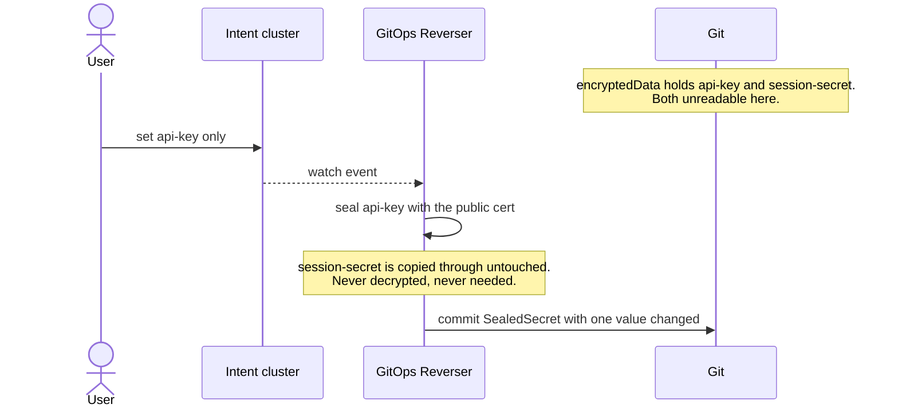
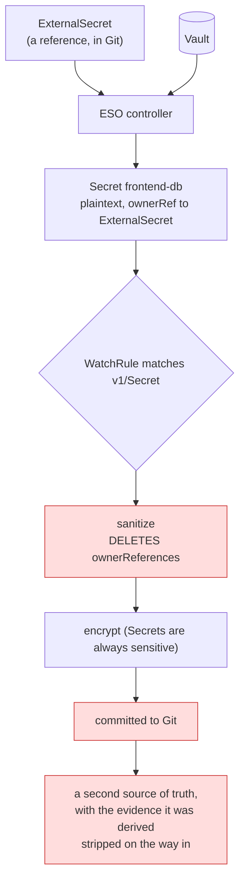

# Sealed Secrets and External Secrets: what day-1 support actually costs

> Status: analysis; proposes one write-path provider and one safety gate.
> Captured: 2026-07-10
> Related:
> [resource-capability-model.md](resource-capability-model.md),
> [write-only-encrypted-secrets.md](write-only-encrypted-secrets.md),
> [intent-cluster-hydration.md](intent-cluster-hydration.md),
> [orchestrator-knowledge-boundary.md](orchestrator-knowledge-boundary.md)

## The question

[write-only-encrypted-secrets.md](write-only-encrypted-secrets.md) closed on an
open question: SOPS, Sealed Secrets and External Secrets are all "a Secret that is
not the Secret" — *one abstraction, or three kinds?*

## The answer

**Neither.** One [capability model](resource-capability-model.md), and:

| | New kind? | Day-1 code |
|---|---|---|
| SOPS `Secret` | **yes** — `EncryptedSecret` | the projection |
| `SealedSecret` | no | a second encryption provider, plus a rename guard |
| `ExternalSecret` | no | **none** |

SOPS needs a kind because it is [not schema-conformant](resource-capability-model.md),
not because it is encrypted. The other two are ordinary, valid KRM documents that
an API server stores happily. `ExternalSecret` is not encrypted at all.

The real day-1 work is not in supporting either kind. It is a **safety gate** that
both of them make urgent, and which is missing today.

---

## Sealed Secrets

`bitnami.com/v1alpha1`, kind `SealedSecret`. The ciphertext lives in
`spec.encryptedData`, a string map. `spec.template` carries the shape of the
`Secret` it will produce — name, namespace, labels, `type` — **in cleartext**.

### It is the same posture as SOPS, and strictly better

Sealing uses the controller's **public certificate**, obtainable with
`kubeseal --fetch-cert` or handed over offline as a file. The private key never
leaves the target cluster. That is precisely the posture
[the writer already implements for SOPS](../../../internal/git/encryption.go):
public material in, no decryption, ever.

But one property makes it *better* than SOPS:

> Each value in `spec.encryptedData` is sealed **independently** — an AES session
> key per value, wrapped with RSA-OAEP. There is no MAC spanning the document.

So a value can be replaced without knowing the others. `kubeseal --raw` exists
precisely to seal exactly one value. Where SOPS forces `writeUnit: document`,
Sealed Secrets permits `writeUnit: key`:



Compare the SOPS rotation, where the whole document must be re-encrypted from a
complete plaintext supplied by the live cluster. Sealed Secrets needs no such
completeness.

### The cost nobody expects: it is a *kind* transform

The user edits a `Secret`. Git holds a `SealedSecret`. These are different GVKs.

SOPS is a **document transform** — a `Secret` in, an encrypted `Secret` out, same
identity, same file path. Sealed Secrets is a **kind transform** — a `Secret` in,
a `SealedSecret` out.

The writer's identity model keys a document by group/resource/namespace/name to
resolve its file and its placement. A kind-changing write means the live object's
identity and the Git document's identity are no longer the same, and every part
of the pipeline that assumes they are — placement, deletion planning, the
`GitPathAccepted` projection — has to learn about the mapping.

**This, and not the cryptography, is what Sealed Secrets costs.** It is worth
knowing before the estimate is made.

### The rename hazard

Sealing scope is `strict` by default: the ciphertext is bound to the target
`(namespace, name)`. The annotations `sealedsecrets.bitnami.com/namespace-wide`
and `sealedsecrets.bitnami.com/cluster-wide` relax it.

Under `strict` scope:

> Renaming or moving a `SealedSecret` invalidates **every value we did not
> re-seal** — and we cannot re-seal a value we cannot read.

A rename is therefore a silent, partial destruction: the keys we rewrote survive,
the keys we merely copied through become undecryptable. Day-1 rule: **refuse a
name or namespace change on a strictly-scoped `SealedSecret`.** The scope is
readable from the annotations, so this gate needs no key and no controller.

### Capability

| knob | value |
|---|---|
| `schemaConformant` | ✅ — it is a CR with a string map; an API server stores it |
| `visibility` | `opaque` for `spec.encryptedData`; `plain` for `spec.template` |
| `writeUnit` | `key` |
| new kind | none needed |

Adoption of an existing `SealedSecret` in Git is well served: `spec.template`
gives the target name, namespace, labels and type, and `spec.encryptedData` gives
the **key names** — all in cleartext. The same honest projection as
`EncryptedSecret`, obtained for free from ordinary KRM.

Proposed write path: a second provider on the existing
`GitTarget.spec.encryption`, whose enum is today `sops` only.
`provider: sealed-secrets` with a `certRef` to a public certificate — symmetric
with the age recipients the SOPS provider already carries, and equally free of
private key material.

---

## External Secrets

`external-secrets.io` (served at `v1beta1` and `v1`; match group and kind,
[tolerate the version](orchestrator-knowledge-boundary.md)), kind
`ExternalSecret`.

### It is already supported, and that is the finding

An `ExternalSecret` contains **no secret material at all**. It is a reference:

```yaml
spec:
  secretStoreRef: {name: vault-backend, kind: SecretStore}
  target: {name: frontend-db, creationPolicy: Owner}
  data:
    - secretKey: password
      remoteRef: {key: prod/frontend/db, property: password}
```

Every byte is plaintext, structural, ordinary KRM. It is readable, writable,
round-trippable, and an API server stores it without complaint. Its capability is
`schemaConformant: true`, `visibility: elsewhere`, `writeUnit: document`.

**Day-1 code required: none.** It already flows through the existing path.

`elsewhere` is not a weaker `opaque`. The document is not hiding a value; there is
no value in it. Editing `remoteRef.key` changes *which* secret is fetched. Nothing
a user does to this document can change what that secret *contains* — that lives
in Vault, and neither we nor Git has any say.

The only work is honesty in the UI: a field that looks like a secret's address is
not a secret's value.

### The hazard both kinds share, and it is live today

External Secrets Operator creates the `Secret` named by `spec.target.name`, and
(under the default `creationPolicy: Owner`) stamps it with an `ownerReference` to
the `ExternalSecret`. The sealed-secrets controller does the same for the `Secret`
it unseals.

Now consider a `WatchRule` that matches `v1/Secret`:



This is not a plaintext leak: a `Secret` cannot reach Git unencrypted — the writer
errors with *"secret encryption is required but no encryptor is configured"*
([`content_writer.go`](../../../internal/git/content_writer.go)). It is worse in a
quieter way. The vault's secret is now **also** a SOPS blob in Git; two systems
believe they own it; and `internal/sanitize/sanitize.go` has deleted the
`ownerReferences` that proved the object was derived, so nothing downstream can
tell.

### The gate

> **Never mirror an object that carries a controller `ownerReference`.** It is a
> controller's output, not anyone's desired state.

This is a **Tier 0, live-state** rule. It needs no Argo CD knowledge, no Flux
knowledge, no Sealed Secrets knowledge, and no External Secrets knowledge. It
reads one field that every derived object in Kubernetes already sets, and it
protects far more than secrets: `ReplicaSet`s owned by `Deployment`s, `Pod`s owned
by `ReplicaSet`s, `Endpoint`s, and every CR any operator generates.

Today `sanitize` *deletes* that field. The fix is to **gate on it before deleting
it** — the evidence must be consumed before it is discarded.

That single gate is the entire day-1 cost of supporting External Secrets safely,
and it is not really about External Secrets at all.

## What to build, in order

1. **The `ownerReference` gate on the mirror path.** Smallest, most valuable,
   independent of everything else here. Protects the External Secrets and Sealed
   Secrets derived `Secret`s, and much besides.
2. **The [capability registry](resource-capability-model.md)** with three
   classifiers: `Secret`+`sops:`, `SealedSecret`, `ExternalSecret`. `ExternalSecret`
   is a two-line classifier that exists only to say `visibility: elsewhere`.
3. **`EncryptedSecret`** — the projection SOPS needs because it is not
   schema-conformant.
4. **The `sealed-secrets` encryption provider**, priced honestly as a kind
   transform rather than as a crypto change.

Steps 1 and 2 are day-1. Step 3 is the SOPS work already designed. Step 4 is a
genuine feature, and the estimate belongs to the identity model, not to `kubeseal`.

## Open questions

1. **Does `spec.dataFrom` defeat the key projection?** An `ExternalSecret` can pull
   an entire store with `dataFrom.extract` or `dataFrom.find`. The resulting key
   set is not knowable from the document. Does the projection report
   `keys: unknown`, or does it refuse to summarise?
2. **Who supplies the sealing certificate?** SOPS publishes its recipients in
   `.sops.yaml`, in the repository. Sealed Secrets does not publish a cert
   anywhere in Git by convention. Does a `certRef` on the `GitTarget` suffice, and
   what happens when the controller rotates its key?
3. **Is a kind transform in scope at all?** A live `Secret` producing a
   `SealedSecret` document breaks the one-identity-one-document assumption that
   placement, deletion planning and `GitPathAccepted` all rest on. Is there a
   cheaper framing — for instance, the user edits a `SealedSecret` *directly* in
   the intent cluster, with a `stringData`-style write-only field that the
   operator seals and clears?
4. **`creationPolicy: Merge` and `Orphan`.** With `Orphan`, ESO sets **no**
   `ownerReference`. The gate in this doc then does not fire, and the derived
   `Secret` looks exactly like a hand-written one. Is that acceptable, or does the
   gate need a second signal — the presence of a matching `ExternalSecret` naming
   this `Secret` as its target?
