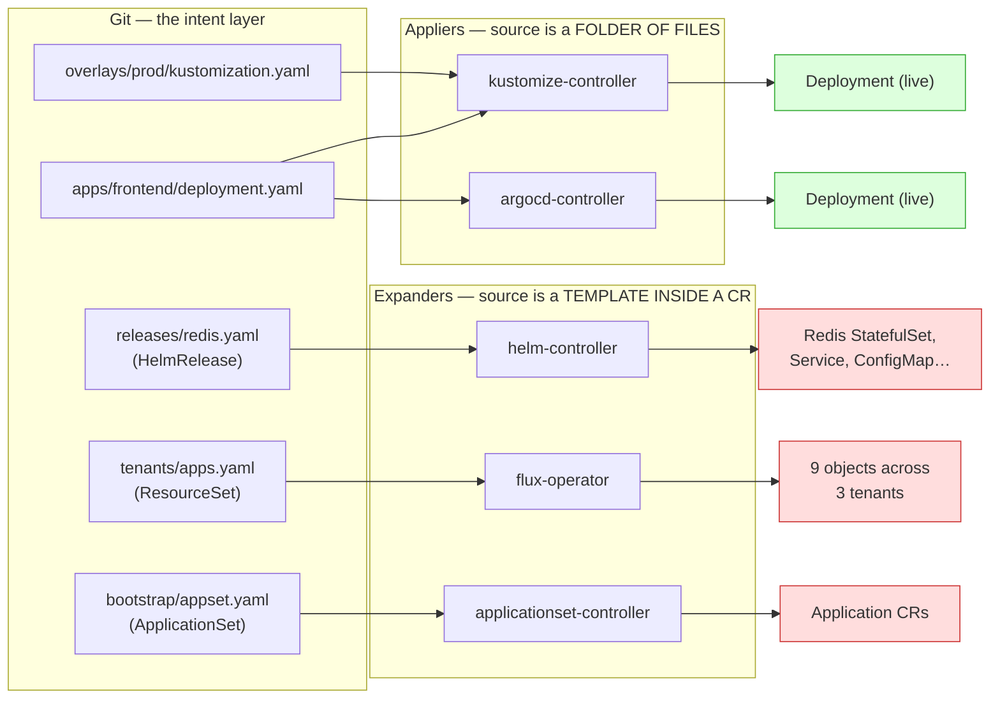

# The layer above: kcp, Flux, Argo CD — and the graph that decides the boundary

> Status: direction-setting; draws the architecture the product is heading for and
> names the one question every layer must agree on. Ships no code.
> Captured: 2026-07-13
> Related:
> [support-contract.md](support-contract.md) — the boundary this doc explains the *shape* of,
> [intent-cluster-hydration.md](intent-cluster-hydration.md) — CRDs, never controllers,
> [expansion-boundary-and-corpus-organisation.md](expansion-boundary-and-corpus-organisation.md) — the provenance axis,
> [orchestrator-knowledge-boundary.md](orchestrator-knowledge-boundary.md) — the claim vocabulary and the tiering,
> [../../facts/expansion-provenance-markers.md](../../facts/expansion-provenance-markers.md) — **the measurements this doc rests on**,
> [../../bi-directional.md](../../bi-directional.md) — the triggered-applier handshake

## Why this doc exists

GitOps Reverser is one arrow: **live → Git**. The product needs the other arrow, and
somewhere to put the user's editing session. The direction now settled on is a layer
*above* this operator that uses **kcp** for the intent cluster and **Flux / Argo CD**
as triggered appliers — the [hydration](intent-cluster-hydration.md) and
[bi-directional](../../bi-directional.md) designs, assembled into a product.

That layer does not exist yet. Before it is built, the boundaries between it and this
operator have to be crisp, because the most expensive mistake available is to let
orchestrator knowledge leak downward into the operator, or let the operator's refusals
leak upward as product gaps.

This doc draws the picture, and then names the **one question** the whole stack turns
on.

## The stack

Four layers. Each has exactly one job. The interfaces between them are primitives that
already ship.

```text
┌─ Product layer ──────────────────────────────────────────────────────┐
│  session + branch lifecycle · PR open / merge · UI                    │
│  merge == deploy                                                      │
└───────────────────────────────┬──────────────────────────────────────┘
                                │  CommitRequest: Pushed=True + status.sha + status.branch
┌─ Orchestration layer ─────────┴──────────────────────────────────────┐
│  kcp        a workspace per session — the intent cluster              │
│  Flux/Argo  TRIGGERED appliers: Git → live (hydrate), and the         │
│             acknowledgment that closes the loop                       │
└───────────────────────────────┬──────────────────────────────────────┘
                                │  the Kubernetes API — the user's write path
┌─ GitOps Reverser (this repo) ─┴──────────────────────────────────────┐
│  watch · sanitize · write the folder the way a careful human would ·  │
│  push a branch                                                        │
│  NEVER: Git-host APIs · chart rendering · generator evaluation        │
└───────────────────────────────┬──────────────────────────────────────┘
                                │
┌─ Git ─────────────────────────┴──────────────────────────────────────┐
│  the intent layer — the files, and the only thing that is true        │
└──────────────────────────────────────────────────────────────────────┘
```

The operator's contract with the layer above is deliberately thin and already exists:
it publishes a commit and reports `Pushed=True` with a SHA. Everything the
orchestration layer does — trigger the applier, wait for that exact revision, open the
PR — is built on that one signal. Nothing about kcp, GitHub, or Argo CD needs to enter
this repository for it to work.

## The one question the whole stack turns on

Every layer, asked about any live object, must give the same answer to:

> ### Does this object have a home in Git — exactly one file that is its source?

- **Yes** → mirror it, edit it, write the edit back to that file. This is the **intent
  layer**, and it is the product.
- **No** → never mirror it. A controller synthesised it; writing it to Git invents a
  **second source of truth that fights the controller that made it**. This is the
  **expansion layer**.

That is [the support contract](support-contract.md) in one line. And it is a question
about a **graph**, not about a field on an object.

## The graph

Every GitOps repository is a starting point that explodes into more KRM. Draw the
explosion as a DAG — files, then controllers, then live objects — and the boundary
becomes a property of the edges rather than a list of special cases.



Green objects have a home file. Red ones do not. **Both kinds were applied by a
controller** — which is why *"was a controller involved?"* is the wrong question.

The discriminator is one level up: **what is the controller's source?** A folder of
files (invertible — the file is right there) or a template inside a CR (not
invertible — the file is the CR, and the object is a rendering of a field in it).

## The boundary is the *inverse* of that graph

GitOps Reverser runs the arrows backwards. So the support contract is simply: **the
inverse is defined exactly where an edge is invertible.**

Four cases, one rule:

| In-edges on the live object | Edge kind | Verdict | Why |
|---|---|---|---|
| **0** — nobody applied it | — | **Editable** | a human authored it directly. In an intent cluster this is the *normal* case, and it is the whole product |
| **1** | applier (source = a folder of files) | **Editable** | the file is right there; the edit inverts to it |
| **1** | expander (source = a template in a CR) | **Not mirrored** | there is no file. The CR is editable; its *output* has nowhere to go |
| **N > 1** | applier | **Refused** | a shared kustomize base: the edit would change more than one thing. This is **fan-in = 1**, already the [write boundary](gittarget-granularity-and-cross-environment-edits.md) |

The three axes the design has been circling —
*renderability*, *ownership*, *provenance* — are the three ways an edge can fail to
invert. They are not three separate models. They are one graph, read backwards.

Note the row that is easy to miss: **an object with zero in-edges is editable.** That
is not a degenerate case; in a properly-built intent cluster it is *every* object, and
the next section is why.

## What kcp changes — and what it does not

### It removes the expansion layer, structurally

An intent cluster built as a **kcp workspace** carries schemas and nothing else: no
helm-controller, no flux-operator, no applicationset-controller. That follows directly
from the standing rule in
[intent-cluster-hydration.md](intent-cluster-hydration.md) — *"always install the
CRDs; install a controller only if it is an applier you drive"* — and a ResourceSet
expander is not an applier we drive.

So in the intent workspace **the expansion layer does not exist**. Nothing derives
anything. Every object there arrived by exactly one of two routes:

```text
file ──hydrate──▶ object ──user edits it──▶ object′ ──reverser──▶ file′
                     ▲
                     └── or the user created it outright (zero in-edges)
```

Both are intent. The graph is trivial, every object has exactly one home, and — the
payoff —

> **the provenance gate is answered by the topology instead of by evidence.**

That is the strongest available argument for kcp, and it should be stated plainly,
because it *prices* the hardest unbuilt thing in this workstream:

| Intent-cluster topology | Expansion controllers running? | Is the provenance gate needed? |
|---|---|---|
| **kcp workspace** (lightweight) | **No** — schemas only | **No.** Nothing derives anything. Structurally impossible, not merely unlikely |
| **A real production cluster** | **Yes** | **Yes — and it is hard.** See the [measurements](../../facts/expansion-provenance-markers.md): three evidence vocabularies, and `ownerReference` catches one producer in five |

[Decision 1](expansion-boundary-and-corpus-organisation.md) of the expansion doc says
both topologies are supported, and that stands. But the **cost is not symmetric**, and
this is where the asymmetry lands:

> The more the product leans on kcp, the less the expensive gate matters. The more it
> leans on *"point it at your real cluster"*, the more the gate becomes a hard,
> load-bearing prerequisite — one whose evidence we have now measured and found to be
> a mess.

That is a strategic fork, not a detail, and it is worth taking deliberately rather than
by drift.

### What kcp does *not* solve

Four things, and the last is the one that is easiest to lose.

1. **Hydration still needs the schemas, and in kcp they are not CRDs.** To store an
   `Application` in a workspace you need its schema — an `APIResourceSchema` plus an
   `APIExport`/`APIBinding` — rather than a CRD apply. The `requiredCRDs` field
   proposed in [intent-cluster-hydration.md](intent-cluster-hydration.md) becomes
   `requiredAPIs`, and it is a **precondition of standing the workspace up at all**,
   not a nice-to-have on a report.

2. **Flux and Argo CD have to be able to point *at* a workspace. This is untested.**
   kcp is not a full Kubernetes API: no pods, no nodes, a restricted discovery surface.
   kustomize-controller mostly does server-side apply against an API server and is a
   plausible fit; Argo CD registers clusters and runs a much heavier cache/diff/health
   engine whose assumptions are less likely to hold. **This is the largest untested
   assumption in the entire direction** and deserves a spike before anything is built
   on top of it.

3. **`kcp.io/cluster` must never reach Git.** Already handled, and it is the only
   kcp-awareness in the codebase: `sanitize` strips that key exactly (not by prefix —
   sibling `kcp.io/` keys are not assumed to be bookkeeping). It is an *address*, and
   committed to Git it would pin a manifest to one workspace and then travel with it
   into every other.

4. **The expansion layer still exists in the repository.** This is the one to hold on
   to:

   > **kcp answers "where do I safely edit". It says nothing about "is this repository
   > editable".**

   Those are different questions, and only the second is the support contract. A
   `ResourceSet` repository's workloads have no files whether you edit them in kcp, in
   k3d, or in production. Hydrating such a repo into a pristine workspace does not give
   its nine expanded objects a home — it just means nothing expands them, so they never
   appear, so the user cannot edit what they came to edit. The refusal is a property of
   the repo, and it survives every topology.

## Bi-directional is the same graph, read backwards, with a clock

The other arrow — Git → live — is what Flux and Argo CD do for a living. The only
hazard is **causality, not YAML**: a reconciler left on its own interval will re-apply
a stale revision over the user's edit, because in an editing cluster *live state
diverging from Git is not drift — it is the edit*.

The fix is the [acknowledgment handshake](../../bi-directional.md): treat the
reconciler as a **deliberately triggered applier**, publish the commit, trigger it, and
wait until it reports that it applied *that exact SHA*. Both engines are proven against
it in the [bi-directional corner](../../spec/e2e-bi-directional-corner.md) — Flux via
`flux reconcile` + `lastAppliedRevision`, Argo CD via `selfHeal: false` + a push
webhook.

**Hydration is the degenerate case of that same handshake**: apply revision X into a
workspace that holds nothing yet, and wait until it is reported applied. Same
operation, empty starting state.

Which means the Git → live arrow is, in its essentials, already proven. What is *not*
proven is that it works when the target is a kcp workspace rather than a real cluster —
which is risk 2 above, and the reason it is the first thing to spike.

## What to build, in order

1. **Spike: point Flux at a kcp workspace.** Hydrate one corpus fixture, close the
   acknowledgment handshake, edit an object, get a commit. This is the load-bearing
   unknown; everything else is downstream of it. If Argo CD cannot register a workspace,
   that is worth knowing before the product assumes it can.
2. **`requiredAPIs` in the scan report** — free to compute (the walk has already parsed
   every `apiVersion`/`kind`), and it is precisely the list the workspace needs before
   it can hold anything.
3. **Close the sanitize leaks** — `helm.toolkit.fluxcd.io/`,
   `resourceset.fluxcd.controlplane.io/`, `meta.helm.sh/`. Small, and independent of
   every decision above.
4. **The provenance gate — but only if the production-cluster topology is really on the
   roadmap.** And if it is, key it on the
   [measured evidence table](../../facts/expansion-provenance-markers.md), not on
   `ownerReference`. It must run **on the live object, before the sanitizer**, because
   the sanitizer destroys the very evidence it needs.

## Open questions

1. **Can Argo CD manage a kcp workspace at all?** Flux is plausible; Argo's cluster
   registration, health assessment, and resource cache make far stronger assumptions
   about the API surface. If the answer is no, the intent cluster is Flux-only and the
   Argo CD story becomes "we mirror and edit your Argo repos", not "we hydrate into an
   Argo-managed workspace". That is still a good product — but it is a different one.
2. **Is the intent workspace per session, per `GitTarget`, or per tenant?** A
   long-lived workspace drifts from Git as other people merge, and nothing here
   reconciles it. Re-hydration on branch change is the obvious answer; what happens to
   an in-flight edit is not.
3. **Does the fan-in = 1 rule hold for a field of a document?** A `ResourceSet`'s
   `spec.inputs[j]` has fan-in 1 and is the right edit surface; `spec.resources[i]` has
   fan-in N. Both are fields of the *same file*. The write boundary is currently
   specified over files, and this is the first construct that makes the distinction
   matter.
4. **If the gate is answered by topology in kcp, is it worth building at all?** The
   honest answer depends on question 1 in
   [decision 1](expansion-boundary-and-corpus-organisation.md) — whether "edit your
   real production cluster" is a launch topology or an eventual one. It is currently
   listed as supported, and that is what makes the gate mandatory rather than optional.
