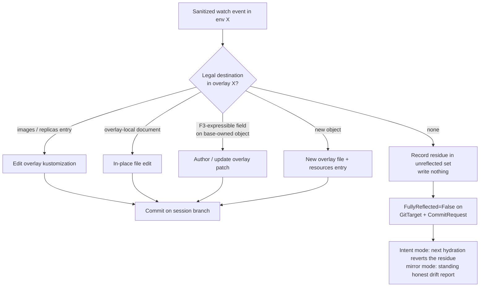

# Unreflectable edits: honest accounting and the admission preflight gate

> Status: direction-setting (no code change; extends
> [kustomize-support-boundary-and-product-model.md](kustomize-support-boundary-and-product-model.md)
> §5/§8, defines F6)
> Captured: 2026-07-06
> Related:
> [README.md](README.md),
> [finished/f1-images-replicas-edit-through.md](finished/f1-images-replicas-edit-through.md),
> [../unsupported-folder-refusal-plan.md](../../spec/unsupported-folder-refusal-plan.md)

## Problem

The write-fan-in invariant (never write a file consumed by more than one
render root) makes base files and all other shared context **read-only**.
That is the right call — it is what keeps an edit in test from changing what
production renders. But it has an unavoidable consequence: **some fields of a
hydrated object can no longer be changed through the Kubernetes API** — or
more precisely, the change persists in the cluster but has no legal
destination in Git.

With the reference layout (base + test/acceptance/production overlays, the
product-launch target) and F1 shipped + F2/F3 as scoped, the unreflectable
classes are concrete and enumerable:

1. **Out-of-scope field edits on a base-owned object.** F3 v1 authors
   scalar-field strategic-merge patches; anything beyond that scope
   (structural list surgery on unkeyed lists, atomic-list semantics,
   map-key removal if excluded from v1) has no destination. Until F3 lands,
   *every* per-environment field edit on a base-owned object is in this
   class — at launch it is the largest one.
2. **Per-environment delete of a base-owned object.** Expressible only as a
   `$patch: delete` patch — in or out of F3 v1 is a scope decision; until it
   is in, unreflectable. (A rename is a delete plus a create: the create
   half is always fine, the delete half is this class.)
3. **Divergent consumers of a shared override entry** (F1's known
   limitation): one `images:` entry cannot hold two tags.
4. **Transformer-supplied metadata**: a label or annotation owned by a
   tolerated-but-unmodeled metadata transformer (`commonLabels`, `labels`,
   `commonAnnotations`, `buildMetadata`) cannot be edited per environment.
5. **Read-only context beyond the sibling base.** In-repo shared bases
   anywhere in the repository (e.g. `platform/common-base`) are reachable
   read scope, never write scope. Remote URL bases stay refused at
   onboarding — we cannot even *read* them deterministically.

The question this document answers: **what happens when a user makes one of
these edits anyway?**

## Principles

1. **Never write through.** The invariant is absolute; a fallback that edits
   shared context is worse than any amount of refusal.
2. **Never drop silently.** An edit the operator cannot reflect must become
   a visible fact, not a quiet divergence.
3. **Never punish the folder for one edit.** Structural facts about the
   *folder* may refuse the whole GitTarget (that gate exists today); a
   single runtime *edit* must never stall every session on the target.
4. **Feedback belongs near the actor.** The best place to learn "this cannot
   be saved" is at `kubectl apply` time; the second best is on the
   CommitRequest the product already polls; a GitTarget condition is the
   backstop, not the primary surface.
5. **Correctness must not depend on optional layers.** Any admission-time
   gate can be down, stale, or disabled; the system underneath it must
   already be honest.

## Three tiers of "no"

The two ideas on the table — an admission webhook that refuses unsavable
writes, and a GitTarget state that reports misuse — are not competitors.
They are different tiers of one escalation, each scoped to what it is good
at, plus the structural gate that already exists:

| Tier | Scope | Mechanism | Status |
|---|---|---|---|
| **1. Onboarding refusal** | whole folder, structural facts | acceptance gate: `GitPathAccepted=False`, `Stalled=True` on unsupported constructs | shipped |
| **2. Per-edit accounting** | one object/field, runtime edits | the **unreflected set** + `FullyReflected` conditions; self-healing in intent mode | the load-bearing answer — ships with the F2/F4 launch unit |
| **3. Admission preflight** | one API request, pre-persistence | opt-in validating webhook in the intent cluster; rejects writes that would leave residue; **fail-open** | F6, fast-follow |

Note the fifth branch: a single API write can contain both reflectable and
unreflectable fields. The writer reflects what it can (F1 already routes
mixed changes field-by-field) and records the remainder — see the atomicity
caveat under tier 3.

## Tier 2: the unreflected set (load-bearing)

**Definition.** The unreflected set is the standing sanitized diff between
live state and the folder's render, per GitTarget, annotated with the
supplier/reason that made each residue unwritable. It should be recomputable:
the mark-and-sweep resync rebuilds it from scratch, steady-state events add
and remove entries incrementally, and no durable store is needed (consistent
with "watch supplies state"). But this is real F2 implementation work, not a
status-only rename: the projection must know which fields came from shared
context, overlay-local files, override entries, or transformer-owned metadata.

**Surfacing.**

- **GitTarget** gains a `FullyReflected` condition (`True` when the set is
  empty) plus a bounded status summary (count + a capped sample of
  `object, field, reason`), in the style of `status.streams`. `Ready` is
  unaffected — the target still works; this is a report, not a failure.
- **CommitRequest** gains the same `FullyReflected` condition scoped to the
  saved window: "everything you asked to save was expressed in the commit."
  This is the product's primary surface — it already polls the
  CommitRequest for `Pushed` + `status.sha`, so "your session saved, but
  these 2 edits could not be expressed and will be reverted" is one more
  condition on an object it already reads.

**Convergence.** What happens to the residue differs by topology, and in
both cases the honest report is our whole job:

- **Intent mode**: the hydrator re-applies `main`'s render, reverting the
  residue — the unsavable part of the buffer is discarded, like an editor
  refusing to keep an invalid character. `FullyReflected` returns to `True`
  on its own. The loop is safe *by construction*, gate or no gate.
- **Mirror mode**: the cluster is the source of truth and nothing reverts
  (unless the customer's own GitOps tool drift-corrects). The condition is
  then a standing, honest statement: "live state exists that this folder
  cannot express." That is a drift report, not an error — and it must never
  block the customer's cluster operations.

**Clearing.** An entry clears when live equals render again — whether by
hydration, by the customer's drift correction, or by the user undoing the
edit. No timer, no manual ack.

## Tier 3: the admission preflight gate (F6)

An opt-in validating admission webhook, registered in the intent cluster on
CREATE/UPDATE/DELETE in the namespaces claimed by gated GitTargets. It
evaluates the same projection the writer uses — "would this write leave
residue?" — and rejects with an actionable message naming the supplier:

> `spec.template.spec.containers[0].env` on `Deployment/podinfo` is supplied
> by `apps/podinfo/base/deployment.yaml`, which is shared by all
> environments. This edit cannot be saved for `podinfo-test` alone. (Bump
> images/replicas via the overlay entry; other per-env fields need patch
> support / a base change via a normal Git PR.)

Design choices, each answering a concern raised against the webhook idea:

- **Fail-open (`failurePolicy: Ignore`), because tier 2 backstops it.** The
  gate is a UX accelerator, not a correctness layer. If it is down, edits
  land, tier 2 reports them, hydration reverts them. This is what makes
  "slows things down / could be annoying" acceptable: nothing depends on it.
- **Scoped, so the latency worry stays small.** It gates only claimed
  namespaces in a cluster the product owns end-to-end; no customer workload
  traffic ever crosses it. Evaluation is in-memory against the manifest
  store — no Git round-trip.
- **Staleness is tolerated, not solved.** The decision uses a snapshot of
  the analyzer store that can race a concurrent push. A wrong *allow* is
  caught by tier 2; a wrong *deny* is a retry. Neither corrupts anything.
- **Free preflight via dry-run.** With `sideEffects: None` the gate runs on
  `kubectl apply --dry-run=server` — "can I save this?" becomes a native
  Kubernetes question the product UI can ask before the user commits.
- **The real argument for building it is atomicity, not speed.** Tier 2
  reflects field-by-field: a single apply that bumps a tag *and* edits an
  unreflectable field saves the tag and loses the edit — a mixed outcome
  the user never expressed. Admission is the only point where intent can be
  rejected *whole*, before persistence. (This is the same pre-persistence
  property that makes admission wrong for attribution — see
  [architecture.md](../../architecture.md) — used here for exactly what it
  is good at: prevention. Admission prevents, audit attributes, watch
  supplies state.)
- **Never in mirror mode.** We do not get to reject a customer's production
  operations because our mirror is lossy. The gate is an intent-cluster
  product feature, off by default, enabled per GitTarget (e.g.
  `spec.writeGate: Enforce | Off`).

## Why not a GitTarget-wide "unsupported mode"

The alternative considered — the GitTarget drops into a degraded state when
an unreflectable edit occurs — mixes two different kinds of fact:

- **Structural facts** are stable, folder-level, and human-fixable
  ("this folder uses Helm"). Whole-target refusal is right, exists today
  (tier 1), and stays.
- **Runtime edits** are transient, object-level, and often self-healing
  (hydration reverts them minutes later). Escalating them to a target-wide
  state punishes every session for one edit, moves the feedback far from
  the actor, and flaps: `Stalled` would toggle as hydration reverts the
  residue.

So the target-wide idea survives as the *reporting* half of tier 2 — a
`FullyReflected=False` condition with a bounded sample — while never
degrading `Ready` and never blocking other writes. Clear *and*
non-invasive, rather than a trade between the two.

## Reference-layout walk-through

Every row assumes the launch layout (`base/` + `overlays/{test,acceptance,
production}`) with F2+F4 shipped (and F3 where marked), acting in
`podinfo-test`:

| Action in `podinfo-test` | Outcome |
|---|---|
| `kubectl set image deploy/podinfo podinfo=…:6.6.1` | reflected → `images:` entry in `overlays/test/kustomization.yaml` |
| `kubectl scale deploy/podinfo --replicas=5` | reflected → `replicas:` entry |
| set an env var / resource limit on the base-owned Deployment | with **F3**: reflected → `overlays/test/podinfo-deployment.patch.yaml`; at launch (F2+F4 only): **unreflected** — reported, reverted by hydration |
| `kubectl apply -f new-cronjob.yaml` | reflected → new overlay-local file + `resources:` entry (F4) |
| edit the test-only debug-toolbox object | reflected → in-place edit of `overlays/test/debug-toolbox.yaml` |
| delete the base-owned Service in test only | **unreflected** until `$patch: delete` lands in F3 → reported, reverted by hydration (gate rejects it up front) |
| change a label supplied by `commonLabels` | **unreflected** (transformer-owned metadata) |
| hot-bump one of two Deployments sharing one `images:` entry | **unreflected** (divergent consumers — F1's known limitation) |

These rows are the intended residual surface for the launch layout. The F2/F4
definition of done must prove that surface with a corpus and e2e cases; any
new residual class either gets a legal destination or joins this table with a
clear reason. That is the support statement the product can make — each
unsupported row has a designed answer (report + revert, optionally reject up
front) rather than undefined behavior.

## Consequences for the feature ladder

- **Tier 2 is part of the F2/F4 definition of done**, not a separate feature:
  the Kustomize launch unit ships *without* F3, so overlay support without
  the unreflected set would reintroduce silent divergence, which principle 2
  forbids.
- **Tier 3 is F6** — a fast-follow after the F2/F4 launch unit, independent
  of F3; intent-mode only, opt-in, fail-open. Its value is *highest while F3
  is absent*:
  per-env edits of base-owned fields are then the largest unreflected
  class, and the gate is what tells the user so at apply time instead of
  after the save. It needs the same projection tier 2 needs, so its
  marginal cost is the webhook plumbing, not new analysis.
- **F3 scope decisions move rows between tables.** Each capability added to
  patch authoring (`$patch: delete`, map-key removal) deletes a row from
  the unreflected classes. The classes list above doubles as F3's backlog,
  priced by how often each row is hit in practice — a metric tier 2's
  accounting can emit.
