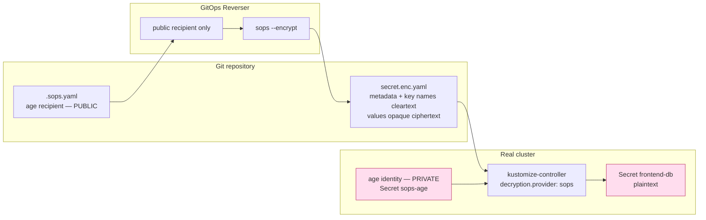
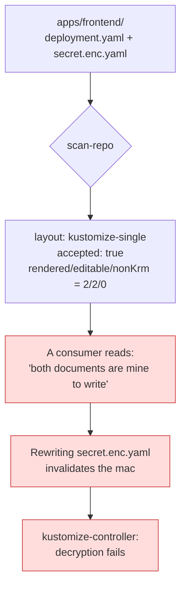
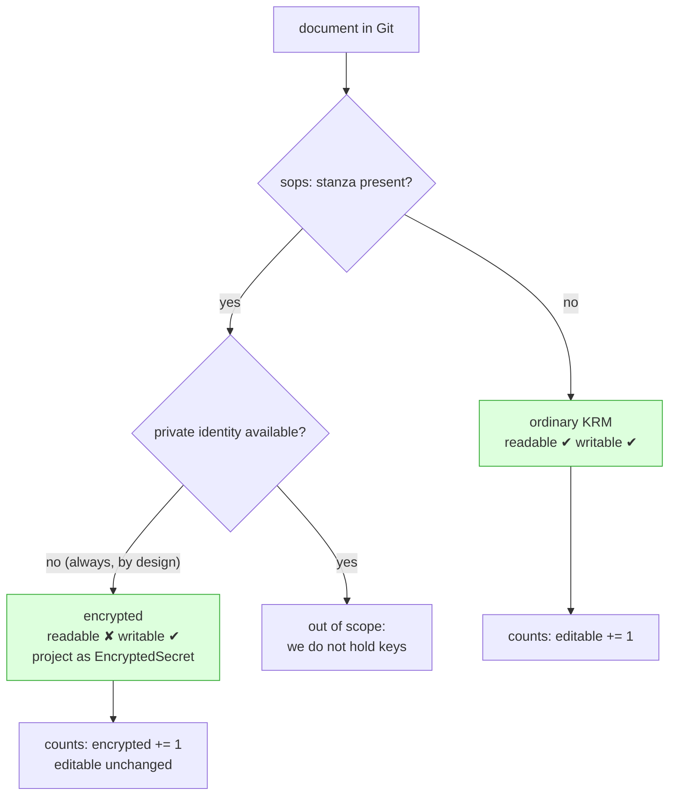

# Write-only encrypted secrets: describe the ciphertext, never read it

> Status: direction-setting; proposes an API, ships no code.
> Captured: 2026-07-10
> Related:
> [orchestrator-knowledge-boundary.md](orchestrator-knowledge-boundary.md),
> [README.md](README.md),
> [kustomize-support-boundary-and-product-model.md](kustomize-support-boundary-and-product-model.md),
> [f8-repo-discovery-and-onboarding-scan.md](f8-repo-discovery-and-onboarding-scan.md),
> fixture [`13-sops-encrypted`](../../../test/fixtures/gitops-layouts/13-sops-encrypted/)

## The idea

A SOPS-encrypted `Secret` in Git is not a folder we should refuse. It is a
resource we can **describe precisely and write blindly**:

> *"This is a SOPS-encrypted Secret. It lives at `apps/frontend/secret.enc.yaml`.
> It holds the keys `DATABASE_PASSWORD` and `API_KEY`. It is encrypted to these
> recipients. You **may** set a new value. You **cannot** read the current one,
> and neither can GitOps Reverser."*

In the real cluster, the GitOps tool decrypts it and an ordinary `Secret` appears.
GitOps Reverser never participates in that step, and never wants to.

This is [the ownership axis](orchestrator-knowledge-boundary.md) in its clearest
form. Refusal is the wrong answer because ownership here is not exclusive: the
key owner owns *reading*; we can still own *writing*.

## Why this is not wishful thinking

Encryption is **asymmetric**. Encrypting to an `age` recipient needs only that
recipient's **public** key, which SOPS publishes in plaintext, in the repository,
in `.sops.yaml`. Decryption needs the private identity, which lives in the
cluster and never leaves it.

So "write but never read" is not a compromise or a policy we enforce by
discipline. It is what the cryptography already gives us for free.

### It is already how the writer behaves

This is not a new posture. It is the one
[`internal/git/encryption.go`](../../../internal/git/encryption.go) already
implements, and says so out loud:

> `ResolvedEncryptionConfig` *"carries public age recipients only. The write path
> encrypts, it never decrypts, so no private age identity is retained, written to
> disk, or passed to the sops process."*

and, where a Flux-compatible `.agekey` Secret is the source of recipients:

> *"The write path reads these only to derive the public recipient; the private
> identity is never kept."*

[`SOPSEncryptor`](../../../internal/git/sops_encryptor.go) has an `Encrypt`
method and **no `Decrypt`**. The gap this doc closes is therefore not
cryptographic and not in the writer. It is in the **model**: nothing in the API
or the reports tells a user that a resource is write-only, so the analyzer treats
an opaque document as an ordinary editable one.

### Key custody



The private identity never crosses into the left two boxes. That is the whole
design, and it already holds.

## The constraint that shapes the API: the MAC

A SOPS document carries a `mac` computed over **all** of its plaintext values and
sealed with the document's data key. Recomputing it requires knowing every
plaintext value in the document, and re-encrypting requires the data key, which
is itself sealed to the recipients.

Two consequences, and they are not negotiable:

1. **You cannot modify one key while preserving keys you cannot read.** Editing
   `DATABASE_PASSWORD` in place while leaving `API_KEY` untouched is impossible
   without decrypting `API_KEY` — because the `mac` spans both.
2. **The unit of write is the whole document.** The operator must supply every
   value, generate a fresh data key, encrypt to the recipients from `.sops.yaml`,
   and compute a new `mac`. This is exactly what `sops --encrypt` over a complete
   plaintext document does, and exactly what the writer does today.

So where does the complete plaintext come from, if not from Git? **From the live
cluster.** The intent cluster holds a real, readable `Secret`; Git holds the
ciphertext. The plaintext flows one way, and the operator never needs to reverse
it.

That constraint is not a limitation to apologise for. It *is* the model:

| Operation | Possible? | Why |
|---|---|---|
| Write a complete Secret | ✅ | Public recipient + full plaintext from the live cluster |
| Rotate one value, supplying all others | ✅ | Still a complete document |
| Patch one key, leaving unread keys intact | ❌ | The `mac` spans values we cannot read |
| Read the current value | ❌ | No private identity, by design |
| Diff desired plaintext against Git ciphertext | ❌ | Two encryptions of the same plaintext differ (fresh data key, fresh nonce) |
| List which keys exist | ✅ | Key **names** are cleartext in SOPS; only values are encrypted |

That last row is the one that makes a useful API possible. With
`encrypted_regex: ^(data|stringData)$`, a SOPS file's `metadata`, its `kind`, and
the **names** of its keys are all plainly readable. Only the values are opaque.
We can describe almost everything about the secret without holding a key.

## What is wrong today

The analyzer already knows a document is encrypted — `CauseEncrypted` and an
`Encrypted` count exist in
[`internal/manifestanalyzer/analyzer.go`](../../../internal/manifestanalyzer/analyzer.go).
The write path already refuses to append plaintext into an encrypted file
([`placement.go`](../../../internal/manifestanalyzer/placement.go)). But
`scan-repo` never surfaces any of it, and its `editable` count is positional
rather than semantic, so:



This is fixture `13-sops-encrypted` reporting green, and it is the sharpest of
the three false accepts recorded in
[the boundary doc](orchestrator-knowledge-boundary.md). The failure is invisible
in a diff: the ciphertext *looks* rewritten because ciphertext always looks
rewritten.

## Proposal: `EncryptedSecret` as a projection, not a container

The tempting design is a CRD whose `spec` carries the new plaintext. **Reject
it.** A Kubernetes API serves back what you applied, so plaintext in a CR `spec`
is a `Secret` with worse ergonomics and no `Secret`-specific RBAC, encryption at
rest, or audit handling.

Instead, keep the plaintext where Kubernetes already knows how to hold it — in an
ordinary `Secret` — and let the new kind be the thing that is *missing*: a
**description of the ciphertext in Git, and of what you are permitted to do to
it.**

```yaml
apiVersion: configbutler.ai/v1alpha3
kind: EncryptedSecret
metadata:
  name: frontend-db
  namespace: frontend
spec:
  # The live Secret whose plaintext is the source. Writing that Secret is how you
  # write this resource. There is no plaintext anywhere in this object.
  sourceRef:
    kind: Secret
    name: frontend-db
  provider: sops
status:
  # Everything below is readable WITHOUT a decryption key.
  file: apps/frontend/secret.enc.yaml
  keys: [DATABASE_PASSWORD, API_KEY]
  recipients: ["age1ql3z7hjy54pw3hyww5ayyfg7zqgvc7w3j2elw8zmrj2kg5sfn9aqmcac8p"]
  encryptedAt: "2026-07-09T11:04:22Z"
  readable: false
  readableReason: NoDecryptionKey
  conditions:
    - type: Writable
      status: "True"
      reason: RecipientsResolved
    - type: Readable
      status: "False"
      reason: NoDecryptionKey
      message: >-
        GitOps Reverser holds only the public age recipient. The value in Git
        cannot be read here, by design.
```

The object is honest in both directions. `Readable=False` is not a degraded
state to be fixed; it is the guarantee. `Writable=True` says the recipients
resolved and a write will land.

### Rotating a password

```mermaid
sequenceDiagram
    actor User
    participant K8s as Intent cluster
    participant Rev as GitOps Reverser
    participant Git
    participant Flux as kustomize-controller
    participant Prod as Real cluster

    User->>K8s: kubectl edit secret frontend-db<br/>(sets DATABASE_PASSWORD)
    K8s-->>Rev: watch event: Secret changed
    Note over Rev: Holds public recipient only.<br/>Never reads Git ciphertext.
    Rev->>Rev: sanitize → complete plaintext document
    Rev->>Rev: sops --encrypt (fresh data key, new mac)
    Rev->>Git: commit secret.enc.yaml on a branch
    Rev-->>K8s: CommitRequest Pushed=True, sha, branch
    Note over Git: Product layer opens the PR; a human merges.
    Git-->>Flux: reconcile
    Flux->>Flux: decrypt with private age identity
    Flux->>Prod: apply Secret frontend-db
```

The operator's arrow into Git is one-way. It reads the live `Secret`, never the
committed one. Note also that **the whole document is rewritten** — which is
sound precisely because the live `Secret` is complete.

### How the analyzer should classify it



The folder stays **accepted**. What changes is that its report says *what kind of
ownership we have over each document*, rather than silently claiming all of it.
`ResourceCounts` grows an `encrypted` field, and an encrypted document stops
counting as `editable` — the fix already named in the boundary doc.

## Why this is a good product result

- **A refusal becomes a capability.** "We do not support SOPS folders" turns into
  "we support SOPS folders, and we cannot read your secrets." The second sentence
  is a *feature*, and it is the one a security reviewer wants to hear.
- **The blast radius of a compromised operator shrinks to what it can encrypt.**
  It cannot exfiltrate a secret it has never been able to decrypt. That claim is
  auditable: no `Decrypt` exists in the binary.
- **It composes with the existing least-privilege direction.** The Secret grant is
  namespace-local, and the operator holds a public key. Both are the same
  argument, made at different layers.
- **It generalises.** `EncryptedSecret` is the first concrete case of surfacing an
  ownership fact as an API object rather than as a refusal. `Generated` (committed
  render output) and `WrittenBy` (image automation) want the same treatment: not
  "refused", but "here is what you may do to it."

## What this is not

- **Not a decryption feature.** No `Decrypt`, no private key, no `--ignore-mac`,
  not now and not behind a flag. The moment the operator can read, the security
  argument above evaporates.
- **Not a secret manager.** Rotation policy, generation, and vault integration are
  the product layer's business.
- **Not a merge.** A per-key patch of an encrypted document is impossible without
  reading it, and pretending otherwise would corrupt the `mac`.

## Open questions

1. **Convergence without a diff.** Two encryptions of identical plaintext are
   byte-different, so the writer cannot ask "has this changed?" by comparing.
   Today [`secretEncryptionCacheScope`](../../../internal/git/encryption.go)
   scopes a cache to avoid re-encrypting. Is that sufficient across restarts and
   resyncs, or does the document need a stable plaintext fingerprint — an
   HMAC-under-the-recipient, say — carried as an annotation so a no-op write can
   be recognised as a no-op? Without an answer, a resync risks a commit per
   reconcile.
2. **Adoption of a secret we did not write.** For a `secret.enc.yaml` already in
   Git, `status.keys` is readable but the values are not. If the live `Secret`
   has *fewer* keys than Git, writing it **deletes** the keys we could not see.
   Is adoption therefore gated on key-set equality, and what surfaces the
   mismatch?
3. **Where does `status.keys` come from when `encrypted_regex` is unusual?** The
   common config encrypts only `data`/`stringData`. A rule encrypting
   `metadata.name` would make even the identity opaque. Refuse those, or degrade
   the projection?
4. **Is `EncryptedSecret` cluster-scoped truth or per-`GitTarget`?** The same
   `Secret` name may exist in several targets with different recipients. Does the
   projection key on `(GitTarget, identity)`?
5. **Should `Readable=False` block the intent cluster from showing a `Secret` at
   all?** A user who runs `kubectl get secret frontend-db -o yaml` in the intent
   cluster sees whatever plaintext they last wrote — which may be stale relative
   to Git if someone edited the ciphertext by hand. Is the live `Secret`
   authoritative, or is that drift we must detect and cannot see?
6. **Does this extend to SealedSecrets and ExternalSecrets?** Both are
   "a Secret that is not the Secret." A `SealedSecret` is also write-only under an
   asymmetric key — the same shape, a different controller. An `ExternalSecret`
   holds no ciphertext at all, only a reference, which is a *third* ownership
   shape. Worth one abstraction, or three kinds?
