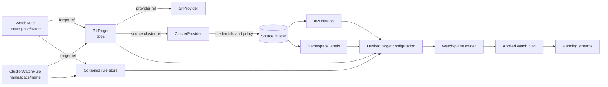

# GitTarget configuration freshness: desired in, applied out

> **deferred**: kept as a decision record.
> Date: 2026-08-27. Index: [`../INDEX.md`](../INDEX.md)
> Related: [`watch-manager-ownership.md`](watch-manager-ownership.md),
> [`target-watch-plan.md`](target-watch-plan.md),
> [`../spec/gittarget-isolation-on-rule-change.md`](../spec/gittarget-isolation-on-rule-change.md)
>
> **Not an active implementation proposal**, Not an active implementation proposal, and
> nothing here is being built. `StreamsRunning` reports the health of the applied watch plan
> without identifying which configuration produced that plan; this page works out what an opaque
> target-level freshness marker would have to be, and why it is not worth building yet. Read
> ["Why this is deferred"](#why-this-is-deferred) first: it carries the trigger conditions for
> picking it up. The one part that stood on its own has shipped: see
> ["What already shipped"](#what-already-shipped).
>
> It does not replace the more precise rule-level status contract available to e2e tests, which is
> now the recommended barrier.

## The missing fact

`GitTarget.status.observedGeneration` answers whether the GitTarget controller observed the current
GitTarget object. It does not move when a WatchRule or ClusterWatchRule changes.

`StreamsRunning=True` answers whether every stream in the current applied plan is streaming. A
 target can therefore report healthy streams for its old plan while a newly added rule is still
waiting for the owner loop to apply its new cell.

The target-level question is:

> Does the running watch configuration correspond to the latest configuration that applies to this
> GitTarget?

That is an operator question and a bundle-level synchronization question. It is not the right
replacement for every e2e wait.

## How the objects relate

The configuration is a graph of related objects rather than one Kubernetes object. A GitTarget owns
the destination and points to a GitProvider and a source ClusterProvider. WatchRules point to the
GitTarget from their own namespace. ClusterWatchRules point to a GitTarget by its namespaced
reference. The watch manager combines those objects with source-cluster observations and produces
the running watch plan.



The graph has two useful boundaries:

- **Control-plane inputs:** GitTarget, providers, and applicable rules.
- **Observed inputs:** the catalog and namespace facts used to resolve those rules.

The owner must not hash an incomplete view from a raw Kubernetes event. A GitTarget controller can
observe a WatchRule generation before the WatchRule controller has compiled that rule into the
store. Computing a desired marker at that point would move the stale-status bug into the marker.

## Configuration islands

The identity should include an island when changing it can change what this GitTarget does, or can
change whether its desired plan is observable. It should not include every object the operator
happens to reference.

| Island | Include? | Reason |
|---|---|---|
| GitTarget data-plane `spec` | Yes | It defines destination, source, branch, path, layout, and policy inputs. |
| GitProvider connection details | No | The owner's pass never reads them: the branch worker and the GitTarget controller apply them. Including them would claim coverage the marker does not have. |
| ClusterProvider source identity and policy | Yes | A different source cluster, audit route, or authorization policy changes behavior. |
| Applicable WatchRules and ClusterWatchRules | Yes | They define the target's selected resources and scopes. |
| API catalog | Yes, by stable observation revision | A served or removed resource can change the resolved plan. |
| Source Namespace labels | Yes, by stable observation revision | Labels can grant or revoke selector-based scopes. |
| Live Kubernetes objects | No | They are data processed by a running plan, not configuration of the plan. |
| Status, timestamps, retry counters, and stream state | No | They are observations or execution state and would make the marker self-changing. |

**The island set must be exactly the inputs the owner's pass reads.** That is the rule the table
above is an application of, and it is sharper than "everything that affects the target", because
`lastAppliedRevision` is by construction the attempted value stamped on a successful pass. An input
the pass never reads is therefore reported as applied the moment any unrelated pass succeeds: the
marker says "this is installed" about something the watch plane never touched. Write-path inputs
are the live example: a GitProvider credential rotation is applied by the branch worker and the
GitTarget controller, and folding it in would buy a settle window of `ConfigurationPending` for a
change the owner has no part in.

Two of the included rows deserve their reasoning stated, because they look like write-path inputs
and are not. The GitTarget's branch and path reach the owner: the rule controller captures them at
compile time, so they travel in the COMPILED rule and land in the watched-type table's destination
(`resolveWatchedTypeTables`). The source cluster reaches it through the declare capture. Both are
read by the pass, so both belong.

Immutability reduces churn but does not remove the need to include a field. An immutable
source-cluster reference still determines which catalog, credentials, namespace labels, and rules
apply. It can be hashed once and reused, but omitting it makes the identity ambiguous after a
delete-and-recreate or after a future API change relaxes the immutability rule.

The practical rule is: include immutable fields when they define the identity of the desired
configuration; optimize their computation, not their meaning.

### What it costs to compute

A pass is currently pure in-memory work over the resident tables, and it runs on every rule edit
and for every target on the 30s sweep. Canonicalizing a target's whole island set is the most
expensive thing that would happen in one, so the identity is computed **once per pass**, never per
trigger, and the observed inputs enter it as their existing revisions. Neither the catalog nor the
namespace snapshot is serialized into the digest.

## Desired and applied markers

The public marker can be a hash, a canonical digest, or another opaque identity. It does not need
to be a hash as long as equal values mean equal configuration under one binary version.

The proposed status names follow the Flux vocabulary:

```yaml
status:
  lastAttemptedRevision: "sha256:..."
  lastAppliedRevision: "sha256:..."
```

`lastAttemptedRevision` is the latest desired identity the owner has observed from a coherent
configuration snapshot. `lastAppliedRevision` moves only after the owner has installed the complete
watch plan and registered its replacement streams. Equal values mean that the latest observed
configuration has been applied.

The values are opaque. Equality is meaningful only within one binary version and compatible
canonicalization. They are not ordered. A canonicalization change may make an equivalent
configuration produce a new digest during an upgrade, so that compatibility cost must be accepted
before this becomes a public status field.

Do not add a process-local integer revision to public status. It is not durable across restarts and
does not add information that the opaque identity lacks. A metric may maintain a process-local
counter for attempts.

One difference from the vocabulary is worth being honest about, because it caps how much the digest
is worth in status. Flux's revisions name an EXTERNAL artifact (a chart version, a source
digest), so an operator can hold `lastAppliedRevision` up against a git SHA they already know. Ours names a
canonicalization of our own inputs that nobody outside the process can compute or predict, so the
only thing it can ever be compared to is its sibling. Everything an operator learns from the pair,
they learn from one boolean. That argues the CONDITION is the API here and the digests are
debugging detail, which is the opposite weighting from Flux.

## Publication ordering

The owner must publish the two markers from one coherent snapshot:

1. A rule controller compiles the change into the rule store.
2. The owner reads the target declaration, compiled rules, and current observed-input revisions.
3. The owner computes and publishes `lastAttemptedRevision`.
4. The owner builds and applies every plan change.
5. The owner publishes the same identity as `lastAppliedRevision` only after success.
6. The owner enqueues the GitTarget status reconcile when either marker or stream projection moves.

The owner is the only component that can publish these markers. A GitTarget controller must not
compute the desired value from an early raw WatchRule event, because that event can precede
compilation and would briefly publish the previous identity as current.

If a pass fails, `lastAttemptedRevision` remains different from `lastAppliedRevision`. The previous
plan may continue streaming, and `StreamsRunning=True` may remain true for that previous plan. That
is expected: stream health and configuration freshness are separate observations.

### The sequence above is blind during the window it exists to cover

Steps 2 to 5 all happen inside one pass, and a pass is now sub-millisecond in-memory work. So the
two markers move together, and the only mismatch the sequence can produce is the one that lasts
while a pass is FAILING, which `WatchPlanFailing`, `Failures` and `LastError` already report today.

Walk the case the page opens with. A rule is applied and compiled at t=0, and the owner's pass runs
at t=2s after the settle window:

| Time | `lastAttemptedRevision` | `lastAppliedRevision` | Reads as |
| --- | --- | --- | --- |
| t=0 to t=2s | A (the previous config) | A | **current** |
| t=2s | B | B | current |

For the whole settle window (the window in which the stale-status bug lives), nothing has been
published, because the owner has not run. Both markers hold the previous configuration and compare
equal, so the target reports itself current while a compiled rule is unapplied. The marker is
silent exactly where it is needed.

This is not a gap in the sequence; it is a consequence of "the owner is the only component that can
publish these markers" meeting "the owner only holds a coherent snapshot inside a pass". One of the
two has to give, and which one is the whole design.

## One marker, or two?

Two ways out of the blindness above, and they are not the same design.

**Publish attempted earlier.** Something has to compute the desired identity at trigger time, from
the compiled store, before the settle window elapses. That is feasible, because the rule controller
compiles before it triggers and the store is coherent at that instant. But it puts canonical
serialization back on a controller worker, which is the class of work the ownership design moved
off them, and it makes the identity's cost scale with the trigger rate that coalescing exists to
absorb.

**Publish one marker and take pendingness from the owner.** `lastAppliedRevision` identifies what
is installed: computed once, on success, from the snapshot the pass used, with no ordering problem
and no second value to keep coherent. Whether newer configuration exists is a question the owner
can already answer exactly (it is the dirty set), and that answer is not subject to the
coherent-snapshot constraint at all, because being dirty is not a configuration, it is a fact about
the queue.

The second is smaller and strictly better informed. It also relocates the hard question rather than
solving it, and the relocated question is the one worth settling first:

> A healthy target is briefly dirty on every rule edit and on every 30s sweep. What does "current"
> mean in a system that is never quiet for long?

[watch-manager-ownership.md](watch-manager-ownership.md) already met this once and answered it
narrowly: `DeclareStatus.Pending`
means "no pass has ever landed", NOT "dirty right now", because the wider reading flaps Ready on a
mirror that is working. A `ConfigurationPending` condition driven by dirtiness inherits that
decision and has to improve on it, most plausibly by reporting pending only once a target has been
dirty for longer than a settle window plus a pass, so ordinary churn is invisible and a genuine
backlog is not.

Answer that, and where to publish the marker follows. Build the marker first, and the answer gets
decided by accident.

## Conditions and e2e use

This section assumes the two-marker shape. Under the one-marker alternative the conditions are the
same; only what drives `ConfigurationPending` changes.

The marker belongs in status as an observation. A condition should explain the mismatch:

- `StreamsRunning=True` means every stream in the applied plan is running;
- `Reconciling=True`, reason `ConfigurationPending`, means the revisions differ and the owner has
  not applied the latest identity;
- `Reconciling=True`, reason `WatchPlanFailing`, means an attempt failed and will be retried;
- `Stalled=True` remains for terminal conditions such as an unsupported Git path or blocked watch.

Making `Ready=True` require revision equality is a separate decision. It makes every rule or catalog
change temporarily remove Ready during the settle window, so it must be evaluated against existing
`kubectl wait --for=condition=Ready` consumers.

The marker cannot prove that a transient configuration was ever applied. If desired identity moves
`A -> B -> A` before a pass completes, it can equal the applied identity for the entire episode.
This is a fundamental limitation: the marker tracks configuration identity, not edit history.

It has an operator-facing face as well as a test-facing one. Someone who edits a rule, sees
`ConfigurationPending`, and reverts the edit while it is still pending will watch pending clear
without anything having been applied, which is correct: nothing needed to be. The same property
is why toggling a rule off and on inside the settle window is no longer a replay
([watch-manager-ownership.md](watch-manager-ownership.md)). A marker cannot rescue a workflow that
depends on an intermediate state existing.

For an individual WatchRule, the existing precise barrier is stronger:

```text
rule.status.observedGeneration == rule.metadata.generation
and rule.status.StreamsRunning == True
```

The rule controller sets `observedGeneration` in the same reconcile that compiles the rule and
projects its stream status. The e2e helper `waitForWatchRuleStreamsRunning` includes that
generation check (["What already shipped"](#what-already-shipped)). Use this barrier for
rule-specific actions. Use `lastAppliedRevision` for the operator-facing question and for tests
that need to wait for a whole target bundle.

## Code simplification

The marker can simplify the implementation after its publication contract is real.

### Keep the internal and public fingerprints separate

`rulesFingerprint` detects raw rule-store changes. `watchPlanFingerprint` detects whether a resolved
stream set moved and remains the right optimization for scoped invalidation. The public revision
describes the complete desired target configuration. These are three different questions.

### Derive pending from the revision pair

Once the owner publishes both revisions, status can derive freshness from:

```text
configurationCurrent := lastAttemptedRevision == lastAppliedRevision
```

`Failures` and `LastError` remain because they explain a mismatch. The special first-declaration
interpretation can be localized to an empty applied revision rather than spread across status
callers.

### Keep one enqueue helper

All asynchronous status projections can use `enqueueGitTargetReconcile`: applied revision changes,
stream transitions, write-safety changes, retention changes, and relevant desired-input changes.
The helper does not need to expose which subsystem caused the notification.

### Use explicit barriers in tests

Bundle-level tests can wait for an applied revision rather than sleeping for the settle window.
Rule-level tests should use the rule generation barrier above. Neither mechanism proves that every
intermediate edit in a burst was applied.

## What already shipped

One part of this page never depended on the marker and is in the tree:
`waitForWatchRuleStreamsRunning` now requires `status.observedGeneration == metadata.generation`
before it accepts `StreamsRunning=True`, so it cannot pass on the previous generation's answer.
The predicate is `streamsRunningAtCurrentGeneration` in `test/e2e/e2e_test.go`. It is guarded twice
in `test/e2e/watchrule_generation_barrier_e2e_test.go`: a spec manufactures against a real API
server the exact state a naive barrier would accept (`StreamsRunning=True` published against a
stale `observedGeneration`, which is stable because the rule controller's `For()` predicate ignores
status-only writes), and a table exercises the predicate's verdicts directly, including the ones a
cluster will not produce on demand.

Nothing else on this page is implemented.

## Why this is deferred

Recorded so the next reader does not re-derive it, and so the trigger to pick it up is explicit.

**The value collapses until the publication question is settled.** As sequenced above, the two
markers move together and the only mismatch they can show is a failing pass, which existing status
already reports. Everything the page is for lives in the window where nothing has been published.

**The API is permanent and its compatibility story is not decided.** A status field that operators
and tests compare is frozen the day it ships. Whether a canonicalization change means a one-time
fleet reapply or a versioned marker (open decision 5) is the part that cannot be walked back.

**Nothing has asked for it.** The two e2e failures that prompted this page are fixed by the
rule-level barrier and by not depending on an intermediate configuration. The operator incident
question is currently answered, at fleet level, by `watch_plan_oldest_dirty_age_seconds` climbing
and by `WatchPlanFailing` on the target. That is coarser than a per-target identity and it covers
the incident case.

**The area is newly stable.** Three real bugs landed in the watch plane in one day, one of them
(streams parented to the pass context) presenting as health for eleven specs. A new public status
contract on top of that is the wrong order.

Pick it up when either of these happens:

- an operator asks "is this target's configuration applied?" during a real incident and the metrics
  above do not answer it;
- bundle-level e2e waits start accumulating sleeps, because the rule-level barrier does not cover
  a multi-rule apply.

The cheap half has already been taken (see ["What already shipped"](#what-already-shipped)); it
needed no API, no canonicalization, and no decision about what "current" means. What remains on
this page needs all three.

## Open decisions

1. **What is the canonical island set?** Each included input needs a stable representation and a
   test showing that changing it moves the identity.
2. **How are observed inputs versioned?** Catalog and Namespace snapshots need stable revisions or
   canonical content digests. Their revisions must move when their effective answer changes.
3. **One marker or two?** This is the one to answer first, and answering it decides publication
   ordering; the reverse does not work. Two markers need a desired value published before the
   settle window elapses, from a coherent snapshot, by something that is not the owner loop. One
   marker needs a definition of "current" that survives a target being briefly dirty on every edit
   and every sweep.
4. **Should Ready require equality?** Decide this separately because it changes existing Ready
   behavior during the settle window, and because it reverses a decision
   [watch-manager-ownership.md](watch-manager-ownership.md) took deliberately.
5. **What canonicalization changes are compatible?** The marker is an opaque equality token, but a
   new binary may intentionally change it. Decide whether that causes a one-time fleet reapply or
   whether the marker format is versioned.
