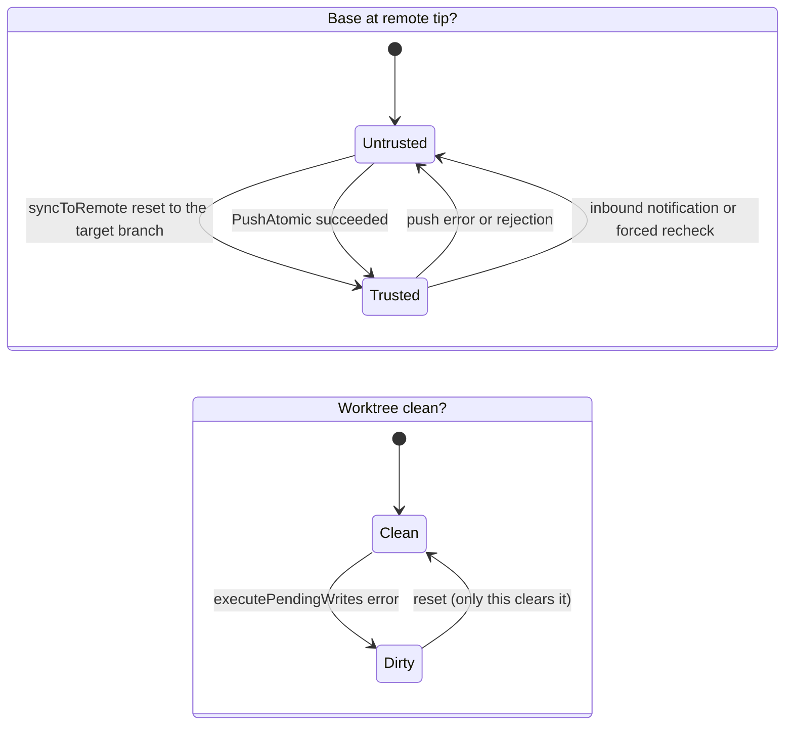
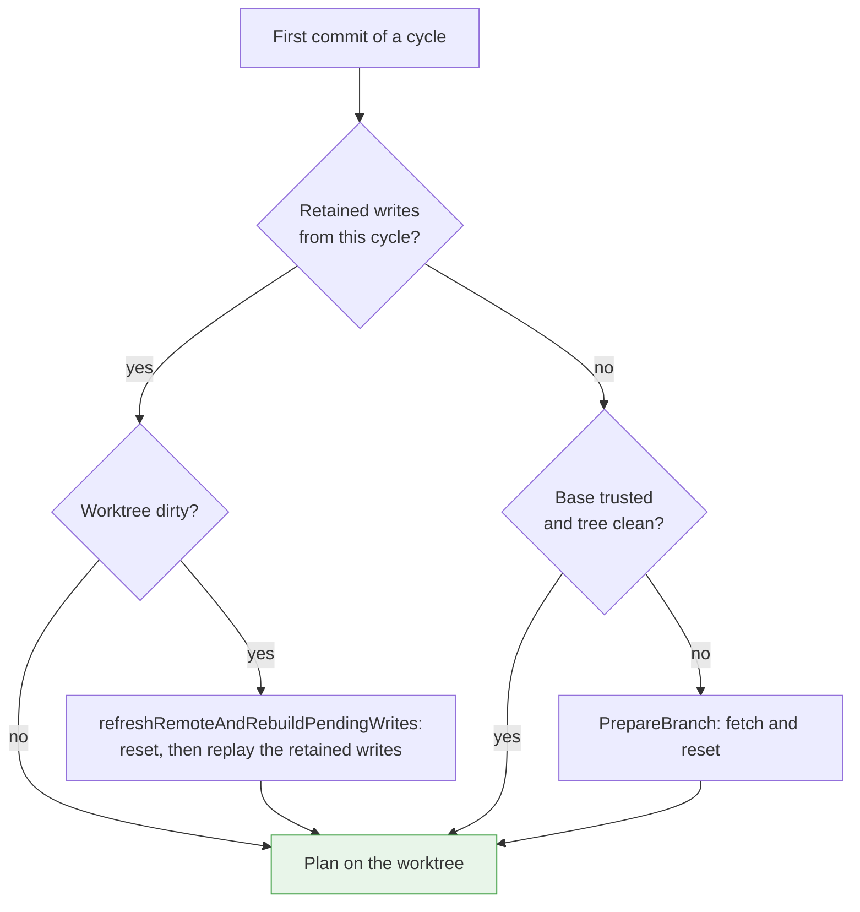
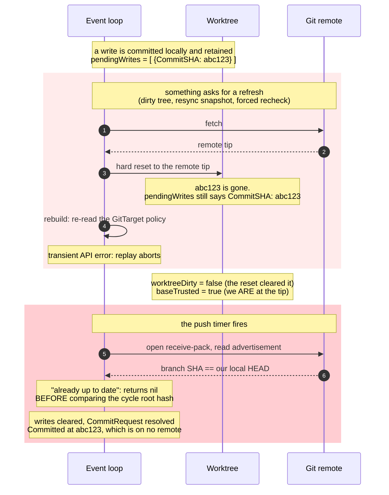
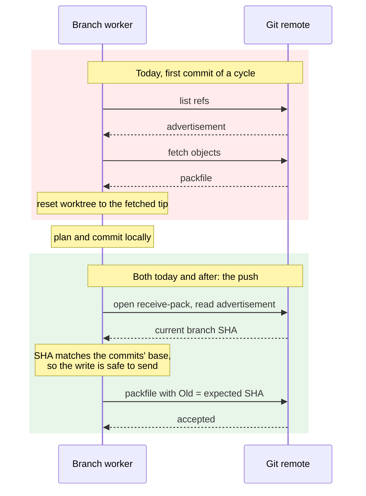

# Inbound push notification, and removing the pre-push fetch

> **design**: open, not yet built. Index: [`../INDEX.md`](../INDEX.md)
> Date: 2026-09-19.
> Related: [`reconcile-triggering.md`](reconcile-triggering.md) (§5 is the general mechanism this
> page narrows), [`../bi-directional.md`](../bi-directional.md),
> [`support-boundary/orchestrator-reconcile-trigger.md`](support-boundary/orchestrator-reconcile-trigger.md)

**The budget this page spends.** The scarce resource is the **round trip to the Git host**, and
nothing else on this page is close. A connection to GitHub costs a noticeable fraction of a
second before it has transferred anything, and it is in front of a user waiting to see their
edit land. Local recomputation is not in the same category: replaying retained writes re-plans
against a tree that is already on disk, and it costs microseconds.

So the rule this page optimizes by, in order:

0. **Count them before you change them.** §4.1 is the first commit, and every connection count on
   this page is a prediction until it runs.
1. **Never make a round trip you do not need.** This is the whole change.
2. **Never make a round trip twice for the same fact.** §2.2 finds one we make twice today.
3. **Recompute freely.** A replay is cheap and needing one is not a failure.

GitOps Reverser is also optimized for changes arriving through the Kubernetes API, with a foreign
push as the exception. But "rare" is not a license to be wasteful when it happens: a rejected
push is the most expensive thing in the system, and avoiding one is worth real design effort.
That, rather than status freshness, is the strongest argument for the inbound notification.

**The argument in one paragraph.** The write path was designed around a compare-and-swap push: the
remote is consulted once, on the connection that was going to happen anyway, and a moved branch is
detected there. A fetch in front of every publication cycle was added later and is not part of that
design. It can go, because the push session already learns everything the fetch learns. What it
cannot do is tell an *idle* target that its folder changed, and that is the job of the inbound push
notification. The two changes are one design: the notification is what makes the routine fetch
unnecessary rather than merely skippable.

This page specifies both, the invariant that connects them, and the cases where a fetch must still
happen.

## 1. What the remote cost before this change

Five call sites reach the remote, none on a timer and none triggered by the remote changing.

| Call site | Trigger | Cost |
| --- | --- | --- |
| [`prepareBootstrapRepository`](../../internal/git/branch_worker.go) | a GitTarget declaring its path | **list, fetch, reset** |
| `commitPendingWrites` via `PrepareBranch` | first commit of every publication cycle | **list, fetch, reset** |
| `PushAtomic` | every publication cycle | list, then packfile |
| `fetchRemoteBranchHash` + `syncToRemote` | a rejected push | list, fetch, reset |
| `syncWithRemote` / `refreshRemoteAndRebuildPendingWrites` | a forced recheck | list, fetch, reset |

The second row is the target of this page. It was gated on `hasPendingCommits`, so it fired once
per cycle rather than once per event, and an idle target paid nothing. Under sustained edits, with
a `5s` commit window and a `5s` push cooldown, that was roughly one fetch-and-reset per push.

**Those two sentences are the baseline, not current behavior.** After commit 4,
`ensureBaseForCycle` skips `PrepareBranch` (and therefore the whole fetch-and-reset) whenever the
base is trusted and the worktree is clean, which on a healthy publishing target is every cycle
after the first. §4 measures what is left.

Note what is NOT in that table. `ensureRepositoryInitialized` looks like the worker's clone and an
earlier draft listed it as one; it has no caller outside a test. There is no clone anywhere —
`PrepareBranch` initialises an empty repository and fetches into it.

**Count these in HTTP requests, because one call is not one round trip.** A `SmartFetch` costs
**two** requests when it transfers nothing and **three** when it does: `listRemoteRefs` opens a
conversation of its own, and `repo.Fetch` opens another that re-reads the advertisement before
deciding whether to ask for objects. A `PushAtomic` costs **one** when it is rejected or already up
to date and **two** when it sends a packfile.

Those are measurements, from §4.1, and they replace a flat "SmartFetch is 2, PushAtomic is 1" that
this page asserted before anything ran. The unit is the HTTP request. A go-git *session* is one
connection and reads its advertisement inside it, which is what makes the compare-and-swap free of
an extra handshake — but on smart HTTP that session is two requests, so over SSH these numbers
would be lower. The harness measures requests against an HTTP remote and does not measure latency
or TCP connections.

## 2. The push already does the detection

[`validatePushState`](../../internal/git/git_atomic_push.go) opens a session, reads the remote's ref
advertisement, and compares the advertised hash for the cycle's root branch against
`pushCycleRootHash`. A mismatch returns `remote received unknown updates` before a single object is
uploaded. The `packp.Command` then carries `Old: oldHash`, so the server enforces the same condition
independently.

Two consequences matter, and the second one is the load-bearing discovery of this page.

**The advertisement supersedes the fetch for detection.** Anything the pre-cycle fetch would have
told us about where the branch is, the push connection tells us for free a few hundred milliseconds
later.

**A cycle that commits nothing still reaches `PushAtomic`, on the live paths.** A no-diff write
from a commit window or an atomic request is appended to `pendingWrites` with a zero `CommitSHA`,
so `pushPendingCommits` still runs. `validatePushState` returns its up-to-date signal when the
remote has not moved, and takes the rejection path when it has. That closes the hazard which would
otherwise sink the whole idea: planning against a stale tree, finding no difference, and silently
dropping the write because nothing was ever pushed. The advertisement is read either way, and
[`rebuildPendingWrites`](../../internal/git/branch_worker.go) re-*plans* rather than rebasing, so
the replay against the fetched tree can turn that no-op into a real commit.

### 2.1 Two paths escape that, and both gate the change

The argument above is about the live window and atomic paths. Two others do not share it, and
removing the pre-fetch without handling them would reintroduce exactly the hazard it claims to
close. Commit 3 in §11 exists for them.

**A no-op resync never opens a connection.** [`applyResync`](../../internal/git/resync_flush.go)
retains its own pending write only `if committed`, and calls `maybeSchedulePush` only
`if committed || closedWindow`. A resync that finds nothing to change therefore retains nothing,
schedules no push, and never reads an advertisement. Its `RefreshRemote` pre-fetch is the only
thing checking the remote on that path today. Either the resync path keeps fetching, or it asks
for the advertisement itself before concluding that the tree it judged was current.

**A no-diff `CommitRequest` resolves before the remote is consulted.** `finalizeOpenWindow`
resolves `FinalizeAlreadyPresent` the moment `CommitSHA` is zero, and nils the request off the
retained write, so the push that follows can no longer resolve it. If the tree was stale, the
replay after a rejection can produce a real commit for a request that has already reported
"already present" to its caller. The pre-cycle fetch makes that nearly unreachable today.
Removing it makes it reachable, so either the `AlreadyPresent` resolution moves behind the push,
or it becomes conditional on a trusted base.

### 2.2 A round trip we already make twice

`validatePushState` compares the advertised hash of the cycle's root branch against
`pushCycleRootHash` and fails with `remote received unknown updates`. It had the remote's hash in
hand to do that.

Then [`runPushCycle`](../../internal/git/branch_worker.go) throws it away and calls
`fetchRemoteBranchHashFn` to learn the same number from the network, which is another
`SmartFetch`, which is two more connections. Only after that does it call `syncToRemote` to
reset, which is two more again.

A rejection therefore costs **ten requests** before any of this page's changes: two for the
head-of-cycle fetch, one for the rejected push, two to re-learn a hash we already had, three to
reset (the fetch that finds a moved remote transfers objects, so it is three and not two), and two
for the retry that sends a packfile. §4 measures it; an earlier draft of this paragraph predicted
eight, and §4 explains which prediction was wrong.

Propagating the observed hash out of `PushAtomic` as a typed error removes the middle two
outright. It needs a fallback, because a push can also fail for reasons that produce no
advertisement (a dropped connection, an auth failure), and those must still take the slow path.
But on the contention path, which is the one that matters, it is a strict deletion: fewer
connections *and* less code.

This is independent of the rest of the page and could ship on its own.

## 3. The invariant

> **The worktree sits at the remote tip of the target branch, or the worker knows it does not.**

One boolean on `BranchWorker` carries it. Call it `baseTrusted`. `commitPendingWrites` calls
`PrepareBranch` when, and only when,
`!hasPendingCommits && (!baseTrusted || worktreeDirty)` — both flags, because §3.1 shows why one
is not enough. (An earlier draft of this line said `!hasPendingCommits && !baseTrusted`, which
contradicted §3.1 and commit 4 three paragraphs later.)

The two flags are independent, and only a reset clears the second one:



A cycle plans straight onto the worktree only when the base is `Trusted` **and** the tree is
`Clean`. Any other combination fetches first, and which fetch it uses depends on whether writes
are retained:



Set it **true** at exactly two points:

- after `syncToRemote` returns and the worktree has been reset to the fetched tip, and the fetched
  branch is the target branch (not the default-branch fallback);
- after `PushAtomic` succeeds, because the uploaded commits are now the remote tip and the
  worktree is at them.

Set it **false** at every point where that stops being provable:

| Event | Why trust is lost |
| --- | --- |
| Worker construction, or a re-clone | Nothing has looked at the remote |
| The branch is unborn, or `SmartFetch` fell back to the default branch | The worktree is not based on the target branch |
| Any `PushAtomic` error, including a rejection | A dropped connection mid-push leaves the remote state unknown |
| Any error inside `executePendingWrites` | The worktree may hold a partial write |
| An inbound push notification, or a forced recheck | Somebody stated that the remote moved |
| `syncToRemote` returned an error | The fetch did not complete |

The failure direction is the safe one. A stale `false` costs one fetch. A stale `true` is caught by
the compare-and-swap on the next push, which is the mechanism the design already relies on.

### 3.1 One flag is not enough: a push does not prove the worktree is clean

`baseTrusted` answers "is the worktree at the remote tip". It does not answer "is the worktree
clean", and collapsing the two is a bug, because the events that change them can interleave:

1. Write A commits. `pendingWrites` holds it.
2. Write B fails part-way through `executePendingWrites`, leaving staged changes behind. Its
   window is dropped; A stays retained.
3. The push timer fires and A pushes successfully.

If a successful push sets `baseTrusted = true`, step 3 erases the record of step 2. The next cycle
skips the fetch, plans on a worktree that still holds B's leftovers, and can commit them under an
unrelated author.

So carry a second flag, `worktreeDirty`, set by any `executePendingWrites` error and cleared
**only** by a reset. A successful push may clear `baseTrusted` and must never clear
`worktreeDirty`.

That alone is not enough, because of where the existing guard sits. `commitPendingWrites` only
considers fetching when `!hasPendingCommits`, and for a good reason: a fetch resets the worktree,
which would destroy retained local commits. But that is exactly the state the scenario above
leaves behind. Write C arriving while A is still retained would skip cleanup altogether and
commit B's leftovers, and the second flag would not be consulted at all.

Recovery therefore has to be able to run *with* retained work, which means resetting and replaying
rather than resetting alone. The function for that already exists:

```go
switch {
case hasPendingCommits && w.worktreeDirty():
    // Reset to the remote tip and rebuild the retained writes on top of it. Nothing is
    // lost, because a replay re-plans from the retained writes rather than from the worktree.
    w.refreshRemoteAndRebuildPendingWrites(w.ctx, pendingWrites)
case !hasPendingCommits && (!w.baseTrusted() || w.worktreeDirty()):
    // The ordinary head-of-cycle case: reset to the remote tip.
    PrepareBranch(...)
}
```

`refreshRemoteAndRebuildPendingWrites` is written for the forced-recheck path and does precisely
this: `syncToRemote` then `rebuildPendingWrites`. Reusing it means dirty-state recovery adds a
branch, not a mechanism.

### 3.2 A push that sent nothing proves nothing

**The promise.** A `CommitRequest` resolves `Committed` only once its work is on the remote. Nothing
before the push can make that claim: everything earlier in the pipeline can promise at most that the
work is queued.

**How it broke.** The worker read "`PushAtomic` returned no error" as "my work is on the remote".
Those are not the same, because a push returns no error in two different situations:

| The push returned nil because | Does our work exist on the remote? |
| --- | --- |
| it sent our commits and the remote took them | **Yes.** This is the case the promise is about |
| there was nothing to send: the local branch already equals the remote | **Unknown.** It depends entirely on how we got here |

The second is good news if we arrived at "local equals remote" by *pushing to* the remote. It is
the opposite of good news if we arrived there by being *reset to* it, because a reset is how the
local branch reaches the remote tip while carrying none of our work.

And a reset is exactly what a replay does first.

**Where the reset comes from.** Resetting and replaying is one operation with two halves, and only
the second is constructive. The reset discards the local commits behind the retained writes; the
replay rebuilds them. Land in between (any error in the rebuild will do, and a transient API failure
on the prune-policy re-read is enough) and the retained writes still name commits that no longer
exist, on a branch that now equals the remote exactly.

The next push then sends nothing, returns nil, and the worker settles the work: clears the retained
writes, counts the commits, and tells the `CommitRequest` it landed, naming a SHA that is on no
remote. A user is told their save succeeded. Nothing logs an error.



The invariant that closes it:

> **Retained writes may not be published until the replay that rebuilds them has completed.**

The push cannot enforce that by itself, and this is the whole reason a flag exists. Looking at the
wire, a no-op push is indistinguishable from a successful one: both see "local equals remote". The
difference is in how we got there, which happened earlier and left no trace on the branch. So
something has to remember it. `replayRequired` is that note and nothing more: "the commits these
writes claim do not exist right now". It is set when the reset lands and cleared when the replay
finishes.

`recoverRetainedWrites` (formerly `recoverDirtyWorktree`) repairs it, and now runs before the
**push** as well as before every commit. A rebuild that fails again keeps the writes retained
rather than publishing a lie, which is what a transient error deserves.

**Why `worktreeDirty` cannot do this job**, which is the first thing to try and the thing that does
not work. Two reasons, and the second is decisive:

1. It answers a different question. `worktreeDirty` means "a failed write may have left files in
   the tree that nobody asked for", and after a reset the honest answer to that is **no**. The tree
   really is clean. What is stale is the retained writes.
2. **It clears at the wrong moment.** `worktreeDirty` is cleared by the reset, inside
   `updateBranchMetadataFromPullReport`. The reset is precisely when this problem STARTS. A flag
   that clears at the start of the window cannot mark the window.

That is also why the two cannot be merged into one. They bracket different spans of the same
operation: `worktreeDirty` ends where the reset lands, `replayRequired` begins there and ends where
the replay lands. One flag cannot have two clearing points.

**And it is visible while it lasts.** Each retry costs one fetch, counted under
`reason="recovery"` (§12), so a rebuild that keeps failing shows up as that series climbing rather
than as silence. That is the series §12 already tells operators to read as a bug report, and this
is the case it was named for: the writes are safe, the mirror is stalled, and the metric says so.

Two failure points, not one. A replay can die before its first write (the prune-policy re-read is
the realistic trigger) or partway through a batch. The second is worth its own test because
`executePendingWrites` stamps each write's new SHA as it goes, so the retained slice is left
holding a mix of fresh and pre-reset hashes: a rule that asked "does this write still have a SHA"
would pass half of them.

**And two reset sites, not one**, which is the part that is easy to miss.
`refreshRemoteAndRebuildPendingWrites` is the obvious one; `runPushCycle` resets and replays
INLINE when a push is rejected, without going through it at all. Same two halves, same window,
same silent settle afterwards. Auditing the rest: `prepareBootstrapRepository` and
`ensureBaseForCycle` cannot have retained writes (the latter is gated on `!hasPendingCommits` for
precisely that reason), `syncWithRemote` is only reached when nothing is retained, and
`ensureRepositoryInitialized` has no caller. So the flag belongs at exactly those two places, and
the audit is the reason to believe that rather than a hope.

## 4. What it costs

**These are measurements.** Every row comes from
[`testdata/git-roundtrip-ledger.golden`](../../internal/git/testdata/git-roundtrip-ledger.golden),
produced by the harness in §4.1 against canonical git's `http-backend`. Only the last column is a
prediction, and it is labelled as one.

The unit is **HTTP requests to the Git host**. Not TCP connections, not latency: the harness
counts what the server was asked to serve.

| Situation | Before | After §2.2 | After the flip | With the notification (predicted) |
| --- | --- | --- | --- | --- |
| Idle target | 0 | 0 | **0** | 0 |
| Uncontended publication | 4 | 4 | **2** | 2 |
| Publication that commits nothing | 3 | 3 | **1** | 1 |
| Several commits in one cycle | 4 | 4 | **2** | 2 |
| Contended publication, one rejection | 10 | 8 | **6** | 3 |
| Contended publication, two rejections | 16 | 12 | **10** | 4 |
| Resync snapshot | 4 | 4 | **4** | 4 |
| Forced recheck | 2 | 2 | **2** | 2 |
| Worker start, populated remote | 3 | 3 | **3** | 3 |

Four results worth reading separately, two of which contradict what this page predicted before
the harness existed.

**An uncontended publication halves, from four requests to two.** The page predicted three before
and one after, and was wrong twice in the same way: it costed a `SmartFetch` at a flat two and a
`PushAtomic` at a flat one. A push that sends a packfile is two requests on smart HTTP — the
advertisement, then the pack — so the floor is two, not one, and the fetch that was removed was
two of the original four.

**A publication that commits nothing now costs a single request.** It still opens the push
conversation, reads the advertisement, finds the remote already correct and sends nothing. That
one request is what makes removing the fetch safe: §2's whole argument is that a no-op cycle still
consults the remote, and this row is that argument measured.

**A rejection cost ten, not the eight predicted.** Two of the errors above cancelled and a third
did not: when the remote HAS moved, the `SmartFetch` that discovers it transfers objects, so it
costs three requests rather than two. §2.2's deletion removed two of those ten and the flip
removed two more.

**The resync row does not move, deliberately.** §2.1 and §11's commit 3 explain why: a resync that
finds nothing to change never reaches a push, so nothing would ever catch a stale base. It keeps
its fetch.

**The last column remains the argument for the notification**, and it is still a prediction. A
push webhook does not have to make us fresher. It has to stop us spending requests discovering
something the Git host was willing to tell us for free — and §8.1 must be read with the retained
write caveat there before that column can be believed.

## 4.1 Measure it first

Nothing in this plan should be built before the table above is replaced by observations, for a
practical reason and a political one. The practical one is that the predictions are already
shaky: an earlier draft of this page said one uncontended publication cost two round trips, and
it costs three, because `SmartFetch` opens two connections rather than one. If that was wrong,
the rejection path is likelier to be wrong than right. The political one is that "we reduced
round trips" is a claim somebody will ask you to support a year from now, and the only durable
support is a number that CI keeps honest.

### The harness

It mostly exists. `startGitHTTPServer` in
[`ado_multiack_test.go`](../../internal/git/ado_multiack_test.go) already serves a real
repository over canonical git's `http-backend` and already counts `uploadPackPosts`. Widen that
counter into a ledger of every request the backend sees, keyed by the four things a Git
conversation can be:

| Request | What it means |
| --- | --- |
| `GET /info/refs?service=git-upload-pack` | A fetch conversation opened, including a fetch that transfers nothing |
| `POST /git-upload-pack` | Objects were actually requested |
| `GET /info/refs?service=git-receive-pack` | A push conversation opened, and the advertisement the compare-and-swap reads |
| `POST /git-receive-pack` | A packfile was sent |

Record bytes alongside counts. A fetch that opens a conversation and transfers nothing is a very
different cost from one that pulls a tree, and the counts alone cannot tell them apart.

### The operations to characterize

Each of these is one test, driving the worker through the real server and asserting the ledger:

| # | Operation | Why it is on the list |
| --- | --- | --- |
| 1 | Worker start on an empty remote | The bootstrap floor |
| 2 | Worker start on a populated remote | The realistic floor |
| 3 | One publication, one commit | The number the whole page is about |
| 4 | One publication, several commits in one cycle | Confirms the fetch is per cycle, not per commit |
| 5 | A publication that commits nothing | §2's no-op path |
| 6 | A publication whose push is rejected once, then succeeds | §2.2's eight |
| 7 | A publication rejected twice | Shows whether the cost is linear in retries |
| 8 | Forced recheck, no retained writes | `syncWithRemote` |
| 9 | Forced recheck, with retained writes | `refreshRemoteAndRebuildPendingWrites` |
| 10 | A resync/snapshot | The path §7 warns about |
| 11 | An idle target, held for several commit windows | Must be zero, and is the claim most worth pinning |

### The output

Write the ledger to a checked-in golden file, one row per operation, rather than burying the
numbers in assertions. Two reasons. A reviewer sees the cost change as a diff, which is the
whole point: a future change that quietly adds a fetch shows up as `3 -> 5` in a pull request
instead of passing silently. And the file is the artifact to point at when somebody asks what
this work bought.

Assert on it as a golden comparison, with an obvious way to regenerate. Row 11 should be asserted
strictly at zero regardless, because "an idle target is silent" is a property rather than a
measurement.

### What to do with the results

Replace the predicted table in §4 with the measured one and say so in the text. If a number comes
back different from the prediction, that is the harness doing its job, and the surprising rows
are worth a paragraph each: they are where the code is doing something nobody on this page
understood.



The red block is what this page removes. The green block already reads the branch SHA, which is
the only thing the red block was contributing on an uncontended cycle.

## 5. What the fetch is silently doing today, that has to be replaced

Two jobs, and neither is detection.

**It launders the worktree.** `checkoutAndReset` passes `Force: true`, which discards dirty files. A
cycle that fails part-way through `executePendingWrites` is cleaned up by the next cycle's fetch
without anyone noticing. Removing the fetch makes that garbage persist. This is why an
`executePendingWrites` error must clear `baseTrusted`: the next cycle then fetches and resets, which
is the same cleanup, performed deliberately instead of as a side effect.

**It refreshes the tree the acceptance gate judges.** The gate, placement resolution, and the
kustomize build all read the local worktree. On a *writing* target the difference is invisible,
because a stale plan is rejected at the push and re-planned against the fetched tree. On an idle
target it is the entire problem, and §6 is about that.

## 6. The idle-target gap

With no publication cycle there is no round trip, so a target that is not writing learns nothing.
Somebody repairs the folder in Git, or breaks it, and Reverser holds its previous answer.

**A refused target is not the case to worry about, and an earlier draft of this page had that
wrong.** `gitPathWasRefused` sets `forceRecheck` on every reconcile
([`gittarget_controller.go`](../../internal/controller/gittarget_controller.go)), and a refused
target is not converged, so `gitTargetRequeue` gives it `RequeueStreamSettleInterval`, which is
**10 seconds**. The comment on that function says why in as many words: a terminal state clears
when the Git folder changes, and that produces no Kubernetes event, so the periodic re-check is
what recovers it. Fix an unsupported folder in Git and `GitPathAccepted` clears within about ten
seconds on its own.

The gap is the **healthy idle target**. It is converged, so it requeues on
`RequeueSteadyInterval` (5 minutes), and `forceRecheck` is false on every one of those passes, so
none of them touches Git. Somebody changes the folder underneath it and the target holds its
previous answer until it next writes or somebody asks.

Two honest qualifications. This gap exists today: a target with no writes never performed the
head-of-cycle fetch either, so removing it widens nothing. And on the traffic this system is
built for it is a mild problem, because a healthy target that nobody is editing from Git is not
where the risk lives. What the change does is raise the stakes, because afterwards the
notification is the only thing that moves an idle target's view of Git.

## 7. The chain that is already built

Everything behind the first link works today:

```text
reconcile.configbutler.ai/requestedAt changes
  -> reconcileRequestTracker.take()            (once per distinct value)
  -> forceRecheck                              (gittarget_controller.go)
  -> observeDataPlane(force)
  -> startTargetWatchStreams(refreshRemote)
  -> enqueueScopedResync{RefreshRemote: true}
  -> applyResync():
       1. the RefreshRemote prelude, branching on retained writes:
            writes pending  -> refreshRemoteAndRebuildPendingWrites()  (fetch, then replay)
            nothing pending -> syncWithRemote()                        (fetch only)
       2. then, UNCONDITIONALLY, for both branches:
            buildResyncPendingWrite() -> commitPendingWrites()
            -- a full cluster-to-Git snapshot with mark-and-sweep
```

A human can drive it now:

```bash
kubectl annotate gittarget editing -n gitops-reverser \
  reconcile.configbutler.ai/requestedAt="$(date +%s)" --overwrite
```

**Step 2 is why this chain cannot be handed to a webhook as it stands, and it is the most
important correction on this page.** The prelude is the part that refreshes the view; everything
after it republishes the cluster over whatever the fetch brought down.

Consider the ordering a push webhook produces. Somebody pushes a fix to Git. Two
notifications leave the Git host at the same moment, one to us and one to Flux or Argo CD. Ours
needs a fetch and a plan; theirs needs a fetch, a render, and an apply. **We can therefore run
before the apply**, and nothing in either delivery path orders the two. If our handler runs this
chain when that happens, we snapshot the cluster, which still holds the pre-push values, and
commit it over the fix before the reconciler has applied anything. The Git-side author watches
their change get reverted by the thing that is supposed to be mirroring.

Note the shape of the argument. It is not that we are always first, which nobody can promise. It
is that nothing prevents it, the window is wide (a render and an apply), and the failure is
silent.

That is not a freshness bug, it is a correctness one, and it would contradict the product: the
e2e corner asserts that a Git-side change to a shared field reaches the cluster
([`../bi-directional.md`](../bi-directional.md)). So the receiver in §8 must not reuse this
request shape.

Both prelude branches must also clear `baseTrusted` before fetching and set it after, per §3.

## 8. The missing link

One adapter: something that turns "the Git host says branch `X` of repo `Y` moved" into a refresh
of the `GitTarget` objects that track it. We already serve inbound HTTP for admission,
conversion, and audit, so the transport exists.

**It cannot reuse the `requestedAt` annotation as its mechanism**, for the reason §7 gives: that
annotation drives a full resync, and a push notification must not publish a cluster snapshot. The
annotation stays exactly what it is today, a human escape hatch for "go and look at Git now",
where a snapshot is what the operator is asking for. The receiver needs the refresh-and-report
request shape of §8.1 and §8.2 instead, and building that shape is most of this work.

[`reconcile-triggering.md`](reconcile-triggering.md) §5 designed this as part of a larger trigger
overhaul and its conclusions hold unchanged. Three of them matter here:

- **§5.1: reuse the pattern, not Flux's `Receiver` CRD.** Its `spec.resources[].kind` enum rejects
  our kinds and its RBAC is Flux-scoped, so forking it is fragile and lost on upgrade. Validating a
  signed payload and patching an annotation is one handler.
- **§5.3: dedupe our own pushes, which needs bookkeeping that does not exist yet.** We write to
  the same branch, so our commits fire the same webhook. The obvious comparison is against the
  worker's `lastCommitSHA`, but that field is only written by
  `updateBranchMetadataFromPullReport`, which runs on **fetch** paths and not after a push. As it
  stands it holds the tip as of the last fetch, so every one of our own publications would look
  like a foreign push and earn a fetch, which is the exact cost this page removes. Advancing it on
  a successful push is therefore mandatory receiver work, not the optional `status.remote` polish
  of §9.

  **The rule is one comparison, and the bookkeeping behind it is one SHA.**

| `after` | Meaning | Action |
| --- | --- | --- |
| equals the believed tip | Our own push coming back to us | Ignore |
| anything else | Somebody moved the branch, or we cannot tell | **Invalidate** |

  An earlier draft of this page had five rows, a `before` field read from four Git hosts, and a
  bounded set of recently published SHAs "as deep as the delivery lag". It was wrong, and the way
  it was wrong is the argument for deleting it rather than repairing it.

  The row it got wrong ignored a delivery whose `after` AND `before` were both SHAs we had
  published, on the reasoning that our own delayed delivery is `ours -> ours` while somebody
  else's rollback passes through a SHA we never wrote. It does not have to. Believe the tip is C,
  having published A, B and C. Somebody force-pushes `C -> B`, then `B -> A`. Every delivery in
  that rollback is `ours -> ours`, and if `B -> A` arrives first the rule ignores a branch that
  has genuinely moved to A.

  That row cannot be patched. A *set* of published SHAs cannot distinguish a replay from a
  rollback, because both are pairs drawn from the same set: the information the distinction needs
  is ORDER, which a set has thrown away. So the set goes, and with it the `before` field, the
  per-host compatibility question, the fallback for hosts that omit it, and the depth tuning.

  What that costs is one `SmartFetch` per out-of-order delivery of our own push, because `after` is a SHA
  we published but no longer believe is the tip, so it invalidates. The worst case is one fetch per
  cycle, which is precisely the behavior this page removes. The feature degrades to the status quo
  rather than to a wrong answer.

  **If measurement later shows those false invalidations matter, the escalation is an ORDERED
  record of what we published, not a set.** Our own pushes are always fast-forward in our own
  publication order, so a genuine delayed delivery moves forward through that record while a
  rollback runs backwards through it. Build that, and only that, and only with a number in hand.

  Advancing `lastCommitSHA` on a successful push stays mandatory either way: it is what makes the
  one remaining comparison mean anything.

  Deliveries can arrive out of order, be duplicated, or not arrive at all, so the receiver must be
  correct under all three and the fallback must be invalidation. The tests are reordered delivery,
  dropped delivery, a duplicate delivery, and a rollback that passes only through SHAs we
  published.

- **§5.4: piggyback on the webhook the user already has.** Most Flux and Argo CD users already point
  their Git host at a receiver. A second git-host webhook is the config cost this feature has to
  justify.

| Option | What it is | Cost | Note |
| --- | --- | --- | --- |
| **A. Do nothing** | Operators annotate by hand | zero | Honest for audit-only use. §6 stays. |
| **B. Poll** | Fetch on the steady cadence | small, ongoing | Bounded staleness, no Git-host config, and a fetch per target per interval whether or not anything changed. |
| **C. Receiver** | Our own validated push endpoint | one handler plus a config surface | Fresh within a second. Needs secret handling, URL-to-target mapping, and the §5.3 dedupe. |
| **D. Forward an existing trigger** | A user's Flux `Receiver` or Argo webhook fans out to us | smallest user-facing config | Depends on those tools being able to call us. See the open questions. |

C is the target. B is not exclusive with it and is the safety net that turns a missed webhook into a
latency problem rather than a stuck one, which is the same argument Flux makes for keeping a short
`GitRepository.spec.interval` alongside a `Receiver`. If B is built, express it as a maximum age on
`baseTrusted` rather than as a separate poller, so there is one mechanism and not two.

That age has to **schedule a wake-up**, not be consulted lazily. An idle target is precisely the
one with no arriving writes to check it, so an age tested only at the head of a cycle can never
fire on the target it exists to protect. The requeue that already exists is the natural home:
`GitTarget` requeues on `RequeueSteadyInterval` (5 minutes) and that pass currently publishes
status without touching Git, so it is a scheduled tick looking for a job.

### 8.1 What the receiver must not do

A push notification is information about **Git**. It says a branch moved. It says nothing about
the cluster, and it must not be turned into a statement about the cluster.

**And it must not fetch either.** That looks like the obvious thing for it to do, and under the
budget in the opening paragraph it is the wrong thing: the notification would spend two
connections immediately, on a target that may have nothing to publish for the next hour.

All the receiver needs to do is **invalidate**: clear `baseTrusted`, and record the `after` SHA
as the believed tip. That costs zero connections. The next publication cycle then finds an
untrusted base and fetches once, which it now has a real reason to do, and pushes onto the
correct tip instead of discovering the move through a rejection.

**Clearing the flag is not sufficient on its own, and the saving in §4's last column depends on
what is added here.** `ensureBaseForCycle` only consults `baseTrusted` when `hasPendingCommits` is
false, because a reset would destroy local commits the retained writes already produced. So a
target that is holding retained work will not act on the invalidation: it pushes the stale base
first and earns exactly the rejection the notification existed to prevent.

The receiver therefore needs a second effect for that case, and it belongs on the worker rather
than in the handler: when writes are retained and the base has been invalidated, refresh and
replay before the next push. That keeps §8.1's rule intact: the RECEIVER still performs no round
trip; the worker does, at the moment it was going to talk to the remote anyway.

**That mechanism now exists**, as `invalidateAndRefresh`. It was built for the resync path, which
had the identical bug (§11), and `recoverDirtyWorktree` is one entry condition into it. The
receiver calls it and is done; §4's last column no longer depends on work that has not been
written.

This is what turns the contended case from six requests into three, and it is why the
notification earns its place. (Six, not eight: §2.2 and the flip have already taken four off the
measured ten. The "eight into three" an earlier draft claimed here was arithmetic from the
prediction §4 replaced.) It does not buy freshness. It buys the *absence* of a doomed push
and the cascade behind it.

So the receiver's request invalidates, and optionally replays retained work onto the tip once
something has fetched it. It must not run §7's step 2, and it needs a request shape of its own
rather than reusing `enqueueScopedResync`.

Healing genuine cluster-to-Git drift stays the resync's job on its own cadence, deliberately
decoupled from anybody else's push. Being a few minutes late to heal a drifted resource is a
much smaller harm than reverting a deploy that was landing correctly.

### 8.2 Refresh alone reports nothing, which is half the point

Dropping the snapshot drops something the snapshot was quietly providing. On the
no-retained-writes branch, `syncWithRemote` updates the checkout and the branch metadata and
stops there. It does not re-evaluate the acceptance gate, and it does not re-resolve placement.
Those results reach `GitPathAccepted` and `status.placement` today because the snapshot that
followed ran the write planner, which evaluates them on its way past.

Remove the snapshot and an idle target fetches a fresh tree and then reports nothing about it,
which defeats the purpose: §6's gap is a *status* gap, and a notification that refreshes the
checkout without refreshing the status has closed nothing an operator can see.

The tempting fix is to make the receiver fetch and re-evaluate. That reintroduces exactly the
cost §8.1 removed, and for a worse reason: it would spend two connections to refresh a status
field nobody may be looking at.

The round-trip-free answer is to report the staleness rather than resolve it. The receiver knows
the branch moved and knows the new head without fetching, so it can say so:

- `status.remote.revision` is the SHA the notification named, with `lastFetchedAt` left where it
  was. The two disagreeing is itself the signal, and it is honest: we know where the branch is,
  and we have not read it.
- The acceptance and placement conditions keep their last evaluated values and are marked as
  evaluated at an older revision, rather than being silently trusted as current.

Then the re-evaluation rides the **next fetch that happens for another reason**: a publication
cycle, or an operator asking with the `requestedAt` annotation, which already runs the full
snapshot path and is the right tool when somebody wants an answer now.

The open question is whether an operator who has repaired a folder is willing to wait for that.
For a refused target they do not have to, because §6 shows it re-reads every 10 seconds anyway.
For a healthy idle target the stale marker plus the manual annotation is probably enough, and
option B's maximum age is the backstop if it is not.

## 9. Status surface

An operator who can no longer assume a fetch per cycle needs to see when the remote was last read.
The worker already tracks exactly that and does not surface it:
`updateBranchMetadataFromPullReport` sets `lastCommitSHA` and `lastFetchTime`, and
`GetBranchMetadata` exposes them. (That accessor was dead when this page was written; the flip gave
it its first real caller, the `branchExists` guard on gaining trust after a push.)

Propose `GitTarget.status.remote`:

| Field | Source | Meaning |
| --- | --- | --- |
| `revision` | `lastCommitSHA` | The branch head as of the last read |
| `lastFetchedAt` | `lastFetchTime` | When that read happened |
| `branchExists` | `branchExists` | False while the branch is unborn |

Name it fetch rather than pull: nothing merges. Follow the precedent already set by
`status.placement.resolvedAt`, whose doc comment is careful to say it dates the resolution and not
the last scan. This field is the opposite and should say so: it dates the *read*, so a timestamp well
in the past means nothing has looked, which after this change is the normal state of a healthy
quiet target.

A successful push also advances the local view of the tip, so `revision` should update there too, or
it will read as stale on a target that is publishing steadily.

## 10. Also delete `SyncAndGetMetadata` (done)

It was a 30-second caching wrapper around `syncWithRemote` with no caller anywhere in the tree, and
its comment claimed "This is now called by `SyncAndGetMetadata()` during controller reconciliation",
which was false. A plausible-looking poller sitting in the tree is how §6 stayed invisible. It is
gone, along with `metadataCacheDuration`, its only remaining user. `§9` still owes the two fields it
was caching a proper status surface.

`syncWithRemote` is live and stays: [`resync_flush.go`](../../internal/git/resync_flush.go) calls it
for the no-retained-writes half of a forced recheck.

## 11. Implementation plan

**Status: commits 0 through 4 have shipped, plus the corrections below.** The fetch is
conditional, the state machine is live, and §4's table is measured rather than predicted. What
remains is commit 5, the receiver, plus the two follow-ups under "deliberately not in this plan".

### What the flip broke, and what fixed it

§2.1 found two paths that never reach a push advertisement and gated the change on handling them.
It found two. Review found three more, all the same shape, and the generalisation is worth stating
as a rule rather than as a list:

> **Anything that resolves, commits, or concludes without reaching a push advertisement must
> either fetch, or refuse to conclude.**

| Path | What went wrong | Fix |
| --- | --- | --- |
| A re-sent `CommitRequest` attach | Between its window's finalize and the push, the request was neither pending nor resolved, so the controller's two-second re-send looked like a new request and resolved `NoOpenWindow`, or claimed the next same-author window and stamped its message on somebody else's commit | Mark it `committed` instead of forgetting it; the push settles it, and a shutdown that cannot push fails it |
| An atomic write | `handleAtomicRequest` reached `commitPendingWrites` with no recovery: the finalize it calls first returns immediately when no window is open, and `commitPendingWrites` cannot reset while work is retained. It committed a failed write's leftovers | Call `recoverDirtyWorktree` explicitly, and enumerate the loop's commit entry points in a table-driven test |
| A deleted remote branch | The push reported it as an untyped error, and the fallback probe answered from a remote-tracking ref `SmartFetch` cannot prune for a branch the remote no longer has. "Not moved", no replay, and the retained writes then made every later cycle skip its fetch too, and the worker pushed the same doomed commits forever | `RemoteMovedError.Missing`, and a probe that reports zero when `SmartFetch` fell back |
| A resync holding retained writes | Commit 3's `invalidateBase` reached nothing, because `ensureBaseForCycle` consults the flag only when nothing is retained: the exact flag `commitPendingWrites` is called with two lines later | `invalidateAndRefresh`, which drops trust AND acts on it |
| A replay that failed after its reset | The reset had already discarded the local commits; the retained writes still carried their pre-reset hashes. The next push found the branch already at the tip, answered "already up to date" before comparing the root hash, and settled work that existed nowhere, telling a `CommitRequest` it was `Committed` at a SHA on no remote | `replayRequired` (§3.2), and `recoverRetainedWrites` running before the push as well as before every commit |

The fourth is the one worth remembering, because §8.1 already names the same trap for the receiver
and an earlier draft of this page walked into it anyway: **clearing `baseTrusted` and acting on it
are different things.** `invalidateAndRefresh` is now the single mechanism for both, so commit 5
inherits it rather than rediscovering it.

The fifth arrived with the fix for the fourth, and it is the sharper lesson. Every one of the
first four was a path that skipped the advertisement. The fifth **reaches** the advertisement and
is still wrong, because "the remote is already where we are" and "our work is on the remote" are
different statements and the up-to-date path conflates them. So the rule at the top of this
section needs its companion, and §3.2 is it: reaching the advertisement is necessary and not
sufficient. Also ask whether the thing you are about to settle still exists.

Seven commits. Commit 0 is measurement and must come first: the rest of this page argues from
numbers that nobody has checked. Commits 0b, 1 and 2 change no observable behavior between them,
which is what makes the flip a one-line argument rather than a leap, and commit 3 pays off the
exceptions in §2.1 before anything depends on them.

### Commit 0: measure what we do today

§4.1, on its own, changing no production code. Build the request ledger, write the eleven
operations, and check in the golden file. Nothing else on this page starts until this lands,
because every number it argues from is currently a guess.

Expect the baseline to contradict §4 somewhere. That is the point of doing it first rather than
as a victory lap afterwards.

### Commit 0b: stop fetching a hash we already have

§2.2. Propagate the advertised root hash out of `PushAtomic` as a typed error and delete the
`fetchRemoteBranchHashFn` call from the contention path, keeping it as the fallback for a push
that failed without an advertisement.

It goes here because it depends on nothing else on this page and has the best ratio: fewer
connections *and* fewer lines. With commit 0 in place, its effect is a golden-file diff on rows
6 and 7, which is exactly the review experience the harness exists to produce.

### Commit 1: count every fetch, and pin today's number

Nothing about the write path changes. This commit exists so the change that follows is
*measured* rather than asserted, and so the measurement lands while the old behavior is still
there to measure. See §12 for the counter's shape and the tests that read it.

### Commit 2: land `baseTrusted`, never set true

Add both flags from §3 and §3.1, with the `baseTrusted` setter hard-wired so it can never become
`true`. Behavior is bit-identical to today and the fetch still runs every cycle, so the counter
from commit 1 does not move.

The only real work is finding every place trust must be dropped, and the code makes that easy
because there is exactly one place it can be gained:

- **Gained in `updateBranchMetadataFromPullReport`.** Every call site is a `PrepareBranch` or a
  `syncToRemote`, and both fetch *and* reset the worktree. `fetchRemoteBranchHash` does not call
  it, which is correct: that one fetches without resetting, so it learns the remote's hash without
  making the worktree match it. Set `baseTrusted = report.ExistsOnRemote && !report.HEAD.Unborn`
  there and the fallback and unborn rows of §3 are handled by construction.
- **Gained after a successful `PushAtomic`.** With one caveat worth a comment in the code: a `nil`
  return means either "pushed" or "already up to date", and both imply the remote tip equals the
  local head. It also covers a third case, an unborn branch with nothing to push, where
  `validatePushState` returns zero/zero without having confirmed anything. Guard on a resolvable
  local head, or equivalently on `branchExists`.
- **Lost** in `invalidateBase(reason)`, called from: worker construction, every error return in
  `commitPendingWrites` at or after `ensureWriteBranch`, any `executePendingWrites` error, any
  `pushAtomicFn`, `fetchRemoteBranchHashFn`, `syncToRemoteFn`, or `rebuildPendingWrites` error,
  and the forced-recheck entry point.

### Commit 3: close the two escape hatches

§2.1's paths do not reach an advertisement, so they have to be handled *before* the fetch is
removed rather than alongside it. Either decision is defensible; what is not defensible is
shipping commit 4 without making one.

| Path | Options |
| --- | --- |
| No-op resync | Keep its `RefreshRemote` fetch unconditionally, or have it read an advertisement before concluding its tree was current |
| No-diff `CommitRequest` | **Resolve `AlreadyPresent` after the remote has been consulted.** There is no second option |

The resync row has a cheap answer, and it is a good one: keep fetching there. The round trip this
page removes is the *publication* one, and a resync is not a publication.

The `CommitRequest` row does not, and an earlier draft of this page offered a wrong alternative.
Gating the `AlreadyPresent` resolution on `baseTrusted` does not fix it, because `baseTrusted` is
a *belief* about the remote and not an observation of it. The flag is true precisely while a
foreign push has not yet been noticed, and noticing it later is exactly what the advertisement
does. A request resolved on the strength of the flag can still be contradicted by the replay that
follows. The only sound resolution point is after the remote has spoken.

### Commit 4: trust the base

```go
if hasPendingCommits || (w.baseTrusted() && !w.worktreeDirty()) {
    return nil // plan on the worktree
}
```

in `ensureBaseForCycle`, extracted from
[`commitPendingWrites`](../../internal/git/branch_worker.go), which now calls it in place of the
unconditional auth resolution and `PrepareBranch`. The hard-wiring from commit 2 is gone.

**It was not the one-line flip this section promised.** Three things had to be corrected first,
and shipping only the condition would have introduced two bugs:

- **Recovery cannot live in `commitPendingWrites`.** §3.1's pseudocode calls
  `refreshRemoteAndRebuildPendingWrites` from inside it. That deadlocks — both take `repoMu` —
  and it would replay the wrong batch, because `commitPendingWrites` is handed the INCOMING
  writes while the ones needing replay are the retained slice the event loop owns.
  `recoverDirtyWorktree` is a loop method, called before every commit the loop makes.
- **The reset did not clean what the state machine assumed.** `checkoutAndReset` restores tracked
  files and nothing else: a file a failed write created — staged or not — and any directory it
  created both survived it, which is the common case rather than the rare one, because our writes
  mostly create documents. Clearing `worktreeDirty` after such a reset was a lie.
  `discardWorktreeLeftovers` now makes §5's claim true.
- **A resync keeps its fetch**, per commit 3, so the measured resync row does not move.

The counter's `publication` series goes to one per worker lifetime rather than zero — a new
worker has never seen the remote — and every cycle after that is silent.

### Commit 5: the receiver

§8 option C, subject to §8.1: refresh and replay, never snapshot. Its mandatory companion is
advancing the published-SHA bookkeeping on a successful push (§8, `lastCommitSHA`), without which
the dedupe cannot work and the feature pays back the round trip it saved.

### What is deliberately not in this plan

`status.remote` (§9) and deleting `SyncAndGetMetadata` (§10) are not sequenced here because they
are not on this critical path. Land them whenever. Note that §9's "a successful push should also
advance `revision`" is no longer only a nicety: commit 5 depends on that same write, so the two
arrive together whichever order they are written in.

## 12. The fetch counter, and proving the change in e2e

**Nothing in the current metric surface can tell you whether a fetch happened.** `GitPushesTotal`
counts cycles, `GitPushRetriesTotal` counts replays, and both read identically before and after
this change. An operator asking "is my mirror still pulling on every write?" has no answer, and
neither does CI. That is the gap commit 1 closes, and it is worth closing on its own merits.

### The instrument

`gitopsreverser_git_fetches_total`, an `Int64Counter` declared in
[`internal/telemetry/exporter.go`](../../internal/telemetry/exporter.go) beside `GitPushesTotal`
and labeled `{provider_namespace, provider_name, branch, reason}`. It counts **every call that
runs `SmartFetch`**.

That definition matters, because the tempting narrower one is wrong.
[`fetchRemoteBranchHash`](../../internal/git/branch_worker.go) looks like a ref lookup and is
named like one, but it calls `SmartFetch`, which lists refs *and then* runs `repo.Fetch` to
transfer objects. Excluding it would undercount contention traffic and make the metric flatter
than reality exactly where an operator is looking hardest.

| `reason` | Call site | After the flip |
| --- | --- | --- |
| `bootstrap` | `prepareBootstrapRepository` | Unchanged, once per worker |
| `publication` | `commitPendingWrites`, head of cycle | **Zero on a healthy steady-state target** |
| `recovery` | `commitPendingWrites` when the base is untrusted or the tree is dirty, AND the loop's reset-and-replay for the same tree with work retained | New series; nonzero means §3 lost trust |
| `contention` | the `syncToRemote` in `runPushCycle` after a confirmed moved remote | Unchanged; one confirmed rejection costs exactly **one** of these |
| `push_failure_probe` | `fetchRemoteBranchHash`, when a push failed without the remote saying anything | A push that died before the advertisement: credentials, connectivity |
| `forced_recheck` | `syncWithRemote`, and the resync snapshot's refresh | Unchanged, plus the receiver's traffic once §8 lands |

Four things in that table are corrections rather than choices.

**The clone site is `prepareBootstrapRepository`, not `ensureRepositoryInitialized`.** The latter
has no caller outside a test, so instrumenting it would have produced a series that never moves
and an operator who concludes the worker never cloned.

**`contention` and `push_failure_probe` have to be separate too, and an earlier version of this
table conflated them.** It named `fetchRemoteBranchHash` as a `contention` call site and said one
rejection cost two of them. Once §2.2 landed, a rejection carries the remote's hash on the wire and
needs no lookup at all, so it costs exactly one `contention` fetch, the reset. The lookup remains
only for a push that failed BEFORE the remote said anything, which is an auth or connectivity
problem and not another writer. Counting it as contention would make an expired credential read as
somebody fighting you over the branch. Golden row 6 is the measurement.

**`recovery` has to cover BOTH ways a dirty worktree is cleaned up, and an earlier implementation
got that wrong.** `commitPendingWrites` resets when nothing is retained; the loop resets and
replays when something is. Those are one event, and which happens depends only on whether a push
was in cooldown. The replay path hard-wired `forced_recheck`, which is how half of every recovery
went missing from the series this table tells operators to read as a bug report. The fetch reason
is now a parameter of `refreshRemoteAndRebuildPendingWrites` for exactly that reason.

**`publication` and `recovery` have to be separate reasons.** After the flip,
`commitPendingWrites` still fetches when the base is untrusted or the tree is dirty, so a single
`publication` series cannot be asserted at zero without the assertion failing the first time a
push fails. Splitting them makes the claim precise and, more usefully, makes the failure mode
visible: a `recovery` series that climbs says trust is being lost repeatedly, which is a bug
report rather than a cost.

The label is what makes the assertion precise. A bare total would fall when contention fell and
rise when a webhook arrived, so it could not distinguish "we removed the fetch" from "the test
was quiet". `reason="publication"` can only be produced by the call this plan deletes.

One sequencing note for whoever implements it. [`hack/metricnames.sh`](../../hack/metricnames.sh)
fails any tracked file that names a `gitopsreverser_` metric no instrument registers, and it
excludes `docs/design/`, which is why this page can name the counter today. The moment the name
appears in a test or a runbook it has to be registered, so the instrument goes in before the
assertion that reads it.

### Red first, in three layers

The instruction is to see the current behavior stated as a passing assertion before changing it,
so the flip is the proof.

**Unit, over a real Git server.** Extend `setupCommitPushSplitWorker` in
[`branch_worker_split_test.go`](../../internal/git/branch_worker_split_test.go) to serve over
`startRealGitServer` rather than `file://`. That is a correctness fix as well as a measurement
one: go-git v6's in-process receive-pack never compares `cmd.Old`, so every compare-and-swap
assertion in that file currently passes vacuously on the server side, resting entirely on the
client-side check in `validatePushState`. This change makes the server enforce it too, which
matters when the client-side check is the only thing left standing between a stale base and a
bad write.

This is the same ledger §4.1 builds, not a second one. Commit 0 has already widened
`startGitHTTPServer`'s counters and written the golden file; what this adds is the assertion
that one specific row is zero.

```text
TestPublicationCycle_DoesNotFetch
  seed, commit one write, push
  assert: one receive-pack conversation
  assert: <N> upload-pack conversations
```

**`N` comes from the golden file, not from this page.** One `SmartFetch` is at least two
separate upload-pack conversations, because `listRemoteRefs` opens its own session and
`repo.Fetch` opens another that re-reads the advertisement before it POSTs, and whether the POST
happens at all depends on whether the remote has anything to send. Commit 0 records whatever it
is; commit 4 changes it to `0`. The value is the flip to zero, and a guessed baseline would only
produce a first commit that fails for the wrong reason.

**Unit, for the cases that must still fetch.** One test per row of §3's loss table, each asserting
the fetch count goes *up*. The two that matter most are the ones §5 identifies as silent jobs of
the old fetch: a worker whose `executePendingWrites` failed mid-batch must fetch on the next
cycle (the laundering), and a rejected push must fetch before replaying (the correctness).

**Unit, for the paths that never reach an advertisement.** These are the four the flip broke, and
each is a named test rather than a case inside another one, because every failure here is silent:
a re-sent attach during the push cooldown and during a failed push; an atomic write that must
recover a dirty worktree, table-driven across every loop path that commits; a deleted remote
branch, both the typed error and the probe that must not answer from a ref nothing could refresh;
a resync holding retained writes, which must still read the remote; and a replay that failed after
its reset, which must leave its writes retained rather than let the next push settle them (§3.2),
covering both a failure before the first replayed write and one partway through a batch. The
deleted-branch test
has to FETCH before the deletion, because a push does not advance `refs/remotes/origin/<branch>`, so
without that the stale hash differs from the cycle root and the worker recovers by luck rather
than by design.

**e2e, through Prometheus.** The helpers exist: `queryPrometheus` and `waitForMetricWithTimeout`
in [`test/e2e/helpers.go`](../../test/e2e/helpers.go). The assertion belongs in the
[bi-directional corner](../../test/e2e/flux_bi_directional_e2e_test.go), which is the only place
that produces sustained publication against a real remote with real contention:

```promql
sum(gitopsreverser_git_fetches_total{reason="publication"}) or vector(0)
```

Sample it at the start of the spec and again after the API-driven edits have settled. Before
the flip the delta equals the number of publication cycles. After, it is zero on a healthy target,
while
`reason="contention"` stays free to move when the spec contends.

Do this as a delta between two samples, never as an absolute. The corner shares a cluster with
whatever else has run, and an absolute reading would be asserting about other specs' traffic.

### One more thing the counter buys

It makes option B in §8 measurable before it is built. If `publication` is zero and
`forced_recheck` is the only series moving, the webhook is doing its job; if neither moves for
hours on a target that is being edited in Git, that is the §6 gap showing up as a flat line
instead of as a confused operator.

## 13. Source-code accounting

The instruction is that this ends with less code, so here is the honest count rather than a
claim.

| Change | Lines |
| --- | --- |
| Delete the redundant `fetchRemoteBranchHash` call on the contention path (§2.2) | **-9** |
| Delete `SyncAndGetMetadata` and `metadataCacheDuration` (§10) | **-35** |
| Delete the `PrepareBranch` call and its auth preamble from the unconditional path | -14 |
| Re-add them under `if !w.baseTrusted()` | +16 |
| `baseTrusted` and `worktreeDirty`, one setter line each, `invalidateBase` plus its call sites | +26 |
| The counter: declaration, registration, `recordFetch`, four call sites | +25 |
| Typed error carrying the advertised hash (§2.2) | +6 |
| Advancing the published-SHA bookkeeping on a successful push (§8) | +8 |
| The §4.1 request ledger, eleven operations and the golden file | +120 |
| Tests (new assertions, minus the `file://` harness that `startRealGitServer` replaces) | +40 |

Not counted, because the choice in §11 commit 3 decides it: leaving the resync and
`CommitRequest` paths fetching costs nothing, while moving the `AlreadyPresent` resolution behind
the push is a real change to the request lifecycle.

**That totals about +183, and the honest summary is that this change does not reduce the line
count.** The measurement harness is most of the difference and is not negotiable: it is what
turns every other claim here into something checkable. An earlier draft of this page claimed it
came out ahead, and the arithmetic does not
support that. The deletion in §10 is real but it is one dead wrapper against a state machine, a
metric, and the tests that prove both.

The place where the reduction argument does hold is the write path itself, which is roughly flat:
the fetch and its auth preamble come out of the unconditional path and go back under a condition.
Everything above that number is new capability, and each piece should be judged as such:

| Addition | What it buys |
| --- | --- |
| The two flags | The change itself, and a worktree that is cleaned deliberately rather than by accident |
| The counter | The ability to prove the change works, and an operator answer to "is it still fetching?" |
| The tests | A red-first record of the behavior, and a real Git server under assertions that were passing vacuously |
| The ledger and golden file | A reviewable answer to "how often do we talk to the Git host?", which nothing in the tree can give today |

If the requirement is a smaller tree, the honest candidates are §10 and the consolidation below,
not this change.

If a larger reduction is wanted, the candidate is `shouldReadRetainedLocalRepository`. It is the
same invariant as `baseTrusted` written a second time and from the other direction ("do not
re-clone over unpushed work"), and after the flip the two guards are provably about the same
thing. Folding them is a follow-up, not part of this change, because getting it wrong resets a
worktree that holds unpushed commits.

## 14. Open questions

1. **Is option D reachable at all?** Flux's `Receiver` cannot name our kinds and `flux reconcile` has
   the same hard-coded kind list. Argo CD's webhook endpoint drives Argo. If forwarding needs a
   user-run relay, D collapses into C with extra steps.
2. **Does the notification target the `GitTarget` or the `GitProvider`?** A push moves a branch, and
   several targets can track it. The worker layer already has the repo-and-branch to target mapping;
   which object carries the annotation is unsettled.
3. **Should `baseTrusted` survive a worker restart?** It cannot today, because the clone may not
   either. If the repo directory is persistent, a recorded tip SHA could let a restarted worker skip
   the first fetch. This is worth nothing until the clone is known to be durable.
4. **Does the default-branch fallback deserve better than `false`?** `SmartFetch` bases an unborn
   target branch on the remote's default branch. Treating that as untrusted costs one fetch per cycle
   until the first push creates the branch, which is a bootstrap-only cost and probably fine.
