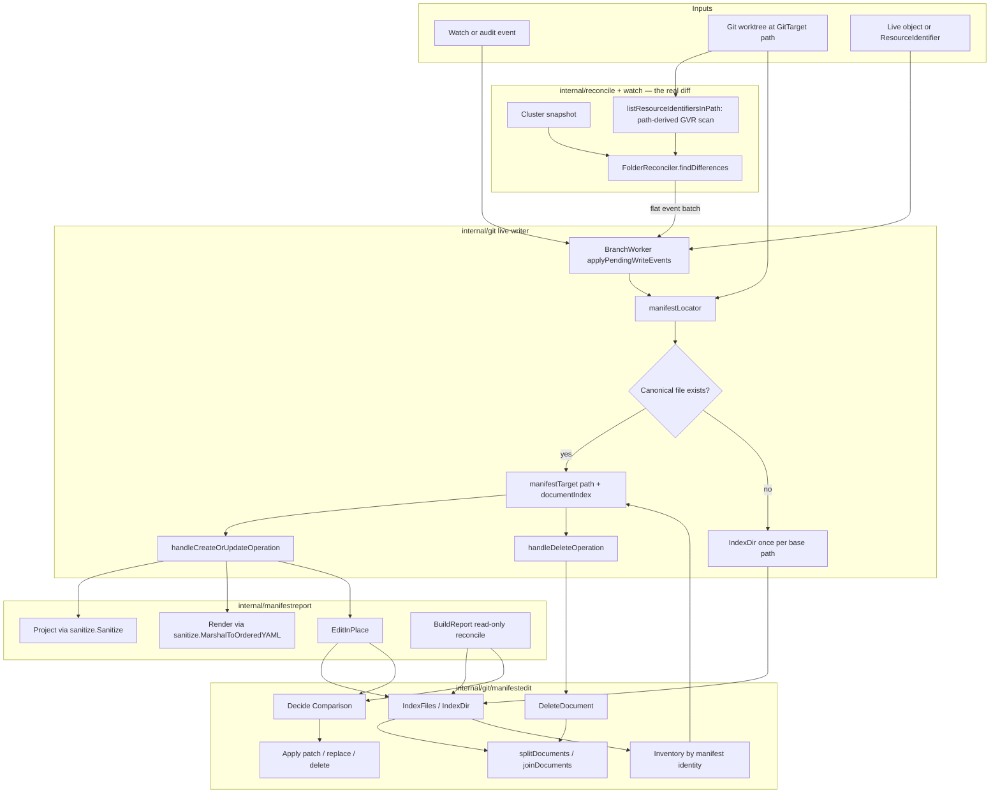
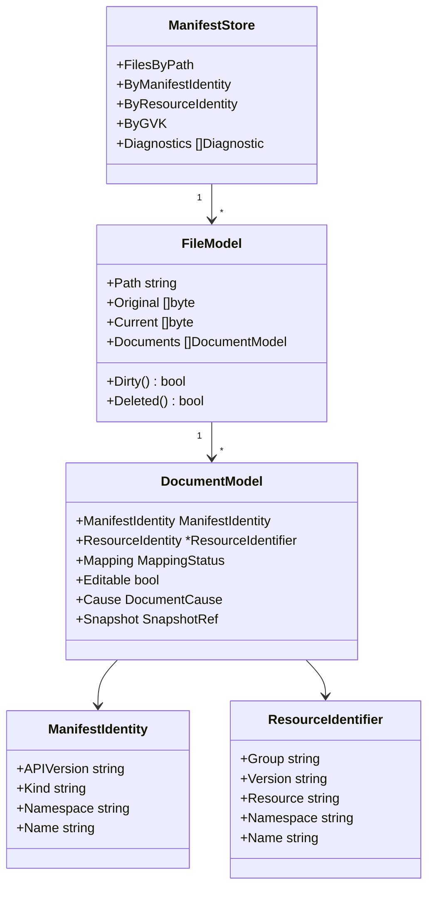

# Current Manifest Support Review

> Status: architecture review, captured 2026-06-04
> Related:
> [implementation-plan.md](implementation-plan.md),
> [reconcile-via-watchlist-mark-and-sweep.md](reconcile-via-watchlist-mark-and-sweep.md),
> [gvk-gvr-mapping-layer.md](gvk-gvr-mapping-layer.md),
> [current-manifest-support-review-feedback.md](current-manifest-support-review-feedback.md),
> [manifest-inventory-file-agnostic-placement.md](manifest-inventory-file-agnostic-placement.md),
> [manifestedit-abstraction-plan.md](manifestedit-abstraction-plan.md),
> [manifestedit-writer-followups.md](manifestedit-writer-followups.md),
> [`internal/git/manifestedit/DECISION.md`](../../../internal/git/manifestedit/DECISION.md)

## Summary

The current manifest support is part-way through the move from path-derived
storage to content-derived placement.

The good news: the low-level manifest editor already understands multi-document
YAML, can patch or delete one document without rewriting siblings, and has a
clear comparison API. The writer also now does match-first placement for updates
and object-backed deletes, so a manifest moved away from the generated path can be
updated in place.

The awkward part is deeper than "event-by-event." Today three separate engines
compare git to the desired state, across two incompatible identity models: the
production diff (`FolderReconciler`) decides creates/deletes from **path-derived**
GVR identity, then hands a flat event list to the writer, which **re-scans** the
same tree by **content** identity to place each one. `BuildReport` is a third,
read-only, content-based comparison. The two scans run at different layers, at
different times, with two different notions of "what resource is this."

The recommended direction is one materialized in-memory model with both a
manifest-identity and a resource-identity index, fed by a first-class plan that is
the same value for the writer, scan mode, the CLI, and status. The initial
reconcile is driven by a streaming-list watch and a mark-and-sweep against that
model — see
[reconcile-via-watchlist-mark-and-sweep.md](reconcile-via-watchlist-mark-and-sweep.md).
The feedback that drove this sharpening is in
[current-manifest-support-review-feedback.md](current-manifest-support-review-feedback.md).

## Non-Negotiable Design Decisions

These are settled decisions, not options. The rest of this document — especially
the data model — is shaped by them.

1. **A GitTarget takes total responsibility for the KRM it materializes.**
   Adopting a folder is an all-or-nothing claim over every API-backed Kubernetes
   manifest in it. There is no such thing as an API-backed KRM document that lives
   in a managed folder while being "not ours." We either fully manage it, or we
   refuse the folder.

2. **No partially materialized multi-document file — ever.** A multi-document YAML
   file is either entirely managed (every document is a tracked, in-scope resource
   we own) or the GitTarget refuses the whole folder. Allowlisted non-API KRM must
   live as its own retained file; it cannot share a multi-document file with
   managed resources. We will not materialize some documents in a file and leave
   the others as untracked passengers. That split state is exactly the drift this
   design exists to remove, and it is the kind of thing that quietly corrupts a
   file on the next write.

3. **Refuse API KRM we do not own; retain allowlisted non-API KRM.** Anything
   API-backed that we cannot take full responsibility for is an **acceptance
   failure with an error condition**, not a silent exclusion:
   - non-KRM YAML (a CI config, a loose values file),
   - duplicate manifest identities,
   - KRM of an unknown / unwatched API-backed GVK,
   - watched KRM that falls **outside this GitTarget's scope** (right kind, wrong
     namespace).
   Each of these stops the GitTarget with a clear, file-naming diagnostic and
   reconciles nothing until a human cleans the folder. We do not guess, and we do
   not prune unwatched API-backed KRM. The one carve-out is an explicit allowlist
   for non-API KRM such as `kustomization.yaml`: accepted, retained on disk,
   never materialized, never swept, and never edited.

4. **The rule is about manifests, not every byte.** Non-manifest files — non-YAML
   such as `README.md`, `.gitignore`, images, and scripts — are not KRM, are never
   materialized, and never cause a refusal. "Full responsibility" is over the
   Kubernetes resources the folder projects, not over auxiliary files that are not
   resources at all. Only YAML that *parses as KRM* is subject to the all-or-nothing
   rule above, except for explicitly allowlisted non-API KRM retained outside the
   model.

5. **GitTargets never overlap.** Within a repository, no GitTarget path may be
   equal to, an ancestor of, or a descendant of another GitTarget's path. Sibling
   folders are fine (`/a` and `/b`); nesting is forbidden (`/a` *and* `/a/b`).
   Overlap would let two targets fight over which documents each one tracks — the
   same two-owners drift this design exists to remove — and it would make
   mark-and-sweep ambiguous (whose orphan is a document in the shared subtree?).
   This is enforced when a GitTarget is admitted/configured: a target whose path
   overlaps an existing one is rejected before it ever builds a store, so every
   materialized folder has exactly one owner.

**Why this matters to the model.** Because no API-backed KRM document is ever a
non-member, the in-memory model is dramatically simpler and safer:

- `FileModel.Documents` is exactly the set of managed documents — there is no
  hidden API-backed document a managed file holds without the model knowing.
- **Retained allowlisted files are not `FileModel`s in the store at all.** Like
  non-YAML auxiliary files, they are known to acceptance but live outside
  `ManifestStore.FilesByPath` (see Concrete Data Structures), so they have no
  document set to empty and can never be swept or deleted.
- File deletion is driven by the **byte-derived `Deleted()`** — a hydrated file
  whose last managed document was dropped, so `Current` became nil — never by a
  bare `len(Documents) == 0` test. That distinction is load-bearing now that the
  allowlist exists. Because the store holds only managed files, an empty managed
  document set safely means an empty file.
- "Membership" is not a permanent per-document partition we maintain; it is simply
  the acceptance outcome. Acceptance passes and every document is a member, or
  acceptance fails and the GitTarget reconciles nothing. Allowlisted non-API KRM
  is outside the model entirely.

## Current Architecture



## How It Works Today

`manifestedit` is the lowest-level mechanism. It scans YAML files, splits
multi-document files with a byte-preserving splitter, derives manifest identity
from `apiVersion`, `kind`, `metadata.namespace`, and `metadata.name`, detects
duplicates, and exposes `Decide` / `Apply` for a single existing document.

`manifestreport` is the integration layer. It supplies policy that
`manifestedit` intentionally does not own: the sanitized Git projection and the
canonical renderer. `BuildReport` already compares an inventory to a desired
object set, but it is read-only. `EditInPlace` is used by the live writer as a
helper for formatting-preserving updates.

The live writer in `internal/git/git.go` still processes events one at a time.
For each batch it creates a `manifestLocator`, which can scan the GitTarget path
once per base path and cache the resulting `manifestedit.Inventory`. Location is
match-first: if the canonical generated file exists, use it; otherwise scan the
inventory and find the existing document by manifest identity. If nothing is
found, create at the generated path.

Deletes call `manifestedit.DeleteDocument`, so deleting from a multi-document
file removes only the targeted document and deletes the file only when no
documents remain.

## Key Code Paths

- [`internal/git/manifestedit`](../../../internal/git/manifestedit) owns YAML
  splitting, inventory, comparison, in-place patching, and per-document deletion.
- [`internal/manifestreport`](../../../internal/manifestreport) supplies the
  sanitizer/renderer policy and exposes the read-only report plus `EditInPlace`.
- [`internal/git/git.go`](../../../internal/git/git.go) owns the production
  locator, create/update handling, and delete handling.
- [`internal/git/commit_executor.go`](../../../internal/git/commit_executor.go)
  creates one `manifestLocator` per pending write batch.
- [`internal/types/identifier.go`](../../../internal/types/identifier.go) defines
  the GVR-based `ResourceIdentifier` used by events and generated paths.

## What Works Well

- The low-level YAML document support is stronger than the writer shape around
  it. `splitDocuments` / `joinDocuments` preserve sibling document bytes, and
  `DeleteDocument` handles per-document deletion.
- `manifestedit.Decide` and `Apply` have the right conceptual split: preflight is
  pure, application reparses and validates a snapshot before mutating bytes.
- The mechanism/policy boundary is mostly healthy. Sanitization and canonical
  rendering live in `manifestreport`, while `manifestedit` stays focused on YAML
  and manifest identity.
- Match-first placement is the right invariant for existing repositories: update
  where the manifest already lives, and use generated placement only for new
  resources.
- Duplicate detection already exists in the inventory, with deterministic
  first-occurrence-wins behavior.
- Multi-document data-loss prevention exists in the live writer: if an in-place
  edit cannot be applied to a multi-doc file, the writer refuses the unsafe
  wholesale fallback instead of dropping sibling documents.

## Cons And Gaps

- **The git tree is scanned twice, with two identity models, in two layers.** The
  production diff (`FolderReconciler.findDifferences`) lists git resources by
  **path** (`listResourceIdentifiersInPath` → `parseIdentifierFromPath`, a GVR
  derived from the file path) and decides creates/deletes; the writer then
  **re-scans** by **content** (`manifestedit.Inventory`) to place each event. A
  manifest moved off its canonical path is invisible to the path scan, so the
  reconciler emits a spurious create at the canonical path and never sees the moved
  copy — the writer's content match cannot fix a decision already made upstream.
  This is the real disease the materialized model cures, and `parseIdentifierFromPath`
  / `listResourceIdentifiersInPath` are what it deletes.
- The inventory is not the source of truth for the writer. It is a locator cache
  used opportunistically after a canonical-path stat fast path.
- DELETE placement is still incomplete when delete events only carry GVR/name and
  no live object. The inventory is keyed by GVK/name, so moved manifests cannot be
  found unless the delete event includes manifest identity or the writer can map
  GVR to GVK.
- Duplicate cleanup is report-only. The inventory can find duplicate losers and
  `BuildReport` can classify them as deletes, but the writer does not act on them.
  The decided behavior is to *refuse* duplicate identities at acceptance rather
  than prune them (see Adoption Policy), so this gap closes by refusal, not by a
  prune feature.
- GVK and GVR are still split across layers. `manifestedit.Identity` is GVK-based;
  `types.ResourceIdentifier` and watch events are GVR-based; there is no central
  model that records both and indexes both.
- Multi-document support is real in `manifestedit`, but not first-class in the
  writer. The writer still starts from "event -> target file" and then guards
  against multi-doc hazards, instead of planning against documents as primary
  entities.
- Semantic no-op detection in the writer canonicalizes YAML as a single object.
  That is useful for generated one-object files, but it is not a complete
  multi-document comparison model.
- Encrypted manifests are intentionally not patchable in place. That is a good
  safety rule, but it means the inventory must distinguish "authoritative
  location" from "editable content" everywhere.
- The current scan cache is per write batch. That avoids O(events x tree), but it
  is still not an incrementally maintained repository model.

## Recommended Direction

Move to a fully materialized in-memory manifest model per GitTarget path.

This rests on one strong, non-negotiable conviction: **the Kubernetes API is the
source of truth.** The GitTarget folder is a materialized projection of the
watched API resources, not a repository the writer merely edits alongside.

That conviction cuts two ways, and the cut is the resolution of what used to be a
contradiction in this document. When a GitTarget instructs us to take a folder
under control and reconcile it, we accept a serious duty — we cannot be sloppy and
leave wrong files in place — but we can discharge that duty conservatively:

- **For watched (tracked) KRM, we keep the folder honest.** A watched document
  whose resource the API no longer has is wrong, and we **drop** it. This is by
  design and intentional: leaving a stale managed manifest would reintroduce a
  second, drifting source of truth — exactly what this design exists to remove.
- **For API-backed KRM we do *not* manage, we refuse rather than delete.**
  Unwatched KRM, duplicate identities, and non-KRM YAML are content we are not
  entitled to take responsibility for. Instead of guessing — and instead of
  deleting files a human authored — we **fail the GitTarget with a clear status
  and reconcile nothing until the folder is cleaned**. Allowlisted non-API KRM is
  retained outside the managed model.

So the source-of-truth duty is discharged by *dropping the managed resources we
own that the API no longer has*, and by *refusing the whole folder* when it
contains API-backed KRM we are not entitled to manage. We do **not** prune
unwatched API-backed KRM. Allowlisted non-API KRM is accepted only as retained
auxiliary input: no model record, no plan action, no sweep.

### What the model collapses, and where it lives

The single model replaces three things with one: the path-derived diff in
`FolderReconciler`, the content re-scan in the writer, and the read-only
`BuildReport`. `BuildReport` is not discarded — it is **the seed of the plan** (it
already does create/update/delete/skip against an inventory).

The plan is the **cross-layer contract**, computed from pure inputs:

```text
# per event — cheap: no worktree I/O, no YAML parse; coalesces last-writer-wins per identity
PendingChanges = fold(watch events)

# per commit boundary — bounded; fired by the existing batch/commit mechanism
ManifestStore  = f(fs.FS headers)                       # cheap header parse; resident, byte-free
touched        = locate(ManifestStore, PendingChanges)  # only the files the batch references
hydrated       = read + snapshot(touched)               # Original bytes + node trees, touched files ONLY
Plan           = f(ManifestStore, hydrated, PendingChanges, policy)
applied        = f(hydrated, Plan)                      # pure mutation of the touched files
Flush          = f(applied, worktree)                   # the only side effect; one commit
```

The analyzer / scan / CLI / status are the same pipeline with `Flush` omitted; the
structure-only analyzer stops after `ManifestStore` (no API source, no hydration).
The whole-folder cost is the cheap header parse — everything expensive is
proportional to the batch, not the folder, and not to the event rate.

Store and plan are therefore computed in the layer that owns the cluster state
(reconcile), the writer becomes a dumb "apply plan + flush," and scan mode / CLI /
status are the same function with the flush omitted. A plan is valid for exactly
one **`(commit SHA, cluster snapshot revision)`** pair; the streaming-watch
bookmark (see the reconcile doc linked above) pins that revision.

Two constraints to respect from the start, not retrofit:

- **The GVK↔GVR resolver must be built**, as an injectable source (live
  informers, kubeconfig, static snapshot, or nil for structure-only). Everything
  downstream depends on it; see
  [gvk-gvr-mapping-layer.md](gvk-gvr-mapping-layer.md).
- **Materialization must be bounded — spatially and temporally.** *Spatially:*
  identity indexing needs only a cheap header parse; build the full `manifestedit`
  node tree only for documents a plan action touches (`DocumentModel.Snapshot` as a
  lazy handle, not eager bytes for every document). *Temporally:* the per-event hot
  path records only a coalesced intent (`PendingChanges`); file bytes are read and
  documents hydrated only at the commit boundary, and only for the files that batch
  touches. The resident `ManifestStore` is therefore byte-free. See
  [Two boundaries](#two-boundaries-cheap-per-event-materialize-per-commit) below.



The resident structure index is built once from the checked-out commit/worktree
snapshot with a **cheap header parse** (no full node trees, no eager bytes), then
maintained incrementally. The batch planner runs at the commit boundary:

1. Header-scan all YAML files under the GitTarget path (`apiVersion`/`kind`/
   `metadata` only); split files into document models without building node trees.
2. Derive manifest identity for valid KRM documents.
3. Resolve manifest GVK to watched GVR using the watch/catalog/RESTMapper layer.
4. Populate indexes by manifest identity, resource identity, and GVK.
5. Fold the batch's coalesced `PendingChanges` (desired live resources) against the
   index, and **hydrate only the files those changes reference** — read their bytes
   and build `manifestedit` snapshots for the touched documents.
6. Produce a plan: create, patch, whole-replace, delete document, delete file,
   drop a watched resource the API no longer has, skip. (Duplicate identities and
   unwatched API-backed KRM never reach planning — they are refused at acceptance;
   allowlisted non-API KRM is retained outside the model.)
7. Apply the plan to the hydrated file models.
8. Flush changed files and staged deletions to the worktree in one commit.

## Why This Fits The Requirements

Multiple manifests in one file become normal because the unit of planning is a
document record, not a generated file path.

Deletion becomes less special. A delete plan targets a `RecordRef`, and the file
model decides whether removing that document leaves a file to rewrite or a file
to delete.

GVK lookups become cheap because the store owns explicit indexes. GVR lookups also
become cheap once each record carries both manifest identity and resolved resource
identity.

Duplicate handling becomes an ordinary acceptance check. A duplicate identity
fails the GitTarget before planning, so the writer never has to decide which copy
wins or delete one a human authored.

Status and diagnostics become bounded summaries of the store and plan, instead of
being re-derived in multiple layers.

## Writer Model: Plan, Apply, Dirty Flush

The write path should have exactly one mechanism:

```text
scan worktree -> ManifestStore
ManifestStore + desired API state -> Plan
Plan applied to mutable ManifestStore
Mutable ManifestStore -> flush dirty/deleted files
```

The important choice is that the model is organized around **files and documents**,
not only object records — so a plan can express multi-document edits, document
deletion, and file deletion. The resident model stays byte-free; the bytes for a
file are hydrated only at the commit boundary (see Two boundaries below), and once
the plan is applied the hydrated file model is the source of truth for what will be
written to Git.

Do **not** render every object model back to files on each commit. That would be
simple, but it would discard hand-authored formatting, make multi-document files
feel like an exception, and bypass the existing `manifestedit` preservation
mechanism.

Also do **not** keep only a list of changed or removed resources. That repeats
the current split-brain shape: resource-level changes still need file-level and
document-level context for multi-document edits, document deletion, file deletion,
duplicate cleanup, and moved manifests.

Instead, build the structure model once per checked-out GitTarget path (cheap
header parse, byte-free), hydrate only the files a batch touches, apply the plan to
those, and flush only the files whose bytes changed or whose file was deleted.

The initial reconcile (and any resync) is the same mechanism with its deletes
derived differently: a streaming-list watch folds every existing object over the
store, and a **mark-and-sweep** drops the watched, in-scope documents the stream
never touched. Untracked content is never a member of that swept model, so it can
never be deleted by construction. Steady-state events are single plan actions over
the maintained store, not a re-sweep. See
[reconcile-via-watchlist-mark-and-sweep.md](reconcile-via-watchlist-mark-and-sweep.md).

### Two boundaries: cheap per event, materialize per commit

The model has a **temporal** boundary as sharp as its spatial one, and it lines up
with a mechanism the writer already has: events are coalesced into a single commit.
A GitTarget can take a high rate of watch events, and most of them never need to
touch a byte of YAML — many are no-ops, supersede each other, or cancel out before
the next commit fires. So the write path is two-tier:

- **Per event (hot path — no I/O, no YAML parse).** A watch event resolves to a
  resource identity (via the mapper) and is recorded in a `PendingChanges` buffer,
  last-writer-wins per identity. A create-then-delete within one batch cancels; a
  create-then-modify keeps only the final desired object. This is bookkeeping on a
  map keyed by `ResourceIdentifier`; it never reads the worktree, never splits YAML,
  never builds a `manifestedit` node tree.
- **Per commit (cold path — bounded materialization).** When the existing batch /
  commit mechanism fires, the coalesced `PendingChanges` are resolved against the
  resident, byte-free structure index, and only the files those changes reference
  are **hydrated**: their `Original` bytes are read, the touched documents get their
  `manifestedit` snapshot built, the plan is computed and applied, and dirty/deleted
  files flush into one commit.

This is the **temporal** twin of bounded materialization. The spatial constraint
("build the node tree only for documents a plan action touches") bounds the work
*across the folder*; the commit boundary bounds it *across the event stream*.
Together, the cost of a batch is proportional to *what actually changed in that
batch* — not to the size of the folder, and not to the number of events that
arrived.

Two things keep it safe:

- **No-op detection still happens, but lazily and once.** Whether a pending change
  is a real change (patch) or already satisfied (skip) is decided at commit, by
  hydrating that one document and comparing — not per event, and never for documents
  no pending change references.
- **Correctness comes from comparing to git at commit, not from event order.** The
  buffer holds only the final desired state per identity; the plan compares that to
  the document actually in git at the commit's checkout. Intermediate event churn is
  irrelevant by construction.

This does **not** reintroduce the "keep only a list of changed resources" anti-shape
warned against above. The per-event buffer is *intent*, not the write model: it is
resolved against the full file/document structure at commit, where multi-document
edits, document deletion, and file deletion all still have the context they need.

### Concrete Data Structures

The exact package names can change, but the shape should be close to this:

```go
type ManifestStore struct {
    Root string

    // FilesByPath holds only MANAGED files — those with at least one tracked,
    // in-scope KRM document. Non-YAML auxiliary files and retained allowlisted
    // non-API KRM files (e.g. kustomization.yaml) are deliberately NOT here: they
    // are known to acceptance but never become FileModels, so they have no document
    // set to empty and can never be swept or deleted. A FileModel therefore always
    // has at least one document until its last is dropped — at which point Current
    // goes nil and Deleted() correctly fires.
    FilesByPath map[string]*FileModel

    // Indexes hold pointers into FilesByPath, not (path, index) pairs, so a
    // document delete that shifts a file's slice never invalidates them.
    //
    // Post-acceptance these are single-valued by construction: duplicate manifest
    // identities refuse the GitTarget (see Non-Negotiable Design Decisions), so a
    // store that became the planning model has exactly one document per identity.
    // The pre-acceptance builder (and the structure-only analyzer, which reports
    // collisions instead of refusing) must see duplicates, so it collects
    // candidates multi-valued and collapses to these once acceptance passes.
    ByManifestIdentity map[manifestedit.Identity]*DocumentModel
    ByResourceIdentity map[types.ResourceIdentifier]*DocumentModel
    ByGVK              map[schema.GroupVersionKind][]*DocumentModel

    Diagnostics []manifestedit.Diagnostic
}

type FileModel struct {
    Path string

    // Documents and their classification are resident and cheap (header parse only).
    Documents []*DocumentModel // every managed document in the file, in document order

    // Original/Current are HYDRATED LAZILY at the commit boundary, and only for the
    // files a batch touches — they are nil for every untouched file, so the resident
    // store is byte-free (see "Two boundaries" above). An implementation may move
    // these onto a separate commit-scoped working type so the type system enforces
    // "resident = no bytes"; the semantics are what matter here.
    Original []byte // worktree bytes once hydrated; nil for a new or unhydrated file
    Current  []byte // bytes after applying plan actions; nil means "delete this file"
}

// Dirty and Deleted are derived, never stored. Two byte slices are the whole
// state machine, so there is no flag to forget to flip:
//
//   new file: Original == nil, Current != nil
//   deleted:  Original != nil, Current == nil
//   dirty:    both non-nil and not byte-equal
func (f *FileModel) Dirty() bool   { return f.Current != nil && !bytes.Equal(f.Current, f.Original) }
func (f *FileModel) Deleted() bool { return f.Current == nil && f.Original != nil }

type DocumentModel struct {
    ManifestIdentity manifestedit.Identity     // apiVersion + kind + namespace + name
    ResourceIdentity *types.ResourceIdentifier // nil until the mapper resolves a GVR

    Mapping  MappingStatus // why ResourceIdentity is or is not set (resolved / unserved / ambiguous / structure-only / ...)
    Editable bool          // false for SOPS-encrypted or otherwise non-patchable documents
    Cause    DocumentCause // structured reason behind Editable and diagnostics — not free text

    // Snapshot is a lazy handle. The full manifestedit node tree is built only
    // when a plan action touches this document; identity indexing needs only a
    // cheap header parse.
    Snapshot manifestedit.SnapshotRef
}

// RecordRef is a plan-level value, not a model field. The Plan is serializable
// and pinned to one (commit SHA, snapshot RV) pair, so a (path, index) pair is a
// stable reference for that plan's lifetime. The live, mutable store navigates by
// the *DocumentModel pointers above instead, and DocumentModel deliberately does
// not store its own FilePath or Index — both are derivable. The file path is the
// containing FileModel's; the document's TRUE file index is reconstructed from the
// record-less diagnostic gaps (every empty/non-KRM/invalid document leaves a
// diagnostic at its position, so the managed documents fill the remaining positions
// in order — `reconstructManagedIndices`). That recovers the right index even in a
// non-contiguous file the acceptance gate is refusing; at apply time manifestedit is
// handed the position directly.
type RecordRef struct {
    FilePath      string
    DocumentIndex int
}

// PendingChanges is the per-event hot path: cheap bookkeeping, no worktree I/O and
// no YAML parsing. Watch events fold into it last-writer-wins per identity, so a
// create-then-delete within one batch cancels and a create-then-modify keeps only
// the final desired object. It is drained at the commit boundary, where it is
// resolved against the resident store and the touched files are hydrated.
type PendingChanges struct {
    Desired map[types.ResourceIdentifier]PendingChange
}

type PendingChange struct {
    Resource types.ResourceIdentifier
    Object   *unstructured.Unstructured // nil ⇒ delete intent (tombstone)
    // No rendered bytes: rendering is deferred to commit and runs once per identity.
}
```

What changed from the first sketch of these types, and why:

- **`DocumentModel.Index` and `DocumentModel.FilePath` are gone.** A stored index
  is the most fragile field in the model: every document delete shifts a file's
  slice and would force re-syncing the field plus every index entry. Deriving it
  removes that bug class. `FilePath` is redundant because every access path already
  carries it (top-down iteration, or a plan `RecordRef`).
- **`FileModel.Dirty` / `Deleted` became methods.** They are pure functions of
  `Original` vs. `Current`, so storing them only created a desync hazard.
- **`FileModel.Encrypted` and `DocumentModel.Encrypted` collapsed into
  `Editable` + `Cause`.** Encryption is one *cause* of non-editability; modeling it
  as a separate bool invites "encrypted but editable" contradictions.
- **`DocumentModel.Duplicate` is gone.** Duplicate identities refuse the GitTarget
  at acceptance, so no duplicate document ever reaches the planning model. Duplicate
  detection is an acceptance/analyzer concern surfaced through `Diagnostics`.
- **`DocumentModel.RawBody` became `Snapshot` (a lazy handle).** Holding eager bytes
  per document violates bounded materialization.
- **`Reason string` became a structured `Cause`.** Phase 1 explicitly forbids
  classification that depends on diagnostic message text.
- **One GVK type.** The store and the mapper both use `schema.GroupVersionKind`; the
  per-document GVK is derived from `ManifestIdentity` rather than stored as a third
  GVK-shaped field.
- **`Duplicates` and `AcceptedOnce` left the store.** The first is a diagnostic; the
  second is lifecycle state that does not belong in the data model.
- **Bytes are lazy and the per-event path is byte-free.** `FileModel.Original` /
  `Current` are hydrated only at the commit boundary for the files a batch touches;
  the resident store holds no bytes, and events accumulate in `PendingChanges`
  without reading or parsing anything. This is the temporal half of bounded
  materialization (see "Two boundaries"), promoted from a deferred optimization to a
  structural property of the model.

**Why deletion is not a `DocumentModel` flag (and how mark-and-sweep runs without
one).** It is tempting to put `Deleted` (and a mark bit) on `DocumentModel` so the
sweep can flip it per document. We deliberately do not: the durable model holds
*structure*, while transient per-batch decisions live in the **plan**.

- *Removing a document is a `PlanAction`* (`PlanDropOrphan` / `PlanDeleteDocument`)
  targeting a `RecordRef`. Apply calls `manifestedit.DeleteDocument`, which rewrites
  the file's bytes; the document then simply leaves `file.Documents` rather than
  lingering as a `Deleted`-flagged tombstone the rest of the code must remember to
  filter out.
- *Flush state is file-level and derived.* `git add` / `git rm` act on files and
  `Current` is whole-file bytes, so `Dirty()` / `Deleted()` are properties of the
  file, not the document. A multi-document file with one document dropped is dirty,
  not deleted; it becomes deleted only when its last document is dropped.
- *The sweep needs no flag.* Per
  [reconcile-via-watchlist-mark-and-sweep.md](reconcile-via-watchlist-mark-and-sweep.md),
  the "mark" is the set of streamed identities and the "sweep" is a one-pass
  set-difference (`orphans = members − streamed`) computed at the bookmark, which
  then *emits* drop actions. This is isomorphic to per-document flag-toggling but
  safe under a partial or failed stream, because the model is never half-mutated.

The plan should also be explicit:

```go
type Plan struct {
    Actions     []PlanAction
    Diagnostics []manifestedit.Diagnostic
}

type PlanAction struct {
    Kind PlanActionKind

    Ref      RecordRef
    Identity manifestedit.Identity
    Resource types.ResourceIdentifier

    Desired *unstructured.Unstructured
    Reason  string
}

type PlanActionKind string

const (
    PlanCreate              PlanActionKind = "create"
    PlanPatch               PlanActionKind = "patch"
    PlanReplace             PlanActionKind = "replace"
    PlanDeleteDocument      PlanActionKind = "delete-document"
    PlanDeleteFile          PlanActionKind = "delete-file"
    // PlanDropOrphan deletes a watched resource the API no longer has (the managed
    // drop). Duplicate identities and unwatched API-backed KRM produce no plan
    // action — they refuse the GitTarget at acceptance, before planning.
    // Allowlisted non-API KRM is retained outside the model.
    PlanDropOrphan          PlanActionKind = "drop-orphan"
    PlanSkip                PlanActionKind = "skip"
)
```

The flush operation should be intentionally boring. In pseudo-code:

```go
func Flush(root string, store *ManifestStore, worktree *git.Worktree) error {
    for _, file := range store.FilesByPath {
        switch {
        case file.Deleted():
            os.Remove(filepath.Join(root, file.Path))
            worktree.Remove(file.Path)
        case file.Dirty():
            os.WriteFile(filepath.Join(root, file.Path), file.Current, 0o600)
            worktree.Add(file.Path)
        }
    }
    return nil
}
```

This means there is no separate generated-path writer. New files, in-place
updates, whole-document replacements, and document deletes all produce changes by
mutating `FileModel.Current` (and, for a delete that empties a file, setting it to
nil). `Dirty()` and `Deleted()` follow from that automatically — there is no flag
to set by hand.

### Concrete Examples

Each example shows the **commit-time apply**, so the touched file is already
hydrated; the per-event path that preceded it only recorded the desired change in
`PendingChanges` without reading or parsing anything.

**Example 1: update one document in a multi-document file**

Input file:

```yaml
apiVersion: v1
kind: ConfigMap
metadata:
  name: app
  namespace: default
data:
  color: blue
---
apiVersion: apps/v1
kind: Deployment
metadata:
  name: web
  namespace: default
spec:
  replicas: 1
```

Desired API state changes only `ConfigMap/default/app` to `color: green`.

Plan:

```text
patch apps.yaml#0 v1/ConfigMap/default/app
```

Apply:

- look up `RecordRef{FilePath: "apps.yaml", DocumentIndex: 0}`
- call `manifestedit.Apply` for document 0
- replace `FileModel.Current` with the returned full-file bytes
- `apps.yaml` is now dirty because `Current` differs from `Original`
- keep document 1 byte-for-byte; the splitter preserves sibling document bytes

Flush:

```text
git add apps.yaml
```

No other files are rendered.

**Example 2: delete one document from a multi-document file**

Input file:

```yaml
apiVersion: v1
kind: ConfigMap
metadata:
  name: app
  namespace: default
---
apiVersion: v1
kind: Secret
metadata:
  name: token
  namespace: default
```

The API no longer has `Secret/default/token`.

Plan:

```text
delete-document apps.yaml#1 v1/Secret/default/token
```

Apply:

- call `manifestedit.DeleteDocument` for document 1 (its position is derived at
  this point, not read from a stored field)
- update `FileModel.Current` to the surviving ConfigMap document
- drop document 1 from `apps.yaml`'s slice; `Dirty()` now reports true because
  `Current` differs from `Original`, and `Deleted()` stays false because a
  document remains
- no index bookkeeping and no map rewrites: the indexes hold `*DocumentModel`
  pointers, which survive the slice shift

Flush:

```text
git add apps.yaml
```

If the deleted document had been the only document in the file, the same plan
action would leave the file with zero documents and set `Current = nil`, so
`Deleted()` reports true and flush stages a file removal instead. This is
unconditionally safe under the design decisions above: an empty managed document
set means an empty file, because a managed *file* never carries unmanaged
passenger documents (mixed managed/allowlisted files are refused at acceptance),
and retained allowlisted files are not `FileModel`s in the store.

**Example 3: create a new resource**

The API has `Deployment/default/api`, and no record exists in `ManifestStore`.

Plan:

```text
create apps/v1/deployments/default/api.yaml apps/v1/Deployment/default/api
```

Apply:

- placement policy chooses the path
- canonical renderer creates one new document
- add a new `FileModel` with `Original = nil`, `Current = rendered`; `Dirty()`
  reports true (new file)
- add its document to the in-memory indexes

Flush:

```text
git add apps/v1/deployments/default/api.yaml
```

**Example 4: refuse a folder with duplicate identities**

The store contains the same manifest identity twice:

```text
apps/app.yaml#0       v1/ConfigMap/default/app
legacy/app.yaml#0     v1/ConfigMap/default/app
```

This is a human-authored ambiguity we will not guess at. Acceptance fails before
any plan is applied:

```text
refuse: duplicate manifest identity v1/ConfigMap/default/app
  at apps/app.yaml#0 and legacy/app.yaml#0
```

No file is written and no file is deleted. The GitTarget surfaces the collision in
its status, and reconcile resumes only once a human removes one of the copies.

### Why This Is Efficient Enough

- Per event the cost is O(1) bookkeeping in `PendingChanges` — no worktree read and
  no YAML parse — so a high event rate does not translate into per-event work.
- Per batch the worktree is header-scanned once (cheap, and cacheable across
  batches), and only the files the batch touches are read in full and parsed.
- Only plan-targeted files are mutated in memory.
- Only dirty or deleted files are written to disk and staged.
- Document deletes shift a slice and rewrite one file's bytes; nothing reindexes,
  because positions are derived and the indexes hold pointers.
- Longer-lived caching can come later, keyed by checkout state and GitTarget path.

The first implementation should optimize for one correct mechanism. Once the
store is authoritative, cache invalidation becomes an optimization around a clear
model rather than a second write path.

## Implementation Recommendations

- Promote `manifestedit.Inventory` from a locator helper into a richer
  `ManifestStore` owned by the writer or a new integration package. Keep
  `manifestedit` as the YAML mechanism underneath it.
- Resolve delete events through the GVK/GVR mapper before writing. Delete events
  usually carry GVR/name, while manifests are keyed by GVK/name; the writer should
  receive a resolved `ResourceIdentifier`/manifest identity pair from the planning
  layer and delete by `RecordRef`. See
  [gvk-gvr-mapping-layer.md](gvk-gvr-mapping-layer.md).
- Add a resource-identity index beside the existing manifest-identity index. The
  writer should locate watched resources by `ResourceIdentifier`, while retaining
  GVK for YAML fidelity and diagnostics.
- Do not build duplicate-loser pruning. Duplicate identities fail the acceptance
  check and refuse the GitTarget instead. Once the unified content-derived store
  with match-first placement is in place, the controller no longer produces
  duplicates of its own, so there is no remaining "safe to prune" duplicate case
  to special-case.
- Make the batch planner operate on the materialized store, then flush once. This
  avoids repeated disk reads, avoids stale per-event assumptions, and gives a
  single place to update document indexes after deletions.
- Make dirty/deleted file flushing the only Git write mechanism. Generated-path
  creation, in-place patching, whole replacement, document deletion, and file
  deletion should all mutate `FileModel.Current`; `Dirty()` and `Deleted()` are
  derived from it, never set by hand.
- Keep the current safety rules: no in-place edits for SOPS documents, and no
  wholesale replacement of a multi-document file when the target document cannot
  be edited safely. The managed drop of watched resources the API no longer has is
  gated behind acceptance: a folder that does not pass the acceptance checks
  refuses outright and drops nothing. Scan mode (see below) renders the full plan,
  including managed drops, before any write happens.
- Keep creation placement as policy above the editor. The materialized model
  should answer "does this resource already exist?" and "where is it?"; a separate
  placement policy should answer "where should a new resource go?"

## Acceptance Checks On First Materialization

When a GitTarget path is materialized for the first time — an empty or
never-before-reconciled target whose existing files we are adopting, not state
the controller produced — the store should run **acceptance checks before it is
allowed to become the planning model**, and fail the GitTarget loudly when they
do not pass. The guiding rule: we cannot fix everything, and trying to be clever
about ambiguous human-authored content is more dangerous than refusing it.

The first such check is **duplicate manifest identities**. If the initial scan
finds two or more documents that resolve to the same `ManifestIdentity`
(`apiVersion` + `kind` + `namespace` + `name`), the GitTarget should error out
with a diagnostic naming the colliding files/documents, rather than silently
picking a winner. We genuinely do not know which copy the author intended, and
guessing risks deleting the one they cared about.

Note this is deliberately keyed on full manifest identity, not on GVK alone.
Many resources of the same kind (several `Deployment`s, several `ConfigMap`s)
are normal and must pass. Only same-identity collisions are rejected.

Duplicate identities are **refused**, full stop. We cannot know which copy the
author intended, and guessing risks deleting the one they cared about, so the
GitTarget fails until a human resolves the collision. Once the store is the single
content-derived model with match-first placement, the controller no longer
produces duplicates of its own, so there is no separate "controller-produced
duplicate" case to prune — refusal is the one behavior, and the earlier tension
between pruning and refusing duplicates disappears.

The second check is **unrecognized files**. The hard question is what to do with
files in the folder that are not watched resources. Lumping them into one
"unrecognized" bucket is the trap; they have very different danger levels, so the
store should classify every file into one of five buckets:

1. **Non-YAML files** (`README.md`, `.gitignore`, scripts, images): ignored
   entirely. Never read, never planned, never pruned. No ambiguity.
2. **YAML that is not KRM** (no `apiVersion` + `kind`, or not a Kubernetes-shaped
   object — a CI config, a loose values blob): the genuinely dangerous unknown.
   We cannot model it and cannot reason about whether mutating the folder is safe.
3. **Valid KRM, watched GVK**: the managed happy path — fully modeled and planned.
4. **Valid KRM, unwatched API-backed GVK**: recognizable, but not selected by
   this GitTarget's watched set.
5. **Allowlisted non-API KRM** (for example `kustomization.yaml`): recognizable
   KRM that is intentionally retained as auxiliary input, not as a managed API
   resource.

The **starter requirement** (structure-only, no cluster needed) is to define
*recognized = parses as KRM* and to fail the GitTarget when any YAML file falls in
bucket 2 (non-KRM YAML), alongside the duplicate-identity gate. Once the watched
API surface is available through the
[GVK/GVR mapping layer](gvk-gvr-mapping-layer.md), bucket 4 (unwatched API-backed
KRM) joins the same refusal. Bucket 5 is the explicit exception: allowlisted
non-API KRM is accepted but not materialized. Non-YAML files (bucket 1) are always
ignored and never cause failure.

Within the recognized set, watched and unwatched KRM are treated differently, and
here the guiding conviction is decisive: **the API is the source of truth.** The
GitTarget folder is a projection of the watched API resources, not an independent
repository we merely edit around.

- **Watched (bucket 3)** is managed and planned against live API state. A watched
  document whose resource the API no longer has is **dropped** — this is the
  source-of-truth duty, and it is intentional.
- **Unwatched API-backed KRM (bucket 4) is refused, not pruned.** A KRM document
  of a served kind we do not watch is something we have made no claim over. Rather
  than delete content we never managed, the GitTarget fails its acceptance check
  with a diagnostic naming the offending files, and reconciles nothing until a
  human removes them. We do **not** build a delete option for unwatched
  API-backed KRM.
- **Allowlisted non-API KRM (bucket 5) is retained, not materialized.** Documents
  such as `kustomization.yaml` are kept on disk as auxiliary input, excluded from
  `FileModel.Documents`, excluded from every plan, and excluded from sweep. If an
  allowlisted document shares a multi-document file with managed resources, the
  folder is refused; we do not partially materialize a file.
- **Watched but out of scope is also refused.** A document of a watched kind that
  falls outside this GitTarget's scope (right kind, wrong namespace) is KRM we
  recognize but are not entitled to manage here. Per the Non-Negotiable Design
  Decisions we do **not** leave it as a silent non-member — doing so would create
  exactly the half-managed file we have ruled out — so it refuses the GitTarget
  with a file-naming diagnostic until a human resolves it.

This keeps a sharp edge honest rather than dangerous: build directives like
`kustomization.yaml` are KRM but never appear in the API. They are handled by the
non-API KRM allowlist, not by the watched-resource planner. They stay on disk, do
not become managed documents, and cannot be swept. Unwatched API-backed KRM still
refuses the GitTarget; it is never pruned as cleanup.

Implementation notes:

- Run acceptance checks as a distinct step between "build the store" and "use it
  as the planning model", so a failing GitTarget never proceeds to create/update/
  delete planning with an ambiguous model. This is implemented as
  [`manifestanalyzer.Accept`](../../../internal/manifestanalyzer/acceptance.go) (M4).
- Surface the failure through GitTarget status/diagnostics with enough detail
  (offending identity + file paths) for a human to resolve it, then re-reconcile.
- Treat the check list as extensible. Duplicate identity, non-KRM YAML,
  unwatched API-backed KRM, and mixed files containing both managed and
  allowlisted documents are pre-planning acceptance failures.
- **A managed file must be entirely valid KRM (the "impure managed file" rule).**
  Decision #2 ("no partially materialized multi-document file") is enforced
  literally: a file that holds at least one managed resource is refused if it *also*
  holds any non-managed document — an empty/comment-only document, a non-KRM
  document, or an invalid one. A *standalone* empty document (a file with no managed
  document) is still ignored; the rule bites only inside a file we would manage. This
  is what lets `DocumentModel` carry no per-document index: an accepted managed file's
  documents are contiguous from 0, so positions are derived top-down rather than
  stored. A practical consequence is that a stray trailing `---` (which yields an
  empty document) in an *adopted* managed file is refused until cleaned — deliberate
  strictness over a stored-index workaround.
- **The non-API KRM allowlist is filename-based.** A real `kustomization.yaml` has
  no `metadata.name`, so it is not a KRM record and a GVK-keyed allowlist would never
  match it. The allowlist matches build-directive basenames (as kustomize itself
  does), retains the whole file outside `FilesByPath`, and suppresses its per-document
  classification diagnostics. A *named* managed resource found inside an allowlisted
  file is refused (mixed file) rather than silently un-managed.

## Adoption Policy: Refuse First

The source-of-truth conviction says git must not carry a divergent state. There is
more than one way to *enforce* that, and we are deliberately choosing the most
conservative one to start. Two behaviors are easy to confuse, so name them apart:

- **Managed drop (always on once the folder is accepted, not a policy knob).** A
  *watched* KRM document whose resource the API no longer has is deleted. This is
  the source-of-truth duty for the resources we own, and it is not configurable
  away — a GitTarget that asked us to manage these kinds asked us to keep them
  honest.
- **Adoption acceptance (a gate, currently single-mode: refuse).** Before a folder
  is allowed to become the planning model at all, it must pass the acceptance
  checks. Anything we cannot take responsibility for — duplicate identities,
  non-KRM YAML, or unwatched API-backed KRM — makes the GitTarget **refuse**: it
  fails with a diagnostic listing the offending files and reconciles nothing until
  a human cleans the folder. Allowlisted non-API KRM is retained outside the
  managed model.

We do **not** build an active "prune the unwatched API-backed KRM for you" mode.
Refusing is safer, it forces a human to look before anything is touched, and it
never deletes a file the controller did not author.

`scan` (dry-run) remains valuable alongside refuse: it builds the store, runs the
acceptance checks, and renders the full plan — including the managed drops — so an
operator can see exactly what reconcile would do before granting it write access.
See the next section.

## Scan Mode (Dry-Run)

Because the source-of-truth duty makes the writer willing to delete managed
resources the API has dropped, the writer must be able to show its hand before it
is trusted with write access. Scan mode is a dry-run that builds the store, runs
the acceptance checks, and computes the full plan — creates, updates,
whole-replaces, document deletes, file deletes, and managed drops — but stops
before flushing anything to the worktree. It also reports any acceptance refusal
(duplicate identity, non-KRM YAML, unwatched API-backed KRM, or mixed
managed/allowlisted files) so an operator sees why a folder would be rejected.
Instead of writing, it reports what it *would* do if given write rights.

This is the deliberate gate the existing safety rules ask for: no deletion until
the plan has an explicit, reviewable form. Scan mode is that gate. It matters most
on first materialization, where the managed-drop set can be large and a mistake is
destructive — it lets a human see "I am about to delete these N files" before any
of them are touched.

It also falls out naturally from the plan-then-flush architecture: the plan is
already a first-class value, so scan mode is simply "compute the plan, render it,
do not flush". The same plan rendering doubles as the human-facing diff and as the
basis for status/diagnostics.

## Standalone Analyzer CLI

The same machinery that builds the store, classifies files, runs the acceptance
checks, and renders a plan is valuable on its own, outside the controller: a small
CLI that analyzes any existing folder of manifests. Anyone could point it at a
directory and learn what we would learn — duplicate identities, multi-document
files, KRM vs. non-KRM YAML, the GVK inventory, and (given cluster access) what
would be created, updated, or pruned. That is useful for auditing a repo before
adopting it, for debugging a GitTarget, and as a low-stakes way to exercise the
core logic.

> **Current role (2026-06-04).**
> [`internal/manifestanalyzer`](../../../internal/manifestanalyzer) is the
> runtime-independent analysis library, and
> [`cmd/manifest-analyzer`](../../../cmd/manifest-analyzer) is the CLI. The
> library walks an `fs.FS`, classifies every file (non-yaml, empty, invalid-yaml,
> non-krm, krm), detects duplicates, builds a bounded summary, reports the
> inventory of every GVK found, and emits acceptance issues in text or JSON.
> `--policy refuse` makes any acceptance issue a non-zero exit, which is the
> CLI shape of the refuse adoption mode.
>
> Deliberately deferred: comparing those GVKs against a live API to decide what
> is *watched / unwatched / orphaned*. The next model needs the
> [GVK/GVR mapping layer](gvk-gvr-mapping-layer.md), the
> watched/unwatched/orphan comparison, the plan computation, and wiring the same
> library into the live writer.
>
> Running it against `config/samples` already surfaced a real constraint:
> `manifestedit` derives manifest identity from a concrete `metadata.name`, so a
> `generateName`-only object (`commitrequest.yaml`) is classified non-KRM. That
> is correct given today's identity rules and is exactly the kind of gap the
> analyzer is meant to make visible.

This is not just a nice extra; it imposes useful constraints on the software
design, and those constraints push in exactly the direction the rest of this
review already wants:

- The store, classification, acceptance checks, planner, and renderer must be a
  **library with no hard dependency on the controller runtime** (no manager, no
  informers, no reconcile loop). The controller and the CLI both become thin
  callers of that library.
- **"What is in the API" must be an injectable source**, not an ambient global.
  Back it with live informers in the controller, a kubeconfig-backed client in
  the CLI, a static snapshot in tests, or nothing at all for structure-only
  analysis (duplicate detection, parse validity, and GVK inventory all work with
  no cluster). The set of watched GVKs is likewise an input, not a constant.
- **Filesystem access must be abstracted** so the same code runs against a git
  worktree (controller) and an arbitrary directory (CLI).
- The **analysis path must be strictly read-only and side-effect-free**; writing
  is a separate capability layered on top, never entangled with analysis. This is
  also what makes `scan` mode trivial to expose in both contexts.
- **Plan/diagnostic rendering should be reusable** as controller status, as
  CLI human-readable output, and as a machine-readable (JSON) form.

In short, the analyzer use case reinforces the mechanism / policy / runtime
separation this document argues for anyway, and it gives that separation a second
real consumer to keep it honest.

## Suggested Phases

> The concrete, PR-sized ordering — with dependencies, file targets, and
> "done when" criteria — lives in [implementation-plan.md](implementation-plan.md).
> The phases below are the rationale; that document is the execution order.

The current baseline is a runtime-independent analyzer library and CLI that can
walk a directory, classify files and YAML documents, report GVK inventory, detect
duplicate manifest identities, and render text/JSON. The remaining plan should
turn that read-only structure model into the shared model used by scan mode and
the live writer.

1. **Stabilize the materialized model.** Promote the analyzer's report shape into
   a true byte-free `ManifestStore`: file models with document summaries,
   manifest identity, editability plus structured cause, mapping status, and
   structured diagnostics. Keep raw bytes and full node trees behind lazy
   commit-scoped hydration. Keep duplicate state in diagnostics/acceptance, not in
   the planning model. Keep `fs.FS` as the read boundary and keep
   controller-runtime dependencies out. Replace any classification that depends on
   diagnostic message text with structured reasons from `manifestedit`.
2. **Add the API/source-of-truth input.** Define an injectable source for the
   watched API surface and current desired resources by implementing
   [gvk-gvr-mapping-layer.md](gvk-gvr-mapping-layer.md). It should work with live
   controller state, a CLI kubeconfig-backed source, and test snapshots. Resolve
   every API-backed KRM document's GVK to a `ResourceIdentifier` where possible,
   record unresolved GVKs as diagnostics, and add indexes by both manifest
   identity and resource identity.
3. **Build the plan model.** Compare the `ManifestStore` to the desired API set
   and produce a first-class plan: create, patch, whole-replace, delete document,
   delete file, drop a watched resource absent from the API, or skip. Duplicate
   identities and unwatched API-backed KRM produce no plan actions — they are
   refused at acceptance, before planning. Allowlisted non-API KRM also produces
   no plan action; it is retained outside the model. The plan should carry enough
   detail to render human-readable output, JSON, and GitTarget status without
   recomputing decisions.
4. **Apply adoption acceptance before writes.** Implement the acceptance gate over
   the store plus plan. The posture we are building: fail (refuse) on duplicate
   identities, invalid YAML, non-KRM YAML, unwatched API-backed KRM, and mixed
   managed/allowlisted multi-document files, reconciling nothing until the folder
   is cleaned. The managed drop of watched resources absent from the API is core
   behavior, not an opt-in. We do not prune unwatched API-backed KRM. Allowlisted
   non-API KRM such as `kustomization.yaml` is retained on disk but not
   materialized.
5. **Wire scan mode end to end.** Use the same planner for the CLI and controller
   dry-run path. Scan mode should build the store, resolve API state when
   available, run adoption acceptance, render the full plan, and write nothing.
   This must exist before the destructive managed drop is enabled.
6. **Close the delete identity gap through the mapper.** Ensure deletes can target
   moved manifests without a live object body by resolving event GVR/name through
   the same GVK/GVR mapper used by the store. The planning layer should hand the
   writer a `RecordRef`; the writer should not regenerate paths.
7. **Move the live writer to plan-then-flush.** Replace the event-by-event
   locator/write path with: build store for the checked-out GitTarget path,
   compute plan for the pending batch, apply plan to in-memory file models, then
   flush changed files and staged removals once. `manifestedit.Apply` and
   `DeleteDocument` remain the per-document edit mechanisms.
8. **Keep deletion scoped to the managed drop.** The only deletion we perform is
   of watched KRM the API no longer has, through the per-document delete path, and
   only for folders that passed acceptance. We are explicitly not pruning
   unwatched API-backed KRM or "duplicate losers"; those refuse instead.
   Allowlisted non-API KRM is retained outside the model.
9. **Optimize after correctness.** Once the store is authoritative in the writer,
   add longer-lived cache invalidation across batches. Rebuild on checkout/remote
   tip changes, external branch movement, GitTarget path changes, or local flushes
   that cannot be represented incrementally.

## Bottom Line

The low-level abstractions are close: `manifestedit` is a good mechanism layer.
The higher-level writer abstraction is the part that still feels off. It treats
the inventory as an optimization for finding a file, when it should become the
actual model of the GitTarget's manifests.

Moving to a materialized in-memory model should make multi-document files,
deletes, duplicate cleanup, and GVK/GVR lookups simpler rather than a set of
special cases around generated paths.
