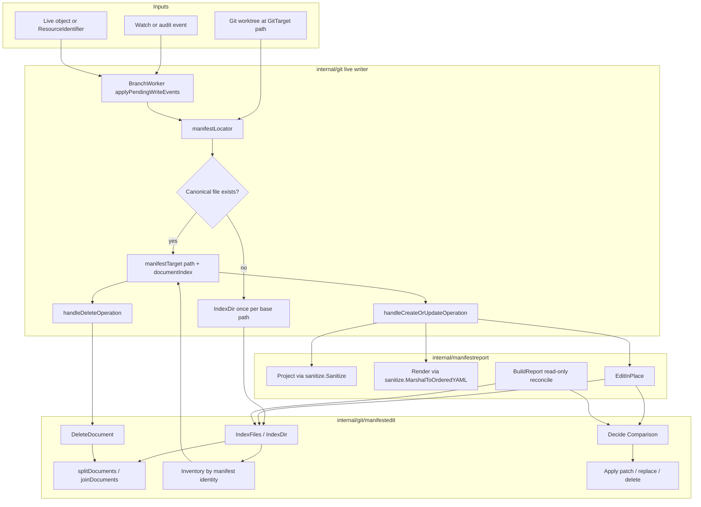
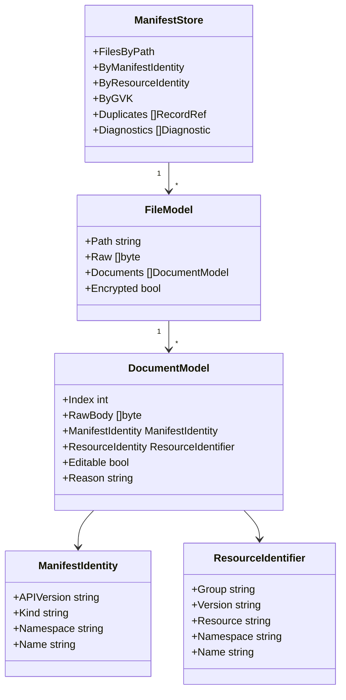

# Current Manifest Support Review

> Status: architecture review, captured 2026-06-04
> Related:
> [manifest-inventory-file-agnostic-placement.md](manifest-inventory-file-agnostic-placement.md),
> [manifestedit-abstraction-plan.md](manifestedit-abstraction-plan.md),
> [manifestedit-writer-followups.md](manifestedit-writer-followups.md),
> [`internal/git/manifestedit/DECISION.md`](../../../internal/git/manifestedit/DECISION.md)

## Summary

The current manifest support is part-way through the move from path-derived
storage to content-derived placement.

The good news: the low-level manifest editor already understands multi-document
YAML, can patch or delete one document without rewriting siblings, and has a
clear comparison API. The writer also now does match-first placement for updates
and object-backed deletes, so a manifest moved away from the generated path can be
updated in place.

The awkward part: production writes are still event-driven and file-by-file. The
writer materializes an inventory only as a locator sidecar, not as the central
state model for the batch. That leaves deletion, duplicate cleanup, GVK/GVR
lookups, multi-document safety, and status/reporting spread across several
places.

The recommended direction is to make the inventory the primary in-memory model:
scan the GitTarget path once, materialize every valid file/document/resource,
resolve watched GVKs to GVRs, then plan creates, updates, and deletes against
that model.

## Current Architecture

## How It Works Today

`manifestedit` is the lowest-level mechanism. It scans YAML files, splits
multi-document files with a byte-preserving splitter, derives manifest identity
from `apiVersion`, `kind`, `metadata.namespace`, and `metadata.name`, detects
duplicates, and exposes `Decide` / `Apply` for a single existing document.

`manifestreport` is the integration layer. It supplies policy that
`manifestedit` intentionally does not own: the sanitized Git projection and the
canonical renderer. `BuildReport` already compares an inventory to a desired
object set, but it is read-only. `EditInPlace` is used by the live writer as a
helper for formatting-preserving updates.

The live writer in `internal/git/git.go` still processes events one at a time.
For each batch it creates a `manifestLocator`, which can scan the GitTarget path
once per base path and cache the resulting `manifestedit.Inventory`. Location is
match-first: if the canonical generated file exists, use it; otherwise scan the
inventory and find the existing document by manifest identity. If nothing is
found, create at the generated path.

Deletes call `manifestedit.DeleteDocument`, so deleting from a multi-document
file removes only the targeted document and deletes the file only when no
documents remain.

## Key Code Paths

- [`internal/git/manifestedit`](../../../internal/git/manifestedit) owns YAML
  splitting, inventory, comparison, in-place patching, and per-document deletion.
- [`internal/manifestreport`](../../../internal/manifestreport) supplies the
  sanitizer/renderer policy and exposes the read-only report plus `EditInPlace`.
- [`internal/git/git.go`](../../../internal/git/git.go) owns the production
  locator, create/update handling, and delete handling.
- [`internal/git/commit_executor.go`](../../../internal/git/commit_executor.go)
  creates one `manifestLocator` per pending write batch.
- [`internal/types/identifier.go`](../../../internal/types/identifier.go) defines
  the GVR-based `ResourceIdentifier` used by events and generated paths.

## What Works Well

- The low-level YAML document support is stronger than the writer shape around
  it. `splitDocuments` / `joinDocuments` preserve sibling document bytes, and
  `DeleteDocument` handles per-document deletion.
- `manifestedit.Decide` and `Apply` have the right conceptual split: preflight is
  pure, application reparses and validates a snapshot before mutating bytes.
- The mechanism/policy boundary is mostly healthy. Sanitization and canonical
  rendering live in `manifestreport`, while `manifestedit` stays focused on YAML
  and manifest identity.
- Match-first placement is the right invariant for existing repositories: update
  where the manifest already lives, and use generated placement only for new
  resources.
- Duplicate detection already exists in the inventory, with deterministic
  first-occurrence-wins behavior.
- Multi-document data-loss prevention exists in the live writer: if an in-place
  edit cannot be applied to a multi-doc file, the writer refuses the unsafe
  wholesale fallback instead of dropping sibling documents.

## Cons And Gaps

- The inventory is not the source of truth for the writer. It is a locator cache
  used opportunistically after a canonical-path stat fast path.
- DELETE placement is still incomplete when delete events only carry GVR/name and
  no live object. The inventory is keyed by GVK/name, so moved manifests cannot be
  found unless the delete event includes manifest identity or the writer can map
  GVR to GVK.
- Duplicate cleanup is report-only. The inventory can find duplicate losers and
  `BuildReport` can classify them as deletes, but the writer does not yet prune
  them.
- GVK and GVR are still split across layers. `manifestedit.Identity` is GVK-based;
  `types.ResourceIdentifier` and watch events are GVR-based; there is no central
  model that records both and indexes both.
- Multi-document support is real in `manifestedit`, but not first-class in the
  writer. The writer still starts from "event -> target file" and then guards
  against multi-doc hazards, instead of planning against documents as primary
  entities.
- Semantic no-op detection in the writer canonicalizes YAML as a single object.
  That is useful for generated one-object files, but it is not a complete
  multi-document comparison model.
- Encrypted manifests are intentionally not patchable in place. That is a good
  safety rule, but it means the inventory must distinguish "authoritative
  location" from "editable content" everywhere.
- The current scan cache is per write batch. That avoids O(events x tree), but it
  is still not an incrementally maintained repository model.

## Recommended Direction

Move to a fully materialized in-memory manifest model per GitTarget path.

This rests on one strong, non-negotiable conviction: **the API is the source of
truth.** The GitTarget folder is a materialized projection of the watched API
resources, not a repository the writer merely edits alongside. Everything below —
including the decision to prune KRM that is not watched — follows from that
conviction.

The store should be built once from the checked-out commit/worktree snapshot, then
used by the batch planner:

1. Scan all YAML files under the GitTarget path.
2. Split every file into document models.
3. Derive manifest identity for valid KRM documents.
4. Resolve manifest GVK to watched GVR using the watch/catalog/RESTMapper layer.
5. Populate indexes by manifest identity, resource identity, and GVK.
6. Compare desired live resources against the store.
7. Produce a plan: create, patch, whole-replace, delete document, delete file,
   prune duplicate loser, skip.
8. Apply the plan to the in-memory file models.
9. Flush changed files and staged deletions to the worktree.

## Why This Fits The Requirements

Multiple manifests in one file become normal because the unit of planning is a
document record, not a generated file path.

Deletion becomes less special. A delete plan targets a `RecordRef`, and the file
model decides whether removing that document leaves a file to rewrite or a file
to delete.

GVK lookups become cheap because the store owns explicit indexes. GVR lookups also
become cheap once each record carries both manifest identity and resolved resource
identity.

Duplicate handling becomes an ordinary plan step. Duplicate losers can be pruned
before broader orphan pruning because the authoritative copy remains.

Status and diagnostics become bounded summaries of the store and plan, instead of
being re-derived in multiple layers.

## Implementation Recommendations

- Promote `manifestedit.Inventory` from a locator helper into a richer
  `ManifestStore` owned by the writer or a new integration package. Keep
  `manifestedit` as the YAML mechanism underneath it.
- Add a manifest identity field to delete events, or resolve GVR to GVK before
  writing. Prefer attaching the identity in the reconcile layer when possible; it
  keeps RESTMapper concerns out of the Git writer.
- Add a resource-identity index beside the existing manifest-identity index. The
  writer should locate watched resources by `ResourceIdentifier`, while retaining
  GVK for YAML fidelity and diagnostics.
- Turn duplicate-loser pruning into the first write-side prune feature. It has a
  lower safety risk than pruning API-absent resources because one authoritative
  copy remains. This applies only to duplicates the controller produced; for
  duplicates found when first adopting a folder, see the acceptance checks below,
  which fail the GitTarget instead of pruning.
- Make the batch planner operate on the materialized store, then flush once. This
  avoids repeated disk reads, avoids stale per-event assumptions, and gives a
  single place to update document indexes after deletions.
- Keep the current safety rules: no in-place edits for SOPS documents, no
  wholesale replacement of a multi-document file when the target document cannot
  be edited safely, and no orphan pruning until the initial-reconcile prune hazard
  has a deliberate gate. Scan mode (see below) is that gate: pruning of unwatched
  KRM and orphans is armed only after the dry-run plan has been made reviewable.
- Keep creation placement as policy above the editor. The materialized model
  should answer "does this resource already exist?" and "where is it?"; a separate
  placement policy should answer "where should a new resource go?"

## Acceptance Checks On First Materialization

When a GitTarget path is materialized for the first time — an empty or
never-before-reconciled target whose existing files we are adopting, not state
the controller produced — the store should run **acceptance checks before it is
allowed to become the planning model**, and fail the GitTarget loudly when they
do not pass. The guiding rule: we cannot fix everything, and trying to be clever
about ambiguous human-authored content is more dangerous than refusing it.

The first such check is **duplicate manifest identities**. If the initial scan
finds two or more documents that resolve to the same `ManifestIdentity`
(`apiVersion` + `kind` + `namespace` + `name`), the GitTarget should error out
with a diagnostic naming the colliding files/documents, rather than silently
picking a winner. We genuinely do not know which copy the author intended, and
guessing risks deleting the one they cared about.

Note this is deliberately keyed on full manifest identity, not on GVK alone.
Many resources of the same kind (several `Deployment`s, several `ConfigMap`s)
are normal and must pass. Only same-identity collisions are rejected.

This is intentionally narrower than, and in tension with, the duplicate-loser
pruning recommended above — so the distinction is **who created the ambiguity**:

- Duplicates the controller itself produced (path collisions, re-materialization
  of an already-managed target) remain safe to prune, because one authoritative
  copy is known to exist and the rest are our own leftovers.
- Duplicates already present when we first adopt a human-authored folder are an
  authoring decision we cannot disambiguate. These must fail the acceptance
  check, not trigger pruning.

The second check is **unrecognized files**. The hard question is what to do with
files in the folder that are not watched resources. Lumping them into one
"unrecognized" bucket is the trap; they have very different danger levels, so the
store should classify every file into one of four buckets:

1. **Non-YAML files** (`README.md`, `.gitignore`, scripts, images): ignored
   entirely. Never read, never planned, never pruned. No ambiguity.
2. **YAML that is not KRM** (no `apiVersion` + `kind`, or not a Kubernetes-shaped
   object — a CI config, a loose values blob): the genuinely dangerous unknown.
   We cannot model it and cannot reason about whether mutating the folder is safe.
3. **Valid KRM, watched GVK**: the managed happy path — fully modeled and planned.
4. **Valid KRM, unwatched GVK** (a CRD we do not watch, or a build directive such
   as `kustomization.yaml`, which is itself KRM): recognizable, but it has no
   matching watched resource in the API.

The **starter requirement** is to define *recognized = parses as KRM* and to
fail the GitTarget when any YAML file falls in bucket 2. This is the same
"do not be clever about ambiguous content" stance as the duplicate gate: a YAML
blob we cannot even classify is a reason to stop, not to guess. Non-YAML files
(bucket 1) are always ignored and never cause failure.

Within the recognized set, watched and unwatched KRM are treated differently, and
here the guiding conviction is decisive: **the API is the source of truth.** The
GitTarget folder is a projection of the watched API resources, not an independent
repository we merely edit around.

- **Watched (bucket 3)** is managed and planned against live API state.
- **Unwatched (bucket 4) is pruned.** A KRM document with no corresponding
  watched API resource is an orphan relative to the source of truth, and the
  projection should not carry it. We deliberately choose pruning over the
  safer-looking "leave it inert" option, because keeping unmanaged manifests
  around quietly reintroduces a second, drifting source of truth — exactly what
  this design exists to remove.

This is intentionally aggressive, and it has a sharp edge worth naming: build
directives like `kustomization.yaml` are KRM but never appear in the API, so a
literal application of the rule deletes them. That is acceptable for a pure
projection, but if a GitTarget is meant to stay Flux-consumable, those kinds need
a small explicit allowlist of non-API KRM that is exempt from pruning. The safety
net for all of this is scan mode (below): the destructive consequences are made
visible before any write happens, so we can let the prune policy evolve in the
open rather than guessing at it up front.

Implementation notes:

- Run acceptance checks as a distinct step between "build the store" and "use it
  as the planning model", so a failing GitTarget never proceeds to create/update/
  delete planning with an ambiguous model.
- Surface the failure through GitTarget status/diagnostics with enough detail
  (offending identity + file paths) for a human to resolve it, then re-reconcile.
- Treat the check list as extensible. Duplicate identity and unrecognized
  (non-KRM) YAML are the first two gates; others (for example, malformed KRM in
  an adopted folder) can join the same pre-planning acceptance phase later.

## Adoption Policy: Refuse, Scan, Or Prune

The source-of-truth conviction says git must not carry resources the API does not
have. But there is more than one safe way to *enforce* that, and the right one
depends on how much the operator trusts the writer with a given GitTarget. This
should be a **setting**, not a hardcoded behavior:

- **`refuse` (safest, good default for first materialization).** If a directory
  is materialized for the first time and already contains KRM with no matching
  watched API resource, do not touch anything — fail the GitTarget with a
  diagnostic listing the offending files. This is annoying, and that is the
  point: it forces a human to look before the writer ever deletes. It honors the
  conviction by refusing to *accept* a divergent state at all, rather than by
  silently reconciling it away.
- **`scan` (dry-run).** Report what would change, write nothing. See the next
  section.
- **`prune`.** Actively reconcile by deleting orphans, per the conviction. This
  is the most automated and the most destructive; it should be opt-in and, on
  first materialization especially, only after a scan has been reviewed.

Refuse and prune are two remediations of the *same* rule — git diverging from the
API is unacceptable — differing only in whether we stop or delete. Defaulting to
refuse means a surprising folder costs an operator a manual acknowledgement, not
a destroyed file; prune can be enabled per GitTarget once the operator trusts the
projection.

## Scan Mode (Dry-Run)

Because the source-of-truth conviction makes the writer willing to prune, the
writer must be able to show its hand before it is trusted with write access. Scan
mode is a dry-run that builds the store, runs the acceptance checks, and computes
the full plan — creates, updates, whole-replaces, document deletes, file deletes,
and orphan/unwatched prunes — but stops before flushing anything to the worktree.
Instead it reports what it *would* do if given write rights.

This is the deliberate gate the existing safety rules ask for: no orphan pruning
until the initial-reconcile prune hazard has an explicit, reviewable gate. Scan
mode is that gate. It matters most on first materialization, where the prune set
can be large and a mistake is destructive — it lets a human see "I am about to
delete these N files" before any of them are touched.

It also falls out naturally from the plan-then-flush architecture: the plan is
already a first-class value, so scan mode is simply "compute the plan, render it,
do not flush". The same plan rendering doubles as the human-facing diff and as
the basis for status/diagnostics, and it is where the prune policy (including the
`kustomization.yaml` allowlist question) can evolve safely before it is armed.

## Standalone Analyzer CLI

The same machinery that builds the store, classifies files, runs the acceptance
checks, and renders a plan is valuable on its own, outside the controller: a small
CLI that analyzes any existing folder of manifests. Anyone could point it at a
directory and learn what we would learn — duplicate identities, multi-document
files, KRM vs. non-KRM YAML, the GVK inventory, and (given cluster access) what
would be created, updated, or pruned. That is useful for auditing a repo before
adopting it, for debugging a GitTarget, and as a low-stakes way to exercise the
core logic.

> **POC status (2026-06-04).** The first slice of this exists:
> [`internal/manifestanalyzer`](../../../internal/manifestanalyzer) is the
> runtime-independent library, and
> [`cmd/manifest-analyzer`](../../../cmd/manifest-analyzer) is the CLI. It does
> the read-only, structure-first half, with **no cluster involved**: walk an
> `fs.FS`, classify every file (non-yaml, empty, invalid-yaml, non-krm, krm),
> detect duplicates, build a bounded summary, report the inventory of every GVK
> found, and emit acceptance issues — in text or JSON. `--policy refuse` makes
> any acceptance issue a non-zero exit, prototyping the refuse adoption mode.
>
> Deliberately deferred: comparing those GVKs against a live API to decide what
> is *watched / unwatched / orphaned*. An early version had a `--watched` flag and
> an injected "watch source", but we pulled it back to "just report all found
> GVKs" to keep the POC simple and to avoid committing to a name ("watched" may
> not be the right word) before there is a real cluster-backed source. So the
> remaining work is: an API source (cluster/snapshot) and the name for it, the
> watched/unwatched/orphan comparison, the plan/prune computation, and wiring the
> same library into the live writer.
>
> Running it against `config/samples` already surfaced a real constraint:
> `manifestedit` derives manifest identity from a concrete `metadata.name`, so a
> `generateName`-only object (`commitrequest.yaml`) is classified non-KRM. That
> is correct given today's identity rules and is exactly the kind of gap the
> analyzer is meant to make visible.

This is not just a nice extra; it imposes useful constraints on the software
design, and those constraints push in exactly the direction the rest of this
review already wants:

- The store, classification, acceptance checks, planner, and renderer must be a
  **library with no hard dependency on the controller runtime** (no manager, no
  informers, no reconcile loop). The controller and the CLI both become thin
  callers of that library.
- **"What is in the API" must be an injectable source**, not an ambient global.
  Back it with live informers in the controller, a kubeconfig-backed client in
  the CLI, a static snapshot in tests, or nothing at all for structure-only
  analysis (duplicate detection, parse validity, and GVK inventory all work with
  no cluster). The set of watched GVKs is likewise an input, not a constant.
- **Filesystem access must be abstracted** so the same code runs against a git
  worktree (controller) and an arbitrary directory (CLI).
- The **analysis path must be strictly read-only and side-effect-free**; writing
  is a separate capability layered on top, never entangled with analysis. This is
  also what makes `scan` mode trivial to expose in both contexts.
- **Plan/diagnostic rendering should be reusable** as controller status, as
  CLI human-readable output, and as a machine-readable (JSON) form.

In short, building the analyzer forces the mechanism / policy / runtime
separation this document argues for anyway, and it gives that separation a second
real consumer to keep it honest.

## Suggested Phases

> Implementation note: rather than treating the analyzer CLI as the final phase,
> we built its read-only core *first* (phase 9's first slice, see the POC note
> above) to prove the runtime-independent library shape. The phases below now rest
> on that foundation — phases 2, 3, and 6 reuse the same library — so the list is
> ordered by dependency, not by the order the work was started.

1. Extend the current inventory record to carry optional resolved
   `ResourceIdentifier`, plus GVK/GVR diagnostics.
2. Build a `ManifestStore` wrapper around `IndexDir` for one GitTarget path and
   use it inside the live writer instead of `manifestLocator`. Keep it as a
   controller-runtime-independent library from the start, with the API source and
   watched-GVK set as injected inputs — this is what later enables the CLI.
3. Add the first-materialization acceptance phase: the duplicate-identity gate and
   the non-KRM-YAML gate (both failing before planning), plus the `refuse`
   adoption-policy default that fails a first-time directory containing unwatched
   KRM rather than deleting it.
4. Change delete planning to use manifest identity or resolved resource identity,
   closing the moved-manifest delete gap.
5. Replace the event-by-event write loop with plan-then-flush, making the plan a
   first-class value (prerequisite for scan mode).
6. Add scan mode: render the full plan, including prospective prunes, without
   flushing. This must land before any write-side prune is armed.
7. Apply duplicate-loser pruning through the same per-document delete path (for
   controller-produced duplicates only).
8. Arm the `prune` adoption mode for unwatched KRM and orphans, honoring the
   source-of-truth conviction, opt-in and gated behind scan-mode review.
9. Ship the standalone analyzer CLI on top of the same library, with an
   injectable API source (cluster, snapshot, or none for structure-only checks).
   *First slice done:* read-only classification, summary, GVK inventory,
   duplicate/non-KRM acceptance issues, and text/JSON output — structure-only, no
   cluster. Remaining: the API source (and its name), the watched/unwatched/orphan
   comparison, and plan/prune output.
10. After that is stable, consider longer-lived inventory caching across batches.

## Bottom Line

The low-level abstractions are close: `manifestedit` is a good mechanism layer.
The higher-level writer abstraction is the part that still feels off. It treats
the inventory as an optimization for finding a file, when it should become the
actual model of the GitTarget's manifests.

Moving to a materialized in-memory model should make multi-document files,
deletes, duplicate cleanup, and GVK/GVR lookups simpler rather than a set of
special cases around generated paths.
