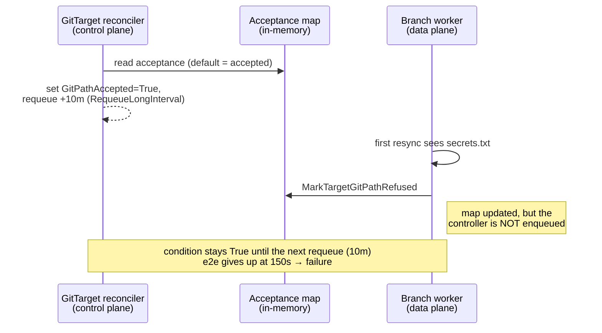
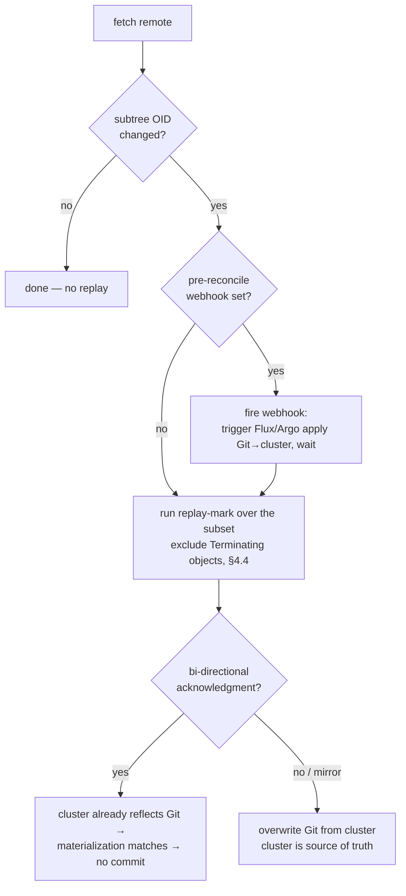

# GitPathAccepted projection race + the external-git-drift reconcile gap

This document records two related defects discovered from a single CI failure.

1. A **race** that lets a GitTarget's `GitPathAccepted` condition lag the actual
   data-plane refusal by up to 10 minutes — the proximate cause of the CI flake.
2. A **deeper, pre-existing gap**: when something changes the Git repo
   out-of-band (an external push, a human deleting files), nothing re-runs the
   path's reconcile to bring it back in line with the cluster, even though the
   cluster (kube-api) is the source of truth.

It follows the house style: **raw facts first**, then interpretation, then what
is and is not the cause, then the design direction.

---

## 1. Facts and observations (no interpretation yet)

> **Update (2026-07-07, secret-value-retention):** §1 is a point-in-time snapshot of the
> code at investigation time. Two facts below have since changed. (1) The GitTarget
> control-plane **Secret watch was removed**, so `SetupWithManager` now watches
> `GitProvider`, `WatchRule`, and `ClusterWatchRule` — not `Secret` (§1.5). (2) The
> `RequeueShortInterval`/`RequeueLongInterval` split (2 min / 10 min) collapsed into a single
> 5-minute `RequeueSteadyInterval`, so the happy-path GitTarget reconcile requeues after
> **5 minutes, not 10** (§1.5, §2). The projection-race analysis and its GitPath-channel fix
> are otherwise unaffected. See
> [`../../security-model.md`](../../security-model.md).

### 1.1 The failure

CI run [`28331751067`](https://github.com/ConfigButler/gitops-reverser/actions/runs/28331751067)
on branch `investigate` (head `a555d9d`) failed on **attempt 1** and passed on the
**re-run (attempt 2)**.

- Of all jobs, only **E2E (full)** failed. Build, Unit tests, Lint, Helm, and
  **E2E (quickstart)** all passed.
- Within E2E (full): **51 Passed | 1 Failed | 0 Pending | 8 Skipped**.
- The one failing spec:

  > **Manager Foreign Content Refusal → "refuses a loose foreign file without
  > writing"** — `test/e2e/foreign_content_e2e_test.go:104`

- The assertion that timed out (`waitForGitTargetGitPathRefused`, defined in
  `test/e2e/unsupported_folder_e2e_test.go:161`):

  ```
  [FAILED] Timed out after 150.000s.
  GitPathAccepted must be False for an unsupported path
  Expected
      <string>: True
  to equal
      <string>: False
  ```

  The condition stayed `True` for the full 150 s.

### 1.2 The operator DID detect the foreign file

The controller logs for the GitTarget `foreign-content-dest` show the refusal was
correctly detected on the data plane, at `2026-06-28T18:37:07Z`:

```
logger=event-router
msg="per-type reconcile refused: unsupported GitTarget path content"
gitDest="1782671468-test-manager-foreign-content/foreign-content-dest"
detail="Git path refused at secrets.txt: foreign file secrets.txt is not a
        managed manifest; remove it or name it in .gittargetignore"
```

So the refusal logic worked. The failure is purely that this refusal never
reached the GitTarget's **status condition**.

### 1.3 No GitTargetReconciler reconcile ran during the test window

In the entire attempt-1 log there is exactly **one** `GitTargetReconciler` line
mentioning `foreign-content-dest`, and it is the cleanup delete at
`18:39:37` ("GitTarget not found, was likely deleted"). No status-projecting
reconcile of that GitTarget ran between its creation (`18:37:07.697`) and its
deletion.

### 1.4 The repo looked empty at first contact

Immediately before the refusal was recorded, the GitProvider reconcile logged:

```
ts=2026-06-28T18:37:07Z msg="Repository is empty"
GitProvider={"name":"foreign-content-provider", ...}
```

The test seeds the foreign file at `18:37:07.089` and creates the GitTarget at
`18:37:07.697` — i.e. the seed push landed essentially at the same instant the
worker first looked at the repo.

### 1.5 Relevant code facts

- `GitPathAccepted` is written **only** by `GitTargetReconciler.Reconcile`, which
  reads the watch-manager's in-memory acceptance map and projects it:
  `internal/controller/gittarget_controller.go:220`
  (`gitPath = r.EventRouter.WatchManager.GitPathAcceptanceForGitTarget(gitDest)`),
  then `applyDataPlaneConditions(&target, streams, gitPath)`.
- The refusal is recorded on the data plane by
  `EventRouter.handleScopedResyncError` →
  `WatchManager.MarkTargetGitPathRefused` (`internal/watch/event_router.go:274`).
  That method **only mutates the in-memory map and returns**
  (`internal/watch/git_path_acceptance.go:29`). It does **not** enqueue the
  GitTarget for reconciliation.
- `GitTargetReconciler.SetupWithManager` watches only `Secret`, `GitProvider`,
  `WatchRule`, and `ClusterWatchRule`
  (`internal/controller/gittarget_controller.go:966`). There is **no** channel /
  `source.Channel` by which the data plane can poke the controller when
  acceptance changes.
- Requeue intervals (`internal/controller/constants.go`):
  - `RequeueStreamSettleInterval = 10 * time.Second`
  - `RequeueShortInterval = 2 * time.Minute`
  - `RequeueLongInterval = 10 * time.Minute`
- On the happy path (streams running **and** path currently accepted), the
  reconcile returns `RequeueAfter: RequeueLongInterval`
  (`internal/controller/gittarget_controller.go:238`). Only if
  `!gitPath.Accepted` (or streams not yet running) does it use the 10 s settle
  interval (`...:235`).

---

## 2. Interpretation: the projection race

`GitPathAccepted` is the projection of an **asynchronous, in-memory** fact (the
data-plane acceptance map) onto a **reconcile-driven** status field. Two
goroutines run without a handshake:

- **Control plane** — `GitTargetReconciler` reads the acceptance map at reconcile
  time and writes the condition, then schedules its next wake-up.
- **Data plane** — the branch worker, on its first write/resync attempt, hits
  `AcceptanceRefusedError` and records the refusal in the map.

The condition is therefore correct **only if the reconcile reads the map after
the data plane has written the refusal into it.** There is no mechanism forcing
that ordering.

What happened in this run (§1.2–§1.4):

1. The seed push landed at the same instant the worker first prepared the branch,
   which still saw "Repository is empty" (§1.4).
2. The GitTarget reconcile ran, read the acceptance map, found the **default**
   (`Accepted: true` — see `GitPathAcceptanceForGitTarget`,
   `internal/watch/git_path_acceptance.go:60`), set `GitPathAccepted=True`, and —
   because streams were running and the path "accepted" — scheduled the **10 min**
   `RequeueLongInterval` (§1.5).
3. Moments later the branch worker's resync saw `secrets.txt`, raised
   `AcceptanceRefusedError`, and called `MarkTargetGitPathRefused` (§1.2). This
   updated the map but **did not** wake the controller (§1.5).
4. With the next reconcile 10 minutes out, the `False` projection never happened
   inside the test's 150 s window → timeout.



## 3. What is and is not the cause

- **It is not** a regression in the refusal logic. The gate fired correctly and
  named the offending file (§1.2). Had the test waited 10 minutes, it would have
  gone green on its own.
- **It is not** a pure test-timing artifact to be papered over with a longer
  timeout or `--flake-attempts`. The same lag is visible to a real operator
  watching `kubectl get gittarget`: a refused path can read `GitPathAccepted=True`
  for up to `RequeueLongInterval`.
- **It is** a missing edge in the event graph: data-plane acceptance changes do
  not enqueue the owning GitTarget. The condition is only as fresh as the next
  periodic requeue.

This corrects an earlier assumption (see
[e2e refusal/recovery note] in agent memory and
`reconcile-via-watchlist-mark-and-sweep.md`) that the **refusal** direction was
deterministic in e2e while only **recovery** was racy. Both directions are racy
for the same structural reason: the condition is a lazily-projected view of
data-plane state.

### 3.1 Minimal fix for defect 1

Give the data plane an edge into the controller. `MarkTargetGitPathRefused` and
`MarkTargetGitPathAccepted` should enqueue the owning GitTarget — e.g. a
`source.Channel` fed by the watch manager and wired in
`GitTargetReconciler.SetupWithManager`, emitting a `GenericEvent` for the
`gitDest` whenever its acceptance entry changes. The reconcile then re-reads the
map and projects the new value within one reconcile, not one `RequeueLongInterval`.

---

## 4. The deeper gap: external Git changes do not trigger a re-check

The race above is the symptom that surfaced in CI. The investigation exposes a
larger, pre-existing gap that the same enqueue plumbing should serve.

### 4.1 Fact: drift is detected but not acted on

- `BranchWorker.syncWithRemote` / `SyncAndGetMetadata` fetch the remote and
  compute `IncomingChanges` when the branch SHA moved
  (`internal/git/branch_worker.go:1389`, `:1414`; the flag is set in
  `internal/git/git.go:378` as `before != after`).
- The field is explicitly documented as actionable —
  `internal/git/types.go:86`:

  ```go
  IncomingChanges bool // SHA changed, requiring resource-level reconcile
  ```

- **But the only consumer just logs it** (`branch_worker.go:1414`, "Detected
  remote changes during sync"). No code path turns `IncomingChanges == true` into
  a re-run of the path's mark-and-sweep. The metadata is also cached for 30 s
  (`metadataCacheDuration`, `branch_worker.go:1359`), so even the detection is
  best-effort and reconcile-triggered, not push-triggered.

### 4.2 Why this matters: kube-api is the source of truth

The product's contract (see `reconcile-via-watchlist-mark-and-sweep.md`) is that
the Git folder is a **materialization** of the watched, in-scope cluster
resources. The cluster is authoritative. That means an out-of-band edit to the
repo is **drift to be corrected**, not input to be honored:

- A human (or another tool) **deletes** a managed manifest under the path. The
  resource still exists in the cluster, so the operator must **recreate** the file.
- A human **edits** a managed manifest. The operator must **overwrite** it back to
  the cluster-derived content.
- A human **drops a foreign file** (`secrets.txt`, the exact §1.2 case) into the
  path after it was already accepted. The path must **flip to refused**, just as it
  would on first contact.

Today none of these are corrected until the next event for an affected resource
happens to drive a per-type reconcile, or the (currently absent) drift action
fires. The "single consistent snapshot" guarantee the mark-and-sweep design buys
us on the *initial* reconcile is not re-established after external drift.

### 4.3 What a "replay-mark session" is, and when we need one

The full reconcile described in `reconcile-via-watchlist-mark-and-sweep.md` is:

```text
build managed model from worktree
open one streaming-list watch per tracked type
fold every initial ADD over the model       (mark touched)
wait for every type's initial-events-end bookmark
orphans = managed docs the stream never touched   (sweep)
plan = creates + updates + managed drops (orphans)
apply plan, flush dirty/deleted files once
```

This is the heavyweight operation we want to **avoid running needlessly**, but
**must run** whenever the on-disk reality may no longer match what we last wrote.
Two triggers should arm it:

- **acceptance change** (defect 1) — cheap, already in memory; just needs the edge.
- **external Git drift** (defect 2) — needs an efficient "did the relevant subset
  change?" check, because the remote SHA moving tells us *something* changed, not
  *whether it touched files we own*.

### 4.4 Terminating objects must not be re-materialized (membership rule)

A replay-mark session folds a streaming list-watch into the managed model. The
cluster will hand us objects that are **marked for deletion** (a non-nil
`metadata.deletionTimestamp`) but still present because finalizers have not yet
cleared. We are about to delete those ourselves — fast — so they are **not**
desired state and must not be folded in as members.

What exists today:

- The **live-event** path already applies a *deletion-as-intent* rule: an object
  carrying a `deletionTimestamp` renders as a DELETE, not an upsert
  (`internal/watch/target_watch.go:750`, `operationForLiveTargetWatchEvent`).
  `deletionTimestamp` is server-owned runtime metadata that `sanitize` strips
  (`internal/sanitize/sanitize.go:103`), so it is never desired state.

What is missing:

- The mark-and-sweep **membership predicate** in
  `reconcile-via-watchlist-mark-and-sweep.md` ("The Central Invariant") lists only
  *valid KRM* + *watched GVK* + *in-scope namespace*. It does **not** exclude
  Terminating objects. A replay/initial fold that takes the streaming ADD at face
  value would therefore **mark a Terminating object as a desired member and
  re-materialize its file**, only to delete it again moments later — churn at best,
  and a lingering file if the timing is unlucky.

**Rule to add:** a document is a member of the managed model iff, in addition to
the existing three conditions, its live object has **no `deletionTimestamp`**. A
Terminating object is treated as logically absent — exactly the live-event rule,
applied consistently in the replay fold so steady-state and replay agree. This
keeps the intent-tree invariant ("a file present means the resource is intended to
exist") true across both code paths.

---

## 5. Design options for the "do we need a replay-mark session?" check

The remote HEAD SHA is too coarse: a commit to an unrelated path on the same
branch (another GitTarget's subtree, a top-level `README`) moves the branch SHA
but must **not** trigger our path's expensive replay. We need a fast predicate
over **only the GitTarget's relevant file subset**. Three candidate mechanisms,
with trade-offs:

### Option A — partial content hash over the relevant subset

Maintain, per GitTarget, a hash of the materialized subset (e.g. a hash of the
sorted `(path, blob-oid)` pairs under the GitTarget's `path`, derived straight
from the Git tree without checking blobs out). After a fetch, recompute and
compare to the last value we wrote.

- **Pros:** cheap to compute from the tree object; no extra working copy; naturally
  scoped to the subset; stable and order-independent if we sort.
- **Cons:** must be kept in sync with what we *intended* to write (so a no-op
  external commit that reverts to our content correctly reads as "no drift"); needs
  care around `.gittargetignore` and allowlisted-but-unmaterialized files
  (`kustomization.yaml`) so they don't produce false drift.
- **Note:** Git already gives us a per-subtree identity for free — the **tree OID
  of the GitTarget's path** changes iff something under that path changed. That is
  arguably the cheapest "partial hash" and avoids us hashing blobs at all.

### Option B — dedicated working copy containing only the relevant subset

Use a sparse checkout / partial clone scoped to the GitTarget path, so the working
copy *is* the subset and any standard "is the tree dirty vs HEAD" check answers
the question.

- **Pros:** conceptually simple; smaller checkouts for huge repos; the diff is
  exactly the subset.
- **Cons:** more moving parts and disk per GitTarget; sparse-checkout edge cases;
  worker model currently shares one checkout per branch
  (`branch_worker.go`, repo path per remote), so this is a larger structural change.

### Option C — compare against the last-known-good tree we pushed

We already track `lastCommitSHA` per worker. Extend that to remember the
**subtree OID** (Option A's tree-OID idea) that we last pushed for each GitTarget.
On fetch, resolve the current subtree OID for the path; if it differs from the one
we pushed, the subset drifted → arm a replay-mark session for that GitTarget only.

- **Pros:** reuses existing fetch/metadata plumbing; O(1) comparison; precisely
  scoped; no extra checkout.
- **Cons:** need to persist/restore the per-GitTarget subtree OID across worker
  restarts (or accept a forced replay-mark on first sync after restart, which is
  safe but costs one heavyweight pass).

### Recommendation

Lead with **Option C built on the Git subtree OID** (a specific, near-free form of
Option A): on every fetch, resolve the tree OID of each GitTarget's `path` and
compare to the OID we last materialized. A mismatch arms exactly one replay-mark
session for that GitTarget. This is the cheapest correct predicate, scopes
naturally to the subset, and rides the metadata fetch we already do — at the cost
of one extra recorded OID per GitTarget and one forced replay after a cold start.

Defer Option B unless very large repos make full-branch checkouts a real cost.

---

## 6. Resolving drift: coordinate with the GitOps controller

Detection (§5) tells us the subset drifted. Resolution has two strategies, and the
right one depends on whether a GitOps controller (Flux / Argo CD) is in the loop.
This generalizes the "controlled acknowledgment step" already described in
`docs/bi-directional.md`.

- **Mirror mode — cluster is source of truth (safe default).** We re-run the
  replay-mark over the subset and overwrite Git from the cluster. A human edit or
  delete in Git is reverted; deleted-but-still-live files are recreated.

- **Bi-directional acknowledgment — let Flux/Argo apply the change.** Instead of
  reverting, let the GitOps controller apply the changed revision **into** the
  cluster. The change then flows back through our own watch; because Git already
  holds it, our materialization matches and we emit **no commit**. This closes the
  loop with the existing GitOps controller and avoids a revert war between two
  always-on writers (the exact instability `docs/bi-directional.md` warns about).

**Pre-reconcile webhook (optional, off by default).** On detecting a new subtree
hash, fire an outgoing webhook *before* running our replay-mark. That is the moment
to trigger `flux reconcile` / Argo refresh and wait for the GitOps controller to
apply Git→cluster first. By the time we fold the watch, the cluster already
reflects Git, so we neither fight it nor commit a redundant revert. The hook is
per-GitProvider/GitTarget; the safe default (audit-only / mirror) skips it.



## 7. Proposed direction (summary)

1. **Defect 1 (status freshness):** wire a `source.Channel` from the watch
   manager into `GitTargetReconciler.SetupWithManager`; have
   `MarkTargetGitPathRefused` / `MarkTargetGitPathAccepted` emit a `GenericEvent`
   for the affected `gitDest`. Removes the up-to-10-min lag and fixes the e2e
   flake at its root rather than via a longer timeout.
2. **Defect 2 (external drift):** make `IncomingChanges` actionable. On a fetch
   that moves the branch SHA, resolve the per-GitTarget subtree OID and, on
   mismatch, arm a single replay-mark session for that GitTarget (§5, Option C).
   This restores the cluster-is-source-of-truth contract for deleted/edited/foreign
   files added after initial acceptance.
3. **Membership (§4.4):** exclude objects with a `deletionTimestamp` from the
   replay-mark managed model, mirroring the live-event deletion-as-intent rule, so
   a Terminating object is never re-materialized.
4. **Coordination (§6):** prefer letting Flux/Argo apply external Git changes
   (bi-directional acknowledgment, no commit), with an optional pre-reconcile
   webhook to sequence "GitOps applies first, we reconcile after."
5. The unifying idea: **a change to data-plane reality (acceptance, or the on-disk
   subset) must enqueue the owning GitTarget**, instead of waiting for the next
   periodic requeue.

> **Status:** Defect 1 (the enqueue) is implemented — see
> `internal/watch/gitpath_events.go` and the `WatchesRawSource` wiring in
> `GitTargetReconciler.SetupWithManager`. Defects 2, §4.4, and §6 remain design.

## 8. Open questions

- Where should the per-GitTarget subtree OID live so it survives worker restarts
  without forcing a replay every restart? (Status subresource? In-memory with an
  accepted cold-start replay?)
- How does the subtree-OID check interact with `.gittargetignore` and
  retained-but-unmaterialized allowlisted files, so they never read as drift?
- Should an external-drift replay-mark be rate-limited / coalesced when many
  GitTargets share a branch that sees frequent unrelated commits?
- Does the per-type reconcile path already cover the "edited managed file" case
  well enough that drift handling only needs to worry about deletes and
  newly-introduced foreign files?
