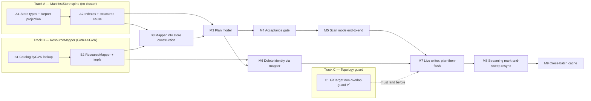

# Manifest Materialization — Implementation Plan

> Status: implementation plan, captured 2026-06-04
> Related:
> [current-manifest-support-review.md](current-manifest-support-review.md),
> [reconcile-via-watchlist-mark-and-sweep.md](reconcile-via-watchlist-mark-and-sweep.md),
> [gvk-gvr-mapping-layer.md](gvk-gvr-mapping-layer.md),
> [`internal/git/manifestedit/DECISION.md`](../../../internal/git/manifestedit/DECISION.md)

## What this document is

The three design docs above settle *what* we are building and *why*. This document
is the concrete *order*: PR-sized milestones, what each one touches, what it
unblocks, and how to know it is done. It is deliberately operational — read the
design docs for rationale, read this for sequencing.

Each milestone lists:

- **Depends on** — what must merge first.
- **Touches** — the real packages/files in play today.
- **Unblocks** — what becomes possible once it lands.
- **Done when** — the testable signal it is complete.

Validation follows [AGENTS.md](../../../AGENTS.md): for any non-docs
implementation change, `task lint`, `task test`, and `task test-e2e` must pass.
Run e2e sequentially after confirming Docker is available. Docs-only edits can use
the AGENTS markdown sanity-check exception. Milestones flagged **[runtime]** below
are the ones where e2e coverage is especially meaningful, but they are not the
only milestones that require the command.

## The shape of the work

Three **independent foundation tracks** run first and can proceed in parallel. They
**join at the Plan (M3)**, after which the path is mostly linear up to the live
writer cutover (M7) and the streaming resync (M8).

**Critical path:** A1 → A2 → B3 → M3 → M4 → M5 → M7 → M8.
**Parallelizable now:** Track A, Track B (B1→B2), and Track C are mutually
independent — three people, or three sittings, can start at once.

---

## Track A — the `ManifestStore` spine

The byte-free structure model. No cluster, no controller runtime, fully
unit-testable. This is the backbone everything else consumes. Seeded by the
existing [`internal/manifestanalyzer`](../../../internal/manifestanalyzer).

### A1 — Store types + `Report` as a projection

> **Status: ✅ landed** as a no-behavior-change refactor.
> `ManifestStore`/`FileModel`/`DocumentModel`/`RecordRef` live in
> [`internal/manifestanalyzer/store.go`](../../../internal/manifestanalyzer/store.go);
> `Analyze` builds the store and renders `Report` as a projection over it. The A1
> change itself kept CLI text+JSON output byte-identical and left the analyzer
> tests untouched. **A2 (below) then deliberately changes that report contract** —
> so the byte-identical property describes A1 in isolation, not the current tree.

- **Depends on**: nothing.
- **Touches**: new types in/beside `internal/manifestanalyzer`
  (`ManifestStore`, `FileModel`, `DocumentModel`, `RecordRef`); build them from the
  `manifestedit.IndexFiles` data that
  [`Analyze`](../../../internal/manifestanalyzer/analyzer.go) already produces;
  re-express [`Report`](../../../internal/manifestanalyzer/analyzer.go) as a
  projection over the store.
- **Unblocks**: A2, and gives the CLI/tests a safety net for the refactor.
- **Done when**: `Analyze` builds a `ManifestStore` and the existing
  `manifest-analyzer` CLI output (text + JSON) is unchanged — the `Report` is now
  rendered *from* the store. All current analyzer tests pass untouched.
- **Notes**: zero behavior change. This PR proves the store carries everything the
  report needed. `DocumentModel` is byte-free; `manifestedit.SnapshotRef`
  (already exists in
  [`decision.go`](../../../internal/git/manifestedit/decision.go)) is the lazy
  handle.

### A2 — Pointer indexes + structured cause, drop the old fields

> **Status: ✅ landed.** This milestone **intentionally changed the
> analyzer/report output contract**: `DocumentReport` dropped `Encrypted`/
> `Duplicate`/`Reason` in favour of a structured `Cause`, and duplicate identity
> moved out of the per-document report into diagnostics + acceptance issues
> (`IssueDuplicate`, `ManifestStore.IsDuplicate`). The duplicate collapse mirrors
> `manifestedit` exactly — identity-claiming documents (clean *and* encrypted)
> participate; disallowed-construct documents do not. The `ByResourceIdentity`
> index exists but stays empty until the mapper populates it (B3).

- **Depends on**: A1.
- **Touches**: `ManifestStore` indexes
  (`ByManifestIdentity`/`ByResourceIdentity`/`ByGVK` as `*DocumentModel` maps);
  replace `DocumentReport`'s `Encrypted` + `Duplicate` + `Reason string` with
  `Editable` + a structured `Cause` (sourced from `manifestedit` diagnostics, not
  message text); standardize on `schema.GroupVersionKind`.
- **Unblocks**: M3, B3.
- **Done when**: indexes are multi-valued during build and **collapse to
  single-valued** after the duplicate check, emitting a duplicate *diagnostic* for
  collisions (the analyzer's existing duplicate detection becomes exactly this).
  No classification reads a diagnostic message string.
- **Notes**: this is where the data-model decisions from the review land in code —
  encode them now while they are fresh.
- **Known transitional field — `DocumentModel.index`.** The target model derives a
  document's position top-down instead of storing it, but that only works when
  `FileModel.Documents` is the complete, contiguous document list. The
  pre-acceptance, structure-only analyzer legitimately sees non-managed documents
  (non-KRM / empty / invalid) interspersed between managed ones, so the
  managed-only slice cannot recover a document's true file position (and gap-filling
  breaks on the disallowed-construct case, where one index carries both a record and
  a diagnostic). The field is therefore retained through A2 and **dropped in M4**,
  once the acceptance gate refuses mixed files and guarantees managed files hold
  only managed documents. It is harmless in read-only analysis because no slice ever
  shifts.

---

## Track B — the `ResourceMapper`

The GVK↔GVR resolver. The review calls it a "build from the start, not retrofit"
dependency; it does not exist yet. Independent of Track A.

### B1 — Catalog `byGVK` + exact GVK lookup

> **Status: ✅ landed.** `byGVK[schema.GroupVersionKind][]APIResourceEntry` sits
> beside `byGVR` in [`api_resource_catalog.go`](../../../internal/watch/api_resource_catalog.go);
> `LookupGVK`/`LookupGVR` return a `CatalogLookup` carrying matched entries plus
> degraded/ready/generation trust state, so degraded discovery is reported, never
> treated as absence. Covered by
> [`api_resource_catalog_lookup_test.go`](../../../internal/watch/api_resource_catalog_lookup_test.go).

- **Depends on**: nothing.
- **Touches**: [`internal/watch/api_resource_catalog.go`](../../../internal/watch/api_resource_catalog.go)
  — add a `byGVK[schema.GroupVersionKind][]APIResourceEntry` index beside the
  existing `byGVR`, plus an exported exact-GVK lookup and generation-aware result.
- **Unblocks**: B2.
- **Done when**: catalog answers exact GVK→entry and GVR→entry; degraded/partial
  discovery is reported, not silently treated as absence; unit-tested.

### B2 — `ResourceMapper` interface + implementations

> **Status: ✅ landed.** The interface and runtime-independent impls live in the new
> [`internal/mapping`](../../../internal/mapping) package (`ResourceMapper`,
> `StructureOnlyMapper`, `StaticSnapshotMapper`, and the shared
> `ResolveGVK`/`ResolveGVR` reduction); the catalog-backed impl is
> [`watch.CatalogMapper`](../../../internal/watch/catalog_mapper.go). `mapping` does
> not import `watch`, so the analyzer can resolve without pulling in the watch
> manager. Naming note: the doc's `MappingResult`/`MappingStatus` are
> `mapping.Result`/`mapping.Status` in code (no-stutter lint); the `Mapping*` status
> constants kept their names.
>
> **Deferred within B2: `MapperSourceKubeconfig`.** Three of the four sources ship
> here — `live-catalog` (`watch.CatalogMapper`), `static-snapshot`, and
> `structure-only`. The kubeconfig source is a declared constant only; the
> kubeconfig-backed discovery mapper is the optional CLI "check this folder against
> this cluster" mode the mapping doc and Implementation Order (step 5) push to
> *later*. It is not needed by the controller (live-catalog) or tests
> (static-snapshot), so deferring it does not block B3/M3/M6.

- **Depends on**: B1.
- **Touches**: new `ResourceMapper` interface (per
  [gvk-gvr-mapping-layer.md](gvk-gvr-mapping-layer.md)) with `GVRForGVK` /
  `GVKForGVR` returning `mapping.Result` (whose `Status` is a `mapping.Status`); a
  **catalog-backed** impl (reads B1, never calls discovery directly), a
  **static-snapshot** impl for tests, and a **structure-only** impl returning
  `MappingStructureOnly`.
- **Unblocks**: B3, M3, M6.
- **Done when**: the three shipped `MapperSource`s (live-catalog, static-snapshot,
  structure-only) behave per the doc; expected lookup outcomes are statuses, not
  errors; static-snapshot fixtures make tests cluster-free. (`kubeconfig` is
  explicitly deferred — see status note above.)

### B3 — Wire the mapper into store construction

> **Status: ✅ landed.** `buildStore`/`BuildStore` now take a `context.Context` and
> an injected `mapping.ResourceMapper`
> ([`store.go`](../../../internal/manifestanalyzer/store.go),
> [`analyzer.go`](../../../internal/manifestanalyzer/analyzer.go)); a **nil mapper is
> normalized to structure-only**, so the analyzer's no-cluster promise holds. Each
> KRM document's GVK is resolved through `GVRForGVK`, the returned `mapping.Status`
> is recorded on `DocumentModel.Mapping`, and a `Resolved` lookup builds the
> `ResourceIdentity` (GVR + the manifest's namespace/name) and indexes it. The doc's
> transitional local `MappingStatus`/`MappingStructureOnly` were folded into the
> canonical `mapping.Status` now that Track B has landed.
>
> Judgment calls the plan left open: (1) `ByResourceIdentity` **collapses on the
> same first-occurrence winners as `ByManifestIdentity`**, so a resolved winner is
> reachable by either identity and duplicate losers never claim a slot; (2)
> "unresolved GVKs become diagnostics" is implemented as a `reasonUnresolvedMapping`
> `manifestedit.DiagReason` value **defined in `manifestanalyzer`, not added to
> `manifestedit`** — keeping the API-mapping concept out of the YAML-editing package
> while reusing its shared `Diagnostic` type; (3) the **mapper's scope is
> authoritative** — a `Resolved` cluster-scoped resource is keyed with no namespace,
> and a manifest that nonetheless sets `metadata.namespace` has it dropped for
> indexing plus a `reasonScopeMismatch` diagnostic (refusal is M4's call), so it is
> never indexed under a wrong namespaced key; (4) a **lookup that returns a Go error**
> (impl failure / cancelled context, never an expected outcome) is recorded as
> `MappingCatalogUnavailable` (the design's fail-closed bucket) with a `DiagError`,
> so an error never masquerades as intentional structure-only analysis. `Analyze`
> stays structure-only (passes nil), so its Report output is unchanged.

- **Depends on**: A2, B2.
- **Touches**: store builder takes an injected `ResourceMapper`; for each KRM
  document, resolve GVK→`ResourceIdentity` and populate `ByResourceIdentity`;
  unresolved GVKs become diagnostics; `MappingStatus` recorded per document.
- **Unblocks**: M3 (full), M4 (watched/unwatched classification).
- **Done when**: with a static-snapshot mapper, documents carry resolved
  `ResourceIdentity` + `MappingStatus`; with the nil/structure-only mapper the store
  still builds (no resource index), preserving the analyzer's no-cluster promise.

---

## Track C — topology guard (independent, cheap, land early)

### C1 — GitTarget non-overlap guard [runtime]

> **Status: ✅ landed.** Implemented as a **reconcile-time `Validated` gate**, not
> an admission webhook — this repo has no admission-webhook infrastructure and the
> rule fits the established status-condition pattern. It extends the GitTarget
> reconciler's existing `checkForConflicts` (which already rejected exact-path
> duplicates) to also reject ancestor/descendant nesting. An overlapping target
> goes `Validated=False` / `Ready=False`, reason `TargetConflict`, with a clear
> message, and writes nothing. The guard now fails closed if the controller cannot
> list peer GitTargets, so a cache/API list failure cannot silently pass the
> one-owner check.

- **Depends on**: nothing.
- **Touches**: `checkForConflicts` in
  [`gittarget_controller.go`](../../../internal/controller/gittarget_controller.go);
  segment-aware path helpers in
  [`gittarget_path_overlap.go`](../../../internal/controller/gittarget_path_overlap.go)
  (`gitTargetPathsOverlap` + a deterministic `gitTargetLosesConflict` tie-breaker);
  `git.IsValidTargetPath` in [`git.go`](../../../internal/git/git.go), which reuses
  the writer's `sanitizePath` so the guard and the write path agree on what a target
  may own.
- **Scope key**: overlap is evaluated within the same
  `(namespace, providerRef, branch)`, reusing the existing conflict scoping. Known
  gap: two GitTargets in different namespaces whose providers resolve to the *same*
  git URL are not yet detected — future work.
- **Unblocks**: the "one owner per folder" invariant that M7/M8 rely on — **must
  land before** the destructive writer/sweep.
- **Done when**: nested/equal paths are rejected (reconcile-time, `Validated=False`,
  reason `TargetConflict`) with a clear message; sibling paths pass; writer-invalid
  paths (absolute, `..`, backslash) are skipped and left to their own gate; ties on
  equal `creationTimestamp` are broken deterministically by identity; e2e covers
  accept + reject. ✅
- **Notes**: small and self-contained; landed before M7 as planned.
- **Review hardening**: `checkForConflicts` must treat GitTarget list failures as
  reconciliation errors, not "no conflict" results; this is covered by
  `TestCheckForConflicts_ListErrorFailsClosed`.

---

## The join and the linear tail

### M3 — Plan model

- **Depends on**: A2, B3.
- **Touches**: a first-class `Plan` / `PlanAction` (`create` / `patch` / `replace` /
  `delete-document` / `delete-file` / `drop-orphan` / `skip`), computed from
  `(ManifestStore, desired set, policy)`. Graduate
  [`manifestreport.BuildReport`](../../../internal/manifestreport/report.go) into
  this — it already does create/update/delete/skip read-only.
- **Unblocks**: M4, M5, M6.
- **Done when**: the plan is a pure function of its inputs, carries enough detail to
  render text/JSON/status without recomputation, and is unit-tested against
  static-snapshot fixtures. Duplicates and unwatched API KRM produce **no** plan
  action (they are acceptance facts); allowlisted non-API KRM produces none either.

### M4 — Acceptance gate

- **Depends on**: M3.
- **Touches**: a distinct step between "build store" and "use as planning model"
  implementing the five-bucket classification and the refuse rules (duplicate
  identity, non-KRM YAML, unwatched API-backed KRM, out-of-scope watched KRM, mixed
  managed/allowlisted files); allowlist for non-API KRM (retained, not a
  `FileModel`).
- **Unblocks**: M5, and gates M7/M8.
- **Done when**: refusal produces file-naming diagnostics and reconciles nothing; a
  clean folder passes; retained allowlisted files never enter `FilesByPath`.

### M5 — Scan mode end-to-end

- **Depends on**: M3, M4.
- **Touches**: one planner shared by the `manifest-analyzer` CLI and a controller
  dry-run path — build store, resolve API state when available, run acceptance,
  render the full plan, **write nothing**.
- **Unblocks**: human review of destructive plans; precondition for arming any
  flush.
- **Done when**: CLI renders the full plan (incl. managed drops) and refusals; same
  renderer feeds GitTarget status. **This must exist before M7/M8 enable deletes.**

### M6 — Delete identity via the mapper

- **Depends on**: M3, B2.
- **Touches**: resolve delete-event GVR/name → identity through the mapper in the
  planning layer; the writer deletes by `RecordRef`, never by a regenerated path.
- **Unblocks**: correct deletes for moved manifests in M7.
- **Done when**: a delete with only GVR/name targets the right document even when
  the manifest was moved off its canonical path.

### M7 — Live writer: plan-then-flush [runtime]

- **Depends on**: M5, M6 (and C1 landed).
- **Touches**: replace the event-by-event path with build-store → plan → apply →
  flush-once. **Deletes** (per the reconcile doc):
  `manifestLocator` / `inventoryFor` / `locate`,
  `applyEventToWorktree` / `handleCreateOrUpdateOperation` /
  `handleDeleteOperation` ([`git.go`](../../../internal/git/git.go)),
  `parseIdentifierFromPath` ([`helpers.go`](../../../internal/git/helpers.go)),
  `listResourceIdentifiersInPath` ([`branch_worker.go`](../../../internal/git/branch_worker.go)).
  **Keeps**: `manifestedit.Apply` / `DeleteDocument` as the per-document mechanism,
  `ResourceIdentifier.ToGitPath` as new-file placement.
  Introduce `PendingChanges` (per-event coalescing) and commit-boundary hydration.
- **Unblocks**: M8.
- **Done when**: the controller writes via plan-then-flush; the no-op/in-place/
  whole-replace decisions (`reconcileAgainstExisting`,
  `manifestsAreSemanticallyEqual`) survive as **plan decisions**; e2e green.
- **Notes**: the largest cutover. Land it behind scan review (M5) and the topology
  guard (C1).

### M8 — Streaming mark-and-sweep resync [runtime]

- **Depends on**: M7.
- **Touches**: the streaming-list watch (`sendInitialEvents`) folded over the
  managed model; set-difference orphan computation at the joined bookmark; the
  `LIST+WATCH` fallback behind the API source. **Deletes** the two-snapshot
  handshake and `FolderReconciler.findDifferences`
  ([`folder_reconciler.go`](../../../internal/reconcile/folder_reconciler.go),
  [`events.go`](../../../internal/events/events.go)).
- **Unblocks**: M9.
- **Done when**: initial reconcile/resync is one consistent snapshot; sweep gated on
  all bookmarks, aborts and drops nothing on a partial stream; e2e covers
  create+update+managed-drop at a pinned revision.

### M9 — Optimize after correctness

- **Depends on**: M8.
- **Touches**: longer-lived cross-batch caching of the structure index, keyed by
  checkout state + GitTarget path; rebuild on tip/branch/path change or
  non-incremental local flush.
- **Done when**: repeated batches reuse the cached header scan; invalidation is
  correct under the listed triggers.

---

## First three PRs (concretely)

1. **A1** ✅ — `ManifestStore`/`FileModel`/`DocumentModel`, `Report` as a
   projection. No behavior change; existing analyzer tests are the net.
2. **B1** ✅ — catalog `byGVK` + exact lookup. Tiny, isolated, unblocks the mapper.
3. **C1** ✅ — GitTarget non-overlap guard (reconcile-time `Validated` gate, not a
   webhook). Cheap, self-contained, locks the one-owner invariant in before anything
   destructive depends on it.

A2 ✅, B2 ✅, and B3 ✅ have followed; B3 joined the tracks (the store now builds
with an injected mapper), so **M3 is now unblocked** and begins the tail. C1 ✅
landed independently.
