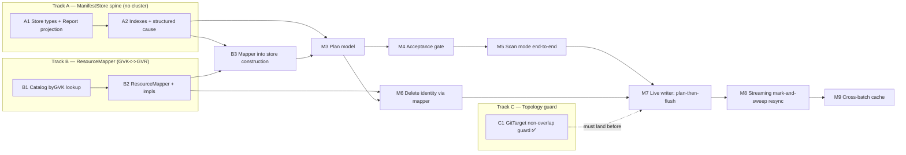

# Manifest Materialization — Implementation Plan

> Status: implementation plan, captured 2026-06-04
> Related:
> [current-manifest-support-review.md](current-manifest-support-review.md),
> [reconcile-via-watchlist-mark-and-sweep.md](reconcile-via-watchlist-mark-and-sweep.md),
> [gvk-gvr-mapping-layer.md](gvk-gvr-mapping-layer.md),
> [`internal/git/manifestedit/DECISION.md`](../../../internal/git/manifestedit/DECISION.md)

## What this document is

The three design docs above settle *what* we are building and *why*. This document
is the concrete *order*: PR-sized milestones, what each one touches, what it
unblocks, and how to know it is done. It is deliberately operational — read the
design docs for rationale, read this for sequencing.

Each milestone lists:

- **Depends on** — what must merge first.
- **Touches** — the real packages/files in play today.
- **Unblocks** — what becomes possible once it lands.
- **Done when** — the testable signal it is complete.

Validation follows [AGENTS.md](../../../AGENTS.md): for any non-docs
implementation change, `task lint`, `task test`, and `task test-e2e` must pass.
Run e2e sequentially after confirming Docker is available. Docs-only edits can use
the AGENTS markdown sanity-check exception. Milestones flagged **[runtime]** below
are the ones where e2e coverage is especially meaningful, but they are not the
only milestones that require the command.

## The shape of the work

Three **independent foundation tracks** run first and can proceed in parallel. They
**join at the Plan (M3)**, after which the path is mostly linear up to the live
writer cutover (M7) and the streaming resync (M8).

**Critical path:** A1 → A2 → B3 → M3 → M4 → M5 → M7 → M8.
**Parallelizable now:** Track A, Track B (B1→B2), and Track C are mutually
independent — three people, or three sittings, can start at once.

---

## Track A — the `ManifestStore` spine

The byte-free structure model. No cluster, no controller runtime, fully
unit-testable. This is the backbone everything else consumes. Seeded by the
existing [`internal/manifestanalyzer`](../../../internal/manifestanalyzer).

### A1 — Store types + `Report` as a projection

> **Status: ✅ landed** as a no-behavior-change refactor.
> `ManifestStore`/`FileModel`/`DocumentModel`/`RecordRef` live in
> [`internal/manifestanalyzer/store.go`](../../../internal/manifestanalyzer/store.go);
> `Analyze` builds the store and renders `Report` as a projection over it. The A1
> change itself kept CLI text+JSON output byte-identical and left the analyzer
> tests untouched. **A2 (below) then deliberately changes that report contract** —
> so the byte-identical property describes A1 in isolation, not the current tree.

- **Depends on**: nothing.
- **Touches**: new types in/beside `internal/manifestanalyzer`
  (`ManifestStore`, `FileModel`, `DocumentModel`, `RecordRef`); build them from the
  `manifestedit.IndexFiles` data that
  [`Analyze`](../../../internal/manifestanalyzer/analyzer.go) already produces;
  re-express [`Report`](../../../internal/manifestanalyzer/analyzer.go) as a
  projection over the store.
- **Unblocks**: A2, and gives the CLI/tests a safety net for the refactor.
- **Done when**: `Analyze` builds a `ManifestStore` and the existing
  `manifest-analyzer` CLI output (text + JSON) is unchanged — the `Report` is now
  rendered *from* the store. All current analyzer tests pass untouched.
- **Notes**: zero behavior change. This PR proves the store carries everything the
  report needed. `DocumentModel` is byte-free; `manifestedit.SnapshotRef`
  (already exists in
  [`decision.go`](../../../internal/git/manifestedit/decision.go)) is the lazy
  handle.

### A2 — Pointer indexes + structured cause, drop the old fields

> **Status: ✅ landed.** This milestone **intentionally changed the
> analyzer/report output contract**: `DocumentReport` dropped `Encrypted`/
> `Duplicate`/`Reason` in favour of a structured `Cause`, and duplicate identity
> moved out of the per-document report into diagnostics + acceptance issues
> (`IssueDuplicate`, `ManifestStore.IsDuplicate`). The duplicate collapse mirrors
> `manifestedit` exactly — identity-claiming documents (clean *and* encrypted)
> participate; disallowed-construct documents do not. The `ByResourceIdentity`
> index exists but stays empty until the mapper populates it (B3).

- **Depends on**: A1.
- **Touches**: `ManifestStore` indexes
  (`ByManifestIdentity`/`ByResourceIdentity`/`ByGVK` as `*DocumentModel` maps);
  replace `DocumentReport`'s `Encrypted` + `Duplicate` + `Reason string` with
  `Editable` + a structured `Cause` (sourced from `manifestedit` diagnostics, not
  message text); standardize on `schema.GroupVersionKind`.
- **Unblocks**: M3, B3.
- **Done when**: indexes are multi-valued during build and **collapse to
  single-valued** after the duplicate check, emitting a duplicate *diagnostic* for
  collisions (the analyzer's existing duplicate detection becomes exactly this).
  No classification reads a diagnostic message string.
- **Notes**: this is where the data-model decisions from the review land in code —
  encode them now while they are fresh.
- **Known transitional field — `DocumentModel.index` (resolved in M4: dropped).**
  The target model derives a document's position top-down instead of storing it, but
  that only works when `FileModel.Documents` is the complete, contiguous document
  list. The field was retained through A2/B3/M3 because the pre-acceptance,
  structure-only analyzer legitimately sees non-managed documents (non-KRM / empty /
  invalid) interspersed between managed ones. **M4 dropped it.** The fix was not to
  keep the field but to make the acceptance gate refuse any managed file that is not
  entirely valid KRM (the impure-managed-file rule = Non-Negotiable Decision #2), so
  an accepted file's managed documents are contiguous. Positions are recovered
  without the field by `reconstructManagedIndices`: every record-less document
  (empty / non-KRM / invalid) leaves a diagnostic at its position, so the managed
  documents fill the remaining positions in order. The `Analyze` report, the planner
  (`documentLocations`), and the acceptance gate's refusal messages all share this
  reconstruction, so each recovers the **true** file index even on a *non*-accepted,
  non-contiguous tree — a scan-mode plan over an impure file names the right document,
  not a misleading loop index.

---

## Track B — the `ResourceMapper`

The GVK↔GVR resolver. The review calls it a "build from the start, not retrofit"
dependency; it does not exist yet. Independent of Track A.

### B1 — Catalog `byGVK` + exact GVK lookup

> **Status: ✅ landed.** `byGVK[schema.GroupVersionKind][]APIResourceEntry` sits
> beside `byGVR` in [`api_resource_catalog.go`](../../../internal/watch/api_resource_catalog.go);
> `LookupGVK`/`LookupGVR` return a `CatalogLookup` carrying matched entries plus
> degraded/ready/generation trust state, so degraded discovery is reported, never
> treated as absence. Covered by
> [`api_resource_catalog_lookup_test.go`](../../../internal/watch/api_resource_catalog_lookup_test.go).

- **Depends on**: nothing.
- **Touches**: [`internal/watch/api_resource_catalog.go`](../../../internal/watch/api_resource_catalog.go)
  — add a `byGVK[schema.GroupVersionKind][]APIResourceEntry` index beside the
  existing `byGVR`, plus an exported exact-GVK lookup and generation-aware result.
- **Unblocks**: B2.
- **Done when**: catalog answers exact GVK→entry and GVR→entry; degraded/partial
  discovery is reported, not silently treated as absence; unit-tested.

### B2 — `ResourceMapper` interface + implementations

> **Status: ✅ landed.** The interface and runtime-independent impls live in the new
> [`internal/mapping`](../../../internal/mapping) package (`ResourceMapper`,
> `StructureOnlyMapper`, `StaticSnapshotMapper`, and the shared
> `ResolveGVK`/`ResolveGVR` reduction); the catalog-backed impl is
> [`watch.CatalogMapper`](../../../internal/watch/catalog_mapper.go). `mapping` does
> not import `watch`, so the analyzer can resolve without pulling in the watch
> manager. Naming note: the doc's `MappingResult`/`MappingStatus` are
> `mapping.Result`/`mapping.Status` in code (no-stutter lint); the `Mapping*` status
> constants kept their names.
>
> **Deferred within B2: `MapperSourceKubeconfig`.** Three of the four sources ship
> here — `live-catalog` (`watch.CatalogMapper`), `static-snapshot`, and
> `structure-only`. The kubeconfig source is a declared constant only; the
> kubeconfig-backed discovery mapper is the optional CLI "check this folder against
> this cluster" mode the mapping doc and Implementation Order (step 5) push to
> *later*. It is not needed by the controller (live-catalog) or tests
> (static-snapshot), so deferring it does not block B3/M3/M6.

- **Depends on**: B1.
- **Touches**: new `ResourceMapper` interface (per
  [gvk-gvr-mapping-layer.md](gvk-gvr-mapping-layer.md)) with `GVRForGVK` /
  `GVKForGVR` returning `mapping.Result` (whose `Status` is a `mapping.Status`); a
  **catalog-backed** impl (reads B1, never calls discovery directly), a
  **static-snapshot** impl for tests, and a **structure-only** impl returning
  `MappingStructureOnly`.
- **Unblocks**: B3, M3, M6.
- **Done when**: the three shipped `MapperSource`s (live-catalog, static-snapshot,
  structure-only) behave per the doc; expected lookup outcomes are statuses, not
  errors; static-snapshot fixtures make tests cluster-free. (`kubeconfig` is
  explicitly deferred — see status note above.)

### B3 — Wire the mapper into store construction

> **Status: ✅ landed.** `buildStore`/`BuildStore` now take a `context.Context` and
> an injected `mapping.ResourceMapper`
> ([`store.go`](../../../internal/manifestanalyzer/store.go),
> [`analyzer.go`](../../../internal/manifestanalyzer/analyzer.go)); a **nil mapper is
> normalized to structure-only**, so the analyzer's no-cluster promise holds. Each
> KRM document's GVK is resolved through `GVRForGVK`, the returned `mapping.Status`
> is recorded on `DocumentModel.Mapping`, and a `Resolved` lookup builds the
> `ResourceIdentity` (GVR + the manifest's namespace/name) and indexes it. The doc's
> transitional local `MappingStatus`/`MappingStructureOnly` were folded into the
> canonical `mapping.Status` now that Track B has landed.
>
> Judgment calls the plan left open: (1) `ByResourceIdentity` **collapses on the
> same first-occurrence winners as `ByManifestIdentity`**, so a resolved winner is
> reachable by either identity and duplicate losers never claim a slot; (2)
> "unresolved GVKs become diagnostics" is implemented as a `reasonUnresolvedMapping`
> `manifestedit.DiagReason` value **defined in `manifestanalyzer`, not added to
> `manifestedit`** — keeping the API-mapping concept out of the YAML-editing package
> while reusing its shared `Diagnostic` type; (3) the **mapper's scope is
> authoritative** — a `Resolved` cluster-scoped resource is keyed with no namespace,
> and a manifest that nonetheless sets `metadata.namespace` has it dropped for
> indexing plus a `reasonScopeMismatch` diagnostic (refusal is M4's call), so it is
> never indexed under a wrong namespaced key; (4) a **lookup that returns a Go error**
> (impl failure / cancelled context, never an expected outcome) is recorded as
> `MappingCatalogUnavailable` (the design's fail-closed bucket) with a `DiagError`,
> so an error never masquerades as intentional structure-only analysis. `Analyze`
> stays structure-only (passes nil), so its Report output is unchanged.

- **Depends on**: A2, B2.
- **Touches**: store builder takes an injected `ResourceMapper`; for each KRM
  document, resolve GVK→`ResourceIdentity` and populate `ByResourceIdentity`;
  unresolved GVKs become diagnostics; `MappingStatus` recorded per document.
- **Unblocks**: M3 (full), M4 (watched/unwatched classification).
- **Done when**: with a static-snapshot mapper, documents carry resolved
  `ResourceIdentity` + `MappingStatus`; with the nil/structure-only mapper the store
  still builds (no resource index), preserving the analyzer's no-cluster promise.

---

## Track C — topology guard (independent, cheap, land early)

### C1 — GitTarget non-overlap guard [runtime]

> **Status: ✅ landed.** Implemented as a **reconcile-time `Validated` gate**, not
> an admission webhook — this repo has no admission-webhook infrastructure and the
> rule fits the established status-condition pattern. It extends the GitTarget
> reconciler's existing `checkForConflicts` (which already rejected exact-path
> duplicates) to also reject ancestor/descendant nesting. An overlapping target
> goes `Validated=False` / `Ready=False`, reason `TargetConflict`, with a clear
> message, and writes nothing. The guard now fails closed if the controller cannot
> list peer GitTargets, so a cache/API list failure cannot silently pass the
> one-owner check.

- **Depends on**: nothing.
- **Touches**: `checkForConflicts` in
  [`gittarget_controller.go`](../../../internal/controller/gittarget_controller.go);
  segment-aware path helpers in
  [`gittarget_path_overlap.go`](../../../internal/controller/gittarget_path_overlap.go)
  (`gitTargetPathsOverlap` + a deterministic `gitTargetLosesConflict` tie-breaker);
  `git.IsValidTargetPath` in [`git.go`](../../../internal/git/git.go), which reuses
  the writer's `sanitizePath` so the guard and the write path agree on what a target
  may own.
- **Scope key**: overlap is evaluated within the same
  `(namespace, providerRef, branch)`, reusing the existing conflict scoping. Known
  gap: two GitTargets in different namespaces whose providers resolve to the *same*
  git URL are not yet detected — future work.
- **Unblocks**: the "one owner per folder" invariant that M7/M8 rely on — **must
  land before** the destructive writer/sweep.
- **Done when**: nested/equal paths are rejected (reconcile-time, `Validated=False`,
  reason `TargetConflict`) with a clear message; sibling paths pass; writer-invalid
  paths (absolute, `..`, backslash) are skipped and left to their own gate; ties on
  equal `creationTimestamp` are broken deterministically by identity; e2e covers
  accept + reject. ✅
- **Notes**: small and self-contained; landed before M7 as planned.
- **Review hardening**: `checkForConflicts` must treat GitTarget list failures as
  reconciliation errors, not "no conflict" results; this is covered by
  `TestCheckForConflicts_ListErrorFailsClosed`.

---

## The join and the linear tail

### M3 — Plan model

> **Status: ✅ landed.** The first-class `Plan` / `PlanAction` / `PlanActionKind`
> and the pure `BuildPlan(store, files, desired, policy)` live in
> [`internal/manifestanalyzer/plan.go`](../../../internal/manifestanalyzer/plan.go),
> graduating `manifestreport.BuildReport`'s read-only create/update/delete/skip into
> the materialized model. Covered by
> [`plan_test.go`](../../../internal/manifestanalyzer/plan_test.go) against the
> static-snapshot fixtures (patch, create, no-op, drop-orphan, encrypted skip,
> structure-only-never-drops, non-editable construct, injected projection, and
> missing-hydration).
>
> Judgment calls the plan left open: (1) **placement in `manifestanalyzer`, not a new
> package** — when M3 landed the planner read the transitional `DocumentModel.index`
> directly; M4 then **dropped that field** and the planner now reconstructs each
> document's true file position via `documentLocations` /
> `reconstructManagedIndices` (the record-less diagnostic gaps), keeping it in the
> same package as the store and the report it shares that reconstruction with;
> (2) **policy is injected** (`Policy{Project, EditOptions}`) so the
> planner stays a pure, dependency-light function — production wires
> `manifestreport.Project` / `EditOptions()` at the call sites, keeping the
> integration layer out of the structure library; (3) the planner **emits
> create/patch/replace/skip/drop-orphan**; `delete-document` / `delete-file` are
> defined as the apply vocabulary but realized mechanically at flush (M7), not
> emitted here — a managed drop is one `PlanDropOrphan` regardless of whether
> removing it empties the file; (4) a **no-op produces no action** (an in-sync
> resource is not a change) while a **skip is surfaced** (out of sync but not safely
> editable); (5) **`PlanDropOrphan` is gated on `mapping.MappingResolved`** — a
> watched, policy-allowed document absent from the desired set — so a structure-only
> store never drops, and disallowed/unserved KRM and unwatched API-backed KRM produce
> no plan action exactly as the acceptance contract requires; (6) **a duplicate
> identity collision suppresses actions for the whole identity — first-occurrence
> winner and losers alike** — because a duplicate refuses the entire GitTarget at
> acceptance (M4), so the planner must never edit or drop one arbitrary copy; (7)
> **`BuildPlan` is the full-snapshot "Resync" planner, not the steady-state one** —
> per the design's "Two Paths, One Plan Type"
> ([reconcile-via-watchlist-mark-and-sweep.md](reconcile-via-watchlist-mark-and-sweep.md)),
> it mark-and-sweeps (every watched document absent from `desired` is a managed drop),
> so `desired` is the **complete** `[]DesiredResource{Resource, Object}` snapshot, never
> a partial batch. Each entry carries the API-side `ResourceIdentifier` the controller
> resolved from the GVR it watched, so a `create` carries everything
> `ResourceIdentifier.ToGitPath` needs to place a new file at apply time (M7) with no
> re-resolution. A nil `Object` is an **ignored malformed entry, not a delete
> tombstone** — a lone tombstone in a sweeping planner is indistinguishable from "every
> other document is orphaned", so per-event delete intents that emit an explicit
> `delete-document` without sweeping are the separate steady-state path (M7, on M6's
> delete-identity resolution); (8) **hydration is the `FileContent` slice the store was
> built from**, so a plan and its store read identical bytes, and a touched file whose
> bytes were not supplied becomes a skip plus a diagnostic rather than a wrong edit.

- **Depends on**: A2, B3.
- **Touches**: a first-class `Plan` / `PlanAction` (`create` / `patch` / `replace` /
  `delete-document` / `delete-file` / `drop-orphan` / `skip`), computed from
  `(ManifestStore, desired set, policy)`. Graduate
  [`manifestreport.BuildReport`](../../../internal/manifestreport/report.go) into
  this — it already does create/update/delete/skip read-only.
- **Unblocks**: M4, M5, M6.
- **Done when**: the plan is a pure function of its inputs, carries enough detail to
  render text/JSON/status without recomputation, and is unit-tested against
  static-snapshot fixtures. Duplicates and unwatched API KRM produce **no** plan
  action (they are acceptance facts); allowlisted non-API KRM produces none either.

### M4 — Acceptance gate

> **Status: ✅ landed.** The gate is
> [`manifestanalyzer.Accept(store, AcceptancePolicy)`](../../../internal/manifestanalyzer/acceptance.go)
> returning `Acceptance{Accepted, Issues, Retained}`. It runs the five-bucket
> classification and refuses: duplicate identity; an **impure managed file** (a file
> holding managed resources that also holds an empty/comment/non-KRM/invalid
> passenger — Decision #2's "a multi-document file may hold only valid KRM");
> standalone non-KRM / invalid YAML (bucket 2); unwatched API-backed KRM
> (`MappingDisallowed`, bucket 4); recognised KRM the mapper cannot resolve to a
> single watched resource (`Unserved`/ambiguous/subresource/degraded/unavailable);
> out-of-scope watched KRM (an injected `InScope` predicate); and a managed resource
> hiding in an allowlisted file. The mapping-aware refusals fire only when the store
> has an API source, so a structure-only store runs just the structure checks (the
> design's "starter requirement"). `Acceptance` reuses the analyzer's
> `AcceptanceIssue` type, extended with the mapping-aware `IssueKind`s, so the
> CLI/status renderer is shared.
>
> Judgment calls the plan left open:
> 1. **`DocumentModel.index` is now genuinely dropped** (per the user's explicit
>    request, and the A2/M4 note's original intent). The earlier A2 note feared this
>    was unsafe because empty/comment-only documents are valid and *not* refused, so
>    a managed file `managed --- # comment --- managed` keeps its managed documents
>    at non-contiguous file indices and a top-down loop index would edit the wrong
>    document. The resolution was **not** to keep the index but to make the gate
>    refuse any managed file that is not entirely valid KRM — exactly Non-Negotiable
>    Decision #2. Positions are then **reconstructed from the record-less diagnostic
>    gaps** (`reconstructManagedIndices` in
>    [analyzer.go](../../../internal/manifestanalyzer/analyzer.go), shared by the
>    `Analyze` report, the planner's `documentLocations`, and the acceptance gate's
>    refusal messages): every empty/non-KRM/invalid document leaves a diagnostic at
>    its position, so the managed documents fill the rest in order. This recovers the
>    **true** file index for *every* file, contiguous or not, so a scan-mode plan over
>    an impure (refused) file still names the right document rather than a misleading
>    loop index. The impure-file refusal is therefore Decision #2 enforcement, not an
>    index-safety crutch; it trades a small strictness — a stray trailing `---` in an
>    *adopted* managed file is now refused — for deleting the most fragile field in the
>    model. The live writer (M7) re-derives a document's position against the freshly
>    hydrated file at apply time.
> 2. **The allowlist is filename-based, not GVK-based.** A real `kustomization.yaml`
>    has no `metadata.name`, so it is never a KRM record and a GVK match would never
>    see it. `DefaultAllowlist` matches build-directive basenames
>    (`kustomization.yaml` / `.yml`), retains the whole file outside `FilesByPath`,
>    and suppresses its per-document index diagnostics. A *named* KRM record found
>    inside an allowlisted file is retained **with** its identity so the gate refuses
>    it (`IssueMixedFile`) rather than silently un-managing it. The plan's separate
>    "mixed managed/allowlisted file" rule is thus split two ways: a (nameless)
>    Kustomization document in a *non*-allowlisted managed file is just a non-KRM
>    passenger → impure-managed-file; a *managed* document in an allowlisted file →
>    mixed-file.
> 3. **Scope is an injected predicate.** The runtime-independent gate takes
>    `AcceptancePolicy.InScope func(types.ResourceIdentifier) bool` (nil = no scope
>    restriction). The CLI passes nil; the controller will inject a namespace-aware
>    predicate at M7.

- **Depends on**: M3.
- **Touches**: a distinct step between "build store" and "use as planning model"
  implementing the five-bucket classification and the refuse rules (duplicate
  identity, non-KRM YAML, unwatched API-backed KRM, out-of-scope watched KRM, impure
  managed files / mixed managed-allowlisted files); a filename-based allowlist for
  non-API KRM (retained, not a `FileModel`).
- **Unblocks**: M5, and gates M7/M8.
- **Done when**: refusal produces file-naming diagnostics and reconciles nothing; a
  clean folder passes; retained allowlisted files never enter `FilesByPath`. ✅

### M5 — Scan mode end-to-end

> **Status: ✅ landed.**
> [`manifestanalyzer.Scan(ctx, fsys, mapper, desired, ScanPolicy)`](../../../internal/manifestanalyzer/scan.go)
> (and `ScanDir`) is the one dry-run pipeline shared by the CLI and the controller's
> scan path: build store (with the allowlist) → `Accept` → `BuildPlan`, writing
> nothing. It returns `ScanResult{Store, Acceptance, Plan}`. The plan is **always**
> computed, even on refusal, so an operator sees what reconcile would do; the caller
> (M7) gates the apply on `Acceptance.Accepted`.
> [`RenderScanText` / `RenderScanJSON`](../../../internal/manifestanalyzer/render.go)
> render acceptance + plan for the CLI and double as the machine-readable status
> form. The `manifest-analyzer` CLI gains `--mode scan` (structure-only here: no
> cluster, so the plan is empty, but the full acceptance gate runs — applying the
> allowlist and the impure/mixed-file refusals). The full plan-with-drops path is
> proven by the static-snapshot `Scan` unit tests, since the CLI has no cluster
> access yet (the kubeconfig mapper is the deferred B2 item).

- **Depends on**: M3, M4.
- **Touches**: one planner shared by the `manifest-analyzer` CLI and a controller
  dry-run path — build store, resolve API state when available, run acceptance,
  render the full plan, **write nothing**.
- **Unblocks**: human review of destructive plans; precondition for arming any
  flush.
- **Done when**: CLI renders the full plan (incl. managed drops) and refusals; same
  renderer feeds GitTarget status. **This must exist before M7/M8 enable deletes.** ✅

### M6 — Delete identity via the mapper

> **Status: ✅ landed.** The delete-identity resolution is the pure planning-layer
> primitive
> [`manifestanalyzer.PlanDelete(ctx, store, mapper, resource)`](../../../internal/manifestanalyzer/delete_plan.go)
> returning `(PlanAction, emitted bool, error)`. It is the steady-state per-event
> delete path of the design's "Two Paths, One Plan Type" — it targets exactly one
> identity and **never sweeps**, so a lone delete intent can never be read as "every
> other document is now an orphan." It emits a single `PlanDeleteDocument` (not a
> `PlanDropOrphan`, which stays the resync sweep's kind), per the reconcile doc's "a
> live `DELETED` event is an explicit delete-document." Covered by
> [`delete_plan_test.go`](../../../internal/manifestanalyzer/delete_plan_test.go)
> (by-resource-identity, moved manifest, multi-doc index, not-in-Git no-op, encrypted
> still deletes, reverse-map fallback, unserved fallback no-op, mapper-error fail-closed,
> duplicate suppressed).
>
> Judgment calls the plan left open:
> 1. **The primary lookup is the content-derived `ByResourceIdentity` index, with the
>    mapper as the explicit fallback** — a small clarification of the plan's "resolve
>    delete-event GVR/name → identity *through the mapper*." A DELETE event carries no
>    object body, so identity cannot come from content; but the resource-identity index
>    B3 built *with* the mapper already keys exactly on the event's GVR/namespace/name,
>    so it is the direct, content-derived bridge for the common case and is what makes a
>    manifest **moved off its canonical path** resolvable (the review's "the writer
>    should locate watched resources by `ResourceIdentifier`"). The mapper's
>    `GVKForGVR` reverse-map is the fallback for a document the resource index never
>    indexed (e.g. a structure-only store paired with a reverse-capable mapper); a GVR
>    that does not reverse-map to a single served GVK names no manifest identity we can
>    trust, so it resolves to "no managed document," never a guess.
> 2. **Editability does not gate a delete.** `manifestedit.DeleteDocument` is
>    content-agnostic (it never decrypts or merges), so an encrypted or non-editable
>    document is still removed when its resource leaves the cluster — editability gates
>    patches, not removals.
> 3. **Fail closed when the API surface is unobservable, but no-op on trusted absence.**
>    The fallback distinguishes two reasons `GVKForGVR` does not resolve. A Go error
>    (discovery RPC failure / cancelled context) *and* a `MappingCatalogUnavailable` /
>    `MappingDiscoveryDegraded` status both mean the surface could not be observed, so
>    `PlanDelete` returns an error and the writer (M7) **holds and retries** — silently
>    dropping the delete would leave a stale manifest exactly when discovery is flaky,
>    and the mapping doc's Failure Policy forbids treating an unobservable surface as
>    absence (gvk-gvr-mapping-layer.md, "Failure Policy"). A *trusted* "no served GVK"
>    answer (`Unserved` / `Disallowed` / `Subresource`, or `StructureOnly`) is the
>    opposite: it is a genuine no-op, stable under retry. (This refinement came from
>    review — the first cut lumped the unobservable statuses in with trusted absence.)
> 4. **A duplicate-identity collision is suppressed** defensively, even though M7 gates
>    steady state on `Accept` (which refuses such a folder): deleting one arbitrary copy
>    of a collided identity is the exact ambiguity the design refuses to guess at.
> 5. **The writer half ("delete by `RecordRef`, never a regenerated path") lands in
>    M7.** M6 delivers the `RecordRef`-producing resolution; the live writer that
>    consumes it is the M7 cutover. `PlanDelete` already returns the true `RecordRef`
>    (reusing `documentLocations`, so the index is correct even for a non-canonical or
>    impure file), so M7 hands that position straight to `manifestedit.DeleteDocument`.

- **Depends on**: M3, B2.
- **Touches**: resolve delete-event GVR/name → identity through the mapper in the
  planning layer; the writer deletes by `RecordRef`, never by a regenerated path.
- **Unblocks**: correct deletes for moved manifests in M7.
- **Done when**: a delete with only GVR/name targets the right document even when
  the manifest was moved off its canonical path. ✅

### M7 — Live writer: plan-then-flush [runtime]

> **Status: ✅ landed.** The per-event `locate → write` loop is replaced by
> plan-then-flush in
> [`internal/git/plan_flush.go`](../../../internal/git/plan_flush.go).
> `applyPendingWriteEvents` now groups a batch by GitTarget base path and, per
> subtree, builds the byte-free `ManifestStore` once
> (`manifestanalyzer.BuildStoreFromFiles`), resolves each event to a
> **single-identity** action over that model, applies the actions to hydrated
> commit-scoped `fileBuffer`s, and flushes only the files whose bytes changed or
> were deleted (`Dirty()`/`Deleted()` are the byte state machine, exactly as the
> design's `FileModel`). The replaced machinery — `manifestLocator` / `inventoryFor`
> / `locate`, `applyEventToWorktree`, `handleCreateOrUpdateOperation` /
> `handleDeleteOperation`, `reconcileAgainstExisting` / `preserveExistingFormatting`
> — is deleted (~260 lines from [`git.go`](../../../internal/git/git.go)); the
> per-document mechanism (`manifestedit.Apply` / `DeleteDocument`),
> `ResourceIdentifier.ToGitPath` placement, and the SOPS/no-op guards survive as plan
> decisions. The model is reused via two new exported analyzer entry points,
> `BuildStoreFromFiles` and `ManifestStore.DocumentLocations`
> ([`store.go`](../../../internal/manifestanalyzer/store.go)). `task lint` / `test` /
> `test-e2e` are all green.
>
> Judgment calls the plan left open:
> 1. **Steady state is single-identity, never a batch mark-and-sweep** (the design's
>    "Two Paths, One Plan Type"). The writer resolves each event on its own — an
>    object-bearing event is an upsert (in-place patch when a managed document for its
>    identity already lives in the subtree, even if moved off the canonical path;
>    otherwise a wholesale canonical write), a `DELETE` is a delete-document — and
>    **never** drops the other managed documents just because they are absent from the
>    batch. Whole-folder mark-and-sweep stays the M8 resync mechanism.
> 2. **The no-op / in-place / whole-replace / skip decisions survive as
>    `manifestedit.Decide` plan decisions**, not the old per-event heuristics. A
>    canonical file is now patched in place (preserving any formatting) rather than
>    re-rendered wholesale; idempotence holds because `Decide`'s object-level no-op
>    check makes the next reconcile a no-change even if the patched bytes differ from a
>    fresh canonical render. The multi-document data-loss guard survives as
>    `writeCanonical`'s refusal to overwrite a multi-document canonical file, and
>    multi-document in-place edits are inherently safe (manifestedit replaces only the
>    target document).
> 3. **Sensitive (SOPS) resources keep the re-encrypting wholesale path** and are never
>    patched in place — an in-place merge would drop the sops metadata and write the
>    secret back in cleartext — exactly as the per-event writer did.
> 4. **Deletes are content-first, and the mapper realises M6 in the writer — and is
>    wired in production.** A `DELETE` is matched by manifest identity when it still
>    carries its object — and the live watch path *does* carry the deleted object
>    ([`informers.go`](../../../internal/watch/informers.go)), so a manifest moved off
>    its canonical path is deleted correctly in steady state even before any mapper. A
>    GVR-only delete (no object) is resolved through `PlanDelete` over the resolved
>    resource-identity index. The live-catalog mapper is now injected end to end —
>    `watch.Manager.Mapper()` → `WorkerManager.SetMapper` → each `BranchWorker`
>    ([`worker_manager.go`](../../../internal/git/worker_manager.go),
>    [`cmd/main.go`](../../../cmd/main.go)) — so the writer builds its store with the
>    live catalog and a GVR-only moved delete resolves by content in production (covered
>    by a static-snapshot unit test and a wiring test). **One deliberate softening of the
>    mapping doc's fail-closed rule:** when the catalog cannot observe the API surface,
>    `PlanDelete` returns an error, but the writer *downgrades that to the canonical-path
>    fallback* rather than propagating it — the current commit path drops the whole window
>    on a write error, so propagating would lose unrelated writes in the batch. The
>    fallback is never worse than the pre-mapper behaviour (a moved manifest is left until
>    discovery recovers and a later reconcile retries). Proper fail-closed *hold-and-retry*
>    needs a per-intent retry the commit path does not yet have, and lands with M8, which
>    rebuilds this delete path.
> 5. **Stale positions are re-derived, not trusted.** A document's index within a
>    multi-document file can shift inside one batch (an earlier delete renumbers its
>    successors), so every edit and delete recomputes the target document's position from
>    the buffer's *current* bytes (`currentDocIndex`) rather than the index captured when
>    the store was built. Sensitive resources are located by identity too, then
>    re-encrypted wholesale *at their existing path* — never patched in place (cleartext
>    leak) and never duplicated at the canonical path (orphaning the moved copy).
> 6. **Scope limit — the writer is content-derived, but the upstream snapshot diff is
>    not yet.** M7 makes the *writer* match-first by content. The snapshot/atomic
>    reconcile that feeds it (`FolderReconciler.findDifferences` over the **path-derived**
>    `listResourceIdentifiersInPath` / `parseIdentifierFromPath`) is still live and still
>    path-derived, so it can emit a spurious create at the canonical path for a manifest a
>    human moved — the writer's content match cannot undo a wrong decision made upstream.
>    The moved-manifest disease is therefore only *half* cured until **M8** replaces that
>    diff with a streaming mark-and-sweep over the same content-derived store. Steady-state
>    live events (which carry the object) are already fully content-derived through the new
>    writer; the gap is the snapshot path only.
> 7. **The live writer does not yet run the M4 acceptance gate.** It builds the store
>    with the empty allowlist (materialise every KRM document, indexing the whole
>    subtree for placement exactly as the old per-event inventory) and applies events
>    unconditionally. Gating the live apply on `Accept` (allowlist / scope / refusals)
>    is a real behaviour change — it would start refusing existing folders — so it is a
>    separate, deliberate follow-on rather than part of this mechanism swap.
> 8. **Coalescing and commit-boundary hydration reuse the existing machinery.** The
>    open commit window already coalesces per path (last-writer-wins), and the per-base
>    `fileBuffer`s give per-identity coalescing within a batch, so no separate
>    `PendingChanges` type was introduced. The subtree is scanned once per batch at the
>    commit boundary (the same cost as the old per-batch `IndexDir`); buffers hydrate
>    lazily per touched file. Header-only parsing and cross-batch caching are the M9
>    optimisations.

- **Depends on**: M5, M6 (and C1 landed).
- **Touches**: replace the event-by-event path with build-store → plan → apply →
  flush-once. **Deletes** (per the reconcile doc):
  `manifestLocator` / `inventoryFor` / `locate`,
  `applyEventToWorktree` / `handleCreateOrUpdateOperation` /
  `handleDeleteOperation` ([`git.go`](../../../internal/git/git.go)),
  `parseIdentifierFromPath` ([`helpers.go`](../../../internal/git/helpers.go)),
  `listResourceIdentifiersInPath` ([`branch_worker.go`](../../../internal/git/branch_worker.go)).
  **Keeps**: `manifestedit.Apply` / `DeleteDocument` as the per-document mechanism,
  `ResourceIdentifier.ToGitPath` as new-file placement.
  Introduce `PendingChanges` (per-event coalescing) and commit-boundary hydration.
- **Unblocks**: M8.
- **Done when**: the controller writes via plan-then-flush; the no-op/in-place/
  whole-replace decisions (`reconcileAgainstExisting`,
  `manifestsAreSemanticallyEqual`) survive as **plan decisions**; e2e green.
- **Notes**: the largest cutover. Land it behind scan review (M5) and the topology
  guard (C1). The two planning halves it folds at the commit boundary already exist:
  `BuildPlan` (M3) for a full-snapshot resync, and `PlanDelete` (M6) for a per-event
  `DELETED` intent. The remaining steady-state piece M7 must add is the per-event
  **create/patch** resolution (a `PendingChange` whose `Object` is non-nil) — the
  single-identity twin of `BuildPlan`'s desired-side loop — plus the `PendingChanges`
  coalescing buffer, commit-boundary hydration, and the `Flush` over
  `Dirty()`/`Deleted()` files. M7 should also hoist the per-commit `documentLocations`
  / `collidedIdentities` maps that `PlanDelete` recomputes per call, so folding many
  intents stays bounded by the batch (M9 then caches across batches).

### M8 — Streaming mark-and-sweep resync [runtime]

- **Depends on**: M7.
- **Touches**: the streaming-list watch (`sendInitialEvents`) folded over the
  managed model; set-difference orphan computation at the joined bookmark; the
  `LIST+WATCH` fallback behind the API source. **Deletes** the two-snapshot
  handshake and `FolderReconciler.findDifferences`
  ([`folder_reconciler.go`](../../../internal/reconcile/folder_reconciler.go),
  [`events.go`](../../../internal/events/events.go)).
- **Unblocks**: M9.
- **Done when**: initial reconcile/resync is one consistent snapshot; sweep gated on
  all bookmarks, aborts and drops nothing on a partial stream; e2e covers
  create+update+managed-drop at a pinned revision.

### M9 — Optimize after correctness

- **Depends on**: M8.
- **Touches**: longer-lived cross-batch caching of the structure index, keyed by
  checkout state + GitTarget path; rebuild on tip/branch/path change or
  non-incremental local flush.
- **Done when**: repeated batches reuse the cached header scan; invalidation is
  correct under the listed triggers.

---

## First three PRs (concretely)

1. **A1** ✅ — `ManifestStore`/`FileModel`/`DocumentModel`, `Report` as a
   projection. No behavior change; existing analyzer tests are the net.
2. **B1** ✅ — catalog `byGVK` + exact lookup. Tiny, isolated, unblocks the mapper.
3. **C1** ✅ — GitTarget non-overlap guard (reconcile-time `Validated` gate, not a
   webhook). Cheap, self-contained, locks the one-owner invariant in before anything
   destructive depends on it.

A2 ✅, B2 ✅, and B3 ✅ have followed; B3 joined the tracks (the store now builds
with an injected mapper). M3 ✅ landed on top of them — the plan is a pure function
of `(store, files, desired, policy)`. **M4 (acceptance gate) ✅ and M5 (scan mode) ✅
have now landed** — `Accept` is the distinct gate between build and plan, `Scan` is
the shared write-nothing dry-run, and `DocumentModel.index` was dropped (M4 refuses
any managed file that is not entirely valid KRM, so an accepted file is contiguous).
**M6 (delete identity) ✅ has now landed too** — `PlanDelete` resolves a GVR-only
`DELETED` event to a single `delete-document` action over the content-derived store, so
a moved manifest is still deleted by its true `RecordRef`. **M7 (live writer:
plan-then-flush) ✅ has now landed** — the per-event `locate → write` loop is gone, the
controller writes by building the store, resolving each event to a single-identity
action, applying to hydrated file buffers, and flushing dirty/deleted files; the
no-op/in-place/whole-replace/skip decisions survive as `manifestedit.Decide` plan
decisions, the live-catalog mapper is wired end to end (so GVR-only moved deletes resolve
by content in production), and e2e is green. C1 ✅ landed independently and preceded M7.
**M7's scope boundary:** the *writer* is now content-derived, but the *upstream*
snapshot reconcile (`FolderReconciler.findDifferences` over path-derived
`listResourceIdentifiersInPath` / `parseIdentifierFromPath`) is still live and still
path-derived, so the moved-manifest disease is only half cured for the snapshot path.
That leaves the critical path at **M8 (streaming mark-and-sweep resync)**, which replaces
that two-snapshot GVR diff (and its object-less orphan-prune deletes) with one
streaming-list snapshot folded over the managed model, and upgrades the writer's
delete fallback to the mapping doc's fail-closed hold-and-retry. M9 (cross-batch cache)
follows.
