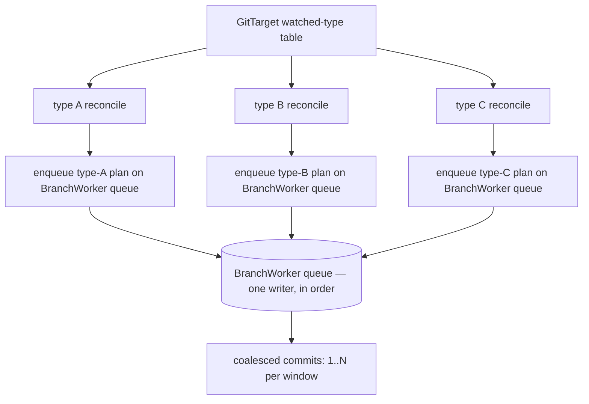

# Per-Type Reconcile, the Streaming Tail, and Visibility

> Status: design direction, captured 2026-06-05.
> Origin: [dream.md](dream.md).
> Related:
> [reconcile-via-watchlist-mark-and-sweep.md](reconcile-via-watchlist-mark-and-sweep.md),
> [current-manifest-support-review.md](current-manifest-support-review.md),
> [gvk-gvr-mapping-layer.md](gvk-gvr-mapping-layer.md),
> [implementation-plan.md](implementation-plan.md).

## What this document is

M1–M8 built the materialized model and made the reconcile **correct**:
content-derived identity end to end, a revision-pinned streaming snapshot, and a
mark-and-sweep that refuses to act on a partial view. The implementation plan has
exactly one milestone left — **M9, the cross-batch structure cache** — and it is
pure optimization.

This document designs what comes *after* the documented roadmap: the initial
reconcile evolving from GitTarget-atomic to **per watched type**, the streaming
tail that folds bootstrap and steady state into one connection, and the visibility
surface that ends the "what does this GitTarget actually follow?" darkness. It
carries a single foundational assumption (next section) that everything else
obeys, proposes milestones **M10–M14**, and keeps the same level of detail as the
rest of the corpus. The sequencing is a proposal to settle together.

The work is five threads. Three of them are one architectural move — **make the
unit of reconcile a watched type, not a whole GitTarget** — and two are the payoff
that move unlocks: less machinery, more visibility.

## Foundational assumption: the git folder mirrors the tracked cluster state

**Git is the source of truth — the durable record an operator reads and GitOps
consumes — and a GitTarget is a standing request from a user: *bring this git
folder in line with these watched cluster resources, and keep it that way.*** The
git folder's trustworthiness depends entirely on it holding **exactly** the
currently-tracked resources: no stale extras, and nothing the cluster no longer
serves. The cluster is authoritative for what a resource *contains*; the git folder
must reflect, exactly, *which* resources are tracked. The instant a resource leaves
the tracked set, the mirror is wrong until that resource leaves git too.

This is not a new conviction — it is the same source-of-truth duty the materialized
model already discharges by **dropping a watched resource the API no longer has**
([current-manifest-support-review.md](current-manifest-support-review.md)). This
document extends that duty to its logical edge: a resource also leaves the tracked
set when its **type** does.

The hard consequence, settled here and obeyed everywhere below:

> **Untracking a type sweeps its KRM.** When a `WatchRule`/`ClusterWatchRule` is
> adjusted to no longer follow a type, or a type is removed from the cluster API,
> the only honest mirror is one without that type's documents. We remove all
> involved KRM. This is a hard decision, not a policy knob.

[The detailed mechanism and its one safety guard](#untracking-a-type-sweeps-its-krm)
are below; it is stated here first because the rest of the design assumes it.

## Worth designing now, not all worth building now

The direction here is the right post-M8 architecture, but it must *not* all land in
the M8 stabilization window. The threads have very different risk profiles, and the
value of this design is in keeping them apart rather than treating them as one
refactor:

- **Low regret — do now/soon.** The watched-type table (Thread 1) and a basic
  visibility summary (Thread 4). Both are worth doing **even if per-type reconcile
  never lands**: the table stops re-resolving the whole type set in the hot path
  and is the natural source for metrics/status; visibility ends the darkness a new
  operator faces today. Neither changes reconcile behavior, so neither can regress
  M8.
- **The real win — after M8 is boring.** Per-type reconcile + per-type sweep (the
  one move), which also carries the untracking sweep. High value (failure
  isolation, understandable commits), moderate risk, and it lands *with today's
  snapshot-close behavior* — **without** the merged streaming tail.
- **A second-order rewrite — later.** The merged streaming tail (Thread 2). It is
  **not** the natural next patch: it is a watch-subsystem rewrite that owns
  reconnects, compaction / `410 Gone`, the aggregated-API fallback, fan-out
  reference counting, and late joins. It is a milestone of its own.
- **Only after measurement.** Dropping content hashing (Thread 3).

The rest of this document designs all of it. The sequencing section maps these
tiers onto milestones, low-regret first.

## Where M8 left us

The reconcile today is **GitTarget-atomic**. One GitTarget's initial reconcile
(and every resync) is:

```text
StreamClusterSnapshotForGitDest(gitDest)
  resolveSnapshotGVRs        # re-resolve the whole watched type set, every time
  joinSnapshotStreams        # N streams (one per (GVR, namespace))
    fold every ADDED
    wait for EVERY type's initial-events-end bookmark
    if ANY stream fails before its bookmark -> abort, return nothing
  -> ClusterSnapshot{ Desired: <all types>, Revision: max bookmark RV }
EnqueueResync(Desired)       # one worker request
  BuildPlan + apply + flush  # ONE commit for the whole GitTarget
```

Grounded in code:

- the gather and the join are
  [`Manager.StreamClusterSnapshotForGitDest`](../../../internal/watch/snapshot_stream.go)
  and `joinSnapshotStreams`; the all-or-nothing rule is the `firstErr`/`cancel()`
  there;
- the type set is re-resolved on every gather by `resolveSnapshotGVRs`
  (`RefreshAPIResourceCatalog` + `ruleGVRResolver`);
- the apply is the M8
  [`BranchWorker.applyResyncToWorktree`](../../../internal/git/resync_flush.go),
  one `BuildPlan` mark-and-sweep, one commit;
- **steady state is a second, separate pipeline**: long-lived shared informers
  ([`startInformersForGVRs`](../../../internal/watch/manager.go),
  [`addHandlers`](../../../internal/watch/informers.go)) feed the
  `GitTargetEventStream`, which **buffers** live events while the snapshot runs
  (`BeginReconciliation` / `OnReconciliationComplete` in
  [`event_router.go`](../../../internal/watch/event_router.go)) and flushes them
  after;
- **change detection is content-hash dedup**: `isDuplicateContent`
  ([`informers.go`](../../../internal/watch/informers.go)) and
  `computeEventHash` / `processedEventHashes`
  ([`git_target_event_stream.go`](../../../internal/reconcile/git_target_event_stream.go))
  both sha256 the sanitized YAML to drop status-only churn.

Two structural costs fall out of "GitTarget-atomic":

1. **One wobbly type blocks every stable type.** A CRD whose apiserver is
   throttling, a half-installed aggregated API, a type mid-upgrade — any single
   stream that cannot reach its bookmark aborts the *entire* GitTarget reconcile.
   The stable 95% of the folder is held hostage by the unstable 5%. The M8 rule
   ("fail loudly, never act on a partial view") is correct, but the blast radius is
   wrong.
2. **Bootstrap and steady state are two subsystems with a handover.** The snapshot
   stream is opened, drained to its bookmark, and **thrown away**; live events come
   from a different connection (the informers) and have to be buffered across the
   handover.

## The one move: reconcile per watched type

Make the unit of reconcile a **`(GVK, GVR, scope)`** — one watched type — instead
of a whole GitTarget. A GitTarget watching five types becomes five reconciles, each
independent.

This is not only an optimization; it **refines the consistency boundary** in a way
that is strictly safer than today's, once the safety argument below holds.

### Why a per-type sweep is safe (the load-bearing argument)

The M8 design forbids sweeping on a partial mark, and is emphatic:

> "Sweeping after type A's bookmark but before type B's would delete all of B's
> manifests as phantom orphans."

That sentence is true **only because today's sweep is computed over all members at
once**. The per-type design changes the sweep set, and the prohibition dissolves:

- The managed model's members partition cleanly **by GVK** — a `DocumentModel`
  belongs to exactly one type. Type A's members and type B's members are disjoint
  sets.
- A **type-scoped sweep** computes `orphansₐ = membersₐ − streamedₐ` using only
  type A's members and only type A's streamed identities. It can never name a type
  B document, because a type B document is not in `membersₐ`.
- Type A's `initial-events-end` bookmark is, by the same Kubernetes guarantee M8
  relies on, the proof that type A's initial sync is **complete**. That is exactly
  and only what a type A sweep needs.

So the rule survives, scoped down: **no bookmark for type A, no sweep of type A —
but type A's bookmark is sufficient to sweep type A.** Type B's troubles are type
B's alone. This is the breathing room for wobbly types, and it is a *tightening* of
the safety property — the abort blast radius shrinks from the GitTarget to the type
— not a loosening.

One case needs naming: a **multi-document file holding two types**
(`a.yaml` = `[ConfigMap, Deployment]`). A `ConfigMap` sweep that drops document 0
edits a file the `Deployment` still lives in. That is already safe by the M8 model:
deletes are document-granular (`manifestedit.DeleteDocument`), the file is only
removed when its *last* managed document goes, and positions are re-derived from
live bytes at apply (`currentDocIndex`). A per-type sweep over a shared file only
ever removes documents *of that type*, so it composes with M7/M8 unchanged. The
only new requirement is that two type-scoped commits touching the same file are
**serialized** — which they already are, because they ride the same BranchWorker
queue (see "Ordering" below).

### Per-type reconcile, sketched



Each type's reconcile:

```text
open stream for (GVR, scope) with sendInitialEvents
fold initial ADDED -> desiredₐ
at the initial-events-end bookmark:
   build (or reuse) the managed model for the GitTarget subtree
   sweepₐ = membersₐ(model) − desiredₐ            # type-scoped mark-and-sweep
   plan   = create/patch desiredₐ + drop sweepₐ
   enqueue plan on the BranchWorker queue          # ordering + coalescing
mark type A "synced"; CLOSE the snapshot stream
   steady state for type A continues via the existing informer pipeline
   (folding bootstrap + tail into one stream is the LATER Thread 2 milestone)
```

Independence is the whole point:

- **One commit per type**, trading one big commit for several readable ones, with
  the existing commit window still free to coalesce several quick type reconciles
  into one commit when they land together.
- **A type starts tracking the moment its own sync finishes** — it does not wait
  for its slowest sibling.
- **Adding a type re-reconciles only that type**, not the whole GitTarget.
  **Removing a type sweeps it** — see the next section.

## Untracking a type sweeps its KRM

The foundational assumption makes one behavior non-negotiable, and per-type
reconcile makes it natural to implement. A type leaves a GitTarget's tracked set in
exactly two ways, and both sweep:

- **The rules stop following it.** A `WatchRule`/`ClusterWatchRule` is edited so
  type X is no longer selected. This is an explicit, user-driven, unambiguous
  signal. The user has said "stop mirroring X here," so X's documents must leave the
  git folder. The type may still exist in the cluster — irrelevant; this GitTarget
  no longer mirrors it.
- **The cluster removes the type.** A CRD is uninstalled, or an API version is
  retired, so the GVK no longer resolves to a served resource. The cluster can no
  longer be the source for those documents, so a faithful mirror cannot keep them.

Both reduce to **"type X is no longer tracked → drop every managed document of type
X."** There is no desired set to diff against — the desired set for an untracked
type is *empty by definition* — so this is a degenerate, especially cheap
mark-and-sweep: enumerate `ByGVK[X]` in the managed model and emit a
`PlanDropOrphan` for each, exactly the M3/M8 drop path, deleted by `RecordRef` so a
moved manifest is still removed. It is **driven by the watched-type table diff**
(Thread 1): when the resolved table loses an entry that the git folder still has
documents for, that entry's documents are swept in one type-scoped commit.

### The one safety guard: a trusted absence, never an unobservable one

The rules-change trigger is safe on its own — it is a deliberate edit to a CR, not
an inference. The **cluster-removed-the-type** trigger is where the corpus's
fail-closed discipline is mandatory, because a destructive sweep driven by a wrong
observation would delete a great deal of git content from a transient hiccup.

So the type-removed sweep fires **only on a trusted absence**:

- A GVK that resolves to `MappingUnserved` against a **ready, non-degraded** catalog
  (`APIResourceCatalog` reports the type genuinely gone) is a trusted removal →
  sweep.
- `MappingCatalogUnavailable` / `MappingDiscoveryDegraded` — discovery could not be
  observed — is **not** absence. It is fail-closed: hold, sweep nothing, retry when
  the catalog is trustworthy again. This is the same rule the mapping layer and M6
  `PlanDelete` already enforce ("never treat an unobservable surface as absence" —
  [gvk-gvr-mapping-layer.md](gvk-gvr-mapping-layer.md), Failure Policy); the
  type-level sweep inherits it verbatim.

A momentarily-flaky apiserver therefore delays a sweep; it never causes a wrong one.
A genuinely uninstalled CRD, confirmed by a healthy catalog, sweeps.

### This is not the adoption-time refusal — and does not contradict it

[current-manifest-support-review.md](current-manifest-support-review.md) Decision #3
*refuses* a GitTarget that, **at adoption**, contains API-backed KRM of a type it
never watched: we never claimed it, so we will not silently prune content a human
authored. That stays. The distinguishing question is **"was it ours?"**:

- **Never-tracked KRM discovered while adopting a folder** → ambiguous, not ours →
  **refuse** (Decision #3, unchanged).
- **A type this GitTarget *was* tracking, now untracked** → unambiguously ours; we
  materialized it, the user/cluster has withdrawn it → **sweep**.

The two are complementary, not contradictory: refusal protects content we never
claimed; the untracking sweep keeps the mirror honest for content that was always
ours.

## Thread 1: a resolved, deliberate watched-type table per GitTarget

A GitTarget needs a first-class, resident table of the types it follows — resolved
once, changed only on a deliberate trigger — rather than today's re-derivation of
the set inside `resolveSnapshotGVRs` on **every** gather.

Make the resolution a resident, per-GitTarget value:

```text
WatchedTypeTable {
   GitTarget
   Entries []WatchedType{
      GVK, GVR, Namespaced, Scope(namespaces | cluster-wide),
      CRDVersion / servedVersion,          # exact version behind the GVK
      ResolvedAt (catalog generation),
      SyncState, LastSyncedRV, SyncedCount # filled by the per-type reconcile
   }
}
```

It is re-resolved on **deliberate triggers only**:

- a GitTarget rule-set change (already the `ReconcileForRuleChange` path);
- a catalog generation bump (`APIResourceCatalog.Generation()` already exists at
  [api_resource_catalog.go:104](../../../internal/watch/api_resource_catalog.go#L104))
  — a CRD installed/removed/upgraded changes what a GVK resolves to.

The table is the spine the rest of the design hangs on:

- **per-type reconcile iterates it** (one reconcile per entry);
- **its diff drives the untracking sweep** — an entry that disappears (rule change)
  or stops resolving against a trusted catalog (cluster removal) sweeps that type's
  KRM;
- **visibility surfaces it** — it is exactly the "what does this GitTarget follow?"
  artifact, so the table and the overview are the same thing built once;
- **it keys the shared cluster watch** by `(GVR, scope)`, so many GitTargets' tables
  can point at one stream (Thread 2).

## Thread 2: merge the initial send with the live tail (stream order, not RV math)

After the initial send finishes, the same stream should keep flowing: pick up the
live tail rather than handing off to a second connection. The mechanism for "is
this event after the snapshot?" **must not be literal numeric `resourceVersion`
comparison.** `resourceVersion` is opaque by Kubernetes contract — it is not
promised to be a comparable integer across the versions we support, and code that
does `rv > rv_b` relies on an implementation detail. Treat it as a **continuation
token**, not a number.

The robust framing is **stream order**: events delivered *after* the
`initial-events-end` bookmark on the same watch are post-snapshot **by
construction**, no comparison required. On reconnect, resume the watch *from* the
last observed `resourceVersion` (the token), and on `410 Gone` re-list and re-run
the type's sweep — ordinary Kubernetes watch semantics. (If a per-type monotonic-RV
guarantee is later confirmed for every Kubernetes version we support, it can
*reinforce* this story, but the design must never *depend* on integer comparison.)

With that framing, a single stream per `(GVR, scope)` serves **both** the initial
reconcile and steady state as one merged data stream:

```text
open ONE watch for (GVR, scope): sendInitialEvents=true, bookmarks=true
phase 1 (initial send):  fold synthetic ADDED -> desired set
   bookmark:              run the type-scoped mark-and-sweep, commit
phase 2 (live tail):      keep the SAME stream open
   events AFTER the bookmark (by stream order) -> plan actions
   on reconnect:          resume the watch from the last observed
                          resourceVersion (continuation token)
   on 410 Gone:           re-list and re-run the type sweep
```

It collapses the two subsystems M8 left separate:

- **No RECONCILING buffer / handover.** Today live events are buffered in
  `GitTargetEventStream` while the snapshot runs and flushed after
  (`BeginReconciliation`/`OnReconciliationComplete`). With one merged stream the
  live tail simply *follows* the bookmark on the same connection — the handover
  disappears, and so does the window where a long sync could miss or double-handle
  an event. An event that lands during a slow initial send over a large resource
  set is not lost and not buffered indefinitely — it is simply the first item on
  the tail, after the bookmark.
- **The informer pipeline for reconciled types is subsumed.**
  [`startInformersForGVRs`](../../../internal/watch/manager.go) +
  [`addHandlers`](../../../internal/watch/informers.go) exist to deliver live
  events; a merged per-type stream delivers them itself. (The informer cache also
  gives `DeletedFinalStateUnknown` handling and shared fan-out — see the fan-out
  bullet — so this is a careful swap, not a delete.)
- **Shared cluster watch, fanned out.** One stream per `(GVR, scope)` regardless of
  how many GitTargets watch that type, with the watched-type tables (Thread 1) as
  the fan-out routing. This generalizes the informers' current shared-factory model
  (`informerFactories` keyed by namespace in
  [manager.go](../../../internal/watch/manager.go)) to also carry the per-GitTarget
  initial send.

**The subtlety to respect:** stream order answers *"is this after the snapshot?"*
It does **not** answer *"did the materialized content actually change?"* — a
status-only update is delivered on the tail like any other event but sanitizes to
identical YAML. That question is Thread 3.

**Why this is a separate, later milestone — not folded into per-type reconcile.**
Per-type reconcile (the move above) lands cleanly with **today's snapshot-close
behavior**: gather to the bookmark, sweep, commit, close the stream, and let the
existing informer pipeline carry steady state — exactly as M8 does, just scoped to
one type. The merged tail is a strictly *bigger* change, and it owns the gnarly
lifecycle the snapshot path gets to ignore precisely because it closes immediately:
watch **reconnects**, **compaction / `410 Gone`** (the resume token expired → must
re-list → re-sweep), the **aggregated-API LIST fallback** needing a tail story of
its own, **fan-out reference counting** for a shared stream, and **a GitTarget
joining an already-running stream** (fresh initial send, or reconcile off the
shared cache?). These are real distributed-systems edges, so the tail is its own
milestone, sequenced well after per-type reconcile is proven.

## Thread 3: drop the content hashing — carefully

The two content hashes today are:

- `isDuplicateContent` ([informers.go](../../../internal/watch/informers.go)) —
  drops status-only informer churn before it is routed;
- `computeEventHash`/`processedEventHashes`
  ([git_target_event_stream.go](../../../internal/reconcile/git_target_event_stream.go))
  — drops a repeated identical event per identity.

Both answer the **content-changed?** question, which stream order alone cannot (a
status-only update is a real, ordered event). But there is already a *third* answer
to that question, computed for free at the commit boundary: the writer's no-op
detection (`manifestedit.Decide` → `EditNoChange`, and `manifestsAreSemanticallyEqual`
in [plan_flush.go](../../../internal/git/plan_flush.go)). A status-only update that
reaches the writer produces no commit today.

So the hashes are **removable**, but removing them is a *trade*, not a free win:

- **Removed:** a sha256-of-sanitized-YAML on every informer event (real CPU), plus
  the `processedEventHashes` map and the dedup branch.
- **Added:** more events flow to the BranchWorker, each costing a commit-boundary
  parse + `Decide` compare for its one identity (cheap per event, coalesced per
  window, but not zero) for changes that the hash would have dropped at the edge.

The honest framing: **stream order becomes the freshness/ordering authority**
(events past the bookmark are new; never re-handle a pre-bookmark one), and the
**writer's existing no-op detection becomes the content-change authority.** The
per-event hash is then redundant and can go — but this should land *only after* the
merged stream (Thread 2) makes stream order authoritative, and should be
**measured** on a high-churn type before and after, because the CPU saving depends
on churn-rate vs. commit-rate. If a pathological high-churn type ever makes
commit-boundary compares hurt, the cheap fallback is a per-`(identity)`
**last-processed-token equality** check — "have we already handled this exact
`resourceVersion` for this identity?", a string equality, not a hash and not an
ordering comparison — which keeps the opaque-token contract intact and is still far
cheaper than sha256.

## Thread 4: visibility

A new operator has no overview today of what a GitTarget actually follows. The
watched-type table (Thread 1) is the data; the per-type reconcile fills in its live
state. A *basic* summary (which types, their CRD versions, resolved-vs-failing
counts) is available from the **table alone**, so it can ship right after Thread 1,
before any reconcile change. The *richer* per-type sync counters fill in once
per-type reconcile lands. Three surfaces, in increasing cost:

1. **Metrics (start here).** Per `(GitTarget, GVK)` gauges/counters: synced object
   count, last-synced revision, sync state, reconcile duration, drops. This is where
   the bulk per-type data belongs — it is unbounded-friendly, it is what admins
   already scrape, and the telemetry plumbing exists
   ([`internal/telemetry`](../../../internal/telemetry), e.g. `ObjectsScannedTotal`,
   `APICatalogGeneration`).
2. **Bounded status summary.** Extend `GitTargetStatus`
   ([gittarget_types.go:116](../../../api/v1alpha1/gittarget_types.go#L116), which
   already has `Snapshot`/`Stats`) with a **capped** per-type roll-up: total types,
   how many synced, the slowest/failing types, last sync time. Status carries the
   *summary and the exceptions*; metrics carry the *full table*. Status must stay
   small.
3. **A queryable inventory (optional, later).** If the full table is genuinely
   wanted in-cluster — "which exact CRD version is behind this type" per GitTarget —
   a separate status-only resource (a `GitTargetInventory` CR, or a status
   subresource list) keeps it out of the hot GitTarget object. Decide this only if
   metrics + summary prove insufficient; it is the most expensive surface.

The exact-CRD-version data (`servedVersion` per GVK) is already reachable through
the catalog (`APIResourceEntry`), so it is a matter of *surfacing*, not
*discovering*.

## Ordering, commits, and the queue

Multiple commits and multiple writers stay safe because they remain serialized on
the BranchWorker queue. The BranchWorker is a single-goroutine event loop
([branch_worker.go](../../../internal/git/branch_worker.go)); resyncs already ride
it as `ResyncRequest`s (`EnqueueResync` → `handleResyncRequest`), serialized with
live events. Per-type reconcile (and the untracking sweep) change *how many*
requests land, not the ordering discipline: every type's plan is enqueued on the
same queue, applied in arrival order, and the existing commit window coalesces
co-arriving ones. No new concurrency is introduced on the write side — the fan-out
concurrency is on the *read* (watch) side, which already runs many streams.

## Consequences

- **More commits, more readable.** The existing coalescing window keeps it from
  becoming chatty: quick successive type reconciles still merge into one commit when
  they land inside a window.
- **Wobbly types stop poisoning stable ones.** The headline robustness win, and it
  follows directly from the per-type sweep safety argument. A degraded type fails
  *itself* (and is visible as such via Thread 4) while its siblings sync.
- **Untracking is a first-class, observable event.** Removing a type from the rules,
  or a CRD being uninstalled, produces a clear, type-scoped sweep commit (and a
  visibility transition), not a silent drift. The fail-closed guard means an
  unhealthy catalog delays that sweep rather than misfiring it.
- **Big resource sets need their own e2e + metrics.** A cluster-wide CRD with
  thousands of objects is the stress case for the initial send duration and the
  live-tail merge. This wants a dedicated e2e (large synthetic set, assert per-type
  commits + correct sweep + no lost tail event) and the Thread 4 metrics to observe
  it.
- **Drop hashing.** Viable after the merged tail, with the measured trade in Thread
  3.
- **The cross-batch cache (deferred M9) is reshaped, not wasted.** Per-type
  reconcile means smaller, type-scoped stores rebuilt more often; a structure cache
  still helps but its key and granularity change (per `(checkout, GitTarget,
  type?)`). M9 is therefore best built against the per-type batch shape, not
  today's whole-folder one.

## Proposed sequencing (to decide together)

A proposal in the implementation-plan's idiom, ordered **low-regret first**.
Numbers are provisional and reflect recommended implementation order, not just raw
dependency.

**Tier 1 — low regret, do now/soon (no reconcile change, cannot regress M8):**

- **M10 — Watched-type table (+ basic per-GVK metrics).** Promote
  `resolveSnapshotGVRs` into a resident, per-GitTarget `WatchedTypeTable`,
  re-resolved on rule-change and catalog generation only, and emit basic
  per-`(GitTarget, GVK)` metrics (resolved/failed, CRD version). *No reconcile
  behavior change* — the existing gather reads the table instead of re-resolving
  inline. **Done when:** the table is the single source of "what this GitTarget
  watches," re-resolution is triggered (not per-gather), a catalog generation bump
  re-resolves it, and basic metrics exist.
- **M11 — Visibility summary.** A *bounded* `GitTargetStatus` roll-up derived from
  the table: total watched types, resolved-vs-failing counts, failing type names
  (capped), CRD versions; metrics carry the full per-type detail. Depends only on
  M10. **Done when:** an operator can see what a GitTarget follows and which types
  are unhealthy, without bloating the object. (Per-type *sync* counters fill in once
  M12 lands.)

**Tier 2 — the real win, after M8 is boring:**

- **M12 — Per-type reconcile + per-type sweep + untracking sweep, snapshot-close.**
  Split the GitTarget-atomic gather/apply into per-`(GVR, scope)` reconciles with
  type-scoped mark-and-sweep, each enqueued on the BranchWorker queue; a failing
  type aborts only itself. A type the watched-type table diff drops (rule change, or
  trusted cluster removal) sweeps all its KRM; an untrusted/degraded catalog holds.
  **No merged tail** — gather to the bookmark, sweep, commit, close the stream, and
  let the existing informer pipeline carry steady state, exactly as M8. **Done
  when:** e2e shows a wobbly type does not block stable ones; per-type commits land;
  the sweep never crosses type boundaries; multi-type files stay document-correct;
  untracking a type sweeps its KRM, and a degraded catalog does not. **[runtime]**

**Tier 3 — second-order, deliberately last:**

- **M13 — Merged stream (initial send + live tail).** One stream per `(GVR, scope)`
  carries the initial send through the bookmark and continues as the live tail (by
  *stream order*, resuming from the continuation token on reconnect). Remove the
  RECONCILING buffer/handover and retire the separate informer path for reconciled
  types (preserving its fan-out and deleted-final-state handling). A watch-subsystem
  rewrite with its own lifecycle edges — reconnect, `410 Gone`, aggregated-API
  fallback, fan-out ref counting, late join. **Done when:** an event arriving during
  a long initial send is applied exactly once via the tail; bootstrap and steady
  state are one connection per type. **[runtime]**
- **M14 — Drop content hashing — only after measurement.** Remove
  `isDuplicateContent` / `processedEventHashes` once stream order + commit-time
  no-op detection are the authorities; measure CPU on a high-churn type first; keep
  the last-processed-token equality guard as the fallback if needed. **Done when:**
  no regression on a status-churn workload; CPU measured before/after.

**Recommended order:** M10 → M11 → M12 → M13 → M14. M10/M11 are the "do now/soon"
tier and cannot regress M8 (no reconcile change). M12 is the headline win, taken
*after* M8 stabilization, and is the only Tier-2 item. M13 and M14 are explicitly a
later subsystem rewrite and a measured cleanup. M11 depends only on M10 and could
run in parallel with M12, but ship the cheap visibility first. The deferred **M9
cache** is best revisited *after* M12 settles the batch shape.

## Open questions

- **Cross-type consistency.** GitTarget-atomic gave one snapshot revision for the
  whole folder. Per-type gives one revision *per type*. Is any consumer relying on a
  single folder-wide consistent revision (status? a future audit join?)? If so, the
  per-type revisions need a documented "max across types" interpretation, as
  `maxResourceVersion` already hints.
- **Fan-out lifecycle.** A shared `(GVR, scope)` stream feeding many GitTargets
  needs reference-counted start/stop and a clear story for "a new GitTarget joins a
  type already being streamed" (a fresh initial send, or reconcile off the shared
  cache?). The informer factory already does shared lifecycle; the merged stream
  must not regress it.
- **Bound on concurrent streams.** A GitTarget (or a cluster) watching very many
  types opens very many streams. Is there a concurrency cap, and how is "waiting for
  N of M type syncs" surfaced (now naturally answered by Thread 4)?
- **Aggregated apiservers.** The per-type LIST fallback
  (`isStreamingWatchUnsupported` → `listInitialEvents`) must survive the merge: a
  type that cannot stream gets a consistent LIST for its initial send and then —
  what for its tail? (Fall back to an informer for just that type, or periodic
  re-list.) This is the per-type analogue of M8's hardening #6.
- **The destructive-sweep observability bar.** Untracking sweeps can be large
  (uninstalling a CRD removes every document of that type). The behavior is settled;
  what remains is making it *loud* — commit messages, metrics, and status that name
  the swept type and count, so a large sweep is auditable after the fact.
