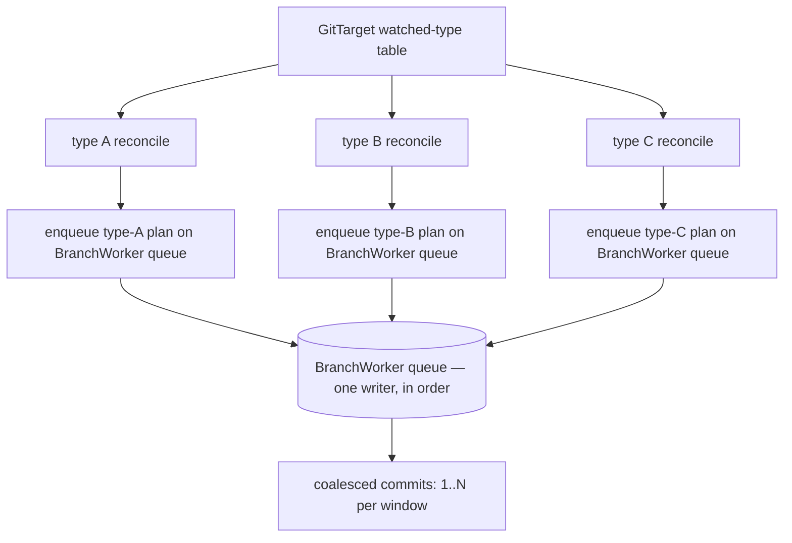

# Per-Type Reconcile, the Streaming Tail, and Visibility

> Status: design direction, captured 2026-06-05.
> Origin: [dream.md](dream.md) — the GitTarget owner's dream for the initial
> reconcile, turned into a code-grounded design here.
> Related:
> [reconcile-via-watchlist-mark-and-sweep.md](reconcile-via-watchlist-mark-and-sweep.md),
> [current-manifest-support-review.md](current-manifest-support-review.md),
> [gvk-gvr-mapping-layer.md](gvk-gvr-mapping-layer.md),
> [implementation-plan.md](implementation-plan.md).

## What this document is

M1–M8 built the materialized model and made the reconcile **correct**:
content-derived identity end to end, a revision-pinned streaming snapshot, and a
mark-and-sweep that refuses to act on a partial view. The implementation plan has
exactly one milestone left — **M9, the cross-batch structure cache** — and it is
pure optimization.

This document is about what comes *after* the documented roadmap. It takes the
dream for the initial reconcile and works it into a concrete, code-grounded design
with a proposed milestone sequence (provisionally **M10–M14**). It is a design
direction, not yet an execution order; the sequencing at the end is a proposal to
decide together, in the same spirit as the existing reconcile design doc.

The dream has five threads. Three of them are a single architectural move —
**make the unit of reconcile a watched type, not a whole GitTarget** — and two are
the payoff that move unlocks (less machinery, more visibility).

## Where M8 left us

The reconcile today is **GitTarget-atomic**. One GitTarget's initial reconcile
(and every resync) is:

```text
StreamClusterSnapshotForGitDest(gitDest)
  resolveSnapshotGVRs        # re-resolve the whole watched type set, every time
  joinSnapshotStreams        # N streams (one per (GVR, namespace))
    fold every ADDED
    wait for EVERY type's initial-events-end bookmark
    if ANY stream fails before its bookmark -> abort, return nothing
  -> ClusterSnapshot{ Desired: <all types>, Revision: max bookmark RV }
EnqueueResync(Desired)       # one worker request
  BuildPlan + apply + flush  # ONE commit for the whole GitTarget
```

Grounded in code:

- the gather and the join are
  [`Manager.StreamClusterSnapshotForGitDest`](../../../internal/watch/snapshot_stream.go)
  and `joinSnapshotStreams`; the all-or-nothing rule is the `firstErr`/`cancel()`
  there;
- the type set is re-resolved on every gather by `resolveSnapshotGVRs`
  (`RefreshAPIResourceCatalog` + `ruleGVRResolver`);
- the apply is the M8
  [`BranchWorker.applyResyncToWorktree`](../../../internal/git/resync_flush.go),
  one `BuildPlan` mark-and-sweep, one commit;
- **steady state is a second, separate pipeline**: long-lived shared informers
  ([`startInformersForGVRs`](../../../internal/watch/manager.go),
  [`addHandlers`](../../../internal/watch/informers.go)) feed the
  `GitTargetEventStream`, which **buffers** live events while the snapshot runs
  (`BeginReconciliation` / `OnReconciliationComplete` in
  [`event_router.go`](../../../internal/watch/event_router.go)) and flushes them
  after;
- **change detection is content-hash dedup**: `isDuplicateContent`
  ([`informers.go`](../../../internal/watch/informers.go)) and
  `computeEventHash` / `processedEventHashes`
  ([`git_target_event_stream.go`](../../../internal/reconcile/git_target_event_stream.go))
  both sha256 the sanitized YAML to drop status-only churn.

Two structural costs fall out of "GitTarget-atomic":

1. **One wobbly type blocks every stable type.** A CRD whose apiserver is
   throttling, a half-installed aggregated API, a type mid-upgrade — any single
   stream that cannot reach its bookmark aborts the *entire* GitTarget reconcile.
   The stable 95% of the folder is held hostage by the unstable 5%. The M8 doc
   names this as correct-but-blunt ("fail loudly, never act on a partial view");
   the dream's insight is that the blast radius is wrong, not the rule.
2. **Bootstrap and steady state are two subsystems with a handover.** The snapshot
   stream is opened, drained to its bookmark, and **thrown away**; live events come
   from a different connection (the informers) and have to be buffered across the
   handover. The M8 doc flagged folding them into one connection as deferred
   (judgment call #4).

## The one move: reconcile per watched type

Make the unit of reconcile a **`(GVK, GVR, scope)`** — one watched type — instead
of a whole GitTarget. A GitTarget watching five types becomes five reconciles,
each independent.

This is not only an optimization; it **refines the consistency boundary** in a way
that is strictly safer than today's, once the safety argument below holds.

### Why a per-type sweep is safe (the load-bearing argument)

The M8 design forbids sweeping on a partial mark, and is emphatic:

> "Sweeping after type A's bookmark but before type B's would delete all of B's
> manifests as phantom orphans."

That sentence is true **only because today's sweep is computed over all members at
once**. The per-type design changes the sweep set, and the prohibition dissolves:

- The managed model's members partition cleanly **by GVK** — a `DocumentModel`
  belongs to exactly one type. Type A's members and type B's members are disjoint
  sets.
- A **type-scoped sweep** computes `orphansₐ = membersₐ − streamedₐ` using only
  type A's members and only type A's streamed identities. It can never name a type
  B document, because a type B document is not in `membersₐ`.
- Type A's `initial-events-end` bookmark is, by the same Kubernetes guarantee M8
  relies on, the proof that type A's initial sync is **complete**. That is exactly
  and only what a type A sweep needs.

So the rule survives, scoped down: **no bookmark for type A, no sweep of type A —
but type A's bookmark is sufficient to sweep type A.** Type B's troubles are type
B's alone. This is the dream's "breathing room for wobbly types," and it is a
*tightening* of the safety property (the abort blast radius shrinks from the
GitTarget to the type), not a loosening.

One case needs naming: a **multi-document file holding two types**
(`a.yaml` = `[ConfigMap, Deployment]`). A `ConfigMap` sweep that drops document 0
edits a file the `Deployment` still lives in. That is already safe by the M8 model:
deletes are document-granular (`manifestedit.DeleteDocument`), the file is only
removed when its *last* managed document goes, and positions are re-derived from
live bytes at apply (`currentDocIndex`). A per-type sweep over a shared file only
ever removes documents *of that type*, so it composes with M7/M8 unchanged. The
only new requirement is that two type-scoped commits touching the same file are
**serialized** — which they already are, because they ride the same BranchWorker
queue (see "Ordering" below).

### Per-type reconcile, sketched



Each type's reconcile:

```text
open stream for (GVR, scope) with sendInitialEvents
fold initial ADDED -> desiredₐ
at bookmark RVₐ:
   build (or reuse) the managed model for the GitTarget subtree
   sweepₐ = membersₐ(model) − desiredₐ            # type-scoped mark-and-sweep
   plan   = create/patch desiredₐ + drop sweepₐ
   enqueue plan on the BranchWorker queue          # ordering + coalescing
mark type A "synced", begin steady-state tail for type A   # see next section
```

Independence is the whole point:

- **One commit per type** (the dream is happy to trade one big commit for several
  readable ones), with the existing commit window still free to coalesce several
  quick type reconciles into one commit when they land together.
- **A type starts tracking the moment its own sync finishes** — it does not wait
  for its slowest sibling.
- **Adding or removing a type re-reconciles only that type**, not the whole
  GitTarget (see "Type set changes" under Open Questions for the removal
  semantics, which need a decision).

## Thread 1: a resolved, deliberate watched-type table per GitTarget

The dream asks for "a more fixed GVK/GVR lookup table per GitTarget — it should
change, but as a concise, deliberate step." Today there is no such artifact:
`resolveSnapshotGVRs` re-derives the set from the catalog and rules on **every**
gather.

Make the resolution a first-class, resident, per-GitTarget value:

```text
WatchedTypeTable {
   GitTarget
   Entries []WatchedType{
      GVK, GVR, Namespaced, Scope(namespaces | cluster-wide),
      CRDVersion / servedVersion,          # exact version behind the GVK
      ResolvedAt (catalog generation),
      SyncState, LastSyncedRV, SyncedCount # filled by the reconcile (Thread 5)
   }
}
```

It is re-resolved on **deliberate triggers only**:

- a GitTarget rule-set change (already the `ReconcileForRuleChange` path);
- a catalog generation bump (`APIResourceCatalog.Generation()` already exists at
  [api_resource_catalog.go:104](../../../internal/watch/api_resource_catalog.go#L104))
  — a CRD installed/removed/upgraded changes what a GVK resolves to.

This table is the thing per-type reconcile iterates, and — not coincidentally — it
is exactly what the visibility thread wants to expose. The "fixed table" and the
"overview of what a GitTarget follows" are the **same artifact**; building it once
serves both. It also makes the shared-cluster-watch idea concrete: the table keys
the cluster-side watch by `(GVR, scope)`, and many GitTargets' tables can point at
one shared stream (Thread 2, last bullet).

## Thread 2: merge the initial send with the live tail (trust RV)

Kubernetes now guarantees a **monotonically increasing resourceVersion per
resource type** over time. That is the key the dream turns: a single stream per
`(GVR, scope)` can serve **both** the initial reconcile and steady state by
treating them as one merged data stream:

```text
open ONE watch for (GVR, scope): sendInitialEvents=true, bookmarks=true
phase 1 (initial send):  fold synthetic ADDED -> desired set
   bookmark @ RV_b:       run the type-scoped mark-and-sweep, commit
phase 2 (live tail):      keep the SAME stream open
   event with RV  > RV_b: a genuine post-snapshot change -> plan action
   event with RV <= RV_b: already reflected in the snapshot -> drop
```

This is the dream's "merging two datastreams: the initial send, and when that's
finished, the first event with a higher RV." It collapses the two subsystems M8
left separate:

- **No RECONCILING buffer / handover.** Today live events are buffered in
  `GitTargetEventStream` while the snapshot runs and flushed after
  (`BeginReconciliation`/`OnReconciliationComplete`). With one merged stream the
  live tail simply *follows* the bookmark on the same connection — the handover
  disappears, and so does the window where a long sync could miss or double-handle
  an event. This directly addresses the dream's worry about **longer syncs over
  bigger resource sets**: an event that lands during a slow initial send is not
  lost and not buffered indefinitely — it is the first `RV > RV_b` item on the
  tail.
- **The informer pipeline for reconciled types is subsumed.**
  [`startInformersForGVRs`](../../../internal/watch/manager.go) +
  [`addHandlers`](../../../internal/watch/informers.go) exist to deliver live
  events; a merged per-type stream delivers them itself. (The informer cache also
  gives us `DeletedFinalStateUnknown` handling and shared fan-out — see the
  fan-out bullet — so this is a real swap to design carefully, not a delete.)
- **Shared cluster watch, fanned out.** The dream's "one reconcile on the
  Kubernetes side, streamed to all GitTargets that need it": one stream per
  `(GVR, scope)` regardless of how many GitTargets watch that type, with the
  watched-type tables (Thread 1) as the fan-out routing. This is the informers'
  current shared-factory model (`informerFactories` keyed by namespace in
  [manager.go](../../../internal/watch/manager.go)) generalized to also carry the
  per-GitTarget initial send.

**The subtlety to respect:** `RV > RV_b` answers *"is this newer than the
snapshot?"* It does **not** answer *"did the materialized content actually
change?"* — a status-only update bumps RV but sanitizes to identical YAML. That
question is Thread 3.

## Thread 3: drop the content hashing — carefully

The dream hopes to "drop the whole hash thing" to save CPU and complexity. The two
hashes today are:

- `isDuplicateContent` ([informers.go](../../../internal/watch/informers.go)) —
  drops status-only informer churn before it is routed;
- `computeEventHash`/`processedEventHashes`
  ([git_target_event_stream.go](../../../internal/reconcile/git_target_event_stream.go))
  — drops a repeated identical event per identity.

Both answer the **content-changed?** question, which RV alone cannot (status churn
bumps RV). But there is already a *third* answer to that question, computed for
free at the commit boundary: the writer's no-op detection
(`manifestedit.Decide` → `EditNoChange`, and `manifestsAreSemanticallyEqual` in
[plan_flush.go](../../../internal/git/plan_flush.go)). A status-only update that
reaches the writer produces no commit today.

So the hashes are **removable**, but removing them is a *trade*, not a free win:

- **Removed:** a sha256-of-sanitized-YAML on every informer event (real CPU, the
  dream's target), plus the `processedEventHashes` map and the dedup branch.
- **Added:** more events flow to the BranchWorker, each costing a commit-boundary
  parse + `Decide` compare for its one identity (cheap per event, coalesced per
  window, but not zero) for changes that the hash would have dropped at the edge.

The honest framing: **RV becomes the ordering and freshness authority** (drop
`RV ≤ RV_b`, never re-handle an old event), and the **writer's existing no-op
detection becomes the content-change authority**. The per-event hash is then
redundant and can go — but this should land *after* the merged stream (Thread 2)
makes RV authoritative, and should be **measured** on a high-churn type before and
after, because the CPU saving depends on churn-rate vs. commit-rate. If a
pathological high-churn type ever makes commit-boundary compares hurt, a cheap
per-`(identity)` "last RV committed" guard (an integer compare, not a hash) is the
fallback — strictly cheaper than sha256 and still RV-based.

## Thread 4: visibility

> "It's a lot of darkness now for a new user if we don't provide anything."

The watched-type table (Thread 1) is the data; the reconcile (Thread 2) fills in
its live state. Three surfaces, in increasing cost:

1. **Metrics (start here).** Per `(GitTarget, GVK)` gauges/counters: synced object
   count, last-synced RV, sync state, reconcile duration, drops. This is where the
   bulk per-type data belongs — it is unbounded-friendly, it is what admins already
   scrape, and the telemetry plumbing exists
   ([`internal/telemetry`](../../../internal/telemetry), e.g.
   `ObjectsScannedTotal`, `APICatalogGeneration`). The dream's "synced counter per
   type" is a labelled counter.
2. **Bounded status summary.** Extend `GitTargetStatus`
   ([gittarget_types.go:116](../../../api/v1alpha1/gittarget_types.go#L116), which
   already has `Snapshot`/`Stats`) with a **capped** per-type roll-up: total types,
   how many synced, the slowest/failing types, last sync time. Status must stay
   small (the dream's own worry: "not sure if we could push it to the status since
   it could become too big") — so status carries the *summary and the exceptions*,
   metrics carry the *full table*.
3. **A queryable inventory (optional, later).** If the full table is genuinely
   wanted in-cluster — "which exact CRD version is behind this type" per GitTarget
   — a separate status-only resource (e.g. a `GitTargetInventory` CR, or a status
   subresource list) keeps it out of the hot GitTarget object. Decide this only if
   metrics + summary prove insufficient; it is the most expensive surface.

The exact-CRD-version data (`servedVersion` per GVK) is already reachable through
the catalog (`APIResourceEntry`), so it is a matter of *surfacing*, not
*discovering*.

## Ordering, commits, and the queue

The dream's own caution — "be careful with multiple commits/writers; it should
still go on the branchworker queue so it is all in order" — is the right
invariant and it already holds. The BranchWorker is a single-goroutine event loop
([branch_worker.go](../../../internal/git/branch_worker.go)); resyncs already ride
it as `ResyncRequest`s (`EnqueueResync` → `handleResyncRequest`), serialized with
live events. Per-type reconcile changes *how many* requests land, not the ordering
discipline: every type's plan is enqueued on the same queue, applied in arrival
order, and the existing commit window coalesces co-arriving ones. No new
concurrency is introduced on the write side — the fan-out concurrency is on the
*read* (watch) side, which already runs many streams.

## Consequences (the dream's list, assessed)

- **More commits, more readable.** Yes — and the existing coalescing window keeps
  it from becoming chatty: quick successive type reconciles still merge into one
  commit when they land inside a window.
- **Wobbly types stop poisoning stable ones.** This is the headline robustness win
  and it follows directly from the per-type sweep safety argument. A degraded type
  fails *itself* (and is visible as such via Thread 4), while its siblings sync.
- **Big resource sets need their own e2e + metrics.** Agreed and important: a
  cluster-wide CRD with thousands of objects is the stress case for both the
  initial send duration and the live-tail merge. This wants a dedicated e2e (large
  synthetic set, assert per-type commits + correct sweep + no lost tail event) and
  the Thread 4 metrics to observe it.
- **Drop hashing.** Viable post-Thread-2, with the measured trade in Thread 3.
- **The cross-batch cache (deferred M9) is reshaped, not wasted.** Per-type
  reconcile means smaller, type-scoped stores rebuilt more often; a structure cache
  still helps but its key and granularity change (per `(checkout, GitTarget,
  type?)`). This is the concrete reason the scoping question chose to design the
  dream *before* building M9 against today's whole-folder batch.

## Proposed sequencing (to decide together)

A dependency-ordered proposal, in the implementation-plan's idiom. Numbers are
provisional.

- **M10 — Watched-type table.** Promote `resolveSnapshotGVRs` into a resident,
  per-GitTarget `WatchedTypeTable`, re-resolved on rule-change and catalog
  generation only. *No reconcile behavior change yet* — the existing gather reads
  the table instead of re-resolving inline. **Done when:** the table is the single
  source of "what this GitTarget watches," re-resolution is triggered (not
  per-gather), and a catalog generation bump re-resolves it.
- **M11 — Per-type sweep + per-type reconcile.** Split the GitTarget-atomic
  gather/apply into per-`(GVR, scope)` reconciles with type-scoped mark-and-sweep,
  each enqueued on the BranchWorker queue. A failing type aborts only itself.
  **Done when:** e2e shows a wobbly type does not block stable ones; per-type
  commits land; the sweep never crosses type boundaries; multi-type files stay
  document-correct. **[runtime]**
- **M12 — Merged stream (initial send + live tail by RV).** One stream per
  `(GVR, scope)` carries the initial send through the bookmark and continues as the
  live tail (`RV > RV_b`). Remove the RECONCILING buffer/handover and retire the
  separate informer path for reconciled types (preserving its fan-out and
  deleted-final-state handling). **Done when:** an event arriving during a long
  initial send is applied exactly once via the tail; bootstrap and steady state are
  one connection. **[runtime]**
- **M13 — Drop content hashing.** Remove `isDuplicateContent` and
  `processedEventHashes` once RV ordering + commit-time no-op detection are the
  authorities; measure CPU on a high-churn type; keep an integer last-committed-RV
  guard as the cheap fallback if needed. **Done when:** no behavior regression on a
  status-churn workload; CPU measured before/after.
- **M14 — Visibility.** Per-type metrics first, then a bounded status summary, then
  (only if needed) a queryable inventory. **Done when:** an operator can see, per
  GitTarget, which types are tracked, their CRD versions, per-type sync state, and
  synced counts — without bloating the GitTarget object.

**Critical path:** M10 → M11 → M12 → M13. M14 can proceed in parallel after M10
(it only needs the table) and grows richer after M11/M12 fill in per-type state.
The deferred **M9 cache** is best revisited *after* M11 settles the batch shape.

## Open questions

- **Type-set changes — sweep or refuse?** When a type is *removed* from a
  GitTarget's rules but its documents remain in git, today's model treats unwatched
  API-backed KRM as an **acceptance refusal**
  ([current-manifest-support-review.md](current-manifest-support-review.md),
  Non-Negotiable Decision #3). Per-type reconcile makes "reconcile just the changed
  type" easy for *adds*; for *removes* we must decide whether removal means "sweep
  that type's now-orphaned documents" or "refuse until a human cleans them." These
  are opposite behaviors and the choice is a real policy decision.
- **Cross-type consistency.** GitTarget-atomic gave one snapshot RV for the whole
  folder. Per-type gives one RV *per type*. Is any consumer relying on a single
  folder-wide consistent revision (status? a future audit join?)? If so, the
  per-type RVs need a documented "max across types" interpretation, as
  `maxResourceVersion` already hints.
- **Fan-out lifecycle.** A shared `(GVR, scope)` stream feeding many GitTargets
  needs reference-counted start/stop and a clear story for "a new GitTarget joins a
  type already being streamed" (does it get a fresh initial send, or reconcile off
  the shared cache?). The informer factory already does shared lifecycle; the
  merged stream must not regress it.
- **Bound on concurrent streams.** A GitTarget (or a cluster) watching very many
  types opens very many streams. Reuse the M8 open question here: is there a
  concurrency cap, and how is "waiting for N of M type syncs" surfaced (now
  naturally answered by Thread 4)?
- **Aggregated apiservers.** The per-type LIST fallback
  (`isStreamingWatchUnsupported` → `listInitialEvents`) must survive the merge: a
  type that cannot stream gets a consistent LIST for its initial send and then…
  what for its tail? (Fall back to an informer for just that type, or periodic
  re-list.) This is the per-type analogue of M8's hardening #6.
