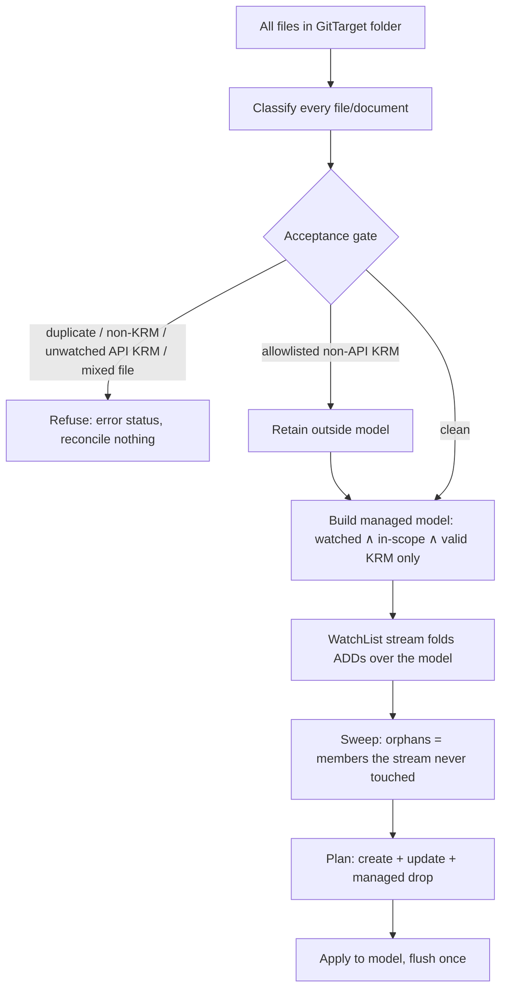

# Reconcile via WatchList + Mark-and-Sweep

> Status: design direction, captured 2026-06-04.
> Related:
> [current-manifest-support-review.md](../../finished/current-manifest-support-review.md),
> [gvk-gvr-mapping-layer.md](../../finished/gvk-gvr-mapping-layer.md),
> [current-manifest-support-review-feedback.md](../../finished/current-manifest-support-review-feedback.md),
> [`internal/git/manifestedit/DECISION.md`](../../../internal/git/manifestedit/DECISION.md)

## Summary

The initial reconcile of a GitTarget — bringing the git folder in line with the
watched API resources — should be driven by the Kubernetes **streaming list
watch** (`sendInitialEvents`), folded over a fully materialized in-memory model of
the git folder, and closed with a **mark-and-sweep** of the resources the API did
not stream.

This replaces the current `FolderReconciler` design (a GVR diff between a
path-derived git scan and a cluster snapshot — see the feedback note) with a
single, consistent mechanism:

```text
build managed model from worktree
open one streaming-list watch per tracked type
fold every initial ADD over the model       (mark touched)
wait for every type's initial-events-end bookmark
orphans = managed docs the stream never touched   (sweep)
plan = creates + updates + managed drops (orphans)
apply plan to the model, flush dirty/deleted files once
then transition into steady-state watch
```

The streaming watch gives us, for free, the one guarantee the old design lacked:
a **single consistent snapshot revision** to pin the whole plan to.

## The Central Invariant: the managed model only ever holds tracked KRM

The mark-and-sweep model contains **only valid, tracked (watched), in-scope KRM
documents**. Nothing else is a member, and only members can ever carry a delete
candidacy.

Concretely, a document is a member of the managed model iff **all** hold:

- it parses as valid KRM (has `apiVersion` + `kind` + a concrete identity);
- its GVK is in the GitTarget's **watched** set;
- its `(namespace)` is within the GitTarget's watch **scope**.

Everything that is not a tracked, in-scope KRM document is handled before the
model is built (see the Non-Negotiable Design Decisions in the main review):

- **non-YAML files** (`README.md`, scripts, images) — not manifests; ignored,
  never loaded, never a refusal;
- **non-KRM YAML** — refused at acceptance, never reaches the managed model;
- **unwatched API-backed KRM** — refused at acceptance, never pruned;
- **allowlisted non-API KRM** such as `kustomization.yaml` — retained on disk,
  never materialized, never swept, and refused if mixed into a multi-document file
  with managed resources;
- **watched KRM out of scope** (right kind, wrong namespace) — also refused at
  acceptance. We do **not** leave it as a silent non-member: a managed folder
  carrying a KRM document we will not materialize is precisely the half-managed
  state this design forbids.

This is the safety property that matters most, and it now rests on an even simpler
foundation than per-document membership flags: **the managed model contains
nothing but tracked, in-scope KRM.** API-backed KRM outside that set refuses the
GitTarget outright. Allowlisted non-API KRM is outside the model by design; it is
retained as auxiliary input, not as a managed document.

This sits *after* the acceptance gate from the main review. Acceptance still scans
the whole folder, classifies every file, and **refuses** the GitTarget on
duplicate identities, non-KRM YAML, unwatched API-backed KRM, or mixed
managed/allowlisted multi-document files. By the time the managed model is built,
every materialized document is content we are entitled to manage.



## Why the Streaming List Watch

Kubernetes' streaming-list watch — a `WATCH` with `sendInitialEvents=true`,
`resourceVersionMatch=NotOlderThan`, and `allowWatchBookmarks=true` — emits a
synthetic `ADDED` event for **every existing object**, then a **bookmark** event
carrying the `k8s.io/initial-events-end` annotation and the resourceVersion at
which that initial set is consistent, and then continues with live changes.

This is a better fit than `LIST` + `WATCH` for three reasons:

1. **It is the consistency boundary.** The bookmark's resourceVersion is exactly
   the `(commit SHA, cluster snapshot RV)` pin the feedback note asked for. The
   plan computed at the bookmark is valid for a single, named cluster revision —
   no "did the cluster change between my LIST and my WATCH" race.
2. **The bookmark is the sweep gate.** "Initial sync complete for this type" is an
   explicit, observable event, not a guess. Sweep is only safe once marking is
   complete; the bookmark tells us precisely when that is (see below).
3. **It folds straight into steady state.** The same stream that delivered the
   initial set keeps delivering live events from the same revision, so the
   bootstrap reconcile and the steady-state watch are one connection, not two
   subsystems with a handover.

**Availability fallback.** Streaming lists need a reasonably modern cluster
(client-go `WatchListClient`; server `WatchList`). Put both paths behind the
injectable API-source abstraction: streaming where available, classic
`LIST(at RV) → WATCH(from RV)` otherwise. The reconcile logic does not care which
produced "the set of tracked resources at RV X" — it only consumes that set and
the revision. This is the same source abstraction the analyzer/CLI already needs.

## Mark-and-Sweep, Done Safely

The instinct — initialize every managed document as a delete candidate, clear the
candidacy on the matching ADD, delete the survivors — is textbook mark-and-sweep
(it is how `kubectl apply --prune` and most GitOps prune work). It maps onto the
`FileModel` / `DocumentModel` shape from the main review (where a file's
deletion is the derived `Deleted()` state, not a stored flag). Four edges make it
safe rather than destructive:

### 1. Document granularity, not file

The mark is on the **DocumentModel**. A multi-document file may have some touched
and some swept documents; a file is deleted only when *all* of its managed
documents are swept and none survive. Non-member documents in the same file do
not exist here: unwatched API-backed KRM and mixed managed/allowlisted files are
refused before planning, while allowlisted non-API KRM lives in retained files
outside the model.

### 2. Membership replaces the "is it watched?" check

Per the central invariant, sweep operates only over members of the managed model.
There is no per-document "is this one safe to delete?" branch on the sweep path,
because non-members are not in the set. This is the safety-by-construction the
GitTarget owner asked for: unwatched API-backed KRM is refused before sweep, and
allowlisted non-API KRM is never assigned a delete candidacy.

### 3. No bookmark, no sweep

Marking must be **complete** before sweeping, across **every** tracked type:

- Sweep runs only after every watched type's `initial-events-end` bookmark has
  arrived. Sweeping after type A's bookmark but before type B's would delete all
  of B's manifests as phantom orphans.
- If any initial sync **fails** before its bookmark (connection drop, throttle,
  partial stream), the whole reconcile **aborts and drops nothing.** A partial
  mark must never drive a sweep.

This is the same "fail loudly, never act on a partial view" rule already in
`Manager.GetClusterStateForGitDest`. The managed drop inherits it verbatim.

### 4. Set-difference over mutable flags

Rather than toggling `Deleted` on the live model as ADDs stream in, collect the
streamed identities into a set and compute orphans as a **pure, one-pass
set-difference at the bookmark**:

```text
orphans = { d ∈ managedModel | d.identity ∉ streamedSet }
```

Preferred over live flag mutation because:

- the model stays immutable until the bookmark, so a failed/partial stream leaves
  no half-applied delete flags to unwind;
- the sweep is a pure function of `(managedModel, streamedSet)`, which composes
  with the `f(fs.FS) → Plan` boundary the main review argues for;
- it is the same `ByResourceIdentity` index doing the work either way — the
  immutable version is simply safe by construction instead of safe-if-you-reset.

The flag-toggle and the set-difference are isomorphic; we choose the one that is
safe without remembering to clean up.

## Two Paths, One Plan Type

| Path | When | How deletes are derived |
|---|---|---|
| **Resync** | initial reconcile, resync, store rebuild | mark-and-sweep: orphans = members not in the streamed set |
| **Steady state** | after all bookmarks | one plan action per live watch event (patch / delete-document / create) |

Both emit the same `Plan`. Steady state does **not** re-mark-and-sweep the whole
folder on every event — sweep is the bootstrap/resync mechanism only. A live
`DELETED` event is an explicit `delete-document`; a live `ADDED`/`MODIFIED` is a
create/patch. The store is built once and maintained incrementally; sweep is what
runs when we (re)establish the snapshot, not per event.

## Source Code Concepts That Could Be Thrown Away

This design removes whole concepts, not just lines. The following are deletion
candidates once the store + streaming reconcile + plan-then-flush are in place.
Names are grounded against today's code.

### Thrown away outright

- **The path-derived git identity.** `parseIdentifierFromPath`
  ([internal/git/helpers.go](../../../internal/git/helpers.go)) and
  `listResourceIdentifiersInPath`
  ([internal/git/branch_worker.go](../../../internal/git/branch_worker.go)). Git
  identity now comes from document **content** in the store
  (`ByResourceIdentity` / `ByManifestIdentity`), never from the file path.
- **The GVR set-difference diff.** `FolderReconciler.findDifferences` and the
  `clusterResources` / `gitResources` / `objectForResource` /
  `lastSnapshotStats` machinery
  ([internal/reconcile/folder_reconciler.go](../../../internal/reconcile/folder_reconciler.go)).
  Replaced by mark-and-sweep set-difference over the managed model.
- **The two-snapshot request/response handshake.** The `RequestClusterState` and
  `RequestRepoState` control events, the `ClusterStateEvent` / `RepoStateEvent`
  pair, and the `ReconcileResource` per-resource reminder
  ([internal/events/events.go](../../../internal/events/events.go)), together with
  `OnClusterState` / `OnRepoState` / `ResetState` / `HasBothStates` /
  `StartReconciliation`
  ([internal/reconcile/folder_reconciler.go](../../../internal/reconcile/folder_reconciler.go)).
  Cluster state now arrives as the streaming-watch initial events; repo state is
  the in-memory store. There is no "reconcile when both have ever arrived" gate —
  there is one snapshot pinned to one bookmark RV.
- **The per-event locator and per-batch inventory cache.** `manifestLocator`,
  `manifestTarget`, `newManifestLocator`, `inventoryFor`, `locate`, and the
  canonical-path stat fast path inside `locate`
  ([internal/git/git.go](../../../internal/git/git.go)). The store *is* the
  inventory, built once and maintained; placement is a property the store answers,
  not a per-event lookup.
- **The event-by-event write control flow.** `applyEventToWorktree` and the
  `handleCreateOrUpdateOperation` / `handleDeleteOperation` dispatch
  ([internal/git/git.go](../../../internal/git/git.go)). Replaced by apply-plan +
  flush-once.

### Absorbed, not deleted (logic survives, shape changes)

Do **not** delete these — their decision logic moves into Plan computation / Apply:

- `reconcileAgainstExisting`, `preserveExistingFormatting`,
  `manifestsAreSemanticallyEqual`, `canonicalizeManifestForComparison`
  ([internal/git/git.go](../../../internal/git/git.go)) — the no-op detection,
  in-place-vs-whole-replace choice, and multi-doc safety guard become **plan
  decisions** (patch / replace / skip) computed once, not re-derived per event.
- `manifestreport.BuildReport`
  ([internal/manifestreport/report.go](../../../internal/manifestreport/report.go))
  — graduates into the Plan computation; it is already the create/update/delete/
  skip comparison, just read-only today.
- `manifestedit.Apply` / `manifestedit.DeleteDocument` — kept verbatim as the
  per-document edit mechanism the Apply step calls.

### Stays (do not confuse with the throwaway path)

- `ResourceIdentifier.ToGitPath`
  ([internal/types/identifier.go](../../../internal/types/identifier.go)) — still
  the **new-file placement** policy (identity → path). Only the *reverse*
  (`parseIdentifierFromPath`, path → identity) is thrown away.

## Consistency and Failure Model

- The plan is valid for one `(commit SHA, snapshot RV)` pair. The commit SHA is
  the checked-out worktree; the RV is the max across the joined initial-sync
  bookmarks (or each type pinned to its own bookmark RV).
- No bookmark for a type → that type's sync is incomplete → abort, drop nothing.
- A stream that errors after its bookmark (during steady state) does not threaten
  the sweep; it triggers a re-list/re-watch and, if the snapshot is rebuilt, a
  fresh mark-and-sweep at a new RV.
- Acceptance failures (duplicate / non-KRM / unwatched API-backed KRM / mixed
  managed-allowlisted file) short-circuit before any stream is opened: refuse,
  reconcile nothing.

## Lazy Materialization Synergy

Mark-and-sweep needs only **identity + location + membership** per managed
document — a cheap header parse (`apiVersion` / `kind` / `metadata`), not the full
`manifestedit` node tree. Parse a document's body only when a plan action touches
it (a patch). This keeps the resync of a large, cluster-wide watch bounded: the
streamed set and the managed identity index are small per-document, and only the
touched documents pay the full-parse cost.

Steady state has the same shape on the time axis. High-rate watch events fold into
a coalesced `PendingChanges` buffer (last-writer-wins per identity) without touching
the worktree, and file bytes are hydrated only when the existing batch/commit
mechanism fires — and only for the files that batch references. See "Two boundaries"
in the main review. Bounded *spatially* (touched documents only) and *temporally*
(commit boundary only), the per-batch cost tracks what actually changed, not the
folder size or the event rate.

## Open Questions

- **Multi-stream join cost.** A GitTarget watching many GVKs opens many streams
  and waits for many bookmarks. Is there a bound on concurrent streams, and how do
  we surface "waiting for N of M initial syncs" in status?
- **Out-of-scope watched-GVK documents.** Decided: **refused** at acceptance, not
  silently left (see Non-Negotiable Design Decisions). The earlier "what if two
  GitTargets share the folder" nuance is also closed: GitTargets never overlap
  (no nesting, no shared paths — enforced at admission), so every folder has exactly
  one owner and "out of scope for this target" can never be "in scope for some other
  target" claiming the same documents. Out-of-scope content simply refuses.
- **Resync trigger policy.** When do we rebuild the snapshot and re-run
  mark-and-sweep vs. trust incremental steady-state events (watch error budget,
  resourceVersion-too-old, GitTarget spec change, worktree drift)?

## Sequencing

This slots into the main review's phases as the concrete reconcile mechanism for
phases 2 (API source), 3 (plan model), 5 (scan mode), and 7 (plan-then-flush):

1. Define the API source abstraction with a streaming-list implementation and a
   `LIST + WATCH` fallback; both yield `(tracked resource set, snapshot RV)`.
2. Build the managed model as the watched ∧ in-scope ∧ valid-KRM view over the
   store, with membership decided at classification time.
3. Implement the resync mark-and-sweep as set-difference at the joined bookmark,
   producing managed-drop plan actions; gate on all bookmarks, abort on partial.
4. Render the resync plan in scan mode (dry-run) before arming the flush.
5. Wire steady-state per-event plan actions over the same maintained model.
