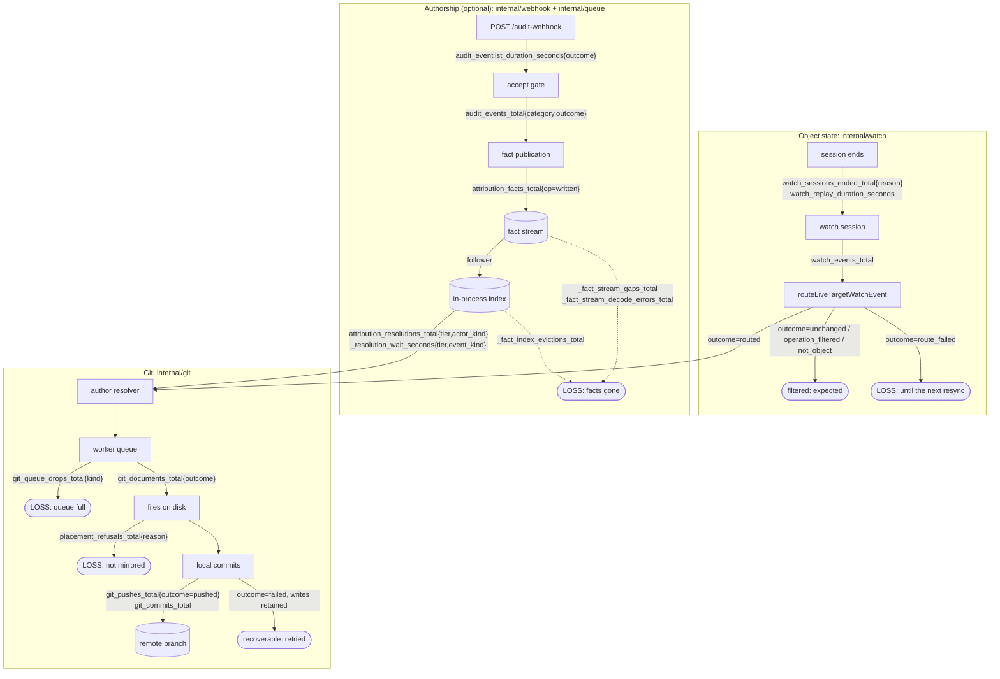

# Metrics, status, and the shape of the pipeline

> **built.** Phases 1-4 shipped 2026-09; only the dashboard and alert rules (Phase 5) are open. It
> stays in `design/` because Go source cites it by path as the rationale for what the code does.
> It **replaces** the previous revision of this file wholesale; the old text is in `git log`.
> Index: [`../INDEX.md`](../INDEX.md)
>
> This is the single canonical metrics document for *why the surface has this shape*. The live
> instrument list, label vocabularies and queries are
> [interpreting-metrics.md](../interpreting-metrics.md), which is the one place they are maintained;
> [architecture.md](../architecture.md) is the spine and
> [spec/status-conditions-guide.md](../spec/status-conditions-guide.md) owns the status half.

## 1. The three questions this answers

1. **Do the metrics carry logical names, and do they measure the right things?** Mostly the second,
   often not the first. Six instruments are exact duplicates of another series, three names claim
   something the recording site does not do, and three instrument doc comments name label values
   that no longer exist.
2. **Can an operator see events moving through the system, and see the exceptions?** No. The
   ingestion half of the pipeline emits nothing at all, the push (the stage that puts an object in
   Git) emits nothing, and the two places the operator *drops work on the floor* are log lines
   with no counter. There is no shared vocabulary that would let a funnel be drawn even if the
   stages existed.
3. **Is status counting things it should not?** Yes, in three places, and one of them is a field
   that has never been written at all.

The answer to all three is one change: **one boundary, one counter, one bounded `outcome`**, applied
along both paths an object's mirror depends on, plus the removal of everything that says the same
thing twice. It happens to end with slightly fewer instruments than today, but **the count is not
the goal and must never be used as one**: a counter that survives because merging it would have
been convenient is a counter that lies about its unit, and §5.2 records where an earlier draft of
this plan did exactly that.

## 2. What the audit found

Every claim below was read out of the code, not inferred.

### 2.1 Exact duplicates: the same series published twice

| Duplicate | Evidence |
|---|---|
| `git_operations_total` and `objects_written_total` | Both `Add(w.ctx, int64(eventCount))` with the same value and no labels, four lines apart in `recordPendingWritesMetrics` ([branch_worker.go](../../internal/git/branch_worker.go)). Two names, one number. |
| `secret_encryption_cache_hits_total` and `secret_encryption_marker_skips_total` | Incremented on consecutive lines of `cachedEncryptedContent` ([content_writer.go](../../internal/git/content_writer.go)), on every path, unconditionally. They can never differ. |
| `secret_encryption_attempts_total` | Incremented immediately before `Encrypt`, so it is exactly `success + failures`. Three counters describe two outcomes. |
| `audit_eventlists_total{outcome}` | Recorded at the same site, with the same attribute set, as `audit_eventlist_duration_seconds{outcome}`, whose `_count` series **is** that counter. A histogram already ships its own observation count. |
| `audit_eventlist_events_total{outcome}` | Counts decoded event items; `audit_events_total` counts the same items once each, with `group`/`version`/`resource`/`verb`/`outcome` on them. The coarse counter is the fine one summed. |
| `status.streams.summary` | Restates `ready` and `total` as `"3/4"`, which its own doc comment admits the API conventions rule out. |

### 2.2 Names that describe something the code does not do

- **`commits_total` says "pushed" and counts "committed".** The doc comment reads *"counts commit
  batches pushed to git"*; the recording site is `commitPendingWrites`, which runs before
  `pushPendingCommits` and is never re-run when a push is retried. During a total remote outage the
  product's headline metric keeps climbing while nothing reaches Git. It is a real number; it is
  not the one its name promises, and there is no metric for the one that matters.
- **`git_operations_total` and `objects_written_total` both count events in a flush**, not Git
  operations and not documents written. A flush of one event that rewrites six files counts one.
- **`target_reconcile_completed_total`** counts a completed **watch recovery**: a cursor resume or
  an applied per-type reconcile. Nothing about it is specific to a "target reconcile", and the name
  is why its `trigger` label was documented wrongly (below).

### 2.3 Label drift: instrument comments naming values that do not exist

[exporter.go](../../internal/telemetry/exporter.go) is the first thing a reader opens, and three of
its comments are stale:

| Instrument | Comment says | Code emits |
|---|---|---|
| `PlacementsTotal` | `declared / kustomize_root / canonical` | `by_type` / `default` / `kustomize_root` / `canonical` |
| `TargetReconcileCompletedTotal` | `trigger` is `rule_change` | `cursor_resume`, `type_reconcile` |
| `WatchPlanTriggersTotal` | `declare, rule_change, api_surface, source_namespace, periodic` | `declare`, `rule_change`, `shared_refresh`, `periodic` |

[interpreting-metrics.md](../interpreting-metrics.md) is right in two of these three cases, which is
the wrong way round: the source of truth should be beside the code.

One documented **query** is wrong for the same reason. "Cache effectiveness" is given as
`cache_hits / attempts`, but the cache is consulted before `attempts` is incremented and returns
early on a hit, so the two counters are over disjoint populations and the ratio can exceed 1.

### 2.4 Exceptions with no counter: the silent drops

The previous revision of this plan set the rule (*"every silent drop gets a counter"*) and the code
has three places that break it. Each is a log line and nothing else.

- **A full branch-worker queue drops the write.** `enqueueRequest` logs *"Event queue full, request
  dropped"* and returns false ([branch_worker.go](../../internal/git/branch_worker.go)). `EnqueueAttach`
  does the same for a `CommitRequest` attach. `branch_worker_queue_depth` shows the queue was deep;
  nothing anywhere says work was thrown away. A storm is exactly when this fires.
- **A push that fails every retry is invisible.** `pushPendingCommits` gives up after three attempts
  and `pushPending` logs *"Push failed; pending writes retained for retry"*. No counter, no latency
  histogram, no conflict count. The mirror stops advancing and every metric reads healthy.
- **A route failure at the watch boundary is a `V(1)` log.** `routeLiveTargetWatchEvent` logs
  *"target watch route failed"* ([target_watch.go](../../internal/watch/target_watch.go)) and the
  event is gone until the next resync.
- **A failed commit drops its whole window, and this was the largest hole.**
  `finalizeOpenWindowWithReason` logs *"Commit failed; dropping open window"* and discards every
  event in it; the atomic path does the same for a snapshot request. It happens AFTER routing and
  BEFORE pushing, so neither the queue-drop counter nor the push counter can see it, and the mirror
  falls behind for every object in that window until a resync re-derives them. A refusal at least
  moves a GitTarget condition, but a condition is not a rate, and the transient write fault moves
  nothing at all. `git_commit_failures_total{kind,reason}` closes it.

### 2.5 Gauges that go stale during the incident they exist to detect

Both saturation gauges are **pushed from inside the loop they measure**, so the loop stalling is
exactly what stops them being republished.

- **`branch_worker_queue_depth` reads 0 through the first stall.** `syncQueueDepthMetric` runs at the
  *bottom* of each loop iteration ([branch_worker.go](../../internal/git/branch_worker.go)). From
  idle: fifty items enqueue and the gauge is still 0 because nothing has published; the loop then
  wakes and blocks inside `handleQueueItem`, and the gauge stays 0 for as long as that takes. The
  comment's claim that "the gauge converges to 0 once every accepted item has been handled" is true
  and beside the point, because it also *starts* at 0 and does not move while work piles up.
- **`watch_plan_oldest_dirty_age_seconds` freezes at the value it held when the loop hung.**
  `publishDirtySetDepth` is called once per owner-loop turn
  ([owner_observability.go](../../internal/watch/owner_observability.go)). A pass that wedges stops
  the turn, so the age the alert is written against stops advancing at the moment it becomes
  interesting.

The fix is the same for both, and it is a rule rather than a patch: see principle 6 in §3.

### 2.6 A misconfigured audit endpoint looks exactly like a silent one

`ServeHTTP` refuses a request for its method, its path, or an unknown route and returns **before**
any instrument is touched ([audit_handler.go](../../internal/webhook/audit_handler.go)). So an
apiserver posting to the wrong path, or under a route no `ClusterProvider` claims, produces the same
ingress metrics as an apiserver posting nothing at all: none.

That is the most likely audit misconfiguration there is, and it was the one shape the ingress metric
could not show. The fix is three bounded rejection outcomes: `bad_method`, `bad_path`,
`bare_endpoint_disabled`: on the instrument that already exists, and a timer that starts before the first
gate rather than after the last one.

### 2.7 Discovery is blind to every cluster but the local one

`refreshClusterCatalog` guards both `recordCatalogRefresh` and `recordCatalogStats` with
`if cc.isLocal()` ([manager_catalog.go](../../internal/watch/manager_catalog.go)), and the comment
says why: the metrics carry no cluster label, so publishing a remote cluster's stats under them
would overwrite the local cluster's series. That was correct when there was one cluster. Since the
config-plane split a `GitTarget` can mirror a remote source cluster through `spec.kubeConfig`, and a
degraded `APIService` there produces **no signal at all** while `api_catalog_group_versions` sits
reassuringly at zero degraded. The label is the fix, not the guard.

### 2.8 Recording boundaries: where a counter fires matters as much as what it counts

Instrumenting the stages exposed a second class of defect, and it is the one that survives review
longest because the metric exists and looks plausible. Six recording sites were wrong about *when*:

| Site | Fired | Should fire |
|---|---|---|
| `git_commits_total` | at local commit creation | on a successful push, from the writes that SURVIVED the replay: a conflict replay rebuilds them, and a write another writer already applied produces no replacement commit |
| `git_documents_total` | as each document was applied into a buffer | after flush, since a resync can apply everything and then abort on a precondition, writing nothing |
| `watch_event_handling_seconds` | in `processLiveTargetWatchEvent` | at `routeLiveTargetWatchEvent`, because a COLD-started watch streams through `handleTargetWatchSessionEvent` instead and reported no occupancy at all |
| `watch_recovery_total{mode="list_fallback"}` | when the fallback was chosen | when it completed, since the counter is documented as completed recoveries and the LIST after it can still fail |
| `watch_sessions_ended_total{reason="expired"}` | at the outer session end | where the expiry is detected, because the wrapper swallows the sentinel and falls through to a replay |
| `git_documents_total{outcome}` for a refusal | as `unchanged` | as `refused`, because a Secret the writer DECLINED to place is not a document it found identical |

None of these is a missing metric. Each is a metric that answers confidently and wrongly, which is
the failure mode this whole plan exists to remove, arriving through the back door.

### 2.9 Two labels that were not what they said

- **The resync census had no GitTarget.** `recordDocument` read identity off the event, and the
  resync path builds its events without target fields, so every production snapshot write and every
  sweep delete filed under empty labels. An empty label set is worse than none: it looks like a real
  series. The batch already carries the target; it just was not being asked.
- **`unknown_route` named a rejection that cannot happen.** `resolveRoute` accepts any named route
  as-is, deliberately, because a route is a partition name rather than a claim about an object.
  The only route-shaped rejection is the bare `/audit-webhook` with no annotation key, so the value
  is now `bare_endpoint_disabled`. [configuration.md](../configuration.md) said the opposite and is
  corrected with it.

### 2.10 The flow cannot be drawn, and it is not close

Watch ingestion has **no instrument at all**. So the funnel an operator would want:

```text
watch events seen -> filtered -> routed -> documents written -> commits -> pushed
```

This is measurable only at the third-to-last step onward, and even there `objects_written_total` counts
the wrong unit and `commits_total` counts a stage earlier than it claims. There is also no shared
convention: `outcome`, `reason`, `trigger`, `source`, `disposition`, `op`, `mode`, `state` and
`category` all name "what happened to this thing" on different instruments, so no single query can
ask "show me everything that did not make it".

## 3. Principles

Carried forward from the previous revision, and still right:

1. **Architecture is the spine.** Every metric maps to a named stage of
   [Common flows](../architecture.md#common-flows).
2. **Every metric has a recording site and an interpretation**, both in the same change, or it does
   not merge.
3. **Every silent drop gets a counter**, at the point the decision is made.
4. **Label discipline.** Bounded cardinality only. Never an object's name or namespace. Identity
   labels stay prefixed (`gittarget_*`, `provider_*`) to survive a `honor_labels=false` pod scrape.
5. **Degradation is loud.** Running in a degraded shape is a visible state, not a silent one.

Eight new ones. The first three are what makes the flow drawable; the next three keep a gauge honest
during an incident and cheap enough not to cause one; the last two are about where a call goes:

1. **One boundary, one counter, one bounded `outcome`: when the unit is the same.** Where a
   population divides, it divides *inside* one counter on a label named `outcome`. Two counters over
   the same population is the defect §2.1 keeps finding. The qualifier is load-bearing and was
   learned the hard way: **things counted in different units must never share a counter**, however
   often they are read together. §5.2 is the worked example.
2. **`outcome` values are classified, not ranked.** A frozen enum, and each value belongs to one of
   four classes:

   | Class | Means | Belongs on the exceptions panel? |
   |---|---|---|
   | **expected** | the pipeline working: `routed`, `unchanged`, `operation_filtered`, `cached`, `retained`, `deleted_*` | no |
   | **degraded** | it worked, on weaker evidence or in a fallback shape: `name` and `deletecollection_scope` tiers, `list_fallback` recovery, `unresolved` authorship | no, but a trend panel |
   | **recoverable** | it failed and will be retried: a failed push holding its writes, a resync that will re-run | only as a rate, never as a loss total |
   | **loss** | an observed change that did not reach Git and nothing will retry: `route_failed`, a queue drop, a placement refusal, a trimmed fact | yes |

   An earlier draft said each counter has "exactly one healthy value". That is false of most of
   them: `unchanged`, `retained` and `cached` are the writer doing its job.
3. **`outcome` is the universal word.** `reason`, `trigger`, `op`, `state`, `mode`, `disposition`,
   `source` and `category` survive only where they answer a *different* question than "how did this
   end". `source` and `disposition` on placement do; `trigger` on a recovery counter does not.
4. **A metric counts throughput; status states a condition.** The two overlap more than a slogan
   allows: see §6, which is deliberately the most cautious section here.
5. **A gauge is read at scrape time, never pushed from the loop it measures.** Every gauge here
   becomes an OpenTelemetry *observable* gauge whose callback reads the live state when Prometheus
   asks. A gauge published from inside a work loop reports the loop's last healthy moment for as
   long as the loop is stuck, which is precisely backwards (§2.5).
6. **A gauge source reads published state and computes nothing.** The callback runs on the scrape
   goroutine, so anything it triggers competes with the work it is measuring. This is not a
   theoretical hazard: the first `watch_types` source called `StreamSummaryForGitTarget`, which
   calls `refreshWatchedTypeTables`, a discovery-backed rebuild of every cluster's type registry,
   once per target per scrape. Against a wildcard rule resolving 58 types it starved the replaying
   streams and the GitTarget sat at `0/58 streams running` until an e2e spec timed out. A gauge that
   reports the last published resolution is both cheaper and more honest than one that resolves its
   own.
7. **A counter fires where the thing it names actually happened.** Not where it was decided, not
   where it was attempted, and not where it was convenient. §2.8 lists six sites that had this
   wrong, and every one of them produced a confident, plausible, incorrect number: work counted as
   committed that a replay discarded, documents counted as written by a flush that aborted, a
   recovery counted before it recovered. This is the harder half of "one boundary, one counter":
   picking the boundary is easy, and putting the call at it is where the mistakes live.
8. **"How long" is exported as a timestamp, not as an age.** An age has to be recomputed to stay
   true; a timestamp is true forever once written, and `time() - <gauge>` does the arithmetic in
   PromQL. This is
   [Prometheus's own instrumentation advice](https://prometheus.io/docs/practices/instrumentation/#timestamps-not-time-since),
   and `attribution_fact_follower_last_success_timestamp_seconds` already follows it. So does the
   dirty-set gauge after this plan.

## 4. The model: two paths, joining at the resolver

The product has **two** ingestion paths, not one. Watch carries object state; audit carries the
author's name. They never call each other and meet only at the resolver, where a watch event asks
the fact index who did this. Treating audit as a lens on the watch pipeline, which an earlier
draft of this section did, loses the half of the surface that is already best instrumented and the
questions that are specific to it.

### 4.1 The two paths, with the metric on every edge



The watch path decides whether an object reaches Git. The audit path decides only **whose name is on
it**: a missing or late fact changes the author, never the state. That invariant is why the two are
drawn apart, and why an audit outage is never a mirror outage.

### 4.2 The object-state stages

| Stage | Counter | Expected values | Loss |
|---|---|---|---|
| 1 Ingest | `watch_events_total` | `routed`, `unchanged`, `operation_filtered`, `bookmark`, `shutdown` | `route_failed` |
| 2 Queue | `git_queue_drops_total` | (no increment) | every increment |
| 3 Write | `git_documents_total` | `written`, `deleted_live`, `deleted_sweep`, `unchanged`, `retained` | `placement_refusals_total`, beside it |
| 4 Commit | `git_commits_total` | all: recorded on a successful push, so it cannot claim a commit the remote never took |: |
| 5 Push | `git_pushes_total` | `pushed` | `failed` is **recoverable**, not loss: the writes are retained and retried |

The funnel is four lines of PromQL:

```promql
sum(rate(gitopsreverser_watch_events_total{outcome="routed"}[5m]))
sum(rate(gitopsreverser_git_documents_total{outcome="written"}[5m]))
sum(rate(gitopsreverser_git_commits_total[5m]))
sum(rate(gitopsreverser_git_pushes_total{outcome="pushed"}[5m]))
```

The stages count different units on purpose (an event is not a document, and a document is not a
commit), so this is a funnel, never a subtraction. §10 says so again, because it is the mistake this
shape invites.

### 4.3 The authorship questions

Audit gets its own row and its own questions, because they are not answerable from the object-state
stages at all. This restores, in the shape the shipped code has, the deep dive an earlier revision
of this plan carried; the contract itself lives in
[spec/attribution.md](../spec/attribution.md#what-is-observable).

| Question | Signal |
|---|---|
| Are audit requests arriving, and are they being accepted at the door? | `audit_eventlist_duration_seconds_count{outcome}`: including the `bad_method` / `bad_path` / `bare_endpoint_disabled` rejections §2.6 adds |
| Which events are accepted, filtered, or unusable? | `audit_events_total{category, outcome, group, version, resource, verb}` |
| Did accepted events actually produce facts? | the same counter's `queued`, `write_error` and `no_attribution_fact` outcomes |
| Is the transport being consumed healthily? | `_fact_follower_errors_total`, `_fact_follower_last_success_timestamp_seconds`, `_fact_index_entries`, and the three loss counters |
| Did the evidence name an actor, and how good was it? | `attribution_resolutions_total{tier, actor_kind}`, `_resolution_wait_seconds{tier, event_kind}` |
| Did a real name reach Git? | `git_commits_total{author_kind}`: `unresolved` is the one to watch |

### 4.4 One selector for the loss paths

The loss values are shaped so that a **recording rule** can union them into one series with two
labels, which is what makes the exceptions panel and the paging alert one expression each. The rule
normalizes every source label into `reason`, because a panel grouping by four different label names
is not one panel:

```promql
# gitopsreverser:loss:rate5m{stage,reason}
  label_replace(label_replace(
    sum by (outcome) (rate(gitopsreverser_watch_events_total{outcome="route_failed"}[5m])),
    "reason", "$1", "outcome", "(.*)"), "stage", "ingest", "", "")
or label_replace(label_replace(
    sum by (kind) (rate(gitopsreverser_git_queue_drops_total[5m])),
    "reason", "$1", "kind", "(.*)"), "stage", "queue", "", "")
or label_replace(
    sum by (reason) (rate(gitopsreverser_placement_refusals_total[5m])),
    "stage", "write", "", "")
or label_replace(label_replace(
    sum by (transport) (rate(gitopsreverser_attribution_fact_stream_decode_errors_total[5m])),
    "reason", "undecodable_entry", "transport", "(.*)"), "stage", "attribution", "", "")
```

**It is a union, not a total.** `route_failed` and a queue drop can describe the same event, because
a full worker queue is one of the ways a route fails, so summing the series double-counts. Read it as "the
loss paths that are active right now, and how hot each is", which is the question an operator has,
and never as a count of lost objects. The attribution arm carries entries, not facts (§5.2), so it
is never added to anything either; it is on the panel because it belongs to the same shift.

## 5. The instrument set, before and after

Names lose their prefix `gitopsreverser_` in these tables only. The instrument count barely moves.
It is not the point, and §5.2 is where treating it as the point produced a wrong metric.

### 5.1 Deleted (nothing replaces them)

| Instrument | Why |
|---|---|
| `git_operations_total` | identical to `objects_written_total` (§2.1) |
| `audit_eventlists_total` | identical to `audit_eventlist_duration_seconds_count` |
| `audit_eventlist_events_total` | `audit_events_total` is the same population with better labels |
| `api_catalog_generation` | an internal counter with no operator action attached; `api_catalog_refresh_total{outcome="changed"}` is the same information, actionable |
| `watch_plan_triggers_coalesced_total` | becomes a `coalesced` label on `watch_plan_triggers_total`, so the ratio stops being a cross-metric query |

### 5.2 Merged (many into one), and one merge that was wrong

| Merged away | Into | Notes |
|---|---|---|
| `secret_encryption_{attempts,success,failures,cache_hits,marker_skips}_total` | `secret_encryptions_total{outcome}` | `outcome`: `encrypted` / `failed` / `cached`, all counting **one document's encryption decision**. `attempts` was incremented immediately before `Encrypt`, so it was exactly `success + failures`; `cache_hits` and `marker_skips` were incremented on consecutive lines of one branch, on every path, so they could never differ. This also fixes the documented "cache effectiveness" ratio, which divided two counters over disjoint populations and could exceed 1 |

**And one that was proposed here and is wrong.** An earlier revision of this plan folded
`attribution_fact_index_evictions_total`, `_fact_stream_gaps_total` and
`_fact_stream_decode_errors_total` into a single `attribution_facts_lost_total{reason}`, on the
argument that all three mean "attribution that will never happen", that they were already drawn on
one panel, and that they wanted one alert. The first three statements are true. The conclusion does
not follow, because **the three do not count the same thing**:

| Counter | Counts | Facts lost |
|---|---|---|
| an eviction | one **fact** | exactly one |
| a trim gap | one **occurrence** | unknown: the entries are gone, so nobody can say how many |
| a decode error | one **entry**, and [an entry carries a whole audit batch's facts](../../internal/queue/fact_stream.go) | unknown, and at least one |

Their sum is a number in no unit at all, published under a name that asserts a unit. That is the
same class of defect as `commits_total` claiming to count pushed commits (§2.2), arrived at from the
opposite direction: the first was carelessness, this one was tidiness. **A metric's name has to be
true about what it counts before it is convenient.**

So all three stay, with their own names and their own labels (`stream` on the gap counter,
`transport` on the decode counter: both of which the merge would have thrown away). Reading them
together is a *panel's* job and alerting on them together is a *recording rule's*; neither needs the
data model to lie. One further correction while they are here: an eviction does **not** prove the
fact went unused (a fact may have been matched already and then evicted), so it reads as pressure
on the caps rather than as a count of lost joins.

### 5.3 Renamed, and in three cases re-scoped

| Today | After | Change beyond the name |
|---|---|---|
| `objects_written_total`, `resync_sweep_deletes_total`, `prune_retained_documents_total` | `git_documents_total{gittarget_*,group,version,resource,outcome}` | one counter at the writer boundary. `outcome`: `written` / `deleted_live` / `deleted_sweep` / `unchanged` / `retained`. It counts **documents**, not events in a flush, and it closes two gaps at once: the steady-state delete path was never counted, and a document the writer diffed to a no-op was invisible. Three counters over one population become one, which is what principle 1 asks for |
| `commits_total` | `git_commits_total` | same labels, but **recorded on successful push** rather than on local commit creation. A push that never lands now counts nothing, which is the correction §2.2 asks for; the retry loop rebuilds commits, so counting at the terminal success is also the only place the accounting is right exactly once |
| `branch_worker_queue_depth` | `git_queue_depth` | same labels, but an **observable** gauge whose callback reads `inflightItems` plus the retained-work flag at scrape time, so it can no longer read 0 through a stall (§2.5) |
| `resync_background_failures_total` | `git_resync_failures_total` | same labels |
| `target_reconcile_completed_total{trigger}` | `watch_recovery_total{gittarget_*,group,version,resource,mode}` | `mode`: `cursor_resume` / `type_reconcile` / `replay` / `list_fallback`. Says what it measures, gains the two recovery modes that were never counted, and merges with the `watch_recovery_total` the previous revision had planned separately |
| `watched_types` | `watch_types{gittarget_*,state}` | `state`: `streaming` / `replaying` / `blocked`, as an observable gauge. **Not** `watch_streams`: `streamSummaryCounts` aggregates by resource TYPE, not by watch connection: one type can be watched by several streams across namespaces: so `watch_streams` would have been another name that describes something the code does not do, in a plan whose whole subject is that. It guarantees `Total == Ready + Replaying + Blocked`, so `sum by (gittarget_name)` is the resolved-type count the old gauge published and `state="blocked"` is exactly the difference between "resolved in config" and "actually running" |
| `watch_plan_oldest_dirty_age_seconds` | `watch_plan_oldest_dirty_since_timestamp_seconds` | an observable gauge holding the Unix time the oldest dirty target went dirty. Read it as `time() - <gauge>`. An age has to be recomputed by the loop that is stuck; a timestamp does not (§2.5, principle 5) |
| `api_catalog_resources`, `_group_versions`, `_refresh_total`, `_refresh_duration_seconds` | the same names, plus a `source_cluster` label | and the `if cc.isLocal()` guards come off, so a remote source cluster's degraded API surface is finally visible (§2.6) |
| `attribution_resolution_wait_seconds{tier,event_kind,group,version,resource}` | `attribution_resolution_wait_seconds{tier,event_kind}` | the type triple comes **off the histogram**. A histogram multiplies its label set by its bucket count, so this is the widest family in the system; the question it answers: "is the grace window paying for itself": is a per-tier question, and per-type attribution coverage stays available on `attribution_resolutions_total`, which is a counter and cheap. Deferred, not in this PR: it is a break with no defect behind it |

### 5.4 Added

| Instrument | Type | Labels | Closes |
|---|---|---|---|
| `watch_events_total` | counter | `gittarget_*`, `group`, `version`, `resource`, `outcome` | the whole ingest stage. One recording site: `routeLiveTargetWatchEvent` is a single switch carrying every terminal branch, so this is one honest boundary, not a scattering. It carries the GitTarget because "which tenant stopped receiving events" is the question, and **not** the watch event type (`added`/`modified`/`deleted`): that halves the series budget, and the written-versus-deleted split is answered better at the writer by `git_documents_total{outcome}` |
| `watch_event_handling_seconds` | histogram | `group`, `version`, `resource` | how long a stream was **busy** on one event, attribution wait included. It is deliberately not the queue delay it was first drafted as: measuring the wait needs an arrival timestamp stamped before the blocking consumer, and the events arrive on a client-go watch channel this process does not fill, so there is nowhere honest to stamp one: timing after the dequeue would name a wait it never observed. Occupancy answers the same question from the other side, because a stream that is busy is a stream nothing else is being read from: `rate(_sum[5m])` approaching 1 means events are queueing behind it. This is the failure that broke a `CommitRequest` e2e spec |
| `watch_sessions_ended_total` | counter | `group`, `version`, `resource`, `reason` | `reason`: `expired` (the cursor fell out of history, forcing a full rebuild), `error`, or `stopped` (the plan retired the stream: routine). Watch stability and `410` pressure |
| `watch_replay_duration_seconds` | histogram | `group`, `version`, `resource` | the cost of a replay, which is what a `410` storm charges |
| `git_commit_failures_total` | counter | `provider_*`, `branch`, `kind`, `reason` | the largest remaining hole (§2.4). `kind`: `window` / `atomic`; `reason`: `refused` (a Git path a human must fix, which will not clear on its own) / `error`. Every increment is a window's worth of events lost until the next resync |
| `git_queue_drops_total` | counter | `provider_*`, `branch`, `kind` | §2.4's first silent drop. `kind`: `write` / `attach` / `resync`. It **overlaps** `watch_events_total{outcome="route_failed"}`: a full queue is one of the ways a route fails, so one dropped event increments both. Two views of one event, never two events |
| `git_pushes_total` | counter | `provider_*`, `branch`, `outcome` | §2.4's second. `outcome`: `pushed` / `failed`, counted once per push cycle at its terminal end. `failed` is **recoverable**, not loss: the writes are retained and a later push carries them, which is why the alert on it needs the second arm in §7 |
| `git_push_retries_total` | counter | `provider_*`, `branch`, `reason` | `reason`: `remote_moved` / `error`. A replay round is not a terminal outcome, so it is its own counter rather than a third `outcome` value. `rate(retries) / rate(pushes)` is the contention signal |
| `git_push_duration_seconds` | histogram | `provider_*`, `branch` | push latency, re-added **with** a recording site this time |

### 5.5 Kept unchanged

Untouched, name and labels: `placements_total`, `placement_refusals_total`,
`placement_kustomization_entries_total` (recent, well-labeled, and `source`/`disposition` answer a
different question than `outcome`); `audit_events_total`; `attribution_resolutions_total`,
`_facts_total`, `_fact_index_entries`, `_fact_index_evictions_total`, `_fact_stream_gaps_total`,
`_fact_stream_decode_errors_total`, `_fact_follower_errors_total`,
`_fact_follower_last_success_timestamp_seconds`, `_transport_info`,
`_collection_without_uidset_total`; `watch_plan_dirty_targets`, `_passes_total`,
`_pass_duration_seconds`.

Changed elsewhere in this document, and listed here only so the inventory is complete:

- `audit_eventlist_duration_seconds` **keeps its name and gains three `outcome` values**
  (`bad_method`, `bad_path`, `bare_endpoint_disabled`, §2.6). Its `_count` series is now the only request
  counter, so it is load-bearing rather than incidental. An earlier draft left it falling between
  the deletion table and this list, which is how a metric gets removed by accident.
- `api_catalog_*` keep their names and gain `source_cluster` (§5.3).
- `watch_plan_triggers_total` keeps its name and gains `coalesced` (§5.1).
- `watch_plan_oldest_dirty_age_seconds` is renamed and re-shaped (§5.3).
- `attribution_resolution_wait_seconds` keeps its name; the label trim is deferred (§5.3).

## 6. Status: one defect fixed, one field deleted, and a question left open

An earlier revision of this section proposed removing `status.streams` and `status.retention`
outright under the slogan *a count in status is a metric that has escaped*. **That slogan is
wrong**, and the proposal is withdrawn. Three objections defeat it, and each is worth stating
because each would have cost information:

- **A current count is not a metric.** `3/4 types ready` is present-tense API state, the kind of
  thing kstatus-style readiness is made of. `git_documents_total{outcome="retained"}` is
  *cumulative*, so it can never answer "how many documents is this target retaining right now": the
  question `status.retention.retainedDocuments` exists for. A counter is not a substitute for a
  gauge-shaped fact, and proposing one as a replacement was a category error.
- **Moving a changing number into a condition message does not stop the churn.** A message that
  reads "3/4 streams running" is rewritten when the ratio moves, exactly as the field was. The
  status write is the same write.
- **The rate rule in [spec/status-conditions-guide.md](../spec/status-conditions-guide.md) is
  right, and these fields mostly pass it.** Stream readiness moves on watch transitions, not on
  throughput. What failed the rule was one field, below.

So this PR does two narrow, defensible things and leaves the rest to be argued on its own evidence.

### 6.1 `status.lastPushTime`: delete it

Declared on `GitTargetStatus`, and the only assignment anywhere in the tree is
`target.Status.LastPushTime = nil`. It has never been published. Every reader that has ever checked
it read its absence as "nothing pushed yet". This is not a design change; it is removing a field
that does not exist in practice.

### 6.2 `status.retention.observedTime`: stop restamping it

This is the one real defect. It was set to `time.Now()` on **every accepted resync report**,
including the routine re-reports that change nothing an operator sees. The count and the mode would
be identical and the timestamp would not, so the next reconcile for any reason at all computed a
non-empty patch and wrote status. A field that moves without its subject moving is a status write
with nothing to say, and it defeated the no-op write suppression every other field here relies on.

Fixed by advancing it only when the roll-up itself changed, which makes it date the **result**
rather than the last scan: exactly what `status.placement.resolvedAtRevision` already does, and for
the same reason. The doc comment now says so, so a timestamp well in the past reads as "stable", not
as "measuring stopped".

The field is also **renamed** `observedTime` → `lastChangedTime`. It behaved this way as soon as the
restamping stopped, but the old name invited clients to read it as a freshness signal, and a
behavioral change under an unchanged name is the kind a consumer discovers in production. The
rename makes the break visible. `retainedDocuments`, `mode`, and the whole of `status.streams` are
**unchanged**.

### 6.3 `lastPushTime` and a branch-head SHA: removed, and why re-adding them is a design question

`lastPushTime` was removed because it was never written, not because a Git-writing controller has no
business exposing one. Flux's `ImageUpdateAutomation` publishes `lastPushTime` **and**
`lastPushCommit`, and that is a reasonable shape for a controller that writes to Git. The earlier
framing here was wrong to imply otherwise.

The reason this project should not simply re-add them is **rate class, not principle**:

| | `ImageUpdateAutomation` | `GitTarget` |
|---|---|---|
| What triggers a push | `spec.interval`, typically minutes | a commit window closing: `DefaultCommitWindow` is **5 seconds** |
| So a per-push status field is written | on the reconcile cadence, bounded by configuration | on data-plane throughput, bounded by nothing |

The same field name is a bounded observation there and an unbounded one here. That is exactly the
distinction [spec/status-conditions-guide.md](../spec/status-conditions-guide.md) asks a proposed
field to pass, and it is why the Flux precedent does not transfer as-is.

**The SHA question is already answered better elsewhere.** "Did my change reach Git, and as what
commit?" is `CommitRequest.status.sha` with `Pushed=True`: per request, terminal, never rewritten,
and tied to the specific change the user asked about. A branch-head SHA on `GitTarget` would answer
a vaguer question worse: by the time it is read it names whatever was pushed last, which may be
somebody else's change.

**What is genuinely missing is a different field.** "Is this GitTarget still pushing at all?" is
metrics-only today, and an operator with `kubectl` and no Prometheus cannot ask it. That is a real
gap. The bounded shape for it is a **condition**, whose `lastTransitionTime` moves only when the
answer changes, rather than a timestamp written per push. Designing that is worth doing on its own
evidence; bolting a per-push timestamp on is not the same thing and would re-introduce the churn
§6.2 just removed.

### 6.4 Left open: does `status.streams` earn its place?

Not answered here, and deliberately not bundled into a metrics PR. The honest open questions are
whether `summary` should exist at all (it restates `ready` and `total`, which its own doc comment
admits the API conventions rule out), whether the `Streams` printer column reads better as a ratio
or as the `StreamsRunning` reason, and whether the 10-second `RequeueStreamSettleInterval`: whose
constant comment says the fast loop exists *"so this keeps `status.streams` fresh while watches
converge"* is paying for the counts or for the conditions. Those are API-design questions with API
consumers on the other side of them, and they deserve their own change with their own evidence.

## 7. The dashboard, and what ships with it

One Grafana dashboard, versioned in the repo at `docs/dashboards/`, plus one recording-rule file and
one alert-rule file. Built **after** the families exist, never against a name still being designed.

- **Row 0, Flow.** The §4.2 funnel as five stat panels left to right, then one timeseries of all
  five rates on shared axes. This is the "events moving through the system" panel and it is the
  reason the stage counters share a vocabulary.
- **Row 1, Loss paths.** One table driven by `gitopsreverser:exceptions:rate5m{stage,reason}`
  (§4.3), sorted descending, plus a single stat of its sum. Empty is healthy and legible as such.
- **Row 2, Ingest.** Events by type and outcome, queue delay p95, session ends by reason, replay
  p95, recovery mode mix, `watch_streams` by state.
- **Row 3, Git.** Commits by `author_kind` and `message_source`, push latency p95, push outcome mix,
  queue depth, documents written/deleted/retained, placement `source` mix.
- **Row 4, Audit and attribution: the marquee.** The second ingestion path gets a full row, one
  panel per question in §4.3: ingress outcome mix (rejections included), the per-event census by
  category and outcome, `no_attribution_fact` by type, coverage (`tier!="absent"`), evidence mix by
  `tier`, actor mix, removal wait p95 against the `--author-attribution-grace` line, fact pipeline
  health (`op` mix beside index occupancy), the three loss counters **as three series, never
  summed**, follower liveness as `time() - <last-success gauge>`, and the transport legend.
- **Row 5, Discovery and secrets.** Allowed resources, degraded group/versions, refresh outcome mix,
  `secret_encryptions_total{outcome}`.

Alerts, as rules rather than sketches this time:

| Alert | Expression | Meaning |
|---|---|---|
| Mirror stopped | `sum by (provider_namespace,provider_name,branch) (rate(gitopsreverser_git_pushes_total{outcome="failed"}[15m])) > 0 unless sum by (provider_namespace,provider_name,branch) (rate(gitopsreverser_git_pushes_total{outcome="pushed"}[15m])) > 0`, for 15m | this branch is failing to push AND landing nothing. The `unless` arm is required: a failed push retains its writes and is retried, so an occasional failure beside successful ones is contention, not an outage, and paging on any failure trains people to ignore it |
| Work dropped | `rate(gitopsreverser_git_queue_drops_total[5m]) > 0` | the queue is saturated and writes are on the floor |
| Ingest loss | `rate(gitopsreverser_watch_events_total{outcome="route_failed"}[10m]) > 0` | observed changes are not reaching the writer. Often the same events as the row above, seen from the other end |
| Audit misdirected | `rate(gitopsreverser_audit_eventlist_duration_seconds_count{outcome=~"bad_path\|bare_endpoint_disabled"}[15m]) > 0` | an apiserver is posting audit somewhere this operator will not read it (§2.6) |
| Fact loss | `rate(gitopsreverser_attribution_fact_stream_gaps_total[10m]) > 0 or rate(gitopsreverser_attribution_fact_stream_decode_errors_total[10m]) > 0` | facts are gone for good. Two series in an `or`, never a sum: one counts occurrences and the other entries (§5.2) |
| Index under pressure | `rate(gitopsreverser_attribution_fact_index_evictions_total[15m]) > 0` sustained | the caps are binding. Separate from fact loss because an evicted fact may already have been matched |
| Fact-store errors | `rate(gitopsreverser_audit_events_total{category="error"}[10m]) > 0` | fact appends are failing |
| Follower wedged | `(time() - …_fact_follower_last_success_timestamp_seconds > 600) or (…_transport_info == 1 unless on() …_fact_follower_last_success_timestamp_seconds)` for 10m | attribution degrading cluster-wide; **both arms are required**, because the gauge does not exist until the first successful read |
| Watch plane stuck | `time() - gitopsreverser_watch_plan_oldest_dirty_since_timestamp_seconds > 120` for 5m | a GitTarget cannot be planned. Written against the timestamp, because the age metric it replaces froze during exactly this condition (§2.5) |
| Head-of-line | a sustained rise in `sum by (group,version,resource) (rate(gitopsreverser_watch_event_handling_seconds_sum[5m]))` | a type's ingestion is doing more work per second. It is aggregate processing seconds per second and answers no per-stream question: one stream at 100% and ten at 10% both total 1, so no fixed threshold means anything. Trend and cross-type comparison only |
| Degraded API surface | `gitopsreverser_api_catalog_group_versions{state="degraded"} > 0` | a broken APIService is hiding types |
| Encryption failing | `rate(gitopsreverser_secret_encryptions_total{outcome="failed"}[10m]) > 0` | Secret writes are being rejected |

## 7.1 Cardinality budget

Structure alone is not a budget. What follows is an **estimate under stated assumptions, not a
measurement**: the real numbers should be read off `/metrics` on a loaded install before any of it
is treated as a limit. Take a fleet of **20 GitTargets** watching **30 types**, which is a large
install for this product.

| Family | Series | Note |
|---|---|---|
| `watch_events_total` | 20 × 30 × 6 outcomes = **3,600** | the largest counter, and the reason the event `type` label was dropped |
| `git_documents_total` | 20 × 30 × 5 outcomes = **3,000** | |
| `attribution_resolutions_total` | 30 × 8 tiers × 3 actor kinds = **720** | |
| `attribution_resolution_wait_seconds` | 8 tiers × 2 kinds × (13 buckets + `_sum` + `_count`) = **240** | **7,200** before the §5.3 trim. A histogram multiplies by its bucket count *plus two*, so this row moves whenever the bucket boundaries are re-tuned: which is the trap, and the reason bucket sets are declared in one place in `exporter.go` |
| `placements_total` | 20 × 30 × 4 sources × 2 dispositions = **4,800** ceiling | far sparser in practice, and the ceiling is the wrong intuition: placement runs only for a resource with no document in Git yet, so a series appears when a (target, type, source, disposition) combination is first used and most combinations never are |
| everything else | low hundreds | |

Call it **under 15,000 series**, comfortable for a single Prometheus. Two rules keep it there:

- **A histogram's label set costs 15× a counter's.** Put a dimension on the counter beside it, not on
  the histogram, unless the distribution differs along that dimension.
- **Never an object identity.** No object `name`, `namespace`, `uid`, author, or commit SHA on any
  label, ever. That is the only thing here that is unbounded rather than merely large.

## 8. Migration

Breaking changes are still cheap: no dashboard ships today, no alert rules ship, and no consumer has
been told to build against these names. This plan spends that budget once.

- [`UPGRADING.md`](../UPGRADING.md) gets one table of old name to new name covering every row of §5.1
  to §5.3, written in the present tense per this repo's rule for that file, and one section for the
  three status removals with the condition that replaces each.
- The API change is `v1alpha3` field removals plus one new condition type; `task manifests`
  regenerates the CRDs and the printer columns change with them.
- e2e reads seven metric names today: `audit_events_total`, `attribution_resolutions_total` and
  `attribution_resolution_wait_seconds` are unchanged; `commits_total`,
  `target_reconcile_completed_total` and `branch_worker_queue_depth` are renamed; and
  `audit_eventlists_total` is deleted. `test/e2e/helpers.go` and the restart-reconcile spec move in
  the same PR. The restart-reconcile gate becomes
  `sum by (pod) (increase(gitopsreverser_watch_recovery_total[10m]))`, which is the same query
  against the honest name.
- [architecture.md → Observability](../architecture.md#observability) and
  [interpreting-metrics.md](../interpreting-metrics.md) are rewritten around the five stages. The
  "Known gaps" section shrinks to what is still deferred (§10).

## 9. Phases

Each phase ships recording sites, manual-reader unit tests, and its
[interpreting-metrics.md](../interpreting-metrics.md) rows together. Validated per
[AGENTS.md](../../AGENTS.md): `fmt` → `generate` → `manifests` → `vet` → `lint` → `test` → `test-e2e`,
e2e sequential. **No metric merges without its doc row.** The order is deliberate: the deletions come
first, so nothing new is built beside a duplicate.

1. **Subtract.** §5.1 and §5.2: delete the five duplicates and merge the five secret counters into
   one. Fix the three stale comments in §2.3 and the broken cache-effectiveness query. No new
   capability. The attribution loss counters are **not** merged: see §5.2 for the unit error that
   would have been.
2. **The exceptions and the honest gauges.** `git_queue_drops_total`, `git_pushes_total`,
   `git_push_retries_total`, `git_push_duration_seconds`, moving `git_commits_total` to the push
   site, converting every gauge to an observable callback, and turning the dirty-set age into a
   timestamp. Two data-loss paths and one stalled-mirror path stop being log lines, and the two
   saturation gauges stop lying during a stall. Sites:
   [branch_worker.go](../../internal/git/branch_worker.go),
   [owner_observability.go](../../internal/watch/owner_observability.go).
3. **The ingest stage, the audit door, and the clusters discovery forgot.** The three bounded
   rejection outcomes on the audit ingress histogram (§2.6) ship here. `watch_events_total`,
   `watch_event_queue_seconds`, `watch_sessions_ended_total`, `watch_replay_duration_seconds`,
   `watch_recovery_total`, `watch_streams`, the §5.3 write-family collapse into
   `git_documents_total`, and the `source_cluster` label that takes the `isLocal()` guards off the
   catalog metrics. Sites:
   [target_watch.go](../../internal/watch/target_watch.go),
   [event_router.go](../../internal/watch/event_router.go),
   [manager_catalog.go](../../internal/watch/manager_catalog.go),
   [branch_worker.go](../../internal/git/branch_worker.go).
4. **Status.** §6, now narrow: delete the never-written `lastPushTime`, and stop `observedTime`
   restamping on every report. `status.streams` and `retainedDocuments` stay; §6.3 records what is
   still open about them and why it is not a metrics change.
5. **The picture.** The dashboard JSON, the recording rule, and the alert rules, all under
   `docs/dashboards/`, written last against names that have stopped moving.

Phases 1, 2 and 4 are independent of each other. Phase 5 depends on 1 to 3.

**Credit, and what review changed.** Two independent reviews of the same question ran alongside
this plan. That they converged on the duplicates, the push accounting and the missing ingest stage
is the strongest evidence here that the list is right. What they *changed* matters more, and is
recorded rather than quietly absorbed:

| From review | Effect |
|---|---|
| queue depth and dirty age go stale during the stall they detect | §2.5, and the observable-gauge rule (principle 5) |
| discovery is local-cluster only | §2.7 |
| `commits_total` should count at publication | §5.3, and the tally that keeps the accounting right across replay |
| the write family is one population with one `outcome` | `git_documents_total` |
| audit is a parallel path, not a lens on the watch pipeline | §4 rewritten around two paths; §4.3 restores its questions |
| the three fact-loss counters are in different units | §5.2: the merge is **withdrawn** |
| "exactly one healthy outcome" is too restrictive | principle 2, four classes |
| a cumulative counter cannot replace a current count | §6 cut back to one deletion and one fix |
| rejected audit requests return before instrumentation | §2.6 |
| `watch_streams` names something the code does not do | `watch_types` |
| queue delay needs an arrival timestamp that does not exist | `watch_event_handling_seconds`, occupancy instead |
| the loss rule unions labels it never normalizes | §4.4 rewritten, and it is a union, not a total |
| the cardinality section is an estimate | §7.1 says so |
| a gauge source that resolves starves what it measures | principle 6, after it timed out an e2e spec |
| six counters fire at the wrong moment | §2.8, and principle 7 |
| local commit failures are the largest remaining gap | `git_commit_failures_total` |
| the resync census files under empty GitTarget labels | labels now come from the batch (§2.9) |
| retained documents lack the advertised type breakdown | `Plan.RetainedOrphansByType` carries it |
| a refusal is not a no-op | `documentRefused`, split out of `unchanged` |
| `unknown_route` names a rejection that cannot happen | `bare_endpoint_disabled` (§2.9) |
| the dirty-target alert compares a timestamp to a duration | `time() - <gauge> > 120` |
| the saturation query is aggregate, not per-stream | the invalid ratio form is **deleted**; the metric is described as aggregate processing time |
| two bookkeeping holes feed the pushed-commit count | the atomic path retains its committed batch; a resync execution resets `Committed` |
| a window build failure escapes the new counter | `buildGroupedPendingWrite`'s error exit records one |
| the per-type tallies key on object identity | keyed by GVR, so one type is one map entry and one series |
| the comments are harder to read than the code | trimmed to the current contract; the history stays here and in `git log` |
| the tests assert helpers, not paths | the census tests drive a real resync and a real aborted flush; the resync-reset test drives `executeResyncPendingWrite` twice and fails without the fix |

The pattern across the reviews is worth naming, because it is the thing to watch for in the next
one: **the first draft of a metric is usually right about what to count and wrong about where to
count it.** Duplicates and missing stages are easy to see and were found immediately. Recording
boundaries are invisible until someone traces a call path, and every one of them produced a number
that looked completely reasonable.

One more habit came out of the last round, and it is about this document rather than the code. The
first instinct on being corrected was to write the correction into the comment beside the fix, which
left the source recounting review rounds and abandoned designs to every future reader. **The
narrative belongs here; the contract belongs beside the code.** A comment should say what the
current thing does and what it costs to get wrong, in the fewest words that survive being read by
someone who has never seen this file.

## 10. Non-goals, and the traps this shape invites

- **Do not subtract across stages.** The funnel counts events, then documents, then commits, then
  pushes. One event can write six documents; one commit can carry a hundred. A panel that subtracts
  two stages is reporting a number that means nothing.
- **Do not subtract `attribution_facts_total{op}` either.** `written` counts every type; `matched`
  counts only the streams this process follows, and a restart re-files the retention window.
- **Not cross-pod aggregation.** One active replica; metrics are per-pod and that is correct.
- **Not per-mutation history.** Watch collapses to current state across gaps; metrics count
  observations, not mutations.
- **Still deferred**, with the precondition each needs: `fact_index_replay_seconds` (needs a
  replay-complete boundary to exist), the stream-scaling set (needs `behind` redefined as real lag,
  since exported as-is it would invite an alert on every ordinary burst), fact-shape distribution (needs a
  taxonomy distinct from the tier ladder, since a fact with a UID *and* an RV is filed under both),
  `resolvers_waiting` (needs `watch_event_queue_seconds` to prove insufficient first), and
  `fact_index_expired_total`.
- **Do not reintroduce the retired body-join metrics** (`audit_join_*`, `audit_official_gate_wait`,
  `parked` / `shallow_dropped`) or the v1 keyspace's `exact_deletecollection_item`. They belong to
  architectures that no longer exist.

## References

- [architecture.md](../architecture.md): the spine, especially *Common flows*, *State ingestion*,
  *Optional attribution*, *Git write architecture*, and *Observability*.
- [interpreting-metrics.md](../interpreting-metrics.md): the live baseline and the per-metric
  documentation bar every new row has to clear.
- [spec/status-conditions-guide.md](../spec/status-conditions-guide.md): the status half, and the
  document §6 corrects.
- [spec/attribution.md](../spec/attribution.md): the shipped attribution surface, which this plan
  leaves alone apart from the loss-path merge.
- [watch-manager-ownership.md](watch-manager-ownership.md): the owner loop the `watch_plan_*`
  family instruments.
