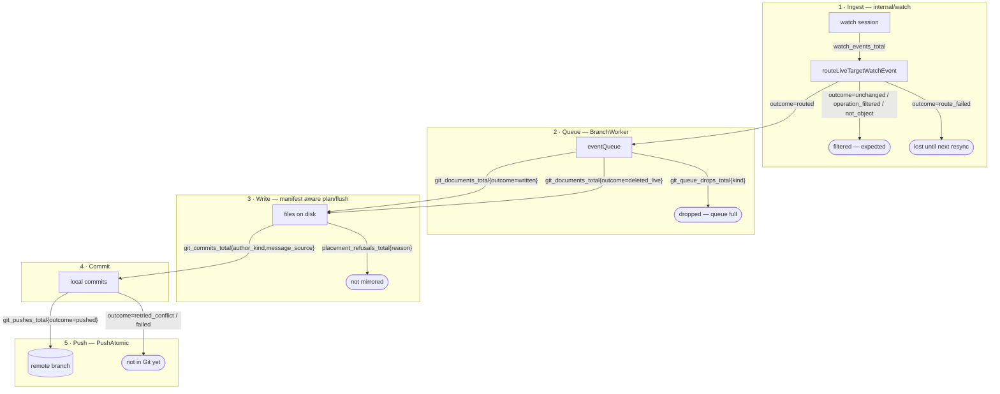

# Metrics, status, and the shape of the pipeline: a plan

> **PLAN**, written 2026-09-07. It **replaces** the previous revision of this file wholesale; the
> old text is in `git log`. Index: [`../INDEX.md`](../INDEX.md)
>
> This is the single canonical metrics plan. It is architecture-led:
> [architecture.md](../architecture.md) is the spine, [interpreting-metrics.md](../interpreting-metrics.md)
> is the live baseline and the per-metric documentation bar, and
> [spec/status-conditions-guide.md](../spec/status-conditions-guide.md) owns the status half.
> It takes breaking changes deliberately and in one release.

## 1. The three questions this answers

1. **Do the metrics carry logical names, and do they measure the right things?** Mostly the second,
   often not the first. Six instruments are exact duplicates of another series, three names claim
   something the recording site does not do, and three instrument doc comments name label values
   that no longer exist.
2. **Can an operator see events moving through the system, and see the exceptions?** No. The
   ingestion half of the pipeline emits nothing at all, the push (the stage that puts an object in
   Git) emits nothing, and the two places the operator *drops work on the floor* are log lines
   with no counter. There is no shared vocabulary that would let a funnel be drawn even if the
   stages existed.
3. **Is status counting things it should not?** Yes, in three places, and one of them is a field
   that has never been written at all.

The answer to all three is one change: **one boundary, one counter, one bounded `outcome`**, applied
along the whole path an object takes, plus the removal of everything that says the same thing twice.
The result is **fewer instruments than today** (38 against 43) covering **more of the pipeline**.

## 2. What the audit found

Every claim below was read out of the code, not inferred.

### 2.1 Exact duplicates: the same series published twice

| Duplicate | Evidence |
|---|---|
| `git_operations_total` and `objects_written_total` | Both `Add(w.ctx, int64(eventCount))` with the same value and no labels, four lines apart in `recordPendingWritesMetrics` ([branch_worker.go](../../internal/git/branch_worker.go)). Two names, one number. |
| `secret_encryption_cache_hits_total` and `secret_encryption_marker_skips_total` | Incremented on consecutive lines of `cachedEncryptedContent` ([content_writer.go](../../internal/git/content_writer.go)), on every path, unconditionally. They can never differ. |
| `secret_encryption_attempts_total` | Incremented immediately before `Encrypt`, so it is exactly `success + failures`. Three counters describe two outcomes. |
| `audit_eventlists_total{outcome}` | Recorded at the same site, with the same attribute set, as `audit_eventlist_duration_seconds{outcome}`, whose `_count` series **is** that counter. A histogram already ships its own observation count. |
| `audit_eventlist_events_total{outcome}` | Counts decoded event items; `audit_events_total` counts the same items once each, with `group`/`version`/`resource`/`verb`/`outcome` on them. The coarse counter is the fine one summed. |
| `status.streams.summary` | Restates `ready` and `total` as `"3/4"`, which its own doc comment admits the API conventions rule out. |

### 2.2 Names that describe something the code does not do

- **`commits_total` says "pushed" and counts "committed".** The doc comment reads *"counts commit
  batches pushed to git"*; the recording site is `commitPendingWrites`, which runs before
  `pushPendingCommits` and is never re-run when a push is retried. During a total remote outage the
  product's headline metric keeps climbing while nothing reaches Git. It is a real number; it is
  not the one its name promises, and there is no metric for the one that matters.
- **`git_operations_total` and `objects_written_total` both count events in a flush**, not Git
  operations and not documents written. A flush of one event that rewrites six files counts one.
- **`target_reconcile_completed_total`** counts a completed **watch recovery**: a cursor resume or
  an applied per-type reconcile. Nothing about it is specific to a "target reconcile", and the name
  is why its `trigger` label was documented wrongly (below).

### 2.3 Label drift: instrument comments naming values that do not exist

[exporter.go](../../internal/telemetry/exporter.go) is the first thing a reader opens, and three of
its comments are stale:

| Instrument | Comment says | Code emits |
|---|---|---|
| `PlacementsTotal` | `declared / kustomize_root / canonical` | `by_type` / `default` / `kustomize_root` / `canonical` |
| `TargetReconcileCompletedTotal` | `trigger` is `rule_change` | `cursor_resume`, `type_reconcile` |
| `WatchPlanTriggersTotal` | `declare, rule_change, api_surface, source_namespace, periodic` | `declare`, `rule_change`, `shared_refresh`, `periodic` |

[interpreting-metrics.md](../interpreting-metrics.md) is right in two of these three cases, which is
the wrong way round: the source of truth should be beside the code.

One documented **query** is wrong for the same reason. "Cache effectiveness" is given as
`cache_hits / attempts`, but the cache is consulted before `attempts` is incremented and returns
early on a hit, so the two counters are over disjoint populations and the ratio can exceed 1.

### 2.4 Exceptions with no counter: the silent drops

The previous revision of this plan set the rule (*"every silent drop gets a counter"*) and the code
has three places that break it. Each is a log line and nothing else.

- **A full branch-worker queue drops the write.** `enqueueRequest` logs *"Event queue full, request
  dropped"* and returns false ([branch_worker.go](../../internal/git/branch_worker.go)). `EnqueueAttach`
  does the same for a `CommitRequest` attach. `branch_worker_queue_depth` shows the queue was deep;
  nothing anywhere says work was thrown away. A storm is exactly when this fires.
- **A push that fails every retry is invisible.** `pushPendingCommits` gives up after three attempts
  and `pushPending` logs *"Push failed; pending writes retained for retry"*. No counter, no latency
  histogram, no conflict count. The mirror stops advancing and every metric reads healthy.
- **A route failure at the watch boundary is a `V(1)` log.** `routeLiveTargetWatchEvent` logs
  *"target watch route failed"* ([target_watch.go](../../internal/watch/target_watch.go)) and the
  event is gone until the next resync.

### 2.5 Gauges that go stale during the incident they exist to detect

Both saturation gauges are **pushed from inside the loop they measure**, so the loop stalling is
exactly what stops them being republished.

- **`branch_worker_queue_depth` reads 0 through the first stall.** `syncQueueDepthMetric` runs at the
  *bottom* of each loop iteration ([branch_worker.go](../../internal/git/branch_worker.go)). From
  idle: fifty items enqueue and the gauge is still 0 because nothing has published; the loop then
  wakes and blocks inside `handleQueueItem`, and the gauge stays 0 for as long as that takes. The
  comment's claim that "the gauge converges to 0 once every accepted item has been handled" is true
  and beside the point, because it also *starts* at 0 and does not move while work piles up.
- **`watch_plan_oldest_dirty_age_seconds` freezes at the value it held when the loop hung.**
  `publishDirtySetDepth` is called once per owner-loop turn
  ([owner_observability.go](../../internal/watch/owner_observability.go)). A pass that wedges stops
  the turn, so the age the alert is written against stops advancing at the moment it becomes
  interesting.

The fix is the same for both, and it is a rule rather than a patch: see principle 6 in §3.

### 2.6 Discovery is blind to every cluster but the local one

`refreshClusterCatalog` guards both `recordCatalogRefresh` and `recordCatalogStats` with
`if cc.isLocal()` ([manager_catalog.go](../../internal/watch/manager_catalog.go)), and the comment
says why: the metrics carry no cluster label, so publishing a remote cluster's stats under them
would overwrite the local cluster's series. That was correct when there was one cluster. Since the
config-plane split a `GitTarget` can mirror a remote source cluster through `spec.kubeConfig`, and a
degraded `APIService` there produces **no signal at all** while `api_catalog_group_versions` sits
reassuringly at zero degraded. The label is the fix, not the guard.

### 2.7 The flow cannot be drawn, and it is not close

Watch ingestion has **no instrument at all**. So the funnel an operator would want:

```text
watch events seen -> filtered -> routed -> documents written -> commits -> pushed
```

This is measurable only at the third-to-last step onward, and even there `objects_written_total` counts
the wrong unit and `commits_total` counts a stage earlier than it claims. There is also no shared
convention: `outcome`, `reason`, `trigger`, `source`, `disposition`, `op`, `mode`, `state` and
`category` all name "what happened to this thing" on different instruments, so no single query can
ask "show me everything that did not make it".

## 3. Principles

Carried forward from the previous revision, and still right:

1. **Architecture is the spine.** Every metric maps to a named stage of
   [Common flows](../architecture.md#common-flows).
2. **Every metric has a recording site and an interpretation**, both in the same change, or it does
   not merge.
3. **Every silent drop gets a counter**, at the point the decision is made.
4. **Label discipline.** Bounded cardinality only. Never an object's name or namespace. Identity
   labels stay prefixed (`gittarget_*`, `provider_*`) to survive a `honor_labels=false` pod scrape.
5. **Degradation is loud.** Running in a degraded shape is a visible state, not a silent one.

Five new ones. The first three are what makes the flow drawable; the last two are what keeps a
gauge honest during an incident:

1. **One boundary, one counter, one bounded `outcome`.** Where a population divides, it divides
   *inside* one counter on a label named `outcome`, whose values are a frozen enum with exactly one
   healthy value. Two counters over the same population is the defect §2.1 keeps finding.
2. **`outcome` is the universal word.** `reason`, `trigger`, `op`, `state`, `mode`, `disposition`,
   `source` and `category` survive only where they answer a *different* question than "how did this
   end". `source` and `disposition` on placement do; `trigger` on a recovery counter does not.
3. **A metric counts throughput; status states a condition.** The two must never be asked to do each
   other's job. §6 applies this back to the CRDs.
4. **A gauge is read at scrape time, never pushed from the loop it measures.** Every gauge here
   becomes an OpenTelemetry *observable* gauge whose callback reads the live state when Prometheus
   asks. A gauge published from inside a work loop reports the loop's last healthy moment for as
   long as the loop is stuck, which is precisely backwards (§2.5).
5. **"How long" is exported as a timestamp, not as an age.** An age has to be recomputed to stay
   true; a timestamp is true forever once written, and `time() - <gauge>` does the arithmetic in
   PromQL. This is
   [Prometheus's own instrumentation advice](https://prometheus.io/docs/practices/instrumentation/#timestamps-not-time-since),
   and `attribution_fact_follower_last_success_timestamp_seconds` already follows it. So does the
   dirty-set gauge after this plan.

## 4. The model: one spine, five stages, one exception selector

### 4.1 The path, with the metric on every edge



Every terminal box on the right is an **exception**, every one of them is a bounded `outcome` value
on a counter that exists after this plan, and every one of them is invisible today except placement.

### 4.2 The stages, and the one healthy value of each

| Stage | Counter | Healthy `outcome` | Everything else is an exception |
|---|---|---|---|
| 1 Ingest | `watch_events_total` | `routed` | `route_failed` (loss); `unchanged` / `operation_filtered` / `not_object` are expected filtering, not faults |
| 2 Queue | `git_queue_drops_total` | (no increment) | every increment is lost work |
| 3 Write | `git_documents_total` | `written` / `deleted_live` / `deleted_sweep` | `unchanged` and `retained` are expected; loss at this stage is `placement_refusals_total` |
| 4 Commit | `git_commits_total` | all | recorded **on successful push**, so it can never claim a commit the remote never took. `author_kind="unresolved"` is a quality signal, not loss |
| 5 Push | `git_pushes_total` | `pushed` | `retried_conflict` (survivable), `failed` (the mirror has stopped) |

The funnel is then four lines of PromQL and needs no new concept:

```promql
sum(rate(gitopsreverser_watch_events_total{outcome="routed"}[5m]))
sum(rate(gitopsreverser_git_documents_total{outcome="written"}[5m]))
sum(rate(gitopsreverser_git_commits_total[5m]))
sum(rate(gitopsreverser_git_pushes_total{outcome="pushed"}[5m]))
```

The stages count different units on purpose (an event is not a document, and a document is not a
commit), so this is a funnel, never a subtraction. §10 says so again, because it is the mistake this
shape invites.

### 4.3 One selector for every exception

The stages are deliberately shaped so that a **recording rule** can union every loss path into one
series with two labels, which is what makes the "exceptions" panel and the paging alert one
expression each rather than a dozen:

```promql
# gitopsreverser:exceptions:rate5m{stage,reason}
label_replace(sum by (outcome) (rate(gitopsreverser_watch_events_total{outcome="route_failed"}[5m])),
              "stage", "ingest", "", "")
or label_replace(sum by (kind) (rate(gitopsreverser_git_queue_drops_total[5m])),
              "stage", "queue", "", "")
or label_replace(sum by (reason) (rate(gitopsreverser_placement_refusals_total[5m])),
              "stage", "write", "", "")
or label_replace(sum by (outcome) (rate(gitopsreverser_git_pushes_total{outcome="failed"}[5m])),
              "stage", "push", "", "")
or label_replace(sum by (reason) (rate(gitopsreverser_attribution_facts_lost_total[5m])),
              "stage", "attribution", "", "")
```

The rule ships beside the dashboard (§7). It is the artifact that answers *"show me the exceptions"*
in one panel, and it only works because §3's `outcome` convention is enforced.

## 5. The instrument set, before and after

**43 instruments today, 38 after**, while adding the whole ingest stage and push health. Names lose
their prefix `gitopsreverser_` in this table only.

### 5.1 Deleted (nothing replaces them)

| Instrument | Why |
|---|---|
| `git_operations_total` | identical to `objects_written_total` (§2.1) |
| `audit_eventlists_total` | identical to `audit_eventlist_duration_seconds_count` |
| `audit_eventlist_events_total` | `audit_events_total` is the same population with better labels |
| `api_catalog_generation` | an internal counter with no operator action attached; `api_catalog_refresh_total{outcome="changed"}` is the same information, actionable |
| `watch_plan_triggers_coalesced_total` | becomes a `coalesced` label on `watch_plan_triggers_total`, so the ratio stops being a cross-metric query |

### 5.2 Merged (many into one)

| Merged away | Into | Notes |
|---|---|---|
| `secret_encryption_{attempts,success,failures,cache_hits,marker_skips}_total` | `secret_encryptions_total{outcome}` | `outcome`: `encrypted` / `failed` / `cached`. Five counters over two populations become one over three honest ones, and the broken "cache effectiveness" query (§2.3) becomes `sum by (outcome) (rate(...))` |
| `attribution_fact_index_evictions_total{reason}`, `attribution_fact_stream_gaps_total{stream}`, `attribution_fact_stream_decode_errors_total{transport}` | `attribution_facts_lost_total{reason}` | `reason`: `index_full_per_type` / `index_full_total` / `stream_trimmed` / `undecodable`. All three mean "a fact that will never join a watch event", they are already drawn on one panel in the current guide, and one alert should cover them. The `stream` and `transport` detail stays in the log line at each site, where it already is |

### 5.3 Renamed, and in three cases re-scoped

| Today | After | Change beyond the name |
|---|---|---|
| `objects_written_total`, `resync_sweep_deletes_total`, `prune_retained_documents_total` | `git_documents_total{gittarget_*,group,version,resource,outcome}` | one counter at the writer boundary. `outcome`: `written` / `deleted_live` / `deleted_sweep` / `unchanged` / `retained`. It counts **documents**, not events in a flush, and it closes two gaps at once: the steady-state delete path was never counted, and a document the writer diffed to a no-op was invisible. Three counters over one population become one, which is what principle 1 asks for |
| `commits_total` | `git_commits_total` | same labels, but **recorded on successful push** rather than on local commit creation. A push that never lands now counts nothing, which is the correction §2.2 asks for; the retry loop rebuilds commits, so counting at the terminal success is also the only place the accounting is right exactly once |
| `branch_worker_queue_depth` | `git_queue_depth` | same labels, but an **observable** gauge whose callback reads `inflightItems` plus the retained-work flag at scrape time, so it can no longer read 0 through a stall (§2.5) |
| `resync_background_failures_total` | `git_resync_failures_total` | same labels |
| `target_reconcile_completed_total{trigger}` | `watch_recovery_total{gittarget_*,group,version,resource,mode}` | `mode`: `cursor_resume` / `type_reconcile` / `replay` / `list_fallback`. Says what it measures, gains the two recovery modes that were never counted, and merges with the `watch_recovery_total` the previous revision had planned separately |
| `watched_types` | `watch_streams{gittarget_*,state}` | `state`: `streaming` / `replaying` / `blocked`, as an observable gauge. `streamSummaryCounts` guarantees `Total == Ready + Replaying + Blocked`, so `sum by (gittarget_name)` is the resolved-type count the old gauge published and `state="blocked"` is exactly the difference between "resolved in config" and "running". One gauge answers both questions, and it is what lets `status.streams` go (§6) |
| `watch_plan_oldest_dirty_age_seconds` | `watch_plan_oldest_dirty_since_timestamp_seconds` | an observable gauge holding the Unix time the oldest dirty target went dirty. Read it as `time() - <gauge>`. An age has to be recomputed by the loop that is stuck; a timestamp does not (§2.5, principle 5) |
| `api_catalog_resources`, `_group_versions`, `_refresh_total`, `_refresh_duration_seconds` | the same names, plus a `source_cluster` label | and the `if cc.isLocal()` guards come off, so a remote source cluster's degraded API surface is finally visible (§2.6) |
| `attribution_resolution_wait_seconds{tier,event_kind,group,version,resource}` | `attribution_resolution_wait_seconds{tier,event_kind}` | the type triple comes **off the histogram**. It is the largest family in the system by an order of magnitude (§7), the question it answers is "is the grace window paying for itself", and that is a per-tier question. Per-type attribution coverage stays available on `attribution_resolutions_total`, which is a counter and cheap |

### 5.4 Added

| Instrument | Type | Labels | Closes |
|---|---|---|---|
| `watch_events_total` | counter | `gittarget_*`, `group`, `version`, `resource`, `outcome` | the whole ingest stage. One recording site: `routeLiveTargetWatchEvent` is a single switch carrying every terminal branch, so this is one honest boundary, not a scattering. It carries the GitTarget because "which tenant stopped receiving events" is the question, and **not** the watch event type (`added`/`modified`/`deleted`): that halves the series budget, and the written-versus-deleted split is answered better at the writer by `git_documents_total{outcome}` |
| `watch_event_queue_seconds` | histogram | `group`, `version`, `resource` | head-of-line blocking behind a slow attribution wait: a proven failure that broke a `CommitRequest` e2e spec and was visible only by correlating two log lines by hand |
| `watch_sessions_ended_total` | counter | `group`, `version`, `resource`, `reason` | `reason`: `expired` / `disconnected` / `error` / `stopped`. Watch stability and `410` pressure |
| `watch_replay_duration_seconds` | histogram | `group`, `version`, `resource` | the cost of a replay, which is what a `410` storm charges |
| `git_queue_drops_total` | counter | `provider_*`, `branch`, `kind` | §2.4's first silent drop. `kind`: `write` / `attach` / `resync` |
| `git_pushes_total` | counter | `provider_*`, `branch`, `outcome` | §2.4's second. `outcome`: `pushed` / `failed`, counted once per push cycle at its terminal end |
| `git_push_retries_total` | counter | `provider_*`, `branch`, `reason` | `reason`: `remote_moved` / `error`. A replay round is not a terminal outcome, so it is its own counter rather than a third `outcome` value. `rate(retries) / rate(pushes)` is the contention signal |
| `git_push_duration_seconds` | histogram | `provider_*`, `branch` | push latency, re-added **with** a recording site this time |

### 5.5 Kept unchanged

`placements_total`, `placement_refusals_total`, `placement_kustomization_entries_total` (recent,
well-labeled, and `source`/`disposition` answer a different question than `outcome`);
`audit_events_total`; `attribution_resolutions_total`, `_resolution_wait_seconds`, `_facts_total`,
`_fact_index_entries`, `_fact_follower_errors_total`, `_fact_follower_last_success_timestamp_seconds`,
`_transport_info`, `_collection_without_uidset_total`; `api_catalog_resources`,
`_group_versions`, `_refresh_total`, `_refresh_duration_seconds`; `watch_plan_dirty_targets`,
`_oldest_dirty_age_seconds`, `_passes_total`, `_pass_duration_seconds`.

The attribution surface is the one part of the system that was already designed properly, and it
stays as it is apart from the loss-path merge.

## 6. Status: stop counting, start stating

[spec/status-conditions-guide.md](../spec/status-conditions-guide.md) already states the right rule:
*status writes are bounded by configuration changes and health transitions, never by data-plane
throughput*. It then lists `status.streams` and `status.retention` among its own worked examples of
fields that pass it. Two of them do not, and the reason is subtle enough that it needs writing down
rather than arguing about.

### 6.1 `status.lastPushTime`: delete it

It is declared on `GitTargetStatus` and the only assignment anywhere in the tree is
`target.Status.LastPushTime = nil`. It has never been published. Every reader that has ever checked
it read the field's absence as "nothing pushed yet". Delete the field.

### 6.2 `status.streams`: replace it with the condition that already says it

Today: `{summary, total, ready, replaying, blocked}` on `GitTarget`, and the same plus
`pendingSample` on both rule kinds. The counts move on every stream readiness transition, and a
GitTarget that is not converged requeues on `RequeueStreamSettleInterval` (**10 seconds**) with the
constant's own comment saying the fast loop exists *"so this keeps `status.streams` fresh while
watches converge"*. A cold start on a large cluster is therefore a status write every ten seconds
per target for as long as convergence takes, to publish numbers that a metric should own.

The information is not lost by removing them, because it is already published twice over:

- The `StreamsRunning` condition's **reason** names the state (`AllStreamsReady`, `Replaying`,
  `WatchError`, `WatchNotPermitted`, `NoResolvedTypes`) and its **message** already carries the
  ratio: `"0/0 streams running; no resolved resource types"` is built in
  [stream_status.go](../../internal/controller/stream_status.go) today.
- `watch_streams{gittarget_*,state}` (§5.3) carries the numbers, per state, at metric rate.

So: delete `GitTargetStreamsStatus` and `WatchRuleStreamsStatus` entirely, and repoint the `Streams`
printer column at `.status.conditions[?(@.type=="StreamsRunning")].reason`. The column becomes a
state word instead of a ratio, which is the point: `kubectl get` should say *what* is happening, and
`3/4` never told anyone which one was stuck. `pendingSample` folds into the condition message, where
a bounded sample of pending types is diagnostic rather than a list that churns.

Nothing in `test/` or in the controller tests reads these fields, so the migration cost is the API
change and the printer column.

### 6.3 `status.retention`: replace it with a condition

Today: `{mode, retainedDocuments, observedTime}`. `retainedDocuments` is a count of mirrored
documents, which is the definition of a metric, and it already **is** one
(`git_documents_retained_total` after §5.3). `observedTime` is worse than the count: it is restamped
on every accepted resync report, including the routine re-reports that change nothing an operator
sees, so the **next** reconcile for any reason at all finds a non-empty patch and writes status. It
defeats the no-op write suppression the guide's own §"Status writes are suppressed when nothing
changed" depends on.

Replace the block with one condition, `RetentionConverged`, not part of `Ready`:

| Status | Reason | Means |
|---|---|---|
| `Unknown` | `NotMeasured` | no resync has reported; also the correct state for a suspended target |
| `True` | `Converged` | the last resync retained nothing |
| `False` | `DocumentsRetained` | `spec.prune.mode` is keeping documents a converged mirror would not hold |

The message names the effective mode and points at the metric; it carries **no number**, so it moves
only when the target crosses between retaining and converged. That preserves every distinction the
current field set makes (including absent-versus-zero, which becomes `Unknown`-versus-`True`) and
removes the throughput coupling. The existing argument against a condition here (*"retention is the
configured behaviour, never a fault, and a condition going False for it would train operators to
ignore the real ones"*) is answered the same way `AuditFactsReceived` on `ClusterProvider` already
answers it: an informational condition outside `Ready` is a normal part of this API's vocabulary.

### 6.4 The guide gets the correction too

[spec/status-conditions-guide.md](../spec/status-conditions-guide.md) is a `spec/` document, so its
worked-example table is a contract. Both rows change in the same PR: `status.streams` and
`status.retention` move from the "status" column to the "metric" column with the reason above, and a
sentence is added, *a count in status is a metric that has escaped*, with `lastPushTime` as the
cautionary example of the other failure mode, a field that was never written at all.

## 7. The dashboard, and what ships with it

One Grafana dashboard, versioned in the repo at `docs/dashboards/`, plus one recording-rule file and
one alert-rule file. Built **after** the families exist, never against a name still being designed.

- **Row 0, Flow.** The §4.2 funnel as five stat panels left to right, then one timeseries of all
  five rates on shared axes. This is the "events moving through the system" panel and it is the
  reason the stage counters share a vocabulary.
- **Row 1, Exceptions.** One table driven by `gitopsreverser:exceptions:rate5m{stage,reason}`
  (§4.3), sorted descending, plus a single stat of its sum. Empty is healthy and legible as such.
- **Row 2, Ingest.** Events by type and outcome, queue delay p95, session ends by reason, replay
  p95, recovery mode mix, `watch_streams` by state.
- **Row 3, Git.** Commits by `author_kind` and `message_source`, push latency p95, push outcome mix,
  queue depth, documents written/deleted/retained, placement `source` mix.
- **Row 4, Attribution.** Unchanged from the current guide's queries: coverage (`tier!="absent"`),
  evidence mix by `tier`, actor mix, removal wait p95 against the grace line, fact pipeline health,
  fact loss, follower liveness, transport legend.
- **Row 5, Discovery and secrets.** Allowed resources, degraded group/versions, refresh outcome mix,
  `secret_encryptions_total{outcome}`.

Alerts, as rules rather than sketches this time:

| Alert | Expression | Meaning |
|---|---|---|
| Mirror stopped | `rate(gitopsreverser_git_pushes_total{outcome="failed"}[10m]) > 0` for 10m | commits exist and nothing is reaching Git |
| Work dropped | `rate(gitopsreverser_git_queue_drops_total[5m]) > 0` | the queue is saturated and writes are on the floor |
| Ingest loss | `rate(gitopsreverser_watch_events_total{outcome="route_failed"}[10m]) > 0` | observed changes are not reaching the writer |
| Fact loss | `rate(gitopsreverser_attribution_facts_lost_total[10m]) > 0` | attribution facts are gone for good |
| Fact-store errors | `rate(gitopsreverser_audit_events_total{category="error"}[10m]) > 0` | fact appends are failing |
| Follower wedged | `(time() - …_fact_follower_last_success_timestamp_seconds > 600) or (…_transport_info == 1 unless on() …_fact_follower_last_success_timestamp_seconds)` for 10m | attribution degrading cluster-wide; **both arms are required**, because the gauge does not exist until the first successful read |
| Watch plane stuck | `gitopsreverser_watch_plan_oldest_dirty_age_seconds > 120` for 5m | a GitTarget cannot be planned |
| Head-of-line | `watch_event_queue_seconds` p95 approaching `--author-attribution-grace` | events queued behind slow resolutions |
| Degraded API surface | `gitopsreverser_api_catalog_group_versions{state="degraded"} > 0` | a broken APIService is hiding types |
| Encryption failing | `rate(gitopsreverser_secret_encryptions_total{outcome="failed"}[10m]) > 0` | Secret writes are being rejected |

## 7.1 Cardinality budget

Structure alone is not a budget, so here is the measured one. Take a fleet of **20 GitTargets**
watching **30 types**, which is a large install for this product.

| Family | Series | Note |
|---|---|---|
| `watch_events_total` | 20 × 30 × 6 outcomes = **3,600** | the largest counter, and the reason the event `type` label was dropped |
| `git_documents_total` | 20 × 30 × 5 outcomes = **3,000** | |
| `attribution_resolutions_total` | 30 × 8 tiers × 3 actor kinds = **720** | |
| `attribution_resolution_wait_seconds` | 8 tiers × 2 kinds × 15 bucket series = **240** | **7,200** before the §5.3 trim; a histogram multiplies by its bucket count, which is the trap |
| `placements_total` | 20 × 30 × 4 sources × 2 dispositions = **4,800** worst case | sparse in practice: placement fires once per (type, target) ever |
| everything else | low hundreds | |

Call it **under 15,000 series**, comfortable for a single Prometheus. Two rules keep it there:

- **A histogram's label set costs 15× a counter's.** Put a dimension on the counter beside it, not on
  the histogram, unless the distribution genuinely differs along that dimension.
- **Never an object identity.** No object `name`, `namespace`, `uid`, author, or commit SHA on any
  label, ever. That is the only thing here that is unbounded rather than merely large.

## 8. Migration

Breaking changes are still cheap: no dashboard ships today, no alert rules ship, and no consumer has
been told to build against these names. This plan spends that budget once.

- [`UPGRADING.md`](../UPGRADING.md) gets one table of old name to new name covering every row of §5.1
  to §5.3, written in the present tense per this repo's rule for that file, and one section for the
  three status removals with the condition that replaces each.
- The API change is `v1alpha3` field removals plus one new condition type; `task manifests`
  regenerates the CRDs and the printer columns change with them.
- e2e reads seven metric names today: `audit_events_total`, `attribution_resolutions_total` and
  `attribution_resolution_wait_seconds` are unchanged; `commits_total`,
  `target_reconcile_completed_total` and `branch_worker_queue_depth` are renamed; and
  `audit_eventlists_total` is deleted. `test/e2e/helpers.go` and the restart-reconcile spec move in
  the same PR. The restart-reconcile gate becomes
  `sum by (pod) (increase(gitopsreverser_watch_recovery_total[10m]))`, which is the same query
  against the honest name.
- [architecture.md → Observability](../architecture.md#observability) and
  [interpreting-metrics.md](../interpreting-metrics.md) are rewritten around the five stages. The
  "Known gaps" section shrinks to what is still deferred (§10).

## 9. Phases

Each phase ships recording sites, manual-reader unit tests, and its
[interpreting-metrics.md](../interpreting-metrics.md) rows together. Validated per
[AGENTS.md](../../AGENTS.md): `fmt` → `generate` → `manifests` → `vet` → `lint` → `test` → `test-e2e`,
e2e sequential. **No metric merges without its doc row.** The order is deliberate: the deletions come
first, so nothing new is built beside a duplicate.

1. **Subtract.** §5.1 and §5.2: delete the five duplicates, merge the five secret counters into one
   and the three attribution loss counters into one. Fix the three stale comments in §2.3 and the
   broken cache-effectiveness query. No new capability, and the instrument count drops from 43 to 34.
2. **The exceptions and the honest gauges.** `git_queue_drops_total`, `git_pushes_total`,
   `git_push_retries_total`, `git_push_duration_seconds`, moving `git_commits_total` to the push
   site, converting every gauge to an observable callback, and turning the dirty-set age into a
   timestamp. Two data-loss paths and one stalled-mirror path stop being log lines, and the two
   saturation gauges stop lying during a stall. Sites:
   [branch_worker.go](../../internal/git/branch_worker.go),
   [owner_observability.go](../../internal/watch/owner_observability.go).
3. **The ingest stage, and the clusters discovery forgot.** `watch_events_total`,
   `watch_event_queue_seconds`, `watch_sessions_ended_total`, `watch_replay_duration_seconds`,
   `watch_recovery_total`, `watch_streams`, the §5.3 write-family collapse into
   `git_documents_total`, and the `source_cluster` label that takes the `isLocal()` guards off the
   catalog metrics. Sites:
   [target_watch.go](../../internal/watch/target_watch.go),
   [event_router.go](../../internal/watch/event_router.go),
   [manager_catalog.go](../../internal/watch/manager_catalog.go),
   [branch_worker.go](../../internal/git/branch_worker.go).
4. **Status.** §6: the three CRD changes, the printer columns, the `RetentionConverged` condition,
   and the correction to [spec/status-conditions-guide.md](../spec/status-conditions-guide.md).
5. **The picture.** The dashboard JSON, the recording rule, and the alert rules, all under
   `docs/dashboards/`, written last against names that have stopped moving.

Phases 1, 2 and 4 are independent of each other. Phase 5 depends on 1 to 3.

**Credit.** §2.5, §2.6, the move of `git_commits_total` to the push site, the collapse of the write
family into one `outcome`, and the histogram cardinality trim came from a second, independent review
of the same question. Two reviews reaching the same list on the duplicates and the missing push
health is the strongest evidence in this document that the list is right.

## 10. Non-goals, and the traps this shape invites

- **Do not subtract across stages.** The funnel counts events, then documents, then commits, then
  pushes. One event can write six documents; one commit can carry a hundred. A panel that subtracts
  two stages is reporting a number that means nothing.
- **Do not subtract `attribution_facts_total{op}` either.** `written` counts every type; `matched`
  counts only the streams this process follows, and a restart re-files the retention window.
- **Not cross-pod aggregation.** One active replica; metrics are per-pod and that is correct.
- **Not per-mutation history.** Watch collapses to current state across gaps; metrics count
  observations, not mutations.
- **Still deferred**, with the precondition each needs: `fact_index_replay_seconds` (needs a
  replay-complete boundary to exist), the stream-scaling set (needs `behind` redefined as real lag,
  since exported as-is it would invite an alert on every ordinary burst), fact-shape distribution (needs a
  taxonomy distinct from the tier ladder, since a fact with a UID *and* an RV is filed under both),
  `resolvers_waiting` (needs `watch_event_queue_seconds` to prove insufficient first), and
  `fact_index_expired_total`.
- **Do not reintroduce the retired body-join metrics** (`audit_join_*`, `audit_official_gate_wait`,
  `parked` / `shallow_dropped`) or the v1 keyspace's `exact_deletecollection_item`. They belong to
  architectures that no longer exist.

## References

- [architecture.md](../architecture.md): the spine, especially *Common flows*, *State ingestion*,
  *Optional attribution*, *Git write architecture*, and *Observability*.
- [interpreting-metrics.md](../interpreting-metrics.md): the live baseline and the per-metric
  documentation bar every new row has to clear.
- [spec/status-conditions-guide.md](../spec/status-conditions-guide.md): the status half, and the
  document §6 corrects.
- [spec/attribution.md](../spec/attribution.md): the shipped attribution surface, which this plan
  leaves alone apart from the loss-path merge.
- [watch-manager-ownership.md](watch-manager-ownership.md): the owner loop the `watch_plan_*`
  family instruments.
