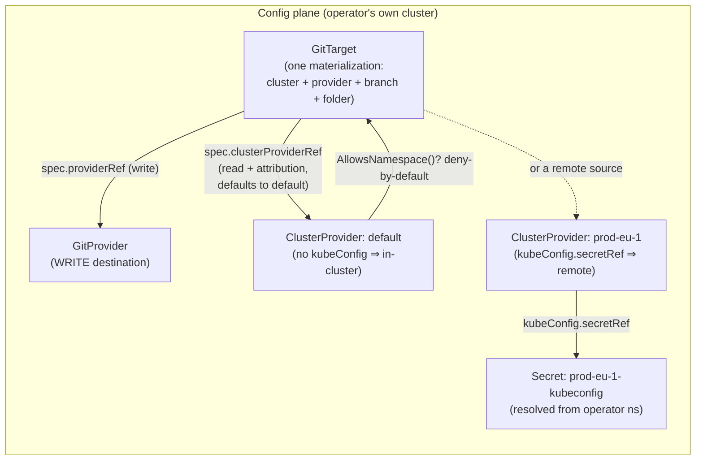
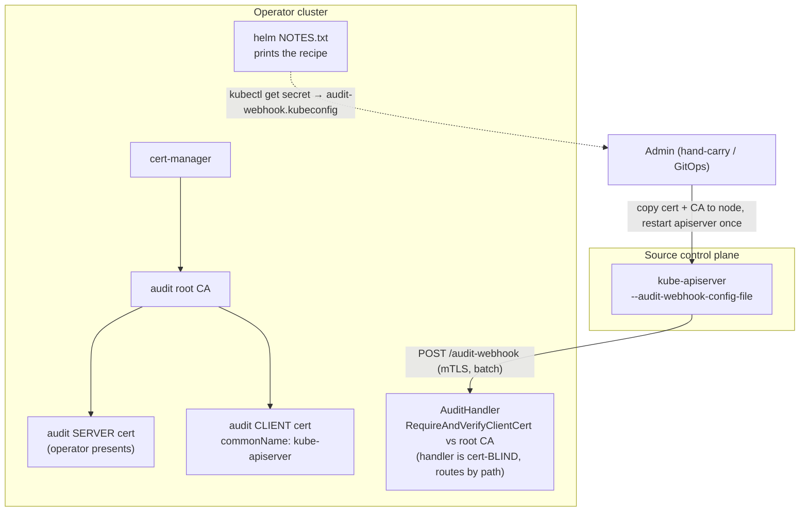
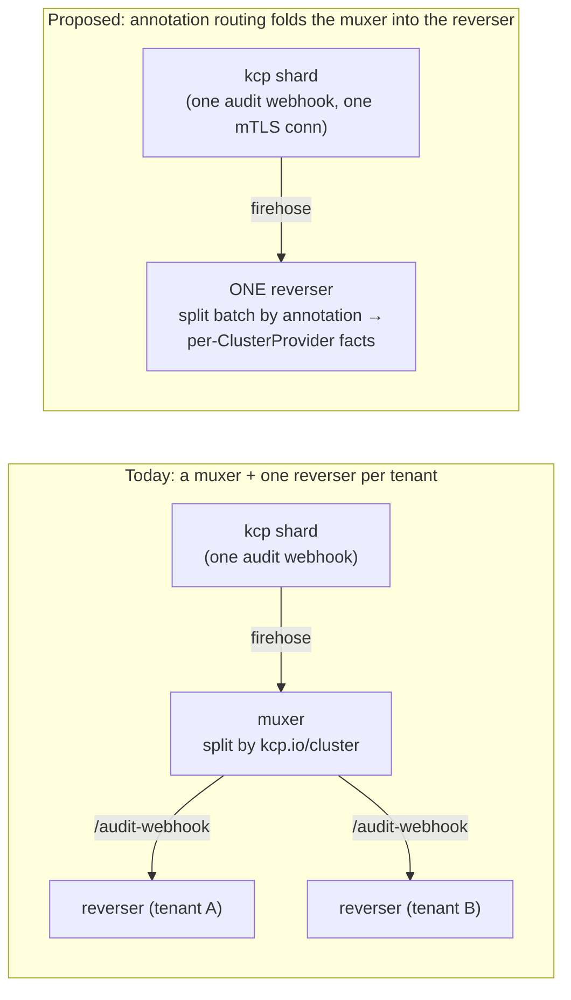

# Evaluation: where multi-cluster author attribution stands

> **design** — evaluation of open work on branch `feat/cluster-provider-author-attribution`
> (PR [#251](https://github.com/ConfigButler/gitops-reverser/pull/251)). Companion to the design
> [`multi-cluster-author-attribution.md`](./multi-cluster-author-attribution.md). Index:
> [`../INDEX.md`](../INDEX.md).
>
> This is a **status snapshot**, not a contract. It records what is built, what diverged from the
> design, what is deferred, and the open decisions (remote-ingress authentication, and
> annotation-based routing for kcp). Written 2026-07-18; updated the same day once the
> install-ordering fixes landed (see *Install ordering — resolved*).

## One paragraph

A cluster-scoped **`ClusterProvider`** is now the read-side peer of `GitProvider`: a `GitTarget`
names the cluster it mirrors *from* by `spec.clusterProviderRef`, defaulting to a provider named
**`default`** (a convention, not a reserved in-cluster identity). The provider's **name** is the cluster's identity everywhere —
the `/audit-webhook/<name>` ingress route and the attribution fact-index key — and the old
`SourceClusterID` string is gone. Namespace authorization (deny-by-default) is enforced at
reconcile, and provider facts expire naturally after their short TTL; no
fact-purge finalizer is taken. **What is not yet built** is the design's step-4 *authenticated ingress*
(per-provider client cert, `cert == path`), so remote `/audit-webhook/<name>` routing is live but
gated only on *"the provider name exists"* behind one shared CA client cert. That shared-credential
trust model is an accepted privileged-control-plane assumption, documented in [`SECURITY.md`](../../SECURITY.md).
The API also shipped leaner than the design: no `attribution.mode` enum, no `ingressLimits`, and the
runtime-reachability status is deferred.

## Status at a glance

| Area | Design intent | Shipped on this branch | Notes |
|---|---|---|---|
| `ClusterProvider` CRD (cluster-scoped) | ✅ | ✅ | `kubeConfig` (optional, immutable), `allowedNamespaces`, `qps`, `burst` |
| Defaulted provider ref (`default` is not reserved) | ✅ | ✅ | `clusterProviderRef` defaults to `{name: default}`; any provider name may be in-cluster or remote |
| Retire `SourceClusterID`; key by provider **name** | ✅ | ✅ | `git.Event.SourceCluster` carries the name; no `""` sentinel |
| Namespace authorization (deny-by-default) | ✅ | ✅ | reconcile-time refusal inside the `Validated` gate, returning before `DeclareForGitTarget` — see *Enforcement point* |
| Name-keyed fact index (`cluster:<name>` infix) | ✅ | ✅ | rv-only hatch is now `(cluster, gr, rv)` |
| Provider-fact cleanup on delete | ✅ | ✅ | TTL-only by design; no finalizer or purge, and a recreated source has fresh object UIDs |
| `ClusterProviderReady` projected onto `GitTarget` | ✅ | ✅ | `Watches(&ClusterProvider{})`, re-enqueues on Ready flip + on Namespace label change |
| Chart ships `default` provider | ✅ | ✅ | ships it; the CRD-before-CR install failure it caused is fixed (see *Install ordering — resolved*) |
| **Authenticated ingress** (per-provider cert, `cert==path`, revoke-on-delete) | ✅ **prerequisite** | ❌ **not built** | remote routing enabled *without* it — see *Gap 1* |
| `attribution.mode` enum (`None`/`Audit`) | ✅ | ❌ dropped | removed as "decorative API" until wired |
| `ingressLimits.maxEventsPerSecond` | ✅ | ❌ not built | one noisy source can starve others |
| Runtime status: `Reachable`/`DiscoveryHealthy`/`lastAuditEventTime` | ✅ | ❌ deferred | status is `Validated`/`Ready`/`Reconciling`/`Stalled` only |

Legend: ✅ built to intent · ⚠️ built but broken/partial · ❌ not built.

## The object model



A `GitTarget` has exactly one source cluster and one destination. The source is a `ClusterProvider`
(read side), the destination a `GitProvider` (write side). Both references are **immutable** — a
folder's source cluster is part of what the folder means. Because `clusterProviderRef` carries a
schema default, a `GitTarget` that omits it still persists with a concrete, jumpable ref to
`default`; there is no implicit `nil`.

## The attribution pipeline (what "who changed it" means)

```mermaid
sequenceDiagram
  participant API as Source apiserver
  participant H as AuditHandler<br/>(:9444, mTLS)
  participant R as Redis fact index
  participant W as Watch engine
  participant G as Git commit

  Note over API,H: WRITE side (audit)
  API->>H: POST /audit-webhook/&lt;name&gt; or /audit-webhook<br/>(EventList, client cert)
  H->>H: named route =&gt; provider; bare =&gt; per-event annotation routing
  alt named route
    H->>H: ProviderResolver.ProviderExists(name)?<br/>(404 if absent - NO cert-vs-name check)
  else shared stream
    H->>H: resolve each event's configured annotation<br/>(unroutable event is rejected)
  end
  H->>R: RecordFact(providerName, event)<br/>key cluster:NAME:author...UID:RV
  Note over W,G: READ side (watch to commit)
  W->>W: live event on (gvr, uid, rv)
  W->>R: ResolveAuthor(providerName, gvr, uid, rv)
  R-->>W: author (or miss = committer)
  W->>G: commit authored by the real user
```

The join is keyed by `(provider-name, group/resource, uid, resourceVersion)`. The cluster dimension
(`provider-name`) is what stops a fact from cluster A joining a watch event from cluster B. A missed
fact degrades to a committer commit — never wrong, just less rich.

## Example CRDs — the `default` provider, and why you never name it

The whole point of the conventional name is that a single-cluster user names **nothing** in the
`GitTarget`. A `GitTarget` with no `clusterProviderRef` resolves to `default`:

```yaml
apiVersion: configbutler.ai/v1alpha3
kind: GitTarget
metadata:
  name: example-target
  namespace: team-a
spec:
  providerRef: { name: acme }        # WRITE destination (GitProvider)
  branch: main
  path: clusters/acme
  # clusterProviderRef omitted ⇒ persists as {name: default} via the schema default.
  # `kubectl get gittarget example-target -o jsonpath='{.spec.clusterProviderRef.name}'` prints "default".
```

The chart renders the `default` provider when `clusterProvider.createDefault: true`, so it is
"still there" even though nobody typed it in the `GitTarget`:

```yaml
apiVersion: configbutler.ai/v1alpha3
kind: ClusterProvider
metadata:
  name: default                      # the name an omitted clusterProviderRef points at
spec:
  # kubeConfig omitted ⇒ in-cluster. Optional for EVERY name: a `default` that sets it mirrors a remote.
  allowedNamespaces:
    selector: {}                     # empty selector = admit every namespace (chart default; tighten in prod)
```

What makes this safe rather than magic:
- The name is **just a name**. It carries no schema rule and no privileged route; `default` is an
  ordinary provider that happens to be what an omitted reference resolves to. Name-uniqueness still
  makes it a singleton.
- Its audit route is the ordinary named **`/audit-webhook/default`**, existence-gated like any other.
  The bare `/audit-webhook` resolves no provider of its own: it is the shared-stream endpoint, and it
  is rejected with 400 unless `attribution.clusterAnnotationKey` is configured.

A remote source cluster is an ordinary named provider — the name is its identity everywhere:

```yaml
apiVersion: configbutler.ai/v1alpha3
kind: ClusterProvider
metadata:
  name: prod-eu-1                    # ⇒ /audit-webhook/prod-eu-1 AND the fact-index key
spec:
  kubeConfig:                        # IMMUTABLE; Secret resolved from the operator's namespace
    secretRef: { name: prod-eu-1-kubeconfig }
  allowedNamespaces:
    names: [team-a]                  # only team-a may bind this remote (deny-by-default)
```

> **Should `default` keep its special meaning?** ~~Keep the bare route as a backwards-compat alias
> for `/audit-webhook/default`.~~ **Superseded — resolved the other way.** `default` lost every
> special meaning: no CEL tying the name to an absent `kubeConfig`, and no privileged route. Audit
> routes are **named**, `/audit-webhook/default` included and existence-gated like any other. The bare
> `/audit-webhook` was not kept as an alias because it was needed for something better: it is the
> **shared-stream endpoint**, resolving each event's provider from `attribution.clusterAnnotationKey`,
> and it is a 400 while that key is unset. An alias would have made "which cluster is this?" ambiguous
> exactly where a shared stream needs it to be explicit.

## Getting a cluster to send its audit stream back — and the cert-manager question

This is the part an operator actually has to *do*, and the honest answer is: **cert-manager is not
changing, and for the shipping model you do not need it to.**

### What happens today (and it already works)



cert-manager mints a **root CA + server cert + one client cert** (`commonName: kube-apiserver`), all
chaining to one root. The operator's listener does `tls.RequireAndVerifyClientCert` against that root
([cmd/main.go](../../cmd/main.go) `buildAuditServerTLSConfig`), and hot-reloads its own serving cert
via a `CertWatcher` — no restart, no manual rotation. The chart's [NOTES.txt](../../charts/gitops-reverser/templates/NOTES.txt)
already prints a copy-paste recipe: `kubectl get` the client-cert Secret, assemble an
`audit-webhook.kubeconfig` (root-CA trust + client cert + `tls-server-name`), hand-carry it to every
control-plane node, set the apiserver flags, restart once. The e2e proves this exact flow
([hack/generate-audit-webhook-kubeconfig.sh](../../hack/generate-audit-webhook-kubeconfig.sh),
[hack/e2e/inject-webhook-tls.sh](../../hack/e2e/inject-webhook-tls.sh)).

### Why would we change that? Do we need to? Should we?

**We are not replacing cert-manager.** The design's *authenticated ingress* step keeps cert-manager
for issuance/rotation — issuing *N per-provider* certs from the same audit CA is the same mechanism
it already runs. Two things are genuinely new, and only one is code we control:

1. **Handler code** (ours): read `r.TLS.PeerCertificates`, map the subject/SAN to a `ClusterProvider`,
   and require **`cert-provider == path-provider`**, with UID-binding + revoke-on-delete. Today the
   handler is cert-blind and gates a named route only on *existence* — so **anyone holding the one
   shared client cert can POST to any `/audit-webhook/<name>` and forge author facts for that name**.
   This is *Gap 1*.
2. **Delivering a credential to a *remote* apiserver's filesystem** (not ours to automate):
   cert-manager on the operator's cluster **structurally cannot** reach another cluster's
   `/etc/kubernetes/...`. Getting the per-provider client cert + kubeconfig onto a remote control
   plane and wiring `--audit-webhook-config-file` is an out-of-band human/GitOps step.

So: **do we need to change it?** Only when a *second cluster* can POST to a *shared* reverser. For
the model that actually ships — one reverser per source, each fed a clean single-cluster stream on
its **bare** path — the single shared cert + path routing is correct and sufficient. **Should we?**
Only if we consolidate many remote clusters onto one reverser via `/audit-webhook/<name>`. Since this
branch *enabled that route* without the step-4 auth, the immediate call is: **either gate the named
route off until step 4 lands, or document it as provisional/untrusted.** There is a third option that
sidesteps per-provider certs entirely for the kcp case — next section.

## kcp — routing by annotation instead of path

kcp supports **one shard-level audit webhook**, so a muxer receives the whole shard firehose,
**partitions `EventList.items` by the `kcp.io/cluster` annotation**, and re-POSTs one clean
per-cluster EventList to each tenant reverser's **bare** `/audit-webhook`.



**The key facts** (verified in the checkout):
- The annotation is **`kcp.io/cluster`**; its value is the logical cluster hash, and kcp stamps it
  server-side on mutating events.
- The reverser **already strips `kcp.io/cluster`** from Git writes
  ([internal/sanitize/types.go:108](../../internal/sanitize/types.go)) — so routing on it can never
  leak into a commit. The plumbing is already half here.

**Proposed feature — `spec.audit.clusterAnnotationKey` (generic, kcp is one consumer).** Let a
provider (or a shard-ingress provider) declare that source-cluster identity comes from an **event
annotation** rather than the URL path:

- The handler resolves the provider **per-event** when configured: read
  `event.Annotations[<key>]`, map the value → a `ClusterProvider`, record the fact under that
  provider's name. Events without the key fall back to the path-derived provider (mirrors the muxer's
  empty-string default). The per-batch split is straightforward: group the EventList by annotation
  value before recording facts.
- **The security model becomes cleaner, not weaker.** Trust the *shard's single mTLS connection* (one
  cert — the model cert-manager already supports), and derive per-cluster identity from an annotation
  the shard's kcp **stamps and a remote client cannot forge**. That obviates both the per-provider
  cert (Gap 1) *and* the external muxer — one stock reverser ingests the firehose directly. It is a
  more faithful fit for kcp than path routing, which assumes N separately-authenticated senders.

Keep the "forward everything" invariant: no author/field-manager filtering on ingress. Two adjacent,
already-known upstream asks pair well with this and are worth tracking: **never-sweep-to-empty**
(refuse an empty desired-set resync) and **forbidden-informer quiet-once** (kcp doesn't serve
`apiregistration.k8s.io`).

## Resolved branch issues

| # | Red | Status |
|---|---|---|
| 1 | Unit coverage ratchet | ✅ **fixed** — baseline is now 76.1% |
| 2 | config-dir legs: CRD-before-CR install failure | ✅ **fixed** — see *Install ordering — resolved* |
| 3 | helm/quickstart: `failurePolicy: Fail` races pod-readiness | ✅ **fixed** — install first, then enable quickstart after `--wait` |

1. **Coverage ratchet** (fixed) — focused unit tests raised the committed baseline to 76.1%.
2. **config-dir CRD-before-CR** (fixed) — root cause and fix below.
3. **helm/quickstart `failurePolicy: Fail` race** (fixed) — the root README installs and waits for
   the operator first, then enables quickstart resources in a second Helm pass. The fail-closed
   namespace authorization guard remains intact.

## Enforcement point — one, at reconcile

Namespace authorization used to be enforced twice: a `validate-gittarget-namespace` validating
webhook (`failurePolicy: Fail`) at admission, and `checkSourceAuthorization` at reconcile. The
webhook has been **removed**; reconcile is the only enforcement point.

**It was never the boundary.** A webhook fires only at admission, so tightening a provider's
`allowedNamespaces` *after* a `GitTarget` exists is invisible to it. The reconcile check exists
precisely to cover that, and it is strictly stronger: it runs on every reconcile, and
[gittarget_controller.go](../../internal/controller/gittarget_controller.go)
calls it inside the `Validated` gate, which returns **before** `DeclareForGitTarget`. An
unauthorized `GitTarget` therefore never starts a watch and never writes to Git — it sits
`Validated=False` / `NamespaceNotAuthorized`. The webhook only ever bought earlier feedback.

**It cost a hard dependency.** It was the only `failurePolicy: Fail` webhook in the chart
(`validate-operator-types` is `Ignore`), which made the apiserver hard-depend on the manager Pod
being up to admit a `GitTarget` at all. That broke the documented quickstart: one `helm install`
applies the manager Deployment and the starter `GitTarget` in a single apply pass, so the webhook
Service had no endpoints when the `GitTarget` was submitted and the install failed with
`no endpoints available for service "gitops-reverser"`. Removing the webhook restores the
one-command quickstart (README step 4) and lets the helm quickstart e2e leg install in one pass.

## Install ordering — resolved

**Root cause.** `786c11d` (the review's hard-gate ask) made the `default` `ClusterProvider`
a *shipped object*, because local mirroring now requires it to exist. That made it the **first-ever
`configbutler.ai` CR instance inside a flat install bundle** — every other object in those bundles is
a built-in kind or a CRD. A CR applied in the *same* `kubectl apply` as the CRD defining it fails:
kubectl builds its RESTMapper up front, so it reports `no matches for kind "ClusterProvider"`. This
broke `BeforeSuite` on `full-manager`/`full-core`/`source-cluster`/`bi-directional`. (The config
overlay's `namespace:` transformer also stamps `namespace:` onto the cluster-scoped object.)
**Helm was never affected** — it installs [charts/gitops-reverser/crds/](../../charts/gitops-reverser/crds/)
in its own first phase.

**Fix A — e2e config-dir: a shared CRDs-first task.** A `_crds-installed` task
([test/e2e/Taskfile.yml](../../test/e2e/Taskfile.yml)) applies `config/crd` and waits for
`condition=Established`, re-running whenever the generated CRDs change (`sources:`). It is a
dependency of `_install-config-dir`. It is **deliberately not** a dependency of `_install-helm`:
helm has its own CRD phase, and pre-installing CRDs would *mask* it — the quickstart leg must keep
proving helm's own CRD install works.

**Fix B — the shipped installer is now two signed files.** `dist-install`
([Taskfile-build.yml](../../Taskfile-build.yml)) drops `--include-crds` and emits:

| File | Contents | Apply order |
|---|---|---|
| `dist/crds.yaml` | the 6 CRDs (87K) | **first** |
| `dist/install.yaml` | everything else, incl. the `default` provider (**81K → 16K**) | second |

Each is independently `cosign sign-blob`-signed (`<file>.sigstore.json`) and SLSA-attested
(`<file>.intoto.jsonl`), and all six artifacts are attached to the release
([release.yml](../../.github/workflows/release.yml)); the release notes document the two-step apply.
The `plain-manifests-file` e2e leg applies `dist/crds.yaml` itself
([install-plain-manifests.sh](../../hack/e2e/install-plain-manifests.sh)) rather than depending on
`_crds-installed`, so it genuinely exercises the shipped file.

**Rejected: having the operator self-create the `default` provider.** It would have removed the CR
from every bundle, but two things kill it:
- **Uninstall orphaning** — a cluster-scoped `ClusterProvider` cannot carry an ownerReference to the
  namespaced operator Deployment (cross-scope ownerRefs are invalid), so nothing garbage-collects it;
  a still-running operator would also recreate it mid-uninstall. Chart ownership is strictly better:
  helm creates it *and* deletes it.
- **Spec ownership** — `allowedNamespaces` is authorization. An operator that reconciled it to desired
  would silently revert an admin *tightening* it; create-if-absent-never-update would instead break
  value-driven updates. Neither is acceptable for an authz field.

The `clusterProvider.createDefault` value remains the single declaration of intent for whether the
chart renders the `default` provider. (It was `attribution.watchLocal`; the provider is required for
all mirroring rather than for attribution, and `default` may be remote, so both halves of that name
misled.)

## Tests — assessment

**Verdict: the mechanics are well unit-tested; the feature's *reason to exist* is unproven
end-to-end.** Per-package coverage of the new code is actually decent — `internal/webhook` 90.6%,
`internal/queue` 91.0%, `internal/controller` 76.6% (envtest), `internal/watch` 76.9%. The fact
keyspace has genuinely strong tests: cross-cluster isolation, the rv-only hatch being cluster-scoped,
the TTL-only cleanup model, and "a single-provider install's keyspace matches a bare install" are all pinned
([attribution_index_test.go](../../internal/queue/attribution_index_test.go)), and the audit
remote-route gating (exists→record, missing→404, error→503, bare→400 until annotation routing is configured) is covered
([audit_handler_test.go](../../internal/webhook/audit_handler_test.go)).

But three things undercut confidence:

- **No end-to-end proof of remote attribution.** The design's flagship e2e — a remote user's edit
  arriving via `/audit-webhook/<name>` and landing as an *authored* commit — **does not exist**. There
  is no `/audit-webhook/<name>` reference anywhere in `test/e2e/`, and the remote specs
  (Scenarios 4/8 in [source_cluster_e2e_test.go](../../test/e2e/source_cluster_e2e_test.go)) assert
  file **content** only, never the commit **author**. The three-workspace "non-leak centerpiece"
  proves *state* isolation, not *author* isolation — which is the whole point of the branch.
- **It all lives in a non-required, opt-in leg.** The branch added **no new CI check**; every new e2e
  is in the `source-cluster` leg (`E2E_ENABLE_SOURCE_CLUSTER=true`, installs kcp), which is not a
  required check. So none of it gates a merge.
- **Some security-critical unit branches remain untested.** The CEL contracts (`kubeConfig`
  immutability, `configMapRef` rejection, `clusterProviderRef` immutability + `default` defaulting)
  still need direct assertions. The retired-finalizer shedding and the no-finalizer contract are
  covered separately. Namespace authorization is no longer among them: with the admission webhook
  gone (see *Enforcement point*), the reconcile gate is asserted end-to-end — that an unauthorized
  `GitTarget` reaches `Validated=False`/`NamespaceNotAuthorized` **and** never reaches
  `DeclareForGitTarget`.

The largest remaining unit-coverage hole is the **remote-client build path** in
[internal/watch/cluster_context.go](../../internal/watch/cluster_context.go)
and [materialization.go](../../internal/watch/materialization.go) (`clusterRESTConfigLocked`,
`clusterDynamicClient`, `clusterDiscovery`, `SourceClusterReachable`, `DeclareForGitTarget` all at
0–16%). These only run under the opt-in kcp e2e, so a standard unit run never touches them.

### Prioritized fixes

Items 1–5 are unit tests; 6–9 are e2e that harden correctness but (being in the opt-in leg) won't
move the unit number.

| # | Test | File | Pins |
|---|---|---|---|
| 1 | ~~Fail-closed webhook on lookup error~~ | — | **Gone.** The webhook it covered was removed (see *Enforcement point*); the reconcile gate that replaced it is covered by item 5 |
| 2 | ClusterProvider CEL contract | `clusterprovider_controller_test.go` (envtest) | `kubeConfig` immutable; `configMapRef` rejected; empty `secretRef.name` rejected |
| 3 | `clusterProviderRef` immutability + default | `gittarget_immutability_test.go` | mutating the ref is rejected; an omitted ref stores as `{name:"default"}` |
| 4 | Aggregate-Ready projection precedence | `gittarget_source_cluster_test.go` | `GitProviderReady=False` wins; `ClusterProviderReady=False` downgrades; `reach=Unknown`→`Ready=Unknown` |
| 5 | Reconcile-time authz gate | `gittarget_source_cluster_test.go` | unauthorized namespace → `Validated=False`/`NamespaceNotAuthorized`, and the gate returns before `DeclareForGitTarget` (no watch, no Git write); malformed selector → same reason with a message |
| 6 | **E2E: remote author round-trip** | `source_cluster_e2e_test.go` | mutate as a named user via `/audit-webhook/<name>`, assert the **commit author** — the design's flagship, absent today |
| 7 | E2E: author isolation in the 3-workspace test | `source_cluster_e2e_test.go` | identical `(ns, ConfigMap, name)` across clusters credit distinct authors, no cross-join |
| 8 | E2E: namespace-authz admission + revocation | `source_cluster_e2e_test.go` | GitTarget in a disallowed namespace is admission-denied; tightening a live policy stops an existing target |
| 9 | E2E: `ClusterProviderReady` projection + recovery | `source_cluster_e2e_test.go` | GitTarget projects it; provider unhealthy→healthy recovers the aggregate Ready |

The remote-client 0% path (`cluster_context.go`/`materialization.go`) is genuinely awkward to unit-test
without a live remote; a fake `rest.Config`/discovery seam would help, but it may be a deliberate
e2e-only choice.

## Open decisions

1. **Remote-ingress authentication** (*Gap 1*): build step-4 per-provider `cert == path`, **or** adopt
   annotation routing (trust the shard, read `kcp.io/cluster`), **or** gate the named path off until
   one of those lands. Recommendation: annotation routing for kcp; gate the raw `/audit-webhook/<name>`
   path as provisional meanwhile.
2. **Restore or bury the dropped API** (`attribution.mode`, `ingressLimits`): keep them out until
   honored (current state), or reintroduce `ingressLimits` before any many-clusters-one-reverser
   deployment, since a noisy source can starve others.
3. **`default` routing alias** — **done, resolved against the alias**: `/audit-webhook/default` is an
   ordinary named route, and bare `/audit-webhook` is the annotation-routed shared-stream endpoint
   (400 while `attribution.clusterAnnotationKey` is unset), not an alias for `default`.

*Decided during this evaluation:* the operator will **not** self-create the `default` provider — the
chart stays its owner, and the flat-file bug is closed by splitting the installer instead (see
*Install ordering — resolved*).

The quickstart now applies the same sequencing: install the operator with `--wait`, then enable the
starter resources in a second Helm pass. `failurePolicy: Fail` remains the correct authorization
posture; the installation race is no longer an open decision.
