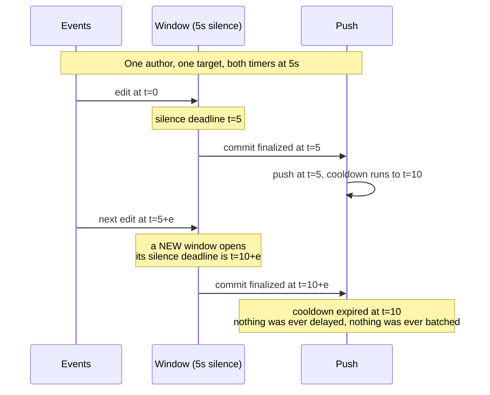
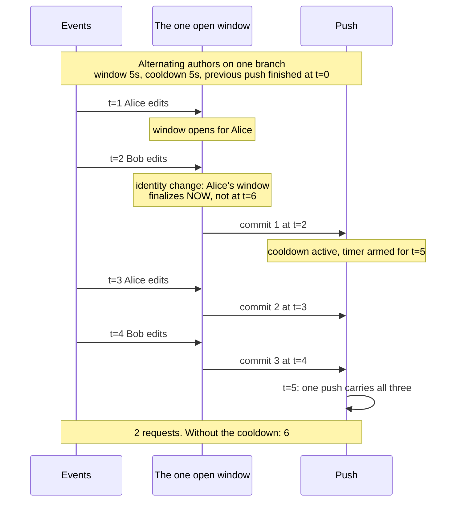
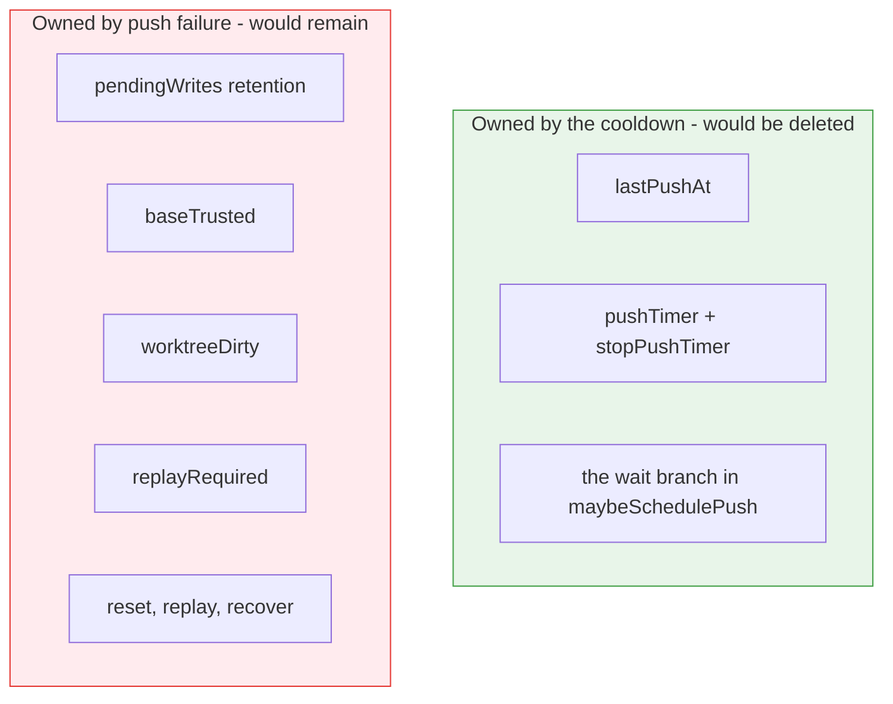
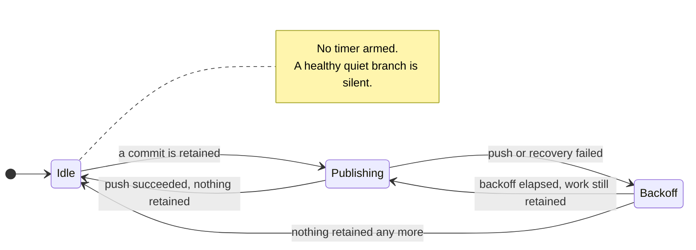

# The push cooldown: what it still buys, and what removing it would cost

> **design**: open, nothing built. Index: [`../INDEX.md`](../INDEX.md)
> Date: 2026-09-21.
> Related: [`../api-first-publication.md`](../api-first-publication.md),
> [`push-notification-and-reconcile-trigger.md`](push-notification-and-reconcile-trigger.md),
> [`../spec/commit-window-refactor.md`](../spec/commit-window-refactor.md)

**The question.** `PushCooldown` predates the commit window. The window now groups an editing burst
into one commit, which is most of what the cooldown was invented to do. Is the cooldown still
earning its place, and would removing it simplify the worker?

**The short answer.** For a single author writing a single target it is provably inert at the
defaults, so the instinct that it is redundant has a real basis. But that is the *quiet* case. The
moment a second identity touches the branch the commit window stops spacing commits entirely (§3)
and the cooldown becomes the only thing batching. On a multi-user cluster with attribution enabled,
which is what this product is for, that is the normal case rather than the exception.

Removing it would also delete about thirty lines and two fields and **none** of the state that makes
this worker complicated, because that state exists for push *failure*, not for push cadence.

So the clear win is not removal. It is that the worker has a timer on the path that mostly does not
need one and **no timer on the path that does**.

## 1. What it is today

`PushCooldown` is a fixed `5s` per worker. `maybeSchedulePush` runs after every local commit:

```go
if len(l.pendingWrites) == 0 { return }
if l.lastPushAt.IsZero() { l.pushPending(); return }      // never pushed: go now
if time.Since(l.lastPushAt) >= PushCooldown { l.pushPending(); return }
if l.pushTimer == nil { l.pushTimer = time.NewTimer(...) } // otherwise wait out the remainder
```

`lastPushAt` advances **only on a successful push**, so the cooldown paces successful publication
and does not pace retries.

## 2. The finding: at the defaults it never batches a single identity

`DefaultCommitWindow` and `PushCooldown` are both `5s`. The window is a rolling **silence** timer
per `(author, GitTarget)`. That makes the cooldown unreachable for one author writing one target:



The next commit for the same identity cannot finalize until at least `window` after the previous
one, and the cooldown is measured from the push that followed that previous commit. When
`window >= cooldown`, the cooldown has always expired before there is anything to hold.

**So the general rule is:** the cooldown only does work when the commit window is *shorter* than
it, or when several identities share the branch. At the shipped defaults those are equal.

## 3. Where it does still work, and it is the normal case

There is exactly **one** open window per worker. An event that does not belong to it does not open
a second window: it **finalizes the open one immediately** and a new one opens in its place
([`branch_worker.go`](../../internal/git/branch_worker.go), `canAppend` and
`windowFinalizeReasonIdentityChange`).

That has a consequence worth stating plainly: **under alternating authors the silence timer never
fires at all.** Every commit is produced by the identity boundary, at the moment the next event
arrives. The window provides no spacing whatsoever, and the cooldown becomes the only thing
batching anything.



The same shape applies to several `GitTarget`s sharing a branch, and to an unattributed event
arriving against an attributed window (a `/status` change with no audit fact is the common cause,
which is why that log line exists).

| Source | Why the window does not space it |
| --- | --- |
| An author or target change | The identity boundary finalizes the open window on arrival of the next event |
| Several `GitTarget`s on one branch | One window, so every switch between them is an identity change |
| `commit.window: 0s` | Every event commits on arrival |
| Atomic writes | They bypass the window by contract |
| Resync snapshots | They finalize and commit outside the window |

Ledger row 4 prices the batching: three commits published together cost **2** HTTP requests. Three
separate publications would cost **6**.

**This matters more than the first draft of this page assumed.** An earlier version drew two
concurrent windows and had Alice's commit waiting for her silence timer, which is not how the
worker behaves. Once the mechanism is right, the multi-identity case is not an edge: a multi-user
cluster with attribution enabled, the configuration this product is built for, produces one commit
per identity change, which is close to one commit per event.

## 4. What removing it would actually simplify

This is the part worth being precise about, because the hope ("it would clean up a lot of state")
is half right.

**Goes away:**

| Item | Size |
| --- | --- |
| `lastPushAt`, `pushTimer` fields | 2 fields |
| `maybeSchedulePush` collapses to "push if anything is retained" | ~12 lines to ~4 |
| `stopPushTimer` and its select arm in the event loop | ~14 lines |
| `PushCooldown` constant and its documentation | 1 constant, several doc paragraphs |

Roughly **thirty lines and two fields**, plus one fewer timer in a loop that has three.

**Stays exactly as it is:**

| Item | Why it is not the cooldown's |
| --- | --- |
| `pendingWrites` retention | A push can fail or be rejected; the writes must survive to be replayed |
| `baseTrusted` | The head-of-cycle fetch decision, unrelated to push cadence |
| `worktreeDirty` | A write that failed part-way, unrelated to push cadence |
| `replayRequired` | A reset that discarded local commits, unrelated to push cadence |
| `recoverRetainedWrites`, `refreshRemoteAndRebuildPendingWrites`, the whole replay path | Contention recovery |



**The complexity that makes this worker hard to reason about is in the red box, and removing the
cooldown does not touch it.** Every defect found in PR #382 lived there.

## 5. The one thing it does change

Today, "locally committed but not yet pushed" is the **normal** state: every burst passes through
it. Without the cooldown it becomes an **exceptional** state, reached only when a push fails or is
rejected.

That cuts both ways, and neither direction is decisive:

- **For removal.** A narrower window in which the retained-write paths can bite in production.
- **Against removal.** Those paths do not disappear, they get exercised far less. Code that is
  only reached on failure is code whose bugs are found later. The five defects PR #382 fixed were
  all in paths the cooldown makes routine.

A concrete symptom of how routine it is: **36 of the 45 test references to the cooldown are
`loop.lastPushAt = time.Now()`**, used purely as a lever to hold the push back so a test can inspect
retained state. Remove the cooldown and those tests need a different lever. That is a real
migration cost and also evidence of how central the state is.

## 6. Backpressure already coalesces, which weakens the storm argument

The branch worker is a single goroutine, and Git operations run synchronously on it. While a push
is in flight, arriving events sit in the queue. When it returns, they are processed, become
commits, and **one** push covers all of them.

So "push immediately" is not the same as "push per event". Under sustained load the worker
self-limits to one push per push-duration, and the coalescing the cooldown was invented for arrives
for free from the serialization. The cooldown's distinctive contribution is limited to a **slow
trickle** across identities: arrivals frequent enough to commit often, but slow enough that each
push completes before the next commit appears.

## 7. Options

| Option | What it is | Complexity | Verdict |
| --- | --- | --- | --- |
| **A. Keep it** | Status quo | Unchanged | Honest default. It is inert where it is inert and useful where it is not |
| **B. Delete it** | Push after every commit; rely on serialization to batch | **-30 lines, -2 fields, -1 timer** | **Riskiest.** §3 means this is one push per identity change on a multi-user branch |
| **C. Add a failure backoff, keep the cooldown** | A bounded backoff after a **failed** push or recovery, cleared when nothing is retained | **+1 timer**, but it guards a real gap | **Recommended, and independent of the rest** |
| **D. Add the backoff AND shorten or drop the success cooldown** | C, plus reducing the `5s` wait once §9 has priced it | Depends on the outcome | The measured follow-up to C |
| **E. Make it conditional or configurable** | Engage only when more than one identity is active, or expose it on `GitProvider` | **+complexity, +API surface** | Rejected unless D measurably fails |

### Why C is the one to take first, and why it is not what this page started out recommending

An earlier draft of this page recommended removing the wait on success and replacing it with a
failure backoff, on the strength of the cooldown being inert. §3's correction undermines the first
half of that: the cooldown is inert only while one identity is writing, and it is load-bearing as
soon as two are. Dropping the success wait is therefore a **measured** decision, not an obvious one,
and it belongs in option D behind the numbers §9 asks for.

What survives the correction intact is the second half, and it is worth doing on its own. Today the
worker has a timer on success and **none on failure**.
[`../api-first-publication.md`](../api-first-publication.md) and the PR #382 review both record the
gap: `pushPending` stops its timer on failure and arms no replacement, so a branch that goes quiet
after a failed push retains its work indefinitely and a flat `recovery` counter cannot prove
progress. The mirror-image problem is that because `lastPushAt` advances only on success, an expired
cooldown does not space failed attempts, so continued arrivals against a down remote provoke a
failed push per commit. One bounded backoff answers both, and it neither needs nor blocks any
decision about the success cooldown:



## 8. Risks

Ordered by how much they should worry you.

1. **Request amplification on shared branches.** The architecture explicitly supports several
   `GitTarget`s per branch, and multi-tenant installs are the case where the cooldown is load-bearing.
   Option B turns row 4's `2` into `6`. This contradicts the premise of
   [`push-notification-and-reconcile-trigger.md`](push-notification-and-reconcile-trigger.md), which spent a whole change
   removing two requests per publication.
2. **Hosted Git rate limits.** With serialization the bound is one push per push-duration, which on
   a fast remote is several per second sustained. GitHub's secondary rate limits are real and are
   not documented as a fixed number, so this needs observation rather than arithmetic.
3. **`commit.window: 0s` becomes a push per event.** Today the cooldown is the only thing standing
   between that setting and one publication per watch event. Anyone who set `0s` for prompt commits
   did not necessarily ask for prompt *pushes*.
4. **Losing a well-exercised path.** §5. The retained-write machinery stays; its production
   exposure shrinks; its bug-discovery rate shrinks with it.
5. **Test migration.** 36 tests use `lastPushAt` to reach retained state. They need a replacement
   lever, and a careless one (for example, stubbing `pushAtomicFn` to fail) changes what is being
   tested.
6. **A latency expectation somebody may already rely on.** Removing the cooldown makes publication
   up to five seconds faster, including for `CommitRequest`. That is a user-visible improvement, but
   it is a behavior change on a path people write automation against.

## 9. What to measure before deciding

The ledger built in PR #382 answers most of this, and turns the argument into numbers:

| # | Operation to add to the ledger | What it settles |
| --- | --- | --- |
| 1 | One author, one target, a burst at default window, driven through the **event loop** | Confirms §2: the cooldown never engages, so B and C cost nothing here |
| 2 | Two authors alternating on one branch | Prices the identity-boundary case that §3 claims is the real one |
| 3 | Three `GitTarget`s on one branch, edited together | The multi-tenant bill for option B |
| 4 | `commit.window: 0s`, ten events | Risk 3, as a number |
| 5 | A failing remote with continued arrivals | Shows today's per-commit failed push, and what a backoff changes |

Rows 1 to 4 need an event-loop-driven fixture rather than today's direct `commit()` calls, because
what is under test is the *scheduling*, not the request count of one cycle. That fixture does not
exist yet and is most of the work in answering this question.

## 10. Recommendation

1. **Do not change it as part of PR #382.** That branch is green and reviewed; this alters
   publication cadence and deserves its own change and its own e2e run.
2. **Take option C on its own.** Add a bounded failure backoff. It closes a documented gap with no
   upside, it needs no measurement to justify, and it does not depend on any decision about the
   success cooldown.
3. **Build the event-loop ledger rows in §9 next.** Nothing currently measures scheduling, only the
   cost of one cycle, so the multi-identity question cannot be answered today. Row 2 is the
   important one: it prices the case §3 says is normal.
4. **Only then consider option D.** If the numbers show the multi-identity case is rare in practice
   or the amplification is small, shortening or dropping the success cooldown becomes defensible.
   If they show what §3 predicts, keep it and the question is settled with evidence.

The honest summary, after §3's correction: the cooldown is redundant only while one identity is
writing, and load-bearing as soon as two are. It is also not the source of this worker's
complexity, so removing it was never the simplification it looked like: the saving is thirty lines
against the retained-write machinery that stays either way. The unambiguous finding is
narrower and more useful: **the worker times the wrong event.** Adding the missing failure timer is
worth doing whatever happens to the cooldown.
