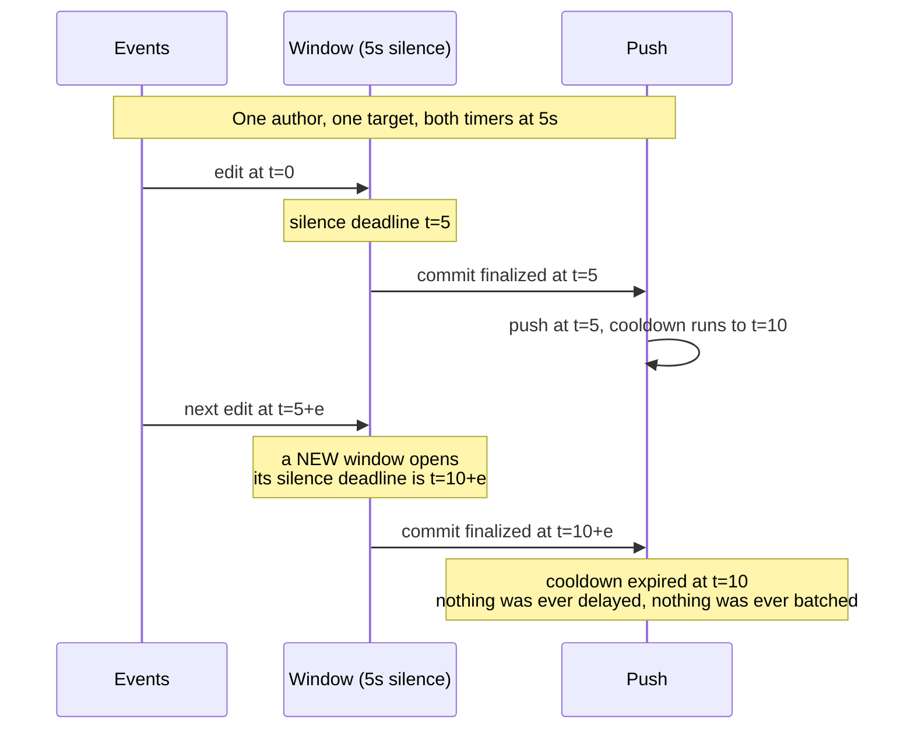
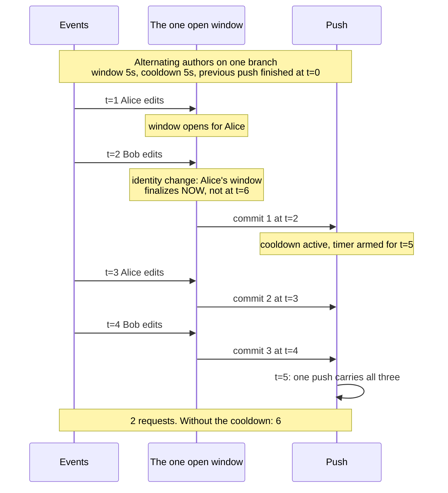
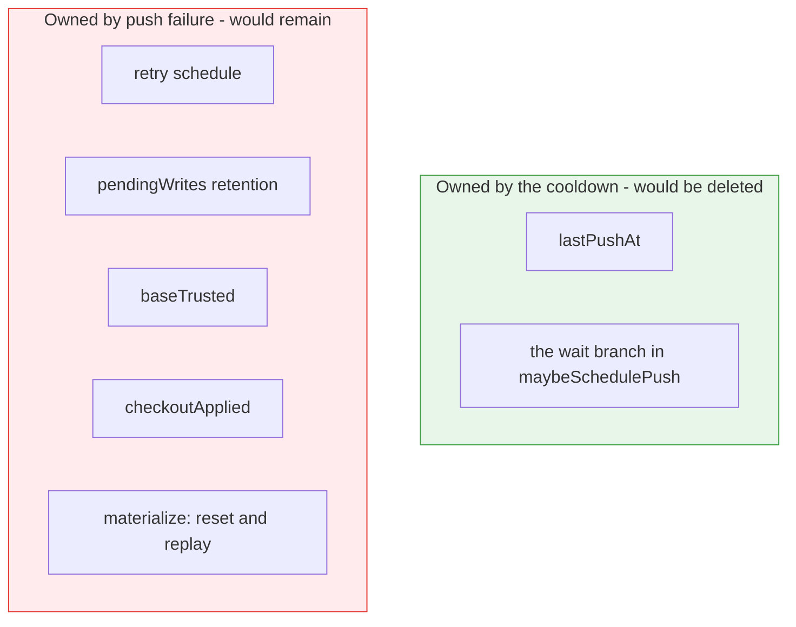
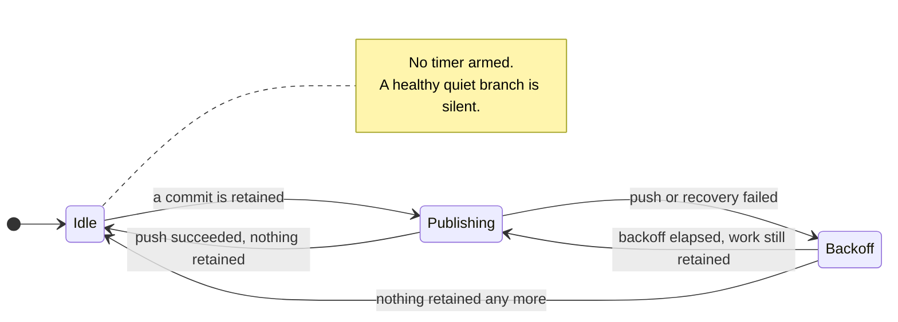

# The push cooldown: what it still buys, and what removing it would cost

> **design**: open. Option C (§7), the failure backoff, is built in
> [`retry.go`](../../internal/git/retry.go), now one schedule with parent recovery's probe; the success cooldown is
> unchanged. Option D needs measurement; option E remains rejected without that evidence.
> Index: [`../INDEX.md`](../INDEX.md). Reviewed at `373bf8d7` on 2026-10-03.
> Related: [`../api-first-publication.md`](../api-first-publication.md),
> [`push-notification-and-reconcile-trigger.md`](push-notification-and-reconcile-trigger.md),
> [`../spec/commit-window-refactor.md`](../spec/commit-window-refactor.md)

**The question.** `PushCooldown` predates the commit window. The window now groups an editing burst
into one commit, which is most of what the cooldown was invented to do. Is the cooldown still
earning its place, and would removing it simplify the worker?

**The short answer.** For a single author writing a single target, ordinary timer closures at the
defaults already space commits enough to avoid the success cooldown. Identity changes (§3), saves
with shorter timers, and buffer-limit closures can produce commits sooner. The cooldown batches
those commits when they arrive within five seconds of a successful push.

Removing the success wait would remove `lastPushAt`, `pushTimer`, and their scheduling branches.
The separate retry timer and retained-write recovery would remain.

Option C is built in #412. The remaining decision is whether changing the success cooldown earns
its extra publication cost; that needs the measurements in §9.

## An outage pause is a separate decision

Keep the success cooldown unchanged while completing the
[branch-worker recovery contract](gittarget-branch-worker-pending-writes.md#recovery-contract). Failure backoff
paces attempts at Git; capacity admission controls how much new work the process accepts. Neither
one supplies storage durability.

The proposed saturation behavior pauses intake for the affected worker, retains accepted entries,
and uses the existing retry deadline to attempt recovery. A successful read alone cannot reopen
intake when pushes still fail. Producers resume after the accepted backlog settles, using their
cursor or a fresh scoped snapshot if history expired. This does not require another cooldown,
a manager restart, or Redis. All targets sharing that worker share the pause; other workers run.

## 1. What it is today

`PushCooldown` is a fixed `5s` per worker. `maybeSchedulePush` runs after every local commit:

```go
if len(l.pendingWrites) == 0 { return }
if l.awaitingRetry() { return }                          // a failed attempt has its own deadline
if l.lastPushAt.IsZero() { l.pushPending(); return }      // never pushed: go now
if time.Since(l.lastPushAt) >= PushCooldown { l.pushPending(); return }
if l.pushTimer == nil { l.pushTimer = time.NewTimer(...) } // otherwise wait out the remainder
```

`lastPushAt` advances **only on a successful push**, so the cooldown paces successful publication
and does not pace retries. The publication backoff does that separately. Parent recovery owns
its attempts while active, and new commits wait for its deadline; see the
[worker event model](branch-worker-event-model.md).

## 2. Ordinary timer closures already space a single identity

`DefaultCommitWindow` and `PushCooldown` are both `5s`. The window is a rolling **silence** timer
per `(author, GitTarget)`. With no save or other early closure, a new window opens only after the
previous synchronous push returns, so its silence deadline already falls outside the cooldown:


```mermaid
sequenceDiagram
    participant E as Events
    participant W as Window (5s silence)
    participant P as Push

    Note over E,P: One author, one target, both timers at 5s

    E->>W: edit at t=0
    Note over W: silence deadline t=5
    W->>P: commit finalized at t=5
    P->>P: push at t=5, cooldown runs to t=10

    E->>W: next edit at t=5+e
    Note over W: a NEW window opens<br/>its silence deadline is t=10+e
    W->>P: commit finalized at t=10+e
    Note over P: cooldown expired at t=10<br/>nothing was ever delayed, nothing was ever batched
```

The next commit for the same identity cannot finalize until at least `window` after the previous
one, and the cooldown is measured from the push that followed that previous commit. When
`window >= cooldown`, the cooldown has always expired before there is anything to hold.

Shorter window timers, early closures, and several identities on a branch can all make the
cooldown engage. Equal default durations alone do not establish that every single-author workload
avoids it.

## 3. Where it does still work, and it is the normal case

There is exactly **one** open window per worker. An event that does not belong to it does not open
a second window: it **finalizes the open one immediately** and a new one opens in its place
([`branch_worker.go`](../../internal/git/branch_worker.go), `canAppend` and
`windowFinalizeReasonIdentityChange`).

That has a consequence worth stating plainly: **under alternating authors the silence timer never
fires at all.** Every commit is produced by the identity boundary, at the moment the next event
arrives. The window provides no spacing whatsoever, and the cooldown becomes the only thing
batching anything.


```mermaid
sequenceDiagram
    participant E as Events
    participant W as The one open window
    participant P as Push

    Note over E,P: Alternating authors on one branch<br/>window 5s, cooldown 5s, previous push finished at t=0

    E->>W: t=1 Alice edits
    Note over W: window opens for Alice
    E->>W: t=2 Bob edits
    Note over W: identity change: Alice's window<br/>finalizes NOW, not at t=6
    W->>P: commit 1 at t=2
    Note over P: cooldown active, timer armed for t=5
    E->>W: t=3 Alice edits
    W->>P: commit 2 at t=3
    E->>W: t=4 Bob edits
    W->>P: commit 3 at t=4
    P->>P: t=5: one push carries all three
    Note over E,P: 2 requests. Without the cooldown: 6
```

The same shape applies to several `GitTarget`s sharing a branch, and to an unattributed event
arriving against an attributed window (a `/status` change with no audit fact is the common cause,
which is why that log line exists).

| Source | Why the window does not space it |
| --- | --- |
| An author or target change | The identity boundary finalizes the open window on arrival of the next event |
| Several `GitTarget`s on one branch | One window, so every switch between them is an identity change |
| `commit.window.idleTimeout: 0s` | Every event commits on arrival |
| Atomic writes | They bypass the window by contract |
| Resync snapshots | They finalize and commit outside the window |

Ledger row 4 prices the batching: three commits published together cost **2** HTTP requests. Three
separate publications would cost **6**.

**This matters more than the first draft of this page assumed.** An earlier version drew two
concurrent windows and had Alice's commit waiting for her silence timer, which is not how the
worker behaves. Once the mechanism is right, the multi-identity case is not an edge: a multi-user
cluster with attribution enabled, the configuration this product is built for, produces one commit
per identity change, which is close to one commit per event.

## 4. What removing the success cooldown would simplify

This is the part worth being precise about, because the hope ("it would clean up a lot of state")
is half right.

**Goes away:**

| Item | Size |
| --- | --- |
| `lastPushAt` field | 1 field |
| Successful-push wait in `maybeSchedulePush` | The elapsed-time check and cooldown scheduling |
| `pushTimer` and its select arm | Success-cooldown scheduling only since step 3b |
| `PushCooldown` constant and its documentation | 1 constant, several doc paragraphs |

The failure backoff uses its own timer in `retrySchedule`. The worker currently has five timer
sources: window, success push, attach, refusal action, and retry. Parent recovery uses the retry
deadline. Removing the success cooldown would leave four sources.

**Stays exactly as it is:**

| Item | Why it is not the cooldown's |
| --- | --- |
| The retry schedule (`retry.go`) | A failed publication still needs a scheduled attempt |
| `pendingWrites` retention | A push can fail or be rejected; the writes must survive to be replayed |
| `baseTrusted` | The head-of-cycle fetch decision, unrelated to push cadence |
| `checkoutApplied` | A write that failed part-way, or a reset that discarded local commits, unrelated to push cadence |
| `materialize`, `refreshRemoteAndRebuildPendingWrites`, the whole replay path | Contention recovery |


```mermaid
flowchart TD
    subgraph COOLDOWN["Owned by the cooldown - would be deleted"]
        LPA["lastPushAt"]
        MSP["the wait branch in maybeSchedulePush"]
    end

    subgraph FAILURE["Owned by push failure - would remain"]
        PT["retry schedule"]
        PW["pendingWrites retention"]
        BT["baseTrusted"]
        CA["checkoutApplied"]
        RE["materialize: reset and replay"]
    end

    style COOLDOWN fill:#e8f5e9,stroke:#43a047
    style FAILURE fill:#ffebee,stroke:#e53935
```

**The complexity that makes this worker hard to reason about is in the red box, and removing the
cooldown does not touch it.** Every defect found in PR #382 lived there.

## 5. The one thing it does change

Today, "locally committed but not yet pushed" is the **normal** state: every burst passes through
it. Without the cooldown it becomes an **exceptional** state, reached only when a push fails or is
rejected.

That cuts both ways, and neither direction is decisive:

- **For removal.** A narrower window in which the retained-write paths can bite in production.
- **Against removal.** Those paths do not disappear, they get exercised far less. Code that is
  only reached on failure is code whose bugs are found later. The five defects PR #382 fixed were
  all in paths the cooldown makes routine.

Tests use `loop.lastPushAt = time.Now()` to hold the push back so they can inspect retained state.
Removing the cooldown requires another way to reach that state without changing the failure path
each test exercises.

## 6. Serialization limits concurrency, but does not batch queued commits

The branch worker is a single goroutine, and Git operations run synchronously on it. While a push
is in flight, arriving events sit in the queue. After it returns, each dequeued item runs its
handler, which can finalize a window and call `maybeSchedulePush` before the next item is read.

Without the success wait, queued alternating identities or zero-window writes can therefore each
cause a push. Serialization limits concurrent Git work to one operation; it does not automatically
combine queued commits into one publication. The cooldown can batch both a slow trickle and a
backlog that drains after a slow push.

## 7. Options

| Option | What it is | Complexity | Verdict |
| --- | --- | --- | --- |
| **A. Keep the success cooldown** | Preserve successful-push spacing | Unchanged | Current default alongside C |
| **B. Delete the success cooldown** | Push after every commit unless failure backoff applies | Removes `lastPushAt` and `pushTimer`; keeps the retry timer | §3 can become one push per identity change |
| **C. Add a failure backoff, keep the cooldown** | Schedule failed publications independently of new writes | One retry timer shared with parent recovery | Built in #412; schedule unified in step 3b of #413 |
| **D. Add the backoff AND shorten or drop the success cooldown** | C, plus reducing the `5s` wait once §9 has priced it | Depends on the outcome | The measured follow-up to C |
| **E. Make it conditional or configurable** | Engage only when more than one identity is active, or expose it on `GitProvider` | **+complexity, +API surface** | Rejected unless D measurably fails |

### Why C is the one to take first, and why it is not what this page started out recommending

An earlier draft of this page recommended removing the wait on success and replacing it with a
failure backoff, on the strength of the cooldown being inert. §3's correction undermines the first
half of that: the cooldown is inert only while one identity is writing, and it is load-bearing as
soon as two are. Dropping the success wait is therefore a **measured** decision, not an obvious one,
and it belongs in option D behind the numbers §9 asks for.

Before #412, `pushPending` stopped its timer on failure and armed no replacement outside parent
recovery. A quiet branch retained its work indefinitely, while continued arrivals could provoke
a failed push per commit because `lastPushAt` advances only on success. #412 adds the independent
failure backoff. Step 3b then unified the publication and parent-recovery deadlines. While parent
recovery is open, the due attempt services it. The following diagram describes publication retries;
the linked recovery contract adds admission pause and producer resume. Resync fetches can still
bypass backoff today; step 5b closes that gap.


```mermaid
stateDiagram-v2
    direction LR

    [*] --> Idle
    Idle --> Publishing: a commit is retained
    Publishing --> Idle: push succeeded, nothing retained
    Publishing --> Backoff: push or recovery failed
    Backoff --> Publishing: backoff elapsed, work still retained
    Backoff --> Idle: nothing retained any more

    note right of Idle
        No timer armed.
        A healthy quiet branch is silent.
    end note
```

## 8. Risks

Ordered by how much they should worry you.

1. **Request amplification on shared branches.** The architecture explicitly supports several
   `GitTarget`s per branch, and multi-tenant installs are the case where the cooldown is load-bearing.
   Option B turns row 4's `2` into `6`. This contradicts the premise of
   [`push-notification-and-reconcile-trigger.md`](push-notification-and-reconcile-trigger.md), which spent a whole change
   removing two requests per publication.
2. **Hosted Git rate limits.** With serialization the bound is one push per push-duration, which on
   a fast remote is several per second sustained. Measure throttling on the supported hosts before
   increasing publication frequency.
3. **`commit.window.idleTimeout: 0s` becomes a push per event.** On a healthy remote the cooldown
   spaces publications even with that setting. Anyone who set `0s` for prompt commits did not
   necessarily ask for prompt *pushes*.
4. **Losing a well-exercised path.** §5. The retained-write machinery stays; its production
   exposure shrinks; its bug-discovery rate shrinks with it.
5. **Test migration.** Tests use `lastPushAt` to reach retained state. They need a replacement
   lever, and a careless one (for example, stubbing `pushAtomicFn` to fail) changes what is being
   tested.
6. **A latency expectation somebody may already rely on.** Removing the cooldown makes publication
   up to five seconds faster, including for `CommitRequest`. That is a user-visible improvement, but
   it is a behavior change on a path people write automation against.

## 9. What to measure before deciding

The ledger built in PR #382 answers most of this, and turns the argument into numbers:

| # | Operation to add to the ledger | What it settles |
| --- | --- | --- |
| 1 | One author, one target, a burst at default window, with no early closure | Confirms §2 for ordinary timer closures |
| 2 | Two authors alternating on one branch | Prices the shared-branch identity changes described in §3 |
| 3 | Three `GitTarget`s on one branch, edited together | The multi-tenant bill for option B |
| 4 | `commit.window.idleTimeout: 0s`, ten events | Risk 3, as a number |
| 5 | A failing remote with continued arrivals, including parent recovery | Confirms retry pacing, including across the parent-recovery handoff |

Rows 1 to 4 need connection counts driven through the event loop because scheduling determines
how many publication cycles occur. Extend the existing event-loop fixtures, including #412's
held-request retry test, to measure those workloads.

## 10. Recommendation

1. **Keep the success cooldown while evaluating its cost.** Changing publication cadence needs
   a separate change and its own validation.
2. **Option C's retry schedule is built.** Step 3b unified it with parent recovery. The outage work
   that followed it (admission correctness, bounded Git calls, pause/resume, and visible status) is
   built too, in the branch-worker pending-writes plan. Removing the success cooldown would not have
   closed any of those gaps.
3. **Build the event-loop ledger rows in §9 before changing the success wait.** Retry tests prove
   progress, but the ledger still needs the cost of these scheduled workloads. Row 2 prices the
   multi-identity case.
4. **Only then consider option D.** If the numbers show the multi-identity case is rare in practice
   or the amplification is small, shortening or dropping the success cooldown becomes defensible.
   If they show what §3 predicts, keep it and the question is settled with evidence.

Removing the success wait keeps the retry timer and retained-write machinery. Its benefit must
therefore come from measured save latency, weighed against the additional publications.
