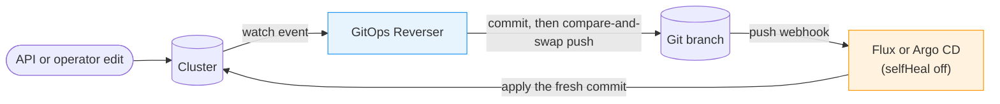
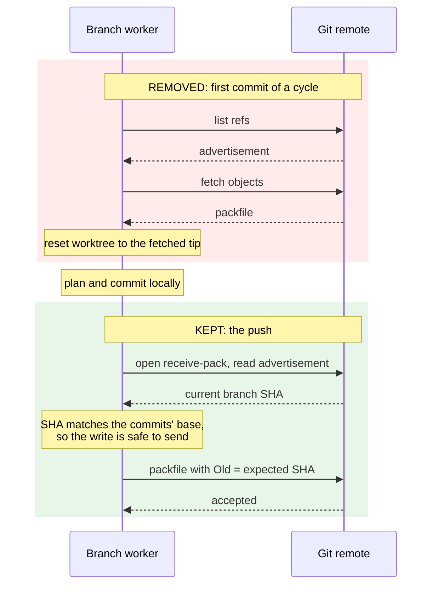
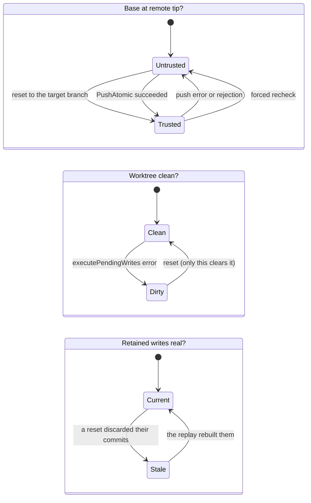
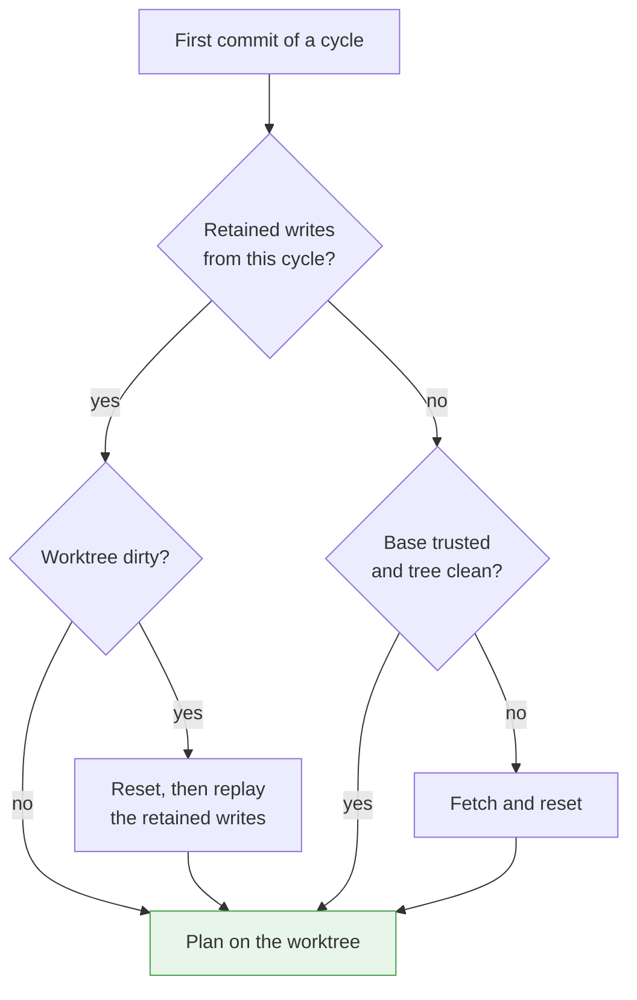
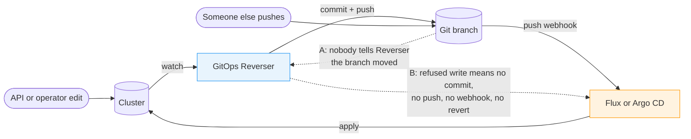
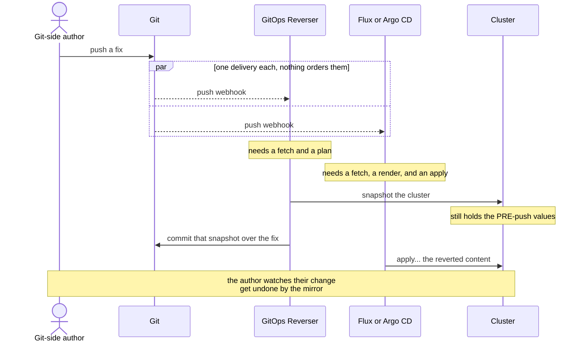
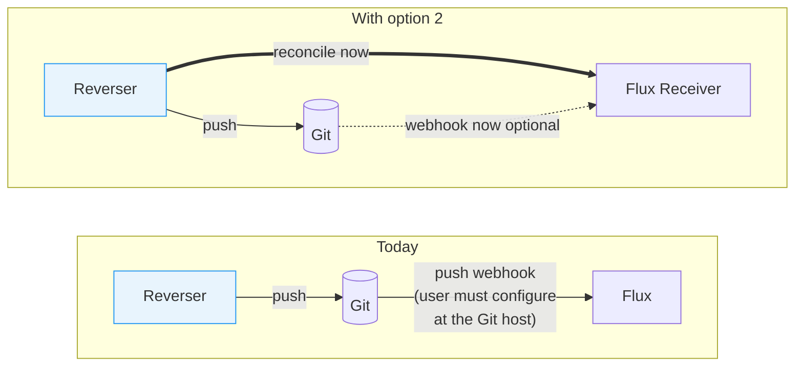
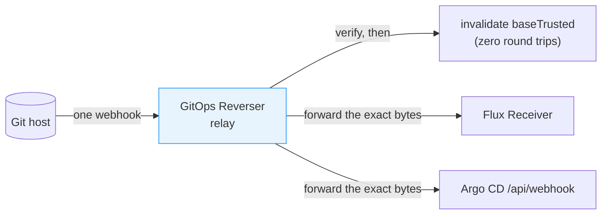
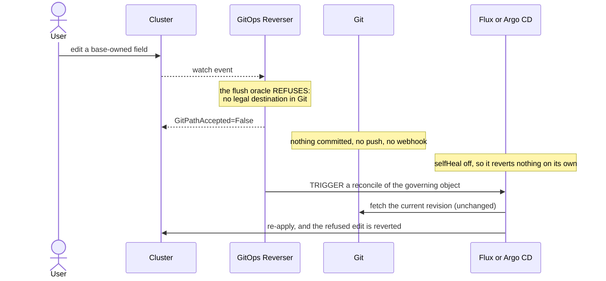
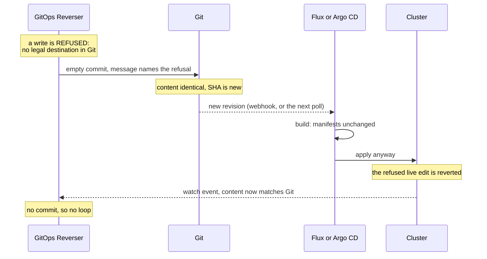

# Push notification and the reconcile trigger

> **design**: part shipped, the rest is a menu of options and none of them is chosen.
> Index: [`../INDEX.md`](../INDEX.md)
> Captured 2026-09-19, merged and rewritten 2026-09-21. This page replaces
> `inbound-push-notification.md` and `support-boundary/orchestrator-reconcile-trigger.md`,
> which argued two halves of one subject.
> Related: [`reconcile-triggering.md`](reconcile-triggering.md) (how our own controllers wake up;
> its §5 is superseded here), [`../bi-directional.md`](../bi-directional.md) (the user-facing
> model), [`support-boundary/orchestrator-knowledge-boundary.md`](support-boundary/orchestrator-knowledge-boundary.md)
> (the ownership model part 3 keeps running into),
> [`support-boundary/admission-consent.md`](support-boundary/admission-consent.md) (deciding
> *whether* a write happens, where this page is about what happens after).

Reverser and the GitOps reconciler share a branch and tell each other almost nothing. This page is
about the messages that do not exist yet, what shipped instead, and what each remaining option
would cost.

**Part 1** is built and measured. **Part 2** is the gap it leaves. **Part 3** is the menu, and
doing nothing is the first entry rather than a rhetorical one.

---

## Part 1: what is built

### 1.1 The loop, and where it closes



That is the product: the cluster is the editing surface, Reverser mirrors it to Git, and the
reconciler is a **triggered applier** rather than an always-on loop. Every arrow exists today, and
the one from Git to the reconciler is a webhook the user configures.

### 1.2 Which side wins, before anything else

Every option in part 3 depends on this, so it goes first.

- **Cluster to Git.** The Kubernetes API is where edits are made. A write we captured from it is
  intent, and it wins over what Git holds. Replay re-plans the captured object onto the new tip and
  writes it ([`../bi-directional.md`](../bi-directional.md)).
- **Git to cluster.** A push we did not author is new truth. We do not overrule it, and getting it
  applied quickly is the point.

Those read like a contradiction and are not, because they meet in exactly one cell.

| | We hold a captured write for the object | We hold nothing |
| --- | --- | --- |
| **A push changed it** | API wins, silently | **The hazard.** We must never publish here |
| **A push did not** | Ordinary publication | Nothing to do |

The top-left cell is the only genuine conflict and it is decided: the API value wins, with no extra
signal raised. The cell that matters is the top right. We hold no intent there, so anything we
publish for that object is a stale reading rather than a decision, and publishing it reverts a push
for no reason at all.

**Everything dangerous on this page lives in that one cell.**

### 1.3 The push already detects a moved branch

[`validatePushState`](../../internal/git/git_atomic_push.go) opens a push session, reads the
remote's ref advertisement, and compares it against the SHA the cycle's commits were based on. A
mismatch is refused before a single object is uploaded, and the `packp.Command` carries
`Old: oldHash` so the server enforces the same condition independently.

A cycle that commits **nothing** still reaches that push. A no-diff write is retained with a zero
`CommitSHA`, so the advertisement is read either way. That is what makes the next section safe.

### 1.4 What shipped: the fetch in front of every cycle is gone



The green block already reads the branch SHA, which is the only thing the red block contributed on
an uncontended cycle. **Reverser never polls the remote and holds no timer against it**, so an idle
target generates no Git traffic at all.

### 1.5 The invariant that replaced it

> **The worktree sits at the remote tip of the target branch, or the worker knows it does not.**

Three flags carry it, and they are three because each brackets a different span. Collapsing any two
is a bug that was found by trying.



- **`baseTrusted`** answers "are we at the remote tip". A successful push sets it; any push error or
  rejection clears it.
- **`worktreeDirty`** answers "did a failed write leave files nobody asked for". Only a reset clears
  it, and a successful push must never clear it: a push can succeed while an earlier write's
  leftovers are still staged, and treating those as one question commits them under an unrelated
  author.
- **`replayRequired`** answers "do the retained writes still name commits that exist". A reset
  discards the local commits behind retained writes; the replay rebuilds them. Die in between and
  the next push sends nothing, returns nil, and the worker settles a `CommitRequest` as `Committed`
  at a SHA that is on no remote. `worktreeDirty` cannot cover this, because the reset **clears**
  `worktreeDirty` at exactly the moment the problem starts.

A cycle plans straight onto the worktree only when the base is trusted and the tree is clean:



### 1.6 What it cost, measured

Every row comes from [`git-roundtrip-ledger.golden`](../../internal/git/testdata/git-roundtrip-ledger.golden),
produced against canonical git's `http-backend`. The unit is **HTTP requests to the Git host**.

| Situation | Before | Now |
| --- | --- | --- |
| Idle target | 0 | **0** |
| Uncontended publication | 4 | **2** |
| Publication that commits nothing | 3 | **1** |
| Contended publication, one rejection | 10 | **6** |
| Contended publication, two rejections | 16 | **10** |
| Resync snapshot | 4 | **4** |
| Forced recheck | 2 | **2** |
| Publication onto a branch the remote does not have | 4 | **2** |

Three of those are worth reading twice.

**A publication that commits nothing costs one request.** It opens the push conversation, reads the
advertisement, finds the remote correct, and sends nothing. That row *is* §1.3's argument, measured.

**A rejection cost ten, not the eight an earlier draft predicted.** When the remote has moved, the
fetch that discovers it transfers objects, so it costs three requests rather than two.

**The resync row does not move, deliberately.** A resync that finds nothing to change never reaches
a push, so nothing would catch a stale base. It keeps its fetch.

**A branch the remote does not have is trusted right away**, which is the last row and a later
change than the rest of the table. A reset lands the worktree on whatever the remote has for the
branch, and for a branch it does not have, a worktree based on the default branch (or an empty one)
**is** that state. There is nothing left to learn, so the two `fetch-open` requests that cycle used
to pay could only re-learn the absence. The compare-and-swap is what makes it safe: a push onto a
branch we believe is absent declares `Old = zero`, which the server rejects if somebody created it
meanwhile, and the rejection invalidates and fetches. The cost of being wrong is one rejection, not
a bad write.

### 1.7 The instrument

`gitopsreverser_git_fetches_total{provider_namespace, provider_name, branch, reason}` counts every
call that runs `SmartFetch`. The label is the point: a bare total would fall when contention fell
and rise when a webhook arrived.

| `reason` | Means |
| --- | --- |
| `publication` | Head of a cycle. **Zero on a healthy steady-state target**, which is the claim §1.4 makes |
| `recovery` | The base was untrusted or the tree was dirty. Nonzero means trust is being lost |
| `contention` | The reset after a confirmed rejection. One rejection costs exactly one |
| `push_failure_probe` | A push that died before the remote said anything: credentials, connectivity |
| `forced_recheck` | An operator asked, or a resync refreshed |
| `bootstrap` | **Test-only today.** `prepareBootstrapRepository` has no production caller |

---

## Part 2: the gap

### 2.1 Two messages that do not exist



**A: nothing tells Reverser that a branch it tracks moved.** A *publishing* target finds out at its
next push and replays, which is correct and costs one wasted request. A *refused* target recovers on
its own, because it is not converged and requeues every 10 seconds with a forced re-read. The case
that does not recover is a **healthy, idle** target: converged, requeuing every 5 minutes without
touching Git, holding its previous answer about a folder somebody has since changed.

Two honest qualifications. This gap predates §1.4, because a target with no writes never performed
the head-of-cycle fetch either. And on the traffic this system is built for it is mild. What changed
is the stakes: a notification is now the only thing that would move an idle target's view of Git.

**B: a refused write produces no commit, so nothing reverts it.** With Argo CD `selfHeal: false`,
which bi-directional editing requires, the live edit stays `OutOfSync` until a human intervenes.
Under Flux it is reverted on the next apply interval, which a long interval leaves hours away.

Note the shape of that sentence, because option 7 turns on it: the reconciler is idle here not
because it lacks permission to apply, but because **nothing has changed the revision**.

### 2.2 Why the obvious fix for A is dangerous

The chain to make an idle target re-read Git already exists and a human can drive it:

```bash
kubectl annotate gittarget editing -n gitops-reverser \
  reconcile.configbutler.ai/requestedAt="$(date +%s)" --overwrite
```

That annotation runs a **full resync**: a cluster-to-Git snapshot with mark-and-sweep. Wiring a push
webhook to it would be the most natural thing in the world and would be a correctness bug.



The argument is not that we are always first. It is that **nothing prevents it**, the window is a
render and an apply wide, and the failure is silent. This is §1.2's top-right cell: those pre-push
values are not intent, they are what the cluster happened to hold.

**So the rule for anything built in part 3 is absolute: a notification that a branch moved must
never trigger a cluster snapshot.** A push tells you about Git. It says nothing about the cluster.

The annotation stays exactly what it is, a human escape hatch for "go and look at Git now", where a
snapshot is what the operator is asking for.

---

## Part 3: the options

Six of them, cheapest first. They are not mutually exclusive, and the order below is roughly the
order in which they could be built.

### Option 0: do nothing

**What it is.** Keep §1.4 as shipped. Operators use the annotation when they need a re-read, and
configure their Git host's webhook to point at Flux or Argo CD as they do today.

**What it costs.** §2.1's two gaps stay open. An idle target holds a stale answer about its folder
for up to 5 minutes plus however long until somebody looks. A refused edit is never reverted on
Argo CD without a human.

**What it buys.** No new inbound surface, no new secret to handle, no new outbound call, no new
single point of failure, and nothing extra for an operator to configure.

**When it is the right answer.** For audit-only use it is straightforwardly correct: nobody is
editing through the API, so neither gap bites. For bi-directional use it is the honest default
until somebody reports the staleness as a real problem, and the counter in §1.7 is what turns that
report into a number instead of an anecdote.

**This is the baseline every option below has to beat.** Note that the measured argument for a
notification is weak on traffic alone: told in advance, the worker still has to fetch the moved
branch (three requests) and push (two). It saves exactly one request, the rejected advertisement.
The case for anything here rests on §2.1's staleness, not on §1.6's table.

### Option 1: a maximum age on `baseTrusted`

**What it is.** Not a new poller. The `GitTarget` already requeues on a 5-minute steady interval and
that pass currently publishes status without touching Git, so it is a scheduled tick looking for a
job. Give `baseTrusted` an age; when the tick finds it too old, clear it. The next cycle fetches.

**It has to schedule a wake-up, not be consulted lazily.** An idle target is precisely the one with
no arriving writes, so an age tested only at the head of a cycle can never fire on the target it
exists to protect.

**What it costs.** One fetch per target per interval on targets that are otherwise silent, whether
or not anything changed. That is the cost §1.4 removed, reintroduced at a cadence you choose
rather than per cycle.

**What it buys.** Bounded staleness with **no Git-host configuration at all**, which no other option
here can say. It is also the safety net that turns a missed webhook into a latency problem rather
than a stuck one, which is the same argument Flux makes for keeping a short `GitRepository`
interval alongside a `Receiver`.

**Consequence worth stating.** If any option below is built, this one should be too, expressed as
the same age rather than as a second mechanism.

**Built, and off by default.** `--base-trust-max-age` takes a duration and `0`, the default, never
expires anything, which keeps §1.6's measured zero-fetch idle target true for anyone who does not
opt in. The age is enforced on the `GitTarget` reconcile rather than by a timer in the worker,
because the target it exists for is the idle one and an idle worker has nothing arriving to check a
clock on.

**Expiry forces the re-read; it does not merely permit one.** Clearing the flag alone would be a
no-op on precisely the target the age exists for: an idle target is converged, nothing publishes,
and so nothing ever spends the fetch the cleared flag allows. So expiry joins `forceRecheck` and
drives the same chain the reconcile-request annotation does. That makes the real cost a resync per
target per interval on otherwise silent targets, not a bare fetch, and it is the honest price of
moving what an operator can see. The stamp is written on every gain of trust, not only on the transition into it, so a
target that keeps publishing keeps resetting the clock and is never expired out from under a busy
branch.

### Option 2: tell the reconciler after we push

**What it is.** After a successful `PushAtomic`, ask the downstream to reconcile. Outbound only.



Flux ships the client for this. `flux trigger receiver` is an HMAC and a POST against a
`generic-hmac` `Receiver`, with the path derived from the token
(`cmd/flux/trigger_receiver.go` in flux2). It needs **no Flux Go types and no ownership claim**,
because the `Receiver` already names the resources to wake.

**What it costs.** One optional configuration block (a URL, a secret, a flavor), one outbound HTTP
call per successful push, and the discipline in the four rules below. Argo CD is worse, because it
has no generic receiver type: reaching it means synthesizing a host-shaped signed push event, which
is the inverse of option 4 and shares its code. **Start with Flux.**

**What it buys, and this is the part worth noticing.** The cluster-to-Git-to-cluster loop closes
**without the user configuring a Git host webhook at all.** Today somebody editing through the
Kubernetes API has to set up a webhook at GitHub only to watch their own edit come back. With this,
they do not. That is a quickstart simplification, not only a latency win, and it is the strongest
user-facing argument anywhere on this page.

**Four rules it does not get to soften:**

- **It requests reconciliation.** The POST says the reconciler was asked, never that the revision
  was applied. No status, log line or metric may claim otherwise.
- **It is asynchronous and bounded,** off the publication path.
- **It retries and reports on its own.**
- **A failed notification never fails a successful publication.** The commit is in Git either way,
  and the reconciler's timer is the backstop.

**What it does not do.** Nothing for gap A. A push we made tells us nothing about a push somebody
else made.

### Option 3: receive a push notification

**What it is.** Our own validated endpoint. The Git host (or a relay in front of it) posts
`{repository, branch, after}`; we clear `baseTrusted` and record the believed tip. §4.1 is the wire
contract.

**All it does is invalidate, and it must not fetch.** Fetching looks like the obvious thing and is
wrong under the budget: it would spend requests immediately on a target that may have nothing to
publish for an hour. Clearing the flag costs zero. The next publication cycle then finds an
untrusted base, fetches once with a real reason, and pushes onto the correct tip instead of
discovering the move through a rejection.

**Its mandatory companion.** The dedupe rule is one comparison, and the bookkeeping behind it is one
SHA.

| `after` | Meaning | Action |
| --- | --- | --- |
| equals the believed tip | Our own push coming back | Ignore |
| anything else | Somebody moved the branch, or we cannot tell | **Invalidate** |

That needs `lastCommitSHA` to advance **on a successful push**, which it does not today: it is
written only on fetch paths, so every one of our own publications would look foreign and earn a
fetch. Without that write the feature pays back the round trip it saved.

**There is deliberately no `before` field.** A set of SHAs we published cannot distinguish our own
delayed delivery from somebody rolling the branch back through commits we published, because both
are pairs drawn from the same set: the information the distinction needs is **order**, which a set
has thrown away. If false invalidations ever measure as a problem, the escalation is an ordered
record, built with a number in hand.

**What it costs.** An inbound endpoint, per-route secrets, repository-URL normalization, and the
rule from §2.2 written into the handler rather than assumed.

**What it buys.** Gap A closes within a second of a push, for the price of one more webhook at the
Git host. §5.4 of the old triggering design called that config cost the thing this feature has to
justify, and on §1.6's numbers it does not justify it on traffic.

**One thing refresh alone does not do.** `syncWithRemote` updates the checkout and the branch
metadata and stops. It does not re-evaluate the acceptance gate or re-resolve placement, because
those reach status today only via the snapshot that §2.2 forbids here. So an idle target would
fetch a fresh tree and report nothing about it. The round-trip-free answer is to **report the
staleness rather than resolve it**: set `status.remote.revision` to the SHA the notification named
and leave `lastFetchedAt` where it was. The two disagreeing is the signal, and it is honest.

### Option 4: take over the webhook and forward it

**What it is.** The Git host talks only to us, and we forward each delivery onward to Flux or
Argo CD. Option 3 plus an outbound leg and a payload parser.



**The load-bearing reason is not timing: we never have to work out which object syncs the folder.**
Argo CD's `/api/webhook` matches a delivery against every `Application` whose source repository
matches; a Flux `Receiver` fans out to the objects in its `spec.resources`. Forwarding hands routing
to the tool that owns it.

That matters because **neither orchestrator derives that mapping either.** Argo CD refreshes every
matching `Application` and narrows only when the user supplies the
`argocd.argoproj.io/manifest-generate-paths` annotation; with no annotation, or a payload that did
not list changed files, `AppFilesHaveChanged` returns true and it refreshes
(`util/app/path/path.go`). A Flux `Receiver` derives nothing at all: `spec.resources` is written by
hand. Both either ask the user or fan out, because a redundant refresh is cheap for whoever owns the
cache. An interpreter that derived the answer would be claiming something neither tool claims, to
drive a **write** rather than a refresh, against `resources:` lines and `ApplicationSet` generators
that move without telling us. A stale claim does not fail loudly; it triggers the wrong controller,
or none.

This repository has already paid for modeling a tool instead of asking it: the write path stopped
re-implementing kustomize's transformers and now asks kustomize what a folder renders to, and three
shipped render bugs went with that change ([`../UPGRADING.md`](../UPGRADING.md)).

**Forwarding must be transparent.** Each downstream authenticates differently:

| Argo CD parser | What it verifies |
| --- | --- |
| GitHub, Gogs, Bitbucket Server | HMAC over the raw body |
| GitLab | a token compared against the configured secret |
| Azure DevOps | HTTP Basic |
| Bitbucket Cloud | a UUID |

What they share is the property the relay needs: each checks the request **as the host sent it**, and
none asks the relay to hold a secret. So copy the bytes and the headers, sign nothing, re-serialize
nothing. Adoption is changing a URL at the Git host and keeping the secret.

Three constraints follow. Cap the buffered body at or above the downstream's own limit (Argo CD
enforces `maxWebhookPayloadSizeB`, and a smaller cap makes the relay the limit). Take the forward
target from configuration and never from the payload. And parse host-native envelopes after all,
for our own `(repository, ref, after)`, behind a per-route declaration of which host's shape to
expect, never behind sniffing; a parse failure forwards anyway.

**What it costs, and it is the largest cost on this page: we become the only trigger.** Today an
operator outage stops Git from being updated. Here it stops deployments. The reconciler's timer is
then the whole backstop, so it has to stay a real one.
[`../bi-directional.md`](../bi-directional.md) already has the right shape for Flux and for the
right reason: `GitRepository.spec.interval: 1m` with a long `Kustomization` interval, because a new
source revision wakes the dependent Kustomizations. That poll survives untouched. Argo CD's
`timeout.reconciliation` does not, since `0` disables the timed refresh outright, and **"long
intervals" must never be read as "no intervals"**.

**What it buys.** Gap A, plus the ordering in §2.2 becomes structural instead of a rule, plus one
webhook at the Git host instead of two.

**What it does not buy: being first in general.** A `GitRepository` poll, an Argo CD refresh timer,
a retry, or an operator running `flux reconcile` all reach Git without us. Forwarding removes the
race between two webhook deliveries, which is the one race that had no other answer. **Nothing may
depend on being first.**

### Option 5: hold the push while an apply is in flight

**What it is.** On a foreign push, stop producing commits until the apply has had its chance, since
anything produced there is replayed anyway.

**It cannot carry correctness, and this is the important part.** Four reasons, all in the tree
today:

- **Commit windows do not merge across authors.** `canAppend`
  ([`open_window.go`](../../internal/git/open_window.go)) requires a matching author, attribution and
  target, so an apply under the orchestrator's service account **closes** the user's window and
  opens its own rather than collapsing into it.
- **Window timers fire during a hold.** A window closes on silence, not on our permission.
- **Retained writes sit outside any window** and a hold does not reach them.
- **Nothing observes an apply converging.** Knowing a revision landed means comparing live objects
  against a rendered revision, deletions included. That is its own piece of work, and it is not
  `skipUnchangedLiveUpdate`, which caches the last sanitized hash per object and compares successive
  **live** events, never Git.

**So it is an optimization.** A bounded pause on the **push**, never on the watch, expiring on a
timer, with compare-and-swap and replay unchanged underneath. The test of whether it stayed one is
that skipping it entirely changes no outcome.

**What it buys.** One doomed commit and one doomed push per foreign push.

**What it costs.** Latency on unrelated live edits for the length of the hold, unless it is scoped
to the objects the push changed, which needs a local diff of the two tips.

**Do not stop the event stream to achieve this.** Dropping watch events means re-deriving them, and
re-deriving is a resync, which is the cluster snapshot §2.2 forbids next to a push.

### Option 6: trigger a reconcile to revert a refused edit

**What it is.** Gap B. When the flush oracle refuses a write, ask the reconciler to re-apply the
governing object, which reverts the live edit that has no home in Git.



**The operator is uniquely entitled to do this.** Argo CD cannot distinguish authorized drift from
unauthorized, which is why `selfHeal` has to be off. At refusal time we have exactly that signal,
because a refused edit is by construction the drift with no home in Git. So this is the targeted,
per-write substitute for the blanket self-heal that had to be switched off.

**What it costs, and why it is last.** This is the one option that **cannot** be done by forwarding,
because a refusal produces no push to forward. It needs the ownership interpreters: a claim of the
form "object O reconciles path P", plus the ability to patch O. Flux is a one-annotation trigger
with a correct outcome (`reconcile.fluxcd.io/requestedAt` on the `Kustomization`; a server-side
apply reverts drift as a side effect). **Argo CD needs a sync operation, not a refresh**, because a
refresh with `selfHeal` off only marks `OutOfSync`. That is a write into somebody else's controller
and has to be scoped so it can only ever revert the specific refused object.

**What it buys.** The only thing that ever reverts a refused edit on Argo CD without a human.

**Hard boundaries if it is built.** Off by default, per `GitTarget`. Never on a cluster we merely
mirror: we do not get to drive somebody's orchestrator because our mirror is lossy. And an absent
orchestrator is a no-op, not an error.

### Option 7: push an empty commit

**What it is.** Gap B again, with none of option 6's machinery. On a refusal, commit nothing and
push it: `git commit --allow-empty` with a message naming what was refused. The branch moves, both
reconcilers notice a new revision, and each applies the same desired state it already had, which
reverts the drift as a side effect.



**It is the same move as option 4.** We do not name the object that syncs the folder, we move the
branch and let each tool decide what that means. Option 6 has to patch a specific `Kustomization` or
`Application`; this patches nothing and needs no claim about anybody's topology.

**It works, and here is why, per tool.**

*Flux is unconditional.* A new commit is a new `GitRepository` artifact revision, which wakes the
dependent Kustomizations, and kustomize-controller server-side-applies the built manifests, which
corrects drift whether or not the build changed.

*Argo CD works by default and has one exception worth knowing.* The `selfHeal: false` skip in
`autoSync` sits inside `if alreadyAttempted`, and `alreadyAttemptedSync` compares the desired
revision against the last sync's revision (`controller/appcontroller.go`). A new SHA makes them
differ, so the skip never runs and automated sync proceeds. **This is the whole trick: `selfHeal`
gates drift at an unchanged revision, and an empty commit is a changed revision.**

The exception is `argocd.argoproj.io/manifest-generate-paths`. With it set, `evaluateRevisionChanges`
asks the repo server whether any file under the refresh paths changed between the two revisions
(`controller/state.go`). For an empty commit nothing did, so `revisionsMayHaveChanges` is false, the
revision comparison is skipped, and the sync is treated as already attempted. **An empty commit is
ignored by an Application carrying that annotation.** It is the same annotation option 4 discusses,
which is a coincidence worth remembering rather than a connection.

**What it buys, and it is a lot for the price.** Option 6's entire cost disappears: no ownership
interpreters, no patching another controller's object, and above all **no Argo CD sync authority**,
which was its worst problem. It needs no webhook, no secret, no URL, and no new configuration of any
kind, because we already hold push credentials. It is the only option on this page that adds zero
configuration surface. The commit message is also an audit trail of refusals, in the place an
operator is already looking.

**Four costs, and the third is the one to be careful about.**

- **The blast radius is the branch, not the object.** Everything watching that repository re-applies.
  Option 6 wakes one object; this wakes all of them. That is usually harmless and occasionally not.
- **It can revert live edits we have not published yet.** An allowed edit sitting in an open commit
  window is reverted along with the refused one. Landing pending intent before the empty commit
  shrinks the window to the length of the apply; it does not close it.
- **Pruning is not ours to hurry, and that decides the scope.** Re-applying only corrects drift on
  an object Git manages. For one it does not, re-applying does nothing (Flux prunes from its
  inventory and Argo CD from the resources it tracks, so a live-created object is in neither), or
  prunes it, when the object was managed and has since been removed from Git. The two are
  indistinguishable from here and only one is harmless, so **the commit fires only when the folder
  already holds a file for every refused object**. An earlier version of this page said the action
  deletes such objects and left that as a warning; it is now a fence.
- **The blast radius still reaches other people's prunes.** The commit moves the branch, so
  everything watching it re-applies, including another target's pending delete. The fence bounds
  what we commit FOR, not what a moved branch causes, and nothing in a branch-wide trigger can.
- **A flapping refusal writes a stream of empty commits.** Debounce per object, and cap it.

**What it does not do.** Nothing for gap A, which is about learning that somebody else pushed.

**How it degrades.** Without a Git-host webhook it still works, on the reconciler's own clock:
Flux notices within its `GitRepository` interval, Argo CD within `timeout.reconciliation`. So it
needs no webhook to be correct, only to be fast.

**Where this leaves option 6.** Mostly superseded. It survives only where waking exactly one object
matters and waking the branch is unacceptable, and that case now has to argue for the interpreters
on its own rather than inheriting the need from gap B.

**Built, as `GitTarget.spec.onRefusal: PushEmptyCommit`,** defaulting to `Ignore`. Four guards ship
with it, and the first two are the ones this section argued for:

- **Off unless asked for**, because of the `prune` row above.
- **Rate limited per target, and COALESCED rather than dropped.** A controller rewriting a
  base-owned field refuses on every one of its own reconciles, and every commit wakes every
  reconciler watching the branch. But a refusal discarded inside that window is lost: the reconcile
  an earlier commit triggered may already have finished, so nothing would ever cover it. One
  trailing commit covers every refusal that arrived during the window, and re-checks consent when
  it fires.
- **Never for a suspended target.** An empty commit is a write, and it is the one write that
  reaches outside this operator, so the state that means "write nothing" has to stop it.
- **A GitTarget that cannot be read is treated as opted out.** Missing evidence is not consent for
  an action that deletes where the reconciler prunes.

The commit message explains its own empty diff, so `git log` does not show what looks like a stray
no-op.

### Option 8: hand the action to the installer

**What it is.** Stop deciding what a refusal should cause. Emit the fact, with enough detail to act
on, and let whoever installed the operator decide. We then need to know nothing about Argo CD or
Flux for gap B at all.

**The instinct is right and it is the same one behind options 4 and 7:** do not model somebody
else's system, hand them the decision. What it turns on is the *mechanism*, and the three candidates
are not equivalent.

#### 8a. Execute a script mounted from a ConfigMap: declined

The obvious shape: mount a script, run it on refusal, pass the `GitTarget` and the destination as
arguments. It is declined, and recorded here so it is not re-proposed.

**It is arbitrary code execution as the operator.** The operator process holds Git push credentials,
SSH private keys, SOPS and age keys, and the kubeconfigs of every mirrored remote cluster, and its
service account watches the whole cluster. A script mounted from a ConfigMap runs with all of that.
Anyone who can write that one ConfigMap can exfiltrate every credential the operator holds. That is
a privilege escalation from "edit a ConfigMap in one namespace" to "own every Git repository and
cluster this operator touches", and no amount of care in the handler changes it.

**Argo CD already ran this experiment.** Config management plugins were configured in `argocd-cm`,
were deprecated in 2.4 and **removed completely in 2.8**, and the replacement is a sidecar container
with its own image and security context, not a mounted script. Flux does not offer the pattern at
all.

Three smaller objections, any one of which would still need answering:

- **It blocks the branch queue.** Publication for a branch is one serialized worker. A script that
  hangs stalls every write for that branch, so this needs timeouts, concurrency limits and an answer
  for "the script is broken" before it is a feature.
- **It fixes the base image.** The runtime is `distroless/static:debug`, whose shell is busybox from
  the debug tag. Depending on that for a product feature pins the image to `:debug` and turns every
  future attack-surface review into a conversation about it.
- **We cannot test the outcome.** Our e2e could assert that the hook was called and nothing about
  what it did, so the product's promise for gap B would shrink to "we told someone".

#### 8b. Emit a structured event: recommended, and nearly free

The operator already has an `EventRecorder` and already emits Events on condition transitions
([`status.go`](../../internal/controller/status.go)). A refusal already sets `GitPathAccepted=False`.
What is missing is an Event carrying enough to act on.

**The payload has to say more than which target refused.** A handler that knows only the `GitTarget`
and the destination cannot do anything specific. It needs the refused object (group, kind, namespace,
name), the reason, and the author, because the useful actions are all per-object: revert this one
resource, notify the person who made the edit, open a ticket naming the field.

The installer then wires whatever they want to it, with no new privilege anywhere: a small
controller watching Events, a Prometheus alert into Alertmanager, or a Flux `Alert` in
notification-controller. This is the idiomatic Kubernetes seam, it costs us one call, and it is
testable on our side because "we emitted this Event with these fields" is an assertion.

The honest trade against 8a: the installer has to run *something*, rather than dropping a shell
script into a ConfigMap. That is the price of not putting an RCE in the operator.

#### 8c. Notify an endpoint the installer configures

The same idea over HTTP, and it is **option 2's outbound leg with a second event type**: the same
configuration object, the same HMAC, the same retry and the same rule that a failed notification
never fails a publication. Point it at a Flux `Receiver` after a push, or at the installer's own
endpoint after a refusal.

Worth building only once option 2 exists, at which point it is small. Until then 8b covers the same
ground without any new machinery.

#### How this composes

Option 7 is the sensible **default** action for a refusal and option 8 is the **escape hatch** for
installers who want something else, so they are not competitors. Between them, gap B is covered
without the operator ever naming a `Kustomization` or an `Application`, which is what option 6
needed the ownership interpreters for. **On this reading option 6 may never be built at all**, and
the interpreters would then have to justify themselves on some other feature rather than on this one.

### 3.7 Summary

| | Closes gap | New inbound surface | New outbound call | Git-host config | Needs ownership interpreters |
| --- | --- | --- | --- | --- | --- |
| **0. Do nothing** | neither | no | no | unchanged | no |
| **1. Max age on `baseTrusted`** | A, bounded | no | no | **none** | no |
| **2. Tell the reconciler after we push** | neither | no | yes | **removes one** | no |
| **3. Receive a notification** | A | yes | no | adds one | no |
| **4. Take over and forward** | A | yes | yes | **replaces one** | no |
| **5. Hold the push** | neither | no | no | unchanged | no |
| **6. Trigger on refusal** | B | no | yes | unchanged | **yes** |
| **7. Push an empty commit** | B | no | no | **none** | no |
| **8b. Emit a structured Event** | B, by delegation | no | no | **none** | no |
| **8c. Notify an endpoint** | B, by delegation | no | yes | **none** | no |

Options 2, 3 and 4 share one configuration object and one piece of bookkeeping (`lastCommitSHA`
advancing on a successful push), so whichever is built first should shape both.

**Option 7 is the cheapest thing on this page and it closes gap B on its own**, which is not where
this page expected to end up: gap B was the one that looked like it needed the ownership
interpreters. It adds no configuration at all. Read its four costs before believing that, in
particular what it does under `prune: true`.

**Options 7 and 8 together are why option 6 may never be built.** One gives a sensible default
action and the other gives installers a seam for anything else, and neither requires the operator to
name an orchestrator object. Option 6 remains the only way to wake exactly one object rather than
the branch, and that is now the whole of its case.

---

## Part 4: reference

### 4.1 The wire contract for option 3

Two readers need this before any code exists: whoever builds the handler, and whoever points
something at it.

**Where it listens.** The operator runs two HTTPS listeners: the controller-runtime webhook server
(admission and conversion, called by the API server) and the audit server (its own `Service` and
certificate, called by the API server's audit backend, possibly off-cluster). **The receiver belongs
on the audit listener.** It is the same shape of traffic: an inbound POST from something that is not
the API server, authenticated by a shared secret. Putting it on the admission server would expose
the listener the API server trusts to a Git host. That is a recommendation; an implementer who
disagrees should record why here rather than landing it on the admission server because `Register`
was easier to call.

```text
POST /git-push/<route>
Content-Type: application/json
X-Reverser-Signature: sha256=<hex HMAC of the exact request body>
```

```json
{
  "repository": "https://github.com/acme/infra.git",
  "branch": "main",
  "after": "9f7fc13494903993371f49caa67bd08051987cd3"
}
```

| Field | Meaning |
| --- | --- |
| `repository` | In any form the host uses. Matched against `GitProvider.spec.url` after normalization, never by string equality |
| `branch` | The short name, `main`, not `refs/heads/main` |
| `after` | The SHA the branch now points at, or forty zeros for a deletion |

`<route>` names a receiver configuration the way `/audit-webhook/<route>` does today, so several
hosts or organizations can deliver to one operator with separate secrets. It is a path segment so a
proxy can route on it and a log line identifies the sender without a body.

**A host-native payload is not accepted here.** The three fields above are trivially derivable from
every host's envelope, and whoever wires a host up writes that mapping once. (Option 4 changes this,
because there we *are* the thing in front.)

**A deletion is a movement like any other.** Forty zeros says the branch is gone, and the handler
invalidates as it would for any value it does not believe.

**Authentication.** Hex HMAC-SHA256 of the exact body, keyed by the route's secret, compared in
constant time and computed over the raw bytes before any JSON decoding: re-serializing changes them.
Three rules that do not soften. An unsigned or wrongly signed request is refused and nothing about it
is acted on, because an endpoint accepting anonymous "this moved" claims is a way to make a target
fetch on demand. A route with no configured secret does not serve. And verification happens before
the body is parsed for anything else, including the repository lookup, so an unsigned request cannot
probe which repositories this operator tracks.

| Status | When |
| --- | --- |
| `202 Accepted` | Verified and applied, **including when it matched no branch worker** |
| `400` | Not JSON, or a required field missing or malformed |
| `401` | Signature absent or wrong |
| `404` | No such route |
| `503` | Not ready to serve |

**A delivery that matches nothing is a success.** A `GitTarget` may be suspended, the branch may be
one nobody mirrors, or the repository may not be ours. None is the caller's fault, and an error
teaches a Git host to disable the hook. The body says `{"matched": 0}`, which is what makes a
misconfigured hook debuggable and is the argument for a counter labeled by route.

**Normalization is where matching goes wrong**, so state it: compare case-insensitively on host and
path, strip a trailing `.git`, strip a leading `git@` or `ssh://git@`, and ignore a default port.
`git@github.com:acme/infra.git` and `https://github.com/acme/infra` are the same repository.

**Delivery is unreliable and the handler is built for that.** Deliveries arrive out of order, twice,
or never. Invalidation is idempotent, so applying it twice is applying it once. A missed delivery
costs freshness, never correctness, because the compare-and-swap is still what makes a stale base
safe. The tests are reordered delivery, dropped delivery, a duplicate, and a rollback that passes
only through SHAs we published.

**Calling it by hand:**

```bash
BODY='{"repository":"https://github.com/acme/infra.git","branch":"main","after":"9f7fc134..."}'
SIG=$(printf '%s' "$BODY" | openssl dgst -sha256 -hmac "$RECEIVER_SECRET" -hex | awk '{print $2}')

curl -sS -X POST "https://reverser.example.com/git-push/acme" \
  -H 'Content-Type: application/json' \
  -H "X-Reverser-Signature: sha256=$SIG" \
  --data "$BODY"
```

### 4.2 `status.remote`

An operator who can no longer assume a fetch per cycle needs to see when the remote was last read.
The worker tracks it and does not surface it.

| Field | Source | Meaning |
| --- | --- | --- |
| `revision` | `lastCommitSHA` | The branch head as of the last read |
| `lastFetchedAt` | `lastFetchTime` | When that read happened |
| `branchExists` | `branchExists` | False while the branch is unborn |

Name it fetch rather than pull: nothing merges. The doc comment should say it dates the **read**, so
a timestamp well in the past means nothing has looked, which after §1.4 is the normal state of a
healthy quiet target. A successful push advances `revision` too, which is the same write option 3
depends on.

### 4.3 What has to be proven

The [bi-directional corner](../../test/e2e/flux_bi_directional_e2e_test.go) is the only place with
both reconcilers against a real remote. Whatever is built from part 3 needs these, and the last one
must never be allowed to lapse:

0. **A new revision is enough** (option 7's load-bearing claim, and the only part of it real Flux
   can answer). Drift a live object, push a commit that changes no file, wake only the
   `GitRepository`, and assert the `Kustomization` applies on its own and reverts the drift. The
   `GitTarget` is suspended first, or the operator publishes the drift and there is nothing left to
   revert; and the `Kustomization` is never reconciled by hand, or it would apply for a reason that
   has nothing to do with the new revision. **Built**, in the Flux corner.
0b. **The whole loop, with nothing staged but the broken folder.** A loose non-YAML file makes the
   folder unacceptable to the operator and not to Flux, a live edit to a managed object is refused
   for real, and the operator makes its OWN empty commit, which Flux then acts on. It also asserts
   the thing a triggered write most needs to prove: that it **settles**. Flux's revert is itself a
   watch event and is refused too, so it earns one more commit once the rate limit allows, and then
   stops, because the revert restores the value Git already holds. **Built**, in the Flux corner.
0c. **A refusal alongside accepted work, under contention.** Deliberately NOT an e2e: the property
   is about arrival order between our push and somebody else's, which the corner does not control.
   Over a real Git server the contending commit lands between our commit and our push, so the
   rejection is deterministic, and the replay must keep the accepted write, bring the empty commit
   back still empty, and rebase onto the other writer rather than over them. **Built**, in
   `internal/git`.
1. **The hazard cell.** A push changes an object we hold no pending write for. It survives in Git
   and reaches the cluster. This is §2.2 written as a test.
2. **The contested cell, as decided.** A push changes an object we do hold a captured write for, and
   the API value wins. This pins §1.2 rather than discovering it.
3. **Somebody else gets there first.** The reconciler learns the revision from its own poll while a
   hold is in effect or before a relay forwards. Nothing breaks, because nothing depends on order.
4. **The webhook is absent.** The same foreign push with no notification delivered at all; assert
   the worker still recovers on its next push through rejection, replay and a clean landing. This is
   the guarantee that a missing or broken webhook degrades to correct-but-slower rather than to data
   loss, and it is the one that must stay green for the life of any feature here.

### 4.4 Open questions

1. **Which object carries a receiver's configuration?** A push moves a branch and several targets
   can track it. The worker layer already maps repo-and-branch to targets, so this does not block
   the handler, but the secret has to hang somewhere and the candidates differ in blast radius.
2. **Under option 4, serve from every replica or only the leader?** Forwarding is idempotent and
   needs no worker; the barrier needs the replica that owns the branch worker.
3. **Under option 4, what about repositories we do not track?** The host has one webhook now, so
   deliveries arrive for repositories only the reconciler cares about. They must be forwarded, which
   makes the configuration per route rather than per `GitProvider`.
4. **Should `baseTrusted` survive a worker restart?** **Answered: no, and the question is closed.**
   Repositories are cloned into an empty directory, so every restart starts from a fresh checkout
   with nothing to carry forward. Keeping the flag alive across a pod replacement would mean making
   the clone durable first, and one fetch is not expensive enough to justify that.
5. **How confident must an ownership claim be before we *write* on it?** Option 6 only. A wrong
   claim triggers the wrong controller, and this is a higher bar than a claim used to read.
6. **Does the default-branch fallback deserve better than untrusted?** **Answered: yes, and it is
   now trusted.** See §1.6's last row: it was four requests per cycle and is two.
