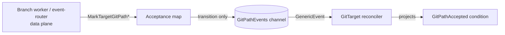
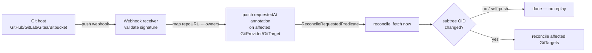

# Reconcile triggering — how our controllers wake up

A controller is only as good as the events that wake it. Periodic requeue is a
**safety net**, not a mechanism: if state changes and nothing enqueues the owner,
the change is invisible until the next periodic tick — up to 10 minutes here. This
document inventories how every controller is currently triggered, records the
**fix already shipped** for the GitPath case, lists the **cases still suffering**,
and lays out the **trigger mechanisms** (grounded in Flux's proven patterns) that
turn this into a responsive controller.

Facts first, then the fix, then the gaps, then the toolbox.

---

## 1. Facts: the current trigger inventory

### 1.1 Requeue intervals (`internal/controller/constants.go`)

| Constant | Value |
|---|---|
| `RequeueStreamSettleInterval` | 10 s |
| `RequeueSteadyInterval` | 5 min |

> **Update (2026-07-07, secret-value-retention):** the former `RequeueShortInterval`
> (2 min), `RequeueMediumInterval` (5 min), and `RequeueLongInterval` (10 min) collapsed
> into a single 5-minute `RequeueSteadyInterval`. The control plane no longer watches
> Secrets, so out-of-band credential/age-key changes are picked up on this unified steady
> cadence instead of via a Secret informer. Where the narrative below says "up to 10
> minutes," read 5 minutes. See
> [`security-model.md`](../security-model.md).

### 1.2 Per-controller triggers

| Controller | Watches (besides `For`) | Predicate | Happy-path requeue | Data-plane edge |
|---|---|---|---|---|
| **GitProvider** | *(none)* | `GenerationChanged` on self | 5 min | ❌ |
| **GitTarget** | GitProvider, WatchRule, ClusterWatchRule | `GenerationChanged` on deps | 5 min | ✅ GitPath channel (new) |
| **WatchRule** | GitTarget, GitProvider | `GenerationChanged` | 5 min | ❌ |
| **ClusterWatchRule** | GitTarget, GitProvider | `GenerationChanged` | 5 min | ❌ |
| **CommitRequest** | *(none)* | — | polls every 2 s | polls worker, no push |

The GitTarget no longer watches Secrets: the encryption-Secret watch was removed so the
process stops retaining every Secret value in the cluster; generated-age-Secret recovery
and out-of-band age-key updates ride the 5-minute reconcile instead.

Sources: `gitprovider_controller.go`, `gittarget_controller.go`,
`watchrule_controller.go`, `clusterwatchrule_controller.go`,
`commitrequest_controller.go`.

### 1.3 Two structural consequences

- **`GenerationChangedPredicate` ignores status-only updates.** `generation` bumps
  on **spec** changes only, so a dependency's *status* flip (GitTarget goes
  refused, GitProvider goes `Ready=False`) does **not** re-enqueue dependents. This
  is deliberate — without it every status heartbeat would re-list and re-enqueue
  all dependents (a storm) — but it means status propagation falls back to the
  periodic requeue.
- **The data plane (`internal/git` branch workers, `internal/watch`) cannot reach
  the controllers**, except via the single GitPath channel added below. The
  `internal/git` package never writes any CRD `.Status`.

---

## 2. The fix already shipped — the GitPath acceptance channel

The branch worker discovers a refused Git path **asynchronously**, after the
GitTarget's reconcile has already run and scheduled its 10-minute requeue. Before
the fix, `GitPathAccepted` could read `True` for up to 10 minutes after the path
was actually refused (it caused a CI flake; full write-up in
[gitpathaccepted-projection-race-and-external-drift.md](../spec/manifest-system.md)).

The fix gives the data plane a controller-runtime `source.Channel` edge:

- `internal/watch/gitpath_events.go` — `Manager.GitPathEvents()` exposes a lazily
  created `chan event.GenericEvent`; `enqueueGitPathChange(gitDest)` does a
  non-blocking send of a `GenericEvent` naming the GitTarget.
- `internal/watch/git_path_acceptance.go` — `MarkTargetGitPathRefused` /
  `MarkTargetGitPathAccepted` emit on a **real transition only** (newly refused,
  reason changed, or refusal cleared), so the steady-state resync stream never
  causes a reconcile storm.
- `internal/controller/gittarget_controller.go:1003` — `SetupWithManager` wires it:
  ```go
  b = b.WatchesRawSource(source.Channel(
      r.EventRouter.WatchManager.GitPathEvents(),
      &handler.EnqueueRequestForObject{},
  ))
  ```



This is the **prototype recipe**: *a change to data-plane reality enqueues the
owning CRD*. Everything in §3 is a place that needs the same recipe.

**Scope caveat (see §4 for the trade-off):** an in-memory channel is correct here
because acceptance is recomputed from scratch on every reconcile and the periodic
requeue is the backstop. It does **not** survive a restart and is single-process —
so it is not the right tool for durable or cross-process triggers.

---

## 3. Cases suffering today — "where we make it a good controller"

### Gap A — data-plane outcomes never reach status

**A1. Git push failures are invisible.** A failed push/resync lands in
`recordBackgroundResyncFailure` (`internal/watch/event_router.go:157`), which
**only increments a Prometheus counter** (`ResyncBackgroundFailuresTotal`). Push
retry exhaustion just returns an error (`internal/git/branch_worker.go:1179`). The
`internal/git` package writes no CRD status. **Result:** while pushes fail (auth
scope, non-fast-forward, branch protection, remote down), `kubectl get
gittarget`/`gitprovider` still read `Ready`. GitProvider `Ready` reflects only a
read-connectivity probe at reconcile time (`gitprovider_controller.go:238`) on a
10-minute cadence — and a read probe will not even catch a write-only failure.

**A2. Background resync timeouts are invisible.** Same path: a per-type resync that
times out (`event_router.go:254`) is a metric, not a status.

**A3. External Git drift is detected but not acted on.** `syncWithRemote` computes
`IncomingChanges` when the remote SHA moved; the field is documented as "requiring
resource-level reconcile" (`internal/git/types.go:86`) but its only consumer
**logs** it (`branch_worker.go:1414`). Out-of-band edits/deletes to the repo are
not reconciled until an unrelated event happens to fire. (Full treatment, incl. the
subtree-hash detection and Flux/Argo coordination, in the sibling doc.)

**A4. CommitRequest outcomes are polled, not pushed.** The worker records a terminal
outcome (`recordCommitRequestOutcome`, `internal/git/commit_request_attach_loop.go:47`)
and the controller reads it (`LookupCommitRequestOutcome`) — but by **requeuing
every 2 s** (`commitrequest_controller.go:195`). The capture half of the recipe
already exists; only the push edge is missing. A nudge would replace the poll.

### Gap B — control-plane status does not propagate to dependents

**B1. WatchRule / ClusterWatchRule lag their GitTarget/GitProvider.** They watch
those deps with `GenerationChangedPredicate`, so when a GitTarget flips to refused or a
GitProvider goes `Ready=False` (status-only changes), the rules do **not**
re-reconcile; their projected `GitTargetReady` dependency condition is stale for up
to `RequeueSteadyInterval` (5 min).

### Gap C — missing dependency watches

**C1. GitProvider does not watch its credentials Secret.** `SetupWithManager` is
`For(GitProvider)` only. A rotated or corrected Git credentials Secret is not picked up
until the 5-minute steady requeue, so `Ready=False (ConnectionFailed)` lingers that long.

> **Superseded (2026-07-07, secret-value-retention):** not watching the auth Secret is now a
> deliberate least-privilege choice, not a gap to fix with a Secret watch. The control plane
> reads credential and age-key Secrets directly by name and relies on the 5-minute
> `RequeueSteadyInterval` to pick up rotations; the GitTarget's former encryption-Secret watch
> was also removed. Adding a Secret watch would reintroduce cluster-wide Secret retention. See
> [`security-model.md`](../security-model.md). The
> §5 recommendation to "watch the auth Secret" below is retained only as historical context.

---

## 4. The trigger toolbox — best practices (how Flux does it)

Flux controllers are reconcile-loop only (no long-lived data plane), so a failure
is naturally written to status at the end of the same loop — they sidestep Gap A by
construction. Where Flux *does* need out-of-band or cross-resource triggers, it
uses four reusable mechanisms. All are directly applicable here.

### F1. Persisted reconcile-request annotation

`meta.ReconcileRequestAnnotation = "reconcile.fluxcd.io/requestedAt"`
(`fluxcd/pkg/apis/meta`): anyone patches the annotation with a fresh token to force
a reconcile. `predicates.ReconcileRequestedPredicate` enqueues only when the token
changes, combined as `predicate.Or(GenerationChangedPredicate{},
ReconcileRequestedPredicate{})`. The handled token is recorded in status
(`LastHandledReconcileAt`) for idempotency.

**Why it beats an in-memory channel for durable cases:** the annotation is
persisted on the object, so it survives controller restart, is visible in
`kubectl -o yaml`, works across HA replicas/processes, and replays via the
apiserver watch.

### F2. Webhook Receiver → annotation

Flux's notification-controller `Receiver` is a webhook endpoint that validates a
git-host payload (signature/HMAC) and patches the `requestedAt` annotation on the
listed resources. This is exactly the **pull-on-push** trigger (§5) and the
**pre-reconcile webhook** idea from the sibling doc.

**But the stock Receiver cannot target our CRDs.** `spec.resources[].kind` is a
hard-coded enum (`notification-controller/api@v1.8.4/v1/reference_types.go:27`):

```
Enum=Bucket;GitRepository;Kustomization;HelmRelease;HelmChart;HelmRepository;
  ImageRepository;ImagePolicy;ImageUpdateAutomation;OCIRepository;
  ArtifactGenerator;ExternalArtifact
```

Anything outside that list fails schema validation, and notification-controller's
RBAC is scoped to Flux kinds. So a stock `Receiver` cannot point at
`GitProvider`/`GitTarget` without forking its CRD + RBAC (fragile, lost on upgrade).
The *mechanism* (validate webhook → patch annotation) is reusable; the *component*
is not. See §5 for what this means in practice.

### F3. Status-field change predicate (fixes Gap B)

Flux's source-aware controllers watch their dependency with a
`SourceRevisionChangePredicate` — a predicate that passes **only when the
meaningful status field changes** (the artifact revision), ignoring every other
status heartbeat. The fix for B1 is the same shape: `predicate.Or(
GenerationChangedPredicate{}, gitTargetReadinessChangedPredicate{})` rather than
removing the predicate (which reintroduces the storm).

### F4. Conditions **and** Events, every loop (fixes Gap A surfacing)

Flux always patches kstatus conditions (`fluxcd/pkg/runtime/conditions` + `patch`)
**and** emits a Kubernetes Warning Event (`fluxcd/pkg/runtime/events`, which also
forwards to notification-controller), then requeues at a shorter failure interval.
A failure is immediately visible and alertable, not buried in a metric.

### F5. Generalize the data-plane nudge (the §2 recipe, reused)

Extend the GitPath channel into a small shared "status nudge": the data plane
records a fact (push error, commit outcome, drift) and enqueues the owning CRD;
controllers wire it via `WatchesRawSource`. CommitRequest (A4) then drops its 2 s
poll.

### Choosing a mechanism

| Mechanism | Survives restart | Cross-process | External trigger | Best for |
|---|---|---|---|---|
| In-memory `source.Channel` (§2) | ❌ | ❌ | ❌ | in-process signal recomputed each loop (GitPath) |
| Reconcile-request annotation (F1) | ✅ | ✅ | ✅ | external triggers, drift, anything that must outlive a restart |
| Status-field predicate (F3) | ✅ (apiserver-driven) | ✅ | n/a | dependency status → dependents (Gap B) |
| Conditions + Events (F4) | ✅ | ✅ | n/a | surfacing failures (Gap A) |

---

## 5. Use case: trigger on Git repository change (pull-on-push)

**What we want.** When the Git repo changes out-of-band — a human edit, a delete, a
foreign file, or (in bi-directional mode) a commit by Flux/Argo — we want to learn
about it **the moment it happens** via an inbound webhook from the git host, and
pull immediately. Pulling on the push event is strictly better than discovering the
drift on a later fetch: we re-align (or refuse) while the change is fresh, and we
usually avoid the expensive replay-mark session entirely. It is the push-driven
complement to the poll-driven drift detection in A3 and the subtree-OID check in the
[sibling doc](../spec/manifest-system.md).

**Flow.**



### 5.1 Can we reuse the Flux component?

Two separable things, opposite answers:

- **The Receiver CRD/controller — no (not as-is).** Its `spec.resources[].kind`
  enum (F2) rejects our kinds, and its RBAC is Flux-scoped. We would have to fork
  its CRD and grant it patch RBAC on our types — fragile and lost on upgrade. Not
  recommended.
- **The trigger *mechanism* — yes, fully.** "Validate a git-host webhook, then
  patch a reconcile-request annotation on the owning object" is a pattern, not a
  component. We already run webhook-serving infrastructure (audit/admission), so we
  add one inbound git-webhook endpoint that:
  1. validates the provider payload (HMAC/secret) — the same per-provider logic Flux
     implements for `github`/`gitlab`/`gitea`/`generic-hmac`;
  2. maps the payload's repo URL + branch to the `GitProvider`/`GitTarget`s that use
     it (we already index providers by URL in the worker layer);
  3. patches the reconcile-request annotation on those objects (F1), so the trigger
     is durable and observable rather than an in-process call.

  Modelling our own small `Receiver`-like CRD on Flux's API shape
  (`Type`/`Events`/`Resources`/`SecretRef`/`ResourceFilter`) keeps it familiar.

### 5.2 Do we need the exact name `reconcile.fluxcd.io/requestedAt`?

**No — and adopting it buys little today.** The annotation key is just an internal
contract between whoever sets it and the `ReconcileRequestedPredicate` that reads
it. We can pick any key; annotations need no registration, and using a foreign
prefix is allowed (though `reconcile.fluxcd.io/` is semantically Flux's namespace).

The *only* reason to use the exact Flux name is to let **Flux ecosystem tools**
trigger us — but both candidates are blocked anyway: the Receiver by its kind enum
(§F2), and `flux reconcile` by the same hard-coded kind list in its CLI. So neither
can target our CRDs regardless of the annotation name.

**Recommendation:** define a **project-owned** key (e.g.
`configbutler.ai/requestedAt`) with the *same semantics* (opaque token value +
`status.lastHandledReconcileAt` for idempotency + a `ReconcileRequestedPredicate`).
Optionally **also honor** `reconcile.fluxcd.io/requestedAt` so `kubectl annotate`
muscle memory and any future Flux interop work for free — cheap, since the predicate
can accept either key. We can import `fluxcd/pkg/apis/meta` +
`fluxcd/pkg/runtime/predicates` (Apache-2.0, ~tiny) or reimplement the ~20-line
predicate ourselves to avoid a new dependency.

### 5.3 Footgun: our own pushes will fire the webhook

We write to the same repo, so our own commits trigger the push webhook → a feedback
loop. The reconcile must **dedupe self-pushes**: compare the incoming head SHA to
the SHA we just pushed (the branch worker already tracks `lastCommitSHA`), or skip
when the subtree OID equals the one we materialized. This is the same no-op guard
that makes the bi-directional acknowledgment loop (sibling doc §6) safe.

### 5.4 Reusing a user's *existing* Flux setup (no second git-host webhook)

§5.1 is about us standing up our own receiver. But most Flux power users **already**
have a git-host webhook wired to notification-controller and a `GitRepository`
tracking the repo. The best end-user experience is to piggyback on that and ask for
near-zero new config. The stock `Receiver` can't name our kinds (§F2), but the
surrounding Flux machinery gives two reuse paths.

**Path A — watch the existing `GitRepository.status.artifact` (recommended).**
source-controller already fetches the repo and records the result in
`GitRepository.status.artifact` — a `meta.Artifact` with `Revision`
(e.g. `main@sha1:abc…`), `Digest`, and a tarball `URL`
(`source-controller/api/v1/gitrepository_types.go:259`, `pkg/apis/meta/artifact.go`).
Whether that update was driven by the user's webhook (instant) or source-controller's
poll interval (eventual), the artifact revision is the canonical "the repo changed"
signal *already in their cluster*. We simply **watch that `GitRepository`** and react
when the revision/digest changes — the F3 status-field-predicate pattern applied to a
Flux object.

- **End-user cost: ~zero.** No webhook on our side, no git-host webhook #2, no
  notification CRs. They already run source-controller; we just need read
  (get/list/watch) RBAC on `source.toolkit.fluxcd.io` GitRepositories and a way to
  associate one with our GitProvider.
- **Association:** an explicit optional `spec.sourceRef` on our GitProvider pointing
  at a `GitRepository` is far cleaner than URL matching (URL normalization — ssh vs
  https, `.git` suffix, embedded creds — is fiddly and error-prone).
- **Bonus — skip our own clone:** the artifact `URL` is the materialized tree at that
  revision, integrity-checked by `Digest`, served in-cluster by source-controller. We
  could read the subtree straight from it for the drift check **without our own git
  fetch or credentials on the read path**. Bigger change to our model, but a real
  simplification worth a follow-up.
- **Degrades gracefully:** with no webhook, source-controller still polls, so we still
  converge — just not instantly.
- **Constraint:** requires Flux source-controller + a `GitRepository` for the repo.
  Argo-only users need a separate integration; audit-only users without Flux fall back
  to §5.1 or polling.

**Path B — receive Flux notifications via a generic Provider/Alert.** If we'd rather
be pushed to than watch, the user keeps their git-host webhook and adds two small
Flux CRs: an `Alert{eventSources: [their GitRepository], …}` (a GitRepository **is**
allowed as an event source — same enum, but GitRepository is in it) targeting a
`Provider{type: generic-hmac, address: <our endpoint>, secretRef: <token>}`
(`notification-controller/api/v1beta3/provider_types.go`,
`.../v1beta3/alert_types.go`). notification-controller then HMAC-signs and POSTs every
GitRepository event to us; we validate and react. More config than Path A, but it's a
documented, supported eventing integration and needs no GitRepository *watch* RBAC.

**Recommendation:** ship **Path A** as the primary Flux integration (best UX, least
config, additive/read-only), keep §5.1 (our own receiver) for non-Flux users, and
treat Path B as an optional alternative. All three converge on the same internal
trigger (fetch now → subtree-OID check → reconcile affected GitTargets) and all need
the §5.3 self-push dedupe.

### 5.5 We already ingest these edits — tap the stream, share the Secret

Path A describes a controller-runtime `Watches(&GitRepository{})`. But note what we
*are*: the tool that watches everything in the cluster. The `requestedAt` annotation
patch and the `GitRepository.status.artifact` bump are **cluster mutations**, and
mutations are exactly what our watch data plane already ingests. So the Flux signal
can be derived from the **same followable-type watch machinery** we use for every
other resource — configure a watch on `source.toolkit.fluxcd.io/GitRepository` and
route its observations internally — rather than bolting on a second watch path.

Two distinct signals fall out of this, and they mean different things:

- **`metadata.annotations[reconcile.fluxcd.io/requestedAt]` changes** — a *pre*-signal:
  "source-controller is *about to* fetch." Useful for the bi-directional
  acknowledgment wait (sibling doc §6): hold our reconcile until the fetch lands.
- **`status.artifact.revision` / `digest` changes** — the *content-ready* signal: the
  new revision is fetched and available. This is the accurate trigger for our actual
  pull/drift-check.

**Configurable source tracking.** Expose an optional reference on our GitProvider
(working name `spec.sourceRef`) naming the Flux **`GitRepository`** to track. (Flux's
object is the *source* `GitRepository`; there is no "GitDestination" — the
destination-shaped concept is ours, the `GitTarget`.) When set, observed
revision changes on that source drive the trigger.

**Reuse the same credentials Secret.** The user's `GitRepository` already references a
git-credentials Secret. Our credential reader already accepts the Flux **and** Argo
Secret dialects (`internal/git/credentials.go:81` — `identity`/`ssh-privatekey`,
`known_hosts`/`ssh_known_hosts`, `bearerToken`, username/password), so a GitProvider
can point at that **same** Secret — git creds configured once, for both tools. This
pairs naturally with `sourceRef`: one reference gives us the change signal *and* the
credentials.

**Caveats unchanged:** we must actually be watching the source type (demand-driven —
add it to the watched set), and the §5.3 self-push dedupe still applies (our own
commits bump the same revision). The artifact-`URL` read-without-clone bonus from
Path A applies here too.

---

## 6. Recommended roadmap

1. **Surface write health (A1/A2).** Branch-worker push/commit outcome → nudge the
   owning CRD (F5) → project `Ready=False(reason=GitOperationFailed)` on
   GitProvider (provider-wide faults) and/or GitTarget (per-target/path faults),
   and emit a Warning Event (F4). Highest value: silent push failure is the worst
   blind spot.
2. **Propagate dependency status (B1).** Add status-field-change predicates (F3) to
   WatchRule/ClusterWatchRule for their GitTarget/GitProvider deps.
3. **Watch the auth Secret (C1).** Add a `Watches(&corev1.Secret{}, …)` mapping
   credentials Secrets to their GitProviders.
4. **Adopt the reconcile-request annotation (F1)** as the durable trigger; reserve
   the in-memory channel for in-process, recomputed-each-loop signals like GitPath.
5. **Pull-on-push (§5).** Primary path: **track an existing Flux `GitRepository`**
   via `spec.sourceRef` and react to its `status.artifact.revision` changes — observed
   through our own watch stream (§5.5), reusing the same credentials Secret. Near-zero
   end-user config for Flux users. Fall back to our own inbound git-webhook (§5.1) for
   non-Flux users. Both feed the subtree-OID drift check with §5.3 self-push dedupe.
6. **Replace CommitRequest polling (A4)** with the F5 nudge.

## 7. Open questions

- One shared nudge channel + a typed event payload, or one channel per concern?
- Should write-health be a new GitProvider/GitTarget condition, or fold into `Ready`
  with a write-specific reason? (kstatus prefers a dedicated reason over a new
  top-level condition.)
- Own the inbound git-webhook in the existing webhook server, or as a separate
  Deployment? Which git providers do we validate first (GitHub/GitLab/Gitea)?
- §5.2 leans to a project-owned annotation that *also* honors the Flux key — confirm
  that's the call, given neither Flux Receiver nor `flux reconcile` can target our
  CRDs today anyway.
- Should the webhook patch the annotation (durable, decoupled) or enqueue in-process
  (faster, but lost on restart)? §5.1 leans annotation.
- For §5.5: react to `requestedAt` (pre-fetch) or `artifact.revision` (content-ready),
  or both for different purposes (coordination wait vs actual pull)?
- Should `spec.sourceRef` imply credential reuse from the referenced `GitRepository`'s
  Secret by default, or require the Secret to be named explicitly?
