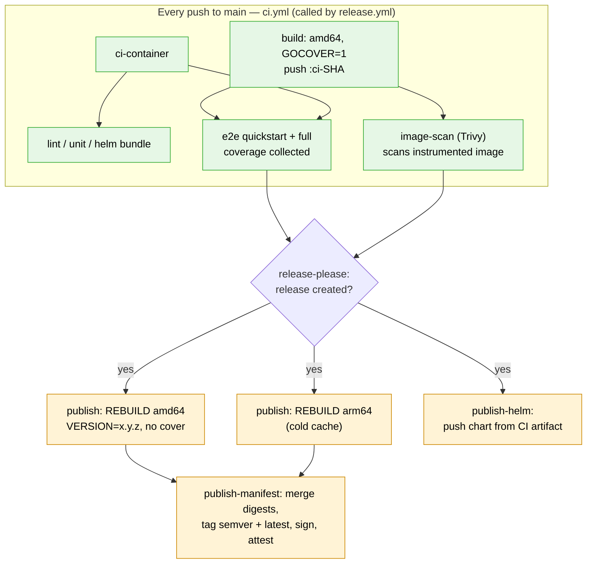
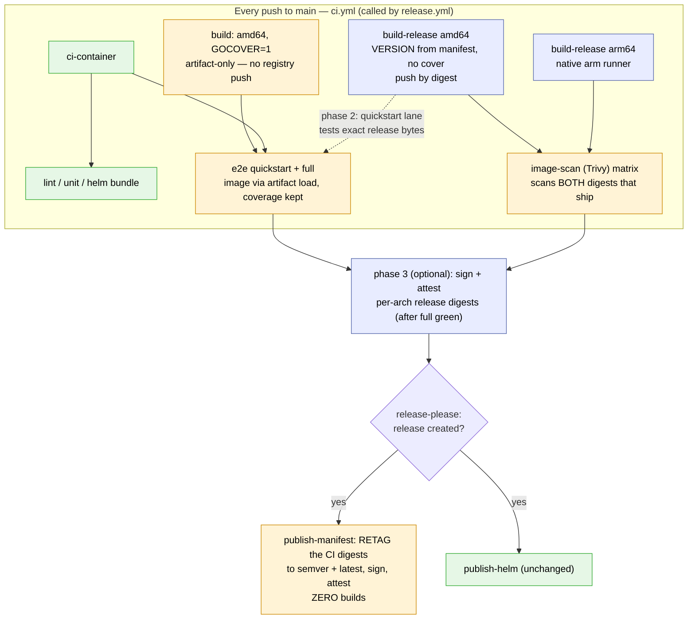
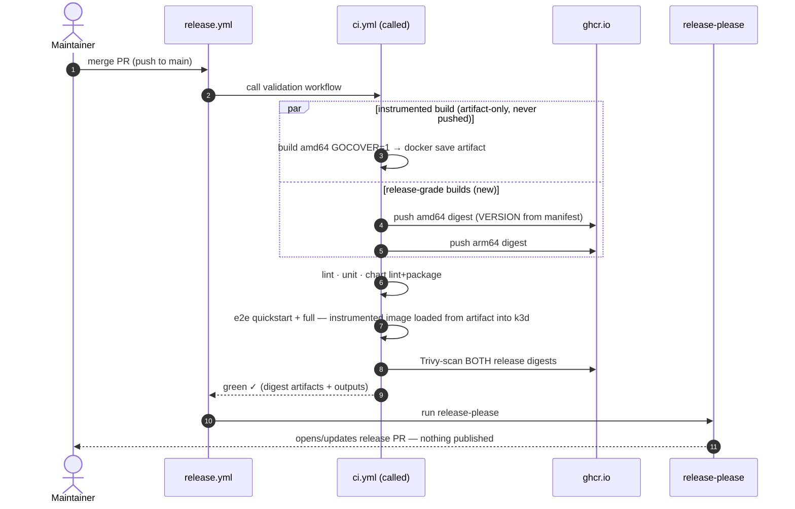
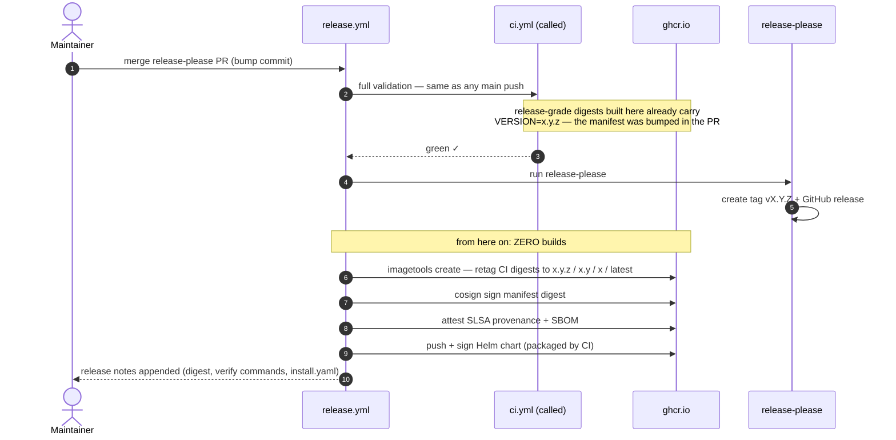
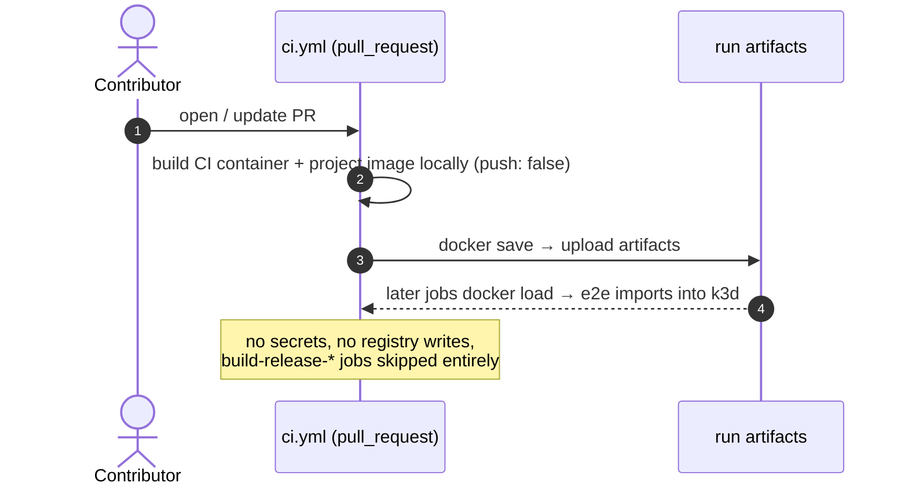

# Plan: build release images once on main, retag at release

Status: **PR 1 (§8 core) implemented** — `build-release-amd64`/`-arm64` +
`image-scan-release` in `ci.yml`, `publish` rebuild job deleted and
`publish-manifest` retags the CI digests (gated on `release_created`),
instrumented image is artifact-only everywhere. PRs 2–5 (quickstart→release
digest, per-commit signing, guarded e2e skip, release-PR dispatch) remain
follow-ups. Revised after review: scan both
arches, tighter `build-release` gate, signing targets the per-arch release
digests (never `ci-<sha>`), phased rollout (§8).
Rev 3: the instrumented image becomes **artifact-only on every run** — the
`ci-<sha>` registry push is retired; e2e uses load delivery everywhere.
Rev 4 (second review): explicit release gate on `publish-manifest`, scans
split into paired jobs (no `always()` anywhere in PR 1), "promotable"
narrowed to pullable/testable.
Rev 5: landscape of alternative release models (§13); §7 settled — skip the
`full` lane only, quickstart stays on the bump commit.
Constraint from review: **e2e coverage (`GOCOVER=1`) on main stays.**

## 1. What happens today

On every push to main, `release.yml` calls `ci.yml` (reusable). The `build` job
builds **one** image — linux/amd64, coverage-instrumented (`GOCOVER=1`),
`VERSION=ci-<sha>` — and pushes it as `ghcr.io/configbutler/gitops-reverser:ci-<sha>`.
E2e and the Trivy scan run against that image.

When release-please cuts a release, the `publish` job **rebuilds from scratch,
twice** (amd64 + arm64) with different build args (`VERSION=x.y.z`, no
`GOCOVER`), then `publish-manifest` merges, signs, and attests.

The GHA layer cache doesn't rescue this: `VERSION`, `GOCOVER`, and `BUILD_DATE`
all feed the `go build` layer (`Dockerfile:35-38` via ldflags / coverage flags),
so the compile layer is a guaranteed cache miss between the CI build and the
release build. The arm64 cache is usually cold entirely (only warmed at
releases; GHA cache evicts after ~7 days).

Two consequences worth naming, beyond wasted minutes:

- **The released bytes are never e2e-tested.** E2e runs against the
  instrumented `ci-<sha>` build; the release is a different compilation.
- **The released bytes are never Trivy-scanned.** `image-scan` also targets
  `ci-<sha>`; the release rebuild ships unscanned.

A plain "retag `ci-<sha>` at release" is impossible today for three reasons:
it's coverage-instrumented, it has `VERSION=ci-<sha>` baked in via ldflags,
and it's amd64-only.

## 2. The key unlock: the version is knowable at CI time

A release only ever happens on the merge commit of a release-please PR, and
that PR bumps `.release-please-manifest.json` (and `Chart.yaml appVersion`) to
the new version **before** the merge. So on the release commit, CI can stamp
the correct semver at build time:

```bash
VERSION="$(jq -r '."."' .release-please-manifest.json)"   # → "0.30.0" on the release commit
```

On non-release pushes to main this yields the *last* released version — that's
fine: those digests are never promoted to a semver tag, and the `GIT_COMMIT`
ldflag disambiguates the binary.

## 3. Proposed design

Trusted (main) runs build **two variants** in parallel inside the existing CI
run; the release tail builds **nothing**:

| Variant | Platforms | Build args | Purpose |
| --- | --- | --- | --- |
| Instrumented (today's `build` job) | amd64 | `GOCOVER=1`, `VERSION=ci-<sha>` | e2e + coverage collection — **artifact-only on every run, never pushed**; the `ci-<sha>` registry tag is retired |
| Release-grade (new `build-release` jobs, main pushes only) | amd64 + arm64, native runners | `VERSION` from release-please manifest, no `GOCOVER` | pushed by digest; **both arches** Trivy-scanned; **retagged at release** |

At release, `publish-manifest` keeps doing what it already does — merge the
per-arch digests into a multi-arch manifest, tag `x.y.z` / `x.y` / `x` /
`latest`, cosign-sign, attest provenance + SBOM — except the digests now come
from the CI run of the same workflow instead of a fresh `publish` build job.
The `publish` job is deleted.

This is the same pattern the Helm chart already follows: `lint-helm` packages
the chart once in CI, `publish-helm` pushes the tested artifact. The plan
extends that to images.

PR runs are completely untouched (local amd64 build, artifact handoff,
`IMAGE_DELIVERY_MODE=load`).

### Order of things

**Today:**



**Proposed** (blue = new, orange = changed, green = unchanged; the rebuild jobs are gone):



### Scenario walk-throughs (who does what, when)

**Scenario 1 — ordinary push to main (no release):**



**Scenario 2 — release (maintainer merges the release-please PR):**



**Scenario 3 — pull request (unchanged by this plan):**



## 4. Changes by file

1. **`.github/workflows/ci.yml`**
   - Add `build-release-amd64` (`ubuntu-latest`) and `build-release-arm64`
     (`ubuntu-24.04-arm`) as **two named jobs, not a matrix** — matrix jobs
     share one output set (last writer wins), and downstream jobs need each
     digest individually. Each reads `VERSION` from the manifest, builds with
     `push-by-digest=true`, exposes the digest as a job output, and uploads a
     `digests-*` artifact — the exact shape `publish-manifest` already
     consumes today, so its download step barely changes.
   - Gate them `if: github.event_name == 'push' && github.ref ==
     'refs/heads/main'` — **not** `!= 'pull_request'`, which would also fire
     on `workflow_dispatch` from any branch and push release-grade digests
     from manual runs. (Note: gating on `event_name == 'workflow_call'` does
     not work — inside a called workflow the `github` context belongs to the
     *caller*, so the event name is `push`, never `workflow_call`.)
   - **Stop pushing the instrumented image entirely.** The `build` job keeps
     its local `ci-<sha>` tag name but delivers via `docker save` → artifact
     on *all* runs, and e2e always uses `IMAGE_DELIVERY_MODE=load` — the
     path every PR already exercises (including the k3d direct-mode import
     fixes from #185/#186), so the battle-tested path becomes the only path.
     This *deletes* the PR/trusted branching in the e2e and scan jobs rather
     than adding to it, and no instrumented digest can ever be mistaken for
     promotable. Bump the project-image artifact `retention-days` (1 → ~7)
     so a failed main e2e can still be reproduced from the exact
     instrumented image. The `ci-container` push stays: `publish-helm` runs
     in it via `container:`, which requires a registry ref.
   - Cache scopes: reuse `build-linux/amd64` / add `build-linux/arm64` for the
     release variant (same args at release ⇒ these caches now stay warm from
     every main push); give the instrumented build its own scope so the two
     variants stop invalidating each other.
   - Scan both release-grade digests — the release ships amd64 *and* arm64,
     so scanning only amd64 would still leave shipped bytes unscanned (Trivy
     scans cross-arch fine; it pulls by digest and analyzes the filesystem).
     **Structure it as paired jobs so PR 1 needs no skip-tolerant `if:`
     wiring at all:** the existing `image-scan` keeps scanning the artifact
     image, gated `if: github.event_name == 'pull_request'`; a new
     `image-scan-release` (matrix over the two digests) simply
     `needs: [build-release-amd64, build-release-arm64]` — when those are
     skipped (PRs, dispatch), it skips transitively, which is exactly the
     desired semantics. Each scan job rides its build job's gate; no
     `always()` anywhere in PR 1.
   - **Phase 2 (follow-up PR):** on main runs, point the e2e `quickstart`
     lane's `PROJECT_IMAGE` at the release-grade amd64 digest. That lane
     never collects coverage (helm/manifest installs don't carry the
     GOCOVERDIR overlay), so nothing is lost — and the exact shippable
     binary gets chart + manifest install smoke coverage. The `full` lane
     stays on the instrumented image for coverage collection. This lane then
     pulls from GHCR on main — the one deliberate exception to the
     otherwise artifact-only delivery, because it validates the
     registry-served digest users actually pull. This is also where the
     plan's *single* skip-tolerant gate lives (PR 2, deliberately not PR 1):
     e2e gains `build-release-amd64` in its `needs`, which is skipped on
     PRs, so e2e's condition becomes
     `if: always() && needs.ci-container.result == 'success' && needs.build.result == 'success' && needs.lint-helm.result == 'success' && (github.event_name == 'pull_request' || needs.build-release-amd64.result == 'success')`.
   - Stamp OCI labels (`metadata-action`) in `build-release` — today they're
     applied by the release build.
2. **`.github/workflows/release.yml`**
   - Delete the `publish` job (both rebuilds).
   - `publish-manifest` **must gain its own release gate**:
     `needs: [ci, release-please]` with
     `if: needs.release-please.outputs.release_created == 'true'`. Today it
     inherits the gate only *transitively* by needing `publish`; with
     `publish` deleted, an ungated `publish-manifest` would run on every
     main push and move `latest`/semver tags onto non-release digests.
   - Otherwise `publish-manifest` is unchanged: digests now sourced from the
     `ci` job's artifacts (same workflow run, so artifacts are visible).
     Sign, provenance, SBOM, release notes all stay as-is.
3. **Docs:** update `docs/ci-overview.md` (trust-zone table, fork-PR diagram
   caption, release-artifacts section), `.github/RELEASES.md`, and
   `docs/tasks-overview.md` if it references the release build.

Signing/verification identity is unaffected: the `ci` job runs *inside* the
`release.yml` workflow run, and the sign/attest steps stay in `release.yml`
jobs, so the cosign certificate identity remains
`release.yml@refs/heads/main` and the documented `cosign verify` command keeps
working verbatim.

## 5. Getting signing onboard for main builds too

Today, signing exists only at release time: cosign keyless signature + SLSA
provenance + SPDX SBOM on the release manifest digest, and a chart signature.
Under this plan that stays exactly as-is. The extension — signing what main
produces, so every main push yields a *signed, pullable, testable candidate
digest* — takes:

- **A new `sign-images` job in `release.yml`**, `needs: ci`, running on every
  main push (not only releases). It cosign-signs the **two per-arch
  release-grade digests**. (With the instrumented image now artifact-only,
  no `ci-<sha>` registry tag exists to confuse with a candidate.) If a
  pullable candidate ref is wanted, add a clean manifest tag (e.g.
  `candidate-<sha>`) from the two digests and sign that too. Optionally attach per-commit SLSA provenance
  (`actions/attest-build-provenance`). Cost: ~1 minute per push,
  `id-token: write` + `packages: write` permissions, one public Rekor log
  entry per signature (repo identity only — nothing sensitive).
- **Placement matters, twice over.** It must live in `release.yml`, *after*
  the `ci` job — (a) signing inside `ci.yml` would sign images before
  lint/e2e/scan finish, breaking the "nothing signed unless the full pipeline
  passed" guarantee; (b) for reusable workflows, Fulcio's certificate identity
  is the *called* workflow's ref, so signatures made inside `ci.yml` would
  verify against `ci.yml@...` instead of `release.yml@...`, changing the
  documented verification story.
- **Release-time signing stays.** Signatures are digest-bound, so the per-arch
  signatures carry over to the release automatically, but the multi-arch
  manifest *list* created at retag time is a new digest and still needs its
  own signature + attestations — the existing `publish-manifest` steps cover
  that. (Relying on `imagetools create` reproducing a byte-identical manifest
  list to skip release-time signing would be fragile; don't.)
- **Verify story for consumers:** per-commit images verify with
  `--certificate-identity-regexp '...release\.yml@refs/heads/main'` — same
  identity as releases, which is a feature: "this digest went through the same
  trusted pipeline, it just hasn't been promoted yet."

This piece is independent — it can land with the retag change or as a
follow-up, but it only makes sense *after* the retag change (today's
per-commit images are instrumented builds you'd never promote).

## 6. Is it worth it?

**Gains**

| Gain | Size |
| --- | --- |
| Release tail: 2 cold rebuilds + merge → retag + sign only | ~5–10 min faster per release; removes the flakiest, least-observable part of the release run |
| Shipped digests are Trivy-scanned before release — **both arches** | closes a real gap: today the released rebuild ships unscanned, and arm64 has never been scanned at all |
| Shipped digest existed and was pushed *before* release-please ran | no "tests passed but the release build broke" failure mode at the worst moment |
| Every main push yields a pullable, testable (optionally signed) multi-arch candidate | prerequisite for the signing extension; useful for pre-release testing. Only the release-bump commit's digest is directly *promotable* to semver tags — earlier builds stamp the previous version in the binary |
| `release.yml` loses its most complex job | less to maintain in the trust-critical file |
| PR and main e2e share one delivery path (artifact + k3d load) | the fork-safe path becomes the only path; a stack of `if: pull_request` conditionals is deleted; instrumented builds never touch the registry |

**Costs**

| Cost | Size |
| --- | --- |
| +2 builds per main push (clean amd64 + arm64) | parallel to e2e (~30+ min lanes), so no critical-path impact; runner minutes are free for a public repo |
| More GHCR storage per main push (multi-arch digests) | free for public packages; optional cleanup policy for untagged `ci-*` digests if clutter bothers you |
| Conditional wiring in `ci.yml` (`build-release` gated to main pushes; paired scan job) | small — paired jobs keep skip semantics transitive; the single `always()` gate arrives only in PR 2 |
| More total build-minutes per release cycle if many pushes land between releases | irrelevant on free minutes; matters only if that ever changes |

**What it does *not* fix (honestly):**

- E2e still runs on the release-bump commit — unless the guarded skip in §7
  is adopted as well.
- The `full` e2e lane still tests the *instrumented sibling*, not the exact
  release bytes — that's the price of keeping `GOCOVER`, by design. Phase 2
  softens this: the `quickstart` lane (chart + manifest install) runs against
  the exact release-grade amd64 digest, so the shippable binary does get
  install-level e2e smoke coverage.

**Verdict: yes, worth doing** — not primarily as a compute win (minutes are
free) but because the release tail gets faster, simpler, and structurally
safer, the scanned/shipped gap closes, and it unlocks per-commit signing. If
main-push frequency ever made the extra builds annoying, the fallback is to
gate `build-release` on "the release-please manifest changed vs HEAD^" so the
clean pair is only built on release commits — but start with the
unconditional version; it's simpler and the candidates are useful.

## 7. Optional: skipping e2e on the release-bump commit

First, be precise about what the release-bump commit *is*. It is not inert:
release-please bumps `charts/gitops-reverser/Chart.yaml` (version +
appVersion) and `charts/gitops-reverser/values.yaml` alongside the changelog
and manifest — and the published chart is packaged **from this commit**.
Under this plan the release-grade image is also *compiled* at this commit
(that's where the semver `VERSION` gets stamped). So the bump commit must
keep running builds and chart packaging; the only thing worth skipping is the
~30–40 min e2e matrix.

### The mechanism: prove the diff is mechanical, then skip e2e only

A small `bump-check` job in `ci.yml` (checkout with `fetch-depth: 2`) sets
`skip_e2e=true` only when **all** of the following hold:

1. The event is a `push` to main (never on `pull_request`/`workflow_dispatch`).
2. The commit subject matches `^chore\(main\): release` (release-please's
   squash-merge title, cf. `318d718`).
3. `git diff --name-only HEAD^ HEAD` is a **subset of the exact allowlist**:
   `CHANGELOG.md`, `.release-please-manifest.json`,
   `charts/gitops-reverser/Chart.yaml`, `charts/gitops-reverser/values.yaml`.

The two e2e lanes get `if: needs.bump-check.outputs.skip_e2e != 'true'`.
Everything else — unit tests, lint, chart lint/template/package, both image
builds, Trivy scan — still runs on the bump commit. The job must **fail
open**: any error in detection ⇒ `skip_e2e=false` ⇒ full e2e.

The allowlist is what makes this safe-by-construction rather than
safe-by-convention: if a human sneaks any other file into the release PR —
code, manifests, workflow changes — condition 3 fails and full e2e runs. The
skip can never be triggered by content, only by the absence of content.

### What the guarantee becomes

Today: "the full pipeline passed on the exact released commit."
With the skip: "the full pipeline passed on the exact released commit,
except e2e, which passed on the parent commit whose Go sources, manifests,
and Taskfiles are byte-identical — *enforced* by the diff allowlist."

The one real residual: the released chart tgz (with the two bumped version
fields) is helm-linted, templated, and packaged, but not e2e-installed. The
delta vs the e2e-tested parent chart is exactly those version strings.

**Recommendation (settled in review): skip only the `full` lane; keep
`quickstart` on the bump commit.** Quickstart installs the actual packaged
chart from that commit — and, once PR 2 is in, the exact release-grade
digest — so the chart residual disappears entirely. The `full` lane is the
expensive one (~30–40 min), and the allowlist proves its inputs are
byte-identical to the parent's. Skipping both lanes was considered and
dropped.

`docs/ci-overview.md`'s guarantee wording ("nothing can be published from a
commit that did not pass the full pipeline first") must be updated to the
precise weaker statement — keeping the docs honest is part of the change.

### Alternatives considered and rejected

- **Validate the release PR before merge** (run e2e on the PR, skip on the
  merge push): release-please creates the PR with `GITHUB_TOKEN`, whose
  events never trigger workflows — making the PR trigger CI requires a PAT
  or GitHub App token, i.e. a standing write credential, which the trust
  design deliberately avoids.
- **Stop stamping semver into the binary** (version from runtime metadata
  instead of ldflags) so the *parent* commit's fully-e2e-tested digest could
  be promoted directly, making the bump commit build nothing: the purist
  fix, but it degrades `--version` output and adds runtime plumbing for a
  once-per-release saving. Over-engineering.
- **Merge queue**: moves the e2e run to pre-merge; doesn't remove it.
- **Cross-run reuse of Task `.stamps`/fingerprints** — a generalization of
  this idea, analysed in §11: not viable as-is, viable in a reshaped form.

### Payoff

Release wall clock drops by the `full` lane (~30–40 min); the ~15 min
`quickstart` lane stays as the release commit's install gate. Combined with
§3, a release goes from roughly *CI-with-e2e + 2 rebuilds + publish*
(~50–60 min) to *CI-with-quickstart-only + retag/sign* (~20–25 min). This
piece is independent of §3 and can land separately, but the two compound.

## 8. Sequencing — make the first PR boring

Ship the core retag path alone and let it prove itself on one real release
before adding anything conditional or clever:

| Phase | Contents | Depends on |
| --- | --- | --- |
| **PR 1 — core (do now)** | `build-release-amd64`/`-arm64` jobs, paired `image-scan-release` job (matrix over both digests), gate `publish-manifest` on `release_created`, delete the `publish` rebuild jobs, retire the instrumented-image push (artifact/load delivery everywhere), docs updates | — |
| **PR 2** | Point the e2e `quickstart` lane at the release-grade amd64 digest on main runs | PR 1 |
| **PR 3** | Per-commit signing of the per-arch release digests (§5) | PR 1 released once |
| **PR 4 — optional, decide later** | Guarded skip of the *full* e2e lane on the release-bump commit; quickstart stays (§7) | independent, but land last |
| **PR 5** | Auto-dispatch quick checks onto the release-please PR (§12) | PR 1 + `ci-container` gate tightening |

PR 1 changes nothing for pull requests and nothing about what e2e tests —
it only adds two parallel build jobs on main and swaps a rebuild for a retag
at release. If a release misbehaves, the diff to reason about is small.

## 9. Risks / open points

- `publish-manifest` must fail loudly if the digest artifacts are missing
  (e.g. `build-release` was skipped by a bad conditional) — keep
  `if-no-files-found: error` semantics on the download.
- `BUILD_DATE` in the released binary becomes the CI build time, not the
  release-tag time (minutes-to-hours earlier). Cosmetic.
- Non-release main builds stamp the *previous* version + commit sha in
  `--version` output. Only visible on never-promoted digests. Acceptable, but
  worth a code comment where `VERSION` is derived.
- Per-commit signing and the e2e skip are sequenced as PRs 3 and 4 (§8);
  the only open decision is whether PR 4 lands at all. Its shape is settled:
  skip the `full` lane only — quickstart stays on the bump commit and (after
  PR 2) covers the released chart *and* the release-grade binary.
- If §7 lands: the `bump-check` job must fail open (any detection error ⇒
  run full e2e), and `docs/ci-overview.md`'s guarantee wording must be
  updated in the same PR.
- With the `build` job no longer pushing at all, the loose
  `!= 'pull_request'` gate concern shrinks to the `ci-container` push (a
  `workflow_dispatch` from a topic branch still pushes a CI toolchain
  image); tightening it to `push` + main is a cheap PR 1 add-on — and
  becomes a hard prerequisite once §12 dispatches `ci.yml` on non-main refs.

## 10. OpenSSF `release_notes_vulns` criterion

**Today: answer N/A** — the criterion's own text allows it when there have
been no publicly known vulnerabilities in the project's code, which is the
case (it covers project code only, not dependencies — Trivy findings in base
images/sops don't count here).

**When a real CVE lands, the process is three steps, no new tooling:**

1. Handle it as a GitHub **private security advisory** (Security tab);
   request the CVE through GitHub (GitHub is a CNA, assignment is free).
2. Land the fix as a normal `fix:` commit **with the CVE ID in the subject**,
   e.g. `fix: prevent path traversal in git target resolution (CVE-2026-NNNNN)`.
   release-please then puts it in the CHANGELOG and release notes
   automatically — the criterion is met by construction.
3. Publish the advisory when the release ships.

**No separate semver mechanism needed:** `fix:` already produces a patch
release; for an urgent fix, merge the release-please PR immediately so the
CVE fix ships alone. Optionally add a dedicated `Security` changelog section
in `release-please-config.json` later if volume ever warrants it.

## 11. Analysed: cache `.stamps`/Task fingerprints across CI runs to skip e2e

The idea: locally, Task's fingerprinting plus `.stamps` prevents redundant
work — so persist that state as a CI artifact, restore it on the next run,
and `task test-e2e` would no-op when nothing it depends on changed.

**As stated, it can't work — for a structural reason.** The `test-e2e*`
tasks have no `sources:`/fingerprint caching at all; they run
unconditionally. The `.stamps` + fingerprint machinery only guards the
*environment prep* tasks (cluster up, Flux install, image import —
`.stamps/cluster/<ctx>`, `.stamps/image`), and those stamps describe **live
machine state**: "this k3d cluster already has X installed", with a
kubeconfig pointing at it. Restored onto a fresh runner, they'd claim
infrastructure exists that doesn't. Some prep tasks would catch it via live
`status:` checks; the timestamp-based ones (e.g. `_services-ready`) would
false-skip. So the restore would skip *cluster prep* incorrectly and the
tests would still run. There is simply no "e2e passed" stamp to reuse.

**The chart-version suspicion is correct, and it's the right outcome.** Any
honest input list for the quickstart-helm lane includes `charts/**`, which
the release bump touches — so that lane reruns on the bump commit (good: it
tests the chart being released, cf. PR 2). The `full` lane's inputs (Go
source, `config/`, `test/e2e/`, Taskfiles, CI container) do *not* include
CHANGELOG/manifest/chart — so it could legitimately skip. Content-addressed
skipping mechanically derives exactly §7's "middle path".

**The viable reshape** (if ever wanted): don't ship Task's internal state
across runners. Compute the fingerprint *in the workflow* — hash the git
tree objects of the full lane's dependency paths plus the CI container
digest — and keep a tiny `e2e-green-<hash>` marker in `actions/cache`,
saved only on success, only from main runs. On hit, skip the full lane; on
miss or eviction, run normally (fail-open). Use the cache, never cross-run
artifacts: GitHub scopes cache writes by branch, so PR runs cannot poison
main's markers.

**Why not now:** the failure mode of an incomplete dependency list is a
*silent* false skip of the release gate — strictly worse than §7's four-file
allowlist, which fails open and is auditable at a glance. The benefit beyond
§7 is only docs-only pushes to main. Park it as a possible phase 5; revisit
if docs-only main pushes become frequent enough to hurt.

## 12. Auto-running checks on the release-please PR (no manual step)

Requirement: the release-please PR must get its checks **automatically** —
no maintainer clicking "approve/run", no manual dispatch.

**Why nothing runs today:** PRs created with `GITHUB_TOKEN` never trigger
`pull_request` workflows — GitHub's recursion guard, the same rule that
shaped the release chaining. No setting changes this for `GITHUB_TOKEN`.

**The escape hatch:** the recursion guard explicitly does *not* apply to
`workflow_dispatch` and `repository_dispatch`. And `ci.yml` already has a
`workflow_dispatch` trigger. So:

- In `release.yml`, after the release-please step, when its outputs report a
  release PR was created or updated, run
  `gh workflow run ci.yml --ref release-please--branches--main`
  (needs `actions: write` on that job).
- The dispatched run executes on the PR's head SHA, so its check runs appear
  on the PR automatically; required status checks match by job name.

**The cost trap, and its fix:** release-please force-pushes the PR branch on
*every* push to main — dispatching full CI there would double all CI, e2e
included. Fix: give `ci.yml` a `workflow_dispatch` input (e.g.
`mode: quick`) that runs lint + unit + chart package only, skipping e2e and
image builds. That's the right depth anyway: the release PR is mechanical,
and the post-merge run on main remains the full, structural release gate —
pre-merge checks are advisory comfort, not the guarantee.

**Prerequisite:** dispatching `ci.yml` on a non-main ref must be
side-effect-free. Rev 3 does most of this (the `build` job no longer pushes
anything); the remaining piece is tightening the `ci-container` push gate to
`push` + main — the §9 hygiene item stops being optional and becomes a
prerequisite for this section.

**Alternative rejected:** creating the release PR with a GitHub App/PAT
identity (which would produce real `pull_request` events) — that's a
standing write credential, exactly what the trust design avoids.

## 13. Landscape: how other projects release, and the roads not taken

| Model | Typical users | Pros | Cons |
| --- | --- | --- | --- |
| **Release PR + post-merge publish** (release-please, changesets) — *this repo* | Google OSS, much of the Node/Go ecosystem | Version + changelog become **reviewed source state before the release exists**; semver knowable at build time (the §2 unlock); no standing credential | Bot PR triggers no CI on its own — release-please's docs suggest a PAT for that; §12 gets it with `GITHUB_TOKEN` dispatch instead. Bump commit re-runs CI (§7) |
| **Tag-triggered release** (goreleaser and most Go CLIs) | CLI tools, libraries | Simple and universal; can release any commit; no bump commit | Builds at release time — tested bytes ≠ shipped bytes unless paired with promotion; nothing structural proves the tagged commit passed CI; here, `GITHUB_TOKEN`-created tags trigger no workflows at all (why `release.yml` chains jobs instead) |
| **Direct release from main, no PR** (semantic-release; release-please with `skip-github-pull-request`) | High-velocity CD teams, single-service repos | Zero manual steps; no bump commit; notes generated at publish time | No human release gate; changelog/version stop being reviewed source; version is computed at publish time, so it **cannot be baked into the CI-built binary** — kills the §2 unlock this whole plan rests on |
| **Bot pushes the bump commit straight to main** (no PR) | rare | No PR to babysit | A `GITHUB_TOKEN` push triggers no follow-up workflows, so the release pipeline never fires; a PAT/App fixes that but adds the standing credential — strictly worse than the PR |
| **Build-once, promote-by-digest** (internal platforms; GitLab flow; staging→prod trains) | Larger orgs, regulated environments | Tested bytes **are** shipped bytes; releases are instant; strongest provenance story | Version must be knowable early or kept out of the binary; needs registry/promotion hygiene and tooling |

Where this plan sits: a **hybrid of the first and last rows**. The
release-please PR is precisely what makes the promotion model work in this
repo — it turns the next version into reviewed source state *before* the
release commit, so CI can bake the real semver and the release becomes pure
promotion. That's also why "drop the release PR" was considered and
rejected: the PR is load-bearing. It supplies both the §2 version unlock
and the mechanical, provable diff that §7's allowlist checks against.
