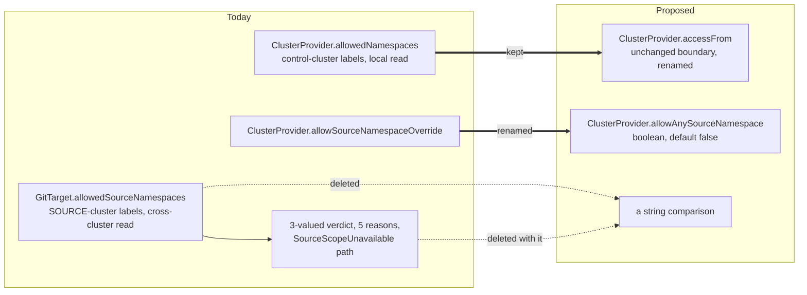

# Source scope: what to delete, and what to keep

> **built**: except the `SelfSubjectAccessReview` pass under "The one thing to build",
> which is additive and was deliberately kept out of the release that cost a bump.
> Date: 2026-08-28, shipped 2026-09-01. Index: [`../INDEX.md`](../INDEX.md).
>
> The migration this page specifies is in [`../UPGRADING.md`](../UPGRADING.md). The
> `sourceNamespace: "*"` section below remains the definition of record; the "Decided for the wave"
> reading is now the shipped one.
>
> Answers a design review's proposal to adopt Flux-style `serviceAccountName` impersonation for
> source reads, by declining it. Evidence for the impersonation half is in
> [`../facts/kubernetes-impersonation-and-flux-identity.md`](../facts/kubernetes-impersonation-and-flux-identity.md),
> including a correction to a claim in that review.

## Decision

1. **Do not build impersonation.** It buys several identities behind one credential against one
   source cluster. Nobody has asked for that, and the cost is four pieces of machinery and an
   `impersonate` grant.
2. **Delete `GitTarget.spec.allowedSourceNamespaces`** and its selector machinery.
3. **Rename `ClusterProvider.spec.allowSourceNamespaceOverride`** to
   `allowAnySourceNamespace`, still a boolean, still defaulting to false.
4. **Decide `sourceNamespace: "*"` explicitly** (see below). It is defined in terms of the field
   being deleted, so it cannot be left alone.
5. **Keep `ClusterProvider.spec.allowedNamespaces`**, renamed `accessFrom`, until a replacement is
   shipped and tested. It is the one field here doing work that nothing else does.

The name keeps `Source` deliberately. `ClusterProvider` carries two namespace planes, and
`allowAnyNamespace` sitting directly beneath `accessFrom` would read as a modifier on it.
`allowCrossNamespace` was the other candidate, borrowing Flux's `--no-cross-namespace-refs`
vocabulary, and it was not taken: in Flux the phrase means object references across namespaces in
one cluster, while here the far side is a namespace in a different cluster. The field's own design
rationale already records why that matters, and it is the sharpest statement of it in the repo: for
a remote provider "the config-plane namespace and the source namespace are on different clusters,
so their sharing a name never was a boundary". Crossing is literally true only for the in-cluster
provider; `any` is literally true for both. It stays a
boolean because there are two states and no third one is in view: impersonation and source-side
selectors are both out, so an enum would only be leaving room for something nobody can name. The
review's objection to a boolean here was that it sat among "two policy objects answering
neighbouring halves"; deleting `allowedSourceNamespaces` removes the other half, and the objection
with it.

## Why `allowedNamespaces` stays

An earlier draft proposed deleting it, on the evidence that the chart renders
`allowedNamespaces: {selector: {}}` and so admits every namespace. That evidence is real but
narrower than it looked: it is the value for the **chart-owned `default` provider only**
([`values.yaml`](../../charts/gitops-reverser/values.yaml)). Every user-authored `ClusterProvider`,
which is every remote cluster, is deny-by-default and carries an explicit consumer list its author
wrote on purpose.

The boundary it draws is not available anywhere else. Source-cluster RBAC bounds **what a
credential may read**. It cannot express **which control-plane tenant may wield that credential**,
because the tenant is not a subject in the source cluster at all. Deleting the field would make a
shared source credential usable from any namespace that can create a `GitTarget`.

A `ValidatingAdmissionPolicy` is not a drop-in replacement either, and this repository has already
written down why: [`../spec/where-validation-lives.md`](../spec/where-validation-lives.md) states
that reconcile-time is the **stronger** gate, because admission is one-shot and cannot see a policy
tightened after the object was created, so "an admission-only check is strictly less safe". A VAP
can stop a new or updated `GitTarget` from selecting a provider. It cannot stop a stored one whose
namespace lost its label. Recommending a VAP here contradicted our own doctrine.

What can be simplified without touching the boundary: the field reads **control-cluster** namespace
labels, locally, with no cross-cluster call and no degradation path, so its selector is cheap in a
way the source-side one is not. Keeping both halves is fine. Renaming to `accessFrom` is still
worth doing, and matters more once the two `allowed*Namespaces` fields no longer sit side by side
to disambiguate each other.

## Why the rest goes

`GitTarget.spec.allowedSourceNamespaces` presents itself as a destination policy: "it belongs to
the DESTINATION, not to any requesting rule". It cannot be one. `WatchRule.spec.targetRef` is a
`LocalTargetReference` ("Must be in the same namespace"), `GitTarget.spec.providerRef` is local
too, and `spec.path` is immutable, so the chain from a Git folder back to the object that fills it
never leaves one namespace:

```text
Git folder  <-  GitProvider  <-  GitTarget  <-  WatchRule
                 (same namespace, all the way)
```

Whoever can create a `WatchRule` there can already write into that folder. What the field really
bounds is which source namespaces the folder's own tenant may **read**, and for a credential-scoped
provider that restates what the credential already carries, in the one place that cannot revoke.
`ClusterWatchRule` bypasses it entirely today and nobody has minded.

**The complexity is in the matcher, not the fence.** `NamespaceMatcher`'s selector half is
evaluated against `Namespace` labels **in another cluster**. That one choice produces the
three-valued verdict (so a source-cluster outage is not a denial), the `SourceScopeUnavailable`
degradation path, the five condition reasons, and the operator's need for source-cluster
`Namespace` get/list/watch. Delete the source-side selector and all of it goes.



## `sourceNamespace: "*"` needs its own decision

> **This section is the definition of record for `sourceNamespace: "*"`.** Both readings live here
> and nowhere else: the shipped one, and the one this wave replaces it with. Other documents state
> the consequence they care about and link here rather than restating the semantics — if you find a
> second copy of the definition, that copy is the bug.
>
> **Superseded**: every source namespace the `GitTarget` admitted, resolved live through
> `allowedSourceNamespaces` into a concrete set, one stream per namespace. Recorded here because the
> migration note and several comments still refer to it.
>
> **Shipped**: one cluster-wide list and watch, rejected outright while `allowAnySourceNamespace` is
> false. [`configuration.md`](../configuration.md#watching-a-different-source-namespace),
> [`architecture.md`](../architecture.md) and
> [`watchrule_types.go`](../../api/v1alpha3/watchrule_types.go) describe this reading; they changed
> in the same commit as the behavior.

Today `*` means "every source namespace this `GitTarget` admits", resolved live through
`allowedSourceNamespaces` into a concrete set, which is then planned as one stream per namespace.
[`watchrule_types.go`](../../api/v1alpha3/watchrule_types.go) says so in the constant's own doc:
"never `every namespace that exists`". So `*` is **defined in terms of the field being deleted**
and cannot survive unchanged.

RBAC cannot supply the missing definition. It answers "may I watch X in namespace Y", never "which
namespaces may I watch". Any set-valued reading of `*` requires listing `Namespace` objects in the
source cluster, which is the cost this whole exercise is trying to remove. Three options:

| Option | Meaning | Cost |
|---|---|---|
| **Delete `*`** | items name namespaces | safest, and a breaking change for anyone using it |
| **Redefine as cluster-wide** | one watch and one list at `metav1.NamespaceAll`, all or nothing | implementable with no `Namespace` access, and a real widening: it reaches everything the credential can see |
| **Keep enumeration** | as today, against some other policy | keeps the cross-cluster `Namespace` read, which was the point of the deletion |

**Decided: redefine as cluster-wide**, rejected outright while `allowAnySourceNamespace` is false.
It applies to **both** halves of a cell's traffic (the initial list that warms the cell, and the
watch that follows it), because they are the same collection read two ways, and splitting them
would mean enumerating namespaces for the replay after all, which is the read this exercise
deletes.

The plumbing already exists, which makes this the cheapest of the three as well as the clearest.
`CellKey.Namespace` is already documented as "empty is a genuinely cluster-wide (all-namespaces)
cell" ([`cell.go`](../../internal/types/cell.go)), and both
[`openTargetWatch`](../../internal/watch/target_watch.go) and `openTargetList` already branch on
it: a non-empty namespace calls `resource.Namespace(ns)`, an empty one calls `resource.Watch`
directly, which for a namespaced GVR is the all-namespaces collection. Readiness, retention
rollup, and event routing all key on `CellKey` already, and records carry the object's own
`u.GetNamespace()` rather than the cell's, so placement is unaffected. What changes is only the
planner: `*` compiles to one cell instead of calling `EnumerateSourceNamespaces` for N. That is a
deletion in `watchrule_compile.go`, not new machinery.

One trap, and the code already records it. A cluster-wide cell is a **peer** of a named-namespace
cell on the same type, never a replacement, because each rule carries its own `operations` filter.
`CellKey`'s doc comment names the bug from a previous attempt: collapsing the two "widened the named
rule's stream to every namespace its credential could read and discarded its operation filter". So
a target carrying both `*` and a named rule for one type runs two streams over overlapping objects,
and that is correct rather than something to optimize away.
It is what a Kubernetes reader expects `*` to mean, and its failure is a clean 403 rather than a
silent empty set.

**It is also the largest single efficiency win in this proposal, and that is a reason in its own
right.** A `*` rule over a type in a hundred-namespace cluster is a hundred watch connections and a
hundred list calls at warm-up today, one per namespace, each with its own cursor, its own retry
schedule and its own share of apiserver watch cache. Cluster-wide makes it one of each, and the
saving grows with the cluster, which is exactly the direction the enumeration got worse in. The
`TooManyStreams` cap was queued for the fan-out this deletes; see
[`gittarget-api-wave.md`](gittarget-api-wave.md), where that rider is now smaller than it was.

## Consequences, including two breaking semantic changes

**A declared policy can currently deny a rule's own namespace.** `allowedSourceNamespaces` is
exhaustive once declared, "with no exception for a rule's own namespace"
([`gittarget_types.go`](../../api/v1alpha3/gittarget_types.go)). So `allowAnySourceNamespace: false`
is **not** the current posture exactly. It matches the no-policy path, which is what a default install runs, and it is a
deliberate simplification for anyone who declared a policy that excluded their own namespace. Say
so in the migration note rather than claiming continuity.

**`*` changes meaning**, per the decision above: it widens from "every namespace this GitTarget
admits" to "every namespace this credential can read", and it stops being available at all unless
`allowAnySourceNamespace` is true. For a user who had no `allowedSourceNamespaces` policy the old
`*` already resolved to whatever the credential could see, so the widening is narrower in practice
than it reads; for a user who had one, it is real.

**Label selectors over source namespaces are lost.** Admitting every namespace carrying a label,
following namespaces as they appear, has no RBAC equivalent short of a binding per namespace. This
is the real capability cost. An N-way restriction costs N objects wherever it is expressed, and
today's version is cheap only because it enforces nothing.

**What is deleted**, 4,569 lines in files that exist for nothing else, with coupling into shared
files running 1 to 26 mentions, so this is a deletion rather than a refactor:

| File | Lines |
|---|---|
| `internal/authz/source_namespace.go` and its test | 1351 |
| `internal/watch/source_namespace_scope.go` and its tests | 1312 |
| `internal/controller/watchrule_source_namespace.go` and its test | 770 |
| `api/v1alpha3/namespace_matcher.go` selector half | part of 371 |
| `test/e2e/source_namespace_e2e_test.go` | 349 |

`internal/authz/clusterprovider_admission.go` stays, since `accessFrom` stays.
`ClusterProviderNotFound` stays with it, though it is reference resolution rather than
authorization and would read better elsewhere.

## The one thing to build

A `SelfSubjectAccessReview` pass under the provider's own credential. It needs no new grant, since
every identity may issue one, and it reports two things a user cannot otherwise get: which of the
requested cells are reachable, and whether write verbs are permitted on them.

Phrase the condition as **"no write permission observed for the requested resources at review
time"**. It cannot prove the mirror is unable to write: a review covers the verbs and resources
asked about, at that instant, and says nothing about other resources, subresources, or a later
change. It is a diagnostic, and a good one, not a proof.

This is also what replaces the deleted policy in the place that matters: the user stops declaring
which namespaces are permitted, and starts being told which are reachable.

## Migration

One breaking change, in the wave already queued, riding the loud-rejection pattern the project uses
for superseded fields:

- `GitTarget.spec.allowedSourceNamespaces` removed.
- `allowSourceNamespaceOverride` becomes `allowAnySourceNamespace`: same type, same default, same
  semantics, so the shim is a pure rename.
- `allowedNamespaces` becomes `accessFrom`, same shape, same semantics.
- `sourceNamespace: "*"` becomes one cluster-wide list and watch, per the decision above, and is
  rejected while `allowAnySourceNamespace` is false. This is a semantic change to a value that
  keeps its spelling, so it needs its own `docs/UPGRADING.md` paragraph rather than a shim.

Then the deletion, then the `SelfSubjectAccessReview` work, which is additive and can ship later.

## Re-open triggers

- **Impersonation**, if one source cluster must serve control-plane tenants with different
  authority and they cannot each hold a credential. The cost is priced in the facts note.
- **Deleting `accessFrom`**, once an external policy recipe is shipped, tested, and its lack of
  live revocation is an accepted product choice rather than an oversight.
- **Source-side selectors**, if a user is found who needs "every namespace labeled X" and cannot
  generate bindings.

## Open questions

- ~~Which `*` option is taken.~~ **Decided: cluster-wide**, list and watch both, above.
- `CellKey.String()` renders an empty namespace as a bare type name ("configmaps"), which read as
  cluster-scoped when only `ClusterWatchRule` produced those cells. Once `*` produces them for
  namespaced types it wants a distinct rendering, "configmaps in all namespaces" or similar, in
  logs and status messages.
- Does the chart keep an `allowAnySourceNamespace` value, and does the quickstart set it true? A
  homelab wants it; a platform should refuse it.
- Does anything rely on `allowedSourceNamespaces.selector` today beyond the e2e suite, which is us
  testing our own feature?
