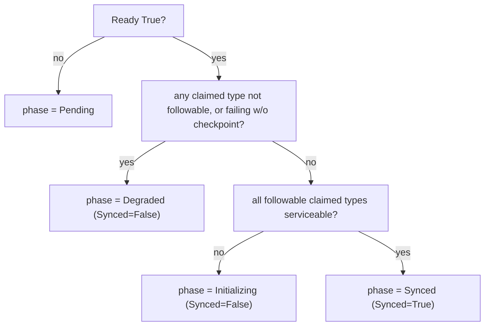

# GitTarget status, conditions, and lifecycle

Status: design (current + target) · Updated: 2026-06-12

This supersedes the original pre-R2 plan, which described a `Bootstrapped → SnapshotSynced`
gate chain (and a `Ready` that depended on the initial snapshot). The api-source-of-truth
pivot removed that lifecycle: there is no bootstrap snapshot gate anymore — a type is
serviceable the moment its per-type checkpoint is `Synced`, and a per-type splice reconcile
does the mirroring. See
[materialization-tail-and-live-readiness-review.md](./stream/materialization-tail-and-live-readiness-review.md)
(Gap 3, Gap 6, Rec 4) for the analysis this doc records as a decision.

## Outcomes

- `GitTarget.status` is an observation-only view of reality.
- `status.conditions` is the automation contract (`kubectl wait --for=condition=…`).
- **Two orthogonal axes**: `Ready` = control-plane correctness (config + plumbing); `Synced`
  = data-plane currency (the mirror reflects what it can). Neither depends on the other.
- A small `status.phase` provides quick human scanning, derived purely from conditions.
- Condition updates are deterministic (no duplicates, no flapping — in particular no flap on
  the periodic checkpoint re-anchor).

## 1. Current state (as implemented today)

Conditions actually set by `internal/controller/gittarget_controller.go`:

- `Validated` — provider exists, branch allowed, no path conflict.
- `EncryptionConfigured` — SOPS/age config resolved (or `NotRequired`).
- `EventStreamLive` — the branch worker exists and the GitTarget's event stream is
  registered. With R3 there is no bootstrap gather behind this; it is purely "is the
  worker/stream wired?". **To be removed** — see the debt list and §3.
- `Ready` — summary: `True` iff `Validated ∧ EncryptionConfigured ∧ EventStreamLive`.

`status.materialization` carries a bounded demand-axis roll-up
(`ClaimedTypes / SyncedTypes / PendingTypes / FailingTypes / NotFollowableTypes`,
`ObservedTime`) but is **not** projected into a condition or phase — so today there is no
first-class "the mirror is current" signal; e2e re-derives one from the raw counts
(`waitForGitTargetMaterializationSettled`).

Known debt to clear as part of this work:

- **No `status.phase` field** exists yet.
- **`status.snapshot` (`GitTargetSnapshotStatus`) is vestigial** — nothing has written it
  since the pre-R2 bootstrap gather was removed. Delete it.
- **`GitTargetReadyReasonInitialSyncInProgress` is unused** (a leftover of the removed
  snapshot gate). Delete it.
- The roll-up **mis-buckets serviceability** (see §3.2): `Resyncing` is counted as
  `Pending`, so any naive liveness check flaps on the periodic re-anchor.
- **`EventStreamLive` is in-memory wiring, not an external state** — `EnsureWorker` →
  `worker.Start` only spawns the event-loop goroutine and returns (the git clone/push is
  lazy), so the condition is `True` whenever `Validated ∧ EncryptionConfigured` are, and it
  is not user-actionable. Its name also wrongly implies a live connection. Remove it as a
  condition and fold the wiring step into `Ready` (§2.1, §5).

## 2. The core decision: `Ready` does not depend on `Synced`

A GitTarget can be in any of four states:

1. config/plumbing broken,
2. plumbing fine, mirror still building (first checkpoints in flight),
3. mirror fully current,
4. plumbing fine, mirror as-current-as-possible **but a claimed type is not followable** (a
   CRD that is not installed, or a typo in a WatchRule).

A single boolean cannot represent these honestly. Folding liveness into `Ready` makes a
state-4 GitTarget `NotReady` *forever* despite being correctly configured and mirroring all
it can; excluding not-followable types from the gate instead makes `Ready=True` silently
ignore a type the user asked to watch. Only two orthogonal axes tell the truth:

- `Ready=True` (plumbing fine) **and**
- `Synced=False, phase=Degraded` with `notFollowableTypes=1` surfaced.

This is the Deployment `Available` vs `Progressing` split. The decision is **principled, not
backward-compat** (there are no end users yet): keep `Ready` a stable control-plane signal
that does not flap on data-plane activity, and add a separate data-plane signal.

### 2.1 `EventStreamLive` is not a real condition — fold it into `Ready`

`EventStreamLive` is the inverse mistake: a condition for something that is **internal wiring
the controller should just get right**, not an externally meaningful state. `EnsureWorker` →
`worker.Start` only spawns the in-memory event-loop goroutine (the git clone/push is lazy), so
the gate is `True` whenever `Validated ∧ EncryptionConfigured` are, never user-actionable, and
its "Live" name wrongly implies a live connection it never checks.

Remove the condition. **Keep the step** — the pipeline must still ensure the worker and
register the event stream before it `Declare`s demand — but on its (rare) failure set
`Ready=False` with a reason (`WorkerUnavailable`), not a dedicated condition. Net:
`Ready = Validated ∧ EncryptionConfigured ∧ worker-wired`.

This leaves a genuine gap the misnamed condition was papering over: **nothing reports whether
the git write path is actually healthy** (clone/push/auth). A push failure today only shows as
a stale `lastPushTime` + metrics. The honest replacement, if/when wanted, is a `Writable` (or
`Pushing`) condition driven by real push success/failure — the condition `EventStreamLive`
pretended to be. Note its natural scope: a `BranchWorker` is keyed by `(provider, branch)` and
**serves N GitTargets** (each under its own non-overlapping `spec.path`), and the push is a
branch-level operation. So write-path health is a property of the *worker*, computed once and
reflected identically on every GitTarget sharing that branch — not something each GitTarget
discovers independently. Out of scope for now; noted so the intent (and its scope) is not lost
when the bit is deleted.

## 3. Target status surface

### 3.1 Fields

Top-level:

- `observedGeneration: int64` (kept)
- `conditions: []metav1.Condition` (kept)
- `phase: string` (NEW — small derived enum; informational only)
- `lastReconcileTime: metav1.Time` (kept)
- `lastCommit`, `lastPushTime` (kept)
- `materialization: {...}` (kept; counts recomputed on the serviceability basis below)
- ~~`snapshot: {...}`~~ (REMOVE — vestigial)

Conditions:

- `Validated`, `EncryptionConfigured`, `Ready` — unchanged.
- ~~`EventStreamLive`~~ — REMOVE (§2.1); its wiring step folds into `Ready`.
- `Synced` (NEW) — the data-plane condition. `True` when every **followable, claimed** type
  is serviceable. Name it `Synced` (or `Materialized`), **not `Live`** — "Live" is the vague
  name we are retiring with `EventStreamLive`, and it reads as a connection/heartbeat rather
  than "the mirror reflects reality".

### 3.2 Serviceability (the predicate that fixes the flap)

A type is *serviceable* when it has a usable checkpoint: `checkpointRV != ""`. That is true
for phases `Synced`, **`Resyncing`** (still serves the prior checkpoint while refreshing),
and **`Failing`-with-a-prior-checkpoint**. It is false for `Dormant`, `Requested`, `Syncing`,
and `Failing`-without-a-checkpoint.

The roll-up and the `Synced` condition must use serviceability, **not** `phase == Synced`.
Otherwise the periodic ~1h re-anchor (`Synced → Resyncing → Synced`) drops `Synced` to
`False` and back every cycle even though nothing was ever unavailable — and it churns the
fast `materializationSettling` requeue. Recompute the roll-up so:

- `syncedTypes` counts serviceable types (not just `phase==Synced`),
- `pendingTypes` counts only genuinely-not-serviceable progressing types
  (`Requested`/`Syncing`),
- `notFollowableTypes` and `failingTypes` stay as the operator-visible signals.

### 3.3 Phase values (small, stable, derived)

Phase is a pure function of conditions + the serviceability roll-up, never an independent
state machine:

| Phase | Meaning |
| --- | --- |
| `Pending` | `Ready=False` — a control-plane gate is not satisfied yet |
| `Initializing` | `Ready=True`, but ≥1 followable claimed type is not yet serviceable (first sync in flight) |
| `Synced` | `Ready=True` and all followable claimed types are serviceable (fully live) |
| `Degraded` | `Ready=True`, serviceable ones are serviceable, but ≥1 claimed type is not followable or is failing-without-a-checkpoint |

Rule: automation depends on **conditions**, never on phase.

## 4. Condition mechanics (still valid; keep)

### 4.1 Upsert helper

A single `SetCondition` (the existing `upsertCondition`) that:

- treats conditions as a map keyed by type,
- updates `LastTransitionTime` only when `Status` changes,
- always refreshes `Reason`/`Message`,
- stamps `ObservedGeneration` into the condition.

### 4.2 Reason enums

Per-condition reason constants (CamelCase). Current + additions:

- `Validated`: `OK`, `ProviderNotFound`, `BranchNotAllowed`, `TargetConflict`
- `EncryptionConfigured`: `OK`, `NotRequired`, `MissingSecret`, `InvalidConfig`,
  `SecretCreateDisabled`
- `Synced` (NEW): `OK`, `Initializing`, `NotFollowable`, `SyncFailing`
- `Ready`: `OK`, `ValidationFailed`, `EncryptionNotConfigured`, `WorkerUnavailable`
  (replaces `StreamNotLive` with the folded wiring step; drop the unused
  `InitialSyncInProgress` and the `EventStreamLive` reasons)

### 4.3 No-flap rules

- no duplicate types,
- no `LastTransitionTime` churn unless `Status` changes,
- a not-yet-evaluated gate is `Unknown` with a clear reason (`NotChecked`/`NotStarted`/
  `Blocked`),
- `Synced` is computed on **serviceability** so a re-anchor does not flap it (§3.2).

## 5. Reconcile pipeline (gate-by-gate, current)

Each step computes its gate from observed state, writes its condition, and — if blocking —
stops further progress while still updating `Ready` and `phase`.

1. **Bookkeeping** — `status.lastReconcileTime = now`; `observedGeneration = generation`.
2. **`Validated`** — provider exists, branch allowed, no path conflict. False ⇒ `Ready=False`
   reason `ValidationFailed`, return.
3. **`EncryptionConfigured`** — resolve/ensure encryption (or `NotRequired`). False ⇒ block.
4. **Worker wiring** (no condition, §2.1) — ensure the branch worker and register the event
   stream. On failure ⇒ `Ready=False` reason `WorkerUnavailable`, return.
5. **`Ready`** — `True` iff steps 2–4 all succeeded. **Independent of `Synced`.**
6. **Demand + data-plane** — `DeclareForGitTarget` renews the claim lease (idempotent); read
   the **serviceability** roll-up; set `status.materialization`, the `Synced` condition, and
   derive `phase`. A still-initializing target requeues on the fast settle cadence; a
   `Degraded`/`Synced` target requeues on the long cadence.

Note that step 6 is bookkeeping + a separate condition: it never gates `Ready`, so a failed
or partial materialization never reports the GitTarget as misconfigured.

## 6. Golden-path progression

| Stage | Conditions | phase |
| --- | --- | --- |
| New GitTarget | gates `Unknown`, `Ready=False` | `Pending` |
| Validated + encryption + worker wired | `Validated/EncryptionConfigured=True`, `Ready=True`, `Synced=False/Initializing` | `Initializing` |
| First checkpoints land | `Synced=True` | `Synced` |
| Periodic re-anchor (Synced→Resyncing→Synced) | `Synced` stays `True` (serviceable) | `Synced` (no flap) |
| A watched CRD is not installed | `Ready=True`, `Synced=False/NotFollowable` | `Degraded` |

## 7. Testing plan

### 7.1 Condition helper (unit)

- upsert inserts/updates without duplication; `LastTransitionTime` changes only on status
  change; ordering-independent.

### 7.2 Reconcile gate tests (table-driven)

- provider missing ⇒ `Validated=False`, `Ready=False`, `phase=Pending`
- encryption secret missing, autocreate off ⇒ `EncryptionConfigured=False`
- worker wiring fails ⇒ `Ready=False` reason `WorkerUnavailable` (no `EventStreamLive` condition)
- all gates pass, types still syncing ⇒ `Ready=True`, `Synced=False`, `phase=Initializing`
- all followable claimed types serviceable ⇒ `Synced=True`, `phase=Synced`
- a periodic re-anchor (Synced→Resyncing→Synced) ⇒ `Synced` does **not** flap
- a claimed-but-not-followable type ⇒ `Ready=True`, `Synced=False`, `phase=Degraded`

### 7.3 `kubectl wait` compatibility (integration/e2e)

- `kubectl wait --for=condition=Ready=true gittarget/<n>`
- `kubectl wait --for=condition=Synced=true gittarget/<n>` (the gate specs use before
  asserting on mirrored content) — and delete the bespoke
  `waitForGitTargetMaterializationSettled` helper, whose logic (and latent re-anchor flap)
  moves into the controller and is fixed there.

## 8. Implementation checklist

- [ ] Recompute the materialization roll-up on the **serviceability** predicate (§3.2)
- [ ] Add `status.phase` and the `Synced` condition (+ reason constants); derive both
- [ ] Set `Ready` = `Validated ∧ EncryptionConfigured ∧ worker-wired` (no `Synced` dep)
- [ ] Remove the `EventStreamLive` condition; fold the worker-wiring step into `Ready`
      (reason `WorkerUnavailable` on failure); update tests/e2e that referenced it
- [ ] Remove vestigial `status.snapshot` / `GitTargetSnapshotStatus` and the unused
      `InitialSyncInProgress` reason; run `task manifests`
- [ ] Add a `phase` printcolumn alongside the `Ready` column
- [ ] Unit + reconcile tests per §7; replace the e2e helper with `--for=condition=Synced`
- [ ] Document the two-axis contract (`Ready` vs `Synced`, phase informational)
