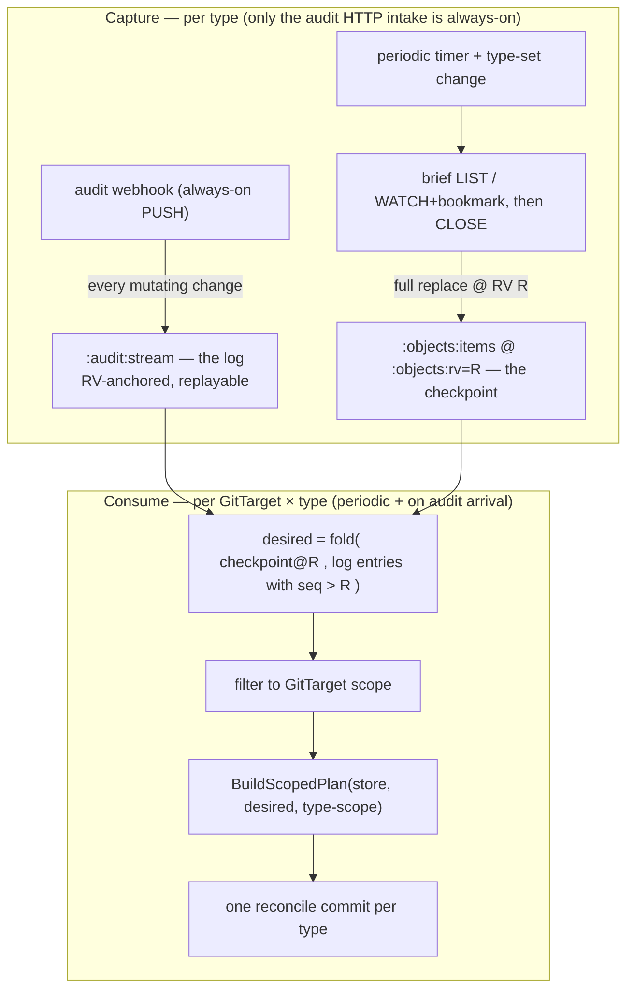
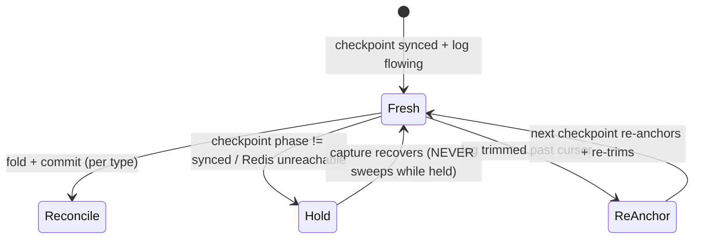

# API as source of truth: checkpoint + log per-type reconcile

> Status: **agreed direction — substrate landing, the pivot + demolition ahead.** The
> capture substrate is real: the write-only per-type keyspace (R0) and the demand layer that
> gates and drives the checkpoint
> ([demand-driven-type-materialization-lifecycle.md](demand-driven-type-materialization-lifecycle.md),
> steps **L-1→L-3**) have landed — so today only the types a GitTarget *claims* are listed
> into the checkpoint. What remains is the **pivot** (make GitTarget reconcile a *consumer*
> of the spliced materialization) and the **demolition** it unlocks (§5.1): the live informer
> fabric, the per-reconcile gather, the RECONCILING handover, and content hashing all go.
> This is a bold **cutover**, not a parallel path left to linger. Supersedes the always-open
> "merged streaming tail" (M13) sketch in
> [../manifest/version2/per-type-reconcile-and-streaming-tail.md](../manifest/version2/per-type-reconcile-and-streaming-tail.md)
> with a watch-free, periodic-reconcile model built on the per-type Redis keyspace.
> Captured: 2026-06-10 · Updated: 2026-06-10
> Owner: Simon
> Related:
> [demand-driven-type-materialization-lifecycle.md](demand-driven-type-materialization-lifecycle.md) (**which** types get a checkpoint and the Dormant→Syncing→Synced lifecycle that governs it — the demand layer beneath this doc),
> [audit-log-ingestion-and-ordering.md](audit-log-ingestion-and-ordering.md) (the log producer / ordering / late-lane detail this doc leaves out),
> [per-resource-type-rv-keyed-streams-experiment.md](per-resource-type-rv-keyed-streams-experiment.md) (the write-only prototype this consumes),
> [../manifest/version2/dream.md](../manifest/version2/dream.md) (the origin),
> [../manifest/reconcile-via-watchlist-mark-and-sweep.md](../manifest/reconcile-via-watchlist-mark-and-sweep.md) (the plan/sweep machinery, reused),
> [../manifest/version2/per-type-reconcile-and-streaming-tail.md](../manifest/version2/per-type-reconcile-and-streaming-tail.md) (M10–M12 it builds on).

## 1. One paragraph

The Kubernetes API is the **ultimate** source of truth; Git is the durable mirror that
follows it so closely it is the source of truth for everything downstream. Today each
GitTarget re-derives the API for itself — a per-reconcile streaming-list gather
([`StreamClusterSnapshotForGitDest`](../../../internal/watch/snapshot_stream.go#L76)) plus
a second always-open informer feed. This design replaces both with a single, standing,
**type-keyed materialization of the API in Redis** and makes GitTarget reconcile a
**consumer** of it. The API is captured **once per type** — and only for the types a GitTarget
actually follows ([demand-driven-type-materialization-lifecycle.md](demand-driven-type-materialization-lifecycle.md))
— by two decoupled writers — an
always-on audit-webhook **log** and a periodic LIST **checkpoint** — and every GitTarget
reconciles by **splicing the checkpoint with the log**, per type, into one commit. No
object watch stays open. Content hashing is dropped: a per-type, RV-anchored ordering
sequence makes "what is newer" exact, and the writer's existing no-op detection makes
"did it change" exact. The plan is deliberately **subtractive**: once the splice is the only
live truth path, the live informer fabric, the per-reconcile gather, the bootstrap handover,
and both content hashes are **deleted, not kept alongside** (§5.1).

## 2. Requirements

These are the requirements this design must satisfy. They are the agreed acceptance
surface; every decision in §4 traces back to one.

| # | Requirement |
|---|---|
| **R1** | **API is the source of truth.** The reconcile's desired state is a pure function of the materialized API (checkpoint + log), never of Git paths or re-derivation from scratch. Git is the mirror. |
| **R2** | **Reconcile per type.** The unit of reconcile is one watched type `(GVK, GVR, scope)`; a GitTarget watching five types has five independent reconciles and one commit per type. |
| **R3** | **No long-lived object watches.** Watches are opened only briefly to fill a checkpoint, then closed. The only always-on intake is the audit-webhook push. (A *discovery* watch for new resource **types** is allowed — it is type-level, not object-level.) |
| **R4** | **The audit intake never stops.** It is the freshness feed; missing events degrades freshness, never correctness (R13). Surviving failover is an HA concern, deferred (R10). |
| **R5** | **The checkpoint is refreshed periodically** by a LIST (or modern WATCH-with-bookmark), e.g. hourly — **not** by folding the audit log into it. The two feeds stay decoupled. |
| **R6** | **Reconcile splices checkpoint + log** to compute current desired state and emits **one** reconcile commit per type. It does **not** replay history as per-event commits, even on first sync of a new GitTarget. |
| **R7** | **Drop content hashing.** Remove the sha256-of-YAML dedup on both the informer edge and the event stream; rely on the ordering sequence (R8) + writer no-op detection. |
| **R8** | **Replayable, RV-anchored ordering.** The per-type log carries a self-assigned, strictly increasing sequence anchored to the resourceVersion, so a reconcile can replay from a checkpoint point with a guarantee, and RV-less events still get a position. |
| **R9** | **Per-type independence.** A wobbly, throttled, or removed type fails *itself*; stable types keep reconciling. |
| **R10** | **HA-ready, not HA-now.** The design must not preclude multiple replicas / failover, but HA is out of scope for this plan. |
| **R11** | **Fail-closed.** Never sweep Git on a stale, unobservable, or partial view. An untrusted absence is never a deletion. |
| **R12** | **Visibility.** An operator can see what a GitTarget follows, per-type sync state, and counts (metrics first, bounded status, optional inventory). |
| **R13** | **Big resource sets are a first-class case** — their own e2e and metrics (checkpoint duration, log lag, commit counts). |
| **R14** | **Coalescing is a follow-up.** Grouping co-arriving changes into one commit is desirable but not required for the first cut. |

## 3. The model: checkpoint + log, spliced per type

Two decoupled capture writers per type, neither holding a watch open, plus a per-type
consumer that splices them. This is a **checkpoint + write-ahead-log** shape.

> **Terminology — "checkpoint fill."** Throughout, *filling the checkpoint* means a **brief
> streaming-list WATCH** (`sendInitialEvents=true` + the initial-events-end bookmark), with a
> consistent **LIST as the per-type fallback** for a server that cannot stream — never a
> long-lived watch (R3). This is the modern path the Materializer documents
> ([materializer.go](../../../internal/typeset/materializer.go)). The current writer
> ([`mirrorTypeObjects`](../../../internal/watch/type_objects_mirror.go#L59)) uses the LIST
> fallback; the streaming-list fast-path is an R1 upgrade. Where older text below says "LIST
> checkpoint," read "checkpoint fill."



The two feeds are deliberately **not** connected (R5). They cover each other's weakness:

| Feed | Strength | Weakness | Covered by |
|---|---|---|---|
| `:audit:stream` (always-on push) | **freshness** (near-real-time) | completeness not guaranteed | the checkpoint heals it within the interval |
| `:objects:items` (periodic checkpoint fill) | **correctness** (authoritative full set; catches orphans / missed deletes) | up to one interval stale alone | the log makes the reconcile current |

This is what lets R4 be true without being fatal: an audit gap costs **freshness until the
next checkpoint**, never **correctness** (R13, R11). It is also the HA seam (R10): the
checkpoint is a standing resume point a failover replica can reconcile against.

### 3.1 Relationship to what exists today

The live path is **already** Redis-stream-driven, not informer-driven:
[`AuditConsumer`](../../../internal/queue/redis_audit_consumer.go#L206) `XREADGROUP`s one
canonical stream, matches rules per event, and routes `git.Event`s to the BranchWorker.
This design is **v2 of "audit drives Git"**: shard that single stream into the per-type
`:audit:stream`s the prototype already writes, add the periodic checkpoint for
mark-and-sweep correctness (deletes/orphans no longer depend on a delete event arriving),
and make the unit a per-type splice reconcile. The plan/apply machinery is reused
unchanged (§5).

## 4. Decisions (the choices, with rationale)

### DEC-1 — Capture = periodic checkpoint + always-on log, decoupled  *(satisfies R3, R4, R5)*

**Chosen.** The checkpoint is the only thing that touches the API on a schedule, and it
closes immediately. The log is fed by the existing audit-webhook tap
([`mirrorByType`](../../../internal/webhook/audit_handler.go#L518)). They are never wired
to each other.

*Rejected:* keep `:objects:items` live by folding the log into it — couples the two feeds,
re-introduces a standing consumer, and makes the snapshot only as complete as the audit
policy. *Rejected:* an always-open informer/streaming tail (the old M13) — violates R3 and
owns reconnect / `410 Gone` / fan-out-refcount lifecycle we no longer need.

### DEC-2 — Reconcile = splice(checkpoint, log) per type → one commit  *(satisfies R1, R2, R6)*

**Chosen.** Per `(GitTarget, type)`, desired state is `fold(checkpoint, log-after-R)`,
scoped, then `BuildScopedPlan` → one commit. Pure function of the materialized API (R1).
No history replay (R6).

### DEC-3 — RV-ordered, replayable log (drop millisecond-first ordering)  *(satisfies R8)*

**Chosen.** Re-key the per-type log from today's millisecond-first `<stage_millis>-<rv>`
to **resourceVersion-first**, so the log is ordered by etcd commit order and a reconcile
can replay exactly from a checkpoint (`XRANGE (R +`). This makes "is this event after
checkpoint R?" a precise, delivery-order-independent test, which is what lets DEC-6 drop
content hashing.

The encoding (`<rv>-*` with Valkey-allocated subsequence), the RV-comparison rules, the
diagnostic **late lane** for out-of-order arrivals, RV-less placement, and the deferred
Lua / pre-sorter improvements all live in the dedicated producer design:
**[audit-log-ingestion-and-ordering.md](audit-log-ingestion-and-ordering.md)**. The
load-bearing invariant that doc establishes, and that this reconcile relies on: **the main
stream is strictly RV-ordered — we never knowingly insert an out-of-order event** — so the
splice in §6 can fold by stream position.

### DEC-4 — Checkpoint trigger = demand-gated, periodic **and** event-driven  *(satisfies R2, R5, R9)*

**Chosen.** A checkpoint is built **only for a type a GitTarget claims** — not for every
followable type — and once built is re-anchored on a timer (default ~1h) **and** on a
deliberate type-set change (a claim that adds the type, or a catalog generation bump from a
CRD installed/upgraded). The phase machine that governs this — `Dormant → Requested → Syncing
→ Synced ⇄ Resyncing`, the claim/lease demand model, and the single periodic pass that both
re-anchors the still-wanted and releases the no-longer-wanted — is specified in
**[demand-driven-type-materialization-lifecycle.md](demand-driven-type-materialization-lifecycle.md)**.
This doc assumes a `Synced` checkpoint exists for the type being reconciled.

### DEC-5 — RV-less events: best-effort in the log, correctness from the next checkpoint  *(satisfies R11, R13)*

**Chosen consequence.** RV-bearing events (all creates/updates) replay exactly. RV-less
events (some deletes, collection verbs) get a best-effort placement in the log for
**freshness**; their **correctness** is guaranteed by the next checkpoint — the LIST will
simply not contain a deleted object, and the type-scoped mark-and-sweep removes it. We do
not over-engineer the RV-less path; the checkpoint backstops it. The placement mechanics
are in [audit-log-ingestion-and-ordering.md](audit-log-ingestion-and-ordering.md) (IR5).

### DEC-6 — Drop content hashing  *(satisfies R7)*

**Chosen, and wanted.** Remove `isDuplicateContent`
([informers.go](../../../internal/watch/informers.go)) and `computeEventHash` /
`processedEventHashes`
([git_target_event_stream.go](../../../internal/reconcile/git_target_event_stream.go)).
"Newer?" is answered by the stream position (DEC-3); "changed?" is answered by the writer's
existing no-op detection (`manifestedit.Decide` → `EditNoChange`,
`manifestsAreSemanticallyEqual` in [plan_flush.go](../../../internal/git/plan_flush.go)),
already computed for free at the commit boundary. Measured before/after on a high-churn
type (R13); the cheap fallback if ever needed is a per-identity last-position equality
check (string compare, not a hash).

### DEC-7 — Retire long-lived informers, the gather, and the RECONCILING handover  *(satisfies R3)*

**Chosen.** With the audit push as the sole live feed and the checkpoint as the periodic
truth, three things go: the informer **object-watch** pipeline (the `startInformerScope` /
`startSingleInformer` lifecycle in [manager.go](../../../internal/watch/manager.go) +
[`addHandlers`](../../../internal/watch/informers.go)), the per-reconcile **streaming
gather** ([`StreamClusterSnapshotForGitDest`](../../../internal/watch/snapshot_stream.go#L76)
and its per-type twin), and the bootstrap/steady-state **handover** buffer
(`BeginReconciliation`/`OnReconciliationComplete`). The checkpoint writer is the per-type
fill ([`mirrorTypeObjects`](../../../internal/watch/type_objects_mirror.go#L59), now demand-
driven), **not** the whole-GitTarget gather — so that gather is deleted outright, not kept as
a "checkpoint writer." Deleted-final-state handling and shared fan-out, which informers gave
for free, are now provided by the checkpoint (catches missed deletes) and Redis fan-out (one
capture, N consumers). The **type-level** discovery watch
([`startAPISurfaceTriggerInformers`](../../../internal/watch/manager_catalog.go#L378)) stays
— it watches resource *types*, not objects (R3). **Sequencing (per review): this deletion
happens only after the splice (R2) is proven the sole live truth path.**

### DEC-8 — Coalescing is a follow-up  *(satisfies R14)*

**Chosen.** First cut may reconcile-and-commit per audit-triggered wake-up. Debouncing
co-arriving changes into one commit per window is a later optimization; the BranchWorker
commit window already coalesces, so this is tuning, not new machinery.

## 5. What is reused unchanged

The entire write side stays. **Only the source of `Desired` changes** — from "a live API
stream this reconcile opened" to "the spliced materialization."

- [`BuildScopedPlan`](../../../internal/manifestanalyzer/plan.go#L210) — type-scoped
  mark-and-sweep; a reconcile passes that type's desired set + scope predicate, a pure
  sweep passes an empty desired set (M12).
- [`ResyncRequest{Desired, Revision, ScopeGVR}`](../../../internal/git/types.go#L224) +
  [`EnqueueResync`](../../../internal/git/branch_worker.go#L294) — the BranchWorker entry
  point; `ScopeGVR` already makes a resync per-type.
- The BranchWorker single-writer queue, commit window, and `plan_flush` apply path.

### 5.1 What we delete — the demolition  *(the inverse of §5: a lot)*

The pivot (R2) makes the spliced materialization the **only** desired-state source, so every
path that *re-derived* the API — by watching it, gathering it per reconcile, or de-duping its
echoes — becomes dead weight. The plan is net-**subtractive**: when R3 lands, the diff is
mostly red. **This deletion happens only after R2 is proven** (per review — never drop the
old path until the splice is the sole live truth). Grouped by the decision that kills each:

| Kill | Code (file · symbols) | Why dead | Replaced by |
|---|---|---|---|
| **Content hashing** (DEC-6/R7) | `isDuplicateContent` + `lastSeenHash`/`clearDeduplicationCacheForGVRs`/`resourceMatchesGVRs`/`splitResourceKey` ([manager.go](../../../internal/watch/manager.go)); `computeEventHash`/`processedEventHashes` ([git_target_event_stream.go](../../../internal/reconcile/git_target_event_stream.go)) | "newer?" = stream position (DEC-3); "changed?" = writer no-op detection | `manifestedit.Decide` at the commit boundary |
| **Long-lived object informers** (DEC-7/R3) | the informer lifecycle in [manager.go](../../../internal/watch/manager.go) — `activeInformers`/`informerFactories`, `desiredInformerScope`, `informersToStart`/`informersObsolete`/`compareInformerScope`, `startInformerScope`/`startSingleInformer`/`startCollectedInformers`/`stopInformerNamespace`/`initializeInformerMaps`; the object-watch handlers in [informers.go](../../../internal/watch/informers.go) (`addHandlers` + funcs) | no object watch stays open (R3) | checkpoint (missed deletes) + audit push (live) + Redis fan-out |
| **RECONCILING handover** (DEC-7) | `GitTargetEventStream` buffering + `BeginReconciliation`/`OnReconciliationComplete` ([git_target_event_stream.go](../../../internal/reconcile/git_target_event_stream.go)); `EventRouter.BeginReconciliationForStream`/`CompleteReconciliationForStream`; `Manager.beginReconciliationForTargets`/`completeReconciliationForTargets` | no bootstrap-vs-steady race once there is no informer bootstrap | reconcile-off-checkpoint is uniform |
| **Per-reconcile streaming gather** (R2) | most of [snapshot_stream.go](../../../internal/watch/snapshot_stream.go) — `StreamClusterSnapshotForGitDest`, `StreamSnapshotForType`, `resolveSnapshotGVRForType`, `joinSnapshotStreams`, `streamInitialEvents`, `listInitialEvents`, `streamingListOptions`, `snapshotStreamTasks` | desired is no longer gathered live per reconcile | the splice (§6) |
| **Whole-GitTarget resync + plan-hash selection** (R2) | [manager.go](../../../internal/watch/manager.go) — `emitSnapshotForRuleChange`, `snapshotTargetsNeedingDelivery`, `currentRuleSetSnapshots`/`watchPlanFromTable`, `ruleSetSnapshotTarget`/`targetWatchPlan`, `lastDeliveredRuleSetHash`/`pendingRuleSetHash`/`markRuleSetSnapshotDelivered`, `snapshotEmitCount`; [event_router.go](../../../internal/watch/event_router.go) — `EmitResyncForGitDest`, `TriggerResyncForGitDest`, `gatherAndEnqueueResync` | reconcile is per-type off the checkpoint, not a whole-target gather on rule churn | per-type splice (R2) + the demand `Declare` (L-2) for scope |
| **Bootstrap `SnapshotSynced` gate** (R2) | [gittarget_controller.go](../../../internal/controller/gittarget_controller.go) — `evaluateSnapshotGate`'s resync + `GitTargetConditionSnapshotSynced`; `Manager.gitTargetSnapshotSynced` ([type_lifecycle.go](../../../internal/watch/type_lifecycle.go)) | no initial whole-target snapshot to gate; a type is serviceable when its checkpoint is `Synced` | the materializer phase **is** the readiness signal |
| **Single-stream audit fan** (R2/R3) | the single-canonical-stream match/route in [redis_audit_consumer.go](../../../internal/queue/redis_audit_consumer.go) (`XREADGROUP` one stream → per-event `git.Event`) | capture is sharded per-type and consumed by the splice, not routed per event | per-type `:audit:stream` + splice |

**Rewired, not deleted:** [`EmitTypeReconcileForGitDest`](../../../internal/watch/event_router.go#L324) and `reconcileTypeForSyncedTargets` lose their `StreamSnapshotForType` call and gain the splice as the desired source.

**Kept (the load-bearing remainder):** the write side (§5 — `BuildScopedPlan`, `ResyncRequest`/`EnqueueResync`, BranchWorker + `plan_flush`); demand + scope resolution (`resolveSnapshotGVRs`, the watched-type tables, `snapshotGVRsFromTable`); the **type-level** discovery watch (`startAPISurfaceTriggerInformers` — CRDs/APIServices, allowed by R3); the audit-webhook tap (`mirrorByType`); and the per-type **checkpoint fill** (`mirrorTypeObjects`, to grow the streaming-list/watch+bookmark fast-path).

## 6. The splice, specified

Per `(GitTarget, type)` at reconcile time:

```text
R        := :objects:rv                              # checkpoint revision = replay cursor
desired  := decode(:objects:items)                   # the anchor set, pinned at R
for entry in XRANGE :audit:stream (R +:              # log strictly after the checkpoint
    if entry.verb is delete: delete desired[entry.identity]
    else:                    desired[entry.identity] = object(entry)   # last-writer-wins by position
desired  := filter(desired, GitTarget namespaces/scope)
plan     := BuildScopedPlan(store, files, desired, scope(type))
enqueue plan on BranchWorker  →  one commit
```

- The audit entry already carries the full object body (`payload_json`), and the existing
  [`extractObject`](../../../internal/queue/redis_audit_consumer.go#L846) /
  `sanitize` path turns it into a Git-writable object — reused verbatim.
- Idempotent: re-running yields the same `desired` (pure function of checkpoint + log).
- Exact under async delivery: membership in `(R +` is decided by `objectRV`, not arrival
  time (DEC-3).
- Bounded: the log is trimmed to the checkpoint cursor on each re-anchor, so a reconcile
  never scans more than one interval of history.

**Trim-cursor model (pin this before aggressive trimming — per review).** The trim cursor is
the **oldest currently-serving** checkpoint `:objects:rv` for that type — normally the single
live checkpoint's rv. During a `Resyncing` swap the **prior** checkpoint still serves (L5), so
the log is held from the prior rv until the new fill lands, then trimmed up to the new rv.
"Never below the oldest live checkpoint cursor" means exactly this: trim to
`min(rv over serving checkpoints of the type)`, never below. Trimming is **safe, never
lossy**: a reconcile that finds the log trimmed past its cursor simply re-reads the current
checkpoint and folds from there (§7) — the checkpoint is the floor, the log only ever extends
forward of it. Per-type cursor ownership across HA replicas is deferred (R10, §9).

## 7. Failure / consistency model  *(R11)*



- **Checkpoint not `synced`, or Redis unreachable → hold, sweep nothing** (R11). An
  unobservable surface is never a trusted absence — the same guard as M12's degraded-
  catalog hold. (The `Syncing`/`Synced`/`Resyncing`/`Failing` phase vocabulary and its own
  first-sync-hold vs fail-closed-re-anchor handling live in
  [demand-driven-type-materialization-lifecycle.md](demand-driven-type-materialization-lifecycle.md) §7.)
- **Log trimmed past a cursor → wait for / force the next checkpoint** and reconcile from
  it. Bounded by the checkpoint interval, so rare by construction.
- **A type whose checkpoint LIST fails holds itself**; siblings keep reconciling (R9).
- **Consistency pin** is `(commit SHA, :objects:rv, last-applied log position)` per type.
  Cross-type "max position" interpretation is an open question (§9).

## 8. Implementation — bold stages

Each stage ends green, but each is a **cutover**, not a parallel path left to linger. The
execution order is fixed by one rule the review made explicit: **do not delete the old path
until the splice is proven the sole live truth** — build forward (R1→R2), prove it, then
demolish (R3).

**Landed already.** R0 (the write-only per-type keyspace). And the **demand layer** beneath
this doc — [demand-driven-type-materialization-lifecycle.md](demand-driven-type-materialization-lifecycle.md)
**L-1→L-3**: a `typeset.Materializer` owns per-`(GitTarget, type)` demand (claims as
self-renewing leases), the GitTarget reconcile `Declare`s its watched-type set, a periodic
**Sweep** ages out withdrawn demand, and a checkpoint **driver** in `internal/watch` now fills
`:objects:items` for **only the claimed types** (`runTypeCheckpointSync` →
[`mirrorTypeObjects`](../../../internal/watch/type_objects_mirror.go#L59), gated by the
Materializer's `Synced` phase). `TypeActivated` no longer mirrors unconditionally — the big
efficiency win is in. So the checkpoint half of the substrate is real and demand-gated; what
remains is the RV-ordered log, the splice, and the demolition.

### R1 — Substrate: RV-ordered log + trimmable, durable checkpoint  *(R5, R8)*

Make the log replay-exact and the checkpoint durable enough to resume from.
- Re-key `:audit:stream` from `<stage_millis>-<rv>` to **RV-first** and add the diagnostic
  late lane — full producer spec in [audit-log-ingestion-and-ordering.md](audit-log-ingestion-and-ordering.md)
  (the concrete change is to [`RedisByTypeStreamQueue`](../../../internal/queue/redis_bytype_queue.go)).
- On each re-anchor, **trim** `:audit:stream` to the trim cursor (the oldest serving
  checkpoint rv — the model is pinned in §6) and persist `:objects:state` — the durable
  phase/rv a restart rebuilds from (demand-layer **L-5**; the HA seam, R10).
- The periodic re-anchor/release that drives the writer is demand-layer **L-4**: the Sweep
  already flags a still-claimed `Synced` type for re-anchor and the driver re-fills it; this
  step adds the log trim + state persistence around it.
- *Done when:* the log is RV-ordered and replay-rangeable by `:objects:rv`; checkpoints
  re-anchor on schedule and trim the log to the cursor; a restart resumes from
  `:objects:state` without re-filling the world. **Still no consumer.**

### R2 — The splice reconcile — THE PIVOT  *(R1, R2, R6 — headline)*

One new per-type consumer makes the API-in-Redis the desired state. The instant it lands,
every other desired-set source is **dead on arrival** (R3 then deletes it).
- `desired = fold(:objects:items@R, XRANGE :audit:stream (R +)`, filter to the GitTarget's
  scope, `BuildScopedPlan` → `EnqueueResync{ScopeGVR}` → one commit per type (§6). Pure
  function of the materialized API (R1); no history replay (R6).
- Wake on the Materializer's `TypeSynced` (the type is now serviceable) and on audit arrival
  for a watched type — **rewire** the existing
  [`EmitTypeReconcileForGitDest`](../../../internal/watch/event_router.go#L324) seam so it
  *splices* instead of calling `StreamSnapshotForType`. Fail-closed per §7 (hold while the
  checkpoint phase ≠ `Synced`).
- *Done when:* a GitTarget reconciles per type off Redis with **zero per-reconcile API
  calls**; N GitTargets fan out from one capture; mark-and-sweep stays within type bounds;
  multi-type files stay document-correct; a wobbly type never blocks siblings (R9).

### R3 — The great deletion  *(R3, R7; DEC-6, DEC-7 — itemised in §5.1)*

With the splice proven, a large body of code is pure dead weight. Delete it in **one
decisive campaign**, not a long tail of "keep X for now": the long-lived **informer fabric**,
the **RECONCILING handover**, the **per-reconcile streaming gather**
(`StreamClusterSnapshotForGitDest` & friends), the **whole-GitTarget rule-change resync +
plan-hash selection**, the bootstrap **`SnapshotSynced` gate**, and **content hashing on both
edges**. Shard the single canonical `AuditConsumer` stream into the per-type `:audit:stream`
the splice reads. The full file-and-symbol list is **§5.1**.
- *Done when:* exactly one live intake remains (audit push) + the periodic checkpoint; no
  informer object caches, no live gather, no hash maps, no handover buffer; the diff is
  mostly red; e2e green. The hash-drop CPU check (R7) is measured before/after on a
  high-churn type; the last-position equality fallback is kept ready but unused.

### R4 — Visibility + big-set hardening  *(R12, R13)*

Surface the keyspace that already exists — `__index__` + `:objects:state`
(phase/count/rv/updated_at) — as per-`(GitTarget, type)` metrics and a bounded
`GitTargetStatus` roll-up (total/synced/failing, CRD version, last position), plus an optional
queryable inventory. Prove the **large-set** case in the same stage: a synthetic cluster-wide
type with thousands of objects, asserting per-type commits, correct sweep, no lost tail event,
bounded checkpoint duration + log lag. *Done when:* an operator can see what each GitTarget
follows and each type's sync state, and the big-set e2e is green.

### R5 — Commit coalescing  *(R14, follow-up)*

Debounce audit-triggered reconciles so co-arriving changes group per commit window. Tuning on
top of the BranchWorker's existing window, not new machinery (DEC-8).

## 9. Open questions

- **Checkpoint interval.** *Settled: ~1h default.* Open only on whether it is per-type
  tunable. Freshness between checkpoints rides entirely on the log (R4); the interval only
  bounds correctness drift and log size.
- **Cross-type consistency.** Per-type gives one position per type; if any consumer needs a
  folder-wide consistent revision (status, a future audit join), define the "max position
  across types" interpretation.
- **Trigger debounce shape (R14).** Per-type timer vs. audit-arrival-driven vs. both, and
  the debounce window that best matches the commit window.
- **HA (R10, deferred).** Leader-elected single consumer today
  ([`NeedLeaderElection`](../../../internal/queue/redis_audit_consumer.go#L200)). Multi-
  replica fan-out, the never-stop audit intake across failover, and per-type cursor
  ownership are a separate plan; this design must not preclude them.

> Ordering / late-lane / ingestion open questions (the pre-sorter and Lua triggers, the
> non-numeric-RV policy, the §7 investigation) live in
> [audit-log-ingestion-and-ordering.md](audit-log-ingestion-and-ordering.md), not here.
