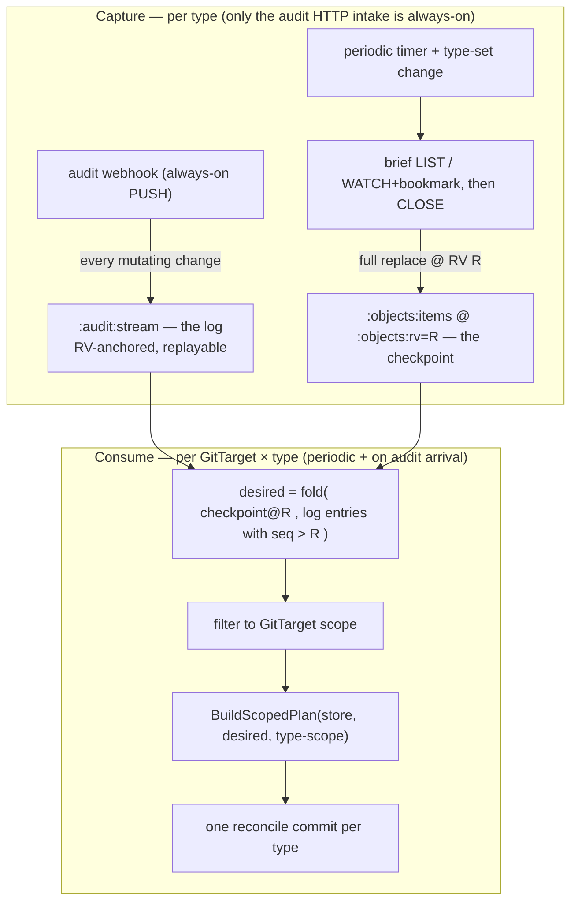
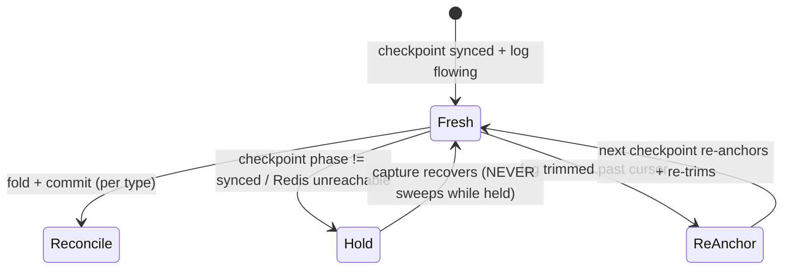

# API as source of truth: checkpoint + log per-type reconcile

> Status: **design proposal** — agreed direction, not yet implemented. Supersedes the
> always-open "merged streaming tail" (M13) sketch in
> [../manifest/version2/per-type-reconcile-and-streaming-tail.md](../manifest/version2/per-type-reconcile-and-streaming-tail.md)
> with a watch-free, periodic-reconcile model built on the per-type Redis keyspace.
> Captured: 2026-06-10
> Owner: Simon
> Related:
> [per-resource-type-rv-keyed-streams-experiment.md](per-resource-type-rv-keyed-streams-experiment.md) (the write-only prototype this consumes),
> [../manifest/version2/dream.md](../manifest/version2/dream.md) (the origin),
> [../manifest/reconcile-via-watchlist-mark-and-sweep.md](../manifest/reconcile-via-watchlist-mark-and-sweep.md) (the plan/sweep machinery, reused),
> [../manifest/version2/per-type-reconcile-and-streaming-tail.md](../manifest/version2/per-type-reconcile-and-streaming-tail.md) (M10–M12 it builds on).

## 1. One paragraph

The Kubernetes API is the **ultimate** source of truth; Git is the durable mirror that
follows it so closely it is the source of truth for everything downstream. Today each
GitTarget re-derives the API for itself — a per-reconcile streaming-list gather
([`StreamClusterSnapshotForGitDest`](../../../internal/watch/snapshot_stream.go#L76)) plus
a second always-open informer feed. This design replaces both with a single, standing,
**type-keyed materialization of the API in Redis** and makes GitTarget reconcile a
**consumer** of it. The API is captured **once per type** by two decoupled writers — an
always-on audit-webhook **log** and a periodic LIST **checkpoint** — and every GitTarget
reconciles by **splicing the checkpoint with the log**, per type, into one commit. No
object watch stays open. Content hashing is dropped: a per-type, RV-anchored ordering
sequence makes "what is newer" exact, and the writer's existing no-op detection makes
"did it change" exact.

## 2. Requirements

These are the requirements this design must satisfy. They are the agreed acceptance
surface; every decision in §4 traces back to one.

| # | Requirement |
|---|---|
| **R1** | **API is the source of truth.** The reconcile's desired state is a pure function of the materialized API (checkpoint + log), never of Git paths or re-derivation from scratch. Git is the mirror. |
| **R2** | **Reconcile per type.** The unit of reconcile is one watched type `(GVK, GVR, scope)`; a GitTarget watching five types has five independent reconciles and one commit per type. |
| **R3** | **No long-lived object watches.** Watches are opened only briefly to fill a checkpoint, then closed. The only always-on intake is the audit-webhook push. (A *discovery* watch for new resource **types** is allowed — it is type-level, not object-level.) |
| **R4** | **The audit intake never stops.** It is the freshness feed; missing events degrades freshness, never correctness (R13). Surviving failover is an HA concern, deferred (R10). |
| **R5** | **The checkpoint is refreshed periodically** by a LIST (or modern WATCH-with-bookmark), e.g. hourly — **not** by folding the audit log into it. The two feeds stay decoupled. |
| **R6** | **Reconcile splices checkpoint + log** to compute current desired state and emits **one** reconcile commit per type. It does **not** replay history as per-event commits, even on first sync of a new GitTarget. |
| **R7** | **Drop content hashing.** Remove the sha256-of-YAML dedup on both the informer edge and the event stream; rely on the ordering sequence (R8) + writer no-op detection. |
| **R8** | **Replayable, RV-anchored ordering.** The per-type log carries a self-assigned, strictly increasing sequence anchored to the resourceVersion, so a reconcile can replay from a checkpoint point with a guarantee, and RV-less events still get a position. |
| **R9** | **Per-type independence.** A wobbly, throttled, or removed type fails *itself*; stable types keep reconciling. |
| **R10** | **HA-ready, not HA-now.** The design must not preclude multiple replicas / failover, but HA is out of scope for this plan. |
| **R11** | **Fail-closed.** Never sweep Git on a stale, unobservable, or partial view. An untrusted absence is never a deletion. |
| **R12** | **Visibility.** An operator can see what a GitTarget follows, per-type sync state, and counts (metrics first, bounded status, optional inventory). |
| **R13** | **Big resource sets are a first-class case** — their own e2e and metrics (checkpoint duration, log lag, commit counts). |
| **R14** | **Coalescing is a follow-up.** Grouping co-arriving changes into one commit is desirable but not required for the first cut. |

## 3. The model: checkpoint + log, spliced per type

Two decoupled capture writers per type, neither holding a watch open, plus a per-type
consumer that splices them. This is a **checkpoint + write-ahead-log** shape.



The two feeds are deliberately **not** connected (R5). They cover each other's weakness:

| Feed | Strength | Weakness | Covered by |
|---|---|---|---|
| `:audit:stream` (always-on push) | **freshness** (near-real-time) | completeness not guaranteed | the checkpoint heals it within the interval |
| `:objects:items` (periodic LIST) | **correctness** (authoritative full set; catches orphans / missed deletes) | up to one interval stale alone | the log makes the reconcile current |

This is what lets R4 be true without being fatal: an audit gap costs **freshness until the
next checkpoint**, never **correctness** (R13, R11). It is also the HA seam (R10): the
checkpoint is a standing resume point a failover replica can reconcile against.

### 3.1 Relationship to what exists today

The live path is **already** Redis-stream-driven, not informer-driven:
[`AuditConsumer`](../../../internal/queue/redis_audit_consumer.go#L206) `XREADGROUP`s one
canonical stream, matches rules per event, and routes `git.Event`s to the BranchWorker.
This design is **v2 of "audit drives Git"**: shard that single stream into the per-type
`:audit:stream`s the prototype already writes, add the periodic checkpoint for
mark-and-sweep correctness (deletes/orphans no longer depend on a delete event arriving),
and make the unit a per-type splice reconcile. The plan/apply machinery is reused
unchanged (§5).

## 4. Decisions (the choices, with rationale)

### DEC-1 — Capture = periodic checkpoint + always-on log, decoupled  *(satisfies R3, R4, R5)*

**Chosen.** The checkpoint is the only thing that touches the API on a schedule, and it
closes immediately. The log is fed by the existing audit-webhook tap
([`mirrorByType`](../../../internal/webhook/audit_handler.go#L518)). They are never wired
to each other.

*Rejected:* keep `:objects:items` live by folding the log into it — couples the two feeds,
re-introduces a standing consumer, and makes the snapshot only as complete as the audit
policy. *Rejected:* an always-open informer/streaming tail (the old M13) — violates R3 and
owns reconnect / `410 Gone` / fan-out-refcount lifecycle we no longer need.

### DEC-2 — Reconcile = splice(checkpoint, log) per type → one commit  *(satisfies R1, R2, R6)*

**Chosen.** Per `(GitTarget, type)`, desired state is `fold(checkpoint, log-after-R)`,
scoped, then `BuildScopedPlan` → one commit. Pure function of the materialized API (R1).
No history replay (R6).

### DEC-3 — RV-anchored synthetic stream position (drop millisecond-first ordering)  *(satisfies R8)*

**Chosen, recommended encoding.** Re-key the per-type log so its ordering component is a
**self-assigned, strictly increasing sequence anchored to the resourceVersion**, instead
of today's millisecond-first `<stage_millis>-<rv>`
([`streamIDCandidates`](../../../internal/queue/redis_bytype_queue.go#L187)). Concretely the
Redis stream ID becomes:

```
<objectRV> - <subseq>
```

- `objectRV` = the event's `metadata.resourceVersion` (the etcd revision the object was
  written at) — the **primary** ordering key.
- `subseq` = a small per-type counter that disambiguates several events sharing one RV
  (e.g. a `deletecollection`) and **carries RV-less events** by reusing the last-seen RV
  with an incrementing `subseq`.

Why anchor to RV rather than use a free-running counter: **it makes the splice exact under
asynchronous audit delivery.** An event's RV is fixed at the moment etcd committed it,
regardless of when the webhook delivers it. So "is this event after checkpoint R?" is the
precise, delivery-order-independent test `objectRV > R`, and the checkpoint's own
`:objects:rv = R` *is* the replay cursor — no separate correlation step, no race window.
A LIST at revision R and a per-object RV are both etcd revisions from one cluster, so they
are directly comparable.

The single-integer equivalent (for any non-stream store, e.g. folding a position into the
`:objects` envelope) is the user's **"RV × K + subseq"** with `subseq < K` (K = 1000 for
headroom) — the same total order, encoded in one number. Redis two-part stream IDs give
this for free, so the stream uses `<rv>-<subseq>` and no multiplication is needed there.

We keep `stage_millis` as a **field** (human scanning, metrics), just not as the ordering
key.

**The opacity caveat, addressed.** The corpus rightly warns that `resourceVersion` is
opaque by Kubernetes contract and code must not depend on cross-version RV arithmetic
([per-type-reconcile-and-streaming-tail.md](../manifest/version2/per-type-reconcile-and-streaming-tail.md),
Thread 2). We respect that two ways: (a) we **assign our own** stream position at ingest —
the reconcile range-scans *our* monotonic sequence, not the cluster's raw RV; (b) RV is
only ever compared **within one type, within one cluster's etcd**, where it is a single
global revision counter. If a future cluster ever violated per-type RV monotonicity, the
fallback is DEC-3-alt with no other change to the design.

**DEC-3-alt (fallback, not chosen):** a pure free-running per-type counter, decoupled from
RV. Simpler invariant, but the checkpoint must then *record the counter value* it
corresponds to, and because the audit webhook is async that correlation has a race window
(width = delivery lag) that forces conservative-early cursors and idempotent double-apply.
Workable, but strictly fuzzier than RV-anchoring. Kept as the escape hatch only.

### DEC-4 — Checkpoint trigger = periodic **and** event-driven  *(satisfies R2, R5, R9)*

**Chosen.** Re-anchor a type's checkpoint on a timer (default ~1h) **and** on a deliberate
type-set change: a GitTarget rule change that adds the type, or a catalog generation bump
(a CRD installed/upgraded). The existing lifecycle edges
([`TypeActivated`/`TypeRemoved`](../../../internal/typeset/lifecycle.go)) already fire the
one-shot load; this generalizes them to "(re)checkpoint this type."

### DEC-5 — RV-less events: best-effort in the log, correctness from the next checkpoint  *(satisfies R11, R13)*

**Chosen consequence.** RV-bearing events (all creates/updates) replay exactly (DEC-3).
RV-less events (some deletes, collection verbs) get a best-effort position (last-seen RV +
`subseq`) for **freshness**; their **correctness** is guaranteed by the next checkpoint —
the LIST will simply not contain a deleted object, and the type-scoped mark-and-sweep
removes it. We therefore do not over-engineer the RV-less path; the checkpoint backstops it.

### DEC-6 — Drop content hashing  *(satisfies R7)*

**Chosen, and wanted.** Remove `isDuplicateContent`
([informers.go](../../../internal/watch/informers.go)) and `computeEventHash` /
`processedEventHashes`
([git_target_event_stream.go](../../../internal/reconcile/git_target_event_stream.go)).
"Newer?" is answered by the stream position (DEC-3); "changed?" is answered by the writer's
existing no-op detection (`manifestedit.Decide` → `EditNoChange`,
`manifestsAreSemanticallyEqual` in [plan_flush.go](../../../internal/git/plan_flush.go)),
already computed for free at the commit boundary. Measured before/after on a high-churn
type (R13); the cheap fallback if ever needed is a per-identity last-position equality
check (string compare, not a hash).

### DEC-7 — Retire long-lived informers + the RECONCILING handover  *(satisfies R3)*

**Chosen.** With the audit push as the sole live feed and the checkpoint as the periodic
truth, the informer object-watch pipeline
([`startInformersForGVRs`](../../../internal/watch/manager.go) +
[`addHandlers`](../../../internal/watch/informers.go)) and the bootstrap/steady-state
handover buffer (`BeginReconciliation`/`OnReconciliationComplete`) are removed. Deleted-
final-state handling and shared fan-out, which informers gave for free, are now provided by
the checkpoint (catches missed deletes) and Redis fan-out (one capture, N consumers).

### DEC-8 — Coalescing is a follow-up  *(satisfies R14)*

**Chosen.** First cut may reconcile-and-commit per audit-triggered wake-up. Debouncing
co-arriving changes into one commit per window is a later optimization; the BranchWorker
commit window already coalesces, so this is tuning, not new machinery.

## 5. What is reused unchanged

The entire write side stays. **Only the source of `Desired` changes** — from "a live API
stream this reconcile opened" to "the spliced materialization."

- [`BuildScopedPlan`](../../../internal/manifestanalyzer/plan.go#L210) — type-scoped
  mark-and-sweep; a reconcile passes that type's desired set + scope predicate, a pure
  sweep passes an empty desired set (M12).
- [`ResyncRequest{Desired, Revision, ScopeGVR}`](../../../internal/git/types.go#L224) +
  [`EnqueueResync`](../../../internal/git/branch_worker.go#L294) — the BranchWorker entry
  point; `ScopeGVR` already makes a resync per-type.
- The BranchWorker single-writer queue, commit window, and `plan_flush` apply path.

## 6. The splice, specified

Per `(GitTarget, type)` at reconcile time:

```text
R        := :objects:rv                              # checkpoint revision = replay cursor
desired  := decode(:objects:items)                   # the anchor set, pinned at R
for entry in XRANGE :audit:stream (R +:              # log strictly after the checkpoint
    if entry.verb is delete: delete desired[entry.identity]
    else:                    desired[entry.identity] = object(entry)   # last-writer-wins by position
desired  := filter(desired, GitTarget namespaces/scope)
plan     := BuildScopedPlan(store, files, desired, scope(type))
enqueue plan on BranchWorker  →  one commit
```

- The audit entry already carries the full object body (`payload_json`), and the existing
  [`extractObject`](../../../internal/queue/redis_audit_consumer.go#L846) /
  `sanitize` path turns it into a Git-writable object — reused verbatim.
- Idempotent: re-running yields the same `desired` (pure function of checkpoint + log).
- Exact under async delivery: membership in `(R +` is decided by `objectRV`, not arrival
  time (DEC-3).
- Bounded: the log is trimmed to the checkpoint cursor on each re-anchor, so a reconcile
  never scans more than one interval of history.

## 7. Failure / consistency model  *(R11)*



- **Checkpoint not `synced`, or Redis unreachable → hold, sweep nothing** (R11). An
  unobservable surface is never a trusted absence — the same guard as M12's degraded-
  catalog hold.
- **Log trimmed past a cursor → wait for / force the next checkpoint** and reconcile from
  it. Bounded by the checkpoint interval, so rare by construction.
- **A type whose checkpoint LIST fails holds itself**; siblings keep reconciling (R9).
- **Consistency pin** is `(commit SHA, :objects:rv, last-applied log position)` per type.
  Cross-type "max position" interpretation is an open question (§9).

## 8. Implementation steps

Ordered; each step is independently shippable and ends green. R0 (the write-only prototype)
has landed.

1. **R1 — Periodic, re-keyed checkpoint.**
   - Promote one-shot [`mirrorTypeObjects`](../../../internal/watch/type_objects_mirror.go#L59)
     to a scheduled re-anchor: per-type timer (default 1h) + the DEC-4 event triggers,
     driven from the lifecycle drain goroutine so a large LIST never blocks the registry.
   - Re-key [`streamIDCandidates`](../../../internal/queue/redis_bytype_queue.go#L187) to
     `<rv>-<subseq>` (DEC-3): per-type in-memory `subseq` + last-seen RV; move
     `stage_millis` to a field-only role.
   - On each re-anchor, trim `:audit:stream` to the new `:objects:rv` and update
     `:objects:state`.
   - *Done when:* checkpoints refresh on schedule and on type-set change; the log is
     RV-ordered and replay-rangeable by `:objects:rv`; still no consumer.

2. **R2 — Splice reconcile (headline).**
   - New per-type consumer that reads `:objects:items` + `XRANGE :audit:stream (R +`,
     folds to `desired`, scopes, calls `BuildScopedPlan`, and `EnqueueResync` with
     `ScopeGVR` — replacing `StreamSnapshotForType` as the desired-set source.
   - Trigger: periodic + on audit arrival for a watched type (wire off the existing
     [`EmitTypeReconcileForGitDest`](../../../internal/watch/event_router.go#L324) seam).
   - Fail-closed per §7.
   - *Done when:* a GitTarget reconciles per type off Redis with no per-reconcile API call;
     N GitTargets fan out from one capture; mark-and-sweep stays within type boundaries;
     multi-type files stay document-correct; a wobbly type does not block siblings (R9).

3. **R3 — Retire the old live + gather paths (DEC-7).**
   - Remove the informer object-watch pipeline and the RECONCILING handover; route the
     per-type audit shards instead of the single canonical stream.
   - Keep `StreamClusterSnapshotForGitDest` *only* as the R1 checkpoint writer.
   - *Done when:* one live path (audit push) remains; no informer object caches; e2e green.

4. **R4 — Commit coalescing (DEC-8 / R14).** Debounce audit-triggered reconciles so
   co-arriving changes group per commit window. *Done when:* a burst on one type yields a
   small, bounded number of commits.

5. **R5 — Drop content hashing (DEC-6 / R7).** Remove both hashes; measure CPU on a
   high-churn type before/after; keep the last-position equality fallback ready. *Done
   when:* no regression on a status-churn workload; CPU measured.

6. **R6 — Visibility (R12).** Surface the keyspace that already exists: `__index__` +
   `:objects:state` (phase/count/rv/updated_at) as per-`(GitTarget, type)` metrics, a
   bounded `GitTargetStatus` roll-up (total/synced/failing, CRD version, last position),
   and an optional queryable inventory. *Done when:* an operator can see what a GitTarget
   follows and each type's sync state without bloating the object.

7. **R13 — Large-set e2e + metrics** (alongside R2/R3): a synthetic cluster-wide type with
   thousands of objects; assert per-type commits, correct sweep, no lost tail event,
   bounded checkpoint duration and log lag.

## 9. Open questions

- **Checkpoint interval & staleness budget.** What is the default, and is it per-type
  tunable? Freshness between checkpoints rides entirely on the log (R4); the interval only
  bounds correctness drift and log size.
- **Cross-type consistency.** Per-type gives one position per type; if any consumer needs a
  folder-wide consistent revision (status, a future audit join), define the "max position
  across types" interpretation.
- **RV-less ordering edge.** Confirm the last-seen-RV + `subseq` assignment is sufficient in
  practice, or whether some delete-heavy types want a tighter rule (vs. just leaning on the
  next checkpoint, DEC-5).
- **Trigger debounce shape (R14).** Per-type timer vs. audit-arrival-driven vs. both, and
  the debounce window that best matches the commit window.
- **HA (R10, deferred).** Leader-elected single consumer today
  ([`NeedLeaderElection`](../../../internal/queue/redis_audit_consumer.go#L200)). Multi-
  replica fan-out, the never-stop audit intake across failover, and per-type cursor
  ownership are a separate plan; this design must not preclude them.
- **`subseq` overflow / K sizing.** For the single-integer "RV × K" form, pick K and define
  behavior if more than K events share an anchor RV (spill to next RV vs. reject — backstop
  is the checkpoint either way).
