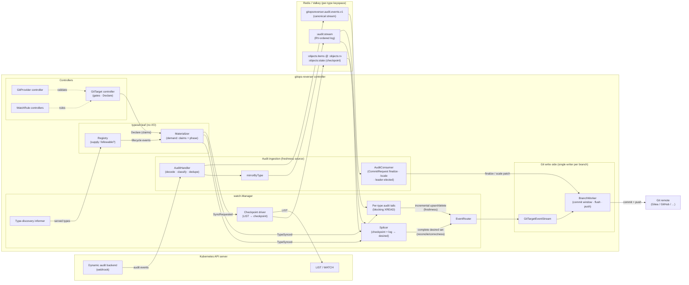
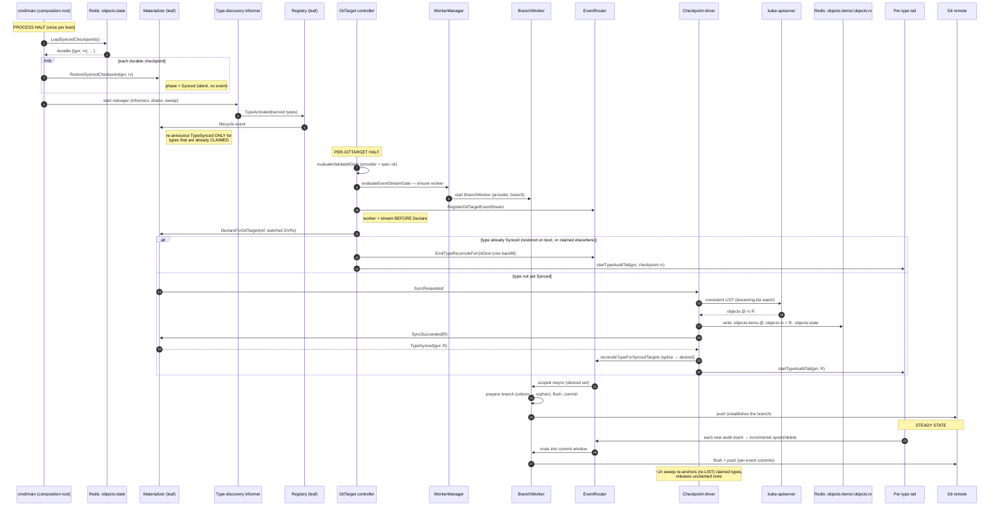

# Architecture & Bootstrap

This document describes the runtime architecture of gitops-reverser as it stands after
the **api-source-of-truth** rework (the "R-series" / great deletion). It is meant as an
orientation map: a high-level diagram of how the pieces fit, a detailed walk-through of the
**bootstrap phase** (cold start → steady state), and a glossary that pins down the words
this codebase uses in very specific ways (*flush*, *snapshot*, *splice*, *reconcile*, …).

Companion design docs (the "why"):

- [`api-source-of-truth-reconcile.md`](./api-source-of-truth-reconcile.md) — the per-type
  checkpoint + audit-log model and the splice.
- [`demand-driven-type-materialization-lifecycle.md`](./demand-driven-type-materialization-lifecycle.md)
  — the demand axis (claims, the materializer phase machine).
- [`audit-log-ingestion-and-ordering.md`](./audit-log-ingestion-and-ordering.md) — how audit
  events become RV-ordered per-type streams.

---

## 1. Mental model in one paragraph

A GitTarget's job is to mirror a set of Kubernetes object types into a Git branch. The
mirror is fed by **two planes that share one Git writer**:

- **Correctness plane** — periodically (and on demand) the controller takes a full
  **checkpoint** (a consistent LIST) of each *wanted* type into Redis, then **splices** that
  checkpoint with the type's audit log to compute the *complete desired set*, and
  **reconciles** it into Git with mark-and-sweep. This is authoritative but coarse-grained.
- **Freshness plane** — every mutating API event is captured by the audit webhook into a
  per-type **audit log** (an RV-ordered Redis stream). A per-type **tail** replays each new
  event as an incremental upsert/delete the instant it lands, so the mirror is fresh between
  checkpoints without re-listing the world.

The user's framing: *"the initial state is the objects materialized at type level (the
checkpoint); after that the events are just replayed in order."*

---

## 2. Definitions

These terms are used precisely throughout the code and the rest of this doc.

| Term | Definition |
|---|---|
| **Type** | A `GroupVersionResource` (e.g. `/v1, configmaps`). Everything below is keyed per type, not per object. |
| **Followable** | The supply verdict from the `typeset.Registry`: the API currently serves this type and we are allowed to mirror it. |
| **Claim / Demand** | A GitTarget asserting (via **Declare**) that it wants a type mirrored. A claim is a self-renewing lease keyed `(GitTargetRef, GVR)`. A type is *materialized* only when **Followable ∩ Claimed**. |
| **Declare** | One GitTarget asserting its **entire** watched-type set to the `typeset.Materializer` in a single idempotent call (`DeclareForGitTarget`). New types are claimed, present ones renewed, omitted ones age out at the next sweep. |
| **Materialization phase** | Where a type sits on the demand axis: `Dormant → Requested → Syncing → Synced ⇄ Resyncing / Failing`. Only a `Synced` type has a serving checkpoint. |
| **Snapshot / Checkpoint** | A point-in-time, **complete** capture of all objects of one type, taken by a consistent LIST and stored in Redis as `:objects:items` pinned at the LIST revision `:objects:rv`. "Checkpoint" and "object snapshot" are the same thing. (Not to be confused with a *snapshot commit* — see below.) |
| **Audit log / per-type stream** | The RV-ordered Redis stream `…:audit:stream` of every mutating event for a type, stream-ID `<resourceVersion>-<subseq>` so it replays in etcd-commit order. The freshness source. |
| **Mirror** (`mirrorByType`) | The webhook step that copies each canonical audit event into its per-type `:audit:stream`. "Mirror" = *write the event into the per-type log*. |
| **Tail** | A long-lived goroutine per (Synced, claimed) type that does a blocking `XREAD` on `:audit:stream` and applies each new entry as an incremental change. The freshness engine. |
| **Splice** (`SpliceType`) | Folding a type's checkpoint (`:objects:items` @ R) with every audit-log entry strictly after R into the *current complete desired set*. The correctness engine's read step. |
| **Reconcile** | A type-scoped **resync**: take the spliced desired set, run mark-and-sweep against the GitTarget's subtree, and commit the difference. Drives the correctness plane. Compare to a per-event apply (freshness). |
| **Sweep** (two meanings) | (a) *mark-and-sweep* — a reconcile deletes managed docs the desired set no longer contains; (b) *the materializer sweep* — the periodic (~1 h) pass that GCs stale claims and re-anchors / releases types. Context disambiguates. |
| **Commit window / open window** | A short time-box in the `BranchWorker` during which incoming events for a branch are **buffered** rather than committed one-by-one, so a burst coalesces into one commit. The buffered, not-yet-committed state is the *open window*. |
| **Flush** | Materializing buffered/pending changes into the on-disk worktree and **creating a commit**: plan the subtree, resolve each event to a single-identity file action, write/delete files, then `git commit`. A flush happens when the commit window goes quiet, or when a finalize (CommitRequest / atomic write) forces it. *Flush = turn buffered intent into a real commit.* |
| **Push** | Sending committed-but-unpushed commits to the Git remote, rate-limited by a push cooldown. Distinct from flush: commits accumulate locally; only a successful push clears the retained queue. |
| **Snapshot commit** | A commit produced by a **reconcile** (the whole desired set), as opposed to a **per-event commit** produced by the freshness tail. They carry different commit-message templates (`CommitMessageSnapshot` vs `CommitMessagePerEvent`). |
| **Canonical stream** | The single cluster-wide audit stream `gitopsreverser.audit.events.v1` the webhook writes first (dedupe + ordering boundary), before fanning out to per-type mirrors. |
| **GitTargetEventStream** | The in-memory per-GitTarget hand-off the `EventRouter` routes events into; a thin pass-through that enqueues onto the GitTarget's `BranchWorker`. |
| **BranchWorker** | The **single writer** for one `(GitProvider, branch)`. Owns the local clone, the commit window, the pending-write queue, commit, and push. The only component that touches Git. |
| **Pending write** | A unit of work queued to a `BranchWorker`: a grouped commit (windowed events), an atomic write (e.g. a CommitRequest finalize), or a scoped **resync** (reconcile/sweep). |

---

## 3. High-level architecture

**Reading the diagram.** Two data paths converge on the `EventRouter → GitTargetEventStream
→ BranchWorker`:

- **Freshness** (`LOG → TAIL → RTR`): per-event, sweep-free upserts/deletes. Fast, never
  deletes an object whose create has not yet landed.
- **Correctness** (`CKPT + LOG → SPL → RTR`): the full spliced desired set, reconciled with
  mark-and-sweep. Authoritative; catches missed deletes/orphans.

The `typeset` leaf (Registry + Materializer) is pure decision logic — no client-go, no Redis
— so it is exhaustively unit-tested. The `watch.Manager` is the only place that performs the
cluster I/O those decisions imply.

---

## 4. The bootstrap phase (cold start → steady state)

"Bootstrap" spans everything from a fresh controller process (or a restart) up to the point
where a GitTarget is serving its types from a live checkpoint + tail. It has a **process
half** (rebuild durable state, start the informers) and a **per-GitTarget half** (gates →
declare → checkpoint → first commit).

### 4.1 Process half — rebuild and arm (steps 1–7)

1. **Compose Redis clients.** `cmd/main` builds the canonical-stream queue, the per-type
   *mirror* queue, a **separate** per-type *tail-reader* client (large pool, isolated so the
   tails' blocking reads never starve mirror writes), the objects-snapshot reader, the
   splicer, and the audit joiner.
2. **Boot-restore (DEC-L6).** `LoadSyncedCheckpoints` reads every durable `:objects:state`
   and `RestoreSyncedCheckpoint` marks each type **Synced @ rv** in the materializer
   *silently* — a restart resumes serving standing checkpoints without re-listing the world.
3. **Start the manager.** This starts the type-discovery informer, the lifecycle/materialization
   drains, the checkpoint driver, and the periodic sweep. It also loads existing
   WatchRules/ClusterWatchRules into the in-memory rule store.
4. **Discovery → followability.** As the discovery informer observes served types it raises
   `TypeActivated` into the Registry (→ Followable) and the Materializer.
5. **Re-announce, gated on demand.** When a restored-**Synced** type is (re)activated, the
   Materializer re-announces `TypeSynced` **only if the type is currently claimed**. An
   unclaimed restored checkpoint has no consumer to wake; waking one would spin up a blocking
   tail for a type nobody follows and exhaust the Redis pool. A claim that arrives later wakes
   it via the Declare path instead — both orderings converge.

### 4.2 Per-GitTarget half — gates → declare → first commit (steps 8–18)

6. **Validated gate.** The GitTarget controller checks the referenced GitProvider is Ready
   and the spec resolves.
7. **Event-stream gate (worker before declare).** It ensures the `BranchWorker` for the
   `(provider, branch)` exists and registers the `GitTargetEventStream` — *before* declaring
   demand, so the very first reconcile/event has a writer to land on.
8. **Declare.** `DeclareForGitTarget` resolves the GitTarget's complete watched-type set and
   asserts it to the Materializer as one lease.
9. **Two openings:**
   - *Type already Synced* (boot-restored, or another GitTarget already materialized it): the
     Declare path drives **one** backfill reconcile for this GitTarget and starts its tail,
     anchored at the existing checkpoint revision. (It does this only for **newly**-claimed
     types — tracked per GitTarget — so a steady-state re-declare does not re-fold the log and
     re-author live changes.)
   - *Type not yet Synced*: the Materializer emits `SyncRequested`; the **checkpoint driver**
     runs a consistent LIST into `:objects:items` pinned at `:objects:rv = R`, records
     `:objects:state`, calls `SyncSucceeded(R)`, and the Materializer emits `TypeSynced(R)`.
10. **On `TypeSynced`** the driver does two things for every GitTarget watching the type:
    - **reconcile** — splice (checkpoint @R + log after R) → complete desired set → scoped
      resync → the worker **flushes a snapshot commit**;
    - **start the tail** — anchored at `R` (`<R>-<maxuint64>`), so any event that landed
      between the LIST and the tail starting is replayed, not missed.
11. **Branch establishment.** The first commit on an **unborn** branch creates the branch as
    an orphan and pushes it, establishing `main`.

### 4.3 Steady state

- **Freshness:** each new audit event is mirrored into `:audit:stream`; the type's tail reads
  it and applies an incremental upsert/delete through the commit window.
- **Correctness:** the ~1 h materializer sweep flags still-claimed Synced types for a
  **re-anchor** (a fresh LIST + checkpoint swap + re-splice reconcile) and **releases**
  no-longer-claimed types (checkpoint dropped, tail stopped). Re-anchoring backstops any event
  the freshness plane dropped.
- **CommitRequest / scale:** the `AuditConsumer` (leader-elected) reads the canonical stream
  and turns a CommitRequest into a **finalize** of the open window, and a `/scale` subresource
  edit into a field-patch.

---

## 5. Why two planes (freshness vs correctness)

A single plane cannot be both fast and safe:

- A pure event replay (freshness) can never be sure it has *every* delete — a missed event
  silently leaves an orphan. It also cannot bootstrap an existing namespace.
- A pure periodic reconcile (correctness) is safe but stale between passes, and re-folding the
  log on every trigger re-attributes live changes to a bulk author.

So the checkpoint + splice + reconcile owns *initial state and orphan/delete correctness*
(coarse, authoritative), and the per-event tail owns *between-checkpoint freshness*
(fine-grained, sweep-free, correctly authored). The checkpoint revision is the seam that ties
them together: the tail resumes exactly where the checkpoint ended.

---

## 6. Component ownership cheat-sheet

| Concern | Owner | Notes |
|---|---|---|
| "Can we follow this type?" | `typeset.Registry` | leaf, no I/O |
| "Who wants it, and is it listed?" | `typeset.Materializer` | leaf; claims + phase machine |
| LIST → checkpoint | `watch` checkpoint driver | the only place that LISTs for materialization |
| Audit event → per-type log | `webhook` `mirrorByType` | inline after canonical enqueue |
| Per-event freshness apply | `watch` audit tail | blocking `XREAD`, own Redis pool |
| Checkpoint + log → desired | `queue` `RedisTypeSplicer` | fail-closed if no checkpoint |
| Route events / scoped resync | `watch.EventRouter` | per GitTarget |
| Commit window, flush, push | `git.BranchWorker` | single writer per branch |
| Gates, Declare, status | `controller` GitTarget reconciler | worker-before-declare |
| CommitRequest finalize, `/scale` | `queue` AuditConsumer | leader-elected |
