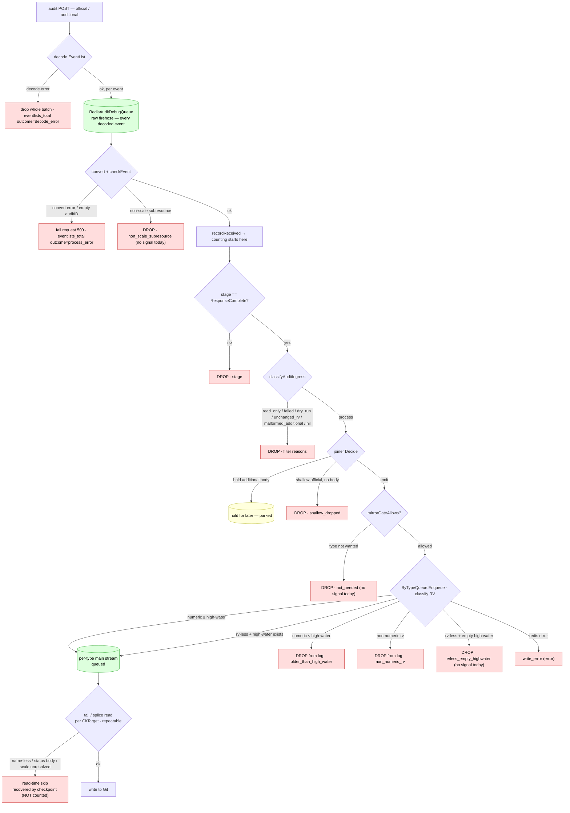

# Audit event outcomes + diagnostic stream — plan

Status: PROPOSAL — 2026-06-18 (supersedes the earlier "diagnostic streams" draft)

## Goal

Every audit event that enters the controller should end in **exactly one named outcome**, and
every outcome should be:

1. **Named** — a single bounded list, not 6 metrics + several silent `return`s scattered across
   4 files.
2. **Grouped** — each outcome is `stored`, `held`, `dropped`, or `error`. The category says, at a
   glance, whether the event reached the log and whether a drop is safe.
3. **Counted** — one counter increments once for every event (success *and* drop), so the totals
   add up to "all events" and we can never again silently drop a class of events (cheap; on in
   prod).
4. **Captured, on demand** — an opt-in, bounded `diag_all` stream holds the full event only while
   investigating (so prod never bloats).
5. **Documented + tested + example-backed** — the table below, a unit test per outcome, and an
   e2e fixture YAML that deterministically triggers each one we can trigger from outside.

This is the "well-engineered piece" target: enough that nothing important is missed, bounded
enough that it doesn't grow without limit. The flaky `late lane must be empty` invariant
(`f67570c`) is fixed as a **byproduct** — its event is correctly a recovered drop, not an `error`.

## What "outcome" means — the boundary (read this first)

An **outcome** is what the webhook→`Enqueue` path did with one audit event, decided and recorded
**once** at that boundary. `queued` means "written to the per-type Redis log" — **not** "written
to Git." The counter answers *"did the event reach the log, and if not, why?"*

**What's counted:** every audit event that was successfully decoded, converted, and validated.
Events that fail those earlier steps — a scheme conversion error or an empty auditID
([audit_handler.go:404/408](../../../internal/webhook/audit_handler.go)) — fail the whole request
and already show up at the request boundary as `audit_eventlists_total{outcome=process_error}`.
They're not in the per-event counter because we never got a usable event to classify.

It deliberately does **not** describe the **Git result**. After an event is `queued`, the per-type
log is read again — by the freshness tail ([`ReadTypeAuditChanges`,
redis_bytype_queue.go:308](../../../internal/queue/redis_bytype_queue.go)) and by the splice/reconcile
fold ([redis_type_splice.go:185](../../../internal/queue/redis_type_splice.go)) — **repeatedly and
once per (GitTarget, GVR)**. Some stored entries are intentionally not turned into Git there
(a name-less deletecollection, a Status-only body, an unresolvable scale). Those are a **separate,
read-time concern**: counting them per event would multi-count the same entry on every replay and
every following GitTarget. They are listed below as **read-time skips**, kept out of the counter,
and shown in `diag_all` + recovered by the checkpoint instead.

## Why "capture earlier" is the wrong axis

Two facts settle it:

- **The earliest raw capture already exists.** `enqueueDebugEvents → RedisAuditDebugQueue`
  ([`audit_handler.go:282`](../../../internal/webhook/audit_handler.go)) writes every decoded
  event *before* any filter/join/gate. Moving `diag_all` earlier just duplicates it.
- **In-process ordering is already serialized.** [`audit_handler.go:318`](../../../internal/webhook/audit_handler.go)
  holds `canonicalMu` for official-source events so concurrent goroutines can't reorder them.
  The `core:secrets` divert that reddened the build is therefore *external* — the apiserver
  delivered batches in an order that didn't match RV order. No amount of earlier capture or
  extra locking closes that; it is inherent to the audit source.

So the gap isn't an earlier stream — it's a **list of named outcomes** at the ingestion boundary.

## The pipeline today

Where events are decoded, dropped (red), held (yellow), or written to a queue/stream (green).
Parenthesised names are the outcomes listed below; `(no signal today)` marks a drop with no
metric or log right now.



(The diagram is today's shape; this plan renames the per-type late lane and folds the scattered
metrics — see below.)

## The outcomes (counted, one per event)

Category meanings: **stored** = in the log; **held** = kept for later; **dropped** = not in the log
(the "Recovered by" column says whether that's safe); **error** = should never happen.
Label values are snake_case (today's code mixes `older-than-high-water` and
`read_only_or_unknown_verb` — the counter picks one style). "Recorded at" is the single owner.

| Outcome | Category | Recorded at | Why | Recovered by | Signal today |
| --- | --- | --- | --- | --- | --- |
| `queued` | stored | `Enqueue` result | written to the type stream (numeric in-order, or RV-less pinned to the high-water) | — | idstate counters |
| `parked` | held | handler (joiner `Decide`) | additional body kept until its official event arrives | re-emitted on match | `AuditJoinParkedTotal` |
| `not_needed` | dropped | handler (`mirrorGateAllows`) | type not claimed ∩ followable (demand gate) — *renamed from gate-not-wanted* | — (see note) | **no signal today** |
| `nil_event` | dropped | handler (`classifyAuditIngress`) | no event | — | `AuditEventsFilteredTotal{reason}` |
| `stage` | dropped | handler (`classifyAuditIngress`) | not ResponseComplete | — | filtered |
| `read_only_or_unknown_verb` | dropped | handler (`classifyAuditIngress`) | get/list/watch don't mutate | — | filtered |
| `failed_request` | dropped | handler (`classifyAuditIngress`) | mutation never reached etcd (resp ≥ 300) | — | filtered |
| `dry_run` | dropped | handler (`classifyAuditIngress`) | not persisted | — | filtered |
| `unchanged_resource_version` | dropped | handler (`classifyAuditIngress`) | no state change | — | filtered |
| `malformed_additional` | dropped | handler (`classifyAuditIngress`) | additional body unusable; official drives | official event | filtered |
| `non_scale_subresource` | dropped | **`prepareAuditEvent` !process branch** (`shouldForwardSubresource`, [audit_handler.go:745](../../../internal/webhook/audit_handler.go)) | only `/scale` is mirrored; status/exec/log/etc. dropped before Redis | — | **no signal today** (dropped post-`received`, pre-filter) |
| `shallow_dropped` | dropped | handler (joiner `dropShallowOfficial`) | identity-shallow official, no body, not deletable | next checkpoint | `AuditShallowDroppedTotal` |
| `rvless_empty_highwater` | dropped | `Enqueue` result (`ingestRVLess`) | RV-less event before any high-water → no-op | next checkpoint | **no signal today** (idstate `rvMissingCount` only) |
| `older_than_high_water` | dropped | `Enqueue` result (`ingestOrdered`) | RV < stream high-water (external batch-delivery reorder) | next checkpoint + `lateNotify` nudge | `AuditLateLaneDivertedTotal{reason}` |
| `non_numeric_rv` | dropped | `Enqueue` result | RV not a uint64 (aggregated apiservers) | next checkpoint | `AuditLateLaneDivertedTotal{reason}` |
| `write_error` | **error** | handler (`Enqueue` err) | redis/enqueue failure — event never reached the log | retry / next checkpoint | logged once (`byTypeMirrorError`) |

> **`not_needed` recovers by nothing, on purpose.** At current demand the type is genuinely not
> wanted, so nothing is *lost*. If a claim later appears, the demand-driven materialization layer
> re-anchors the type from a fresh checkpoint — that's a demand *change* re-reading state, not the
> recovery of a dropped event.

**Why no `merged`.** A merged event is just `queued` that happened to merge an additional body
first — same fate, so it's one `queued`, not a second outcome. (Merge-path health stays visible:
`parked` counts the held bodies and `shallow_dropped == 0` shows the merge path is working; the
merge detail is in `diag_all`.) Dropping it also removes any "did merge or the divert win?"
ambiguity.

**Once per event, by the layer that terminates it.** Pre-queue outcomes are recorded by the
webhook handler — pre-ingress drops at `prepareAuditEvent` (`non_scale_subresource`), and the
filter/join/gate drops in `processEvent`. Queue-side outcomes (`queued` / a divert / `write_error`)
are recorded by the queue inside `Enqueue` (its `ingest*` helpers return the outcome and `Enqueue`
records it once). Each received event hits exactly one of these — official→`queued`, its held
additional→`parked`; two events, two rows. No read-time path records into this counter. (`Enqueue`'s
public signature stays `error`, so the queue's many callers are unaffected.)

## Read-time skips (NOT counted; documented + shown in `diag_all`)

These happen when the tail/splice reads a *stored* log entry to build Git. They are
per-(GitTarget, GVR), **repeatable on every replay**, and recovered by the checkpoint — so they
are documented and shown in `diag_all` on read, but never counted. `pipelineOutcome*`
([audit_event_parsing.go:60](../../../internal/queue/audit_event_parsing.go)) are the existing
"diagnostic strings only" for the scale cases — strings, **not** a metric.

| Skip | Where | Why | Recovered by |
| --- | --- | --- | --- |
| `scale_path_unresolved` | `translateScaleToAssignments` (tail/splice) | parent has no known replica path (CRD/aggregated) | next checkpoint |
| `scale_missing_replicas` | `translateScaleToAssignments` | scale event without `responseObject` replicas | next checkpoint |
| `tail_name_less_collection` | `auditChangeFromEntry` | deletecollection is name-less (DEC-5) | checkpoint sweep |
| `tail_body_not_extractable` | `auditChangeFromEntry` | Status/partial/missing body | next checkpoint |
| `tail_unparseable` | `auditChangeFromEntry` | an entry *we* wrote can't be parsed back | checkpoint; logged |

If we ever want these counted, it must be a **separate** signal with a no-double-count rule
(e.g. recorded only by the coverage-advancing read, keyed on stream-id, never on per-GitTarget
replay) — out of scope for slice 1, precisely to avoid the multi-count.

## Design

### 1. The vocabulary (one enum, one category function)

A new small file (e.g. `internal/audit/outcome`) defines:

```go
type Category string // stored | held | dropped | error
type Outcome string // the snake_case names in the table above, frozen as constants
func (Outcome) Category() Category
```

The category mapping lives in one place, so the table is *code*, not prose. Read-time skips get
string constants too (for `diag_all`), but no `Category()` role.

### 2. The metric — replaces the scattered set

One counter increments once for every counted event, success or drop — so the per-event metrics
are **removed and folded in**:

```
gitopsreverser_audit_events_total{outcome, category, group, version, resource, verb}
```

- `outcome` — the name from the table.
- `category` — `stored`/`held`/`dropped`/`error`. Derivable from `outcome` (adds no extra series);
  carried as a label only so an alert can say `category="error"` without hardcoding outcome names,
  and so a future error outcome is covered automatically.
- `group,version,resource,verb` — the type identity (the Kubernetes API group/version/resource),
  matching the long-standing audit-metric convention. (`category` is a separate label, so there's
  no clash with the API `group`.)

No `source` label: the queue records the queue-side outcomes and does not know the official/
additional source, and keeping `source` would force `Enqueue` to take it as a parameter (rippling
through every caller). Per-request source counts stay on the kept `audit_eventlists_total{source}`.

> Name: `gitopsreverser_audit_events_total` — every audit event by outcome. The `outcome` label
> matches the sibling request-boundary metric `audit_eventlists_total{outcome=…}`. `_total` keeps
> Prometheus convention and doesn't collide with the removed `audit_events_received_total`.

Because it counts `queued` too, `sum(...)` is the total event rate, so the liveness guard becomes
`sum(audit_events_total) > 0` and `audit_events_received_total` folds in as well.

**Removed (folded in):** `audit_events_received_total`, `audit_event_quality_total`,
`audit_join_parked_total`, `audit_join_emitted_total`, `audit_shallow_dropped_total`,
`audit_events_filtered_total`, `audit_late_lane_diverted_total`.
**Kept (request-boundary / timing, not per-event):** `audit_eventlists_total`,
`audit_eventlist_events_total`, `audit_eventlist_duration_seconds`, `audit_join_skew_seconds`,
`audit_official_gate_wait_seconds`. The `pipelineOutcome*` scale strings stay as-is (read-time,
diagnostic only).

### 3. Opt-in capture stream (depth, bounded) — one stream

Off by default. When enabled, a single **global** `diag_all` stream under the key prefix
(`<prefix>:diag_all`, `XADD MAXLEN ~`-bounded) — the simplification over the earlier two-stream
draft: the second `diag_late` stream and its dual-write are gone. `diag_all` holds **two record
kinds**, told apart by a `record_kind` field (so it is *not* "one entry per event"):

- `record_kind=ingestion` — one per event: identity, verb, rv, rv_class, category, outcome, source,
  placement (`resource-version`/`attached-to-last-rv`), assigned stream id, high-water, stage_millis.
- `record_kind=read_skip` — stamped when the tail/splice skips a stored entry; repeatable per
  (GitTarget, GVR) read, by design — the multi-count cases the counter excludes, kept here because
  per-read visibility is exactly what investigation needs.

"diag_late" is now just a documented *view* — `diag_all` filtered to `outcome ∈ {older_than_high_water,
non_numeric_rv}` — not a second stream. The existing raw `RedisAuditDebugQueue` (raw, pre-decision,
per-source) is orthogonal and stays. The divert *decision* (metric + `lateNotify` nudge) stays
always-on; only the *capture* is opt-in.

### 4. Retire the per-type late lane

The always-on per-type `:audit:late` lane (`byTypeAuditLateSuffix`) is **removed**: a diverted
event's lasting record is the always-on counter (`outcome=older_than_high_water|non_numeric_rv`)
plus the `lateNotify` resync nudge; its full payload is in `diag_all` when diag is on. In code,
`placementLateLane`, `divertLate`, `lateReason*`, idstate `lateCount` lose the always-on stream
write and adopt the `diag_all` path. (This drops one per-type key and the unconditional late write
— the main simplification of this revision.)

### 5. e2e invariant — reframed honestly

Replace the flaky `late_lane_diverted_total == 0` with:

- **Hard gate:** `sum(max_over_time(gitopsreverser_audit_events_total{category="error"}[2h])) == 0`.
  Only `write_error` (genuine ingest failure) fails the build.
- **Diagnostic, non-gating:** the `SynchronizedAfterSuite` dumps the full
  `audit_events_total{outcome,category}` breakdown, plus an `XRANGE` of `diag_all` (filtered to the
  divert outcomes and a window around each diverted RV) into the artifacts — so every red/flaky
  run is self-explaining without re-running.
- **Optional regression ceiling:** a generous upper bound on the divert outcomes (not 0) catches a
  change that makes reorder pathological, without failing on the inherent 1–2.
- **Liveness guard:** `sum(audit_events_total) > 0` (was `audit_events_received_total`).

## Testing & documentation matrix (the deliverable)

One row per outcome. `queued` is the happy path, exercised by every existing spec; the rest get a
focused fixture. Read-time skips are unit-tested at the tail/splice parse, not via the counter.

| Outcome | Unit test | e2e example YAML (deterministic) |
| --- | --- | --- |
| `queued` | XADD success / merge sequence | covered by every existing spec |
| `read_only_or_unknown_verb` | feed a `get` event | **unit-only** — the e2e audit policy captures only mutating verbs ([policy.yaml:48](../../../test/e2e/cluster/audit/policy.yaml)); a `get` produces no audit event (add a test-only policy rule if e2e coverage is later wanted) |
| `failed_request` | event w/ responseStatus 4xx | apply a resource that fails admission |
| `dry_run` | event w/ dry-run annotation | `kubectl apply --dry-run=server` |
| `unchanged_resource_version` | equal-RV event | re-apply an identical manifest |
| `not_needed` | gate Allow=false | write a type no GitTarget claims |
| `non_scale_subresource` | `/status` subresource event → !process | update a `/status` subresource |
| `shallow_dropped` | identity-shallow official, no held body | (joiner unit; hard to force in e2e) |
| `parked` | additional-then-official sequence | aggregated-API resource (existing proxy path) |
| `rvless_empty_highwater` | RV-less before any write | system delete racing the first numeric write |
| `older_than_high_water` | **unit only** — XADD rv=N then rv=N-1 | inherently racy; not YAML-deterministic |
| `non_numeric_rv` | event w/ non-uint RV | aggregated-API write |
| `write_error` | `Enqueue` returns redis error | (unit; fault injection) |

Fixtures live under `test/e2e/` beside the existing specs; each asserts the matching
`audit_events_total{outcome=…}` increments. Inherently-racy (`older_than_high_water`) or internal
(`shallow_dropped`, `write_error`, `read_only_or_unknown_verb`) outcomes are proven by unit tests,
and the doc states why they can't be e2e-forced — so the table is honest about coverage.

## Implementation slices

1. **Vocabulary + metric — observability contract change (NOT behaviour-preserving for metrics).**
   Add the `Outcome`/`Category` enum; add `audit_events_total`; the queue's `ingest*` helpers
   return their outcome and `Enqueue` records the queue-side ones; the handler records the
   pre-queue ones (incl. the `non_scale_subresource` and `rvless_empty_highwater` no-signal-today
   drops). **Remove** the folded-in metrics. Migration
   lands in the *same* slice so nothing references a dead metric: the exporter registration + its
   tests, the audit metric unit tests, the e2e queries that named removed metrics
   ([`e2e_suite_test.go:109/114`](../../../test/e2e/e2e_suite_test.go),
   [`controller_basics_e2e_test.go`](../../../test/e2e/controller_basics_e2e_test.go),
   [`aggregated_apiserver_e2e_test.go:226`](../../../test/e2e/aggregated_apiserver_e2e_test.go)),
   and metrics docs. No external dashboards/alerts consume these (pre-release, poc branch).
   *Rejected: dual-publishing old+new* — pre-release metrics, no external consumers, only consumers
   (our tests/docs) migrate atomically here; dual-publish is ceremony that leaves two sources of
   truth.
2. **e2e reframe.** Switch the invariant to `category="error" == 0` + the diagnostic dumps. This is
   what turns the build green honestly.
3. **Opt-in `diag_all` + retire the late lane.** Add the global `diag_all` (with `record_kind`,
   ingestion + read-skip stamping), the `--audit-bytype-diag` (+ `-max-len`) flags and Helm
   `webhook.audit.diagStreams.*`, enable in e2e; remove the per-type `:audit:late` write; expose
   `diag_late` as a documented filter.
4. **Catalog doc + example-YAML fixtures.** Fill the matrix with real fixtures; fold the
   per-outcome rationale into [`audit-log-ingestion-and-ordering.md`](audit-log-ingestion-and-ordering.md)
   as the canonical reference, linking back here.

Slices 1–2 fix the red build; 3–4 reach the documented/tested end state.

## Non-goals / scope

- No change to *when* we drop — only to how outcomes are named, counted, captured, and tested.
  (Making `older_than_high_water` non-fatal is reclassification, not a logic change.)
- **The Git result is out of the counter** — read-time skips are documented and shown in
  `diag_all` (`record_kind=read_skip`), not counted, to keep `audit_events_total` once-per-event.
- Conversion/validation failures are out of the counter by definition — they fail the request and
  show on `audit_eventlists_total{outcome=process_error}`.
- No change to the checkpoint/sweep backstop or the `lateNotify` nudge.
- The raw `RedisAuditDebugQueue` is untouched; `diag_all` is default-off.
- apiserver-side audit-policy filtering (what is sent at all) is "layer 0" context but is
  configuration, out of this code's scope.

## Validation

Go + manifest change → full gate (`task lint`, `task test`, `task test-e2e`, e2e sequential).
With `--audit-bytype-diag` off, runtime behaviour is unchanged except the metric swap and the
retired late-lane write; with it on (e2e), artifacts gain the `diag_all` dumps. Each outcome gets
a unit test; each externally-triggerable one gets an e2e fixture that asserts its
`audit_events_total` label.
