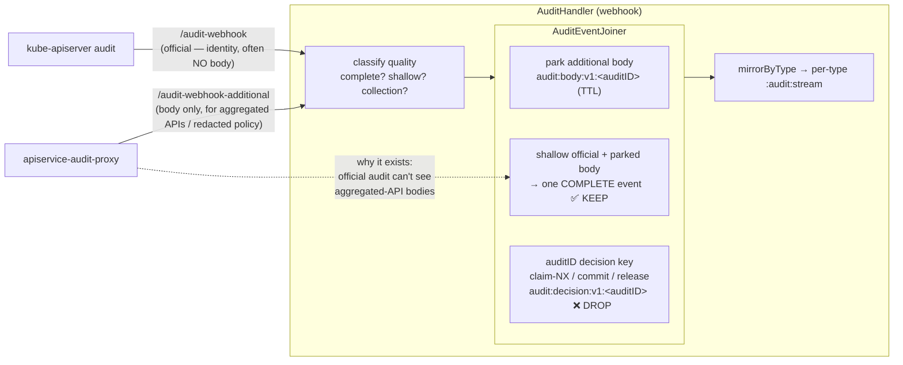
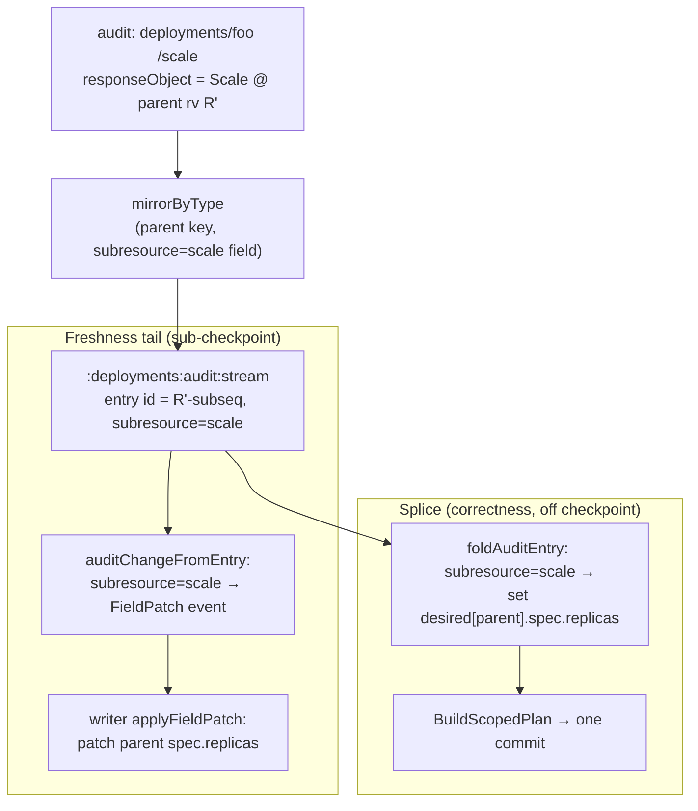

# Retiring the canonical stream: relocating `/scale` and CommitRequest

> Status: **proposed — the design for finishing R3's "single-stream audit fan" kill.** The
> per-type splice (R2) already carries every full-object create/update/delete, so the
> cluster-wide canonical stream `gitopsreverser.audit.events.v1` and its leader-elected
> `AuditConsumer` are down to **two** jobs: the `/scale` subresource field-patch and the
> CommitRequest window finalize. This doc relocates both onto the per-type substrate and then
> deletes the canonical stream + consumer outright. It is the concrete form of the
> [api-source-of-truth-reconcile.md](api-source-of-truth-reconcile.md) §5.1 "Single-stream audit
> fan" demolition row and the "AuditConsumer side-jobs — preserve/relocate" line in
> [current-flows-and-cutover.md](current-flows-and-cutover.md) §4.
> Captured: 2026-06-11 · Owner: Simon
> Related:
> [api-source-of-truth-reconcile.md](api-source-of-truth-reconcile.md) (R2/R3, §5.1 demolition),
> [current-flows-and-cutover.md](current-flows-and-cutover.md) (the dual-path "you are here" map),
> [audit-log-ingestion-and-ordering.md](audit-log-ingestion-and-ordering.md) (the per-type log producer; IR1/§5.4 updated here),
> [architecture-and-bootstrap.md](architecture-and-bootstrap.md) (the runtime map; the `CONS` node + §6 row this retires),
> [../manifest/version2/subresource-scope-reduction.md](../manifest/version2/subresource-scope-reduction.md) (the scale-only subresource scope).

## 1. One paragraph

The canonical stream was the original "audit drives Git" intake: one cluster-wide stream, one
leader-elected consumer that matched rules and routed per-event writes. R2 moved full-object
mirroring to the per-type `:audit:stream` + splice, so the consumer's object path is already a
no-op ([`routeAuditEvent`](../../../internal/queue/redis_audit_consumer.go#L378) returns early when
`Subresource == ""`). What still rides the canonical stream is exactly two things, and both are
"a change that belongs to some other object":

- **`/scale`** is a mutation of a parent (`deployments`) `spec.replicas`. It belongs in the
  parent's per-type stream, in resourceVersion order — **the right place in the audit log** — not
  on a separate cluster-wide hop.
- **CommitRequest create** is a *control signal* ("finalize the window now") whose only hard
  requirement is ordering: every mutation the author made before it must already be in the window.
  That ordering is the parent's `resourceVersion` used as a **cross-type watermark**, not the
  position in a single shared stream.

Relocate scale into the parent stream (a marked field-patch entry, consumed by the existing
freshness tail and splice), drive CommitRequest finalize from its own controller behind an RV
watermark barrier, and the canonical stream has **no consumer left** — delete it, the
`AuditConsumer`, and the consumer-group/leader-election/auto-claim machinery with it.

## 2. Is the canonical stream really vestigial? (the push-back)

Yes — with three things consciously handled. Tracing every current consumer of
`gitopsreverser.audit.events.v1`:

| What the canonical path does today | Still needed? | Where it goes |
|---|---|---|
| Full-object create/update/delete mirroring | **Already gone** — `routeAuditEvent` no-ops top-level objects | per-type `:audit:stream` + splice (R2, landed) |
| `/scale` → parent `spec.replicas` field-patch | yes | **DEC-A** — parent per-type stream |
| CommitRequest create → finalize window + status | yes | **DEC-B** — CommitRequest controller + RV watermark barrier |
| Leader-elected single consumer | only as an HA seam | **DEC-C** — the watch.Manager already owns the per-type tails/driver; HA is one story (R10), not two consumers |
| `XLEN` / consumer-lag metrics on the canonical stream | replaceable | per-type `:audit:idstate` counters (already emitted) |
| **Joiner — body merge** (official-shallow + additional body → complete event) | yes — but orthogonal | **kept** — it is about body *completeness*, not the canonical stream; see §4.1 |
| **Joiner — `auditID` dedupe + "commit decision" anchor** | **no — droppable, the non-obvious win** | **DEC-C / §4.1** — the RV-keyed stream + idempotent splice make duplicate delivery free, exactly like content hashing (R7); delete the decision dance |

The row people conflate with hashing is the last one. The
[`AuditEventJoiner`](../../../internal/webhook/audit_joiner.go) is **two bundled jobs**, and they
have opposite fates (full analysis + diagram + code in **§4.1**):

- **Body merge** is load-bearing and *orthogonal* to this work — it exists because the official
  kube-apiserver audit is often **shallow** (no request/response body, e.g. aggregated APIServices),
  so a supplementary `/audit-webhook-additional` proxy supplies the body, parked in Redis by
  `auditID` and merged into the official event before it is written. The splice needs that body. Keep it.
- The **`auditID` dedupe + commit-decision anchor** (`claim`/`commit`/`release` on
  `audit:decision:v1:<auditID>`) is the part my earlier draft worried about "re-anchoring." It turns
  out we should **delete** it, not re-anchor it: a duplicate delivery now lands in a per-type stream
  at the *same* RV and is absorbed by the idempotent fold + writer no-op detection — the **same
  argument R7 uses to drop content hashing**. So removing the canonical stream lets the dedupe half
  go for free; only the stateless body-merge remains.

## 3. Requirements

| # | Requirement |
|---|---|
| **CR1** | **No canonical stream.** `gitopsreverser.audit.events.v1` and the `AuditConsumer` are deleted, not left dormant. The webhook writes only per-type streams. |
| **CR2** | **`/scale` lands in the parent type's log, in RV order.** A scale of `deployments/foo` is an entry in `…:deployments:audit:stream` at the parent's post-scale resourceVersion — consumed by the same freshness tail and splice as every other parent change. |
| **CR3** | **`/scale` reuses the existing field-patch writer.** No new apply path: the entry resolves to a `git.FieldPatch` event ([`applyFieldPatch`](../../../internal/git/plan_flush.go#L204)) on the freshness side and a `spec.replicas` mutation on the splice side. Only the *source* of the field-patch changes. |
| **CR4** | **CommitRequest finalize preserves the ordering guarantee** that every mutation made before the CommitRequest is included in the finalized commit — now via the CommitRequest's `resourceVersion` as a cross-type watermark, not single-stream position. |
| **CR5** | **CommitRequest leaves the audit pipeline.** It is a control object, never mirrored, never checkpointed; its finalize is driven by its own controller, not by a stream consumer. |
| **CR6** | **Body completeness survives; the dedupe goes.** The official↔additional body merge keeps working; the `auditID` decision/dedupe dance is deleted because the RV-keyed stream absorbs duplicates (same basis as R7). |
| **CR7** | **Subtractive.** The net diff is red: the consumer, its CommitRequest handler, the canonical queue/metrics, and the scale routing on the consumer all go. |

## 4. Decisions

### DEC-A — `/scale` becomes a marked field-patch entry in the **parent** stream *(CR2, CR3)*

**Chosen.** Today a scale event folds onto a *sibling* key (`deployments.scale:audit:stream`,
[`typeBaseKey`](../../../internal/queue/redis_bytype_queue.go#L573)) that nothing in the R2 path
reads — so when R3 deletes the consumer, scale freshness would vanish until the next checkpoint
LIST happens to re-LIST the parent with its new replicas. Instead, mirror the scale event into the
**parent** type's stream, keyed at the parent's post-scale `resourceVersion` (the `Scale`
responseObject carries it), retaining `subresource=scale` as the discriminator field already
present in [`entryValues`](../../../internal/queue/redis_bytype_queue.go#L511). It then orders
naturally among the parent's other writes (a scale always bumps the parent RV above its prior
value) and both per-type consumers learn one new entry kind:

- **Freshness tail** ([`auditChangeFromEntry`](../../../internal/queue/redis_bytype_queue.go#L289)):
  today it *skips* `subresource != ""`. Change it so `subresource == "scale"` is translated —
  via the existing [`translateScaleToAssignments`](../../../internal/queue/subresource_translate.go#L47)
  + `buildFieldPatchEvent` — into a `git.FieldPatch` `git.Event` (no `Path`; the tail stamps it per
  GitTarget, exactly as for object events). The writer's `applyFieldPatch` does the rest. **This is
  the same field-patch the `AuditConsumer` built; only the source stream changes.**
- **Splice fold** ([`foldAuditEntry`](../../../internal/queue/redis_type_splice.go#L137)): today it
  *skips* `subresource != ""`. Change it so `subresource == "scale"` mutates `spec.replicas` on the
  existing `desired[identity]` (the parent object from the checkpoint or an earlier log entry) at
  the known [`BuiltinScaleReplicasPath`](../../../internal/auditutil/subresource_policy.go#L51). If
  the parent is not in `desired` yet, skip (the next checkpoint backstops it, DEC-5). **The splice
  must fold scale, or a correctness reconcile would revert replicas to the checkpoint value and
  flip-flop against the freshness tail** — see §5.

*Translate at consume time, not in the webhook.* The producer stays a pure capture layer (IR8) —
it only routes the scale event onto the parent key. The scale→replicas interpretation
(`BuiltinScaleReplicasPath`, reading `spec.replicas`) lives where the field-patch machinery and
GVR knowledge already are (the consumer side), so the webhook never imports `manifestedit`. A scale
on a CRD/aggregated parent with no known replica path is dropped at translation, unchanged.

*Doc impact:* this revises [audit-log-ingestion-and-ordering.md](audit-log-ingestion-and-ordering.md)
**IR1/§5.4** for `/scale` specifically — scale no longer keys onto its own `…scale` segment; it is a
parent-stream entry tagged `subresource=scale`. (Other subresources never reach Redis —
[`shouldForwardSubresource`](../../../internal/webhook/audit_handler.go#L697) drops them — so scale
is the only subresource the change touches.)

### DEC-B — CommitRequest finalize = controller-driven, behind an RV watermark barrier *(CR4, CR5)*

**Chosen.** The [`CommitRequestReconciler`](../../../internal/controller/commitrequest_controller.go)
already watches the CRD and today only stamps `WaitingForAuditEvent`, deliberately leaving the
finalize to the audit consumer "so it runs after the author's earlier mutations." That rationale was
**single-stream total order**. Sharded per type, the equivalent is the CommitRequest's own
`resourceVersion` (`rv_C`) as a **global etcd-revision watermark**: every mutation the author made
before creating it has `RV < rv_C` (they committed earlier), and the per-type streams are RV-keyed,
so "before the CommitRequest" is a precise, cross-type test.

So move the finalize *into the controller* and delete the consumer's CommitRequest path entirely:

1. On the **first** reconcile (`phase == ""`), capture `rv_C = commitRequest.ResourceVersion`
   (the create revision — captured before the status stamp, which would bump it) and stamp
   `WaitingForAuditEvent` as today.
2. Drive a **watermark finalize** for the referenced GitTarget `G`: for each of `G`'s claimed type
   tails, wait until the tail has *applied* (enqueued onto `G`'s BranchWorker) every entry with
   stream-ID `< rv_C` — i.e. drain `G`'s tails to the watermark. Because the BranchWorker is a
   single FIFO writer, enqueuing the finalize *after* those upserts guarantees the commit contains
   them (§6).
3. Enqueue the existing `FinalizeSignal`
   ([`FinalizeGitTargetWindow`](../../../internal/watch/event_router.go#L123) → the worker's
   finalize path) and write the terminal phase with the unchanged
   [`applyFinalizeResultToStatus`](../../../internal/queue/commit_request.go#L214).

The controller gets native requeue/retry, status conflict handling, and leader election for free —
all of which the consumer hand-rolled. The audit pipeline no longer knows CommitRequest exists.

*Why controller-driven and not "a CommitRequest entry in its own per-type stream"?* Both need the
same RV barrier, but the stream variant re-derives the object (and `rv_C`) the controller already
holds, and re-implements retry/leader-election the controller already has. The barrier — not the
trigger's location — is the load-bearing part. See §7 for the "typed handler" generalization, which
the barrier makes optional rather than necessary.

### DEC-C — delete the canonical Queue + AuditConsumer; re-anchor the Joiner *(CR1, CR6, CR7)*

**Chosen.** With DEC-A and DEC-B landed the canonical stream has no reader. Then:

- `cmd/main` stops constructing the canonical `Queue`
  ([`NewRedisAuditQueue`](../../../internal/queue/redis_audit_queue.go)), the `AuditConsumer`
  ([main.go:376](../../../cmd/main.go#L376)), and the canonical-stream metrics reporter; the
  `--audit-redis-stream` / decision-TTL-for-canonical flags retire.
- [`enqueueCanonicalEvent`](../../../internal/webhook/audit_handler.go#L495) collapses to
  `mirrorByType`. The webhook path becomes **decode → quality-classify → body-merge → mirror per-type**.
- **Drop the join decision dance, don't re-anchor it (§4.1).** Delete `claimDecision` /
  `CommitDecision` / `ReleaseDecision` and the `audit:decision:v1:<auditID>` key; the Joiner keeps
  only the stateless body machinery (`parkBody` / `peekBody` / `waitForBody` / `mergeParkedBody`). A
  duplicate official is no longer suppressed here — it re-mirrors at the same RV stream-ID and the
  idempotent fold + writer no-op detection absorb it (R7's argument). This *removes* the
  durable-accept subtlety that the canonical enqueue used to carry, rather than relocating it.
- Delete `redis_audit_consumer.go`, `commit_request.go`'s consumer methods, and the consumer's
  scale routing; keep `translateScaleToAssignments` + `buildFieldPatchEvent` (moved to
  `subresource_translate.go`) for DEC-A, and keep `extractObject`/`resolveUserInfo`/`parseAuditEvent`
  (already shared by the splice and tail).

### 4.1 — The Joiner: keep the merge, drop the dedupe

The Joiner is the part of the webhook that is *not* about Git at all — it makes one **complete**
audit event out of a possibly-shallow official event plus a body supplied by a second source. Its
shape today:



**Where the commit-decision anchor lives.** The handler runs the join, then today writes the
canonical stream, then *commits* the decision:

```go
// internal/webhook/audit_handler.go — today
if err := h.enqueueCanonicalEvent(ctx, eventToWrite, auditEvent, joinDecision); err != nil {
    return err // enqueueCanonicalEvent: Queue.Enqueue(canonical)  THEN  h.mirrorByType(...)
}
if err := h.commitJoinDecision(ctx, joinDecision); err != nil { // promote claim → "emitted"
    return err
}
```

```go
// internal/webhook/audit_joiner.go — the dedupe state machine
func (j *RedisAuditEventJoiner) claimDecision(ctx, auditID) (bool, error) { // SET NX → first writer wins
    ... SetArgs{Mode: "NX", TTL: j.decisionTTL} ...
}
func (j *RedisAuditEventJoiner) CommitDecision(ctx, auditID, result) error { // state="emitted"
    ... j.client.Set(ctx, decisionKey(auditID), payload, j.decisionTTL) ...
}
func (j *RedisAuditEventJoiner) ReleaseDecision(ctx, auditID) error { // undo claim on enqueue failure
    ... j.client.Del(ctx, decisionKey(auditID)) ...
}
```

That `decisionKey` machinery is a **distributed exactly-once gate**: it guarantees a given `auditID`
is written to the *single* canonical stream once, even across retries and the two sources. It is the
`auditID` analogue of the content hash — and it dies for the same reason:

- A duplicate official (webhook retry) without the gate now re-runs `mirrorByType`, which does
  `XADD <rv>-* …` into the per-type stream. The duplicate carries the **same object RV**, so it
  lands at the same RV (a fresh sub-sequence) — never the late lane (equal RV ≠ "strictly older").
- The **splice** folds last-writer-wins by position: two entries for the same identity at the same RV
  decode to the same object → identical `desired`. The **freshness tail** upserts it twice → the
  second is an `EditNoChange` at the commit boundary. So a duplicate costs one redundant stream
  entry and **zero** Git effect — precisely the "no-op write amplification" the ingestion doc already
  measured as benign ([audit-log-ingestion-and-ordering.md](audit-log-ingestion-and-ordering.md) §8.2).

So **drop** `claim`/`commit`/`release` and the decision key entirely. The Joiner reduces to:

```text
additional source → parkBody(auditID, body, TTL)
official source   → if shallow: peekBody / waitForBody(auditID); merge; emit   (else emit as-is)
emit              → mirrorByType   (no decision key, no NX, no commit/release)
```

The only things lost are diagnostics (`AuditJoinDuplicateDroppedTotal`, `AuditJoinBodyLateTotal`) —
replaceable by the per-type `idstate` counters — and the micro-optimisation of *not* parking a body
whose official already emitted (now it just parks and expires by TTL: correct, slightly more Redis
writes). A late additional body with no official to meet simply ages out, as it effectively does today.

**Could we drop the whole Joiner, body-merge included?** Only by changing the **deployment
contract**: if every watched type's audit is guaranteed to carry full request/response bodies
(apiserver audit at `RequestResponse` level, and no aggregated APIServices needing the proxy), then
every official is `Complete`, `mergeParkedBody` is never exercised, and the second webhook +
park/merge can go too. That is a real capability decision (it drops aggregated-API and
redacted-policy support), **orthogonal** to retiring the canonical stream — so it is an open question
(§9), not part of this cut. This cut keeps the merge and deletes only the dedupe.

## 5. The `/scale` relocation, specified



Why the splice **must** fold scale (not just the tail): a correctness reconcile rebuilds `desired`
from `checkpoint@R + log-after-R`. A scale that happened *after* R is only in the log. If the fold
ignored it, `desired[parent].spec.replicas` would be the checkpoint value (replicas@R), the planner
would re-render the parent and **revert** the live scale, and the freshness tail — which has no new
event to replay — would not correct it until the next checkpoint. Folding the scale entry makes the
splice's desired set agree with what the tail already wrote. Edge cases (`Scale` body missing an RV,
or the parent absent from `desired`) degrade to freshness-best-effort and are backstopped by the
next checkpoint LIST, exactly like RV-less events (DEC-5).

## 6. The CommitRequest watermark barrier, specified

```mermaid
sequenceDiagram
    autonumber
    participant Author
    participant API as kube-apiserver
    participant WH as audit webhook
    participant Streams as per-type :audit:stream (×N)
    participant Tails as G's per-type tails
    participant BW as G's BranchWorker (FIFO)
    participant CRC as CommitRequestReconciler

    Author->>API: PUT cm/a (rv 101), PUT deploy/b (rv 102)
    API-->>WH: audit(101), audit(102)
    WH-->>Streams: mirror cm@101, deploy@102
    Author->>API: CREATE CommitRequest (rv_C = 105)
    API-->>CRC: watch event (phase=="")
    CRC->>CRC: capture rv_C=105; stamp WaitingForAuditEvent
    Streams-->>Tails: deliver 101,102
    Tails->>BW: enqueue upserts cm/a, deploy/b
    CRC->>Tails: BARRIER: wait each G-tail applied past rv_C (105)
    Note over Tails: cursor ≥ 105, OR stream high-water < 105 and cursor caught up
    CRC->>BW: EnqueueFinalize (after the upserts, FIFO)
    BW->>BW: flush open window → one commit (contains a, b)
    CRC->>API: write terminal status (Committed/NoOpenWindow/Failed)
```

**The barrier condition, per claimed type `T` of `G`:** the tail has consumed all entries with
stream-ID `< rv_C`. Equivalently, wait until `cursor_T ≥ min(rv_C, highWater_T-at-observation)`:

- `cursor_T ≥ rv_C` → the tail has read at/past the watermark; all pre-C entries of `T` are applied.
- `highWater_T < rv_C` → `T` has no entry as new as the CommitRequest; wait only for the tail to
  drain to that high-water (nothing pre-C is left unread once it does).

Because each tail applies in RV order and enqueues onto `G`'s single FIFO BranchWorker, satisfying
the barrier for every claimed type means **all pre-C upserts are already queued ahead of the
finalize** — so the flushed commit contains them. Implementation: each per-type tail exposes its
last-applied stream-ID (a cursor read); a small drain-coordinator the reconciler calls blocks on the
condition above across `G`'s claimed types (from the watched-type table), with a bounded timeout
that falls back to a plain finalize (degrade to "commit what's there," never hang a reconcile).

**Residual race — honestly, the same one we have today.** The barrier guarantees every pre-C
mutation *already delivered to its stream* is applied. It cannot include a pre-C mutation whose
audit event is still in flight (webhook hasn't mirrored it) or arrived out of order into the **late
lane** (measured ~3.2%, [audit-log-ingestion-and-ordering.md](audit-log-ingestion-and-ordering.md)
§7). The **current** canonical design has the identical gap — it relies on "by the time the
CommitRequest's audit event is processed, the earlier events were processed," which is itself a
delivery-order assumption. We do not make it worse and we do not pretend to close it: the next
checkpoint sweep is the correctness backstop (a missed mutation is caught at re-anchor, attributed
to the bulk author rather than the user — a known, accepted limitation, R11/DEC-5). A short
quiescence on `G`'s streams past `rv_C` (reusing the tail's existing burst-settle) is the pragmatic
narrower if measurement ever shows it matters; it is **not** in the first cut.

## 7. The generalization (optional, not required)

DEC-B can be read as one instance of a **typed per-type-stream handler**: the default handler is the
splice/freshness reconcile (mirror to Git); a *control type* binds a different handler. CommitRequest
would be "the control type whose handler is finalize-at-watermark." This is an attractive symmetry —
"every signal is a typed stream entry, dispatched by type" — and it is where the architecture could
go if more control verbs appear (e.g. a future "atomic write" or "tag" request).

We are **not** building the registry now, because the watermark barrier (§6) is the actual hard
part and is identical whether the trigger is a stream entry or a controller watch — and the
controller watch is strictly less code (it already has the object, `rv_C`, retries, and leader
election). The barrier is the reusable primitive; expose it as
`FinalizeAtWatermark(gitTarget, rv)` on the EventRouter/BranchWorker seam so that if the typed-handler
model is wanted later, the control handler just calls the same primitive. Build the abstraction when a
second control type asks for it, not before (matches the "simplify, don't just add" stance).

## 8. Implementation stages (subtractive, each ends green)

Order is forced by one rule: **a relocation lands and is proven before the canonical path it
replaces is deleted** (the same discipline R2→R3 used).

| Stage | Change | Done when |
|---|---|---|
| **C-A1** ✅ *(landed 2026-06-11)* | Producer: route `/scale` onto the parent key, keep `subresource=scale` field (revise IR1/§5.4). | scale events appear in the parent `:audit:stream` at the parent RV; the `…scale` sibling stream is gone. |
| **C-A2** ✅ *(landed 2026-06-11)* | Consumers: `auditChangeFromEntry` (tail) and `foldAuditEntry` (splice — via `foldScaleEntry`) handle `subresource=scale`; `translateScaleToAssignments` already lived in `subresource_translate.go`. The consumer's scale routing was deleted outright (routeAuditEvent/routeScaleFieldPatch/routeEvents/routeOne/buildFieldPatchEvent + the pipeline metrics they alone emitted) rather than left disabled — less to demolish in C-C. | a scale is reflected in Git via the freshness tail within a window **and** survives a correctness reconcile (no replicas flip-flop); e2e for `/scale` green with the consumer's scale path disabled. |
| **C-B1** ✅ *(landed 2026-06-11)* | Add the watermark drain-coordinator (per-tail cursor + `FinalizeAtWatermark`). Implemented: each tail records its last-APPLIED stream ID (anchor at start, advanced only after a batch's apply returns); `Manager.DrainTailsToWatermark` polls the §6 condition per watched type (cursor ≥ rv, or high-water < rv and drained — via the optional `TypeAuditHighWater` capability on the by-type queue); `EventRouter.FinalizeAtWatermark(…, rv)` = drain (bounded by the decided 15 s `FinalizeBarrierTimeout`) + finalize, returning `barrierReached` for the Option-A status degrade. Types with no running tail are skipped (no freshness path to wait on; checkpoint backstops). | a barrier unit test proves "finalize includes all pre-`rv_C` upserts across types." |
| **C-B2** | Move finalize into `CommitRequestReconciler` (capture `rv_C`, barrier, finalize, status); delete the consumer's `isCommitRequestCreate`/`handleCommitRequest`. | the CommitRequest e2e is green driven entirely by the controller; the consumer no longer references CommitRequest. |
| **C-C** | Delete the canonical `Queue`, `AuditConsumer`, canonical metrics, and flags; delete the Joiner's `claim`/`commit`/`release` + decision key (§4.1), keeping only `parkBody`/`waitForBody`/`mergeParkedBody`; webhook = decode→classify→merge→mirror. | nothing constructs or reads `gitopsreverser.audit.events.v1`; no `audit:decision:v1:*` keys; a duplicate-delivery test shows zero extra commits; full suite + e2e green; the diff is mostly red. |

## 9. Open questions

- **Barrier timeout shape.** The fallback bound for "a tail never reaches `rv_C`" (a wobbly/removed
  type that `G` still claims). Proposal: a per-finalize deadline that degrades to a plain finalize +
  a recorded metric, never a hang. **Decision memo with options/consequences:**
  [commitrequest-barrier-timeout-decision.md](commitrequest-barrier-timeout-decision.md).
- **Drop the dual-source body merge entirely? (§4.1).** If we can mandate full-body audit
  (`RequestResponse` policy) and declare aggregated-API mirroring out of scope, the whole Joiner +
  `/audit-webhook-additional` proxy can go, not just the dedupe half. This is a deployment-contract
  decision, deliberately separate from canonical-stream removal. Until then: keep the merge, drop the
  dedupe.
- **Duplicate absorption proof.** Add the explicit test that a doubly-delivered `auditID` (same RV)
  yields exactly one Git effect through both the splice and the freshness tail — the evidence that
  retiring the decision key is safe (the R7 analogue measurement).
- **HA (R10, deferred).** The canonical consumer was the one leader-elected audit reader; the
  per-type tails + driver run under the watch.Manager. Multi-replica fan-out and per-type cursor
  ownership stay in [ha-improvements.md](ha-improvements.md); this change must not preclude them,
  and the controller-driven finalize already rides controller-runtime leader election.
