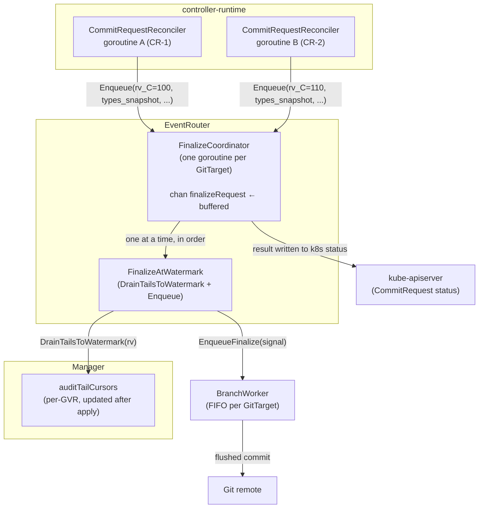
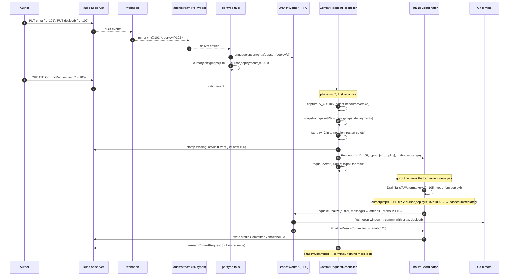
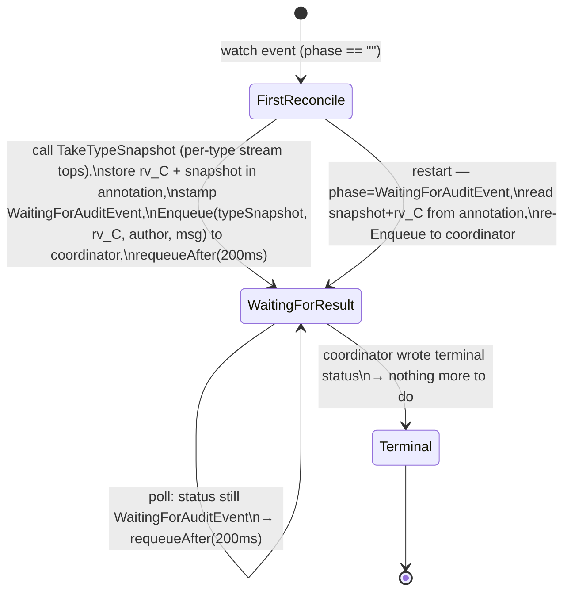

# C-B2: per-GitTarget finalize coordinator (Option A design)

> Status: **design — proposed before C-B2 implementation**
> Context: [canonical-stream-retirement.md](canonical-stream-retirement.md) §8 C-B2 row
> + the multi-CommitRequest ordering hazard raised 2026-06-11

## 1. The problem the design must solve

The planned C-B2 puts finalize logic into the `CommitRequestReconciler`. The immediate
question is: **what happens when two CommitRequests for the same GitTarget exist at the
same time?**

The root cause is that controller-runtime reconciles independent objects concurrently.
Two reconcile goroutines — one for CR-1 (rv=100), one for CR-2 (rv=110) — can both
pass their watermark barrier and then race to call `FinalizeGitTargetWindow`. The
BranchWorker's FIFO determines ordering; whichever goroutine enqueues first wins. If
CR-2 wins the race:

```
BranchWorker FIFO (wrong order):
  [upserts@<100] [upserts@100-110] [finalize_CR2] [finalize_CR1]
                  ← CR-2's barrier             ←  CR-1's barrier, loses race
```

Result: **one commit attributing everything to CR-2**, then CR-1 gets `NoOpenWindow`.
The author who created CR-1 first gets no commit, even though every mutation was
present. The correctness guarantee from §6 of the retirement doc is violated.

**The invariant that must hold:**
> For any two CommitRequests CR-i and CR-j targeting the same GitTarget where
> `rv_i < rv_j`, the sequence `barrier(CR-i) → enqueue(finalize_i)` must complete
> **before** `barrier(CR-j) → enqueue(finalize_j)` begins.

---

## 2. Solution: per-GitTarget FinalizeCoordinator

A single goroutine per active GitTarget owns the (barrier → finalize-enqueue) pair.
CommitRequest reconcilers hand off their work via a **buffered channel** and poll for
the result. The goroutine serializes naturally: it processes one finalize request at a
time, in FIFO order. Because it is the only one calling `FinalizeGitTargetWindow` for
its GitTarget, the invariant above holds by construction.



---

## 3. What a finalizeRequest carries

The request is assembled by the reconciler at the moment it first sees the
CommitRequest (`phase == ""`), **before** the status stamp bumps the object's
ResourceVersion:

```go
type finalizeRequest struct {
    // typeSnapshot maps each claimed GVR to the current top of its stream,
    // read via TakeTypeSnapshot at CR creation time. This is the per-type
    // watermark the barrier will wait on — one independent comparison per type,
    // no cross-type RV ordering assumed (see §4).
    typeSnapshot map[schema.GroupVersionResource]string

    // rv_C is the CommitRequest's create ResourceVersion, stored only for the
    // restart-safety annotation (see §8). It is NOT used as a barrier watermark.
    rv_C string

    // commit identity
    author  string
    message string

    // crRef identifies the CommitRequest to write status back to.
    crNamespace string
    crName      string
    crUID       types.UID // guards against delete+recreate between enqueue and writeback
}
```

### Why per-type watermarks, not a single rv_C?

Kubernetes only guarantees ResourceVersion monotonicity **within a single resource
type**. In practice, core types all share the same etcd global counter, but:

1. Aggregated-API types (served by a separate APIService) have RVs in an entirely
   different counter. A CRD type might have entries at rv `8, 9, 10` while the
   CommitRequest has rv `200` (core etcd). Comparing `cursor_T` (agg RV=10) against
   `rv_C` (core RV=200) gives 10 < 200 — the barrier would stall until the 15 s
   timeout.

2. Even for core types, a type claimed **after** rv_C (say at checkpoint rv=150) gets
   its tail cursor anchored at `"150-maxuint64"`. If rv_C=100, the barrier would wait
   for that cursor to reach 100, which it has already passed — but could also stall if
   the tail hasn't started yet.

The per-type snapshot avoids both problems: for each type T the GitTarget was already
watching when the CR was created, record the current top of T's stream. The barrier
waits until `cursor_T >= snapshot[T]` — a comparison within T's own RV space.
Correctness argument: any mutation the author made to type T before creating the CR
was already in T's stream when the snapshot was taken, so `snapshot[T] >= rv(mutation)`,
and the barrier guarantees the tail consumed it.

**The snapshot is built by `EventRouter.TakeTypeSnapshot(ctx, gitTargetName, ns)`**
which calls `Manager.TakeTypeSnapshot` → `TypeAuditHighWater` (per claimed type via the
`auditHighWaterReader` optional capability on the reader). The barrier
(`DrainTailsToSnapshot`) then polls only the in-memory cursor map — no Redis calls
during the wait loop.

---

## 4. Full sequence: single CommitRequest



---

## 5. Full sequence: two concurrent CommitRequests

This is the critical scenario. Both CRs target the same GitTarget.

```mermaid
sequenceDiagram
    autonumber
    participant CRC1 as Reconciler (CR-1, rv=100)
    participant CRC2 as Reconciler (CR-2, rv=110)
    participant FC as FinalizeCoordinator\n(single goroutine)
    participant Tails
    participant BW as BranchWorker (FIFO)

    CRC1->>FC: Enqueue({rv_C=100, types, author1, msg1})
    CRC2->>FC: Enqueue({rv_C=110, types, author2, msg2})
    Note over FC: channel is FIFO; CR-1 was enqueued first

    Note over FC: START processing CR-1
    FC->>Tails: DrainTailsToWatermark(rv_C=100)
    Tails-->>FC: cursor[cm]=101≥100 ✓, cursor[deploy]=102≥100 ✓ → pass
    FC->>BW: EnqueueFinalize(author1, msg1, rv_C=100)
    BW->>BW: flush window → commit-1 (cm/a, deploy/b at rv<100)
    BW-->>FC: Committed, sha=aaa
    FC->>API: write CR-1 status = Committed

    Note over FC: START processing CR-2 (only now)
    FC->>Tails: DrainTailsToWatermark(rv_C=110)
    Note over Tails: tails continue delivering entries 100-110 while FC waited
    Tails-->>FC: cursor[cm]=108≥110? maybe not yet → FC waits
    Tails->>BW: enqueue more upserts (changes 100-110)
    Tails-->>FC: cursor[cm]=111≥110 ✓ → pass
    FC->>BW: EnqueueFinalize(author2, msg2)
    BW->>BW: flush window → commit-2 (changes between commit-1 and now)
    BW-->>FC: Committed, sha=bbb
    FC->>API: write CR-2 status = Committed
```

The coordinator is the single point that prevents the race: CR-2's barrier cannot
start until CR-1's barrier + enqueue is complete. The BranchWorker FIFO then
naturally holds `[upserts@<100] [finalize_1] [upserts@100-110] [finalize_2]`.

---

## 6. Reconciler state machine



The reconciler itself **never blocks** for more than a single API call. All blocking
(the ≤15 s barrier wait) happens in the coordinator goroutine, which calls
`DrainTailsToSnapshot` — a pure in-memory poll of cursor values, no Redis calls during
the wait loop.

---

## 7. Coordinator lifecycle

| Event | Action |
|---|---|
| First `Enqueue` call for a GitTarget | Start coordinator goroutine, create buffered channel (capacity=8) |
| GitTarget deleted (`UnregisterGitTargetEventStream`) | Close channel → goroutine exits after draining |
| Process restart | All coordinators are gone. Reconciler re-fires for each WaitingForAuditEvent CR and re-enqueues (rv_C re-read from annotation). |
| A CR is deleted before coordinator processes it | Coordinator reads the CR before writing status; `IsNotFound` → skip. |
| UID mismatch (delete + recreate with same name) | Coordinator guards with `crUID` check before writing status → skip stale result. |

---

## 8. Restart safety: persisting the snapshot across pod restarts

**The problem:** The reconciler calls `TakeTypeSnapshot` and captures
`rv_C = commitRequest.ResourceVersion` on the first reconcile, *before* stamping
status. Once it stamps `WaitingForAuditEvent`, the object's `ResourceVersion` changes
(to e.g. 106). If the pod restarts, the reconciler sees `phase=WaitingForAuditEvent`
but both `rv_C` and the snapshot are gone.

**Solution: store rv_C and snapshot in an annotation before the status stamp.**

```
Annotation key: configbutler.ai/finalize-snapshot
Value:          JSON: {"rv":"105","snapshot":{"":"secrets:101","apps":"deployments:50"}}
```

Reconciler on restart:
```
if phase == WaitingForAuditEvent:
    rv_C, snapshot = parseAnnotation("configbutler.ai/finalize-snapshot")
    if annotation missing: call TakeTypeSnapshot again (stale, waits for a bit more but safe)
    re-Enqueue(snapshot, rv_C, ...) to coordinator
```

**On restart without the annotation** (annotation somehow lost): the reconciler calls
`TakeTypeSnapshot` again. The new snapshot will have stream tops at the restart time,
which are ≥ the original snapshot values — the barrier waits for a superset of what the
original snapshot required. This is safe (correct, slightly more conservative) and
bounded by the 15 s timeout.

**Why an annotation and not a status field?** Adding a status field requires a CRD
schema change and regeneration. An annotation is a metadata write that can be applied
in the same `Patch` as the status stamp — no schema bump needed.

**Order of operations on first reconcile:**

```
1. TakeTypeSnapshot → snapshot (one Redis call per claimed type)
2. Patch: set annotation with rv_C + snapshot   (metadata write)
3. Status().Update: phase = WaitingForAuditEvent (status write)
4. Enqueue(snapshot, rv_C, author, message) to coordinator
5. requeueAfter(200ms)
```

If the pod dies between steps 2 and 3: on restart, annotation is present but phase is
still `""` → first-reconcile path, reads annotation to avoid a second `TakeTypeSnapshot`.

If the pod dies between steps 3 and 4: on restart, phase=WaitingForAuditEvent, reads
annotation, re-enqueues. The coordinator is idempotent for the same CR+UID.

---

## 9. Where does the coordinator live?

**`EventRouter`** — it already owns:
- `WatchManager` (→ `DrainTailsToWatermark`)
- `WorkerManager` (→ `FinalizeGitTargetWindow`)
- `Client` (→ status writeback)
- `gitTargetStreams` map with the same per-GitTarget keying pattern

It adds a `finalizeCoordinators map[types.ResourceReference]chan finalizeRequest` with
the same mutex discipline. The coordinator goroutine calls
`r.FinalizeAtWatermark(...)` (already implemented, C-B1) and then writes status
directly using `r.Client`.

The `CommitRequestReconciler` gets an `EventRouter` reference (it already has none
today; it would be wired in `cmd/main.go` where the reconciler is registered).

---

## 10. What changes in the audit consumer

After C-B2 lands:

- `isCommitRequestCreate` — **deleted**
- `handleCommitRequest` / `writeCommitRequestStatus` — **deleted**
- `applyFinalizeResultToStatus` — **moved** to `internal/watch/` (or kept in
  `internal/queue/` and imported by the coordinator)

The consumer's only remaining job before C-C is: route `AuditConsumer.routeAuditEvent`
— which today already returns early for everything except scale (already deleted in
C-A2). After C-B2 it returns early for everything. C-C then deletes the file entirely.

---

## 11. Open questions before implementation

| # | Question | Impact |
|---|---|---|
| Q1 | Should the coordinator goroutine also be responsible for the `barrierTimedOut` metric (`commitrequest_barrier_timeouts_total`) or should it be in `DrainTailsToWatermark`? | Logging/metric placement |
| Q2 | Channel capacity: 8 per GitTarget feels generous. Should it be bounded differently? | Backpressure vs. blocking reconciler on `Enqueue` |
| Q3 | Should the coordinator skip the barrier entirely if rv_C is missing from the annotation (restart + annotation lost)? Or finalize with `barrierReached=false`? | Restart degrade behavior |
| Q4 | The annotation `configbutler.ai/finalize-watermark-rv` — is a separate `metadata` Patch acceptable, or should rv_C go into the CRD status (requires schema bump)? | CRD versioning |

The answers to Q3 and Q4 are the most load-bearing before writing the implementation.
