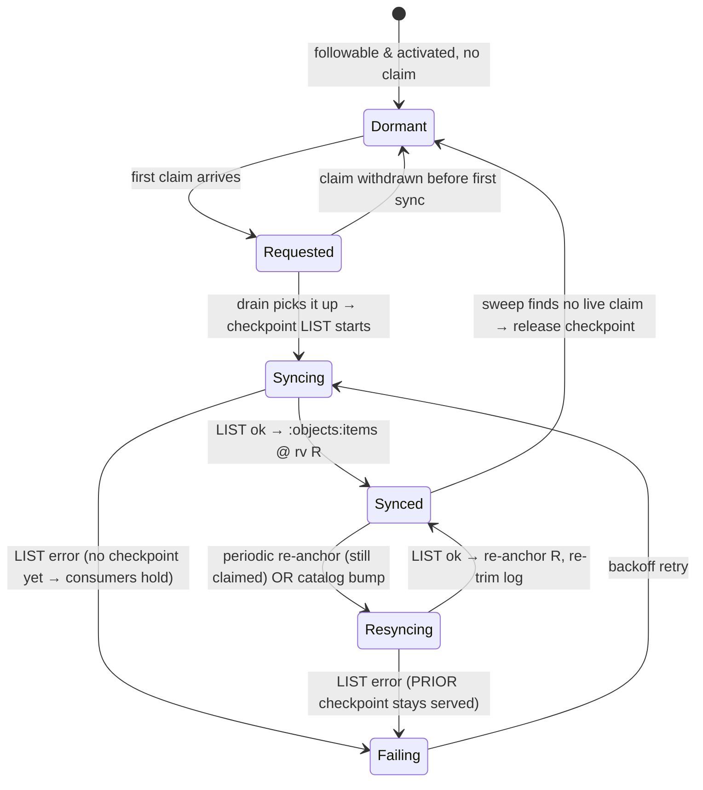

# Demand-driven type materialization lifecycle

> Status: **agreed direction — L-1→L-3 landed, L-4→L-6 ahead.** The demand-and-lifecycle
> layer beneath [api-source-of-truth-reconcile.md](api-source-of-truth-reconcile.md): it
> decides **which** types get the per-type checkpoint that doc reconciles against, and
> **when** that checkpoint is filled, refreshed, and dropped. The Materializer leaf, the
> GitTarget `Declare` wiring, the periodic Sweep, and the demand-gated checkpoint driver
> (`TypeActivated` no longer fills unconditionally) are in (§8).
> Captured: 2026-06-10 · Updated: 2026-06-10
> Owner: Simon
> Related:
> [api-source-of-truth-reconcile.md](api-source-of-truth-reconcile.md) (the per-type reconcile that **consumes** the checkpoint this doc decides to build),
> [audit-log-ingestion-and-ordering.md](audit-log-ingestion-and-ordering.md) (the always-on log feed the materialized type subscribes to),
> [../manifest/version2/type-followability.md](../manifest/version2/type-followability.md) (the followability axis this layers on top of),
> [../manifest/version2/type-lifecycle-events-and-wobble-settling.md](../manifest/version2/type-lifecycle-events-and-wobble-settling.md) (the lifecycle events this gates on).

## 1. One paragraph

The api-source-of-truth reconcile needs a standing, per-type **checkpoint** of the cluster in
Redis. But not every type that *could* be followed deserves one. Today the trigger is
collapsed onto followability: the registry's
[`TypeActivated`](../../../internal/typeset/lifecycle.go#L45) fires for every healthy type and
eagerly LISTs it into the keyspace
([`mirrorTypeObjects`](../../../internal/watch/type_objects_mirror.go#L59) at
[type_lifecycle.go:124](../../../internal/watch/type_lifecycle.go#L124)). A cluster has ~200
followable types; a GitTarget set typically mirrors a handful — so most of those LISTs are
waste. This doc splits the concern into a **second axis**: a type is **materialized** (gets a
checkpoint) only while at least one GitTarget **claims** it *and* it is followable. The claim
is a self-renewing **lease**, the materialization moves through a small phase machine
(`Dormant → Requested → Syncing → Synced ⇄ Resyncing`), and a single periodic pass per type
does double duty — refresh the still-wanted, release the no-longer-wanted.

## 2. Requirements

| # | Requirement |
|---|---|
| **L1** | **Materialize only on demand.** A checkpoint exists for a type **iff** ≥1 GitTarget claims it *and* it is followable. No claim ⇒ no LIST. *(the efficiency win; serves the parent's R3/R12/R13)* |
| **L2** | **Two orthogonal axes.** Materialization is a separate axis from followability and never re-derives it. Followability stays a pure function of discovery; materialization adds demand + async LIST results. |
| **L3** | **Claims are self-healing leases.** Demand is asserted by a full-set declaration that doubles as renewal; a crashed or removed GitTarget's claims simply age out — no teardown message to lose. |
| **L4** | **Non-blocking handshake.** A GitTarget never blocks on a sync. It claims, consumes whatever is `Synced`, and is woken when a claimed type reaches `Synced`. |
| **L5** | **Fail-closed refresh.** A periodic re-anchor never drops the currently-served checkpoint; the prior checkpoint keeps serving until the new one swaps in. *(extends the parent's R11)* |
| **L6** | **Per-type isolation.** A wobbling, throttled, failing, or released type affects only itself; siblings keep reconciling. *(the parent's R9, on this axis)* |
| **L7** | **One periodic pass, two jobs.** The same per-type periodic wake-up both refreshes a still-claimed checkpoint and releases an unclaimed one. |
| **L8** | **Durable, HA-ready phase.** The authoritative "synced + at what rv" lives in Redis; the in-memory phase is control-plane only and is rebuilt from Redis on boot. *(serves the parent's R10)* |
| **L9** | **Claims independent of followability.** A claim on a refused or not-yet-discovered type is recorded and surfaced, and drives a sync the moment the type becomes followable. |
| **L10** | **Visibility.** Per-`(GitTarget, type)` demand and per-type phase are observable. *(the parent's R12, on this axis)* |

## 3. The model: two axes

Followability is **supply** (what we *can* follow); materialization is **demand-met**
(what we *have* listed because someone wants it). They are independent, and the intersection
is the whole point.

| Axis | Question | Source of truth | Nature |
|---|---|---|---|
| **Followability** *(exists)* | *Can* we follow this type? | Pure function of discovery — [`Evaluate(obs)`](../../../internal/typeset/registry.go#L316) | Recomputed wholesale every `Update` |
| **Materialization** *(new)* | *Have* we listed it, and does anyone still *want* it? | Demand (claims) ∩ async LIST results ∩ timers | Event-sourced, stateful, persisted in Redis |

**Materialized = Followable ∩ Claimed.** Nothing outside that intersection ever holds a
checkpoint.

| Phase | Meaning | Checkpoint in Redis? | Reconcile-serviceable? |
|---|---|---|---|
| **`Dormant`** | Followable but unclaimed. The resting state. | no | no |
| **`Requested`** | ≥1 claim, queued, first LIST not started | no | no |
| **`Syncing`** | First checkpoint LIST in flight | no (building) | no |
| **`Synced`** | `:objects:items @ rv R` present, audit log flowing | **yes** | **yes** |
| **`Resyncing`** | Periodic re-anchor LIST in flight; **prior** checkpoint still served | yes (old, until swap) | **yes** |
| **`Failing`** | Last LIST errored; backoff retry; prior checkpoint (if any) still served | maybe (stale) | only if a prior checkpoint exists |

## 4. Decisions

### DEC-L1 — Materialization is a sibling state machine, not a new verdict  *(satisfies L2, L8)*

**Chosen.** A new `typeset.Materializer` sits beside the `Registry`, in the same package and
still a leaf (it depends only on `schema`, a clock, and a read handle on the `Registry`). It
owns the claim table and the per-type phase, and emits its own lifecycle events. The
`Registry` is unchanged.

*Rejected:* adding `Syncing`/`Synced` to the followability `Verdict`
([model.go:128](../../../internal/typeset/model.go#L128)). Followability is a **pure
recompute** every `Update` ([registry.go:316](../../../internal/typeset/registry.go#L316))
with no external inputs — that purity is what keeps `typeset` a leaf with no cluster client.
Materialization depends on demand and on the outcome of an async LIST, neither of which lives
in an `Observation`. Folding them would break the recompute and drag a client into the leaf.

### DEC-L2 — Phases: `Dormant → Requested → Syncing → Synced ⇄ Resyncing`, with `Failing`  *(satisfies L4, L5, L6)*

**Chosen** (the §3 table). `Resyncing` is deliberately distinct from `Syncing`: a first sync
has **nothing** to serve and consumers hold, whereas a re-anchor of an already-`Synced` type
keeps serving the **prior** checkpoint until the new one swaps in (L5). Collapsing them would
lose the fail-closed guarantee. `Failing` is its own phase, not a flag, so per-type stall is
visible (L10) and isolated (L6).

### DEC-L3 — Demand = a self-renewing lease via full-set declaration  *(satisfies L3, L9)*

**Chosen.** A GitTarget declares its **entire** desired type-set each reconcile —
`Declare(gitTargetRef, desiredGVRs)` — not per-type add/remove messages. The Materializer
diffs against that GitTarget's prior set: new GVRs add a claim, present GVRs renew, absent
GVRs leave the claim un-renewed (GC'd at the sweep, §6 T5).

Why full-set:
- **Idempotent** — re-sending is a no-op; safe to send every reconcile.
- **It *is* the renewal** — demand never needs a separate heartbeat.
- **Self-healing release** — a dropped type is an implicit withdrawal, and a *dead* GitTarget
  stops declaring entirely, so all its claims age out with no teardown message to lose. This
  mirrors the registry's existing additions-fast / removals-slow grace
  ([registry.go:38](../../../internal/typeset/registry.go#L38)).

A claim is recorded **regardless of followability** (L9): a GitTarget may claim a `Refused`
or not-yet-discovered type. Materialization simply waits; the moment the type becomes
followable the standing claim drives the sync with no new message. The
claim-vs-refused mismatch is a status surface (L10).

### DEC-L4 — Materialization is gated by the existing followability events  *(satisfies L2, L6)*

**Chosen.** The Materializer subscribes to the registry's existing lifecycle events
([lifecycle.go:84](../../../internal/typeset/lifecycle.go#L84)) — no new followability
vocabulary. The gating:

| Followability event | Effect on the materialization axis |
|---|---|
| [`TypeActivated`](../../../internal/typeset/lifecycle.go#L45) | **No longer LISTs unconditionally.** If claimed → proceed to `Requested`/sync; if unclaimed → `Dormant`. *(the one behavioral change to [type_lifecycle.go:124](../../../internal/watch/type_lifecycle.go#L124))* |
| [`TypeWobbling`](../../../internal/typeset/lifecycle.go#L47) (→retained) | **Freeze:** suspend re-anchor (a LIST against an unserved type is untrustworthy), keep the existing checkpoint served, sweep nothing. Phase stays `Synced` (held). |
| [`TypeRecovered`](../../../internal/typeset/lifecycle.go#L50) (→followable) | **Unfreeze:** resume the re-anchor schedule; a pending sync proceeds. |
| [`TypeRemoved`](../../../internal/typeset/lifecycle.go#L53) (absence-expired) | **Force release:** drop checkpoint + audit subscription; the existing per-type Git sweep runs ([type_lifecycle.go:127](../../../internal/watch/type_lifecycle.go#L127)). The **claim survives** — a reappearance re-syncs. |
| [`TypeRefused`](../../../internal/typeset/lifecycle.go#L57) (permanent) | Release as above; surface claim-vs-refused in status. |

### DEC-L5 — One periodic pass: re-anchor the claimed, release the unclaimed (sweep-interval grace)  *(satisfies L1, L7)*

**Chosen.** When a type's periodic timer (~1h, the parent's DEC-4 interval) fires, the
Materializer asks one question — *is there a live claim?* — and branches:

- **yes →** re-anchor (`Synced → Resyncing → Synced`): re-LIST, swap `:objects:items` to the
  new rv, re-trim the log. Freshness + correctness.
- **no →** release (`Synced → Dormant`): drop `:objects:items`, drop the per-type audit
  subscription, stop the timer. Demand GC.

The two jobs are the **same** pass, so there is no separate GC machinery (L7).

**Release grace = the sweep interval, no new constant.** A claim is "live" if it has been
renewed since the *previous* sweep. GitTargets renew every reconcile (minutes), so a real
consumer renews many times per interval; a stopped GitTarget renews zero times and is released
at the next sweep. Effective grace ≤ one interval, self-healing, and losing a checkpoint costs
only a re-LIST on return (it is a cache, not state) — so no dedicated `ReleaseGrace` constant
is warranted. *(Settled — see §8.)*

### DEC-L6 — Durable phase in Redis; in-memory is control-plane only  *(satisfies L8)*

**Chosen.** The authoritative "is this `Synced`, at what rv" lives in `:objects:state`
(phase / count / rv / updated_at — the keyspace the parent's R6 already names), because that
is what GitTarget reconciles read and what must survive a restart. The in-memory `Materializer`
phase is **control plane**; on boot it rebuilds from `:objects:state` so it does not re-LIST
the world. This is also the HA seam (L8 / parent R10): a failover replica reconciles against
the standing checkpoint.

### DEC-L7 — Defer a visible `Orphaned` phase  *(satisfies L1)*

**Chosen, deferred.** "Materialized but no longer claimed" is modeled as `Synced` with zero
live claims, released at the next sweep (DEC-L5) — **not** a distinct phase. If operators later
need to *see* "this checkpoint is orphaned, GC pending," an explicit `Orphaned` phase slots
between `Synced` and `Dormant`. Kept implicit for now: it is easier to add than to remove.

## 5. What is reused, and the one thing that changes

Reused unchanged:
- The **`Registry.Subscribe` → buffered drain** pattern
  ([type_lifecycle.go:61](../../../internal/watch/type_lifecycle.go#L61)) — the Materializer's
  driver is a second subscriber on the same goroutine discipline.
- [`mirrorTypeObjects`](../../../internal/watch/type_objects_mirror.go#L59) /
  [`clearTypeObjects`](../../../internal/watch/type_objects_mirror.go#L98) as the checkpoint
  write/drop primitives, and the `:objects` keyspace
  ([redis_bytype_queue.go](../../../internal/queue/redis_bytype_queue.go)).
- The whole api-source-of-truth reconcile downstream of `Synced` — this doc only decides *that*
  a checkpoint exists.

What changes:
- [`TypeActivated`](../../../internal/watch/type_lifecycle.go#L121) **stops** calling
  `mirrorTypeObjects` directly. The LIST is routed through the Materializer and runs only for
  claimed types.

## 6. Triggers — when and how

| # | Trigger | Transition | Notes |
|---|---|---|---|
| **T1** | First claim on a `Dormant` type | Dormant → Requested | Demand-driven first sync (fast path). |
| **T2** | Drain goroutine picks up a `Requested` type | Requested → Syncing → Synced | LIST on the lifecycle drain, off the registry hot path — where `mirrorTypeObjects` already runs. |
| **T3** | Claim on an already `Syncing`/`Synced` type | *(no phase change)* | Record/renew the claim; the GitTarget consumes the existing checkpoint at once. |
| **T4** | Periodic timer (~1h), type still claimed | Synced → Resyncing → Synced | Re-anchor; re-trim the log (parent DEC-4). |
| **T5** | Periodic timer (~1h), no live claim | Synced → Dormant | Release (the new behavior). |
| **T6** | Catalog bump / CRD upgrade adds the type, while claimed | Synced → Resyncing | Event-driven re-anchor (parent DEC-4). |
| **T7** | LIST fails (T2 or T4) | → Failing, backoff retry | Per-type isolation (L6). |

**T4 and T5 are the same wake-up** (DEC-L5): the live-claim test selects the branch.

**Completion handshake (L4):** when a type reaches `Synced`, the Materializer emits
`TypeSynced(gvr)`; the driver wakes every GitTarget claiming it, which then runs the per-type
splice reconcile (parent §6). A GitTarget never blocks — un-synced claims are simply not
actioned until their `TypeSynced` wake arrives.

## 7. Failure / consistency model  *(L5, L6)*

- **First-sync LIST fails →** `Failing`; no checkpoint exists, so claiming GitTargets **hold**
  for that type (never sweep on an absent view); backoff retry; siblings unaffected (L6).
- **Re-anchor LIST fails →** `Failing`, but the **prior** checkpoint keeps serving (L5);
  freshness degrades to the existing checkpoint + log, correctness is preserved until the next
  successful re-anchor.
- **Type wobbles mid-materialization →** freeze (DEC-L4): no LIST against an unserved type;
  the existing checkpoint holds; nothing is swept.
- **Restart →** the Materializer rebuilds in-memory phases from `:objects:state` (DEC-L6); a
  `Synced` type resumes without a re-LIST, a `Syncing`/`Requested` type re-enters the queue.

## 8. Implementation steps

Ordered; each is independently shippable and ends green. **L-1, L-2, and L-3 have landed**
(uncommitted on `poc/redis-copy`): the leaf, the `Declare` wiring + Sweep ticker, and the
demand-gated checkpoint driver. **L-4 is next.**

1. **L-1 — Materializer skeleton (pure, leaf). ✅ LANDED.** Claim table + phase machine + injected clock,
   `Declare` / `Renew` / sweep, emitting `SyncRequested` / `SyncStarted` / `TypeSynced` /
   `SyncFailed` / `Released`. Unit-tested with a fake clock like the followability lifecycle.
   No driver, no cluster. *Done when:* the state machine and lease GC are proven in tests.
2. **L-2 — Wire `Declare` from GitTarget reconcile. ✅ LANDED.** Each reconcile declares its
   full resolved type-set — wired into the GitTarget **controller** reconcile (the per-target
   periodic loop), so a healthy lease is renewed every reconcile (minutes ≪ the ~1h sweep) and
   a deleted GitTarget stops declaring and ages out. *Done when:* claims appear/renew/age-out
   as GitTargets come and go.
3. **L-3 — Checkpoint driver + decouple `TypeActivated`. ✅ LANDED.** Second subscriber on the
   drain; `TypeActivated` stops filling unconditionally; demand-driven checkpoint fill;
   `TypeSynced` emitted. *Done when:* only claimed types are filled; an unclaimed followable
   type holds no checkpoint; e2e green. *(The `:objects` keyspace is write-only today, so this
   gating is e2e-invisible — pure efficiency. The `TypeSynced`→splice-reconcile wake is the
   api-source-of-truth R2 consumer, not wired here.)*
4. **L-4 — Periodic pass (T4 + T5). ← NEXT.** Per-type timer; live-claim branch → re-anchor or release.
   *Done when:* a still-wanted type refreshes hourly; a no-longer-wanted type is released at the
   sweep after demand stops.
5. **L-5 — Durable `:objects:state` + boot reconcile (DEC-L6).** Persist phase/rv; rebuild
   in-memory phases on start. *Done when:* a restart resumes without re-LISTing `Synced` types.
6. **L-6 — Visibility (L10).** Per-`(GitTarget, type)` demand + per-type phase as metrics and a
   bounded status roll-up, including claim-vs-refused mismatches. *Done when:* an operator can
   see what each GitTarget demands and each type's phase.

## 9. Open questions

- **Settled — release grace = sweep-interval** (DEC-L5). No dedicated constant.
- **Settled — no `Orphaned` phase yet** (DEC-L7). Add later if visibility demands it.
- **Claim key granularity. *Pinned (L-2).*** A claim keys on `(GitTarget ref, GVR)`, and the
  ref is the GitTarget's **namespaced name** (`gitDest.String()`) — stable across reconciles
  and consistent with how the rulestore keys GitTargets. Per review, a future refinement is to
  fold in the **UID when available** (namespaced name for readability, UID to disambiguate a
  delete-then-recreate so stale claims cannot be silently inherited). Deferred, not a
  correctness gap: claims age out within a sweep interval and a recreated GitTarget re-`Declare`s
  the same set, so name-only is correct today; the UID seam is a precision upgrade.
- **`Declare` transport.** In-process call (Materializer in the same controller) vs a Redis-
  backed declaration (needed only once HA splits the consumer from the GitTarget owner). Start
  in-process; the durable `:objects:state` (DEC-L6) already carries the HA seam.
- **Renewal cadence vs sweep interval.** The GitTarget reconcile interval must be comfortably
  shorter than the sweep interval so a healthy consumer always renews between sweeps. Default
  reconcile is minutes, sweep is ~1h, so this holds — but it is the one coupling to keep honest
  if either interval becomes tunable.
