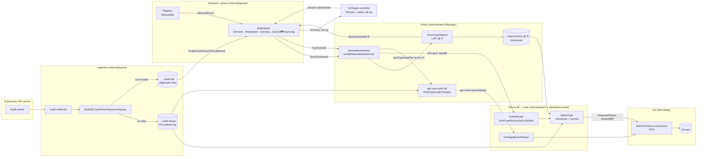
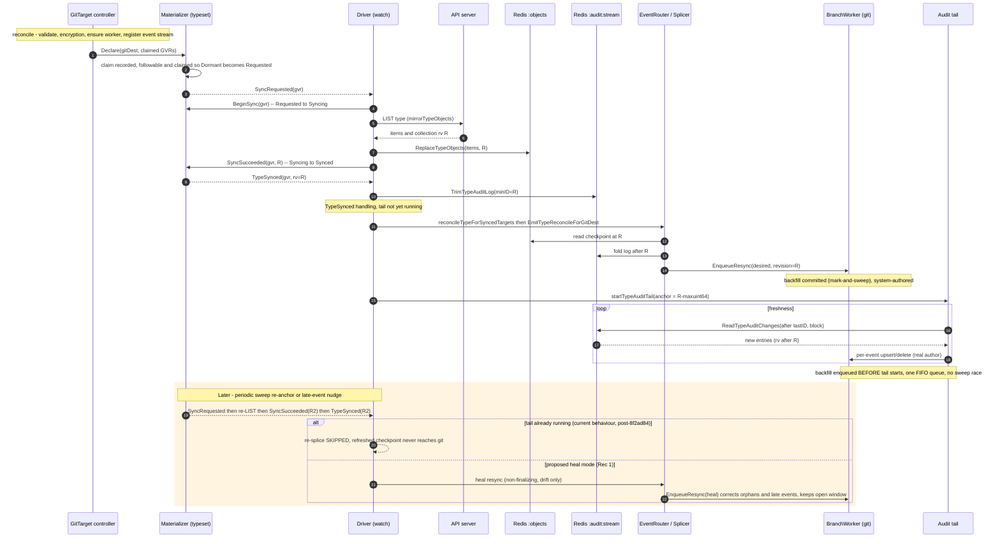

# Materialization, the freshness tail, and GitTarget liveness — review + plan

Status: review / proposal · Branch: `poc/redis-copy` · Date: 2026-06-12

This document reviews how a resource type goes from *claimed* to *checkpointed* to
*live-tailing*, what is already correct, and where the gaps are after commit
`8f2ad84` ("only backfill-reconcile a type on its first TypeSynced"). It then proposes
how to (a) restore periodic checkpoint healing without stealing commit windows,
(b) make the backfill→tail boundary explicit, and (c) give a GitTarget a clear
`Initializing / PartiallyLive / Live` signal that operators and e2e tests can gate on.

It is the companion to:

- [api-source-of-truth-reconcile.md](./api-source-of-truth-reconcile.md) — the R-stage
  splice/tail architecture.
- [demand-driven-type-materialization-lifecycle.md](./demand-driven-type-materialization-lifecycle.md)
  — the demand axis (claims, phases) this builds on.
- [audit-log-ingestion-and-ordering.md](./audit-log-ingestion-and-ordering.md) — the
  per-type RV-ordered stream and the late lane.

---

## 1. How it works today

The live path is entirely **per-type stream → checkpoint + tail**. There is no direct
watch→git route anymore: the only caller of `RouteToGitTargetEventStream` is the audit
tail (`internal/watch/audit_tail.go`).

For one resource type the lifecycle is:

1. **Ingest** — the audit webhook mirrors every event into a strictly RV-ordered per-type
   stream `…:audit:stream` (`RedisByTypeStreamQueue.Enqueue`). An out-of-order event (RV
   below the stream high-water) is diverted to a diagnostic `…:audit:late` lane and is
   **never replayed** by the ordered log.
2. **Demand** — the GitTarget controller `Declare`s its watched-type set as a renewing
   lease; the registry feeds followability in as `LifecycleEvent`s. The `Materializer`
   moves a claimed + followable type `Dormant → Requested` and emits `SyncRequested`.
3. **Checkpoint** — the driver LISTs the type into `…:objects:items` and pins the list's
   collection revision `R` (`mirrorTypeObjects`), then `SyncSucceeded(gvr, R)` emits
   `TypeSynced`.
4. **Backfill** — on `TypeSynced`, `reconcileTypeForSyncedTargets` fans a per-type
   **splice resync** (mark-and-sweep; desired = checkpoint@R folded with the log `(R, head]`)
   to every watching GitTarget.
5. **Freshness tail** — a per-type goroutine then loops `…:audit:stream` from the anchor
   `R-<maxuint64>` and applies each later entry as a sweep-free upsert/delete.
6. **Trim** — each successful checkpoint trims the log to `R`.

Backfill resyncs and tail events land on the **same FIFO queue** per worker
(`BranchWorker.eventQueue`), which is what keeps them ordered.

**One worker serves N GitTargets.** A `BranchWorker` is keyed by `(provider, branch)`, not by
GitTarget, so every GitTarget writing to the same branch (each under its own non-overlapping
`spec.path`) shares one worker: one FIFO queue, one goroutine, and **one open commit window**.
That window is a worker singleton bound to a single GitTarget at a time — an event for a
different GitTarget finalizes it (`windowFinalizeReasonIdentityChange`) and opens a fresh one.
This sharing is mostly benign (worker teardown is branch-keyed and N:1-safe via the
`WorkerManager` orphan sweep), but it has one sharp consequence for the heal below: because a
resync/heal force-finalizes *whatever* window is open, a heal for GitTarget A can finalize
GitTarget B's window — see Rec 1.

### 1.1 Component overview

### 1.2 Startup → fully synced → tailing

The same flow as a sequence, to show how many components hand off before a type is
serviceable and the tail is live. (`alt` blocks call out the two behaviours that matter
for the gaps below.)

---

## 2. What is already correct (do not "fix" these)

Two instincts about live events are *already satisfied at first sync*, which is worth
knowing before changing anything:

- **"Store the RV we start at"** — already done. The tail anchors at the checkpoint
  revision `R` (`auditTailAnchor`), and `SpliceType` returns that same `R`. The backfill
  owns `≤R`; the tail owns `>R`.
- **"Filter live events until the reconcile is done"** — at first sync this holds *by
  construction*: `reconcileTypeForSyncedTargets` enqueues the backfill resync
  **synchronously before** `startTypeAuditTail` runs, and both share one FIFO worker
  queue. So the resync is processed before any tail event, and the mark-and-sweep cannot
  delete a not-yet-created object (its file does not exist yet). **There is no sweep race
  at first sync.**

So the first-sync path is sound. The real problems are elsewhere.

---

## 3. The gaps

### Gap 1 — periodic checkpoint healing no longer reaches git (HIGH; the `8f2ad84` regression)

After `8f2ad84`, **any `TypeSynced` while the tail is running skips the re-splice**
(`handleMaterializationEvent`, the `!isAuditTailRunning` guard). The periodic sweep
re-anchor and the late-event nudge both refresh the Redis checkpoint and **trim the
log**, but the corrected state is never reconciled into git. Lost until a process restart
or a fresh first-sync (which will not happen while the tail runs):

- **Late-lane / out-of-order events** — `NudgeTypeResyncForLateEvent → RequestResync →`
  checkpoint refresh `→ TypeSynced →` *skipped*. The nudge is now effectively a no-op for
  git.
- **`deletecollection`** — name-less, skipped by both the tail and the splice's log-fold;
  only a full LIST reflects it. Disabled.
- **Orphans / missed deletes** — the checkpoint sweep's entire stated purpose
  ("CORRECTNESS … is the checkpoint sweep's job") no longer applies to git.
- **The trim now runs without its backstop.** `TrimTypeAuditLog`'s safety argument is "a
  reconcile that finds the log trimmed past its cursor re-reads the checkpoint" — but that
  re-read *is* the re-splice `8f2ad84` disabled. A tail that stalls (Redis backoff) across
  a re-anchor can have unread entries trimmed away with nothing to recover them.

The tail keeps git fresh for in-order live edits, but the authoritative full-LIST
reconcile no longer corrects drift. **This is the thing to get right.**

### Gap 2 — a failed first backfill leaves the tail running ahead of an un-backfilled target (MEDIUM-HIGH)

`startTypeAuditTail` runs unconditionally even if a per-target backfill errored or was
skipped. The tail is keyed per **type**, so once any first-sync starts it, it is "running"
for *all* GitTargets. A GitTarget that claims an already-Synced type gets its backfill from
the `Declare` path — but if that `EmitTypeReconcileForGitDest` fails, it is only logged,
and the next reconcile will not retry it because `newlyDeclaredSyncedGVRs` already recorded
the type as declared. With Gap 1, no re-anchor heals it. Result: a transient backfill
failure = permanent per-target hole for objects that existed at checkpoint and never
change again.

### Gap 3 — GitTarget reports `Ready=True` before any type is Synced (MEDIUM; the status ask)

`evaluateEventStreamGate` flips `Ready=True` the moment the worker/stream is wired. The
materialization roll-up (`Claimed/Synced/Pending/Failing/NotFollowable`) is computed and
stored but **does not gate readiness or surface a phase**. There is no
init / partial-live / live distinction, so neither an operator nor an e2e test can tell
"all claimed types are actually mirrored." The data exists — it just is not projected into
a clear signal.

### Gap 4 — the backfill/tail boundary is implicit and slightly noisy (LOW)

It works by call-ordering + FIFO, not by an explicit gate, so any future refactor that
makes the splice async or starts the tail earlier silently reintroduces a sweep race.
Also, because the splice folds to `head` but the tail anchors at `R`, the `(R, head]`
window is applied **twice** at first sync — once by the system-authored backfill commit,
once by the tail with real authorship. Idempotent in content, but it produces redundant
commits.

### Gap 5 — the checkpoint always plain-LISTs; the streaming WATCH is design intent only (MEDIUM)

The demand-driven checkpoint fill (`mirrorTypeObjects`) does an unconditional
`dynamicClient.Resource(gvr).List(ctx, metav1.ListOptions{})`. There is **no** WATCH with
`sendInitialEvents=true` anywhere in the codebase — that string appears only in a stale
doc-comment on `typeset/materializer.go`, and the functions it names
(`StreamSnapshotForType`, `StreamClusterSnapshotForGitDest`) no longer exist. So the
intended "stream the initial events via a watch-list, fall back to a consistent LIST only
when the server can't" behaviour is **not** implemented; every checkpoint and every
re-anchor is a full LIST. For a large type on a busy cluster that is a heavier, less
incremental call, and it forgoes the bookmark-based `initial-events-end` revision the design
assumes for the anchor `R`.

### Gap 6 — the materialization roll-up mis-buckets serviceability, and liveness is duplicated in test code (MEDIUM)

`MaterializationSummaryForGitTarget` counts `Resyncing` as `Pending` and counts only
`PhaseSynced` as `Synced`. But a `Resyncing` type **still serves its prior checkpoint**, and
a `Failing` type with a prior checkpoint does too — they are live. So the roll-up's notion of
"synced" undercounts what is actually serviceable, and "pending" overcounts it. Consequences:

- Any liveness signal built on `pending == 0 && synced == claimed` **flaps on every periodic
  re-anchor** (Synced→Resyncing→Synced), even though nothing was ever unavailable.
- The fast-requeue `materializationSettling = sum.Pending > 0`
  (`gittarget_controller.go`) fires on routine re-anchors, churning reconciles.
- The signal is **already duplicated in test code** — `waitForGitTargetMaterializationSettled`
  re-derives the same buggy predicate from raw counts instead of reading one first-class
  status field.

The correct predicate is **serviceability** = `checkpointRV != ""` (true for `Synced`,
`Resyncing`, and `Failing`-with-prior-checkpoint), not `phase == Synced`. Separately,
`status.snapshot` (`GitTargetSnapshotStatus`) is **vestigial** — nothing has written it since
the pre-R2 bootstrap gather was removed — and should be deleted.

---

## 4. Recommendations

### Rec 1 — Restore periodic healing, deferred until the commit window is idle (fixes Gap 1; the headline)

The reason re-anchor re-splices were disabled is that **every resync finalizes the open
commit window first** (`handleResyncRequest → finalizeOpenWindowWithReason`,
`windowFinalizeReasonResyncBeforeApply`) — so a re-anchor stole a user's held CommitRequest
window. Because **one worker serves N GitTargets** (§1.1) and the window is a worker
singleton, this is worse than same-GitTarget: a heal for GitTarget A finalizes whatever window
is open, so it can steal GitTarget **B**'s CommitRequest window. The gate therefore has to be
**worker-level** ("is *any* window open?"), which is exactly what a worker-singleton window
makes natural.

The simplest correct fix is **not** to build elaborate "don't influence the window"
machinery, but to **defer the periodic heal until the worker is idle** — apply it only when
no commit window is open (`openWindow == nil`). The application is allowed to do its own
housekeeping; it just waits for a quiet moment to do it. This is safe from starvation
because a window always self-finalizes: the rolling commit-window silence timer
(`DefaultCommitWindow` = 5s, `windowFinalizeReasonTimer`), the buffer-size backstop
(`windowFinalizeReasonBufferLimit`) under sustained load, and a CommitRequest's own
`finalizeAt = receipt + delaySeconds`. So a deferred heal always gets a turn within a
bounded time, and when it runs there is, by definition, no window to steal and no live edit
to re-attribute. In steady state the heal finds git already matching desired and commits
nothing; it writes a (system-authored) commit only on genuine drift — exactly an orphan, a
`deletecollection`, or a late-lane event the in-order tail could not express.

Concretely:

- give the re-anchor resync a `Heal` kind that the worker **defers** while a window is open
  (stash one pending heal; apply it at the next window-finalize boundary) instead of
  force-finalizing;
- re-enable the re-anchor re-splice (drop the `!isAuditTailRunning` skip) routed through
  that heal kind.

The deferral must be **internal to the worker**, not an external `HasOpenWindow()` the driver
polls before enqueuing: an external check is a TOCTOU race against the FIFO (the window state
changes between the check and the heal's dequeue, so it would not actually prevent the steal).
The worker, dequeuing a `Heal` item, checks `openWindow != nil` itself and applies the heal at
the next boundary where no window is open. That boundary comes up frequently — every silence
timeout *and* every identity switch between the N GitTargets — so the heal never starves, even
under sustained multi-GitTarget load, and it never force-finalizes. (An external idle query is
fine as an *observability* signal — a "worker busy" gauge — but not as the heal's gate.)

This restores the checkpoint's correctness role with minimal new code and **subsumes most of
Gap 2** — a heal re-anchor recovers a failed first-backfill within one sweep interval.
Ordering stays correct: a heal that runs at idle has no window to reorder against, and a heal
deferred past an open window lands strictly after that window's commit — the same arrival
order the old force-finalize preserved. (A fully non-finalizing, drift-only resync that runs
*concurrently* with an open window is the more complex alternative; it is not worth the extra
machinery given that windows self-finalize quickly.)

### Rec 2 — Make the "tail waits for backfill" boundary explicit (fixes Gap 2; the live-event filter ask)

Today it is emergent. Make it a precondition: only start/deliver the tail for a type once
its first backfill has been **enqueued without error for every current watcher**, and
retry a failed per-target backfill instead of recording it as "declared." This closes the
failed-backfill hole and makes the invariant robust to refactors. Once Rec 1 lands this is
belt-and-suspenders, but it is cheap and removes the fragility.

**Implementation note (landed):** the **retry half** is implemented — a failed Declare-time
backfill is un-recorded (`forgetDeclaredGVR`) so the next reconcile re-classifies the type as
newly-declared and re-attempts it, and the Declare path no longer starts the per-type freshness
tail for a target whose backfill just errored. The broader "tail does not *deliver* to an
un-backfilled target" per-target gate was deliberately **not** added: with Rec 1 landed, the
periodic re-anchor heal re-fans the reconcile to *every* watcher (~1h backstop) and the next
reconcile retries within minutes, while the tail's per-event apply is benign for a momentarily
un-backfilled target — an upsert simply creates the file, and a delete for an object the target
never held is a no-op. The only genuine hole is unchanging baseline objects, which the retry and
the heal both fill; tracking per-(GitTarget, type) tail-delivery state to gate that narrow,
self-healing window is not worth the new state and the risk of dropping legitimate events.

### Rec 3 — (Optional) capture one explicit fold tip and anchor the tail there (the start-RV ask, cleaner)

Have the backfill return the concrete stream tip `H` it folded to and anchor the tail at
`H` instead of `R`. That makes the partition exact (`backfill = [0, H]`,
`tail = (H, ∞)`), eliminating the double-commit of `(R, head]`. It is a moderate refactor
(the materializer's `TypeSynced` carries `R`, not `H`, so the splice would have to hand
`H` back to the tail-start call). Treat as follow-up polish, not a correctness fix —
`R`-anchoring is the *safe* choice (overlap is idempotent; a gap would not be), so do not
rush it.

### Rec 4 — Add a serviceability-based liveness phase to GitTarget status, orthogonal to Ready (fixes Gaps 3 + 6; the status ask)

**`Ready` should NOT depend on liveness.** The reason is not backward-compat (there are no
end users) — it is that one boolean cannot honestly represent the four states a GitTarget can
be in: (1) config/plumbing broken, (2) plumbing fine but mirror still building, (3) mirror
fully current, (4) mirror as-current-as-possible **but a claimed type is not followable** (a
CRD that is not installed, or a typo in a WatchRule). State 4 is decisive: folding liveness
into `Ready` makes such a GitTarget `NotReady` *forever* despite being correctly configured
and mirroring all it can — and excluding not-followable types from the gate instead makes
`Ready=True` silently ignore a type the user asked to watch. Only two orthogonal axes tell the
truth (`Ready=True` + `Synced=Degraded, 1 type not followable`). This is the Deployment
`Available` vs `Progressing` split.

Keep `Ready` = control-plane correctness (validated + encryption + stream wired), unchanged
and non-flapping. **Add** a data-plane signal computed in the controller from a
**serviceability-based** roll-up (Gap 6 fix): a type is *serviceable* when
`checkpointRV != ""` (i.e. `Synced`, `Resyncing`, or `Failing`-with-prior), evaluated over the
**followable, claimed** types only:

| Phase | Meaning |
| --- | --- |
| `Initializing` | ≥1 followable claimed type not yet serviceable (first sync in flight) |
| `Synced` | all followable claimed types serviceable (fully live) |
| `Degraded` | serviceable ones are serviceable, but ≥1 claimed type is not followable, or failing without a checkpoint |

Surface it as **both** a condition and a `status.phase` string (good printcolumn). **Name the
condition `Synced` (or `Materialized`), not `Live`** — `EventStreamLive` already uses "Live"
for "stream wired," so `Live` would collide. Tests then `kubectl wait --for=condition=Synced`
and the bespoke `waitForGitTargetMaterializationSettled` helper is deleted (its logic, and its
latent re-anchor flap, move into the controller and are fixed there). Because `Resyncing`
counts as serviceable, a periodic re-anchor does **not** flap the phase. Also **delete the
vestigial `status.snapshot`** while here. The full two-axis status contract (conditions,
phase derivation, reasons, tests) is written up in
[../status-design-git-target.md](../status-design-git-target.md).

### Rec 5 — Tests to add

- **watch (regression for `8f2ad84`):** a re-anchor while the tail is running heals git
  (orphan deleted / late-event folded) **and** leaves an open CommitRequest window intact —
  the test that would have caught the tradeoff.
- **git:** a deferred heal resync waits while a commit window is open and applies once it
  finalizes; it never finalizes the open window or resolves a pending CommitRequest —
  including the **shared-worker** case, where a heal scoped to GitTarget A must not steal
  GitTarget B's open CommitRequest window on the same branch worker.
- **watch:** a failed first backfill is retried; the tail does not deliver to an
  un-backfilled target.
- **queue/watch:** a late-lane (out-of-order) event reaches git within one sweep interval
  via heal.
- **controller:** status phase `Initializing → Synced` as checkpoints land; a periodic
  re-anchor (Synced→Resyncing→Synced) does **not** flap the phase; a claimed-but-not-followable
  type yields `Synced=False, phase=Degraded` while `Ready` stays `True`.
- **e2e:** a `deletecollection` is reconciled into git within one sweep; a GitTarget
  reports `Live` only after all claimed types synced.

### Rec 6 — Implement the WATCH-first checkpoint with LIST fallback (fixes Gap 5)

Make `mirrorTypeObjects` open a streaming watch-list (`sendInitialEvents=true`,
`resourceVersionMatch=NotOlderThan`, `allowWatchBookmarks=true`), fold the initial `ADDED`
events into the checkpoint, and pin the `initial-events-end` bookmark revision as the
anchor `R`. Fall back to the current consistent LIST **only** when the server rejects
`sendInitialEvents` (e.g. an aggregated apiserver) — detected from the watch error, not
chosen blindly. Until that lands, fix the stale `materializer.go` comment so it stops
describing behaviour that is not there. This is independent of Recs 1–5 and can be done on
its own.

**Status (landed / deferred):** the **stale comment is fixed** — `materializer.go` now describes the
actual consistent-LIST fill and frames the watch-list as the planned optimisation, instead of naming
`StreamSnapshotForType` / `StreamClusterSnapshotForGitDest` (functions that do not exist) and
behaviour that is not there. The **watch-first LIST replacement itself is deliberately deferred**:
it is the lowest-priority item here ("whenever LIST cost matters"), no current consumer needs the
bookmark-pinned `R` (the LIST collection rv works), and — decisively for "test both paths" — the
`client-go` dynamic **fake client cannot simulate a `sendInitialEvents` watch-list** (no initial
`ADDED` replay, no `initial-events-end` bookmark), so a watch-first `mirrorTypeObjects` would block
forever in the ~10 existing fake-client tests that drive it, and new tests could only exercise a
hand-rolled synthetic watcher (testing our fold/bookmark consumption, not real server behaviour).
Shipping an under-tested watch loop that can hang the controller, for an optimisation nothing needs
yet, is the wrong trade. **A future implementation needs:** (1) `streamTypeObjects(ctx, dc, gvr)`
that folds `ADDED` until the `initial-events-end` bookmark and returns `(items, bookmarkRV)`;
(2) a `sendInitialEventsUnsupported(err)` classifier driving the LIST fallback; (3) a shared test
helper that installs a `PrependWatchReactor` on the fake client to replay tracker objects as initial
`ADDED` + an `initial-events-end` bookmark, which the existing `mirrorTypeObjects` tests migrate to
so they exercise the watch path instead of hanging; (4) an e2e assertion against a real apiserver.

---

## 5. Priority

1. **Rec 1** restores correctness and is the right way to "get this part right" — it is
   also what makes the late-event tradeoff disappear.
2. **Rec 4** is independent and small, and directly serves the testability described.
3. **Recs 2 / 3** are hardening; **Rec 6** (WATCH-first checkpoint) is independent and can
   slot in whenever LIST cost becomes a concern.

Suggested order: Rec 4 (self-contained, unblocks tests) → Rec 1 (deferred-until-idle heal +
re-enable re-anchor healing) → Recs 2/3 → Rec 6.

---

## 6. Metrics exposed today (reference)

Every instrument is an OpenTelemetry metric bridged to Prometheus via
`internal/telemetry/exporter.go` under the `gitops-reverser` meter; names are prefixed
`gitopsreverser_`. Note: instruments are registered with a **name only** — no
`WithDescription` or `WithUnit` is set, so `/metrics` carries no HELP/UNIT metadata. Adding
those is a cheap, separate observability improvement.

### Git / commit pipeline (`internal/git`)

| Metric | Type | Notable labels |
| --- | --- | --- |
| `gitopsreverser_git_operations_total` | counter | |
| `gitopsreverser_git_push_duration_seconds` | histogram | |
| `gitopsreverser_objects_scanned_total` | counter | |
| `gitopsreverser_objects_written_total` | counter | |
| `gitopsreverser_files_deleted_total` | counter | |
| `gitopsreverser_commits_total` | counter | |
| `gitopsreverser_commit_bytes_total` | counter | |
| `gitopsreverser_rebase_retries_total` | counter | |
| `gitopsreverser_ownership_conflicts_total` | counter | |
| `gitopsreverser_lease_acquire_failures_total` | counter | |
| `gitopsreverser_marker_conflicts_total` | counter | |
| `gitopsreverser_branch_worker_queue_depth` | gauge | `provider_namespace`, `provider_name`, `branch` |
| `gitopsreverser_repo_branch_active_workers` | up-down counter | |
| `gitopsreverser_repo_branch_queue_depth` | up-down counter | |

### Reconcile / materialization (`internal/watch`, `internal/typeset`)

| Metric | Type | Notable labels |
| --- | --- | --- |
| `gitopsreverser_target_reconcile_completed_total` | counter | `gittarget_namespace`, `gittarget_name`, `trigger` |
| `gitopsreverser_resync_background_failures_total` | counter | `gittarget_namespace`, `gittarget_name` |
| `gitopsreverser_type_lifecycle_reconcile_total` | counter | `gittarget_namespace`, `gittarget_name` |
| `gitopsreverser_type_lifecycle_sweep_total` | counter | `gittarget_namespace`, `gittarget_name` |
| `gitopsreverser_materialization_sync_events_total` | counter | `kind` (SyncRequested / SyncStarted / TypeSynced / SyncFailed / Released) |
| `gitopsreverser_materialization_type_phase` | gauge | `phase` (Dormant / Requested / Syncing / Synced / Resyncing / Failing) |
| `gitopsreverser_materialization_claimed_types` | gauge | |
| `gitopsreverser_materialization_claimed_unfollowable` | gauge | |
| `gitopsreverser_watched_types` | gauge | |
| `gitopsreverser_watch_duplicates_skipped_total` | counter | |

### Audit ingestion (`internal/webhook`, `internal/queue`)

| Metric | Type |
| --- | --- |
| `gitopsreverser_audit_events_received_total` | counter |
| `gitopsreverser_audit_event_quality_total` | counter |
| `gitopsreverser_audit_join_parked_total` | counter |
| `gitopsreverser_audit_join_emitted_total` | counter |
| `gitopsreverser_audit_shallow_dropped_total` | counter |
| `gitopsreverser_audit_eventlists_total` | counter |
| `gitopsreverser_audit_eventlist_events_total` | counter |
| `gitopsreverser_audit_join_skew_seconds` | histogram |
| `gitopsreverser_audit_official_gate_wait_seconds` | histogram |
| `gitopsreverser_audit_eventlist_duration_seconds` | histogram |

### API discovery / catalog (`internal/watch`)

| Metric | Type |
| --- | --- |
| `gitopsreverser_api_catalog_resources` | gauge |
| `gitopsreverser_api_catalog_group_versions` | gauge |
| `gitopsreverser_api_catalog_generation` | gauge |
| `gitopsreverser_api_catalog_refresh_total` | counter |
| `gitopsreverser_api_catalog_refresh_duration_seconds` | histogram |

### Secret encryption (`internal/git`)

| Metric | Type |
| --- | --- |
| `gitopsreverser_secret_encryption_attempts_total` | counter |
| `gitopsreverser_secret_encryption_success_total` | counter |
| `gitopsreverser_secret_encryption_failures_total` | counter |
| `gitopsreverser_secret_encryption_cache_hits_total` | counter |
| `gitopsreverser_secret_encryption_marker_skips_total` | counter |

### Gaps in the metrics surface (relative to this review)

- **No description / unit metadata** on any instrument (names only).
- **No materialization latency** — there is a phase *gauge* and an event *counter*, but
  nothing measures how long a type takes to go `Requested → Synced`, which is exactly the
  "time to live" the Rec 4 phase would make observable. A `…_materialization_sync_duration_seconds`
  histogram would pair naturally with the `Live` phase.
- **No per-GitTarget liveness gauge** — the roll-up lives only on the CR status; a
  `…_gittarget_synced_types` / `…_gittarget_claimed_types` gauge would let dashboards alert on
  "stuck initializing" without scraping CRs.
