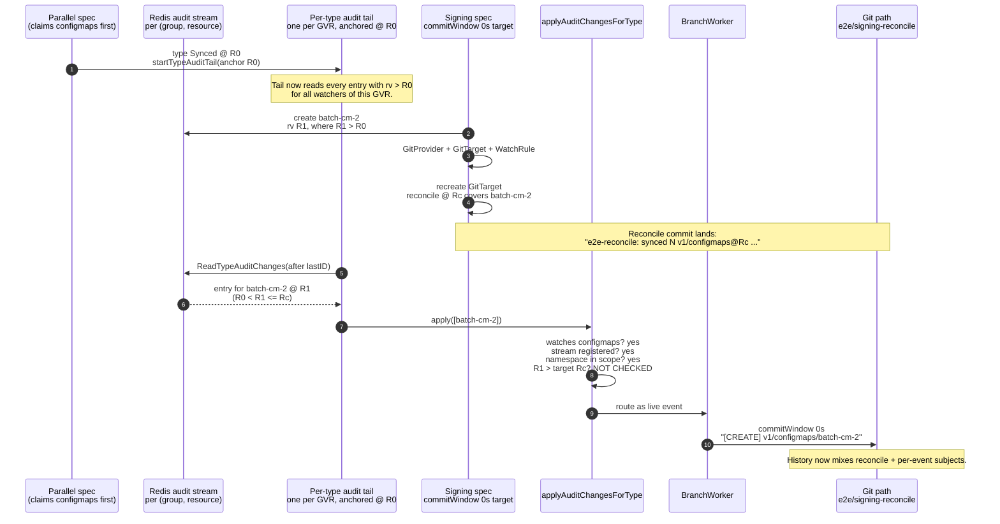
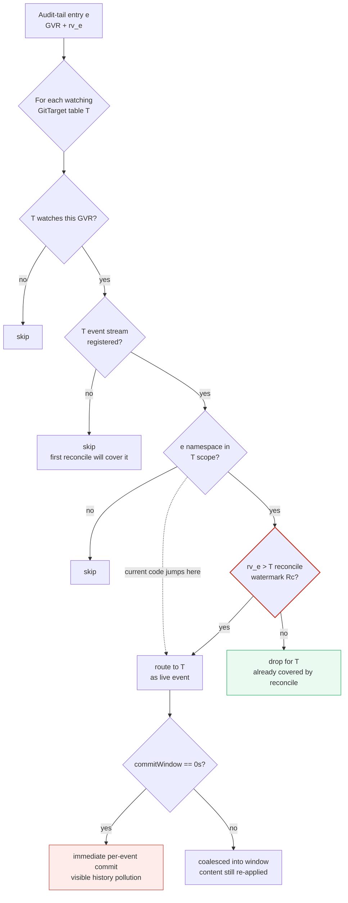
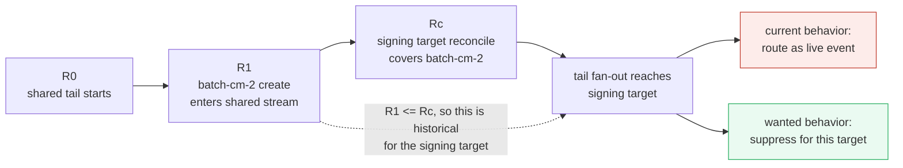
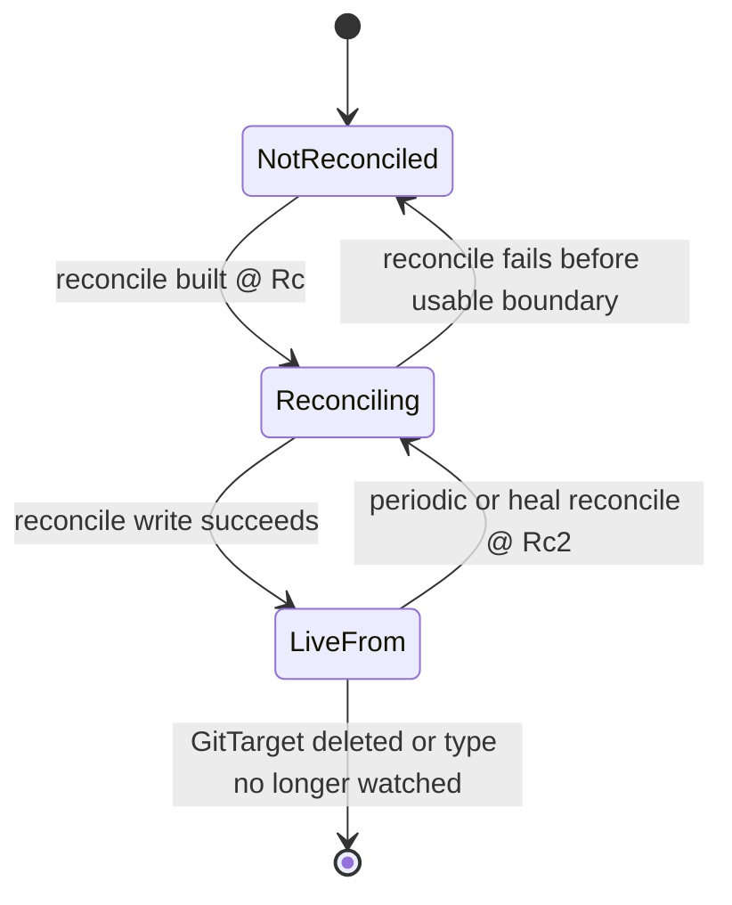
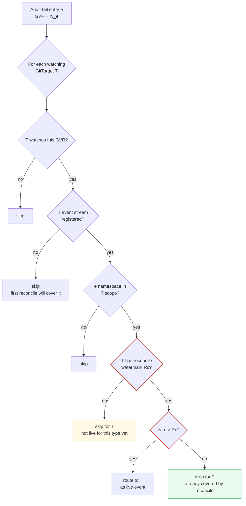
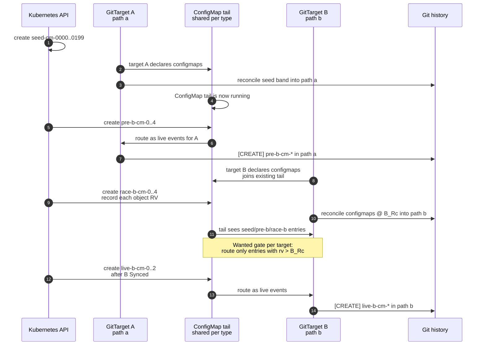
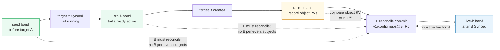

# Signing reconcile E2E failure: per-type tail replay creates event commits

> Status: investigation note. The chosen fix is a per-target reconcile watermark.
> Captured 2026-06-12, refreshed 2026-06-13 after the materialization-healing and
> GitTarget status work landed.
>
> Context: GitHub Actions run
> [27377310456](https://github.com/ConfigButler/gitops-reverser/actions/runs/27377310456),
> attempt 1, commit `113b4bc0224cfc0e5f900e38f877b8676828dfe9`.
>
> Related:
> [materialization-tail-and-live-readiness-review.md](./materialization-tail-and-live-readiness-review.md)
> (Gap 2 / Rec 2),
> [github-e2e-per-type-tail-failure-investigation.md](github-e2e-per-type-tail-failure-investigation.md),
> [audit-log-ingestion-and-ordering.md](./audit-log-ingestion-and-ordering.md).
>
> Scope: why a reconcile-only signing path can still receive per-event commits,
> and how the per-target reconcile watermark should close that gap.

## 1. Executive Summary

The failed run did not reproduce the earlier CommitRequest `NoOpenWindow`
failure. The visible problem was different: a signing E2E path expected only
reconcile commits, but its Git history also contained normal per-event subjects
such as:

```text
e2e-reconcile: synced 1 v1/configmaps@1331 to signing-reconcile-dest
e2e-reconcile: synced 6 v1/secrets@1412 to signing-reconcile-dest
[CREATE] v1/secrets/signing-key-batch
e2e-reconcile: synced 4 rbac.authorization.k8s.io/v1/rolebindings@1490 to signing-reconcile-dest
[CREATE] v1/configmaps/batch-cm-2
```

The reconcile path itself worked: it produced type-scoped, revision-pinned
reconcile commits. The extra commits came from the **type-global audit tail**,
which replayed entries into a GitTarget after that GitTarget registered. Because
the signing GitProvider uses `commitWindow: 0s`, every delivered tail event became
an immediate per-event commit.

This is a **target-local freshness** bug. A type-global tail can route an audit
entry that predates a GitTarget's active watch relationship into that GitTarget
as if it were live for that target.

Current state in code:

- The type-healing work is implemented: later `TypeSynced` events re-fan as
  deferred `Heal` reconciles instead of being skipped.
- The GitTarget status work is implemented: `Ready` is the control-plane axis,
  `Synced` is the data-plane axis, and the roll-up buckets on serviceability.
- The signing history-shape bug is still present: `applyAuditChangesForType`
  routes by membership, stream registration, and namespace scope only. It does
  **not** check whether the tail entry is newer than the target's own reconcile
  watermark.

## 2. Expected Behavior

The signing test builds a reconcile-only situation:

1. Create `batch-cm-0`, `batch-cm-1`, and `batch-cm-2` before the relevant
   WatchRule is active.
2. Create a signing GitProvider with:
   - `commitWindow: "0s"`;
   - a custom per-event template such as `[{{.Operation}}] ...`;
   - a custom reconcile template such as
     `e2e-reconcile: synced {{.Count}} {{.APIVersion}}/{{.Resource}}@{{.Revision}} to {{.GitTarget}}`;
   - `generateWhenMissing: true`, which creates the signing key Secret.
3. Create the GitTarget and WatchRule.
4. Recreate the GitTarget to force a fresh reconcile batch.
5. Assert that the Git history for the target path contains no subject with `[`,
   because `[` identifies the per-event template.

The intended distinction is:

| Input shape | Expected path into Git | Expected subject |
|---|---|---|
| Resources that already exist when the target/rule becomes active | Reconcile/backfill splice | `e2e-reconcile: synced N apiVersion/resource@RV to target` |
| New audit event after the target/rule is active | Live event tail | `[CREATE] ...` |

In other words, the pre-created ConfigMaps and generated signing Secret should
be represented by reconcile commits only. They should not later be replayed as
normal live events for the same GitTarget.

## 3. What Happened

The failed history shows both paths acting on the same logical objects:

| Evidence | Meaning |
|---|---|
| `e2e-reconcile: synced 1 ...` | A reconcile commit landed. |
| `e2e-reconcile: synced 6 ...` | Another type-scoped reconcile commit landed. |
| `[CREATE] v1/secrets/signing-key-batch` | The generated signing-key Secret was also committed through the live event path. |
| `e2e-reconcile: synced 4 ...` | A later reconcile corrected or re-folded state. |
| `[CREATE] v1/configmaps/batch-cm-2` | One of the pre-created ConfigMaps was also committed through the live event path. |

The failing assertion is therefore meaningful. Git content converged, but the
commit history was not reconcile-only.

## 4. Why the Event Commits Were Made

### 4.1 Code Path

1. `DeclareForGitTarget` drives an initial-backfill splice for newly claimed,
   already-Synced types and then starts the per-type audit tail
   ([internal/watch/materialization.go](../../../internal/watch/materialization.go)).
2. `startTypeAuditTail` is idempotent per GVR. If a tail is already running for
   the type, a later GitTarget joins the existing shared tail; the existing tail
   keeps its cursor.
3. `applyAuditChangesForType` fans every audit-tail batch to every current
   GitTarget that watches that GVR and has a registered event stream
   ([internal/watch/audit_tail.go](../../../internal/watch/audit_tail.go)).
4. That fan-out checks:
   - the GitTarget watches the GVR;
   - the GitTarget's event stream is registered;
   - the event namespace is in the target's scope.
5. It does **not** check whether the audit entry is newer than this GitTarget's
   own reconcile watermark.
6. With `commitWindow: 0s`, the branch worker finalizes every delivered live
   event immediately as its own commit.

So the extra commits were not produced by the reconcile path. They were produced
by the normal event path after the type-global tail replayed entries that were
old for this newly active target.

### 4.2 Why This Is Cross-Test By Nature

The per-type stream is keyed by `(group, resource)` and the tail by GVR. The
fan-out walks all watched-type tables, so a tail started by one GitTarget's
activation delivers to another GitTarget that later watches the same GVR in
scope.

`configmaps` and `secrets` are claimed by many parallel specs. A shared tail can
therefore be anchored before this signing test creates its batch objects. Those
objects enter the shared stream above the tail's anchor, the tail reads them, and
the fan-out later hands them to the signing target after the signing target has
already reconciled them.



## 5. The Watermark Mismatch

There are two kinds of watermark in play:

- **Type-global watermarks**: the tail's anchor (`auditTailAnchor`) and the log
  trim cursor (`trimTypeAuditLog`). These bound what is available in the shared
  stream for the type.
- **Target-local watermark**: the revision a specific GitTarget's reconcile
  actually covered (`Rc` in the diagram). This determines whether an entry is
  historical or live for that target.

The fan-out currently gates only on membership and scope. It does not enforce the
target-local watermark. A recreated or late-registering target can have a
reconcile revision that is ahead of the shared tail cursor, so entries in
`(tail anchor, Rc]` get applied twice:

1. once by that target's reconcile;
2. once by the tail as a live per-event commit.



The missing decision is the `G4` gate. Everything above it already exists.

The same mismatch as a timeline:



## 6. Reconciliation With the Readiness Review

The readiness review's
[Rec 2 "Implementation note (landed)"](./materialization-tail-and-live-readiness-review.md)
explicitly declined to add a per-`(GitTarget, type)` tail-delivery gate:

> The broader "tail does not *deliver* to an un-backfilled target" per-target gate
> was deliberately **not** added... tracking per-(GitTarget, type) tail-delivery
> state to gate that narrow, self-healing window is not worth the new state and the
> risk of dropping legitimate events.

That decision addressed a different failure mode:

| | Review Gap 2 / Rec 2 | This signing failure |
|---|---|---|
| Scenario | Initial backfill failed or was missing | Initial backfill succeeded |
| Tail effect | Fills a missing file | Adds a redundant event commit for an object already reconciled |
| Why "benign"? | File content converges | File content converges, but history shape is wrong |
| Harm | Usually none | Visible `[CREATE] ...` subject in a reconcile-only path |

The review's benignity argument is about file content. This failure is about
commit shape. An idempotent upsert can still produce a per-event commit subject
when `commitWindow == 0s`.

Neither landed recommendation closes this exact path:

- **Rec 1: deferred heal** restores periodic full correction without stealing an
  open commit window. It does not change what the tail delivers.
- **Rec 2: retry + withhold tail-start on failed initial backfill** fixes the
  failed-backfill hole. It does not stop an already-running type-global tail from
  delivering historical entries to a later target.

So this is a target-local freshness fix, not a forgotten implementation step.
The decision below records the chosen behavior.

## 7. Decision: Per-Target Reconcile Watermark

Use an explicit watermark for each `(GitTarget, GVR)`:

```text
targetTypeWatermark[GitTarget, GVR] = Rc
```

`Rc` is the highest Kubernetes resourceVersion that this GitTarget's reconcile
for that type has covered. Tail fan-out then becomes target-local:

```text
For audit-tail entry e with rv_e:
  rv_e <= Rc  => historical for this target; suppress
  rv_e > Rc   => live for this target; route as a per-event write
```

This is the clean model because it matches the contract directly. A type-global
tail can stay type-global, but delivery is only live relative to a specific
GitTarget's reconcile boundary.

### 7.1 State Model

Each `(GitTarget, GVR)` should have a small lifecycle:

| State | Meaning | Tail delivery |
|---|---|---|
| `NotReconciled` | The target watches the type, but no reconcile boundary is known yet. | Suppress; the first reconcile owns history. |
| `Reconciling(Rc)` | A reconcile for this target/type through `Rc` has been enqueued and is in flight. | Suppress entries `rv <= Rc`; route entries `rv > Rc`. |
| `LiveFrom(Rc)` | The reconcile through `Rc` has landed or the system has accepted it as the active boundary. | Suppress entries `rv <= Rc`; route entries `rv > Rc`. |

The important point is that the watermark is **target-local**, not only
type-local. Two GitTargets can watch the same `v1/configmaps` stream and have
different reconcile boundaries.



### 7.2 Fan-Out Gate

`applyAuditChangesForType` should keep the existing checks and add the
target-local RV gate:



### 7.3 Lifecycle Rules

Implementation should keep the lifecycle boring and explicit:

1. When a GitTarget starts watching a type, initialize that `(GitTarget, GVR)` as
   `NotReconciled`.
2. When the reconcile planner/splicer determines the type boundary `Rc`, enqueue
   the reconcile write and move the entry to `Reconciling(Rc)`.
3. While `Reconciling(Rc)`, tail events at `rv <= Rc` are historical for that
   target and must not become per-event commits.
4. Tail events at `rv > Rc` are live for that target and may be routed.
5. When the reconcile write succeeds, move to `LiveFrom(Rc)`.
6. On a later periodic or heal reconcile through `Rc2`, update the watermark to
   `Reconciling(Rc2)` and then `LiveFrom(Rc2)` after success.
7. When the GitTarget is deleted, recreated, changes its watched type set, or no
   longer watches the GVR, clear the stale `(GitTarget, GVR)` state.

If the implementation cannot distinguish a failed reconcile write from a
successful one at the place where the watermark is updated, be conservative: keep
the state in `Reconciling(Rc)` and rely on the next reconcile/heal to make the
target correct. Do not convert historical entries into event commits just to
paper over a failed reconcile.

### 7.4 Alternatives Considered

Two alternatives were considered and rejected:

| Alternative | Why not |
|---|---|
| Loosen the signing E2E assertion | This drops the useful guarantee that pre-existing resources appear as reconcile commits, not per-event commits. |
| Use only the shared type checkpoint RV | This is smaller, but it is not the real boundary. The real question is whether **this GitTarget** has reconciled **this type** through `Rc`. |

## 8. Regression Tests to Add

Use a red-first approach. Add the failing regression first, run it against the
current code, and verify that it produces the wrong history shape: target B gets
at least one per-event `[CREATE] ...` subject for an object that should have been
covered by its reconcile. Only then add the per-target watermark gate and turn
the test green.

Add a focused unit or integration test for the newly registered target case:

1. A type already has a running tail anchored at `R0`.
2. An audit entry for `configmaps/batch-cm-2` exists in the type stream at
   `rv <= Rc`.
3. A new GitTarget starts watching ConfigMaps and its initial reconcile is pinned
   at `Rc`.
4. The reconcile commit includes the object.
5. The tail must not route the older entry to that GitTarget as a per-event write.

### 8.1 Larger Overlap E2E

A larger ConfigMap E2E is useful, but it should be framed as a targeted
overlap regression, not as a load test. The bug is not caused by the number of
objects; the number only makes the reconcile slower and widens the window where a
second GitTarget can join an already-running per-type tail.

Use one namespace, one signing GitProvider with `commitWindow: "0s"`, and two
GitTargets that both track `v1/configmaps` into different paths:

| Target | Purpose | Path |
|---|---|---|
| `cm-load-a` | Starts the shared ConfigMap tail and proves the type is already active. | `e2e/signing-overlap/a` |
| `cm-load-b` | Joins the existing tail later and must suppress historical tail events. | `e2e/signing-overlap/b` |

Proposed object bands:

| Band | Creation time | Example names | Expected in target B | Expected target B commit subjects |
|---|---|---|---|---|
| `seed` | Before target A exists | `seed-cm-0000` ... `seed-cm-0199` | Present after B reconcile | No `[CREATE] .../seed-cm-*` |
| `pre-b` | After target A is settled, immediately before target B exists | `pre-b-cm-0` ... `pre-b-cm-4` | Present after B reconcile | No `[CREATE] .../pre-b-cm-*` |
| `race-b` | Immediately after target B is created, before B is `Synced` | `race-b-cm-0` ... `race-b-cm-4` | Present eventually | Decide by RV: if `rv <= B_Rc`, no per-event subject; if `rv > B_Rc`, live event subject is allowed/expected |
| `live-b` | After target B is `Synced` | `live-b-cm-0` ... `live-b-cm-2` | Present eventually | `[CREATE] .../live-b-cm-*` |

Use a moderate `seedCount`, such as 100 or 200. The goal is to make the overlap
reproducible while keeping the normal e2e suite reasonable.

The test flow:

1. Create `seedCount` ConfigMaps in the test namespace.
2. Create signing provider `signing-overlap-load` with:
   - event template: `[{{.Operation}}] {{.APIVersion}}/{{.Resource}}/{{.Name}}`;
   - reconcile template:
     `e2e-reconcile: synced {{.Count}} {{.APIVersion}}/{{.Resource}}@{{.Revision}} to {{.GitTarget}}`.
3. Create target A and its WatchRule for ConfigMaps.
4. Wait for target A `Synced` and assert the seed files exist under path A.
5. Create the `pre-b` ConfigMaps.
6. Wait until path A has seen at least one `pre-b` per-event commit. This makes
   the shared ConfigMap tail participation observable before target B joins.
7. Create target B and its WatchRule for ConfigMaps.
8. Immediately create the `race-b` ConfigMaps and record their Kubernetes
   `metadata.resourceVersion`.
9. Wait for target B `Synced`, pull Git, and read target B's reconcile subjects
   to find the largest `v1/configmaps@B_Rc`.
10. Assert all `seed` and `pre-b` files exist under path B.
11. Assert path B history has no per-event subject for `seed` or `pre-b`.
12. For each `race-b` object, compare its RV to `B_Rc`:
    - `rv <= B_Rc`: the object was covered by B's reconcile, so no per-event
      subject should exist for that object in path B;
    - `rv > B_Rc`: the object was created after B's reconcile boundary, so a
      per-event subject is allowed and should eventually appear.
13. Create the `live-b` ConfigMaps after target B is `Synced` and assert path B
    receives per-event subjects for them.



The same test as an RV timeline:



### 8.2 Pushback on the Timing Assumption

The intuitive rule "start watching only after the first reconcile commit is
finished" is close, but too tied to Git wall-clock time. The system should use
the API resourceVersion boundary:

```text
For target B and ConfigMaps:
  rv <= B_Rc  => historical for B; reconcile owns it
  rv > B_Rc   => live for B; tail may route it
```

That means an event created while the reconcile commit is still being written can
still be a legitimate live event if its RV is greater than `B_Rc`. The branch
worker should preserve write ordering, but the freshness decision itself belongs
to the API RV boundary, not to the moment the Git commit finishes.

Also, making the test too large can make failures noisy. Prefer a moderate
`seedCount` with strict RV/history assertions over a very large count that mostly
tests CI capacity.

## 9. Current Reconcile Message Surface

The message-template surface is not part of the open decision anymore. Current
reconcile commits already carry enough identity to make per-type history readable:

- reconcile message data includes `Group`, `Version`, `Resource`, `APIVersion`,
  and `Revision`;
- the default subject names the resource and pins the last resourceVersion;
- custom signing tests can use the fully qualified form:

```text
e2e-reconcile: synced {{.Count}} {{.APIVersion}}/{{.Resource}}@{{.Revision}} to {{.GitTarget}}
```

That implemented surface is useful context for this investigation because it
makes the duplicate path visible: reconcile commits name the type and revision,
while accidental tail commits still show up as per-event subjects such as
`[CREATE] v1/configmaps/batch-cm-2`.
