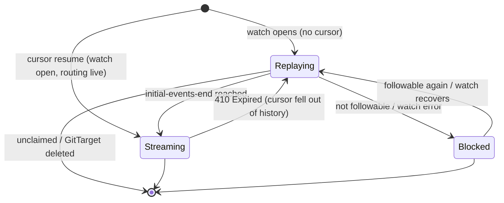

# Stream-readiness status machine — design

> Status: design · Branch: `investigate` · Date: 2026-06-26
>
> Implements the direction in
> [per-type-streaming-readiness-plan.md](./per-type-streaming-readiness-plan.md),
> which fixes
> [watch-replay-watermark-stream-readiness-investigation.md](./watch-replay-watermark-stream-readiness-investigation.md).
>
> **Supersedes** the `Synced` condition, the `materialization` counts, and the
> `Pending / Initializing / Synced / Degraded` phase set in
> [status-design-git-target.md](../status-design-git-target.md) §3.1–§3.3. Those were
> designed around an audit-tail checkpoint (`checkpointRV != ""`); watch-first with
> cursor resume collapses "has a checkpoint" and "is live" into one transition, so the
> two models should not coexist.

This operator does the reverse of GitOps: it **streams events from the kube-apiserver
into Git**. The user-facing question this design answers is "are the streams ready?" —
and it is named so that a `kubectl get` reader is never misled.

## 1. Naming & convention rationale (read this first)

Held against the Kubernetes API conventions, not naming taste:

- **Conditions are the contract; `phase` is not.** API conventions discourage new
  APIs from leaning on a `phase` enum; clients should watch specific **conditions**.
  We keep the existing informational `status.phase` but it is **out of this contract**
  and **off the printer columns** — automation gates on conditions only.
- **`StreamsReady`, not `Streaming` / `Live` / `Read`.** `Read` collides with
  get/list/watch and RBAC read; `Live` reads as a liveness probe and is vague ("live
  *what*?"). `StreamsReady` says exactly what is true: the per-type streams from
  kube-api to Git are ready to carry live, attributable events.
- **`Replaying`, not `Reconciling`.** "Reconciling" means "drive actual state toward
  spec" in operator land; here the state is literally the `SendInitialEvents` *replay*
  in flight, so `Replaying` names the mechanism and avoids the collision.
- **`Blocked` is a first-class state, not a hidden count.** A type that cannot be
  watched (RBAC/discovery) is not "replaying" — it is stuck. It gets its own state
  and its own count so degraded cases are honest.
- **`reason` is a concise CamelCase category; `message` is human.** Per conventions.
- **`Unknown` is applied deliberately**, not by omission.
- **Status stays bounded.** A CRD is not an event database; counts + a *capped*
  diagnostic sample only.

## 2. The machine

### 2.1 States (per `(GitTarget, type)`)

Two happy-path states plus an honest dead-end:

| State | Meaning | A write to this type, observed now, becomes… |
| --- | --- | --- |
| `Replaying` | the `SendInitialEvents` replay is in flight — first replay, or a fresh replay after `410 Expired`. | folded into the **unattributed baseline** (no per-event commit, committer identity) |
| `Streaming` | the watch crossed `initial-events-end`, or resumed from a durable cursor, and is routing live events. | a **live, per-event, attributable** commit |
| `Blocked` | the type cannot be watched (not followable / RBAC) or the watch keeps erroring; it can never reach `Streaming` until the cause clears. | nothing — there is no working stream |

### 2.2 Transitions (total function)



Every trigger already exists in
[target_watch.go](../../../internal/watch/target_watch.go); the machine only *names*
them:

- `Replaying → Streaming`: `foldTargetReplayEvent` sees the `initial-events-end`
  bookmark ([target_watch.go:414-420](../../../internal/watch/target_watch.go#L414-L420)),
  `handleTargetWatchSessionEvent` flips `replaying = false`
  ([target_watch.go:380-398](../../../internal/watch/target_watch.go#L380-L398)).
- `[*] → Streaming` (resume): `targetWatchResumeAndStream`
  ([target_watch.go:299-326](../../../internal/watch/target_watch.go#L299-L326)).
- `Streaming → Replaying`: `errTargetWatchExpired` on a `410`
  ([target_watch.go:520-525](../../../internal/watch/target_watch.go#L520-L525)).

### 2.3 Reasons

`reason` is the machine-readable cause; `message` holds human detail.

Per-type reason (drives the type's contribution to the roll-up):

| Reason | State |
| --- | --- |
| `InitialReplay` | Replaying (first replay) |
| `ResumeReplay` | Replaying (re-replay after `410`) |
| `ExpiredResourceVersion` | Replaying (the `410` that caused the re-replay) |
| `WatchNotPermitted` | Blocked (no list/watch verb — RBAC/discovery) |
| `WatchError` | Blocked (watch fails to open/stay open) |

Aggregate `StreamsReady` condition reason (strongest cause wins, in this order):

| Reason | Condition | When |
| --- | --- | --- |
| `WatchNotPermitted` / `WatchError` | `False` | ≥1 type Blocked |
| `Replaying` | `False` | ≥1 type Replaying, none Blocked |
| `NoResolvedTypes` | `False` | the target/rule resolves 0 types |
| `AllStreamsReady` | `True` | every type Streaming |
| `NotReady` | `Unknown` | `Ready=False` (see §4) |

### 2.4 Invariants ("a well-designed machine")

1. **Single source of truth.** The `watch.Manager` owns per-`(gitDest, gvr)` state;
   controllers *project* it, they do not run a parallel machine.
2. **Total function.** Every `(state, event)` is defined; unknown watch events hold
   state.
3. **Monotonic within a replay session.** `StreamsReady` only moves backward via an
   explicit reset (`410`), so "wait until `StreamsReady=True`, then act" has no gap.
4. **Independent of `Ready`.** A large watched set may sit at `Ready=True,
   StreamsReady=False` while it catches up. Neither gates the other.
5. **Bounded status.** No full per-type list; counts + a capped sample only.

## 3. Status surface

### 3.1 GitTarget — aggregate only

```go
// GitTargetStatus (additions; removals in §6)
type GitTargetStatus struct {
    // ...existing: observedGeneration, conditions, phase (informational only),
    // lastReconcileTime, lastPushTime...

    // Streams is the bounded data-plane roll-up over this GitTarget's tracked types.
    // Counts, never a per-type list, so it stays bounded however many types are watched.
    // +optional
    Streams *GitTargetStreamsStatus `json:"streams,omitempty"`
}

type GitTargetStreamsStatus struct {
    // Summary is the display-only ratio, e.g. "5/5". Printer-column source.
    Summary string `json:"summary,omitempty"`
    // Total is how many types this target tracks.
    Total int32 `json:"total"`
    // Ready is how many are Streaming (past their replay watermark).
    Ready int32 `json:"ready"`
    // Replaying is how many are still (re)replaying.
    Replaying int32 `json:"replaying"`
    // Blocked is how many cannot be watched (not followable / watch error).
    Blocked int32 `json:"blocked"`
    // ObservedTime is when this roll-up was computed.
    ObservedTime *metav1.Time `json:"observedTime,omitempty"`
}
```

Condition `StreamsReady`: `True` iff `Total > 0 && Ready == Total`; otherwise `False`
(or `Unknown`) with the §2.3 reason.

Example — replaying:

```yaml
status:
  conditions:
    - type: Ready
      status: "True"
      reason: Ready
    - type: StreamsReady
      status: "False"
      reason: Replaying
      message: "3/5 streams ready; 2 replaying (configmaps, secrets)"
  streams: { summary: "3/5", total: 5, ready: 3, replaying: 2, blocked: 0 }
```

Example — ready (the state e2e waits for):

```yaml
status:
  conditions:
    - type: Ready
      status: "True"
      reason: Ready
    - type: StreamsReady
      status: "True"
      reason: AllStreamsReady
      message: "5/5 streams ready"
  streams: { summary: "5/5", total: 5, ready: 5, replaying: 0, blocked: 0 }
```

Example — blocked (honest, not pretending to catch up):

```yaml
status:
  conditions:
    - type: StreamsReady
      status: "False"
      reason: WatchNotPermitted
      message: "4/5 streams ready; widgets.example.com blocked (no list/watch verb)"
  streams: { summary: "4/5", total: 5, ready: 4, replaying: 0, blocked: 1 }
```

### 3.2 WatchRule / ClusterWatchRule — per-rule, bounded

Same shape, scoped to the types this rule resolves, plus a **capped** diagnostic
sample (the rule is where a wildcard can resolve to many types):

```go
type WatchRuleStreamsStatus struct {
    Summary    string `json:"summary,omitempty"` // "2/2"
    Total      int32  `json:"total"`
    Ready      int32  `json:"ready"`
    Replaying int32  `json:"replaying"`
    Blocked    int32  `json:"blocked"`
    // PendingSample is a BOUNDED sample of types not yet ready, for diagnosis on
    // wildcard rules. Never the full list.
    // +kubebuilder:validation:MaxItems=5
    PendingSample []string `json:"pendingSample,omitempty"`
    ObservedTime  *metav1.Time `json:"observedTime,omitempty"`
}
```

Condition `StreamsReady`: `True` iff every resolved type is `Streaming` for its target.

Example — a wildcard `ClusterWatchRule` mid-replay (note the capped sample, not 212
names):

```yaml
status:
  conditions:
    - type: Ready
      status: "True"
      reason: Resolved
      message: "212 resources resolved"
    - type: StreamsReady
      status: "False"
      reason: Replaying
      message: "180/212 streams ready; 32 replaying"
  streams:
    summary: "180/212"
    total: 212
    ready: 180
    replaying: 32
    blocked: 0
    pendingSample: [deployments, statefulsets, daemonsets, jobs, cronjobs]  # capped at 5
```

### 3.3 Printer columns

The ratio cannot be computed in a JSONPath, so it lives in the precomputed
`status.streams.summary` string. `phase` is **not** a column (it is not the contract).

**GitTarget** (replaces the current `Phase`/`Status` columns; keep `Provider`/`Branch`):

| Column | JSONPath |
| --- | --- |
| `PROVIDER` | `.spec.providerRef.name` |
| `BRANCH` | `.spec.branch` |
| `READY` | `.status.conditions[?(@.type=="Ready")].status` |
| `STREAMSREADY` | `.status.conditions[?(@.type=="StreamsReady")].status` |
| `STREAMS` | `.status.streams.summary` |
| `REASON` | `.status.conditions[?(@.type=="StreamsReady")].reason` |
| `AGE` | `.metadata.creationTimestamp` |

```text
NAME              READY   STREAMSREADY   STREAMS   REASON              AGE
signing-overlap   True    True           5/5       AllStreamsReady     3m
commit-author     True    False          3/5       Replaying          12s
bad-rbac-target   True    False          4/5       WatchNotPermitted   2m
```

**WatchRule / ClusterWatchRule** (add `STREAMSREADY` / `STREAMS` / `REASON`; keep
`Target`/`Ready`/`Age`):

| Column | JSONPath |
| --- | --- |
| `TARGET` | `.spec.targetRef.name` |
| `READY` | `.status.conditions[?(@.type=="Ready")].status` |
| `STREAMSREADY` | `.status.conditions[?(@.type=="StreamsReady")].status` |
| `STREAMS` | `.status.streams.summary` |
| `REASON` | `.status.conditions[?(@.type=="StreamsReady")].reason` |
| `AGE` | `.metadata.creationTimestamp` |

## 4. The wait contract

`StreamsReady=True` **promises**: every tracked (or resolved) followable type's watch
has crossed its `initial-events-end` watermark — or resumed from a durable cursor with
the watch open and live routing active — and is routing through
`routeLiveTargetWatchEvent`
([target_watch.go:533](../../../internal/watch/target_watch.go#L533)). Any write issued
to those types **after** observing `StreamsReady=True` is delivered as a live, per-event
event and offered to the attribution resolver
([author_resolver.go](../../../internal/watch/author_resolver.go)) — never folded into
the unattributed baseline.

The contract is **"post-gate writes are handled as live events," not "zero lag."** A
cursor resume may set `StreamsReady=True` as soon as the watch is open and routing from
the durable cursor; it does **not** require a fresh post-resume bookmark, because the
guarantee is about per-event delivery, not catch-up to the apiserver's current `rv`.

### 4.1 The wait blocks — it does not fail fast

`kubectl wait --for=condition=StreamsReady=true gittarget/<name> --timeout=120s`
**blocks** — it watches the object and returns the moment the condition flips `True`,
or errors only when `--timeout` elapses. It does **not** error on `Unknown` or `False`;
it waits *through* them. So a target that is still replaying for 30s simply makes the
wait sit for ~30s and then succeed — exactly the gate e2e wants.

The condition must be **present from the first reconcile** for this to hold: some
`kubectl` versions error immediately if the condition *type is absent* from the object
when the wait starts. That is the entire reason we **apply** `StreamsReady` early —
`Unknown` / reason `NotReady` while `Ready=False`, then `False` / `Replaying`, then
`True` / `AllStreamsReady`. Applying it (never omitting it) is what *guarantees the
clean blocking wait*; the earlier "fail fast" framing was wrong — the goal is a wait
that blocks reliably, not one that returns early.

Waiting for **all** targets/rules at once is a single command —
`kubectl wait --for=condition=StreamsReady=true gittarget --all --timeout=120s`, or a
list of names — and because `StreamsReady` is monotonic within a session (§2.4), none
can flip back to ready-then-not between the wait returning and the test acting.

## 5. e2e usage

```go
createGitProvider(...); createGitTarget(...); applyWatchRule(...)
waitForStreamsReady(name, ns)   // kubectl wait --for=condition=StreamsReady=true gittarget/<name>
// only now create the objects whose per-event/attribution behaviour is asserted
```

`waitForWatchRuleStreamsReady` is the type-scoped variant. `Synced` /
`waitForGitTargetSynced` are removed (§6). Every spec asserting live/attributed/ordered
behaviour adopts this shape (plan §6).

## 6. Source code this lets us throw away

Watch-first already made much of the checkpoint machinery vestigial. **Safe to delete
now:**

- `Manager.RestoreSyncedCheckpoint` + `Materializer.RestoreSynced`
  ([materialization.go:103-112](../../../internal/watch/materialization.go#L103-L112))
  — self-described "harmless compatibility hook"; watch-first restores nothing.
- `GitTargetMaterializationSummary`'s `Failing` / `NotFollowable` /
  `FailingNoCheckpoint` fields and the 5-count `GitTargetMaterializationStatus`
  ([materialization.go:114-141](../../../internal/watch/materialization.go#L114-L141),
  [gittarget_types.go:128-159](../../../api/v1alpha3/gittarget_types.go#L128-L159))
  — under watch-first `MaterializationSummaryForGitTarget` already computes
  `Claimed == Synced == len(types)`; the rest is dead. Replace with `streams` (§3.1).
- The `Synced` condition, the `Initializing`/`Synced` phases, and the §3.2
  serviceability + no-flap-on-re-anchor predicate in `status-design-git-target.md`.
  That predicate only existed to stop the ~1h `Synced→Resyncing→Synced` re-anchor from
  flapping; **watch-first with cursor resume has no periodic full re-anchor**, so the
  whole anti-flap apparatus is unnecessary — `StreamsReady` flaps only on a real `410`.
- `waitForGitTargetSynced` ([e2e_test.go:235](../../../test/e2e/e2e_test.go#L235)) →
  `waitForStreamsReady`.

**Bigger collapse — evaluate, don't blind-delete:** the `Materializer` `Phase` enum
([materializer.go:57-78](../../../internal/typeset/materializer.go#L57-L78)) has six
checkpoint phases. The **demand/claim/followability** half is still needed (it decides
*which* types to watch and feeds the `Blocked` state); the **checkpoint** half
(`Syncing`/`Resyncing`/`Failing` + `checkpointRV` + `RestoreSynced`) maps onto the
three-state model and is a strong deletion candidate — **iff** the audit-tail
checkpoint path is being retired for watch-first. Confirm no remaining caller before
removing; if the audit path stays for provenance mode, keep it but stop projecting it
into GitTarget status.

Net: one condition (`StreamsReady`) + one 4-count roll-up replace one condition
(`Synced`), a 5–6-field roll-up, a serviceability predicate, and an anti-flap rule.

## 7. Start simple, keep room to grow

Ship the minimum: the `StreamsReady` condition + the `streams` roll-up
(`total`/`ready`/`replaying`/`blocked`/`summary`) on GitTarget, and the matching
condition on WatchRule. The shape leaves room to elaborate **without breaking the
contract**, e.g. later adding per-type `lastTransitionTime`, an observed watermark
`rv`, or `blocked` sub-reasons — all additive `status` fields, never a change to what
`StreamsReady=True` means.

## 8. Open questions

1. **`pendingSample` cap** — 5 to start (schema-enforced); revisit if operators want
   more on huge wildcard rules.
2. **Non-test consumers** — is `StreamsReady` a guarantee HA hand-off / external
   automation may rely on, or documented as best-effort outside e2e?
3. **`Blocked` granularity** — keep `WatchNotPermitted` vs `WatchError` as the only two
   block reasons to start, or split discovery-missing from RBAC-denied later?
