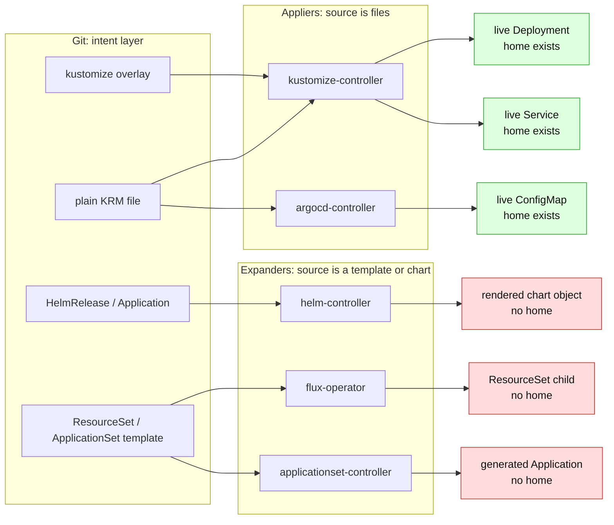

# The support boundary: what GitOps Reverser edits, and what it refuses

> **design** — the reasoning behind the operator's acceptance boundary. Captured 2026-07-06.
>
> **New here? Read [support-contract.md](support-contract.md) first** — it is the one
> page that states what we support, what we refuse, and why. Every other doc in this
> folder *argues for* one of those verdicts. This README separates shipped behaviour
> from the target boundary; the provenance and Helm-chart detection gates described
> below are not implemented yet.

## The folder, by topic

| Topic | Docs |
|---|---|
| **The boundary** | [support-contract.md](support-contract.md) — the single statement · [kustomize-support-boundary.md](kustomize-support-boundary.md) — field taxonomy + layout allowlist · [gittarget-granularity-and-cross-environment-edits.md](gittarget-granularity-and-cross-environment-edits.md) — **the write boundary; the one home of fan-in = 1** |
| **Renderers & provenance** | [render-attribution.md](render-attribution.md) — attribution and verification · [render-root-scoping.md](render-root-scoping.md) — render roots and the oracle · [render-fidelity.md](render-fidelity.md) — **our render is not the orchestrator's; refuse where they diverge** · [render-fidelity-scenarios.md](render-fidelity-scenarios.md) — red-first fidelity fixtures + the folder-gate state matrix · [kustomize-token-writeback-explained.md](kustomize-token-writeback-explained.md) — teaching explainer: the `${...}` writeback problem, the tried simplifications, and the managedFields question · [renderer-abstraction-idea.md](renderer-abstraction-idea.md) — exploration: a pluggable renderer seam (`Owns` + blind spots), starting with FluxKustomize · [kpt-and-krm-functions.md](kpt-and-krm-functions.md) — how Kpt packages, setters, and KRM functions may fit safely |
| **Orchestrators & expansion** | [orchestrator-knowledge-boundary.md](orchestrator-knowledge-boundary.md) — renderability vs ownership; claims about paths · [expansion-boundary-and-corpus-organisation.md](expansion-boundary-and-corpus-organisation.md) — provenance; ApplicationSet vs ResourceSet; Helm · [`../../facts/expansion-provenance-markers.md`](../../facts/expansion-provenance-markers.md) — **the measured markers** · [argocd-bi-directional.md](argocd-bi-directional.md) — why `selfHeal` is incompatible |
| **Documents & secrets** | [resource-capability-model.md](resource-capability-model.md) — what may I do to this document · [write-only-encrypted-secrets.md](write-only-encrypted-secrets.md) — SOPS · [sealed-secrets-and-external-secrets.md](sealed-secrets-and-external-secrets.md) |
| **Edits with no home** | [unreflectable-edits-and-write-gating.md](unreflectable-edits-and-write-gating.md) — tier-1/2/3 accounting · [admission-consent.md](admission-consent.md) — say yes to a blast-radius refusal · [orchestrator-reconcile-trigger.md](orchestrator-reconcile-trigger.md) — revert a refusal / order around origin drift |
| **Discovery (read-only)** | [repo-discovery-and-onboarding-scan.md](repo-discovery-and-onboarding-scan.md) |
| **Shipped** | [finished/images-and-replicas-edit-through.md](finished/images-and-replicas-edit-through.md) · [finished/higher-level-krm-documents.md](finished/higher-level-krm-documents.md) |
| **Evidence** | [`test/fixtures/gitops-layouts/`](../../../test/fixtures/gitops-layouts/) — the corpus of real-world repo shapes, and the generated behavioural baseline beside it |
| **Foundations** | [current-manifest-support-review.md](../../spec/current-manifest-support-review.md) · [contextual-namespace-and-kustomize-folder-editing.md](../../spec/contextual-namespace-and-kustomize-folder-editing.md) · [gittarget-new-file-placement-rules.md](../../spec/gittarget-new-file-placement-rules.md) |

## What the operator is for

A user points GitOps Reverser at a Git folder holding **Kubernetes Resource Model (KRM)
documents** — core resources, custom resources, simple Kustomize folders, and
higher-level intent documents such as a Flux `HelmRelease`, an Argo CD `Application`, a
KRO `ResourceGraphDefinition`, or a Crossplane claim. The user edits those resources
through the Kubernetes API, and the operator writes the changes back to a named branch.

The operator's job stops at the branch. It watches live state, edits the folder the way
a careful human would — in place, comment-preserving, refusing what it cannot own —
pushes to a named branch, and exposes pollable status (`CommitRequest` `Pushed=True` +
`status.sha` + `status.branch`). It never gains Git-host knowledge: no GitHub or GitLab
API calls, and no pull requests. A tool built on top of the operator owns session and
branch lifecycle, PR creation, and any UI.

Repo-wide *discovery* is likewise not the operator's job. A `GitTarget` is told exactly
one subtree and never goes looking for others. Enumerating candidate targets across a
whole repository is a read-only capability of the `manifest-analyzer` CLI and the public
[`pkg/manifestanalyzer`](../../../pkg/manifestanalyzer) library, which write nothing and
need no cluster — see
[repo-discovery-and-onboarding-scan.md](repo-discovery-and-onboarding-scan.md).

## The governing rule

The target boundary answers one question:

> **Does this live object have exactly one home in Git?**

If yes, GitOps Reverser mirrors it and writes edits back to that home. If no, the object
is expansion output, shared context, machine-written Git, or opaque content — and the
target operator behaviour is to refuse or withhold it for a specific, named reason.
The provenance gate required for controller-expanded objects is not implemented yet;
the current runtime can still mirror them after sanitization removes their evidence.

The same rule governs ordinary write fan-in: a source document shared by more than one
render root is read-only context, because changing it would change more than one thing.
Lossy or one-way constructs — arbitrary patches, generator outputs, name prefixes, Helm
inflation, controller-expanded children — stay out of the write path.

Two consequences are worth stating plainly, because both are routinely misread:

**Higher-level documents are in scope as KRM, not as special cases.** "No Helm" is true
of *inflation*: `helmCharts` is refused and we never render a chart. But a Flux
`HelmRelease`, an Argo CD `Application`, a KRO `ResourceGraphDefinition`, a Crossplane
claim, or a plain `Deployment` is just a KRM document. Editing the intent document is in
scope; editing the objects that document expands is not. Bumping a chart version or
changing inline values on a `HelmRelease` is ordinary KRM editing; editing a chart's
`templates/`, or a live object rendered from a chart, stays refused.

**Generator-enumerated repositories are recognised and refused explicitly.**
ApplicationSet `git.directories` and `ResourceSetInputProvider` make "create a folder"
part of desired state. In such a repository, authoring a CR as well can create a
duplicate object that fights the generator, while omitting it would be wrong in an
ordinary layout. The operator therefore refuses "add an app" for an `EnumeratedBy` shape
rather than guessing.

## What works today

- **Raw-YAML folders** (explicit namespaces): in-place, comment-preserving edits;
  match-first placement; mark-and-sweep resync.
- **Single-context Kustomize folders** (`namespace:` + `resources:`/`bases`, local files
  and child-directory bases): graph-aware namespace inference; inherited namespaces are
  kept out of the file bytes on write.
- **Kustomize `images:` / `replicas:` edit-through** — a live change produced by an
  override entry is written back to that entry, never through into the source manifest
  ([finished/images-and-replicas-edit-through.md](finished/images-and-replicas-edit-through.md)).
- **Render-fidelity token gate** — parsed `${...}` values are compared with live state before a
  write. A mismatch refuses the operation and makes the independent
  `RenderMatchesLive=False` condition close normal writes until a fresh complete watch epoch is clean
  ([render-fidelity.md](render-fidelity.md)). Remote-Git revision detection and automatic recovery after
  a Git repair remain unbuilt.
- **Higher-level KRM documents** (Flux `HelmRelease`, Argo CD `Application`, KRO
  resources) mirror and edit exactly like core resources — the pipeline is kind-agnostic,
  and is pinned by a corpus plus a HelmRelease mirror+edit e2e
  ([finished/higher-level-krm-documents.md](finished/higher-level-krm-documents.md),
  [installing-apps-as-krm.md](../../installing-apps-as-krm.md)).
- **New-file placement** — sibling inference plus a `spec.placement` template, so a new
  resource lands in the folder's convention rather than a canonical REST path, including
  the `resources:` entry when the target folder carries a kustomization
  ([gittarget-new-file-placement-rules.md](../../spec/gittarget-new-file-placement-rules.md)).
- **Branch writing**: `GitTarget.spec.branch` (immutable, glob-authorized via
  `GitProvider.spec.allowedBranches`); `CommitRequest` as the per-save control surface
  with terminal `Pushed=True` + SHA.
- **Refusals**: unsupported kustomize features, duplicate identities, impure or foreign
  content — refuse first, never mis-edit.
- **The two-layer write boundary**, enforced as write-plan preconditions before any byte
  is written: **L1** — no write leaves `spec.path` (reads may, writes never); **L2** — no
  in-place edit of a source file that more than one kustomize render path reaches with
  override entries at stake (write-fan-in = 1). A violation aborts the whole flush,
  commits nothing, and fails the GitTarget with `GitPathAccepted=False` / reason
  `WriteBoundaryRefused` — on the live-event path as well as on resync. Specified in
  [gittarget-granularity-and-cross-environment-edits.md §1](gittarget-granularity-and-cross-environment-edits.md).
  The refusal is target-level; the per-edit `FullyReflected` accounting that would name
  each dropped edit is designed and unbuilt
  ([unreflectable-edits-and-write-gating.md](unreflectable-edits-and-write-gating.md)).
- **Repo-wide read-only reports**: `ScanRepo` / `manifest-analyzer --mode scan-repo`
  classify candidate folders and feed the generated
  [`test/fixtures/gitops-layouts/support-today.md`](../../../test/fixtures/gitops-layouts/support-today.md)
  baseline. It reports; it does not propose CRs.

## Known boundary: what stays refused

Classic base + per-environment overlay repositories are refused today on two independent
gates: any overlay feature outside the supported subset (`patches*`, generators,
`components`, `namePrefix`/`nameSuffix`, Helm, remote bases), and multi-root namespace
fan-out over a shared base (`ambiguous-namespace`).

The *feature* half of that is the permanent part of the contract. `patches*`, generators,
`components`, name prefixes, Helm rendering, and remote bases refuse the folder because
they are structurally non-invertible or would make an edit ambiguous — not because the
work is unfinished. The taxonomy that decides which is which is
[kustomize-support-boundary.md §1](kustomize-support-boundary.md).

The *layout* half is where the boundary can still move: render-root scoping would let an
un-fancy base+overlay folder (per-overlay `namespace` + `resources`/`images`/`replicas`)
be accepted, with new overlay-local KRM added to `resources:` and the base read-only
always. That is designed, not shipped. A per-environment edit of a base-owned *field* —
the `kubectl set env` case — has no legal destination without operator-authored patches;
today it is *prevented* rather than written into the base, and the GitTarget is failed
with `WriteBoundaryRefused`.

The expansion boundary is separate from the Kustomize boundary. A `HelmRelease`,
`ApplicationSet`, `ResourceSet`, KRO graph, or Crossplane composition can itself be an
editable KRM document, but its materialised objects are **intended not to be mirrored**
unless they have their own file home in Git. That is not enforced yet: the derived-object
gate cannot key on `ownerReference` alone, and must instead be a provenance claim over
live objects taken before sanitization
([`../../facts/expansion-provenance-markers.md`](../../facts/expansion-provenance-markers.md)).

Helm charts should be skipped as a unit, including `crds/`, once chart-folder detection
lands. Today `scan-repo` can report a chart's incidental `crds/` directory as "one
supported folder"; that known report bug is captured in the layout corpus.
