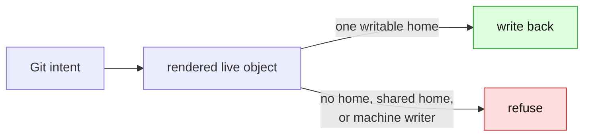

# Support boundary

> **Current status:** [support-contract.md](support-contract.md) is the single source of
> truth. This page is the short map: it separates shipped behaviour, active design work,
> and historical implementation records.

GitOps Reverser edits the Git document that a careful human would edit. The target
boundary refuses controller-expanded output, shared source context, machine-written paths,
and a construct whose change cannot be expressed in one owned document. Provenance and
machine-writer enforcement are still planned; the contract labels those rows explicitly.

## Start here

- [Support contract](support-contract.md) — current verdicts for every supported and
  refused construct.
- [Kustomize support boundary](kustomize-support-boundary.md) — field taxonomy and
  accepted layouts.
- [Render-root scoping](render-root-scoping.md) — how an external-base overlay is
  rendered safely while the base remains read-only.
- [GitTarget granularity](gittarget-granularity-and-cross-environment-edits.md) — the
  sole definition of the L1 filesystem and L2 fan-in write boundary.

## What is shipped

| Shape | Current behaviour |
|---|---|
| Plain KRM and higher-level KRM documents | Editable in place, preserving document form where possible. A `HelmRelease`, `Application`, KRO resource, or Crossplane claim is ordinary intent-layer KRM. |
| Self-contained Kustomize | Local `resources`, `namespace`, `images`, and `replicas` are supported. Image and replica changes write to their declaring entry. |
| External-base overlay | The overlay may read `../../base` as context, but writes remain inside the target overlay. Existing overlay-local documents and declared image/replica entries are editable; a brand-new object is created as an overlay-local file registered in the overlay's own `resources:`; and changing a base-supplied image/replica in one environment **authors a new `images:`/`replicas:` entry** in the overlay. Other base-owned fields are refused. |
| Path-based strategic-merge patch | The render is accepted; the patch is read-only context. We tolerate it but do not author or edit patches yet. |
| Render verification | A proposed batch is built with kustomize before any bytes are written. Mismatch or blast-radius change refuses the flush. |
| Write boundary | Writes never leave `spec.path`, and a file read by more than one render root is never edited in place. |
| Foreign-content boundary | A GitTarget subtree is operator-exclusive: loose scripts, binaries, and symlinks refuse the folder. Inert repo-hygiene passengers — documentation (`*.md`), a license, and `.gitignore`/`.gitattributes`/`.gitkeep` — are accepted so adopting an existing repo does not stall on them. Anything else is named in a root `.gittargetignore`. |

Three overlay capabilities are now shipped and verified by re-render: creating a **new object**
(an overlay-local file plus its `resources:` entry); **authoring a missing `images:`/`replicas:`
entry** when a base-supplied image or replica count is changed in one environment; and
**`$patch: delete`** for an object the overlay inherits from its base — so editing a specific
environment adds the override, or the deletion, for you. The remaining overlay gap is a
strategic-merge patch for a base-owned *field* that is not an image, replica, or whole-object
delete. `scan-repo` likewise still labels external-base overlays as unsupported while its
discovery classification catches up with the runtime.

## Active design work

| Question | Design record |
|---|---|
| Operator-authored patches for base-owned fields | [Patch authoring](patch-authoring.md) |
| Render attribution and proof | [Render attribution](render-attribution.md), [render fidelity](render-fidelity.md) |
| Out-of-folder Flux/Argo render context | [Render fidelity](render-fidelity.md) |
| Controller-expanded resources and provenance | [Expansion boundary](expansion-boundary-and-corpus-organisation.md), [orchestrator knowledge](orchestrator-knowledge-boundary.md) |
| Kpt packages and KRM functions | [Kpt and KRM functions](kpt-and-krm-functions.md) |
| Secrets and other document capabilities | [Resource capability model](resource-capability-model.md), [write-only encrypted secrets](write-only-encrypted-secrets.md) |

## Permanent refusals

We do not inflate Helm charts, execute Kustomize plugins, resolve remote bases, or edit
generator output. Paths with another writer and controller-generated children are also target
refusals, but their provenance/ownership enforcement remains planned. The support contract
distinguishes those planned gates from the permanent construct boundary.

## Reference library

- [Repository discovery](repo-discovery-and-onboarding-scan.md) — read-only onboarding report.
- [Renderer abstraction](renderer-abstraction-idea.md) and
  [Kustomize token writeback](kustomize-token-writeback-explained.md) — exploratory and
  teaching records.
- [Admission consent](admission-consent.md), [unreflectable edits](unreflectable-edits-and-write-gating.md),
  and [reconcile trigger](orchestrator-reconcile-trigger.md) — write-gating decisions.
- Historical implementation records: [image/replica edit-through](finished/images-and-replicas-edit-through.md)
  and [higher-level KRM support](finished/higher-level-krm-documents.md).
- [Fixture corpus](../../../test/fixtures/gitops-layouts/) — executable evidence; its
  generated `support-today.md` is a scanner report, not the runtime contract.
