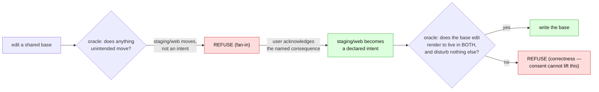
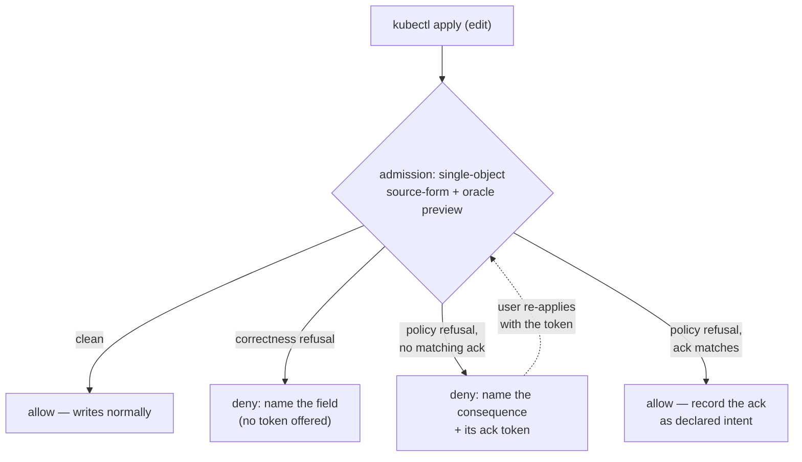

# Consent and the reconcile trigger: making a refused write a conversation, not a dead end

> **design** — direction-setting; ships no code. Nothing it describes is supported today.
> Captured: 2026-07-15
> Related:
> [README.md](README.md),
> [unreflectable-edits-and-write-gating.md](unreflectable-edits-and-write-gating.md) — **the tier-1/2/3 model this extends; tier 3 is the admission gate**,
> [orchestrator-knowledge-boundary.md](orchestrator-knowledge-boundary.md) — **the ownership model the reconcile trigger rides on**,
> [argocd-bi-directional.md](argocd-bi-directional.md) — why `selfHeal` must be off, and why that means nothing reverts a refused edit,
> [gittarget-granularity-and-cross-environment-edits.md](gittarget-granularity-and-cross-environment-edits.md) — the write boundary; fan-in = 1; base read-only by L1,
> [render-attribution.md](render-attribution.md) §5 — attribution may be heuristic, verification may not,
> [support-contract.md](support-contract.md)

Today a write the operator cannot place is refused — correctly — but the refusal is a **dead
end**: it happens late (at flush, not at the edit), it is invisible to the person who made the
edit (the API server already returned `200 OK`), and — in the one orchestrator configuration this
operator can actually run under — the rejected live edit is **never undone**.

This document turns that dead end into a conversation. It has two halves, and they compose:

1. **Consent.** Move the "no" to admission time, tell the actor *why*, and — for the class of
   refusal that is about blast radius rather than correctness — let them **acknowledge the
   consequence and proceed**. That is what opens the door to a deliberate multi-resource edit (a
   change to a shared base) that is refused today.
2. **The reconcile trigger.** Give the operator one new action — asking the GitOps orchestrator
   (Flux/Argo) to reconcile now — used two ways: to **revert a refused edit promptly** instead of
   leaving it as permanent drift, and to **order processing behind an incoming origin change**
   (reconcile Git → cluster first, then process our events).

Neither half is a correctness layer. The one correctness gate stays exactly where it is: the
flush-time render oracle ([`VerifyBatchRenders`](../../../internal/manifestanalyzer/render_verify.go)).
Everything here is about *feedback* and *loop responsiveness* — which is why every piece is allowed
to be optional, fail-open, and best-effort, and why the system underneath it must already be honest
without it (the fifth principle of
[unreflectable-edits-and-write-gating.md](unreflectable-edits-and-write-gating.md)).

---

## 1. The problem, stated as three separate failures

A user edits a live object through the Kubernetes API. The edit lands on the cluster. The operator
sees it, tries to place it in Git, and — because it edits a shared base, or a field a patch owns,
or would not converge — the flush-time oracle refuses. Nothing is committed; the GitTarget goes
`GitPathAccepted=False` / `WriteBoundaryRefused`. Correct. But:

- **It is late.** The refusal is a property of the *batch*, decided in
  [`writeBatch.flush`](../../../internal/git/plan_flush.go) after the commit window closes — seconds
  after the edit, on a different goroutine. By then the actor is gone.
- **It is silent to the actor.** `kubectl apply` returned success. The only record that the edit
  did not stick is a condition on a `GitTarget` the user may not even be watching. The person who
  can fix it is the last to hear.
- **It is never undone — under the config we require.** [argocd-bi-directional.md](argocd-bi-directional.md)
  proves that bi-directional editing only works with Argo `selfHeal: false` (with it on, Argo
  reverts the live edit sub-second from *cached* Git and thrashes against us). But `selfHeal` is the
  only thing that reverts live drift. With it off, a refused edit sits `OutOfSync` **forever**: the
  push webhook never fires (there was no push), and the 120 s poll re-resolves an *unchanged* Git and
  does nothing. Under Flux the story is milder but the same shape — drift is reverted only on the
  next interval reconcile (often minutes), never promptly.

So the refused edit is a silent, indefinite divergence between what the user did and what Git and
the orchestrator will enforce. The refusal was right; its *delivery* is the problem.

### What already exists, and what this builds on

This is not a greenfield. [unreflectable-edits-and-write-gating.md](unreflectable-edits-and-write-gating.md)
already frames three tiers of "no", and this document extends the top two:

| Tier | Scope | Status |
|---|---|---|
| **1. Onboarding refusal** | whole folder, structural | shipped (acceptance gate) |
| **2. Per-edit accounting** | one object/field, runtime | designed — the `FullyReflected` unreflected set |
| **3. Admission preflight** | one API request, pre-persistence | designed — opt-in, fail-open validating webhook |

Tier 3 as designed is **pure prevention**: it rejects an unsavable write with a named reason. This
document adds the two things tier 3 does not have — a way to *say yes anyway* (consent, §3–§4), and
a way to make the *outcome* immediate (the reconcile trigger, §5–§6).

---

## 2. Two kinds of "no", and only one of them is negotiable

Everything hinges on splitting the refusals into two piles, because consent is safe for exactly one
of them.

| | **Correctness refusal** | **Policy refusal** |
|---|---|---|
| The operator is saying | "this write does not reproduce what you asked, or corrupts an object you did not touch" | "this write does what you asked, but the blast radius is bigger than you may realize" |
| Example | the field is owned by a patch/transformer; the render does not converge; an unpairable list | the file is a **base shared by prod and staging** (fan-in > 1); the edit changes *both* |
| Decided by | the render oracle (`VerifyBatchRenders`) | the write-boundary policy (L2 fan-in = 1) |
| Consent can lift it? | **Never.** Consent cannot make a non-converging write converge. | **Yes** — *"I know it changes both; do it."* |

The correctness pile is the render oracle and it is absolute: a dyed render + a real re-render
either reproduce the live object and disturb nothing unintended, or they do not
([render-attribution.md §5](render-attribution.md)). No annotation changes physics.

The policy pile is different. Fan-in = 1 (never write a file more than one render root reaches)
makes a shared base read-only *because the user probably did not mean to change every environment
at once* — [gittarget-granularity-and-cross-environment-edits.md](gittarget-granularity-and-cross-environment-edits.md).
But **sometimes they do.** "Bump the base image for all environments" is a legitimate, ordinary
intent. Today it is refused with no way to express "yes, I mean the base." That is the door consent
opens.

---

## 3. Consent is declared intent, not a bypass

The temptation is to model consent as a `force: true` that skips a check. That is exactly wrong,
and the right model is already in the code.

The oracle ([`render_verify.go`](../../../internal/manifestanalyzer/render_verify.go)) checks two
things against a set of **`WriteIntent`s**: every intended document renders to its live object, and
**every object the batch did *not* declare an intent for comes out byte-identical**. A fan-in
refusal is really the second clause firing: editing the shared base moves `Deployment/web` in
*staging* too, and staging was never an intent, so the write "moves something it never set out to
write" and is refused.

**Consent adds the sibling object as an intent.** When the user acknowledges "this changes prod and
staging," the operator promotes staging's `Deployment/web` from the *must-be-untouched* set into the
*intended-to-change* set. Then the same oracle runs, unchanged, over the larger intent set — and it
still has to pass: the base edit must render to the acknowledged live state in **both** environments
and disturb nothing *else*. 

So consent does not remove a check. It **re-labels collateral as intent**, and the correctness gate
verifies the whole expanded intent exactly as before. There is no second code path, no bypass, and
no way for consent to wave through a write that does not actually converge.

### The token is scoped to a specific consequence, not to "off"

The acknowledgement must name *what* is being consented to, so it cannot become a standing "ignore
safety" flag:

- The operator computes the consequence — the concrete set of `(object, environment)` pairs a write
  would move — and reduces it to a **content hash**.
- Consent carries that hash. The operator honours it only when the *current* computed consequence
  hashes to the same value. Change the base differently, or let the tree drift, and the old
  acknowledgement no longer matches → the write is refused again, with the *new* consequence to
  acknowledge.

This is the same discipline the dye uses for attribution: consent to a **named, verified** fact, not
to a mood.

### Where the token lives

Two surfaces, both already "near the actor" per the write-gating doc's fourth principle, and both
already understood by the pipeline:

- **An annotation on the edited object** (`configbutler.ai/acknowledge-consequence: <hash>`). It
  travels with the `kubectl apply`, so consent is expressed in the same breath as the edit. It must
  be **stripped before mirroring**, exactly as [`sanitize`](../../../internal/sanitize/types.go)
  already strips orchestrator bookkeeping keys — a consent token is operator control data, never
  content that belongs in Git.
- **A field on the `CommitRequest`** — the object a caller already polls for `Pushed` + `status.sha`.
  This is the natural home for a *session-scoped* consent ("everything in this save window may touch
  the base"), and it composes with the `FullyReflected` condition tier 2 puts there.

### The edge consent must **not** cross: authorization

Consent lifts *"did you realize,"* never *"are you allowed."* A base shared across environments that
live in **one** GitTarget's authorization scope is fine — the acking user already owns all of it.
But a base shared across **different** GitTargets (different RBAC, different tenants) is the case
[gittarget-granularity-and-cross-environment-edits.md](gittarget-granularity-and-cross-environment-edits.md)
forecloses on purpose: a user who can edit prod must not change staging by editing the base, because
they may have no rights to staging. Consent from the prod editor cannot manufacture authority over
staging. So consent unlocks a shared-base edit **only within a single authorization scope**; across
scopes it stays refused, and the real route remains Option C (base-as-variant with its own GitTarget
and RBAC). This boundary is not negotiable by annotation either — it is the same class of "no" as
correctness.

---

## 4. The admission surface (extending tier 3)

Consent needs a synchronous surface, and admission is the only one: it is the sole point where the
user's intent can be accepted or rejected **whole, before persistence** — the exact property the
write-gating doc names as "the real argument for building [the gate]." The infrastructure exists:
the operator already runs admission webhooks ([`validate_operator_types_handler.go`](../../../internal/webhook/validate_operator_types_handler.go)),
and tier 3 already specifies the gate (opt-in per GitTarget, `failurePolicy: Ignore`, `--dry-run=server`
preflight). Consent adds one step to it:

Two honest limits, both already answered by the tier-3 design:

- **Admission sees one request; the oracle needs the batch.** The webhook can only run a
  *single-object preview* of the oracle (project this one object to source form, re-render, read the
  blast radius). It can be wrong — staleness, or cross-object batch effects it cannot see. That is
  tolerable because the gate is **fail-open and advisory**: a wrong *deny* is a retry, and a wrong
  *allow* is caught at flush by the real oracle. Admission is the UX; the flush is the authority.
- **Consent granted at admission does not bind the flush.** This is the load-bearing safety line.
  The flush-time oracle re-verifies the *whole batch* against the declared intents — including the
  consented ones — and still refuses if the consented set does not actually converge. So a stale or
  mistaken admission-time "yes" cannot cause a bad write. Worst case it lands, the flush refuses it,
  and §5's reconcile trigger reverts it — the same safety net that catches an edit made while the
  gate was disabled entirely.

---

## 5. The orchestrator reconcile trigger

The operator gains exactly one new outward action: **ask the orchestrator to reconcile now.** It is
small, and it is the piece that closes the loop.

### 5.1 Why it is necessary, not merely nice

Restate the §1 finding sharply: with Argo `selfHeal: false` — *required* for bi-directional to work
at all — **nothing reverts a refused edit.** It is `OutOfSync` until a human intervenes. Under Flux
it is reverted only on the next interval. So triggering a reconcile is not a speed optimization; for
Argo it is the *only* thing that ever undoes a refused edit, and for Flux it turns "minutes" into
"seconds."

And the operator is uniquely entitled to do it. [argocd-bi-directional.md](argocd-bi-directional.md)
identifies the missing ingredient precisely: a system that can *distinguish authorized drift from
unauthorized*, which Argo cannot (it "sees only the live object differs from cache"). **At refusal
time the operator has exactly that signal** — the refused edit is, by construction, the drift that
has no home in Git. So an operator-triggered reconcile of a refused edit is the **targeted, per-write
substitute for the blanket self-heal the operator had to switch off.** It realizes the one row that
doc leaves open: *"admission gate on Argo's writes → recovers revert-unauthorized."*

### 5.2 What "trigger" means, per orchestrator

The [orchestrator-knowledge-boundary](orchestrator-knowledge-boundary.md) rule is absolute here:
**never depend on the `argoproj` or `fluxcd` Go modules.** The trigger is a patch on an object,
matched by group+kind over `unstructured` — nothing more. But the two orchestrators differ, and the
difference matters:

- **Flux — clean.** Patch `reconcile.fluxcd.io/requestedAt` (a timestamp) on the governing
  `Kustomization`. Flux reconciles and server-side-applies desired state, which **reverts the drift**
  as a side effect. One annotation, correct outcome.
- **Argo — delicate.** A plain `argocd.argoproj.io/refresh` only re-reads Git and re-compares; with
  `selfHeal` off it will mark `OutOfSync` and **still not revert the drift.** Reverting requires an
  actual **sync operation** — i.e. a *deliberate, one-shot self-heal* of a known-unauthorized edit.
  That is a stronger action (it writes to the cluster), and it must be an explicitly granted
  authority, not an ambient one.

### 5.3 The prerequisite: this is the first *write* on the ownership model

The operator today **cannot name the Flux/Argo object that deploys a GitTarget's path.** A GitTarget
knows only `(provider, branch, path)`; there is no field, no lookup, and no code that reaches an
orchestrator object (confirmed across `internal/`, `api/`). That capability is designed but unbuilt:
[orchestrator-knowledge-boundary.md](orchestrator-knowledge-boundary.md) proposes per-orchestrator
*interpreters* (`internal/gitops/{flux,argocd}`) emitting **claims about paths** — e.g.
`RenderRootFor{path, by}` naming the object that renders a folder.

The reconcile trigger is the **first write action** built on that model, which until now is purely a
read/claim vocabulary. It needs one new claim — *"object O reconciles path P"* — and the ability to
patch O. So this feature does not stand alone: **it is gated on the ownership interpreters landing
first.** Stated as a dependency, not smuggled as an assumption.

### 5.4 The boundary: opt-in, and never on a mirror

Patching another controller's object, and (on Argo) issuing a sync, are boundary crossings. They are
off by default and enabled per GitTarget, alongside the tier-3 write gate — e.g. a
`spec.reconcileTrigger: Off | OnRefusal | OnDrift` knob. Two hard rules:

- **Never on a cluster the operator merely mirrors.** As with the write gate, we do not get to drive
  someone's orchestrator because our mirror is lossy. Only where the cluster is an *editing surface*
  whose changes are meant to flow to Git.
- **Absent orchestrator ⇒ no-op, not error.** If no interpreter claims the path, there is nothing to
  trigger; the operator falls back to today's behavior (report and wait). The trigger is an
  accelerator layered on top, exactly like the admission gate.

---

## 6. The second use: reconcile-before-process, as an ordering barrier

The same trigger answers a different, subtler problem: **origin moved under us.**

### 6.1 What is and isn't already handled

The commit direction is already safe against a moved remote. `PushAtomic`
([`git_atomic_push.go`](../../../internal/git/git_atomic_push.go)) is a compare-and-swap, never a
force-push; if the remote advanced, the push is rejected, and `pushPendingCommits`
([`branch_worker.go`](../../../internal/git/branch_worker.go)) **rebases by replay** — hard-reset the
local branch to the new tip, re-plan and re-commit the retained pending writes on top, re-push with
an updated CAS. So we never clobber someone else's push, and our own intent survives the rebase.

What is **not** handled is the *cluster* side. When origin gains new desired state, the orchestrator
is about to apply it, producing a flood of watch events. Two problems follow:

1. **The reconcile echo.** Those events came *from* Git via the orchestrator. If the operator
   processes them as user intent and mirrors them back, it is round-tripping the orchestrator's own
   apply into Git — noise at best, a fight at worst.
2. **The stale baseline.** The operator's model of "what this folder renders to" — the baseline its
   source-form projection and oracle judge against — was computed against the *old* tree. Decisions
   made for the transitional state (what to refuse, what to attribute) can be wrong until the cluster
   reflects the new origin.

### 6.2 The barrier

The fix is an ordering rule: **on origin drift, trigger the orchestrator to reconcile Git → cluster,
wait for it, and only then resume processing live events.** After the reconcile, the operator's own
mark-and-sweep resync absorbs the orchestrator's apply as a **no-op against the new tree**, instead
of mirroring it as intent.

This rides machinery that already exists. There is already a *reconcile-before-process* barrier: on
watch (re)establishment the operator enqueues a scoped mark-and-sweep ahead of live events, gated by
the `replaying` flag, all on one FIFO so order is preserved
([`target_watch.go`](../../../internal/watch/target_watch.go),
[`resync_flush.go`](../../../internal/git/resync_flush.go)). Two additions turn it into what we need:

- **A new trigger.** Origin-drift detection (the operator already has a cached remote-drift check,
  `SyncAndGetMetadata`) arms the same barrier.
- **A stronger wait.** The barrier's "reconcile" step must now include waiting for the *orchestrator*
  to apply Git → cluster — not only the operator's own sweep. This is where the §5 trigger and its
  ownership prerequisite are reused.

> **Terminology, because "reconcile" is overloaded and this doc would mislead without saying so.**
> There are two: the **orchestrator reconcile** (Flux/Argo applies Git → cluster — what this section
> triggers and waits on) and the operator's internal **resync** (a mark-and-sweep that rebuilds the
> Git-side model from the cluster — cluster → Git). The barrier *triggers the first* and *runs the
> second after it*. Where this doc means the internal one, it says "resync."

### 6.3 The hazard: pending intent vs. the reconcile that overwrites it

There is a real ordering trap, and it must be designed for, not discovered. When origin drifts, the
operator may be holding **uncommitted** pending intent — live edits captured in the open commit
window but not yet pushed. Triggering the orchestrator reconcile *now* would apply the new origin
over those live edits on the cluster, erasing them before they reach Git.

That is only safe because the intent is **durably captured** (the open window / `pendingWrites`) and
the commit side already rebases it onto a moved origin. So the barrier's ordering must be: **land
pending intent to Git first (rebased onto the new tip), *then* trigger the orchestrator reconcile,
*then* resume.** If capture were not durable, the reconcile would eat the user's edit — so the
barrier's safety rests on the durability the pipeline already has, and this dependency is a
precondition of the feature, stated as one.

---

## 7. How the three pieces compose

They are one escalation, each layer degrading safely to the one beneath it — the write-gating doc's
"correctness must not depend on optional layers," made concrete:

1. **Admission consent (§3–§4)** — the actor learns the consequence *before* persistence, and can
   consent to a *policy* consequence. Best case: the "no" never becomes a silent success.
2. **The flush oracle** — always runs, authoritative, unchanged. Consent only feeds it a larger
   declared-intent set; it never bypasses it. This is the one correctness gate.
3. **Tier 2 accounting** — whatever still could not be placed is reported (`FullyReflected=False`),
   never dropped silently.
4. **The reconcile trigger (§5)** — a refused edit that already landed is *reverted promptly*
   instead of lingering as permanent `selfHeal`-off drift.
5. **The barrier (§6)** — independently, origin drift orders the orchestrator's incoming apply ahead
   of our processing, so we never mirror a reconcile echo.

Turn every optional layer off and the system is still honest: the flush oracle refuses what does not
converge, tier 2 reports the residue, and the orchestrator (eventually, on its own clock) reconciles.
The layers here make that fast, visible, and — for the blast-radius case — *consensual*, without ever
being the thing correctness depends on.

---

## 8. Open questions

- **Consent surface and granularity.** Object annotation (per-edit, stripped like the sanitize
  deny-list) vs. `CommitRequest` field (per-window, already polled) vs. both. Per-consequence-hash
  scoping is the recommendation; a per-GitTarget "base edits allowed" mode is the blunt alternative
  and probably too blunt.
- **The Argo sync decision.** Reverting a refused edit needs a *sync operation*, not just a refresh —
  a deliberate one-shot self-heal. Is issuing it an authority the operator should hold, and how is it
  scoped so it can only ever revert the specific refused object, never sync the whole app?
- **Wait semantics for the barrier.** How long to wait for the orchestrator to finish reconciling;
  timeout and fallback (resume anyway? stay blocked?); how to observe "done" without depending on the
  orchestrator's Go types (its status conditions over `unstructured`).
- **The ownership prerequisite's shape.** The reconcile trigger needs one claim —
  *"object O reconciles path P"* — from the [orchestrator interpreters](orchestrator-knowledge-boundary.md).
  How confident must that claim be before the operator is willing to *write* (patch O) on the
  strength of it? A wrong claim triggers the wrong controller.
- **Does consent-to-edit-a-base earn a place in the support contract?** It is a genuinely different
  operation from per-environment patch authoring ("I mean the base" vs. "I mean this overlay"), and
  [support-contract.md](support-contract.md) should say so explicitly rather than leave it implied by
  the fan-in refusal being liftable.
