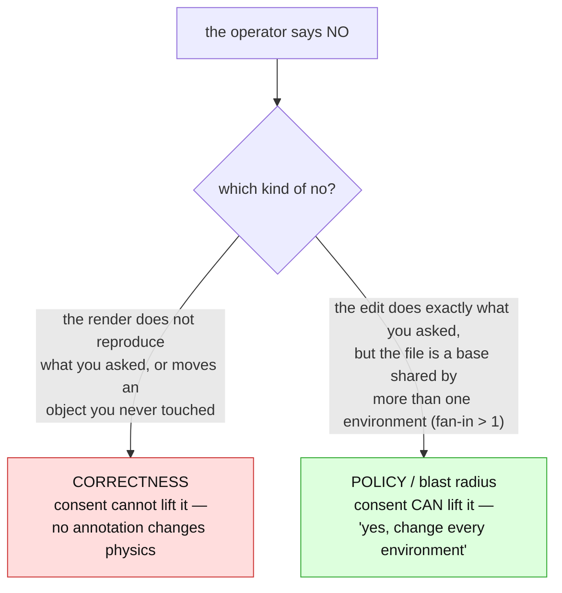
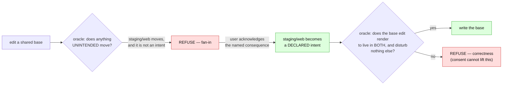
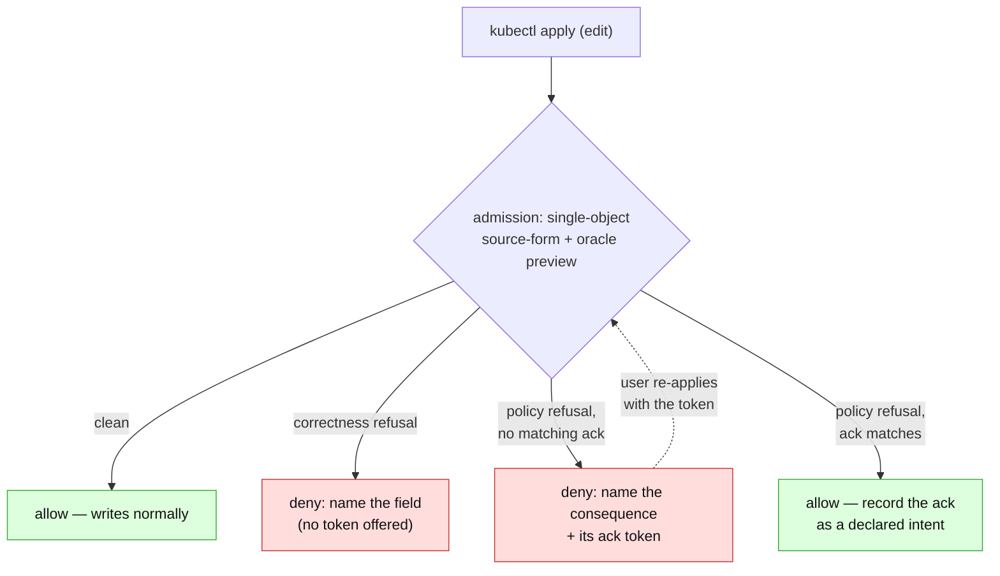

# Admission consent: a blast-radius refusal you can say yes to

> **design** — direction-setting; ships no code. Nothing it describes is supported today.
> Captured: 2026-07-15
> Related:
> [README.md](README.md),
> [unreflectable-edits-and-write-gating.md](unreflectable-edits-and-write-gating.md) — **the
> tier-1/2/3 model this extends; tier 3 is the admission gate**,
> [gittarget-granularity-and-cross-environment-edits.md](gittarget-granularity-and-cross-environment-edits.md)
> — the write boundary; fan-in = 1; base read-only by L1,
> [render-attribution.md](render-attribution.md) §5 — attribution may be heuristic, verification may not,
> [orchestrator-reconcile-trigger.md](orchestrator-reconcile-trigger.md) — **the sibling half: what
> reverts a refusal that lands anyway**,
> [support-contract.md](support-contract.md)

This is one half of a two-part design. This half is about turning a *refusal* into a *yes* at the
moment of the edit; the other half — [the reconcile trigger](orchestrator-reconcile-trigger.md) — is
about making the *outcome* of a "no" prompt and visible. They compose, but they are separate topics
and separate documents.

Today a write the operator cannot place is refused, correctly, but the refusal is **binary and
mute**. The user who edits a base shared by prod and staging is told "no" — at flush time, on a
`GitTarget` condition they may not be watching — with no way to say *"yes, I know it changes both;
that is what I meant."* Some refusals should never be lift­able. But that one should, and this
document is about the line between them.

---

## 1. The refusal is right, but there is no "yes"

An edit to a shared base is refused because fan-in = 1 makes shared context read-only
([gittarget-granularity-and-cross-environment-edits.md](gittarget-granularity-and-cross-environment-edits.md)):
changing one file would change what more than one environment renders. That rule exists because the
user *usually* did not mean to change every environment at once.

But sometimes they did. "Bump the base image for all environments" is an ordinary, legitimate
intent. Today it has no expression: the operator refuses it exactly as it refuses an accidental
cross-environment edit, because it cannot tell the two apart. The missing thing is not a weaker
rule — it is a way for the user to **declare which one this is.**

That declaration has to happen where the user is, and synchronously, which is why this rides the
**tier-3 admission gate** already designed in
[unreflectable-edits-and-write-gating.md](unreflectable-edits-and-write-gating.md) (opt-in per
GitTarget, `failurePolicy: Ignore`, `--dry-run=server` preflight). Tier 3 as written only *rejects*
an unsavable write. This adds the "yes."

---

## 2. Two kinds of "no", and only one is negotiable

Everything turns on splitting refusals into two piles, because consent is safe for exactly one.

| | **Correctness refusal** | **Policy refusal** |
|---|---|---|
| The operator is saying | "this does not reproduce what you asked, or corrupts an object you did not touch" | "this does what you asked, but the blast radius is bigger than you may realize" |
| Example | the field is owned by a patch/transformer; the render does not converge; an unpairable list | the file is a **base shared by prod and staging**; the edit changes *both* |
| Decided by | the render oracle (`VerifyBatchRenders`) | the write-boundary policy (L2 fan-in = 1) |
| Consent lifts it? | **Never.** | **Yes.** |

The correctness pile is the render oracle, and it is absolute: a dyed render plus a real re-render
either reproduce the live object and disturb nothing unintended, or they do not
([render-attribution.md §5](render-attribution.md)). No annotation makes a non-converging write
converge.

The policy pile is different — it is refused for the user's protection, not for physics. That is the
pile consent unlocks.

---

## 3. Consent is declared intent, not a bypass

The tempting model is a `force: true` that skips a check. That is exactly wrong, and the correct
model is already in the code.

The oracle ([`render_verify.go`](../../../internal/manifestanalyzer/render_verify.go)) checks two
things against a set of **`WriteIntent`s**: every intended document renders to its live object, and
**every object the batch did *not* declare an intent for comes out byte-identical**. A fan-in
refusal is really the second clause firing: editing the shared base also moves `Deployment/web` in
staging, staging was never an intent, so the write "moves something it never set out to write" and
is refused.

**Consent adds the sibling object as an intent.** When the user acknowledges "this changes prod and
staging," the operator promotes staging's object from the *must-be-untouched* set into the
*intended-to-change* set, and the **same oracle** runs, unchanged, over the larger intent — and it
still has to pass: the base edit must render to the acknowledged live state in *both* environments
and disturb nothing else.

So consent does not remove a check. It **re-labels collateral as intent**, and the correctness gate
verifies the whole expanded intent exactly as before. There is no second code path, no bypass, and
no way for consent to wave through a write that does not actually converge.

### The token is scoped to a consequence, not to "off"

The acknowledgement must name *what* is being consented to, so it can never become a standing "ignore
safety" flag:

- The operator computes the consequence — the concrete set of `(object, environment)` pairs the
  write would move — and reduces it to a **content hash**.
- Consent carries that hash. The operator honours it only when the *current* computed consequence
  hashes to the same value. Change the base differently, or let the tree drift, and the old
  acknowledgement no longer matches → the write is refused again, naming the *new* consequence to
  acknowledge.

This is the same discipline the dye uses for attribution: consent to a **named, verified** fact, not
to a mood.

### Where the token lives

Two surfaces, both already "near the actor" (the write-gating doc's fourth principle) and both
already understood by the pipeline:

- **An annotation on the edited object** (`configbutler.ai/acknowledge-consequence: <hash>`) travels
  with the `kubectl apply`, so consent is expressed in the same breath as the edit. It must be
  **stripped before mirroring**, exactly as [`sanitize`](../../../internal/sanitize/types.go) already
  strips orchestrator bookkeeping keys — a consent token is operator control data, never content
  that belongs in Git.
- **A field on the `CommitRequest`** — the object a caller already polls for `Pushed` + `status.sha`
  — is the natural home for *session-scoped* consent ("everything in this save window may touch the
  base"), and it composes with the `FullyReflected` condition tier 2 puts there.

### The edge consent must not cross: authorization

Consent lifts *"did you realize,"* never *"are you allowed."* A base shared across environments in
**one** GitTarget's authorization scope is fine — the acking user already owns all of it. But a base
shared across **different** GitTargets (different RBAC, different tenants) is the case
[gittarget-granularity-and-cross-environment-edits.md](gittarget-granularity-and-cross-environment-edits.md)
forecloses on purpose: a user who can edit prod must not change staging by editing the base when they
may have no rights to staging. Consent from the prod editor cannot manufacture authority over
staging. So consent unlocks a shared-base edit **only within a single authorization scope**; across
scopes it stays refused, and the route remains Option C (base-as-variant with its own GitTarget and
RBAC). This boundary is the same class of "no" as correctness — not lift­able by annotation.

---

## 4. The admission surface

Consent needs a synchronous surface, and admission is the only one: it is the sole point where the
user's intent can be accepted or rejected **whole, before persistence** — the property the
write-gating doc names as the real argument for the gate. The infrastructure exists (the operator
already runs admission webhooks,
[`validate_operator_types_handler.go`](../../../internal/webhook/validate_operator_types_handler.go)),
and tier 3 already specifies it. Consent adds one branch:

Two honest limits, both already answered by the tier-3 design:

- **Admission sees one request; the oracle needs the batch.** The webhook can only run a
  *single-object preview* of the oracle (project this one object to source form, re-render, read the
  blast radius). It can be wrong — staleness, or cross-object batch effects it cannot see. That is
  tolerable because the gate is **fail-open and advisory**: a wrong *deny* is a retry, and a wrong
  *allow* is caught at flush.
- **Consent granted at admission does not bind the flush.** This is the load-bearing safety line. The
  flush-time oracle re-verifies the *whole batch* against the declared intents — including the
  consented ones — and still refuses if the consented set does not actually converge. So a stale or
  mistaken admission-time "yes" cannot cause a bad write. Worst case it lands, the flush refuses it,
  and the [reconcile trigger](orchestrator-reconcile-trigger.md) reverts it — the same safety net
  that catches an edit made while the gate was disabled entirely.

---

## 5. Open questions

- **Surface and granularity.** Object annotation (per-edit, stripped like the sanitize deny-list)
  vs. `CommitRequest` field (per-window, already polled) vs. both. Per-consequence-hash scoping is
  the recommendation; a per-GitTarget "base edits allowed" mode is the blunt alternative, probably
  too blunt.
- **Does consent-to-edit-a-base earn a place in the support contract?** It is a genuinely different
  operation from per-environment patch authoring ("I mean the base" vs. "I mean this overlay"), and
  [support-contract.md](support-contract.md) should say so explicitly rather than leave it implied by
  the fan-in refusal being liftable.
- **What computes the consequence at admission time?** The single-object preview needs the same
  source-form projection the writer uses, evaluated against a store snapshot. Its cost and staleness
  are the tier-3 concerns; consent adds the requirement that the *hash* it produces is stable across
  the preview and the eventual flush, or the token will spuriously fail to match.
