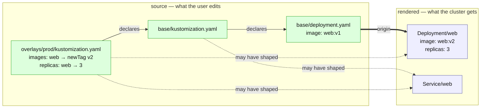
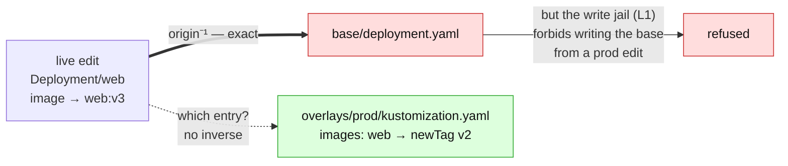
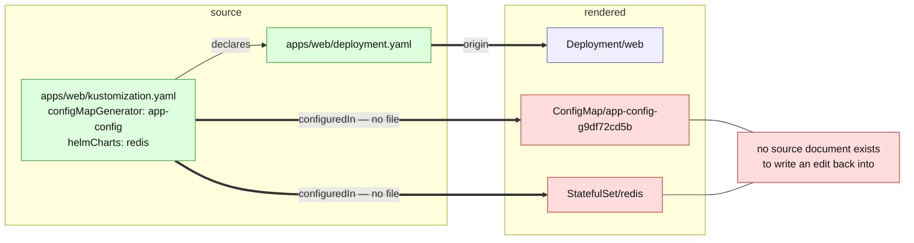
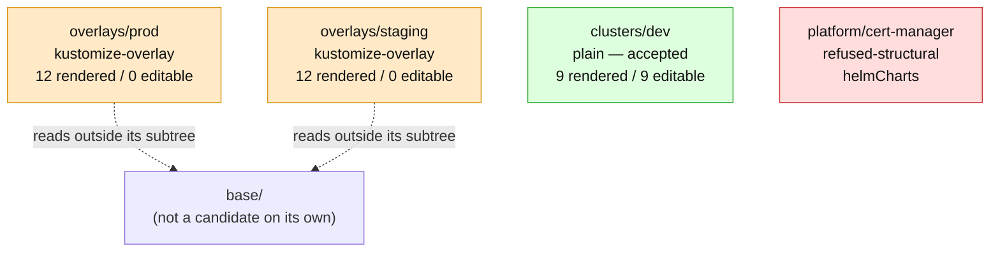

# The generated repo map: draw the inverse, and show where it does not exist

> **design** — direction-setting; ships no code. Nothing it describes is supported today.
> Captured: 2026-07-14
> Related:
> [README.md](README.md),
> [support-contract.md](support-contract.md),
> [kustomize-support-boundary.md](kustomize-support-boundary.md),
> [render-attribution.md](render-attribution.md),
> [render-root-scoping.md](render-root-scoping.md),
> [acceptance-precision.md](acceptance-precision.md),
> [repo-discovery-and-onboarding-scan.md](repo-discovery-and-onboarding-scan.md)

Can we generate, from a user's GitOps repo, a diagram that shows how their repo is
actually built — and that explains, visually, why parts of it cannot be reversed?

Yes. And it is cheaper than it looks, because **we already compute the graph and throw it
away**. But the diagram is only worth shipping if it is honest, and honesty here has a
precise meaning: *never draw an edge you cannot justify*. Kustomize will happily hand you
an edge that means "ran over this object" and let you mislabel it "changed this object".
The whole design problem is the fidelity of the arrows, not the drawing of them.

## 1. The reframe: the build DAG is the boring half

Every kustomize visualiser ever written draws the same picture — sources fan into an
overlay, an overlay fans into rendered YAML. Left to right, top to bottom, and it tells
the user nothing they did not already know from their directory listing.

We are not a build tool. We are a *reverser*. Our user's question is never "what does this
render to"; they can run `kustomize build`. Their question is:

> I changed the replica count in the cluster. **Which file are you going to write, and
> why can't you write it for this other thing?**

That is the inverse arrow. So the diagram must be drawn in the direction of the question:
from the live object back to the source. And once you draw it that way, the interesting
content is not the arrows that exist — it is **the arrows that have no inverse**. Those
are exactly the support boundary, and they are exactly what the user is confused about.

The build DAG is the substrate. The missing inverse edges are the product.

## 2. Four graphs, three of which we can already draw

| Tier | Edge | Source of truth | Fidelity | Cost to us |
|---|---|---|---|---|
| **1. Inclusion** | kustomization → resources / bases / components / patches / generators | `kustomization.yaml`, decoded with `kustypes.Kustomization` | **Exact.** Declared by the user. | Free — [`parseKustomizations`](../../../internal/manifestanalyzer/kustomization_parse.go) already runs on every scan. |
| **2. Origin** | source file → rendered object | kustomize's `config.kubernetes.io/origin` annotation | **Exact.** Kustomize stamps the file that produced the object. | Free — [`renderedObject.OriginPath`](../../../internal/manifestanalyzer/kustomize_render.go) is already populated, then discarded. |
| **3. Transformed-by** | kustomization → rendered object | kustomize's `alpha.config.kubernetes.io/transformations` annotation | **Over-approximate.** A superset. See below. | Free — [`renderedObject.TransformedBy`](../../../internal/manifestanalyzer/kustomize_render.go) is already populated, then discarded. |
| **4. Field attribution** | override *entry* → field of an object | — | **Does not exist.** | Requires the dye ([render-attribution.md](render-attribution.md) §3), or a fork. |

Tier 3 is the trap, and it is worth being exact about why, because the temptation to
mislabel it is enormous. Kustomize runs a transformer and then annotates **every resource
currently in the ResMap**, with no check that the transformer touched any of them
(`api/resmap/reswrangler.go`, `AddTransformerAnnotation` — it iterates `m.rList`
unconditionally; upstream's own `transformerannotation_test.go` shows a `Namespace` object
carrying two `PrefixTransformer` entries despite the prefix transformer excluding
namespaces by fieldspec). So:

> "Transformer X is in this object's annotation" means **X ran while this object was in
> the map**. It does not mean X changed it.

A diagram that draws that as `overlays/prod --changed--> Deployment/web` is lying, and it
is lying in the direction that makes the user trust a write we cannot actually perform.
Tier 3 edges must be drawn, but they must be drawn as *may have* — and they must look
different from tier 2 edges at a glance.

Tier 4 — "the `images:` entry at index 1 supplied `spec.template.spec.containers[0].image`" —
is the edge users most want, and kustomize does not have it at any level of its API. It is
not hidden behind an internal package; it is not computed at all. That is the subject of
[render-attribution.md](render-attribution.md); this doc simply must not pretend otherwise.

## 3. The legend is the thesis

Three line styles, and they are not cosmetic — each one is a claim about how much we know.



| Style | Meaning | Guarantee |
|---|---|---|
| `-->` **declares** | inclusion, read straight out of `kustomization.yaml` | exact |
| `==>` **origin** | this file produced this object | exact, from kustomize |
| `-.->` **may have shaped** | this kustomization's transformers ran over this object | **superset** — it may have changed nothing |

Note what the picture already tells the user, honestly: `Service/web` is dashed from both
kustomizations. It has no `images:` or `replicas:` entry that could possibly apply to it —
and yet kustomize's annotation names them both. The dashed edge is *correct* and the user
can see for themselves that it is weak. That is the diagram doing its job.

## 4. Now reverse it, and the boundary draws itself

Same repo, arrows reversed, and the question changed from "what renders" to "where does an
edit land".



Two different failures, in one picture, and the user can tell them apart:

- **The `newTag` arrow has no inverse.** Kustomize will not tell us that the `v2` in the
  rendered image came from the overlay's `newTag` rather than from the file's own tag. We
  can *guess* (and today we guess by re-implementing the transformer in
  [`overrides_projection.go`](../../../internal/manifestanalyzer/overrides_projection.go) —
  ~400 lines of re-implementation that [render-attribution.md](render-attribution.md) is
  trying to delete). The diagram should say *we cannot see this*, not invent an arrow.
- **The origin arrow exists and is exact, and we still refuse it.** Writing
  `base/deployment.yaml` because production changed would silently change staging too.
  That is [render-root-scoping.md](render-root-scoping.md) §4 / the L1 write jail in
  [`plan_flush.go`](../../../internal/git/plan_flush.go): *an edit to an object rendered by
  an overlay lands in that overlay, never in the base.*

These are the two sentences we currently make users discover by having a write refused. A
picture states both before they ever try.

## 5. The strongest visual we have: an arrow with no tail

The single clearest "this cannot be reversed" is not a colour or a label. It is a
**missing tail**.



This is not a metaphor we are imposing — it is literally what kustomize reports. For a
generated resource, the origin annotation carries **no `path`**; it carries `configuredIn:
kustomization.yaml` and `configuredBy: {apiVersion: builtin, kind: ConfigMapGenerator}`.
Our renderer already records this as an empty `OriginPath`
([`kustomize_render.go`](../../../internal/manifestanalyzer/kustomize_render.go): *"Empty
for a generated resource"*).

An object with an empty origin path is an object with no file. There is nowhere to write.
The diagram shows the arrow starting at a kustomization stanza instead of a document, and
the user understands the refusal in about two seconds — which is roughly two seconds
faster than any refusal message we could write.

The same trick covers the whole permanent boundary: `helmCharts`, `configMapGenerator`,
`secretGenerator`, and anything else that manufactures an object rather than including one.

## 6. The refusal overlay: colouring a graph we already have

The repo-level map needs no new analysis whatsoever. [`scan_repo.go`](../../../internal/manifestanalyzer/scan_repo.go)
already produces, per candidate subtree, exactly the node attributes a diagram needs — and
already emits them as JSON:

| Field in `RepoCandidate` | What it becomes in the diagram |
|---|---|
| `Path` | the node |
| `Layout` (`plain`, `kustomize-single`, `kustomize-overlay`, `refused-structural`) | the node's shape/colour |
| `AcceptedByOperator` | green vs red |
| `RefusalReasons[].Code` | the label on the red node — and the two codes must stay distinguishable: `overlay-fan-out-unsupported` is a **"not yet"**, `refused-structural` is the **permanent** boundary. A diagram that paints them the same red destroys the one distinction the discovery scan exists to preserve. |
| `ReadScope` | the dashed edges leaving the subtree — i.e. *this overlay reads a base you did not give us* |
| `Resources.Rendered` vs `.Editable` | the gap, printed on the node. `12 rendered / 0 editable` is the entire overlay problem in five characters. |
| `OverlapsWith` | a conflict edge — two candidates that can never both be adopted |



Amber for "not yet", red for "never", green for "adopt it now". That is the onboarding
conversation, generated.

And the same colouring extends to the per-document diagnostics the store already carries —
`kustomize-build-failed` ([`override_chain.go`](../../../internal/manifestanalyzer/override_chain.go)),
`ambiguous-kustomize-overrides` ([`overrides.go`](../../../internal/manifestanalyzer/overrides.go),
the fan-in > 1 case), `duplicate-identity`, `non-editable`. Each is already a
machine-readable reason attached to a path. Each is a node colour and a label. **We are not
building an analyser. We are building a renderer for the analyser we have.**

## 7. Traps — edges the drawing will beg you to add

| Tempting edge | Why it is wrong |
|---|---|
| `transformer --changed--> object` | Kustomize's annotation means *ran over*, not *changed* (§2). Every solid arrow here is a promise we cannot keep. |
| `images[1] --> containers[0].image` | Tier 4. Does not exist. The dye ([render-attribution.md](render-attribution.md) §3) is how you would earn it; until then, do not draw it. |
| `patch.yaml --> spec.replicas` | Same class of lie. A strategic-merge patch's *effect* is not reported per field. We know the patch ran; we do not know what it hit. |
| `object --edit-lands-here--> base/deployment.yaml` | Origin is exact, but the write jail forbids it (§4). **Origin is where it came from, not where the edit goes.** Conflating those two is the single most dangerous arrow on the page. |
| `origin ⇒ always a file` | Not always. When a transformer produces a resource that had no origin, kustomize writes the *transformer's* origin into the origin annotation. An origin can name a kustomization, not a document. |
| a diagram of `base/` drawn standalone | `buildMetadata` is honoured **only on the root kustomization**, and it is force-propagated down into bases (a base's own setting is overwritten). So a base rendered on its own and the same base seen through an overlay are two different graphs. Always diagram *a render root*, and say which one. |

## 8. Where it ships

Not the operator. This is an onboarding/explanation artifact, so it belongs with the
discovery work in the `manifest-analyzer` CLI — beside
[`RenderText` / `RenderJSON` / `RenderScanText`](../../../internal/manifestanalyzer/render.go),
as one more output format over data structures that already exist:

```
manifest-analyzer scan --repo . --format mermaid          # tier 1 repo map (§6)
manifest-analyzer explain --root overlays/prod --format mermaid   # tiers 1-3 (§3)
manifest-analyzer explain --object Deployment/web --format mermaid # the inverse (§4)
```

Three zoom levels, because **mermaid does not scale** and pretending otherwise wastes the
feature. A 200-app monorepo has thousands of objects; a single graph of it is an
unreadable hairball that no browser will lay out. The repo map is tens of nodes (one per
candidate). A render-root map is tens to low hundreds. An object's ancestry is a handful.
There is no fourth level, and "the whole repo's objects" is not a diagram, it is a denial
of service.

Two implementation notes that are easy to get wrong:

- **Node labels are user data.** Paths, resource names and kustomization stanzas come from
  the scanned repo and land in a client-rendered diagram. Sanitise IDs (index or hash them;
  never interpolate a path into a mermaid node id) and escape label text. A path containing
  a quote or a bracket must not be able to break — or extend — the diagram.
- **The render-root map needs one retention change.** Today
  [`renderChains`](../../../internal/manifestanalyzer/override_chain.go) keeps only the
  override assignments and drops the `renderedObject`s. The graph needs those objects kept.
  That is the same change [render-attribution.md](render-attribution.md) §7 step 1 already
  proposes for the oracle — so the diagram rides on it for free rather than justifying it
  alone.

## 9. Order of work

1. **Repo map from `RepoCandidate`** — pure rendering over an existing, already-JSON
   struct. No new analysis, no dependency on the render-attribution work. This is the piece
   that is worth doing *now*, and it is the one users see first.
2. **Render-root map** — after the `renderedObject` retention change lands for the oracle.
   Tiers 1–3, with the three-line-style legend.
3. **Object ancestry / the inverse view** — the §4 picture. This one is worth waiting for,
   because it should be generated from the *real* attribution (the dye) rather than from
   our re-implementation's guess. A diagram sourced from
   [`simulateImageRender`](../../../internal/manifestanalyzer/overrides_projection.go) would
   render our own bugs as if they were kustomize's behaviour.
4. **Refusal colouring everywhere** — fold `DiagReason` and `RefusalReason` into every
   level. Cheap once the nodes exist.

## Still open

- **Do the docs get generated diagrams too?** The corpus fixtures are real repos. A CI step
  that regenerates a mermaid per fixture would make the support boundary *visibly*
  regress-tested — a diff in the picture is a diff in the boundary. Tempting; it also makes
  every fixture change a diagram review.
- **Where does the user see it?** A CLI that prints mermaid is useful to us and to a
  motivated user pasting into a viewer. It is not yet a product surface. If the answer is
  eventually "in the UI", the graph should be emitted as data (nodes + typed edges + the
  fidelity of each edge) and rendered client-side — mermaid then becomes one renderer, not
  the format.
- **Should tier 3 be shown at all at the object level?** The dashed "may have shaped" edge
  is honest, but on a real overlay it connects nearly every kustomization to nearly every
  object, and a graph where everything is dashed-connected to everything teaches nothing.
  Possibly it should only appear when the user asks about a specific object (§4), where the
  fan-out is bounded and the ambiguity is the point.
- **Upstream.** A `BuildObserver`-style hook around the generator/transformer loop would
  give exact per-field provenance and collapse tiers 3 and 4 into one exact tier. That is
  worth *proposing* upstream ([render-attribution.md](render-attribution.md) §4 argues the
  fork is not), but nothing here should be blocked on it.
